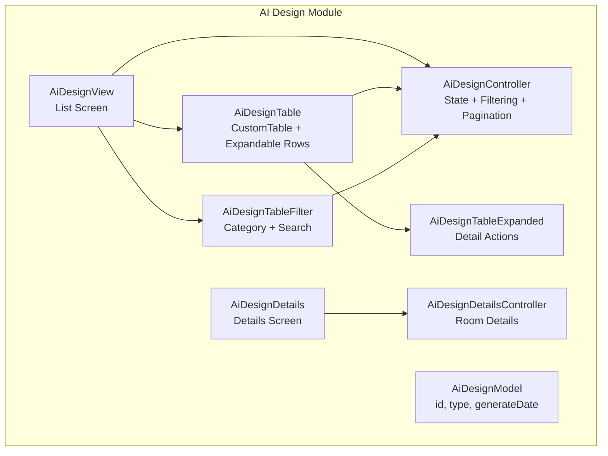
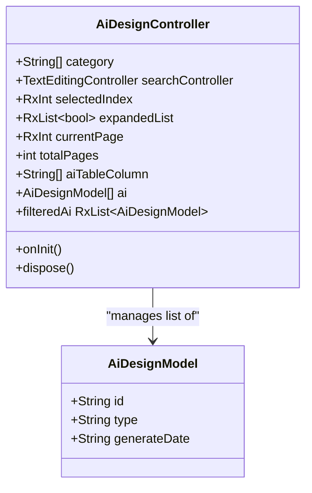
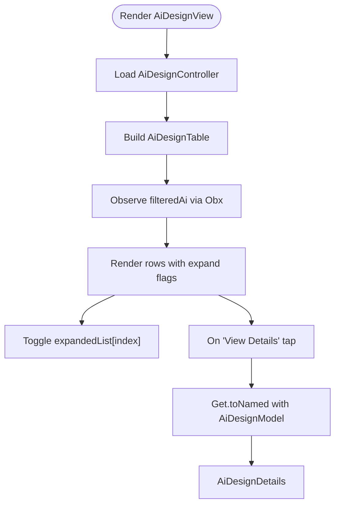
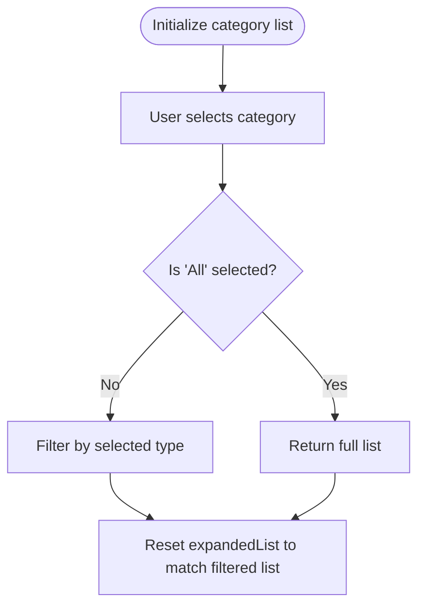
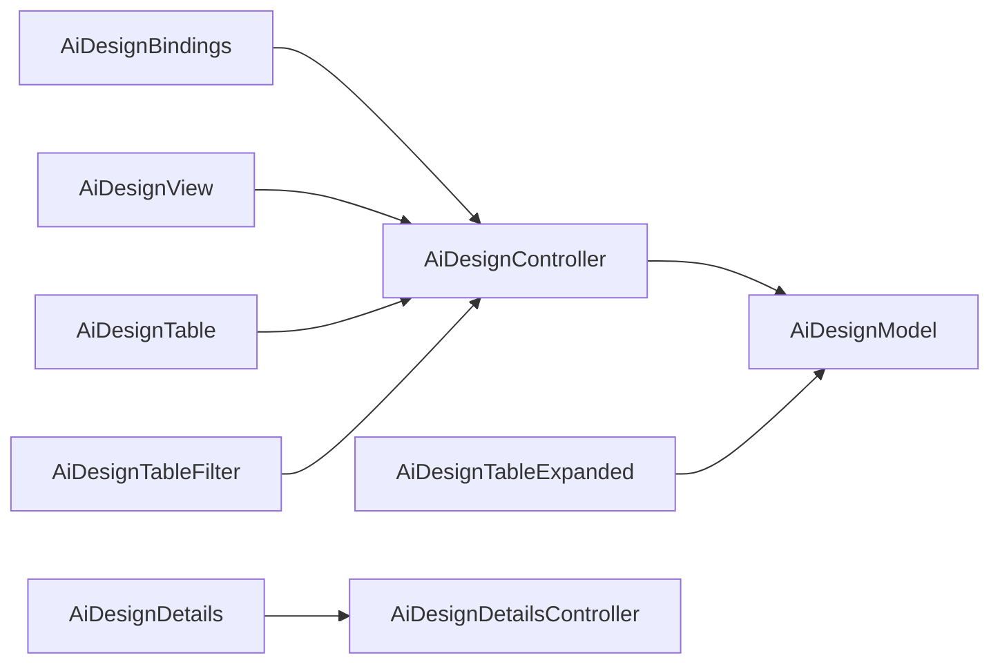

# AI Design Generation

<cite>
**Referenced Files in This Document**
- [ai_design_controller.dart](file://lib/features/ai_design/controller/ai_design_controller.dart)
- [ai_design_model.dart](file://lib/features/ai_design/models/ai_design_model.dart)
- [ai_design_bindings.dart](file://lib/features/ai_design/bindings/ai_design_bindings.dart)
- [ai_design_view.dart](file://lib/features/ai_design/views/ai_design_view.dart)
- [ai_design_table.dart](file://lib/features/ai_design/widgets/ai_design_view_widgets/ai_design_table.dart)
- [ai_design_table_filter.dart](file://lib/features/ai_design/widgets/ai_design_view_widgets/ai_design_table_filter.dart)
- [ai_design_table_expanded.dart](file://lib/features/ai_design/widgets/ai_design_view_widgets/ai_design_table_expanded.dart)
- [ai_design_details_controller.dart](file://lib/features/ai_design/controller/ai_design_details_controller.dart)
- [ai_design_details.dart](file://lib/features/ai_design/views/ai_design_details.dart)
- [home_ai_design.dart](file://lib/features/home/widgets/home_widgets/home_ai_design.dart)
</cite>

## Table of Contents
1. [Introduction](#introduction)
2. [Project Structure](#project-structure)
3. [Core Components](#core-components)
4. [Architecture Overview](#architecture-overview)
5. [Detailed Component Analysis](#detailed-component-analysis)
6. [Dependency Analysis](#dependency-analysis)
7. [Performance Considerations](#performance-considerations)
8. [Troubleshooting Guide](#troubleshooting-guide)
9. [Conclusion](#conclusion)

## Introduction
This document explains the AI Design Generation feature, focusing on the design creation workflow, category-based filtering, search functionality, pagination controls, controller state management, and UI components. It also covers the reactive state management using GetX, data binding patterns, and user interaction flows. The goal is to provide a clear understanding of how designs are created, filtered, paginated, and viewed, along with practical guidance for performance and maintenance.

## Project Structure
The AI Design feature is organized under the features/ai_design module with clear separation of concerns:
- Controller: Manages state, filtering, and pagination.
- Model: Defines the design entity structure.
- Views: Presentational screens for listing and details.
- Widgets: Reusable UI components for table, filters, and expanded rows.
- Bindings: Dependency injection setup for controllers.



**Diagram sources**
- [ai_design_controller.dart:5-71](file://lib/features/ai_design/controller/ai_design_controller.dart#L5-L71)
- [ai_design_model.dart:1-12](file://lib/features/ai_design/models/ai_design_model.dart#L1-L12)
- [ai_design_view.dart:14-55](file://lib/features/ai_design/views/ai_design_view.dart#L14-L55)
- [ai_design_table.dart:13-72](file://lib/features/ai_design/widgets/ai_design_view_widgets/ai_design_table.dart#L13-L72)
- [ai_design_table_filter.dart:9-50](file://lib/features/ai_design/widgets/ai_design_view_widgets/ai_design_table_filter.dart#L9-L50)
- [ai_design_table_expanded.dart:12-52](file://lib/features/ai_design/widgets/ai_design_view_widgets/ai_design_table_expanded.dart#L12-L52)
- [ai_design_details_controller.dart:3-48](file://lib/features/ai_design/controller/ai_design_details_controller.dart#L3-L48)
- [ai_design_details.dart:16-77](file://lib/features/ai_design/views/ai_design_details.dart#L16-L77)

**Section sources**
- [ai_design_controller.dart:5-71](file://lib/features/ai_design/controller/ai_design_controller.dart#L5-L71)
- [ai_design_model.dart:1-12](file://lib/features/ai_design/models/ai_design_model.dart#L1-L12)
- [ai_design_bindings.dart:5-11](file://lib/features/ai_design/bindings/ai_design_bindings.dart#L5-L11)
- [ai_design_view.dart:14-55](file://lib/features/ai_design/views/ai_design_view.dart#L14-L55)
- [ai_design_table.dart:13-72](file://lib/features/ai_design/widgets/ai_design_view_widgets/ai_design_table.dart#L13-L72)
- [ai_design_table_filter.dart:9-50](file://lib/features/ai_design/widgets/ai_design_view_widgets/ai_design_table_filter.dart#L9-L50)
- [ai_design_table_expanded.dart:12-52](file://lib/features/ai_design/widgets/ai_design_view_widgets/ai_design_table_expanded.dart#L12-L52)
- [ai_design_details_controller.dart:3-48](file://lib/features/ai_design/controller/ai_design_details_controller.dart#L3-L48)
- [ai_design_details.dart:16-77](file://lib/features/ai_design/views/ai_design_details.dart#L16-L77)

## Core Components
- AiDesignController: Central state manager for categories, search, expansion flags, pagination, and filtered design list.
- AiDesignModel: Immutable data model representing a single design record.
- AiDesignView: Top-level list screen integrating app bar, container layout, table, and pagination.
- AiDesignTable: Renders a custom table with expandable rows and action buttons.
- AiDesignTableFilter: Provides category filter dropdown and search input field.
- AiDesignTableExpanded: Displays detailed row content and actions for each design.
- AiDesignDetails: Details screen that routes to either Product Placement or AI Interior Design content based on type.
- AiDesignDetailsController: Supplies room configuration data for interior design details.

Key responsibilities:
- State management via GetX reactive variables (RxInt, RxList, Obx).
- Filtering logic based on category selection.
- Expansion toggles per row.
- Pagination controls bound to current page and total pages.
- Navigation to details with model argument passing.

**Section sources**
- [ai_design_controller.dart:5-71](file://lib/features/ai_design/controller/ai_design_controller.dart#L5-L71)
- [ai_design_model.dart:1-12](file://lib/features/ai_design/models/ai_design_model.dart#L1-L12)
- [ai_design_view.dart:14-55](file://lib/features/ai_design/views/ai_design_view.dart#L14-L55)
- [ai_design_table.dart:13-72](file://lib/features/ai_design/widgets/ai_design_view_widgets/ai_design_table.dart#L13-L72)
- [ai_design_table_filter.dart:9-50](file://lib/features/ai_design/widgets/ai_design_view_widgets/ai_design_table_filter.dart#L9-L50)
- [ai_design_table_expanded.dart:12-52](file://lib/features/ai_design/widgets/ai_design_view_widgets/ai_design_table_expanded.dart#L12-L52)
- [ai_design_details_controller.dart:3-48](file://lib/features/ai_design/controller/ai_design_details_controller.dart#L3-L48)
- [ai_design_details.dart:16-77](file://lib/features/ai_design/views/ai_design_details.dart#L16-L77)

## Architecture Overview
The AI Design feature follows a reactive MVVM-like pattern with GetX:
- Controllers hold state and expose reactive streams.
- Views observe controller state via GetView/Obx.
- Widgets encapsulate reusable UI logic and interact with controllers.
- Navigation passes model arguments to detail views.

```mermaid
sequenceDiagram
participant User as "User"
participant View as "AiDesignView"
participant Table as "AiDesignTable"
participant Filter as "AiDesignTableFilter"
participant Ctrl as "AiDesignController"
participant Router as "Get.toNamed"
participant Details as "AiDesignDetails"
User->>View : Open AI Designs
View->>Ctrl : Access reactive state
View->>Table : Render table with filteredAi
User->>Filter : Select category / Enter search
Filter->>Ctrl : Update selectedIndex / searchController.text
Ctrl-->>Table : Emit filteredAi via Obx
User->>Table : Tap "View Details"
Table->>Router : Navigate with AiDesignModel argument
Router-->>Details : Pass model to details view
Details-->>User : Show Product Placement or Interior Design content
```

**Diagram sources**
- [ai_design_view.dart:18-52](file://lib/features/ai_design/views/ai_design_view.dart#L18-L52)
- [ai_design_table.dart:22-67](file://lib/features/ai_design/widgets/ai_design_view_widgets/ai_design_table.dart#L22-L67)
- [ai_design_table_filter.dart:17-48](file://lib/features/ai_design/widgets/ai_design_view_widgets/ai_design_table_filter.dart#L17-L48)
- [ai_design_controller.dart:40-54](file://lib/features/ai_design/controller/ai_design_controller.dart#L40-L54)
- [ai_design_details.dart:21-61](file://lib/features/ai_design/views/ai_design_details.dart#L21-L61)

## Detailed Component Analysis

### Controller Implementation
The controller manages:
- Categories: ['All', 'AI Product Placement', 'AI Interior Design']
- Selected index for category filter
- Expanded list flags for each row
- Current page and total pages for pagination
- Search controller for text input
- Filtered list derived from category selection

Processing logic:
- filteredAi getter applies category filter to the base list.
- onInit initializes expandedList to match filteredAi length.
- dispose handles controller lifecycle cleanup.



**Diagram sources**
- [ai_design_controller.dart:5-71](file://lib/features/ai_design/controller/ai_design_controller.dart#L5-L71)
- [ai_design_model.dart:1-12](file://lib/features/ai_design/models/ai_design_model.dart#L1-L12)

**Section sources**
- [ai_design_controller.dart:5-71](file://lib/features/ai_design/controller/ai_design_controller.dart#L5-L71)
- [ai_design_model.dart:1-12](file://lib/features/ai_design/models/ai_design_model.dart#L1-L12)

### UI Components and Data Binding
- AiDesignView: Hosts app bar, title, table, and pagination. Uses theme-aware rendering and navigation triggers.
- AiDesignTable: Builds table rows from filteredAi, supports expand/collapse, and action button navigation to details.
- AiDesignTableFilter: Exposes category filter and search field; updates controller state reactively.
- AiDesignTableExpanded: Renders detail rows and triggers navigation to details.



**Diagram sources**
- [ai_design_view.dart:18-52](file://lib/features/ai_design/views/ai_design_view.dart#L18-L52)
- [ai_design_table.dart:22-67](file://lib/features/ai_design/widgets/ai_design_view_widgets/ai_design_table.dart#L22-L67)
- [ai_design_table_filter.dart:17-48](file://lib/features/ai_design/widgets/ai_design_view_widgets/ai_design_table_filter.dart#L17-L48)

**Section sources**
- [ai_design_view.dart:14-55](file://lib/features/ai_design/views/ai_design_view.dart#L14-L55)
- [ai_design_table.dart:13-72](file://lib/features/ai_design/widgets/ai_design_view_widgets/ai_design_table.dart#L13-L72)
- [ai_design_table_filter.dart:9-50](file://lib/features/ai_design/widgets/ai_design_view_widgets/ai_design_table_filter.dart#L9-L50)
- [ai_design_table_expanded.dart:12-52](file://lib/features/ai_design/widgets/ai_design_view_widgets/ai_design_table_expanded.dart#L12-L52)

### Design Details and Interaction Patterns
- AiDesignDetails: Receives AiDesignModel via arguments and renders either Product Placement or AI Interior Design content based on type.
- AiDesignDetailsController: Supplies structured room configuration data for interior design details.

```mermaid
sequenceDiagram
participant Table as "AiDesignTable"
participant Router as "Get.toNamed"
participant Details as "AiDesignDetails"
participant DtlsCtrl as "AiDesignDetailsController"
Table->>Router : Navigate with AiDesignModel
Router-->>Details : Provide model argument
Details->>DtlsCtrl : Access room details and titles
Details-->>Table : Render appropriate content
```

**Diagram sources**
- [ai_design_table.dart:57-61](file://lib/features/ai_design/widgets/ai_design_view_widgets/ai_design_table.dart#L57-L61)
- [ai_design_details.dart:21-61](file://lib/features/ai_design/views/ai_design_details.dart#L21-L61)
- [ai_design_details_controller.dart:3-48](file://lib/features/ai_design/controller/ai_design_details_controller.dart#L3-L48)

**Section sources**
- [ai_design_details.dart:16-77](file://lib/features/ai_design/views/ai_design_details.dart#L16-L77)
- [ai_design_details_controller.dart:3-48](file://lib/features/ai_design/controller/ai_design_details_controller.dart#L3-L48)

### Category Selection and Filtering Mechanism
- Category list includes 'All', 'AI Product Placement', and 'AI Interior Design'.
- filteredAi getter returns the full list when 'All' is selected, otherwise filters by type.
- AiDesignTableFilter updates controller.selectedIndex, which triggers filteredAi recomputation.



**Diagram sources**
- [ai_design_controller.dart:6-54](file://lib/features/ai_design/controller/ai_design_controller.dart#L6-L54)
- [ai_design_table_filter.dart:17-24](file://lib/features/ai_design/widgets/ai_design_view_widgets/ai_design_table_filter.dart#L17-L24)

**Section sources**
- [ai_design_controller.dart:6-54](file://lib/features/ai_design/controller/ai_design_controller.dart#L6-L54)
- [ai_design_table_filter.dart:9-50](file://lib/features/ai_design/widgets/ai_design_view_widgets/ai_design_table_filter.dart#L9-L50)

### Pagination Controls
- AiDesignView integrates CustomPagination with controller.currentPage and controller.totalPages.
- Pagination updates the current page state; filtering resets expandedList to match the filtered list length.

**Section sources**
- [ai_design_view.dart:46-49](file://lib/features/ai_design/views/ai_design_view.dart#L46-L49)
- [ai_design_controller.dart:10-11](file://lib/features/ai_design/controller/ai_design_controller.dart#L10-L11)
- [ai_design_controller.dart:59-62](file://lib/features/ai_design/controller/ai_design_controller.dart#L59-L62)

### Home Integration
- HomeAiDesign showcases related AI design steps and actions, complementing the AI Design feature.

**Section sources**
- [home_ai_design.dart:10-63](file://lib/features/home/widgets/home_widgets/home_ai_design.dart#L10-L63)

## Dependency Analysis
- AiDesignBindings registers controllers lazily for dependency injection.
- AiDesignController depends on AiDesignModel and uses GetX utilities.
- AiDesignTable depends on AiDesignController and Ui widgets.
- AiDesignDetails depends on AiDesignDetailsController for content.



**Diagram sources**
- [ai_design_bindings.dart:5-11](file://lib/features/ai_design/bindings/ai_design_bindings.dart#L5-L11)
- [ai_design_controller.dart:5-71](file://lib/features/ai_design/controller/ai_design_controller.dart#L5-L71)
- [ai_design_model.dart:1-12](file://lib/features/ai_design/models/ai_design_model.dart#L1-L12)
- [ai_design_view.dart:14-55](file://lib/features/ai_design/views/ai_design_view.dart#L14-L55)
- [ai_design_table.dart:13-72](file://lib/features/ai_design/widgets/ai_design_view_widgets/ai_design_table.dart#L13-L72)
- [ai_design_table_filter.dart:9-50](file://lib/features/ai_design/widgets/ai_design_view_widgets/ai_design_table_filter.dart#L9-L50)
- [ai_design_table_expanded.dart:12-52](file://lib/features/ai_design/widgets/ai_design_view_widgets/ai_design_table_expanded.dart#L12-L52)
- [ai_design_details_controller.dart:3-48](file://lib/features/ai_design/controller/ai_design_details_controller.dart#L3-L48)

**Section sources**
- [ai_design_bindings.dart:5-11](file://lib/features/ai_design/bindings/ai_design_bindings.dart#L5-L11)
- [ai_design_controller.dart:5-71](file://lib/features/ai_design/controller/ai_design_controller.dart#L5-L71)

## Performance Considerations
- Reactive recomputation: filteredAi rebuilds whenever selectedIndex changes; keep filter logic efficient.
- Large lists: Use virtualization or lazy loading strategies if the list grows beyond current size.
- Memory management: Dispose controllers and text controllers in dispose to prevent leaks.
- Expansion flags: expandedList is reset on filteredAi change; avoid unnecessary rebuilds by minimizing deep comparisons.
- Images and assets: Preload or cache assets used in expanded rows to reduce render overhead.

## Troubleshooting Guide
- Category filter not updating: Verify that AiDesignTableFilter calls controller.selectedIndex and that AiDesignTable observes filteredAi via Obx.
- Expanded rows not toggling: Confirm onExpand updates controller.expandedList[index] and that the table passes expandedList to CustomTable.
- Navigation to details fails: Ensure AiDesignModel is passed as Get.arguments and route name matches AppRoutes.aiDesignDetailsView.
- Pagination not visible: Check that CustomPagination receives controller.currentPage and controller.totalPages.

**Section sources**
- [ai_design_table_filter.dart:17-24](file://lib/features/ai_design/widgets/ai_design_view_widgets/ai_design_table_filter.dart#L17-L24)
- [ai_design_table.dart:41-47](file://lib/features/ai_design/widgets/ai_design_view_widgets/ai_design_table.dart#L41-L47)
- [ai_design_details.dart:21-61](file://lib/features/ai_design/views/ai_design_details.dart#L21-L61)
- [ai_design_view.dart:46-49](file://lib/features/ai_design/views/ai_design_view.dart#L46-L49)

## Conclusion
The AI Design Generation feature leverages GetX for reactive state management, providing a clean separation between UI and logic. Users can filter designs by category, search, paginate, and expand rows to view details. The modular widget architecture and dependency injection support maintainability and scalability. For production-grade performance, consider virtualization for large datasets, asset caching, and lifecycle-aware disposal of resources.