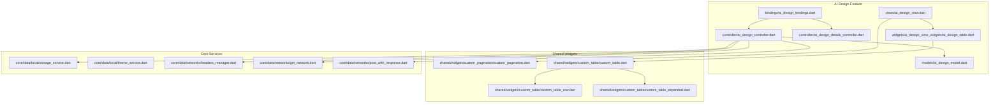
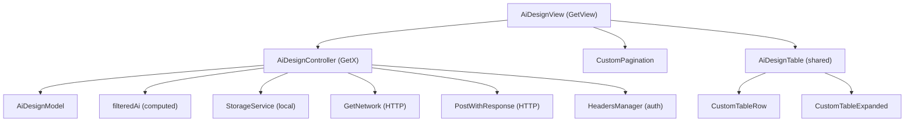
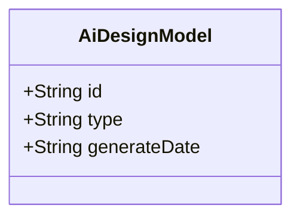
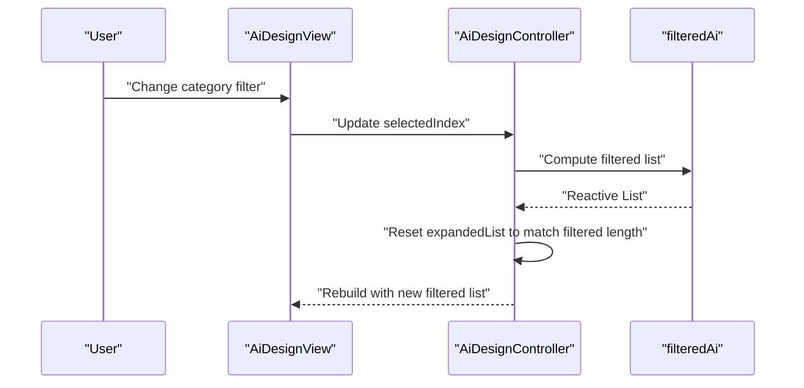
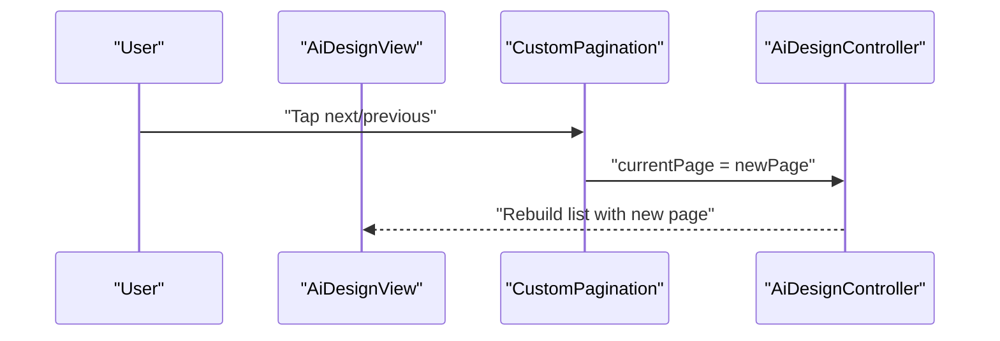
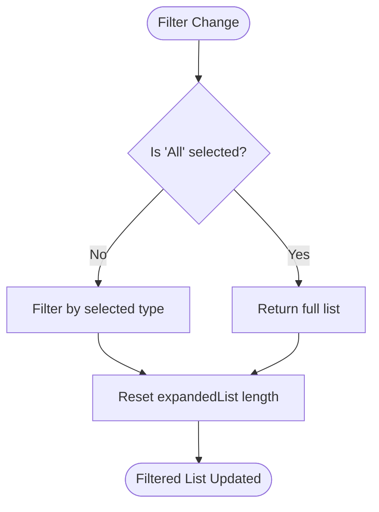
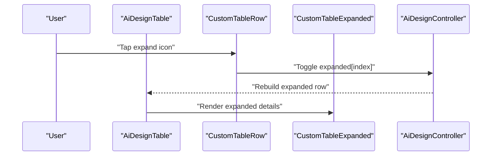
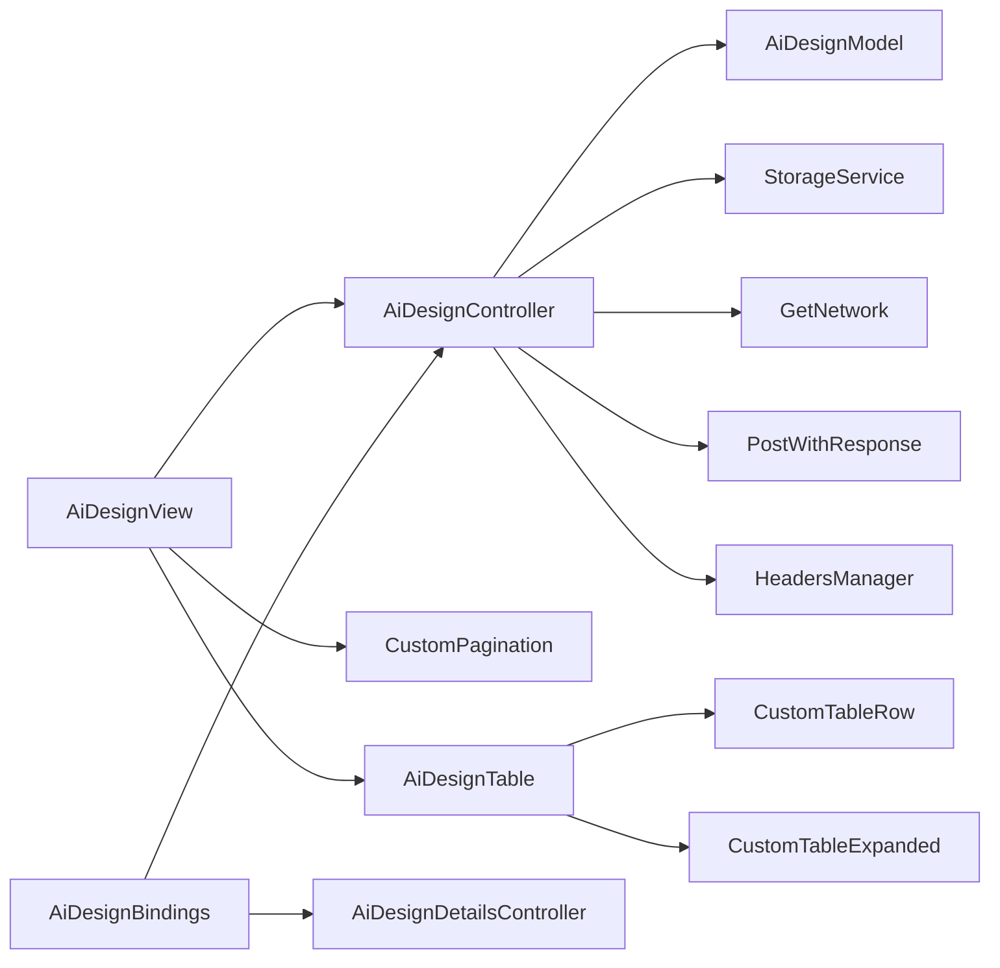

# AI Design History

<cite>
**Referenced Files in This Document**
- [ai_design_model.dart](file://lib/features/ai_design/models/ai_design_model.dart)
- [ai_design_controller.dart](file://lib/features/ai_design/controller/ai_design_controller.dart)
- [ai_design_details_controller.dart](file://lib/features/ai_design/controller/ai_design_details_controller.dart)
- [ai_design_bindings.dart](file://lib/features/ai_design/bindings/ai_design_bindings.dart)
- [ai_design_view.dart](file://lib/features/ai_design/views/ai_design_view.dart)
- [ai_design_table.dart](file://lib/features/ai_design/widgets/ai_design_view_widgets/ai_design_table.dart)
- [custom_pagination.dart](file://lib/shared/widgets/custom_pagination/custom_pagination.dart)
- [custom_table.dart](file://lib/shared/widgets/custom_table/custom_table.dart)
- [custom_table_row.dart](file://lib/shared/widgets/custom_table/custom_table_row.dart)
- [custom_table_expanded.dart](file://lib/shared/widgets/custom_table/custom_table_expanded.dart)
- [storage_service.dart](file://lib/core/data/local/storage_service.dart)
- [theme_service.dart](file://lib/core/data/local/theme_service.dart)
- [headers_manager.dart](file://lib/core/data/networks/headers_manager.dart)
- [get_network.dart](file://lib/core/data/networks/get_network.dart)
- [post_with_response.dart](file://lib/core/data/networks/post_with_response.dart)
</cite>

## Table of Contents
1. [Introduction](#introduction)
2. [Project Structure](#project-structure)
3. [Core Components](#core-components)
4. [Architecture Overview](#architecture-overview)
5. [Detailed Component Analysis](#detailed-component-analysis)
6. [Dependency Analysis](#dependency-analysis)
7. [Performance Considerations](#performance-considerations)
8. [Troubleshooting Guide](#troubleshooting-guide)
9. [Conclusion](#conclusion)

## Introduction
This document describes the AI Design History system, focusing on design listing, pagination, filtering, and reactive state management. It explains the design model structure, reactive collections, expandable rows, and interactive design cards. It also outlines navigation patterns, bulk operations, archive management, data persistence strategies, caching mechanisms, and cloud storage integration for design assets with local caching for offline access.

## Project Structure
The AI Design History feature is organized under the `features/ai_design` module with clear separation of concerns:
- Models define the design entity structure
- Controllers manage reactive state, filtering, pagination, and expansion
- Views assemble UI and integrate shared widgets
- Bindings provide dependency injection via GetX
- Shared widgets encapsulate reusable UI components like pagination and tables

**Diagram sources**
- [ai_design_model.dart:1-12](file://lib/features/ai_design/models/ai_design_model.dart#L1-L12)
- [ai_design_controller.dart:1-71](file://lib/features/ai_design/controller/ai_design_controller.dart#L1-L71)
- [ai_design_details_controller.dart:1-48](file://lib/features/ai_design/controller/ai_design_details_controller.dart#L1-L48)
- [ai_design_view.dart:1-55](file://lib/features/ai_design/views/ai_design_view.dart#L1-L55)
- [ai_design_bindings.dart:1-12](file://lib/features/ai_design/bindings/ai_design_bindings.dart#L1-L12)
- [custom_pagination.dart](file://lib/shared/widgets/custom_pagination/custom_pagination.dart)
- [custom_table.dart](file://lib/shared/widgets/custom_table/custom_table.dart)
- [custom_table_row.dart](file://lib/shared/widgets/custom_table/custom_table_row.dart)
- [custom_table_expanded.dart](file://lib/shared/widgets/custom_table/custom_table_expanded.dart)
- [storage_service.dart](file://lib/core/data/local/storage_service.dart)
- [theme_service.dart](file://lib/core/data/local/theme_service.dart)
- [headers_manager.dart](file://lib/core/data/networks/headers_manager.dart)
- [get_network.dart](file://lib/core/data/networks/get_network.dart)
- [post_with_response.dart](file://lib/core/data/networks/post_with_response.dart)

**Section sources**
- [ai_design_model.dart:1-12](file://lib/features/ai_design/models/ai_design_model.dart#L1-L12)
- [ai_design_controller.dart:1-71](file://lib/features/ai_design/controller/ai_design_controller.dart#L1-L71)
- [ai_design_details_controller.dart:1-48](file://lib/features/ai_design/controller/ai_design_details_controller.dart#L1-L48)
- [ai_design_view.dart:1-55](file://lib/features/ai_design/views/ai_design_view.dart#L1-L55)
- [ai_design_bindings.dart:1-12](file://lib/features/ai_design/bindings/ai_design_bindings.dart#L1-L12)

## Core Components
- Design Model: Defines the core attributes for a design record including identifier, type, and generation date.
- Controller: Manages reactive state for filters, pagination, expansion, and search. Provides filtered collections derived from the base list.
- View: Renders the design list, pagination controls, and integrates shared widgets.
- Bindings: Registers controllers with the dependency injection framework.
- Shared Widgets: Provide pagination, table layout, expandable rows, and status indicators.

Key responsibilities:
- Filtering by design type using a category selector
- Pagination with current page and total pages
- Expandable rows to show detailed information
- Reactive updates when filters change

**Section sources**
- [ai_design_model.dart:1-12](file://lib/features/ai_design/models/ai_design_model.dart#L1-L12)
- [ai_design_controller.dart:1-71](file://lib/features/ai_design/controller/ai_design_controller.dart#L1-L71)
- [ai_design_view.dart:1-55](file://lib/features/ai_design/views/ai_design_view.dart#L1-L55)

## Architecture Overview
The AI Design History follows a layered architecture:
- Presentation Layer: View renders UI and delegates interactions to the controller
- Domain Layer: Controller holds reactive state and computes derived collections
- Data Access Layer: Local storage service and network utilities handle persistence and remote operations
- Shared Layer: Reusable widgets encapsulate UI patterns like pagination and tables

**Diagram sources**
- [ai_design_view.dart:1-55](file://lib/features/ai_design/views/ai_design_view.dart#L1-L55)
- [ai_design_controller.dart:1-71](file://lib/features/ai_design/controller/ai_design_controller.dart#L1-L71)
- [ai_design_model.dart:1-12](file://lib/features/ai_design/models/ai_design_model.dart#L1-L12)
- [custom_pagination.dart](file://lib/shared/widgets/custom_pagination/custom_pagination.dart)
- [custom_table.dart](file://lib/shared/widgets/custom_table/custom_table.dart)
- [custom_table_row.dart](file://lib/shared/widgets/custom_table/custom_table_row.dart)
- [custom_table_expanded.dart](file://lib/shared/widgets/custom_table/custom_table_expanded.dart)
- [storage_service.dart](file://lib/core/data/local/storage_service.dart)
- [get_network.dart](file://lib/core/data/networks/get_network.dart)
- [post_with_response.dart](file://lib/core/data/networks/post_with_response.dart)
- [headers_manager.dart](file://lib/core/data/networks/headers_manager.dart)

## Detailed Component Analysis

### Design Model Structure
The design model defines the minimal set of fields required for history tracking:
- Identifier: Unique design ID
- Type: Category/type of design (e.g., AI Product Placement, AI Interior Design)
- Generation Date: Human-readable timestamp of creation

**Diagram sources**
- [ai_design_model.dart:1-12](file://lib/features/ai_design/models/ai_design_model.dart#L1-L12)

**Section sources**
- [ai_design_model.dart:1-12](file://lib/features/ai_design/models/ai_design_model.dart#L1-L12)

### Reactive State Management for Design Collections
The controller manages reactive state for:
- Category selection and filtering
- Search input
- Expanded rows per item
- Current page and total pages
- Computed filtered collection derived from the base list

Filtering logic:
- When "All" is selected, the full list is returned
- Otherwise, items are filtered by type equality against the selected category

Computed reactive list:
- The filtered list triggers expansion state initialization
- Expansion state array mirrors the length of the filtered list

**Diagram sources**
- [ai_design_controller.dart:40-63](file://lib/features/ai_design/controller/ai_design_controller.dart#L40-L63)
- [ai_design_view.dart:1-55](file://lib/features/ai_design/views/ai_design_view.dart#L1-L55)

**Section sources**
- [ai_design_controller.dart:1-71](file://lib/features/ai_design/controller/ai_design_controller.dart#L1-L71)

### Pagination Controls
The view integrates a pagination widget with:
- Current page observable
- Total pages constant
- Navigation to next/previous pages

Usage pattern:
- Pass current page and total pages to the pagination widget
- Handle page change events to update controller state

**Diagram sources**
- [ai_design_view.dart:46-49](file://lib/features/ai_design/views/ai_design_view.dart#L46-L49)
- [custom_pagination.dart](file://lib/shared/widgets/custom_pagination/custom_pagination.dart)

**Section sources**
- [ai_design_view.dart:46-49](file://lib/features/ai_design/views/ai_design_view.dart#L46-L49)

### Sorting Mechanisms
Sorting is not currently implemented in the controller. To add sorting:
- Introduce sort criteria (e.g., by date, type)
- Add a sort direction flag (ascending/descending)
- Compute a sorted reactive list derived from filteredAi

Recommended approach:
- Extend the controller with sort fields
- Apply sorting before pagination slicing
- Expose sort controls in the UI

[No sources needed since this section provides general guidance]

### Filtering by Design Type
Filtering is implemented via a category selector:
- Categories include "All", "AI Product Placement", and "AI Interior Design"
- The filtered list is computed based on the selected index
- Expansion state is reset when the filtered list changes

**Diagram sources**
- [ai_design_controller.dart:40-63](file://lib/features/ai_design/controller/ai_design_controller.dart#L40-L63)

**Section sources**
- [ai_design_controller.dart:6-54](file://lib/features/ai_design/controller/ai_design_controller.dart#L6-L54)

### Expandable Row Functionality
Each row supports expansion to reveal detailed information:
- Expansion state is tracked per item in an observable list
- On filter changes, expansion state is reinitialized to match the filtered list length
- Expanded content displays contextual details (e.g., room specifics)

**Diagram sources**
- [ai_design_controller.dart:9-62](file://lib/features/ai_design/controller/ai_design_controller.dart#L9-L62)
- [custom_table_row.dart](file://lib/shared/widgets/custom_table/custom_table_row.dart)
- [custom_table_expanded.dart](file://lib/shared/widgets/custom_table/custom_table_expanded.dart)

**Section sources**
- [ai_design_controller.dart:9-62](file://lib/features/ai_design/controller/ai_design_controller.dart#L9-L62)

### Interactive Design Cards
Interactive cards are composed from shared table components:
- Header row defines column titles
- Data rows render identifiers, types, and actions
- Action buttons trigger operations like preview, download, or archive

Integration points:
- AiDesignTable composes CustomTableRow and CustomTableExpanded
- Actions are handled within row components or via controller methods

**Section sources**
- [ai_design_table.dart](file://lib/features/ai_design/widgets/ai_design_view_widgets/ai_design_table.dart)
- [custom_table.dart](file://lib/shared/widgets/custom_table/custom_table.dart)
- [custom_table_row.dart](file://lib/shared/widgets/custom_table/custom_table_row.dart)
- [custom_table_expanded.dart](file://lib/shared/widgets/custom_table/custom_table_expanded.dart)

### Design History Navigation Examples
- From the AI Design view, users can:
  - Switch categories to filter designs
  - Navigate pages using pagination controls
  - Expand rows to inspect details
  - Trigger actions from row action buttons

Navigation flow:
- Category change → filtered list update → expansion reset → UI rebuild
- Page change → controller updates current page → UI rebuild

**Section sources**
- [ai_design_view.dart:1-55](file://lib/features/ai_design/views/ai_design_view.dart#L1-L55)
- [ai_design_controller.dart:40-63](file://lib/features/ai_design/controller/ai_design_controller.dart#L40-L63)

### Bulk Operations and Archive Management
Bulk operations are not implemented in the current codebase. Recommended implementation patterns:
- Selection checkboxes per row
- Batch action buttons (archive, delete, export)
- Controller methods to process selected items
- Archive endpoint integration via network utilities

Archive management:
- Move designs to an archive collection
- Update status tracking in the model
- Persist archive state locally and remotely

[No sources needed since this section provides general guidance]

### Data Persistence Strategies for Design Metadata
Local persistence:
- Store design metadata (IDs, types, dates) in a local database or JSON file
- Use the storage service for CRUD operations
- Maintain offline availability of history lists

Remote synchronization:
- Sync metadata with backend APIs
- Use headers manager for authentication tokens
- Handle conflicts and offline-first scenarios

**Section sources**
- [storage_service.dart](file://lib/core/data/local/storage_service.dart)
- [headers_manager.dart](file://lib/core/data/networks/headers_manager.dart)
- [get_network.dart](file://lib/core/data/networks/get_network.dart)
- [post_with_response.dart](file://lib/core/data/networks/post_with_response.dart)

### Caching Mechanisms for Frequently Accessed Designs
Caching strategies:
- Memory cache for current page and recent designs
- Disk cache for frequently viewed design details
- Invalidate cache on filter/page changes
- Use GetX reactive state to avoid redundant recomputation

Offline access:
- Preload popular designs
- Serve cached data immediately while syncing in the background

[No sources needed since this section provides general guidance]

### Performance Optimization for Large History Lists
Optimization techniques:
- Virtualization: Render only visible rows
- Debounced search/filter to reduce recomputation
- Pagination to limit rendered items per screen
- Efficient diffing in reactive lists
- Lazy loading for asset thumbnails

[No sources needed since this section provides general guidance]

### Cloud Storage Integration and Local Caching
Cloud storage integration:
- Upload/download design assets via network utilities
- Use authenticated headers for secure access
- Store asset URLs in design metadata

Local caching:
- Cache assets locally for offline viewing
- Manage cache size and cleanup policies
- Invalidate cache entries on metadata changes

**Section sources**
- [get_network.dart](file://lib/core/data/networks/get_network.dart)
- [post_with_response.dart](file://lib/core/data/networks/post_with_response.dart)
- [headers_manager.dart](file://lib/core/data/networks/headers_manager.dart)

## Dependency Analysis
The AI Design feature depends on shared widgets and core services:
- Controllers depend on models and shared UI components
- Views depend on controllers and shared widgets
- Bindings register controllers for dependency injection
- Network utilities and storage service provide data access

**Diagram sources**
- [ai_design_controller.dart:1-71](file://lib/features/ai_design/controller/ai_design_controller.dart#L1-L71)
- [ai_design_details_controller.dart:1-48](file://lib/features/ai_design/controller/ai_design_details_controller.dart#L1-L48)
- [ai_design_bindings.dart:1-12](file://lib/features/ai_design/bindings/ai_design_bindings.dart#L1-L12)
- [ai_design_view.dart:1-55](file://lib/features/ai_design/views/ai_design_view.dart#L1-L55)
- [custom_pagination.dart](file://lib/shared/widgets/custom_pagination/custom_pagination.dart)
- [custom_table.dart](file://lib/shared/widgets/custom_table/custom_table.dart)
- [custom_table_row.dart](file://lib/shared/widgets/custom_table/custom_table_row.dart)
- [custom_table_expanded.dart](file://lib/shared/widgets/custom_table/custom_table_expanded.dart)
- [storage_service.dart](file://lib/core/data/local/storage_service.dart)
- [get_network.dart](file://lib/core/data/networks/get_network.dart)
- [post_with_response.dart](file://lib/core/data/networks/post_with_response.dart)
- [headers_manager.dart](file://lib/core/data/networks/headers_manager.dart)

**Section sources**
- [ai_design_controller.dart:1-71](file://lib/features/ai_design/controller/ai_design_controller.dart#L1-L71)
- [ai_design_bindings.dart:1-12](file://lib/features/ai_design/bindings/ai_design_bindings.dart#L1-L12)
- [ai_design_view.dart:1-55](file://lib/features/ai_design/views/ai_design_view.dart#L1-L55)

## Performance Considerations
- Use virtualized lists for large datasets
- Debounce filter/search inputs
- Keep reactive lists small by applying pagination and filtering early
- Cache frequently accessed assets and metadata
- Minimize rebuild scope by isolating state changes

[No sources needed since this section provides general guidance]

## Troubleshooting Guide
Common issues and resolutions:
- Filters not updating: Ensure filteredAi is properly recomputed and expansion state is reset
- Pagination not working: Verify current page observable is updated and passed to the pagination widget
- Expansion state mismatch: Confirm expansion list length matches filtered list length after filter changes
- Network failures: Check headers manager for valid tokens and retry logic in network utilities

**Section sources**
- [ai_design_controller.dart:40-63](file://lib/features/ai_design/controller/ai_design_controller.dart#L40-L63)
- [headers_manager.dart](file://lib/core/data/networks/headers_manager.dart)
- [get_network.dart](file://lib/core/data/networks/get_network.dart)
- [post_with_response.dart](file://lib/core/data/networks/post_with_response.dart)

## Conclusion
The AI Design History system provides a solid foundation for browsing, filtering, and interacting with design records. The reactive controller, shared widgets, and dependency injection enable maintainable and scalable UI. Extending the system with sorting, bulk operations, archive management, and robust caching will further enhance usability and performance for large histories.