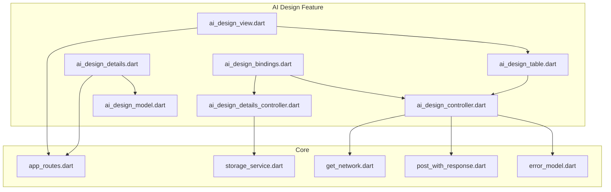
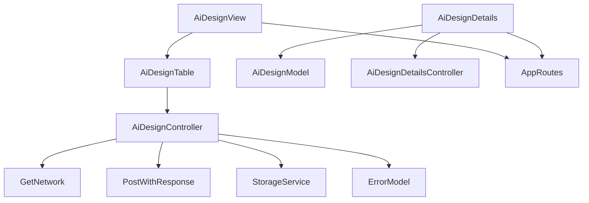
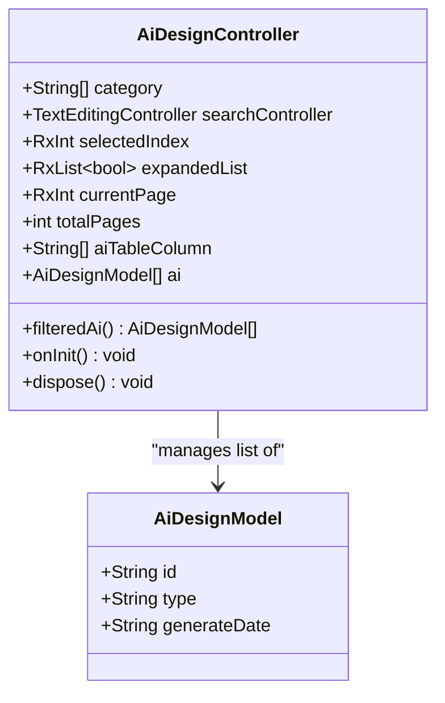
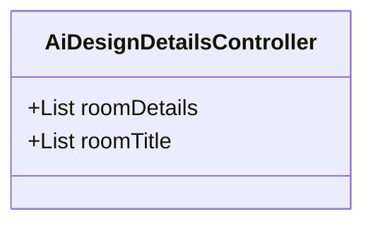
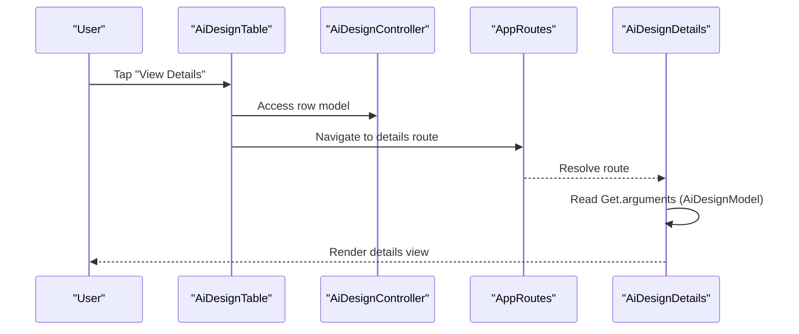
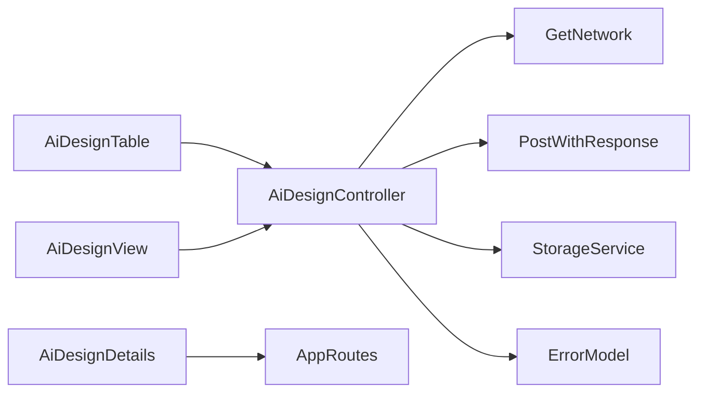

# AI Design Management

<cite>
**Referenced Files in This Document**
- [ai_design_controller.dart](file://lib/features/ai_design/controller/ai_design_controller.dart)
- [ai_design_details_controller.dart](file://lib/features/ai_design/controller/ai_design_details_controller.dart)
- [ai_design_model.dart](file://lib/features/ai_design/models/ai_design_model.dart)
- [ai_design_bindings.dart](file://lib/features/ai_design/bindings/ai_design_bindings.dart)
- [ai_design_view.dart](file://lib/features/ai_design/views/ai_design_view.dart)
- [ai_design_details.dart](file://lib/features/ai_design/views/ai_design_details.dart)
- [ai_design_table.dart](file://lib/features/ai_design/widgets/ai_design_view_widgets/ai_design_table.dart)
- [app_routes.dart](file://lib/core/routes/app_routes.dart)
- [storage_service.dart](file://lib/core/data/local/storage_service.dart)
- [get_network.dart](file://lib/core/data/networks/get_network.dart)
- [post_with_response.dart](file://lib/core/data/networks/post_with_response.dart)
- [error_model.dart](file://lib/core/data/global_models/error_model.dart)
</cite>

## Table of Contents
1. [Introduction](#introduction)
2. [Project Structure](#project-structure)
3. [Core Components](#core-components)
4. [Architecture Overview](#architecture-overview)
5. [Detailed Component Analysis](#detailed-component-analysis)
6. [Dependency Analysis](#dependency-analysis)
7. [Performance Considerations](#performance-considerations)
8. [Troubleshooting Guide](#troubleshooting-guide)
9. [Conclusion](#conclusion)

## Introduction
This document describes the AI design management capabilities implemented in the application. It focuses on the design listing and detailed views, including filtering, pagination, navigation, and state management. It also documents the design details controller, preview functionality, editing options, and management operations. Where applicable, it outlines integration points for downloads, sharing, offline viewing, and performance optimization for image rendering.

## Project Structure
The AI design feature is organized under the features module with clear separation of concerns:
- Controllers manage state and business logic
- Views render UI and orchestrate navigation
- Widgets encapsulate reusable components
- Models define data structures
- Bindings integrate controllers with the dependency injection framework

**Diagram sources**
- [ai_design_bindings.dart:1-12](file://lib/features/ai_design/bindings/ai_design_bindings.dart#L1-L12)
- [ai_design_controller.dart:1-71](file://lib/features/ai_design/controller/ai_design_controller.dart#L1-L71)
- [ai_design_details_controller.dart:1-49](file://lib/features/ai_design/controller/ai_design_details_controller.dart#L1-L49)
- [ai_design_model.dart:1-12](file://lib/features/ai_design/models/ai_design_model.dart#L1-L12)
- [ai_design_view.dart:1-55](file://lib/features/ai_design/views/ai_design_view.dart#L1-L55)
- [ai_design_details.dart:1-78](file://lib/features/ai_design/views/ai_design_details.dart#L1-L78)
- [ai_design_table.dart:1-72](file://lib/features/ai_design/widgets/ai_design_view_widgets/ai_design_table.dart#L1-L72)
- [app_routes.dart](file://lib/core/routes/app_routes.dart)
- [storage_service.dart](file://lib/core/data/local/storage_service.dart)
- [get_network.dart](file://lib/core/data/networks/get_network.dart)
- [post_with_response.dart](file://lib/core/data/networks/post_with_response.dart)
- [error_model.dart](file://lib/core/data/global_models/error_model.dart)

**Section sources**
- [ai_design_bindings.dart:1-12](file://lib/features/ai_design/bindings/ai_design_bindings.dart#L1-L12)
- [ai_design_controller.dart:1-71](file://lib/features/ai_design/controller/ai_design_controller.dart#L1-L71)
- [ai_design_details_controller.dart:1-49](file://lib/features/ai_design/controller/ai_design_details_controller.dart#L1-L49)
- [ai_design_model.dart:1-12](file://lib/features/ai_design/models/ai_design_model.dart#L1-L12)
- [ai_design_view.dart:1-55](file://lib/features/ai_design/views/ai_design_view.dart#L1-L55)
- [ai_design_details.dart:1-78](file://lib/features/ai_design/views/ai_design_details.dart#L1-L78)
- [ai_design_table.dart:1-72](file://lib/features/ai_design/widgets/ai_design_view_widgets/ai_design_table.dart#L1-L72)

## Core Components
- AiDesignController: Manages design listing state, filtering, expansion flags, pagination, and search.
- AiDesignDetailsController: Provides room configuration data for design details rendering.
- AiDesignModel: Immutable data model representing a design entry.
- AiDesignView: Renders the listing page with app bar, filter drawer, table, and pagination.
- AiDesignDetails: Renders the detailed view with dynamic content selection and preview area.
- AiDesignTable: Builds the table UI, handles expandable rows, and navigates to details.
- Bindings: Registers controllers with the DI container.

Key responsibilities:
- Filtering: Category-based filtering via selected index and static category list.
- Expansion: Per-row expansion state synchronized with controller.
- Navigation: Route-based navigation to details view with model argument passing.
- Pagination: Page state maintained in controller for UI consumption.

**Section sources**
- [ai_design_controller.dart:5-71](file://lib/features/ai_design/controller/ai_design_controller.dart#L5-L71)
- [ai_design_details_controller.dart:3-49](file://lib/features/ai_design/controller/ai_design_details_controller.dart#L3-L49)
- [ai_design_model.dart:1-12](file://lib/features/ai_design/models/ai_design_model.dart#L1-L12)
- [ai_design_view.dart:14-55](file://lib/features/ai_design/views/ai_design_view.dart#L14-L55)
- [ai_design_details.dart:16-78](file://lib/features/ai_design/views/ai_design_details.dart#L16-L78)
- [ai_design_table.dart:13-72](file://lib/features/ai_design/widgets/ai_design_view_widgets/ai_design_table.dart#L13-L72)
- [ai_design_bindings.dart:5-12](file://lib/features/ai_design/bindings/ai_design_bindings.dart#L5-L12)

## Architecture Overview
The AI design feature follows a layered architecture:
- Presentation Layer: Views and widgets
- Business Logic Layer: Controllers
- Data Layer: Models, network utilities, and storage service
- Routing: Centralized route definitions

**Diagram sources**
- [ai_design_view.dart:14-55](file://lib/features/ai_design/views/ai_design_view.dart#L14-L55)
- [ai_design_details.dart:16-78](file://lib/features/ai_design/views/ai_design_details.dart#L16-L78)
- [ai_design_table.dart:13-72](file://lib/features/ai_design/widgets/ai_design_view_widgets/ai_design_table.dart#L13-L72)
- [ai_design_controller.dart:5-71](file://lib/features/ai_design/controller/ai_design_controller.dart#L5-L71)
- [ai_design_details_controller.dart:3-49](file://lib/features/ai_design/controller/ai_design_details_controller.dart#L3-L49)
- [ai_design_model.dart:1-12](file://lib/features/ai_design/models/ai_design_model.dart#L1-L12)
- [app_routes.dart](file://lib/core/routes/app_routes.dart)
- [get_network.dart](file://lib/core/data/networks/get_network.dart)
- [post_with_response.dart](file://lib/core/data/networks/post_with_response.dart)
- [storage_service.dart](file://lib/core/data/local/storage_service.dart)
- [error_model.dart](file://lib/core/data/global_models/error_model.dart)

## Detailed Component Analysis

### Design Listing Controller (AiDesignController)
Responsibilities:
- Maintains category list and selected index for filtering
- Holds search controller and pagination state
- Provides filteredAi reactive list derived from category selection
- Initializes expansion flags for table rows based on filtered list length
- Disposes search controller on dispose

Processing logic:
- filteredAi getter applies category filter to static dataset
- onInit initializes expandedList to match filteredAi length
- dispose cleans up search controller

**Diagram sources**
- [ai_design_controller.dart:5-71](file://lib/features/ai_design/controller/ai_design_controller.dart#L5-L71)
- [ai_design_model.dart:1-12](file://lib/features/ai_design/models/ai_design_model.dart#L1-L12)

**Section sources**
- [ai_design_controller.dart:5-71](file://lib/features/ai_design/controller/ai_design_controller.dart#L5-L71)
- [ai_design_model.dart:1-12](file://lib/features/ai_design/models/ai_design_model.dart#L1-L12)

### Design Details Controller (AiDesignDetailsController)
Responsibilities:
- Supplies room configuration data for rendering details UI
- Defines room section titles for structured editing options

Processing logic:
- Maintains nested lists for room details and section titles
- Supports five-room configuration sections with predefined keys

**Diagram sources**
- [ai_design_details_controller.dart:3-49](file://lib/features/ai_design/controller/ai_design_details_controller.dart#L3-L49)

**Section sources**
- [ai_design_details_controller.dart:3-49](file://lib/features/ai_design/controller/ai_design_details_controller.dart#L3-L49)

### Design Model (AiDesignModel)
Responsibilities:
- Immutable data carrier for design entries
- Fields: id, type, generateDate

Complexity:
- O(1) access for all fields
- Suitable for reactive updates in UI

**Section sources**
- [ai_design_model.dart:1-12](file://lib/features/ai_design/models/ai_design_model.dart#L1-L12)

### Design Listing View (AiDesignView)
Responsibilities:
- Renders top-level listing UI
- Integrates app bar with drawer trigger
- Displays title and pagination
- Hosts AiDesignTable widget

Navigation pattern:
- Opens a custom drawer via dialog on app bar drawer tap
- Uses CustomPagination bound to controller's currentPage and totalPages

**Section sources**
- [ai_design_view.dart:14-55](file://lib/features/ai_design/views/ai_design_view.dart#L14-L55)

### Design Details View (AiDesignDetails)
Responsibilities:
- Receives AiDesignModel via Get.arguments
- Renders dynamic content based on design type
- Displays preview area with asset image
- Provides Back navigation

Integration:
- Uses Get.arguments to access passed model
- Conditionally renders AiProductPlacement or AiInteriorDesign based on type
- Navigates back using Navigator.pop

**Section sources**
- [ai_design_details.dart:16-78](file://lib/features/ai_design/views/ai_design_details.dart#L16-L78)

### Design Table Widget (AiDesignTable)
Responsibilities:
- Builds a custom table with rows mapped from filteredAi
- Handles row expansion toggling
- Generates action buttons to navigate to details view
- Passes AiDesignModel as argument to details route

Processing logic:
- Maps filteredAi to table rows with model attachment
- Expands/collapses rows via controller.expandedList
- On action press, navigates to details route with model argument

**Diagram sources**
- [ai_design_table.dart:50-65](file://lib/features/ai_design/widgets/ai_design_view_widgets/ai_design_table.dart#L50-L65)
- [app_routes.dart](file://lib/core/routes/app_routes.dart)
- [ai_design_details.dart:21](file://lib/features/ai_design/views/ai_design_details.dart#L21)

**Section sources**
- [ai_design_table.dart:13-72](file://lib/features/ai_design/widgets/ai_design_view_widgets/ai_design_table.dart#L13-L72)

### Binding Integration (AiDesignBindings)
Responsibilities:
- Registers AiDesignController and AiDesignDetailsController with lazy loading
- Ensures controllers are available when views require them

**Section sources**
- [ai_design_bindings.dart:5-12](file://lib/features/ai_design/bindings/ai_design_bindings.dart#L5-L12)

## Dependency Analysis
Controllers depend on:
- Reactive state management (GetX) for observables
- Network utilities for data fetching/sync
- Storage service for offline persistence
- Error model for consistent error handling

Views depend on:
- Controllers via GetView/GetWidget
- Routes for navigation
- Shared widgets for UI consistency

**Diagram sources**
- [ai_design_controller.dart:5-71](file://lib/features/ai_design/controller/ai_design_controller.dart#L5-L71)
- [ai_design_table.dart:13-72](file://lib/features/ai_design/widgets/ai_design_view_widgets/ai_design_table.dart#L13-L72)
- [ai_design_view.dart:14-55](file://lib/features/ai_design/views/ai_design_view.dart#L14-L55)
- [ai_design_details.dart:16-78](file://lib/features/ai_design/views/ai_design_details.dart#L16-L78)
- [get_network.dart](file://lib/core/data/networks/get_network.dart)
- [post_with_response.dart](file://lib/core/data/networks/post_with_response.dart)
- [storage_service.dart](file://lib/core/data/local/storage_service.dart)
- [error_model.dart](file://lib/core/data/global_models/error_model.dart)
- [app_routes.dart](file://lib/core/routes/app_routes.dart)

**Section sources**
- [ai_design_controller.dart:5-71](file://lib/features/ai_design/controller/ai_design_controller.dart#L5-L71)
- [ai_design_table.dart:13-72](file://lib/features/ai_design/widgets/ai_design_view_widgets/ai_design_table.dart#L13-L72)
- [ai_design_view.dart:14-55](file://lib/features/ai_design/views/ai_design_view.dart#L14-L55)
- [ai_design_details.dart:16-78](file://lib/features/ai_design/views/ai_design_details.dart#L16-L78)

## Performance Considerations
- Image rendering:
  - Use appropriate BoxFit and sizing to avoid unnecessary recompositions
  - Consider caching frequently accessed assets
  - Lazy-load previews when feasible
- Reactive updates:
  - filteredAi is computed reactively; keep filters lightweight
  - expandedList updates per row; ensure minimal rebuild scope
- Pagination:
  - currentPage is observable; avoid triggering unnecessary reloads
- Network operations:
  - Batch requests where possible
  - Implement retry with exponential backoff for transient failures

## Troubleshooting Guide
Common issues and resolutions:
- Corrupted design data:
  - Validate AiDesignModel fields before rendering
  - Use try-catch around asset loading and fallback to placeholders
- Service connectivity issues:
  - Wrap network calls with error handling and user feedback
  - Implement offline mode using StorageService for cached data
- Navigation problems:
  - Verify AppRoutes configuration and argument passing
  - Ensure Get.arguments is properly typed and handled

**Section sources**
- [error_model.dart](file://lib/core/data/global_models/error_model.dart)
- [storage_service.dart](file://lib/core/data/local/storage_service.dart)
- [get_network.dart](file://lib/core/data/networks/get_network.dart)
- [post_with_response.dart](file://lib/core/data/networks/post_with_response.dart)

## Conclusion
The AI design management feature provides a structured foundation for design listing, filtering, expansion, and detailed viewing. Controllers encapsulate state and logic, while views focus on presentation and navigation. The modular architecture supports future enhancements such as download/export, sharing, and offline viewing capabilities through integration with network utilities, storage, and routing.