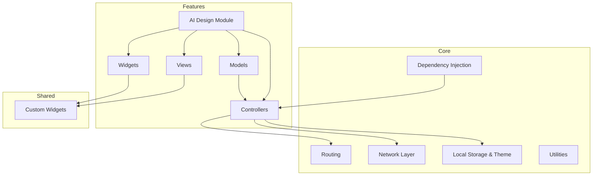
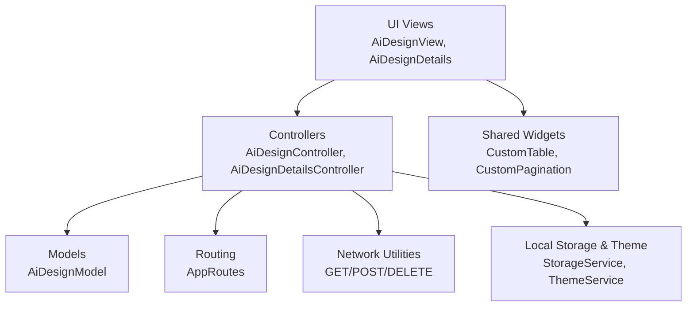
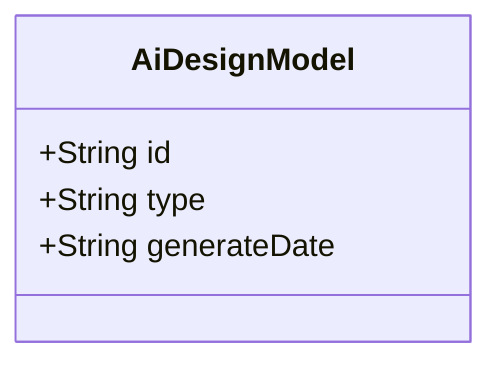
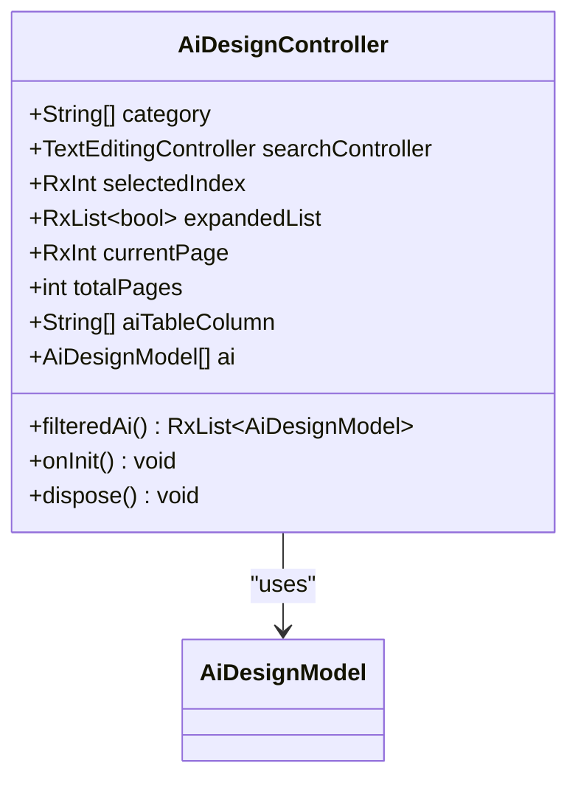
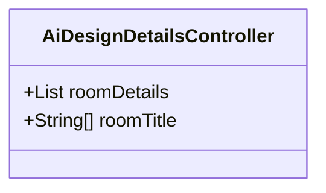
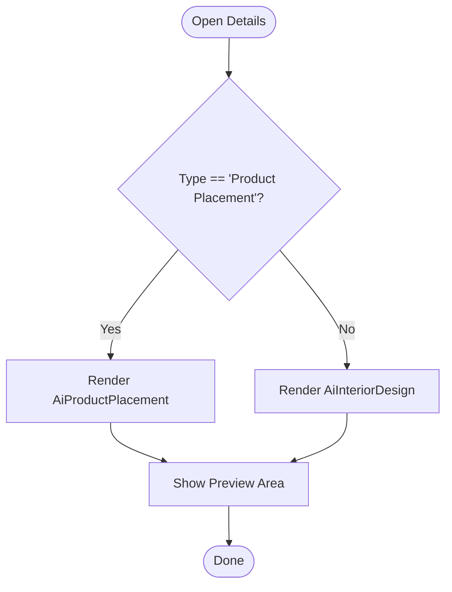
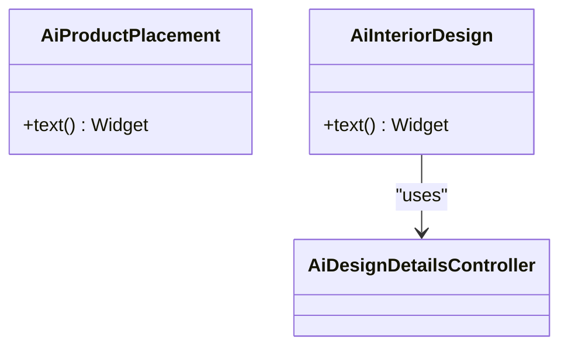
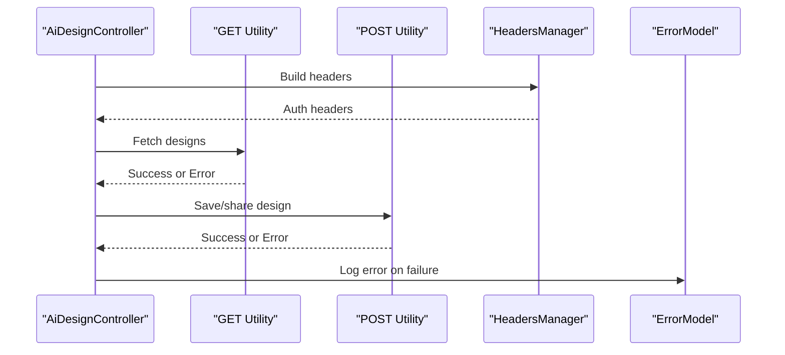
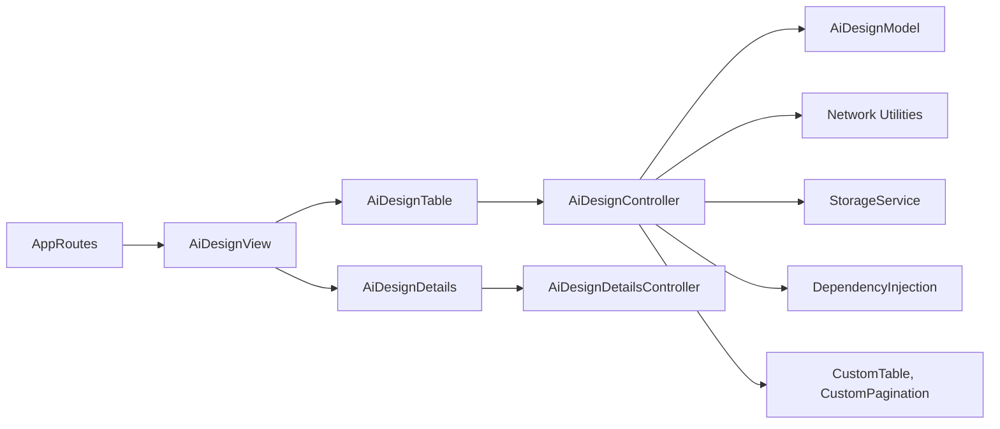

# AI Design System

<cite>
**Referenced Files in This Document**
- [pubspec.yaml](file://pubspec.yaml)
- [README.md](file://README.md)
- [main.dart](file://lib/main.dart)
- [app_routes.dart](file://lib/core/routes/app_routes.dart)
- [routes.dart](file://lib/core/routes/routes.dart)
- [dependency_injection.dart](file://lib/core/di/dependency_injection.dart)
- [colors.dart](file://lib/core/constant/colors.dart)
- [icons_path.dart](file://lib/core/constant/icons_path.dart)
- [images_path.dart](file://lib/core/constant/images_path.dart)
- [storage_service.dart](file://lib/core/data/local/storage_service.dart)
- [theme_service.dart](file://lib/core/data/local/theme_service.dart)
- [get_network.dart](file://lib/core/data/networks/get_network.dart)
- [post_with_response.dart](file://lib/core/data/networks/post_with_response.dart)
- [post_without_response.dart](file://lib/core/data/networks/post_without_response.dart)
- [delete_network.dart](file://lib/core/data/networks/delete_network.dart)
- [headers_manager.dart](file://lib/core/data/networks/headers_manager.dart)
- [error_model.dart](file://lib/core/data/global_models/error_model.dart)
- [user_profile_model.dart](file://lib/core/data/global_models/user_profile_model.dart)
- [date_picker.dart](file://lib/core/utils/date_picker.dart)
- [image_picker.dart](file://lib/core/utils/image_picker.dart)
- [ai_design_model.dart](file://lib/features/ai_design/models/ai_design_model.dart)
- [ai_design_bindings.dart](file://lib/features/ai_design/bindings/ai_design_bindings.dart)
- [ai_design_controller.dart](file://lib/features/ai_design/controller/ai_design_controller.dart)
- [ai_design_details_controller.dart](file://lib/features/ai_design/controller/ai_design_details_controller.dart)
- [ai_design_view.dart](file://lib/features/ai_design/views/ai_design_view.dart)
- [ai_design_details.dart](file://lib/features/ai_design/views/ai_design_details.dart)
- [ai_design_table.dart](file://lib/features/ai_design/widgets/ai_design_view_widgets/ai_design_table.dart)
- [ai_design_table_filter.dart](file://lib/features/ai_design/widgets/ai_design_view_widgets/ai_design_table_filter.dart)
- [ai_design_table_expanded.dart](file://lib/features/ai_design/widgets/ai_design_view_widgets/ai_design_table_expanded.dart)
- [ai_interior_design.dart](file://lib/features/ai_design/widgets/ai_design_details_widgets/ai_interior_design.dart)
- [ai_product_placement.dart](file://lib/features/ai_design/widgets/ai_design_details_widgets/ai_product_placement.dart)
- [home_ai_design.dart](file://lib/features/home/widgets/home_widgets/home_ai_design.dart)
- [custom_table.dart](file://lib/shared/widgets/custom_table/custom_table.dart)
- [custom_pagination.dart](file://lib/shared/widgets/custom_pagination/custom_pagination.dart)
- [custom_secondary_button.dart](file://lib/shared/widgets/custom_button/custom_secondary_button.dart)
- [shared_container.dart](file://lib/shared/widgets/shared_container.dart)
- [custom_appbar.dart](file://lib/shared/widgets/custom_appbar.dart)
</cite>

## Table of Contents
1. [Introduction](#introduction)
2. [Project Structure](#project-structure)
3. [Core Components](#core-components)
4. [Architecture Overview](#architecture-overview)
5. [Detailed Component Analysis](#detailed-component-analysis)
6. [Dependency Analysis](#dependency-analysis)
7. [Performance Considerations](#performance-considerations)
8. [Troubleshooting Guide](#troubleshooting-guide)
9. [Conclusion](#conclusion)
10. [Appendices](#appendices)

## Introduction
This document describes the AI design system for ZB-DEZINE, focusing on the AI design generation workflow, product placement functionality, and design preview/editing features. It explains how the system integrates with AI services, manages design data models, and orchestrates user interactions. It also documents controller implementations for design creation, editing, and management, along with the design history system, saving mechanisms, and sharing capabilities. API integration patterns, error handling for AI service failures, and performance optimization strategies are covered, alongside examples of design generation processes and customization options.

## Project Structure
The AI design system is organized under the features module with dedicated controllers, models, views, and widgets. Supporting infrastructure includes routing, dependency injection, network utilities, and shared UI components.



**Diagram sources**
- [ai_design_controller.dart](file://lib/features/ai_design/controller/ai_design_controller.dart)
- [ai_design_details_controller.dart](file://lib/features/ai_design/controller/ai_design_details_controller.dart)
- [ai_design_model.dart](file://lib/features/ai_design/models/ai_design_model.dart)
- [ai_design_view.dart](file://lib/features/ai_design/views/ai_design_view.dart)
- [ai_design_details.dart](file://lib/features/ai_design/views/ai_design_details.dart)
- [ai_design_table.dart](file://lib/features/ai_design/widgets/ai_design_view_widgets/ai_design_table.dart)
- [ai_interior_design.dart](file://lib/features/ai_design/widgets/ai_design_details_widgets/ai_interior_design.dart)
- [ai_product_placement.dart](file://lib/features/ai_design/widgets/ai_design_details_widgets/ai_product_placement.dart)
- [app_routes.dart](file://lib/core/routes/app_routes.dart)
- [dependency_injection.dart](file://lib/core/di/dependency_injection.dart)
- [get_network.dart](file://lib/core/data/networks/get_network.dart)
- [post_with_response.dart](file://lib/core/data/networks/post_with_response.dart)
- [post_without_response.dart](file://lib/core/data/networks/post_without_response.dart)
- [storage_service.dart](file://lib/core/data/local/storage_service.dart)
- [theme_service.dart](file://lib/core/data/local/theme_service.dart)
- [custom_table.dart](file://lib/shared/widgets/custom_table/custom_table.dart)
- [custom_pagination.dart](file://lib/shared/widgets/custom_pagination/custom_pagination.dart)

**Section sources**
- [pubspec.yaml](file://pubspec.yaml)
- [README.md](file://README.md)

## Core Components
- AI Design Model: Defines the structure for design entries including identifiers, types, and generation dates.
- Controllers:
  - AiDesignController: Manages filtering, pagination, expansion states, and mock data for design history.
  - AiDesignDetailsController: Provides room configuration details and metadata for interior design customization.
- Views:
  - AiDesignView: Renders the design history table, filters, pagination, and navigation.
  - AiDesignDetails: Displays detailed design previews and customization options based on type.
- Widgets:
  - AiDesignTable: Renders the history table with expandable rows and action buttons.
  - AiProductPlacement and AiInteriorDesign: Provide customization UIs for product placement and interior design.
- Routing and DI: Route definitions and lazy loading of controllers via dependency injection.

**Section sources**
- [ai_design_model.dart](file://lib/features/ai_design/models/ai_design_model.dart)
- [ai_design_controller.dart](file://lib/features/ai_design/controller/ai_design_controller.dart)
- [ai_design_details_controller.dart](file://lib/features/ai_design/controller/ai_design_details_controller.dart)
- [ai_design_view.dart](file://lib/features/ai_design/views/ai_design_view.dart)
- [ai_design_details.dart](file://lib/features/ai_design/views/ai_design_details.dart)
- [ai_design_table.dart](file://lib/features/ai_design/widgets/ai_design_view_widgets/ai_design_table.dart)
- [ai_interior_design.dart](file://lib/features/ai_design/widgets/ai_design_details_widgets/ai_interior_design.dart)
- [ai_product_placement.dart](file://lib/features/ai_design/widgets/ai_design_details_widgets/ai_product_placement.dart)
- [ai_design_bindings.dart](file://lib/features/ai_design/bindings/ai_design_bindings.dart)
- [app_routes.dart](file://lib/core/routes/app_routes.dart)

## Architecture Overview
The AI design system follows a layered architecture:
- Presentation Layer: Views and widgets render UI and capture user actions.
- Business Logic Layer: Controllers orchestrate data flow, manage UI state, and coordinate with services.
- Data Access Layer: Network utilities handle API requests; local storage persists user preferences and theme settings.
- Shared Layer: Reusable widgets and utilities provide consistent UX and functionality.



**Diagram sources**
- [ai_design_view.dart](file://lib/features/ai_design/views/ai_design_view.dart)
- [ai_design_details.dart](file://lib/features/ai_design/views/ai_design_details.dart)
- [ai_design_controller.dart](file://lib/features/ai_design/controller/ai_design_controller.dart)
- [ai_design_details_controller.dart](file://lib/features/ai_design/controller/ai_design_details_controller.dart)
- [ai_design_model.dart](file://lib/features/ai_design/models/ai_design_model.dart)
- [app_routes.dart](file://lib/core/routes/app_routes.dart)
- [get_network.dart](file://lib/core/data/networks/get_network.dart)
- [post_with_response.dart](file://lib/core/data/networks/post_with_response.dart)
- [post_without_response.dart](file://lib/core/data/networks/post_without_response.dart)
- [storage_service.dart](file://lib/core/data/local/storage_service.dart)
- [theme_service.dart](file://lib/core/data/local/theme_service.dart)
- [custom_table.dart](file://lib/shared/widgets/custom_table/custom_table.dart)
- [custom_pagination.dart](file://lib/shared/widgets/custom_pagination/custom_pagination.dart)

## Detailed Component Analysis

### AI Design Model
Defines the immutable data structure for AI-generated designs, enabling consistent handling across controllers and views.



**Diagram sources**
- [ai_design_model.dart](file://lib/features/ai_design/models/ai_design_model.dart)

**Section sources**
- [ai_design_model.dart](file://lib/features/ai_design/models/ai_design_model.dart)

### Controllers

#### AiDesignController
Manages design history data, filtering, pagination, and expandable rows. It initializes expanded states based on filtered lists and disposes of resources.



**Diagram sources**
- [ai_design_controller.dart](file://lib/features/ai_design/controller/ai_design_controller.dart)
- [ai_design_model.dart](file://lib/features/ai_design/models/ai_design_model.dart)

**Section sources**
- [ai_design_controller.dart](file://lib/features/ai_design/controller/ai_design_controller.dart)

#### AiDesignDetailsController
Provides structured room configuration data and titles for interior design customization steps.



**Diagram sources**
- [ai_design_details_controller.dart](file://lib/features/ai_design/controller/ai_design_details_controller.dart)

**Section sources**
- [ai_design_details_controller.dart](file://lib/features/ai_design/controller/ai_design_details_controller.dart)

### Views and Navigation

#### AiDesignView
Renders the AI design history screen with a custom app bar, drawer, table, and pagination.

```mermaid
sequenceDiagram
participant User as "User"
participant View as "AiDesignView"
participant Router as "AppRoutes"
participant Details as "AiDesignDetails"
User->>View : Open AI Designs
View->>Router : Navigate to details route
Router-->>Details : Provide model arguments
Details-->>User : Render details UI
```

**Diagram sources**
- [ai_design_view.dart](file://lib/features/ai_design/views/ai_design_view.dart)
- [app_routes.dart](file://lib/core/routes/app_routes.dart)
- [ai_design_details.dart](file://lib/features/ai_design/views/ai_design_details.dart)

**Section sources**
- [ai_design_view.dart](file://lib/features/ai_design/views/ai_design_view.dart)

#### AiDesignDetails
Displays either product placement or interior design customization based on the selected type.



**Diagram sources**
- [ai_design_details.dart](file://lib/features/ai_design/views/ai_design_details.dart)
- [ai_product_placement.dart](file://lib/features/ai_design/widgets/ai_design_details_widgets/ai_product_placement.dart)
- [ai_interior_design.dart](file://lib/features/ai_design/widgets/ai_design_details_widgets/ai_interior_design.dart)

**Section sources**
- [ai_design_details.dart](file://lib/features/ai_design/views/ai_design_details.dart)

### Widgets and UI Composition

#### AiDesignTable
Renders a paginated, filterable table of AI designs with expandable rows and action buttons.

```mermaid
sequenceDiagram
participant User as "User"
participant Table as "AiDesignTable"
participant Ctrl as "AiDesignController"
participant Router as "AppRoutes"
participant Details as "AiDesignDetails"
User->>Table : Filter/Sort
Table->>Ctrl : Access filteredAi
Ctrl-->>Table : Updated list
User->>Table : Tap "View Details"
Table->>Router : Navigate with model argument
Router-->>Details : Provide model arguments
Details-->>User : Show details UI
```

**Diagram sources**
- [ai_design_table.dart](file://lib/features/ai_design/widgets/ai_design_view_widgets/ai_design_table.dart)
- [ai_design_controller.dart](file://lib/features/ai_design/controller/ai_design_controller.dart)
- [app_routes.dart](file://lib/core/routes/app_routes.dart)
- [ai_design_details.dart](file://lib/features/ai_design/views/ai_design_details.dart)

**Section sources**
- [ai_design_table.dart](file://lib/features/ai_design/widgets/ai_design_view_widgets/ai_design_table.dart)

#### AiProductPlacement and AiInteriorDesign
Provide customization UIs for product placement and interior design, including room selection and item lists.



**Diagram sources**
- [ai_product_placement.dart](file://lib/features/ai_design/widgets/ai_design_details_widgets/ai_product_placement.dart)
- [ai_interior_design.dart](file://lib/features/ai_design/widgets/ai_design_details_widgets/ai_interior_design.dart)
- [ai_design_details_controller.dart](file://lib/features/ai_design/controller/ai_design_details_controller.dart)

**Section sources**
- [ai_product_placement.dart](file://lib/features/ai_design/widgets/ai_design_details_widgets/ai_product_placement.dart)
- [ai_interior_design.dart](file://lib/features/ai_design/widgets/ai_design_details_widgets/ai_interior_design.dart)

### Design History System and Pagination
- History data is maintained in the controller as a list of models.
- Filtering is applied based on category selection.
- Pagination is handled via a dedicated pagination widget bound to controller state.
- Expandable rows allow detailed inspection of each design entry.

**Section sources**
- [ai_design_controller.dart](file://lib/features/ai_design/controller/ai_design_controller.dart)
- [ai_design_table.dart](file://lib/features/ai_design/widgets/ai_design_view_widgets/ai_design_table.dart)
- [custom_pagination.dart](file://lib/shared/widgets/custom_pagination/custom_pagination.dart)

### Saving Mechanisms and Sharing Capabilities
- Local persistence: StorageService and ThemeService provide mechanisms to save user preferences and theme settings locally.
- Sharing: The design preview area supports sharing via platform-specific integrations; ensure appropriate sharing APIs are wired in the preview area.

**Section sources**
- [storage_service.dart](file://lib/core/data/local/storage_service.dart)
- [theme_service.dart](file://lib/core/data/local/theme_service.dart)
- [ai_design_details.dart](file://lib/features/ai_design/views/ai_design_details.dart)

### API Integration Patterns
- Network utilities encapsulate GET, POST, and DELETE operations with standardized headers and response handling.
- Headers manager centralizes authentication and content-type configurations.
- Global error model standardizes error reporting across network calls.



**Diagram sources**
- [get_network.dart](file://lib/core/data/networks/get_network.dart)
- [post_with_response.dart](file://lib/core/data/networks/post_with_response.dart)
- [post_without_response.dart](file://lib/core/data/networks/post_without_response.dart)
- [headers_manager.dart](file://lib/core/data/networks/headers_manager.dart)
- [error_model.dart](file://lib/core/data/global_models/error_model.dart)

**Section sources**
- [get_network.dart](file://lib/core/data/networks/get_network.dart)
- [post_with_response.dart](file://lib/core/data/networks/post_with_response.dart)
- [post_without_response.dart](file://lib/core/data/networks/post_without_response.dart)
- [headers_manager.dart](file://lib/core/data/networks/headers_manager.dart)
- [error_model.dart](file://lib/core/data/global_models/error_model.dart)

### Error Handling for AI Service Failures
- Centralized error model provides consistent error representation.
- Network utilities return typed errors; controllers surface user-friendly messages.
- Retry logic and fallback UI states should be implemented around network calls.

**Section sources**
- [error_model.dart](file://lib/core/data/global_models/error_model.dart)
- [get_network.dart](file://lib/core/data/networks/get_network.dart)
- [post_with_response.dart](file://lib/core/data/networks/post_with_response.dart)

### Performance Optimization Strategies
- Lazy loading of controllers via dependency injection reduces initial load.
- Reactive state management minimizes unnecessary rebuilds.
- Horizontal scrolling lists for item previews prevent layout thrashing.
- Pagination limits the number of rendered items per page.

**Section sources**
- [dependency_injection.dart](file://lib/core/di/dependency_injection.dart)
- [ai_design_controller.dart](file://lib/features/ai_design/controller/ai_design_controller.dart)
- [ai_product_placement.dart](file://lib/features/ai_design/widgets/ai_design_details_widgets/ai_product_placement.dart)
- [custom_pagination.dart](file://lib/shared/widgets/custom_pagination/custom_pagination.dart)

### Examples of Design Generation Processes and Customization Options
- Product Placement: Users select a room and choose items from a horizontal list; customization options include dimensions and placement preferences.
- AI Interior Design: Users configure room basics, style and mood, furniture and layout, lighting and finishes, and practical preferences.

**Section sources**
- [ai_product_placement.dart](file://lib/features/ai_design/widgets/ai_design_details_widgets/ai_product_placement.dart)
- [ai_interior_design.dart](file://lib/features/ai_design/widgets/ai_design_details_widgets/ai_interior_design.dart)
- [ai_design_details_controller.dart](file://lib/features/ai_design/controller/ai_design_details_controller.dart)

## Dependency Analysis
The AI design system relies on a modular dependency graph with clear separation of concerns.



**Diagram sources**
- [app_routes.dart](file://lib/core/routes/app_routes.dart)
- [ai_design_view.dart](file://lib/features/ai_design/views/ai_design_view.dart)
- [ai_design_table.dart](file://lib/features/ai_design/widgets/ai_design_view_widgets/ai_design_table.dart)
- [ai_design_controller.dart](file://lib/features/ai_design/controller/ai_design_controller.dart)
- [ai_design_details.dart](file://lib/features/ai_design/views/ai_design_details.dart)
- [ai_design_details_controller.dart](file://lib/features/ai_design/controller/ai_design_details_controller.dart)
- [ai_design_model.dart](file://lib/features/ai_design/models/ai_design_model.dart)
- [get_network.dart](file://lib/core/data/networks/get_network.dart)
- [storage_service.dart](file://lib/core/data/local/storage_service.dart)
- [dependency_injection.dart](file://lib/core/di/dependency_injection.dart)
- [custom_table.dart](file://lib/shared/widgets/custom_table/custom_table.dart)
- [custom_pagination.dart](file://lib/shared/widgets/custom_pagination/custom_pagination.dart)

**Section sources**
- [ai_design_bindings.dart](file://lib/features/ai_design/bindings/ai_design_bindings.dart)
- [dependency_injection.dart](file://lib/core/di/dependency_injection.dart)

## Performance Considerations
- Use reactive state sparingly; batch updates where possible.
- Virtualize long lists and avoid deep rebuild trees.
- Cache frequently accessed assets and images.
- Debounce search/filter operations to reduce computation overhead.

## Troubleshooting Guide
- Network failures: Inspect error model and network utilities for detailed error reporting. Implement retry prompts and offline indicators.
- UI state inconsistencies: Verify reactive variable usage and ensure proper disposal of controllers and text controllers.
- Asset loading issues: Confirm asset paths and ensure images are bundled correctly.

**Section sources**
- [error_model.dart](file://lib/core/data/global_models/error_model.dart)
- [get_network.dart](file://lib/core/data/networks/get_network.dart)
- [post_with_response.dart](file://lib/core/data/networks/post_with_response.dart)
- [ai_design_controller.dart](file://lib/features/ai_design/controller/ai_design_controller.dart)

## Conclusion
The AI design system provides a robust foundation for managing AI-generated designs, offering filtering, pagination, and detailed customization views. Its modular architecture, reactive controllers, and shared UI components enable scalable enhancements for AI service integration, saving, and sharing.

## Appendices
- Constants and assets: Colors, icons, and images are centralized for consistent theming and asset management.
- Utilities: Date picker and image picker utilities support common user interactions.

**Section sources**
- [colors.dart](file://lib/core/constant/colors.dart)
- [icons_path.dart](file://lib/core/constant/icons_path.dart)
- [images_path.dart](file://lib/core/constant/images_path.dart)
- [date_picker.dart](file://lib/core/utils/date_picker.dart)
- [image_picker.dart](file://lib/core/utils/image_picker.dart)