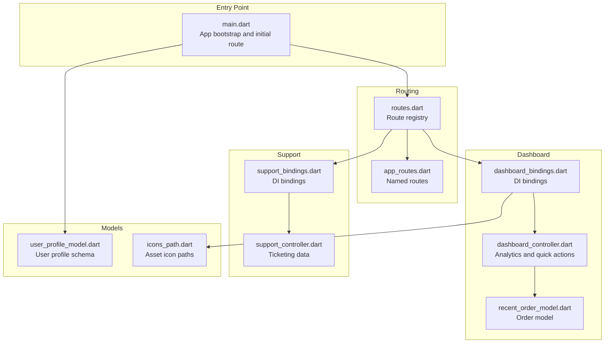
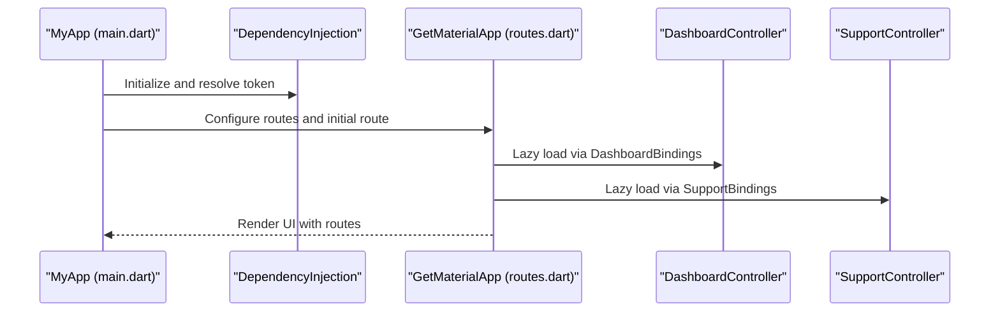
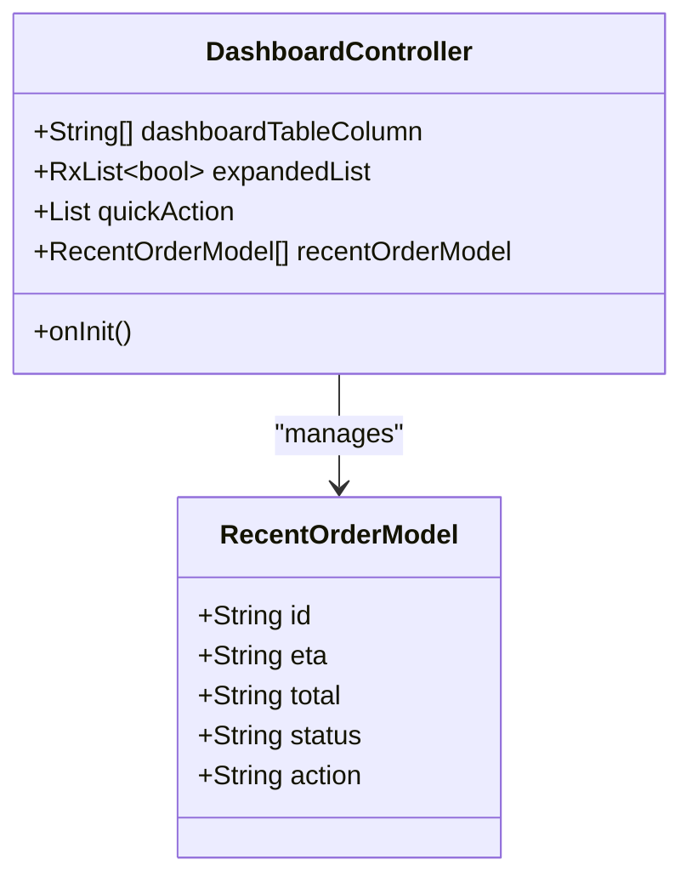
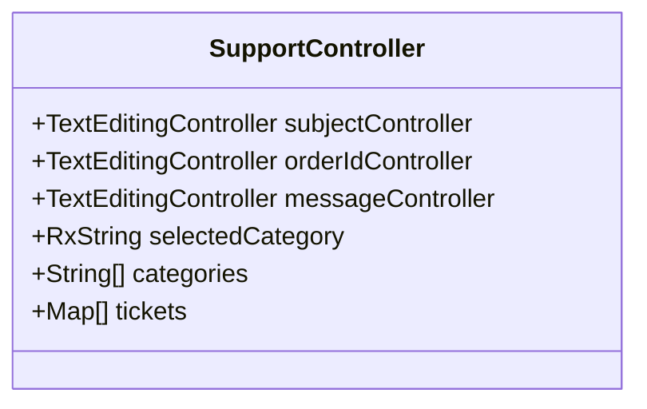
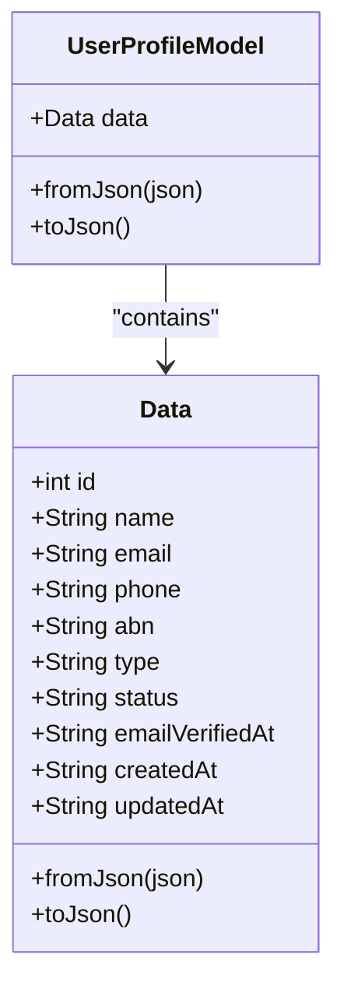
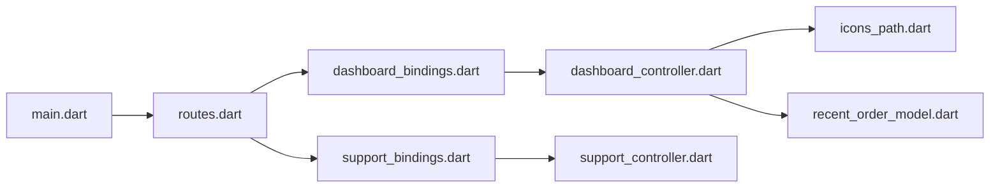

# Administrative Features

<cite>
**Referenced Files in This Document**
- [main.dart](file://lib/main.dart)
- [app_routes.dart](file://lib/core/routes/app_routes.dart)
- [routes.dart](file://lib/core/routes/routes.dart)
- [dashboard_bindings.dart](file://lib/features/dashboard/bindings/dashboard_bindings.dart)
- [dashboard_controller.dart](file://lib/features/dashboard/controller/dashboard_controller.dart)
- [recent_order_model.dart](file://lib/features/dashboard/models/recent_order_model.dart)
- [support_bindings.dart](file://lib/features/support/bindings/support_bindings.dart)
- [support_controller.dart](file://lib/features/support/controller/support_controller.dart)
- [user_profile_model.dart](file://lib/core/data/global_models/user_profile_model.dart)
- [icons_path.dart](file://lib/core/constant/icons_path.dart)
</cite>

## Table of Contents
1. [Introduction](#introduction)
2. [Project Structure](#project-structure)
3. [Core Components](#core-components)
4. [Architecture Overview](#architecture-overview)
5. [Detailed Component Analysis](#detailed-component-analysis)
6. [Dependency Analysis](#dependency-analysis)
7. [Performance Considerations](#performance-considerations)
8. [Troubleshooting Guide](#troubleshooting-guide)
9. [Conclusion](#conclusion)

## Introduction
This document describes the administrative features present in the ZB-DEZINE codebase, focusing on the dashboard analytics system, customer support and ticketing mechanisms, and user-related models that underpin administrative workflows. It also outlines conceptual administrative procedures, security considerations for admin access, and audit/logging recommendations grounded in the current implementation.

## Project Structure
The application uses a modular feature-based structure with route definitions and dependency injection. Administrative-capable areas include:
- Dashboard: analytics overview, quick actions, and recent orders
- Support: help desk and ticketing interface
- Authentication and routing: initial route selection and navigation
- Global models: user profile data used across features

**Diagram sources**
- [main.dart:12-46](file://lib/main.dart#L12-L46)
- [routes.dart:55-211](file://lib/core/routes/routes.dart#L55-L211)
- [app_routes.dart:1-34](file://lib/core/routes/app_routes.dart#L1-L34)
- [dashboard_bindings.dart:7-15](file://lib/features/dashboard/bindings/dashboard_bindings.dart#L7-L15)
- [dashboard_controller.dart:6-63](file://lib/features/dashboard/controller/dashboard_controller.dart#L6-L63)
- [recent_order_model.dart:1-15](file://lib/features/dashboard/models/recent_order_model.dart#L1-L15)
- [support_bindings.dart:4-9](file://lib/features/support/bindings/support_bindings.dart#L4-L9)
- [support_controller.dart:4-31](file://lib/features/support/controller/support_controller.dart#L4-L31)
- [user_profile_model.dart:1-72](file://lib/core/data/global_models/user_profile_model.dart#L1-L72)
- [icons_path.dart:1-100](file://lib/core/constant/icons_path.dart#L1-L100)

**Section sources**
- [main.dart:12-46](file://lib/main.dart#L12-L46)
- [routes.dart:55-211](file://lib/core/routes/routes.dart#L55-L211)
- [app_routes.dart:1-34](file://lib/core/routes/app_routes.dart#L1-L34)

## Core Components
- Dashboard analytics and quick actions: Provides overview tiles, recent orders, and navigation targets for shop, sell, and rent flows.
- Support and ticketing: Defines categories and sample tickets for a help desk interface.
- User profile model: Standardized user data structure used across features.
- Routing and DI: Centralized route registration and lazy-loading of controllers.

Key implementation references:
- Dashboard quick actions and recent orders: [dashboard_controller.dart:9-34](file://lib/features/dashboard/controller/dashboard_controller.dart#L9-L34), [dashboard_controller.dart:35-57](file://lib/features/dashboard/controller/dashboard_controller.dart#L35-L57)
- Support categories and tickets: [support_controller.dart:11-31](file://lib/features/support/controller/support_controller.dart#L11-L31)
- User profile schema: [user_profile_model.dart:19-71](file://lib/core/data/global_models/user_profile_model.dart#L19-L71)
- Route registration: [routes.dart:116-195](file://lib/core/routes/routes.dart#L116-L195)

**Section sources**
- [dashboard_controller.dart:6-63](file://lib/features/dashboard/controller/dashboard_controller.dart#L6-L63)
- [support_controller.dart:4-31](file://lib/features/support/controller/support_controller.dart#L4-L31)
- [user_profile_model.dart:1-72](file://lib/core/data/global_models/user_profile_model.dart#L1-L72)
- [routes.dart:55-211](file://lib/core/routes/routes.dart#L55-L211)

## Architecture Overview
The application initializes via the main entry point, sets up theme and routing, and lazily loads feature controllers through dependency injection. Routes define named destinations for dashboard, support, and other features. Controllers encapsulate UI logic and data for analytics and support.

**Diagram sources**
- [main.dart:12-46](file://lib/main.dart#L12-L46)
- [routes.dart:116-195](file://lib/core/routes/routes.dart#L116-L195)
- [dashboard_bindings.dart:7-15](file://lib/features/dashboard/bindings/dashboard_bindings.dart#L7-L15)
- [support_bindings.dart:4-9](file://lib/features/support/bindings/support_bindings.dart#L4-L9)

## Detailed Component Analysis

### Dashboard Analytics System
The dashboard controller exposes:
- Quick action tiles for shop, sell, rent, and design
- Recent orders list with status and action indicators
- Expandable rows and column headers for tabular presentation

**Diagram sources**
- [dashboard_controller.dart:6-63](file://lib/features/dashboard/controller/dashboard_controller.dart#L6-L63)
- [recent_order_model.dart:1-15](file://lib/features/dashboard/models/recent_order_model.dart#L1-L15)

Administrative workflows supported by the dashboard:
- Business insights: quick action tiles guide administrative tasks (shop, sell, rent).
- Performance metrics: recent orders list provides status visibility and action triggers.
- Data visualization: expandable rows and status indicators enable quick triage.

**Section sources**
- [dashboard_controller.dart:6-63](file://lib/features/dashboard/controller/dashboard_controller.dart#L6-L63)
- [recent_order_model.dart:1-15](file://lib/features/dashboard/models/recent_order_model.dart#L1-L15)
- [icons_path.dart:52-85](file://lib/core/constant/icons_path.dart#L52-L85)

### Customer Support System and Ticketing
The support controller defines:
- Subject, order ID, and message fields for support requests
- Category selection (Payment Issue, Order Problem, Delivery Issue, Technical Issue)
- Sample tickets with title, ID, update time, and status

**Diagram sources**
- [support_controller.dart:4-31](file://lib/features/support/controller/support_controller.dart#L4-L31)

Administrative procedures:
- Creating a support ticket: select category, fill subject/order/message, submit.
- Managing tickets: view list, filter/respect statuses, and mark resolution.

**Section sources**
- [support_controller.dart:4-31](file://lib/features/support/controller/support_controller.dart#L4-L31)
- [support_bindings.dart:4-9](file://lib/features/support/bindings/support_bindings.dart#L4-L9)

### User Management and Profiles
The user profile model provides a structured representation of user data, including identifiers, contact info, account type, verification status, and timestamps. This supports administrative user lookup, auditing, and permission checks.

**Diagram sources**
- [user_profile_model.dart:1-72](file://lib/core/data/global_models/user_profile_model.dart#L1-L72)

Administrative procedures:
- User lookup: retrieve profile by ID or email for audits.
- Permission checks: use type/status fields to enforce role-based access.
- Audit trails: track createdAt/updatedAt for compliance.

**Section sources**
- [user_profile_model.dart:1-72](file://lib/core/data/global_models/user_profile_model.dart#L1-L72)

### Reporting Systems and Analytics Dashboards
Conceptual reporting and analytics features:
- Dashboard KPIs: revenue, order volume, conversion rates, and fulfillment metrics.
- Visualizations: charts for trends, status distributions, and funnel analytics.
- Export capabilities: CSV/PDF reports for stakeholders.

[No sources needed since this section provides conceptual guidance]

### Security Considerations for Admin Access
Conceptual security recommendations:
- Role-based access control (RBAC): restrict dashboard and support administrative routes by user type.
- Audit logging: record admin actions (ticket updates, user status changes, report exports).
- Session management: enforce secure tokens, timeouts, and re-authentication for sensitive operations.
- Least privilege: limit admin actions to necessary scopes (e.g., ticket resolution vs. user deletion).

[No sources needed since this section provides conceptual guidance]

## Dependency Analysis
The dashboard and support features rely on dependency injection to lazily load controllers. Routes centralize navigation and bind controllers to views.

**Diagram sources**
- [main.dart:12-46](file://lib/main.dart#L12-L46)
- [routes.dart:116-195](file://lib/core/routes/routes.dart#L116-L195)
- [dashboard_bindings.dart:7-15](file://lib/features/dashboard/bindings/dashboard_bindings.dart#L7-L15)
- [support_bindings.dart:4-9](file://lib/features/support/bindings/support_bindings.dart#L4-L9)
- [dashboard_controller.dart:6-63](file://lib/features/dashboard/controller/dashboard_controller.dart#L6-L63)
- [recent_order_model.dart:1-15](file://lib/features/dashboard/models/recent_order_model.dart#L1-L15)
- [icons_path.dart:1-100](file://lib/core/constant/icons_path.dart#L1-L100)

**Section sources**
- [routes.dart:55-211](file://lib/core/routes/routes.dart#L55-L211)
- [dashboard_bindings.dart:7-15](file://lib/features/dashboard/bindings/dashboard_bindings.dart#L7-L15)
- [support_bindings.dart:4-9](file://lib/features/support/bindings/support_bindings.dart#L4-L9)

## Performance Considerations
- Lazy loading controllers via dependency injection reduces startup overhead.
- Reactive state (GetX) updates only affected UI parts, minimizing redraws.
- Asset paths for icons should remain static to avoid runtime resolution costs.

[No sources needed since this section provides general guidance]

## Troubleshooting Guide
Common issues and resolutions:
- Navigation failures: verify route names in app_routes and route registry entries.
- Missing controllers: ensure bindings are registered and controllers are lazy-loaded.
- Data inconsistencies: confirm model schemas match backend responses.

**Section sources**
- [app_routes.dart:1-34](file://lib/core/routes/app_routes.dart#L1-L34)
- [routes.dart:116-195](file://lib/core/routes/routes.dart#L116-L195)
- [dashboard_bindings.dart:7-15](file://lib/features/dashboard/bindings/dashboard_bindings.dart#L7-L15)
- [support_bindings.dart:4-9](file://lib/features/support/bindings/support_bindings.dart#L4-L9)

## Conclusion
The ZB-DEZINE codebase provides foundational building blocks for administrative features: a dashboard with quick actions and recent orders, a support module with categories and tickets, and a user profile model suitable for audits and permissions. The routing and dependency injection layers enable scalable extension for advanced analytics, reporting, and security controls.