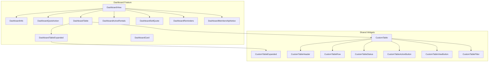
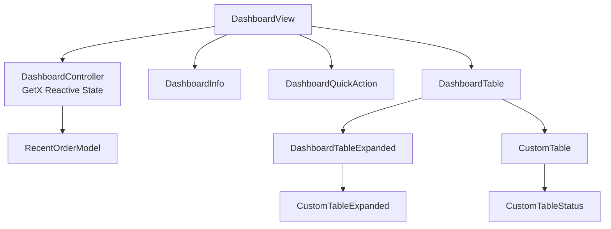
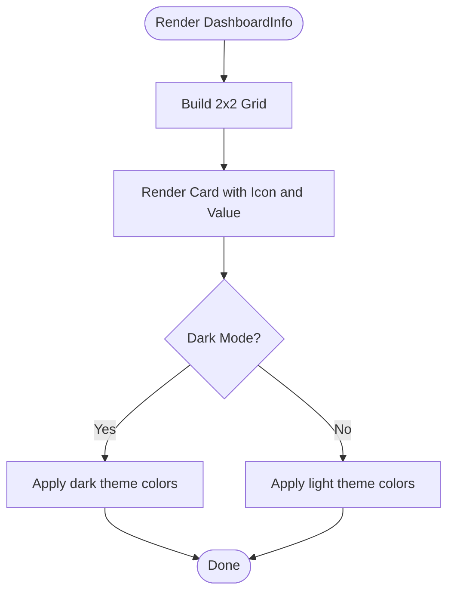
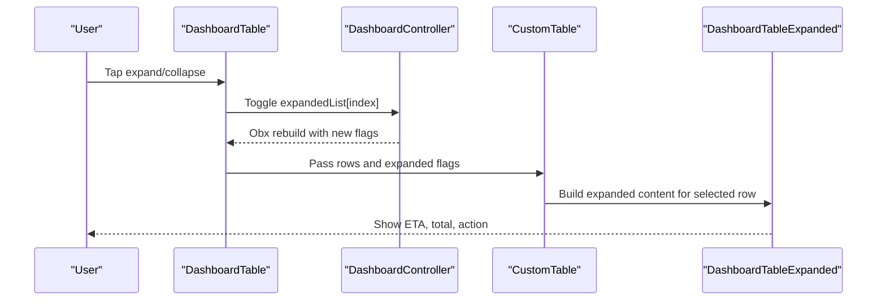
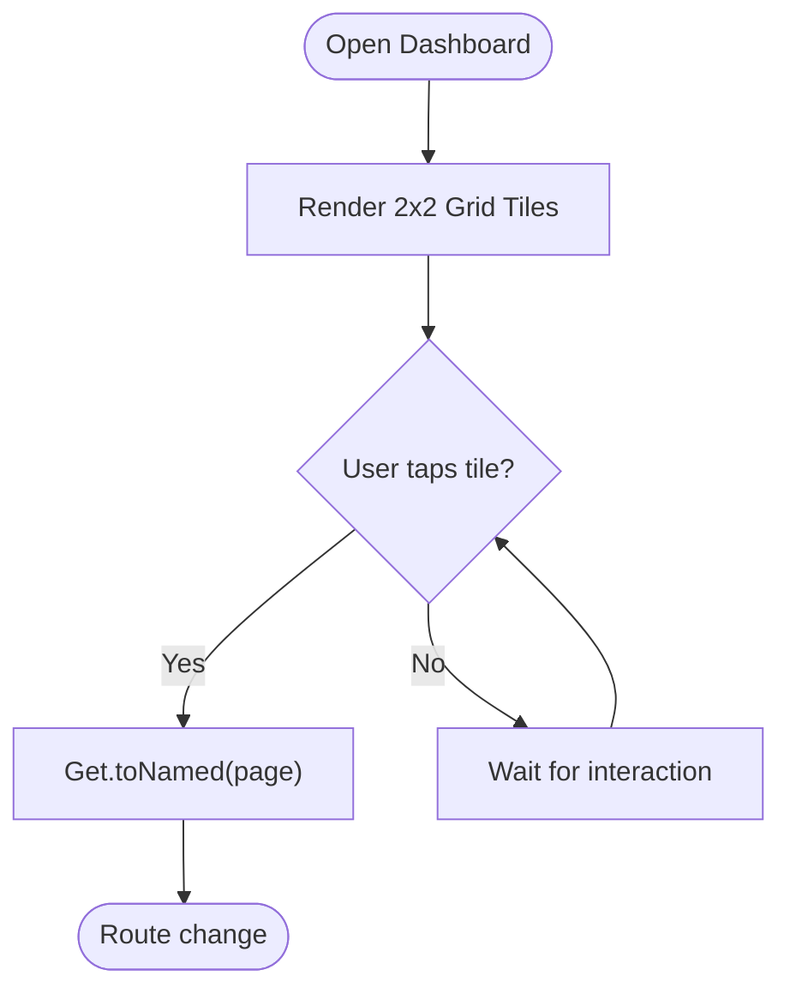
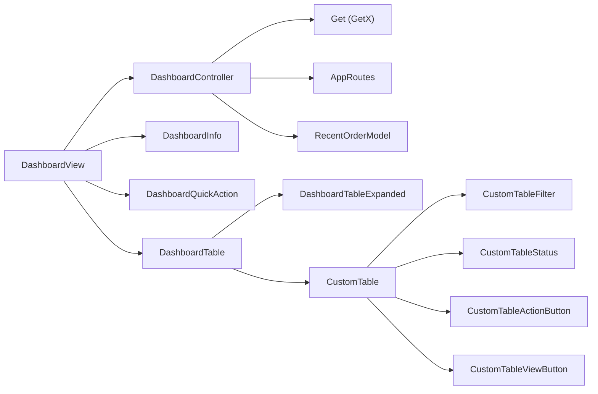

# Dashboard Analytics

<cite>
**Referenced Files in This Document**
- [pubspec.yaml](file://pubspec.yaml)
- [README.md](file://README.md)
- [lib/main.dart](file://lib/main.dart)
- [lib/core/constant/colors.dart](file://lib/core/constant/colors.dart)
- [lib/core/constant/icons_path.dart](file://lib/core/constant/icons_path.dart)
- [lib/core/routes/app_routes.dart](file://lib/core/routes/app_routes.dart)
- [lib/core/theme/app_theme.dart](file://lib/core/theme/app_theme.dart)
- [lib/core/utils/date_picker.dart](file://lib/core/utils/date_picker.dart)
- [lib/shared/widgets/custom_table/custom_table.dart](file://lib/shared/widgets/custom_table/custom_table.dart)
- [lib/shared/widgets/custom_table/custom_table_expanded.dart](file://lib/shared/widgets/custom_table/custom_table_expanded.dart)
- [lib/shared/widgets/custom_table/custom_table_header.dart](file://lib/shared/widgets/custom_table/custom_table_header.dart)
- [lib/shared/widgets/custom_table/custom_table_row.dart](file://lib/shared/widgets/custom_table/custom_table_row.dart)
- [lib/shared/widgets/custom_table/custom_table_status.dart](file://lib/shared/widgets/custom_table/custom_table_status.dart)
- [lib/shared/widgets/custom_table/custom_table_view_button.dart](file://lib/shared/widgets/custom_table/custom_table_view_button.dart)
- [lib/shared/widgets/custom_table/custom_table_filter.dart](file://lib/shared/widgets/custom_table/custom_table_filter.dart)
- [lib/shared/widgets/custom_table/custom_table_action_button.dart](file://lib/shared/widgets/custom_table/custom_table_action_button.dart)
- [lib/shared/widgets/custom_appbar.dart](file://lib/shared/widgets/custom_appbar.dart)
- [lib/shared/widgets/custom_banner.dart](file://lib/shared/widgets/custom_banner.dart)
- [lib/shared/widgets/custom_container.dart](file://lib/shared/widgets/custom_container.dart)
- [lib/shared/widgets/shared_container.dart](file://lib/shared/widgets/shared_container.dart)
- [lib/features/dashboard/views/dashboard_view.dart](file://lib/features/dashboard/views/dashboard_view.dart)
- [lib/features/dashboard/controller/dashboard_controller.dart](file://lib/features/dashboard/controller/dashboard_controller.dart)
- [lib/features/dashboard/models/recent_order_model.dart](file://lib/features/dashboard/models/recent_order_model.dart)
- [lib/features/dashboard/widgets/dashboard_widget/dashboard_table.dart](file://lib/features/dashboard/widgets/dashboard_widget/dashboard_table.dart)
- [lib/features/dashboard/widgets/dashboard_widget/dashboard_table_expanded.dart](file://lib/features/dashboard/widgets/dashboard_widget/dashboard_table_expanded.dart)
- [lib/features/dashboard/widgets/dashboard_widget/dashboard_quick_action.dart](file://lib/features/dashboard/widgets/dashboard_widget/dashboard_quick_action.dart)
- [lib/features/dashboard/widgets/dashboard_widget/dashboard_info.dart](file://lib/features/dashboard/widgets/dashboard_widget/dashboard_info.dart)
- [lib/features/dashboard/widgets/dashboard_widget/dashboard_property_header.dart](file://lib/features/dashboard/widgets/dashboard_widget/dashboard_property_header.dart)
- [lib/features/dashboard/widgets/dashboard_widget/dashboard_welcome.dart](file://lib/features/dashboard/widgets/dashboard_widget/dashboard_welcome.dart)
- [lib/features/dashboard/widgets/dashboard_widget/dashboard_active_rentals.dart](file://lib/features/dashboard/widgets/dashboard_widget/dashboard_active_rentals.dart)
- [lib/features/dashboard/widgets/dashboard_widget/dashboard_sell_quote.dart](file://lib/features/dashboard/widgets/dashboard_widget/dashboard_sell_quote.dart)
- [lib/features/dashboard/widgets/dashboard_widget/dashboard_reminders.dart](file://lib/features/dashboard/widgets/dashboard_widget/dashboard_reminders.dart)
- [lib/features/dashboard/widgets/dashboard_widget/dashboard_membership_notice.dart](file://lib/features/dashboard/widgets/dashboard_widget/dashboard_membership_notice.dart)
- [lib/features/dashboard/widgets/dashboard_widget/dashboard_card.dart](file://lib/features/dashboard/widgets/dashboard_widget/dashboard_card.dart)
- [lib/features/dashboard/widgets/dashboard_widget/dashboard_sell_quote.dart](file://lib/features/dashboard/widgets/dashboard_widget/dashboard_sell_quote.dart)
- [lib/features/dashboard/widgets/dashboard_widget/dashboard_payment_widgets/dashboard_payment_header.dart](file://lib/features/dashboard/widgets/dashboard_widget/dashboard_payment_widgets/dashboard_payment_header.dart)
- [lib/features/dashboard/widgets/dashboard_widget/dashboard_payment_widgets/dashboard_payment_items.dart](file://lib/features/dashboard/widgets/dashboard_widget/dashboard_payment_widgets/dashboard_payment_items.dart)
- [lib/features/dashboard/widgets/dashboard_widget/dashboard_payment_widgets/dashboard_payment_save.dart](file://lib/features/dashboard/widgets/dashboard_widget/dashboard_payment_widgets/dashboard_payment_save.dart)
- [lib/features/dashboard/widgets/dashboard_widget/dashboard_payment_widgets/dashboard_payment_schedule.dart](file://lib/features/dashboard/widgets/dashboard_widget/dashboard_payment_widgets/dashboard_payment_schedule.dart)
</cite>

## Table of Contents
1. [Introduction](#introduction)
2. [Project Structure](#project-structure)
3. [Core Components](#core-components)
4. [Architecture Overview](#architecture-overview)
5. [Detailed Component Analysis](#detailed-component-analysis)
6. [Dependency Analysis](#dependency-analysis)
7. [Performance Considerations](#performance-considerations)
8. [Troubleshooting Guide](#troubleshooting-guide)
9. [Conclusion](#conclusion)
10. [Appendices](#appendices)

## Introduction
This document describes the administrative dashboard analytics for ZB-DEZINE’s Flutter application. It focuses on the business insights and performance metrics dashboard, including sales analytics, revenue tracking, and user engagement metrics. It also documents the data visualization components, chart implementations, KPI displays, the recent orders table with expandable rows, order management features, the quick action buttons system for shop products, selling furniture, renting products, and design services, and outlines dashboard customization, filtering, and export capabilities for business reporting.

## Project Structure
The dashboard is implemented as a feature module under lib/features/dashboard. The main view composes reusable widgets that render KPI cards, quick actions, recent orders table, reminders, membership notices, and related sections. Shared widgets provide consistent UI patterns for tables, filters, and status indicators.

**Diagram sources**
- [lib/features/dashboard/views/dashboard_view.dart:17-61](file://lib/features/dashboard/views/dashboard_view.dart#L17-L61)
- [lib/features/dashboard/widgets/dashboard_widget/dashboard_table.dart:13-78](file://lib/features/dashboard/widgets/dashboard_widget/dashboard_table.dart#L13-L78)
- [lib/features/dashboard/widgets/dashboard_widget/dashboard_table_expanded.dart:9-54](file://lib/features/dashboard/widgets/dashboard_widget/dashboard_table_expanded.dart#L9-L54)
- [lib/shared/widgets/custom_table/custom_table.dart](file://lib/shared/widgets/custom_table/custom_table.dart)
- [lib/shared/widgets/custom_table/custom_table_expanded.dart](file://lib/shared/widgets/custom_table/custom_table_expanded.dart)
- [lib/shared/widgets/custom_table/custom_table_header.dart](file://lib/shared/widgets/custom_table/custom_table_header.dart)
- [lib/shared/widgets/custom_table/custom_table_row.dart](file://lib/shared/widgets/custom_table/custom_table_row.dart)
- [lib/shared/widgets/custom_table/custom_table_status.dart](file://lib/shared/widgets/custom_table/custom_table_status.dart)
- [lib/shared/widgets/custom_table/custom_table_view_button.dart](file://lib/shared/widgets/custom_table/custom_table_view_button.dart)
- [lib/shared/widgets/custom_table/custom_table_filter.dart](file://lib/shared/widgets/custom_table/custom_table_filter.dart)

**Section sources**
- [lib/features/dashboard/views/dashboard_view.dart:17-61](file://lib/features/dashboard/views/dashboard_view.dart#L17-L61)
- [lib/features/dashboard/controller/dashboard_controller.dart:6-63](file://lib/features/dashboard/controller/dashboard_controller.dart#L6-L63)

## Core Components
- DashboardView: The top-level dashboard screen that composes all dashboard sections and renders them in a scrollable column layout.
- DashboardInfo: Renders a grid of KPI cards (active orders, total spent, active rentals, pending quotes) with icons and values.
- DashboardQuickAction: Provides a 2x2 grid of quick action tiles for Shop Products, Sell Furniture, Rent Products, and Design Services.
- DashboardTable: Displays recent orders in a table with expandable rows for detailed order information.
- DashboardTableExpanded: Renders expanded order details (status, ETA, total, action).
- Shared custom table widgets: Provide reusable table infrastructure for headers, rows, statuses, filters, and actions.

**Section sources**
- [lib/features/dashboard/views/dashboard_view.dart:17-61](file://lib/features/dashboard/views/dashboard_view.dart#L17-L61)
- [lib/features/dashboard/widgets/dashboard_widget/dashboard_info.dart:7-69](file://lib/features/dashboard/widgets/dashboard_widget/dashboard_info.dart#L7-L69)
- [lib/features/dashboard/widgets/dashboard_widget/dashboard_quick_action.dart:10-101](file://lib/features/dashboard/widgets/dashboard_widget/dashboard_quick_action.dart#L10-L101)
- [lib/features/dashboard/widgets/dashboard_widget/dashboard_table.dart:13-78](file://lib/features/dashboard/widgets/dashboard_widget/dashboard_table.dart#L13-L78)
- [lib/features/dashboard/widgets/dashboard_widget/dashboard_table_expanded.dart:9-54](file://lib/features/dashboard/widgets/dashboard_widget/dashboard_table_expanded.dart#L9-L54)
- [lib/shared/widgets/custom_table/custom_table.dart](file://lib/shared/widgets/custom_table/custom_table.dart)
- [lib/shared/widgets/custom_table/custom_table_expanded.dart](file://lib/shared/widgets/custom_table/custom_table_expanded.dart)
- [lib/shared/widgets/custom_table/custom_table_header.dart](file://lib/shared/widgets/custom_table/custom_table_header.dart)
- [lib/shared/widgets/custom_table/custom_table_row.dart](file://lib/shared/widgets/custom_table/custom_table_row.dart)
- [lib/shared/widgets/custom_table/custom_table_status.dart](file://lib/shared/widgets/custom_table/custom_table_status.dart)
- [lib/shared/widgets/custom_table/custom_table_view_button.dart](file://lib/shared/widgets/custom_table/custom_table_view_button.dart)
- [lib/shared/widgets/custom_table/custom_table_filter.dart](file://lib/shared/widgets/custom_table/custom_table_filter.dart)

## Architecture Overview
The dashboard follows a layered architecture:
- View layer: Stateless widgets compose the UI.
- Controller layer: GetX controller manages reactive state (expanded rows, quick actions, recent orders).
- Model layer: Immutable data models (e.g., RecentOrderModel).
- Shared widgets: Reusable UI components for tables, status, and filters.
- Routing: Navigation to related screens via named routes.

**Diagram sources**
- [lib/features/dashboard/controller/dashboard_controller.dart:6-63](file://lib/features/dashboard/controller/dashboard_controller.dart#L6-L63)
- [lib/features/dashboard/models/recent_order_model.dart:1-15](file://lib/features/dashboard/models/recent_order_model.dart#L1-L15)
- [lib/features/dashboard/views/dashboard_view.dart:17-61](file://lib/features/dashboard/views/dashboard_view.dart#L17-L61)
- [lib/features/dashboard/widgets/dashboard_widget/dashboard_table.dart:13-78](file://lib/features/dashboard/widgets/dashboard_widget/dashboard_table.dart#L13-L78)
- [lib/features/dashboard/widgets/dashboard_widget/dashboard_table_expanded.dart:9-54](file://lib/features/dashboard/widgets/dashboard_widget/dashboard_table_expanded.dart#L9-L54)
- [lib/shared/widgets/custom_table/custom_table.dart](file://lib/shared/widgets/custom_table/custom_table.dart)
- [lib/shared/widgets/custom_table/custom_table_expanded.dart](file://lib/shared/widgets/custom_table/custom_table_expanded.dart)
- [lib/shared/widgets/custom_table/custom_table_status.dart](file://lib/shared/widgets/custom_table/custom_table_status.dart)

## Detailed Component Analysis

### Sales Analytics and Revenue Tracking
- KPI Cards: The DashboardInfo widget presents four KPIs in a grid:
  - Active orders
  - Total spent
  - Active rentals
  - Pending quotes
- Implementation pattern: Grid of containers with icon and value rendering, themed for light/dark modes.
- Metric calculation: Values are static in the current implementation but designed to be replaced with live data from backend APIs.

**Diagram sources**
- [lib/features/dashboard/widgets/dashboard_widget/dashboard_info.dart:13-67](file://lib/features/dashboard/widgets/dashboard_widget/dashboard_info.dart#L13-L67)

**Section sources**
- [lib/features/dashboard/widgets/dashboard_widget/dashboard_info.dart:7-69](file://lib/features/dashboard/widgets/dashboard_widget/dashboard_info.dart#L7-L69)

### User Engagement Metrics
- Engagement indicators are represented by KPIs such as pending quotes and active rentals.
- These metrics can be extended to include charts (e.g., fl_chart) for trend visualization when integrated with backend data.

**Section sources**
- [lib/features/dashboard/widgets/dashboard_widget/dashboard_info.dart:13-22](file://lib/features/dashboard/widgets/dashboard_widget/dashboard_info.dart#L13-L22)

### Data Visualization Components and Chart Implementations
- Chart library: The project includes fl_chart, suitable for rendering sales trends, revenue charts, and engagement metrics.
- Implementation guidance:
  - Use LineChart/PieChart/BarChart components from fl_chart.
  - Bind chart data to reactive streams from controllers.
  - Place charts inside SharedContainer or DashboardCard for consistent styling.

Note: No existing chart implementations were found in the dashboard feature; this section outlines recommended patterns for future integration.

**Section sources**
- [pubspec.yaml:56-56](file://pubspec.yaml#L56-L56)

### KPI Displays
- DashboardCard: A reusable container for KPIs and charts.
- Theming: Uses AppColors for light/dark mode compatibility.
- Extensibility: Can host numeric values, progress bars, or small charts.

**Section sources**
- [lib/features/dashboard/widgets/dashboard_widget/dashboard_card.dart](file://lib/features/dashboard/widgets/dashboard_widget/dashboard_card.dart)
- [lib/core/constant/colors.dart](file://lib/core/constant/colors.dart)

### Recent Orders Table Functionality
- Columns: Order, Status, Action.
- Expandable Rows: Each row expands to show ETA, total, and action.
- Reactive State: Expanded flags managed by DashboardController.
- CustomTable Integration: Delegates rendering and interaction to shared custom table widgets.

**Diagram sources**
- [lib/features/dashboard/widgets/dashboard_widget/dashboard_table.dart:33-72](file://lib/features/dashboard/widgets/dashboard_widget/dashboard_table.dart#L33-L72)
- [lib/features/dashboard/controller/dashboard_controller.dart:6-63](file://lib/features/dashboard/controller/dashboard_controller.dart#L6-L63)
- [lib/features/dashboard/widgets/dashboard_widget/dashboard_table_expanded.dart:9-54](file://lib/features/dashboard/widgets/dashboard_widget/dashboard_table_expanded.dart#L9-L54)
- [lib/shared/widgets/custom_table/custom_table.dart](file://lib/shared/widgets/custom_table/custom_table.dart)

**Section sources**
- [lib/features/dashboard/widgets/dashboard_widget/dashboard_table.dart:13-78](file://lib/features/dashboard/widgets/dashboard_widget/dashboard_table.dart#L13-L78)
- [lib/features/dashboard/widgets/dashboard_widget/dashboard_table_expanded.dart:9-54](file://lib/features/dashboard/widgets/dashboard_widget/dashboard_table_expanded.dart#L9-L54)
- [lib/features/dashboard/controller/dashboard_controller.dart:6-63](file://lib/features/dashboard/controller/dashboard_controller.dart#L6-L63)
- [lib/features/dashboard/models/recent_order_model.dart:1-15](file://lib/features/dashboard/models/recent_order_model.dart#L1-L15)

### Quick Action Buttons System
- Tiles: Shop Products, Sell Furniture, Rent Products, Design Services.
- Behavior: Tapping a tile navigates to the configured route via Get.toNamed.
- Styling: Grid layout with overlay decorative asset for visual depth.

**Diagram sources**
- [lib/features/dashboard/widgets/dashboard_widget/dashboard_quick_action.dart:38-41](file://lib/features/dashboard/widgets/dashboard_widget/dashboard_quick_action.dart#L38-L41)
- [lib/core/routes/app_routes.dart](file://lib/core/routes/app_routes.dart)

**Section sources**
- [lib/features/dashboard/widgets/dashboard_widget/dashboard_quick_action.dart:10-101](file://lib/features/dashboard/widgets/dashboard_widget/dashboard_quick_action.dart#L10-L101)
- [lib/features/dashboard/controller/dashboard_controller.dart:9-34](file://lib/features/dashboard/controller/dashboard_controller.dart#L9-L34)

### Order Management Features
- Track Action: The table action cell displays “Track” and triggers navigation to order details.
- Expand Details: Expanded rows show ETA, total, and action for quick review.
- Future enhancements: Add status transitions, cancellation/refund actions, and export of order history.

**Section sources**
- [lib/features/dashboard/widgets/dashboard_widget/dashboard_table.dart:61-71](file://lib/features/dashboard/widgets/dashboard_widget/dashboard_table.dart#L61-L71)
- [lib/features/dashboard/widgets/dashboard_widget/dashboard_table_expanded.dart:34-50](file://lib/features/dashboard/widgets/dashboard_widget/dashboard_table_expanded.dart#L34-L50)

### Dashboard Layouts and Real-Time Updates
- Layout: Single-column scrollable composition of sections.
- Real-time updates: Use GetX Obx widgets to rebuild sections reactively when state changes (e.g., expanded flags, fetched data).
- Theming: Respect brightness via Theme.of(context).brightness to apply appropriate colors.

**Section sources**
- [lib/features/dashboard/views/dashboard_view.dart:22-59](file://lib/features/dashboard/views/dashboard_view.dart#L22-L59)
- [lib/features/dashboard/widgets/dashboard_widget/dashboard_table.dart:18-25](file://lib/features/dashboard/widgets/dashboard_widget/dashboard_table.dart#L18-L25)

### Dashboard Customization Options
- Theming: Light/dark mode support via AppColors and theme controller.
- Typography and spacing: Consistent sizing via Flutter_ScreenUtil.
- Containers: SharedContainer and CustomContainer provide uniform padding and borders.

**Section sources**
- [lib/core/constant/colors.dart](file://lib/core/constant/colors.dart)
- [lib/core/theme/app_theme.dart](file://lib/core/theme/app_theme.dart)
- [lib/shared/widgets/shared_container.dart](file://lib/shared/widgets/shared_container.dart)
- [lib/shared/widgets/custom_container.dart](file://lib/shared/widgets/custom_container.dart)

### Filter Mechanisms and Export Capabilities
- Filters: CustomTableFilter provides a reusable foundation for adding filters to the recent orders table.
- Exports: CustomTableViewButton and related widgets can be extended to support CSV/PDF exports of visible data.

**Section sources**
- [lib/shared/widgets/custom_table/custom_table_filter.dart](file://lib/shared/widgets/custom_table/custom_table_filter.dart)
- [lib/shared/widgets/custom_table/custom_table_view_button.dart](file://lib/shared/widgets/custom_table/custom_table_view_button.dart)

## Dependency Analysis
The dashboard depends on:
- GetX for state management and navigation.
- Shared custom table widgets for consistent table behavior.
- Theme and color constants for unified appearance.
- Routes for navigation targets.

**Diagram sources**
- [lib/features/dashboard/controller/dashboard_controller.dart:1-63](file://lib/features/dashboard/controller/dashboard_controller.dart#L1-L63)
- [lib/features/dashboard/views/dashboard_view.dart:1-61](file://lib/features/dashboard/views/dashboard_view.dart#L1-L61)
- [lib/features/dashboard/widgets/dashboard_widget/dashboard_table.dart:1-78](file://lib/features/dashboard/widgets/dashboard_widget/dashboard_table.dart#L1-L78)
- [lib/features/dashboard/widgets/dashboard_widget/dashboard_table_expanded.dart:1-54](file://lib/features/dashboard/widgets/dashboard_widget/dashboard_table_expanded.dart#L1-L54)
- [lib/shared/widgets/custom_table/custom_table.dart](file://lib/shared/widgets/custom_table/custom_table.dart)
- [lib/shared/widgets/custom_table/custom_table_filter.dart](file://lib/shared/widgets/custom_table/custom_table_filter.dart)
- [lib/shared/widgets/custom_table/custom_table_status.dart](file://lib/shared/widgets/custom_table/custom_table_status.dart)
- [lib/shared/widgets/custom_table/custom_table_action_button.dart](file://lib/shared/widgets/custom_table/custom_table_action_button.dart)
- [lib/shared/widgets/custom_table/custom_table_view_button.dart](file://lib/shared/widgets/custom_table/custom_table_view_button.dart)

**Section sources**
- [lib/features/dashboard/controller/dashboard_controller.dart:1-63](file://lib/features/dashboard/controller/dashboard_controller.dart#L1-L63)
- [lib/core/routes/app_routes.dart](file://lib/core/routes/app_routes.dart)
- [lib/shared/widgets/custom_table/custom_table.dart](file://lib/shared/widgets/custom_table/custom_table.dart)

## Performance Considerations
- Use Obx sparingly around heavy subtrees; scope reactive rebuilds to necessary widgets.
- Prefer lazy loading for large datasets; integrate pagination in CustomTable.
- Optimize images and overlays (e.g., decorative assets) to reduce paint overhead.
- Leverage Flutter ScreenUtil for responsive layouts without expensive recalculations.

## Troubleshooting Guide
- Navigation issues: Verify routes exist in AppRoutes and pages are registered.
- Dark/light mode inconsistencies: Confirm AppColors and theme brightness checks are applied consistently.
- Table expansion not working: Ensure expandedList is initialized and toggled via onExpand callback.
- Missing icons: Confirm icon paths in IconsPath match asset locations.

**Section sources**
- [lib/features/dashboard/controller/dashboard_controller.dart:58-62](file://lib/features/dashboard/controller/dashboard_controller.dart#L58-L62)
- [lib/features/dashboard/widgets/dashboard_widget/dashboard_table.dart:51-54](file://lib/features/dashboard/widgets/dashboard_widget/dashboard_table.dart#L51-L54)
- [lib/core/constant/icons_path.dart](file://lib/core/constant/icons_path.dart)

## Conclusion
The ZB-DEZINE dashboard provides a modular, reactive foundation for business analytics. It includes KPI cards, quick actions, a recent orders table with expandable rows, and reusable table components. With minimal extensions—such as integrating fl_chart for visualizations, connecting to backend APIs for live data, and enhancing filters and exports—the dashboard can become a comprehensive analytics hub for sales, revenue, and engagement insights.

## Appendices
- Getting started: Review the project README for initial setup and Flutter tooling guidance.
- Theming reference: Explore AppTheme and AppColors for consistent styling across dashboard sections.

**Section sources**
- [README.md:1-17](file://README.md#L1-L17)
- [lib/core/theme/app_theme.dart](file://lib/core/theme/app_theme.dart)
- [lib/core/constant/colors.dart](file://lib/core/constant/colors.dart)