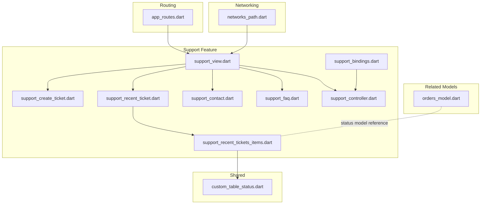
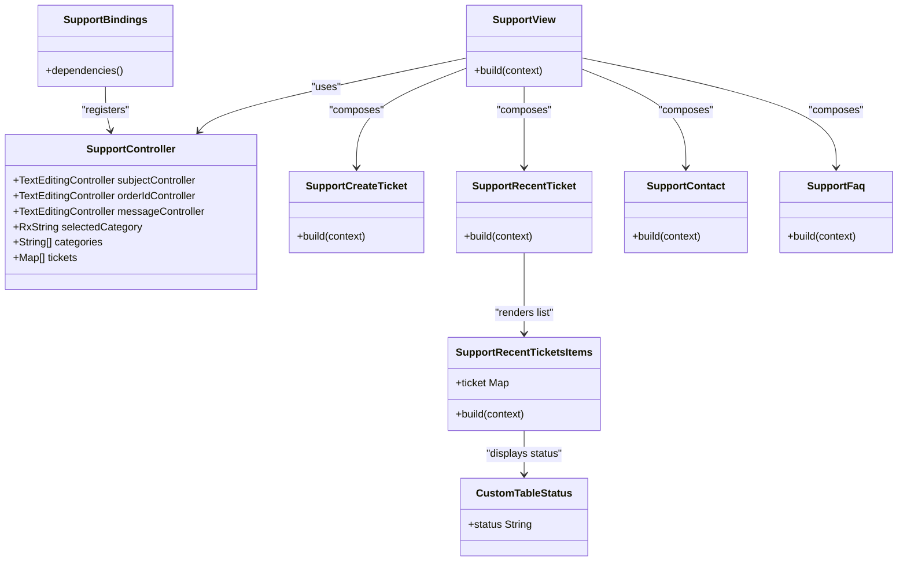
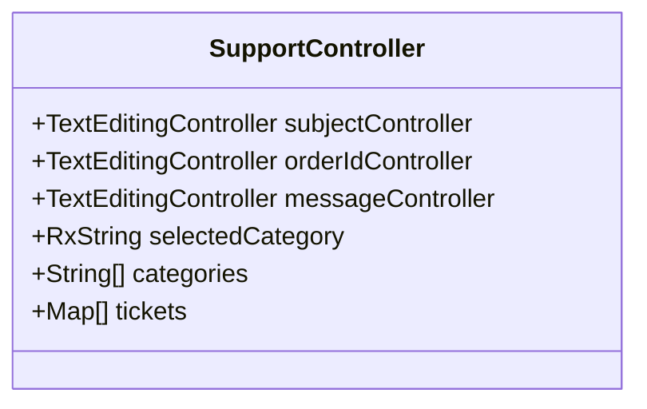
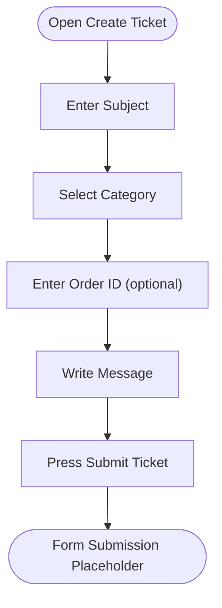
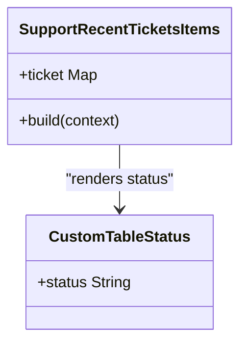
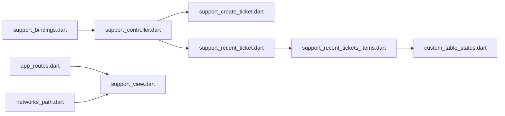
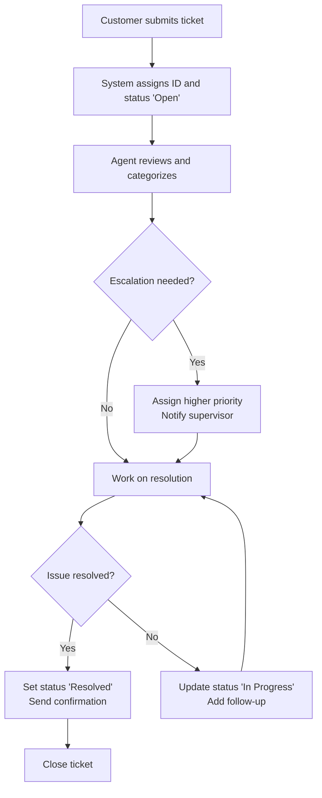

# Support System

<cite>
**Referenced Files in This Document**
- [support_controller.dart](file://lib/features/support/controller/support_controller.dart)
- [support_bindings.dart](file://lib/features/support/bindings/support_bindings.dart)
- [support_view.dart](file://lib/features/support/views/support_view.dart)
- [support_create_ticket.dart](file://lib/features/support/widgets/support_create_ticket.dart)
- [support_recent_ticket.dart](file://lib/features/support/widgets/support_recent_ticket.dart)
- [support_recent_tickets_items.dart](file://lib/features/support/widgets/support_recent_tickets_items.dart)
- [support_contact.dart](file://lib/features/support/widgets/support_contact.dart)
- [support_faq.dart](file://lib/features/support/widgets/support_faq.dart)
- [app_routes.dart](file://lib/core/routes/app_routes.dart)
- [networks_path.dart](file://lib/core/constant/networks_path.dart)
- [custom_table_status.dart](file://lib/shared/widgets/custom_table/custom_table_status.dart)
- [orders_model.dart](file://lib/features/order/models/orders_model.dart)
</cite>

## Table of Contents
1. [Introduction](#introduction)
2. [Project Structure](#project-structure)
3. [Core Components](#core-components)
4. [Architecture Overview](#architecture-overview)
5. [Detailed Component Analysis](#detailed-component-analysis)
6. [Dependency Analysis](#dependency-analysis)
7. [Performance Considerations](#performance-considerations)
8. [Troubleshooting Guide](#troubleshooting-guide)
9. [Conclusion](#conclusion)
10. [Appendices](#appendices)

## Introduction
This document describes the customer service and help desk support system for ZB-DEZINE. It focuses on the in-app support center, covering the ticketing submission flow, recent tickets display, contact channels, and frequently asked questions. It also outlines how the UI components integrate with controllers and routes, and how the system can be extended to connect to backend APIs for persistent storage, status tracking, and analytics.

## Project Structure
The support system is organized around a dedicated feature module with a controller, bindings, view, and reusable widgets. Routing constants define the screen endpoint, while shared components provide UI primitives such as status badges.



**Diagram sources**
- [support_view.dart:16-84](file://lib/features/support/views/support_view.dart#L16-L84)
- [support_create_ticket.dart:12-74](file://lib/features/support/widgets/support_create_ticket.dart#L12-L74)
- [support_recent_ticket.dart:10-42](file://lib/features/support/widgets/support_recent_ticket.dart#L10-L42)
- [support_recent_tickets_items.dart:8-50](file://lib/features/support/widgets/support_recent_tickets_items.dart#L8-L50)
- [support_contact.dart:8-80](file://lib/features/support/widgets/support_contact.dart#L8-L80)
- [support_faq.dart:7-74](file://lib/features/support/widgets/support_faq.dart#L7-L74)
- [support_controller.dart:4-31](file://lib/features/support/controller/support_controller.dart#L4-L31)
- [support_bindings.dart:4-9](file://lib/features/support/bindings/support_bindings.dart#L4-L9)
- [app_routes.dart:25-33](file://lib/core/routes/app_routes.dart#L25-L33)
- [networks_path.dart:1-3](file://lib/core/constant/networks_path.dart#L1-L3)
- [custom_table_status.dart](file://lib/shared/widgets/custom_table/custom_table_status.dart)
- [orders_model.dart:358-371](file://lib/features/order/models/orders_model.dart#L358-L371)

**Section sources**
- [support_view.dart:16-84](file://lib/features/support/views/support_view.dart#L16-L84)
- [support_controller.dart:4-31](file://lib/features/support/controller/support_controller.dart#L4-L31)
- [support_bindings.dart:4-9](file://lib/features/support/bindings/support_bindings.dart#L4-L9)
- [app_routes.dart:25-33](file://lib/core/routes/app_routes.dart#L25-L33)
- [networks_path.dart:1-3](file://lib/core/constant/networks_path.dart#L1-L3)
- [custom_table_status.dart](file://lib/shared/widgets/custom_table/custom_table_status.dart)

## Core Components
- SupportController: Manages form inputs, category selection, and mock ticket data for display.
- SupportBindings: Registers the controller with the dependency injection framework.
- SupportView: Orchestrates the layout and composes the sub-components.
- Widgets: Provide reusable UI for creating tickets, displaying recent tickets, contact info, and FAQ entries.
- Routing: Declares the route constant for the support screen.
- Networking: Defines the base URL for API integration.
- Status Badge: Shared component for rendering ticket status.

Key responsibilities:
- Capture user input for ticket creation (subject, category, order ID, message).
- Render a list of recent tickets with title, ID, update time, and status.
- Expose contact channels and FAQ entries.
- Prepare the UI for future integration with backend APIs for persistence and status updates.

**Section sources**
- [support_controller.dart:4-31](file://lib/features/support/controller/support_controller.dart#L4-L31)
- [support_bindings.dart:4-9](file://lib/features/support/bindings/support_bindings.dart#L4-L9)
- [support_view.dart:16-84](file://lib/features/support/views/support_view.dart#L16-L84)
- [support_create_ticket.dart:12-74](file://lib/features/support/widgets/support_create_ticket.dart#L12-L74)
- [support_recent_ticket.dart:10-42](file://lib/features/support/widgets/support_recent_ticket.dart#L10-L42)
- [support_recent_tickets_items.dart:8-50](file://lib/features/support/widgets/support_recent_tickets_items.dart#L8-L50)
- [support_contact.dart:8-80](file://lib/features/support/widgets/support_contact.dart#L8-L80)
- [support_faq.dart:7-74](file://lib/features/support/widgets/support_faq.dart#L7-L74)
- [app_routes.dart:25-33](file://lib/core/routes/app_routes.dart#L25-L33)
- [networks_path.dart:1-3](file://lib/core/constant/networks_path.dart#L1-L3)
- [custom_table_status.dart](file://lib/shared/widgets/custom_table/custom_table_status.dart)

## Architecture Overview
The support system follows a modular MVVM-like pattern:
- View: Stateless widgets assemble the UI.
- Controller: Reactive controller holds state and exposes lists and selections.
- Bindings: Register controller instances with the DI container.
- Routes: Provide navigation constants for the support screen.
- Shared Components: Reusable UI elements (e.g., status badge) used across widgets.



**Diagram sources**
- [support_controller.dart:4-31](file://lib/features/support/controller/support_controller.dart#L4-L31)
- [support_bindings.dart:4-9](file://lib/features/support/bindings/support_bindings.dart#L4-L9)
- [support_view.dart:16-84](file://lib/features/support/views/support_view.dart#L16-L84)
- [support_create_ticket.dart:12-74](file://lib/features/support/widgets/support_create_ticket.dart#L12-L74)
- [support_recent_ticket.dart:10-42](file://lib/features/support/widgets/support_recent_ticket.dart#L10-L42)
- [support_recent_tickets_items.dart:8-50](file://lib/features/support/widgets/support_recent_tickets_items.dart#L8-L50)
- [support_contact.dart:8-80](file://lib/features/support/widgets/support_contact.dart#L8-L80)
- [support_faq.dart:7-74](file://lib/features/support/widgets/support_faq.dart#L7-L74)
- [custom_table_status.dart](file://lib/shared/widgets/custom_table/custom_table_status.dart)

## Detailed Component Analysis

### SupportController
- Purpose: Centralizes form inputs and mock ticket data for display.
- Responsibilities:
  - Manage subject, order ID, and message text controllers.
  - Track selected category via reactive variable.
  - Provide predefined categories and recent tickets list for UI rendering.



**Diagram sources**
- [support_controller.dart:4-31](file://lib/features/support/controller/support_controller.dart#L4-L31)

**Section sources**
- [support_controller.dart:4-31](file://lib/features/support/controller/support_controller.dart#L4-L31)

### SupportView
- Purpose: Renders the support center UI and composes child widgets.
- Responsibilities:
  - Build the header, introductory text, and arrange child widgets.
  - Provide navigation affordances and action buttons.

```mermaid
sequenceDiagram
participant User as "User"
participant View as "SupportView"
participant Create as "SupportCreateTicket"
participant Recent as "SupportRecentTicket"
participant Contact as "SupportContact"
participant FAQ as "SupportFaq"
User->>View : Open Support Center
View->>Create : Compose create ticket form
View->>Contact : Compose contact info
View->>Recent : Compose recent tickets list
View->>FAQ : Compose FAQ entries
View-->>User : Rendered screen
```

**Diagram sources**
- [support_view.dart:16-84](file://lib/features/support/views/support_view.dart#L16-L84)
- [support_create_ticket.dart:12-74](file://lib/features/support/widgets/support_create_ticket.dart#L12-L74)
- [support_recent_ticket.dart:10-42](file://lib/features/support/widgets/support_recent_ticket.dart#L10-L42)
- [support_contact.dart:8-80](file://lib/features/support/widgets/support_contact.dart#L8-L80)
- [support_faq.dart:7-74](file://lib/features/support/widgets/support_faq.dart#L7-L74)

**Section sources**
- [support_view.dart:16-84](file://lib/features/support/views/support_view.dart#L16-L84)

### SupportCreateTicket
- Purpose: Provides a form to submit new support tickets.
- Fields:
  - Subject
  - Category dropdown
  - Order ID (optional)
  - Message body
- Behavior:
  - Uses controllers from SupportController to bind inputs.
  - Triggers a submit action placeholder.



**Diagram sources**
- [support_create_ticket.dart:12-74](file://lib/features/support/widgets/support_create_ticket.dart#L12-L74)
- [support_controller.dart:4-31](file://lib/features/support/controller/support_controller.dart#L4-L31)

**Section sources**
- [support_create_ticket.dart:12-74](file://lib/features/support/widgets/support_create_ticket.dart#L12-L74)
- [support_controller.dart:4-31](file://lib/features/support/controller/support_controller.dart#L4-L31)

### SupportRecentTicket and SupportRecentTicketsItems
- Purpose: Display a list of recent tickets with title, ID, time, and status.
- Data model:
  - Each ticket is a map containing title, ID, time, and status.
- Rendering:
  - Items render a row with title, ID, time, and a status badge.



**Diagram sources**
- [support_recent_tickets_items.dart:8-50](file://lib/features/support/widgets/support_recent_tickets_items.dart#L8-L50)
- [custom_table_status.dart](file://lib/shared/widgets/custom_table/custom_table_status.dart)

**Section sources**
- [support_recent_ticket.dart:10-42](file://lib/features/support/widgets/support_recent_ticket.dart#L10-L42)
- [support_recent_tickets_items.dart:8-50](file://lib/features/support/widgets/support_recent_tickets_items.dart#L8-L50)
- [custom_table_status.dart](file://lib/shared/widgets/custom_table/custom_table_status.dart)

### SupportContact
- Purpose: Presents contact channels (e.g., phone, email) with icons and labels.
- Design:
  - Uses shared containers and typography for consistent appearance.

**Section sources**
- [support_contact.dart:8-80](file://lib/features/support/widgets/support_contact.dart#L8-L80)

### SupportFaq
- Purpose: Displays frequently asked questions and a link to view all FAQs.
- Design:
  - Renders a small set of Q&A entries with subtle shadows and spacing.

**Section sources**
- [support_faq.dart:7-74](file://lib/features/support/widgets/support_faq.dart#L7-L74)

### Routing and Navigation
- Route constant:
  - Declares the route name for the support screen.
- Integration:
  - Use the route constant to navigate to the support center from other parts of the app.

**Section sources**
- [app_routes.dart:25-33](file://lib/core/routes/app_routes.dart#L25-L33)

### Networking and Backend Integration
- Base URL:
  - A constant defines the base URL for API endpoints.
- Integration points:
  - Controllers and views can be extended to call endpoints for:
    - Creating tickets
    - Fetching recent tickets
    - Updating ticket status
    - Retrieving FAQ content
    - Posting agent responses

**Section sources**
- [networks_path.dart:1-3](file://lib/core/constant/networks_path.dart#L1-L3)

### Status Tracking and Model Reference
- Status rendering:
  - Uses a shared status component to display ticket status consistently.
- Related model reference:
  - The order history model includes a status object that mirrors typical ticket status structures, useful for aligning UI and data models.

**Section sources**
- [custom_table_status.dart](file://lib/shared/widgets/custom_table/custom_table_status.dart)
- [orders_model.dart:358-371](file://lib/features/order/models/orders_model.dart#L358-L371)

## Dependency Analysis
- Controller-to-Widgets:
  - Views and widgets depend on the controller for reactive state and data.
- Bindings-to-Controller:
  - Bindings register the controller with the DI container for dependency resolution.
- Routing-to-View:
  - Route constants enable navigation to the support view.
- Networking-to-Controller:
  - Controllers can be extended to fetch and persist data using the base URL.



**Diagram sources**
- [support_bindings.dart:4-9](file://lib/features/support/bindings/support_bindings.dart#L4-L9)
- [support_controller.dart:4-31](file://lib/features/support/controller/support_controller.dart#L4-L31)
- [support_create_ticket.dart:12-74](file://lib/features/support/widgets/support_create_ticket.dart#L12-L74)
- [support_recent_ticket.dart:10-42](file://lib/features/support/widgets/support_recent_ticket.dart#L10-L42)
- [support_recent_tickets_items.dart:8-50](file://lib/features/support/widgets/support_recent_tickets_items.dart#L8-L50)
- [custom_table_status.dart](file://lib/shared/widgets/custom_table/custom_table_status.dart)
- [app_routes.dart:25-33](file://lib/core/routes/app_routes.dart#L25-L33)
- [networks_path.dart:1-3](file://lib/core/constant/networks_path.dart#L1-L3)

**Section sources**
- [support_bindings.dart:4-9](file://lib/features/support/bindings/support_bindings.dart#L4-L9)
- [support_controller.dart:4-31](file://lib/features/support/controller/support_controller.dart#L4-L31)
- [support_create_ticket.dart:12-74](file://lib/features/support/widgets/support_create_ticket.dart#L12-L74)
- [support_recent_ticket.dart:10-42](file://lib/features/support/widgets/support_recent_ticket.dart#L10-L42)
- [support_recent_tickets_items.dart:8-50](file://lib/features/support/widgets/support_recent_tickets_items.dart#L8-L50)
- [custom_table_status.dart](file://lib/shared/widgets/custom_table/custom_table_status.dart)
- [app_routes.dart:25-33](file://lib/core/routes/app_routes.dart#L25-L33)
- [networks_path.dart:1-3](file://lib/core/constant/networks_path.dart#L1-L3)

## Performance Considerations
- Reactive state:
  - Using reactive variables for selected category ensures efficient UI updates without rebuilding unnecessary subtrees.
- Minimal recomposition:
  - Stateless widgets reduce rebuild costs; pass only required data (e.g., ticket maps) to child widgets.
- Mock data:
  - Current mock data avoids network overhead during development; replace with API calls in production for scalability.
- Shared components:
  - Reusing shared UI components reduces duplication and improves maintainability.

[No sources needed since this section provides general guidance]

## Troubleshooting Guide
- Form submission button:
  - The submit button currently has a placeholder action. Implement a handler to validate inputs and call the ticket creation endpoint.
- Category selection:
  - Ensure the selected category is captured and sent with the ticket payload.
- Recent tickets list:
  - Verify that the ticket list updates after a successful submission. Extend the controller to refresh data from the server.
- Status display:
  - Confirm that the status component renders appropriate visuals for different statuses (e.g., Open, Resolved).
- Navigation:
  - Ensure the route constant matches the navigator configuration to avoid dead ends.

**Section sources**
- [support_create_ticket.dart:56-70](file://lib/features/support/widgets/support_create_ticket.dart#L56-L70)
- [support_controller.dart:9-16](file://lib/features/support/controller/support_controller.dart#L9-L16)
- [support_recent_tickets_items.dart:46-46](file://lib/features/support/widgets/support_recent_tickets_items.dart#L46-L46)
- [app_routes.dart:25-33](file://lib/core/routes/app_routes.dart#L25-L33)

## Conclusion
The ZB-DEZINE support system provides a solid foundation for a help desk interface with a ticket creation form, recent tickets display, contact channels, and FAQ entries. By integrating backend APIs for persistence and status updates, and by extending the controller to handle real-time data, the system can evolve into a full-featured support platform with robust workflows, analytics, and SLA monitoring.

[No sources needed since this section summarizes without analyzing specific files]

## Appendices

### Ticket Lifecycle Workflow
This conceptual flow illustrates how a ticket moves from creation to closure. While the current UI is read-only, the workflow below guides future backend integration.



[No sources needed since this diagram shows conceptual workflow, not actual code structure]

### Support Categories and Priority Handling
- Categories:
  - Payment Issue
  - Order Problem
  - Delivery Issue
  - Technical Issue
- Priority:
  - Can be derived from category or severity flags in the backend payload.
- Escalation:
  - Tickets can escalate based on SLA thresholds or repeated follow-ups.

[No sources needed since this section provides general guidance]

### Knowledge Base and FAQ Integration
- Current FAQ:
  - Static entries are rendered in a dedicated widget.
- Future integration:
  - Replace static entries with API-driven content fetched from a knowledge base.
  - Enable search and tagging for improved discoverability.

[No sources needed since this section provides general guidance]

### Analytics, SLA Monitoring, and Satisfaction Metrics
- Analytics:
  - Track ticket volume, resolution time, and channel usage.
- SLA Monitoring:
  - Enforce target response and resolution times per category.
- Satisfaction:
  - Add post-resolution surveys and feedback collection.

[No sources needed since this section provides general guidance]