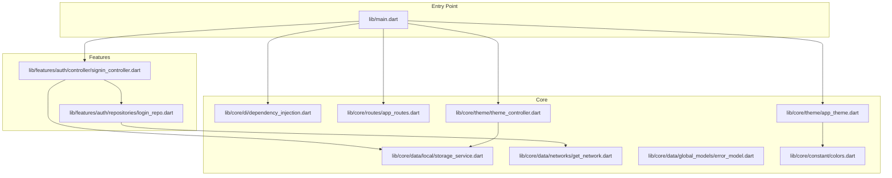
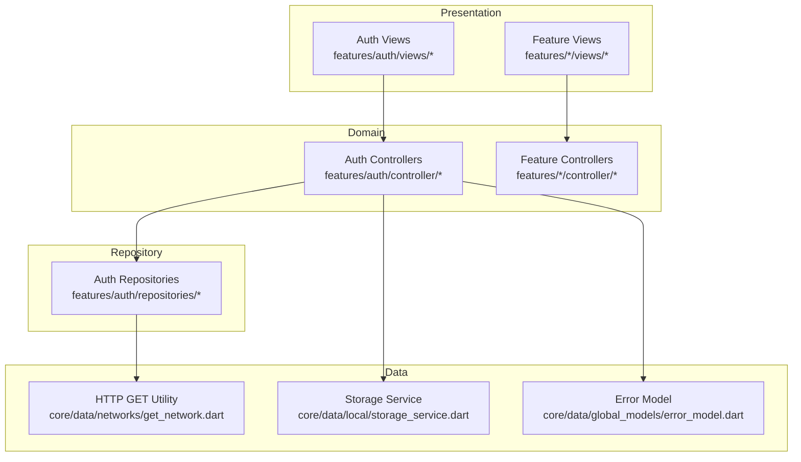
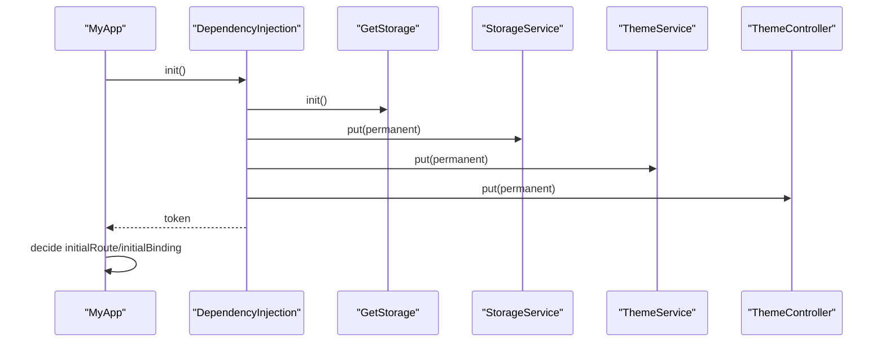
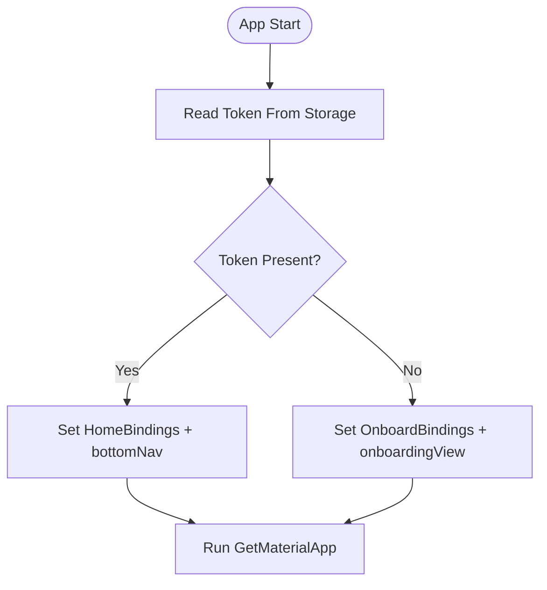
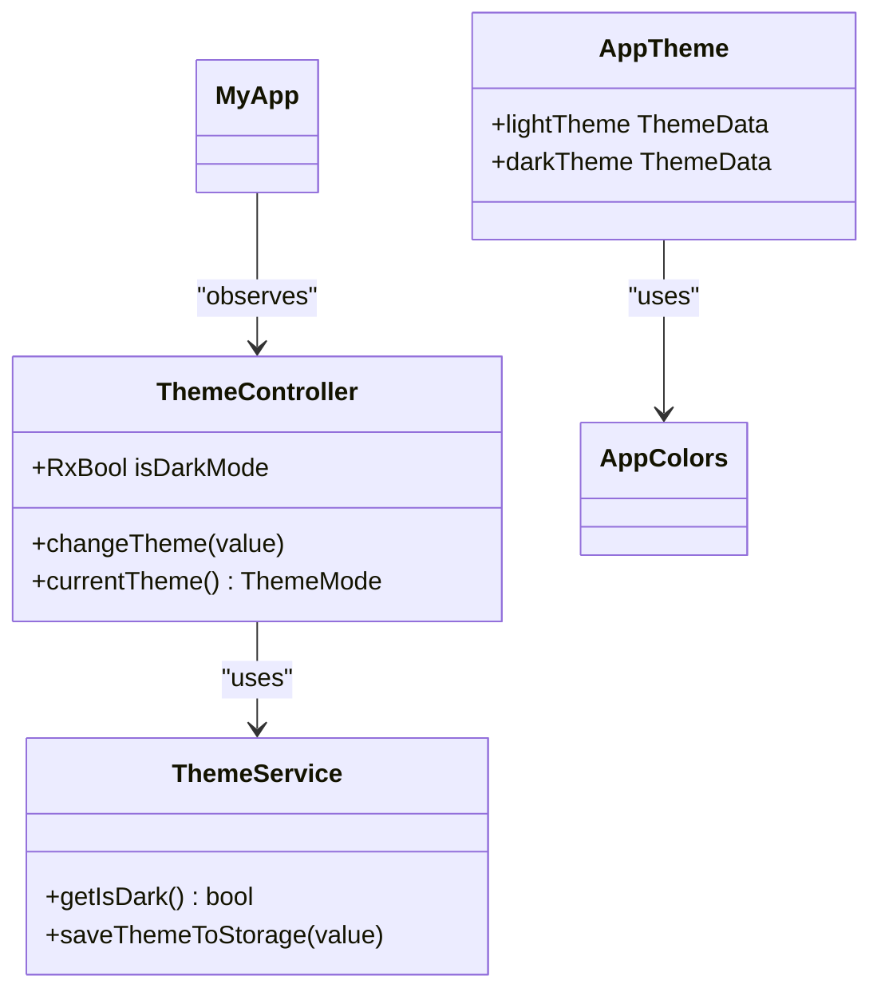
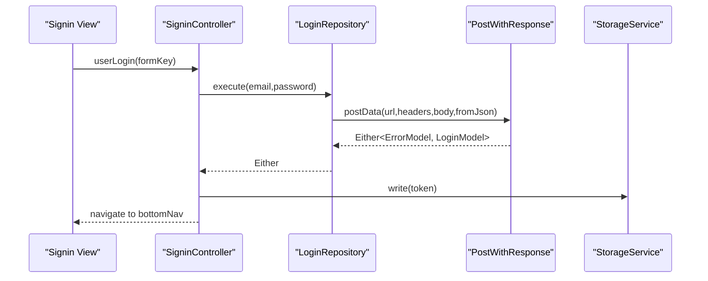
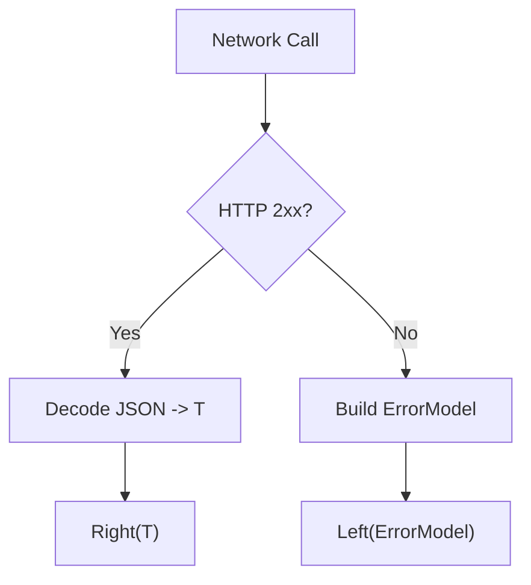
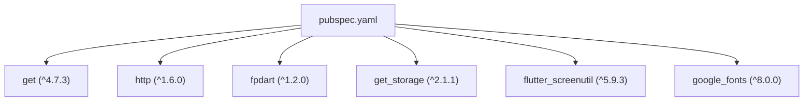
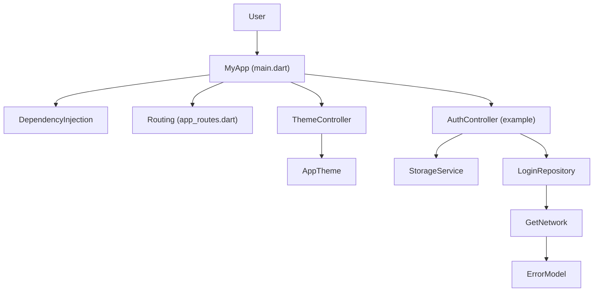

# Architecture Overview

<cite>
**Referenced Files in This Document**
- [pubspec.yaml](file://pubspec.yaml)
- [main.dart](file://lib/main.dart)
- [dependency_injection.dart](file://lib/core/di/dependency_injection.dart)
- [app_routes.dart](file://lib/core/routes/app_routes.dart)
- [routes.dart](file://lib/core/routes/routes.dart)
- [app_theme.dart](file://lib/core/theme/app_theme.dart)
- [theme_controller.dart](file://lib/core/theme/theme_controller.dart)
- [storage_service.dart](file://lib/core/data/local/storage_service.dart)
- [get_network.dart](file://lib/core/data/networks/get_network.dart)
- [login_repo.dart](file://lib/features/auth/repositories/login_repo.dart)
- [signin_controller.dart](file://lib/features/auth/controller/signin_controller.dart)
- [error_model.dart](file://lib/core/data/global_models/error_model.dart)
- [colors.dart](file://lib/core/constant/colors.dart)
</cite>

## Table of Contents
1. [Introduction](#introduction)
2. [Project Structure](#project-structure)
3. [Core Components](#core-components)
4. [Architecture Overview](#architecture-overview)
5. [Detailed Component Analysis](#detailed-component-analysis)
6. [Dependency Analysis](#dependency-analysis)
7. [Performance Considerations](#performance-considerations)
8. [Troubleshooting Guide](#troubleshooting-guide)
9. [Conclusion](#conclusion)
10. [Appendices](#appendices)

## Introduction
This document presents the architecture of ZB-DEZINE’s Flutter application. The system follows a modular MVVM architecture with GetX for reactive state management, dependency injection via GetX, and a repository pattern for data access. It includes a centralized dependency injection setup, a theme controller with persistent storage, a typed network layer returning Either-based results, and a routing system that adapts based on authentication state. Cross-cutting concerns such as error handling, caching strategies, and performance are addressed alongside technology stack and compatibility details.

## Project Structure
The project is organized into feature-centric modules under features/, shared widgets under shared/, and core infrastructure under core/. The application bootstraps through main.dart, initializes dependency injection, and configures routing and theming.

**Diagram sources**
- [main.dart:12-46](file://lib/main.dart#L12-L46)
- [dependency_injection.dart:11-26](file://lib/core/di/dependency_injection.dart#L11-L26)
- [app_routes.dart:1-34](file://lib/core/routes/app_routes.dart#L1-L34)
- [app_theme.dart:4-23](file://lib/core/theme/app_theme.dart#L4-L23)
- [theme_controller.dart:5-22](file://lib/core/theme/theme_controller.dart#L5-L22)
- [storage_service.dart:3-23](file://lib/core/data/local/storage_service.dart#L3-L23)
- [get_network.dart:8-41](file://lib/core/data/networks/get_network.dart#L8-L41)
- [login_repo.dart:9-29](file://lib/features/auth/repositories/login_repo.dart#L9-L29)
- [signin_controller.dart:9-52](file://lib/features/auth/controller/signin_controller.dart#L9-L52)
- [error_model.dart:1-15](file://lib/core/data/global_models/error_model.dart#L1-L15)
- [colors.dart:3-117](file://lib/core/constant/colors.dart#L3-L117)

**Section sources**
- [main.dart:12-46](file://lib/main.dart#L12-L46)
- [pubspec.yaml:30-60](file://pubspec.yaml#L30-L60)

## Core Components
- Dependency Injection: Centralized initialization of storage, theme service, theme controller, and network clients using GetX.
- Routing: Named routes defined centrally and resolved at runtime based on authentication state.
- Theming: Material 3 themes with a reactive ThemeController managing light/dark mode persisted in storage.
- Data Access: Network layer abstracts HTTP GET requests and returns typed results using Either for error handling.
- Authentication Flow: Login controller orchestrates form validation, repository execution, storage persistence, and navigation.

**Section sources**
- [dependency_injection.dart:11-26](file://lib/core/di/dependency_injection.dart#L11-L26)
- [app_routes.dart:1-34](file://lib/core/routes/app_routes.dart#L1-L34)
- [app_theme.dart:4-23](file://lib/core/theme/app_theme.dart#L4-L23)
- [theme_controller.dart:5-22](file://lib/core/theme/theme_controller.dart#L5-L22)
- [get_network.dart:8-41](file://lib/core/data/networks/get_network.dart#L8-L41)
- [signin_controller.dart:9-52](file://lib/features/auth/controller/signin_controller.dart#L9-L52)

## Architecture Overview
The system employs a layered architecture:
- Presentation Layer: Views bind to GetX controllers exposing observable state.
- Domain Layer: Controllers encapsulate UI logic and orchestrate repositories.
- Repository Layer: Encapsulates data operations and network calls.
- Data Layer: Provides typed models and network utilities with robust error modeling.

**Diagram sources**
- [signin_controller.dart:9-52](file://lib/features/auth/controller/signin_controller.dart#L9-L52)
- [login_repo.dart:9-29](file://lib/features/auth/repositories/login_repo.dart#L9-L29)
- [get_network.dart:8-41](file://lib/core/data/networks/get_network.dart#L8-L41)
- [storage_service.dart:3-23](file://lib/core/data/local/storage_service.dart#L3-L23)
- [error_model.dart:1-15](file://lib/core/data/global_models/error_model.dart#L1-L15)

## Detailed Component Analysis

### Dependency Injection and Bootstrapping
- Initialization: The app initializes GetStorage, registers services and controllers as singletons, and reads the stored token to decide initial route and binding.
- Composition: Controllers receive dependencies via constructor injection, enabling testability and modularity.

**Diagram sources**
- [main.dart:12-19](file://lib/main.dart#L12-L19)
- [dependency_injection.dart:12-25](file://lib/core/di/dependency_injection.dart#L12-L25)

**Section sources**
- [main.dart:12-19](file://lib/main.dart#L12-L19)
- [dependency_injection.dart:11-26](file://lib/core/di/dependency_injection.dart#L11-L26)

### Routing System
- Routes: Centralized constants define named routes for onboarding, authentication, feature screens, and bottom navigation.
- Navigation: Initial route and binding selection depends on whether a token exists.

**Diagram sources**
- [main.dart:36-40](file://lib/main.dart#L36-L40)
- [app_routes.dart:1-34](file://lib/core/routes/app_routes.dart#L1-L34)

**Section sources**
- [main.dart:36-40](file://lib/main.dart#L36-L40)
- [app_routes.dart:1-34](file://lib/core/routes/app_routes.dart#L1-L34)

### Theme Management
- Reactive ThemeController: Observes dark/light preference and persists it via ThemeService.
- AppTheme: Defines Material 3 light and dark themes using shared color constants.

**Diagram sources**
- [theme_controller.dart:5-22](file://lib/core/theme/theme_controller.dart#L5-L22)
- [app_theme.dart:4-23](file://lib/core/theme/app_theme.dart#L4-L23)
- [colors.dart:3-117](file://lib/core/constant/colors.dart#L3-L117)

**Section sources**
- [theme_controller.dart:5-22](file://lib/core/theme/theme_controller.dart#L5-L22)
- [app_theme.dart:4-23](file://lib/core/theme/app_theme.dart#L4-L23)
- [colors.dart:3-117](file://lib/core/constant/colors.dart#L3-L117)

### Authentication Flow (MVVM with GetX)
- Controller: Validates form, triggers repository execution, updates loading state, handles Either result, stores token, navigates.
- Repository: Builds request payload, invokes network client, maps JSON to model.
- Network: Performs HTTP GET and returns typed Either with error model.

**Diagram sources**
- [signin_controller.dart:17-36](file://lib/features/auth/controller/signin_controller.dart#L17-L36)
- [login_repo.dart:14-27](file://lib/features/auth/repositories/login_repo.dart#L14-L27)
- [get_network.dart:10-20](file://lib/core/data/networks/get_network.dart#L10-L20)
- [storage_service.dart:11-13](file://lib/core/data/local/storage_service.dart#L11-L13)

**Section sources**
- [signin_controller.dart:9-52](file://lib/features/auth/controller/signin_controller.dart#L9-L52)
- [login_repo.dart:9-29](file://lib/features/auth/repositories/login_repo.dart#L9-L29)
- [get_network.dart:8-41](file://lib/core/data/networks/get_network.dart#L8-L41)
- [storage_service.dart:3-23](file://lib/core/data/local/storage_service.dart#L3-L23)

### Error Handling and Data Models
- ErrorModel: Standardized error representation with HTTP-derived and unknown-error factories.
- Network Utilities: Return Either<ErrorModel, T> to propagate failures and typed successes.

**Diagram sources**
- [get_network.dart:10-39](file://lib/core/data/networks/get_network.dart#L10-L39)
- [error_model.dart:5-13](file://lib/core/data/global_models/error_model.dart#L5-L13)

**Section sources**
- [get_network.dart:8-41](file://lib/core/data/networks/get_network.dart#L8-L41)
- [error_model.dart:1-15](file://lib/core/data/global_models/error_model.dart#L1-L15)

## Dependency Analysis
The system relies on a focused set of Flutter and Dart packages. GetX powers state management, routing, and dependency injection. Network operations leverage http with typed JSON decoding and fpdart for functional error modeling. Storage is handled via get_storage.

**Diagram sources**
- [pubspec.yaml:30-60](file://pubspec.yaml#L30-L60)

**Section sources**
- [pubspec.yaml:21-60](file://pubspec.yaml#L21-L60)

## Performance Considerations
- Reactive UI Updates: GetX observables minimize rebuild scope and improve responsiveness.
- Singletons: GetX containers reduce instantiation overhead for services and controllers.
- Network Efficiency: Centralized headers and base URL management reduce duplication and potential errors.
- Asset and Font Loading: Material icons and custom fonts configured at the root reduce per-widget overhead.
- Theming: Predefined ThemeData with Material 3 reduces runtime theme computation.

[No sources needed since this section provides general guidance]

## Troubleshooting Guide
- Authentication Failures: Inspect Either handling in the controller and repository to ensure proper error propagation and user feedback.
- Network Errors: Verify status codes and body parsing; ensure ErrorModel construction from HTTP responses.
- Theme Persistence: Confirm ThemeService reads/writes are invoked and ThemeController observes changes.
- Storage Issues: Validate keys and lifecycle of StorageService singleton registration.

**Section sources**
- [signin_controller.dart:25-34](file://lib/features/auth/controller/signin_controller.dart#L25-L34)
- [login_repo.dart:18-26](file://lib/features/auth/repositories/login_repo.dart#L18-L26)
- [get_network.dart:25-38](file://lib/core/data/networks/get_network.dart#L25-L38)
- [theme_controller.dart:15-18](file://lib/core/theme/theme_controller.dart#L15-L18)
- [storage_service.dart:7-21](file://lib/core/data/local/storage_service.dart#L7-L21)

## Conclusion
ZB-DEZINE’s architecture leverages a clean separation of concerns with GetX for reactive state management and dependency injection. The modular MVVM pattern, combined with a repository-driven data layer and centralized theming and routing, yields a scalable and maintainable foundation. Robust error modeling and persistent storage further enhance reliability. The technology stack emphasizes stability and developer productivity.

[No sources needed since this section summarizes without analyzing specific files]

## Appendices

### System Context Diagram

**Diagram sources**
- [main.dart:12-46](file://lib/main.dart#L12-L46)
- [dependency_injection.dart:11-26](file://lib/core/di/dependency_injection.dart#L11-L26)
- [app_routes.dart:1-34](file://lib/core/routes/app_routes.dart#L1-L34)
- [theme_controller.dart:5-22](file://lib/core/theme/theme_controller.dart#L5-L22)
- [app_theme.dart:4-23](file://lib/core/theme/app_theme.dart#L4-L23)
- [storage_service.dart:3-23](file://lib/core/data/local/storage_service.dart#L3-L23)
- [get_network.dart:8-41](file://lib/core/data/networks/get_network.dart#L8-L41)
- [error_model.dart:1-15](file://lib/core/data/global_models/error_model.dart#L1-L15)
- [signin_controller.dart:9-52](file://lib/features/auth/controller/signin_controller.dart#L9-L52)
- [login_repo.dart:9-29](file://lib/features/auth/repositories/login_repo.dart#L9-L29)

### Technology Stack and Compatibility
- Flutter SDK: ^3.9.0
- GetX: ^4.7.3 (state, routing, DI)
- HTTP: ^1.6.0 (network)
- fpdart: ^1.2.0 (functional error modeling)
- get_storage: ^2.1.1 (persistent storage)
- Additional UI and utility packages present in pubspec for theming, animations, and UI components.

**Section sources**
- [pubspec.yaml:21-60](file://pubspec.yaml#L21-L60)