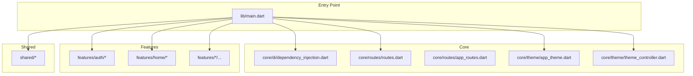
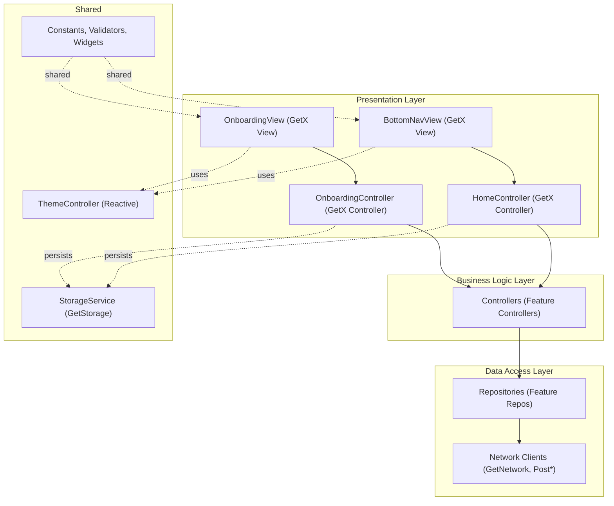
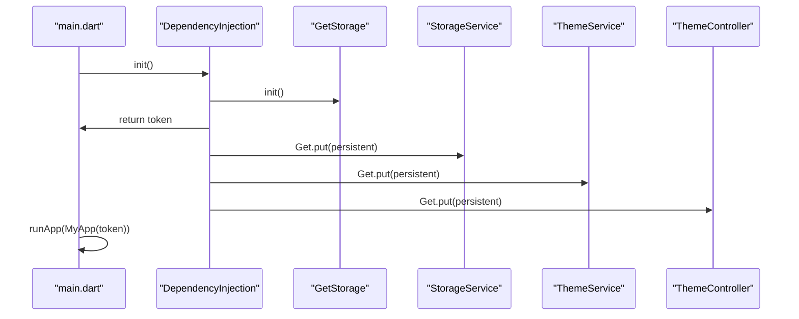
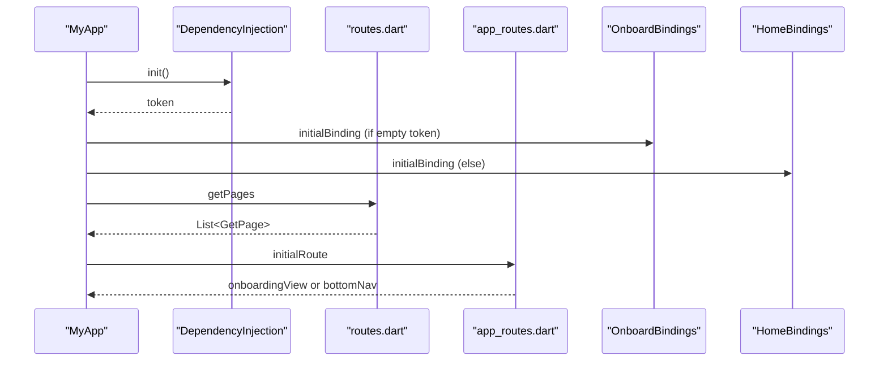
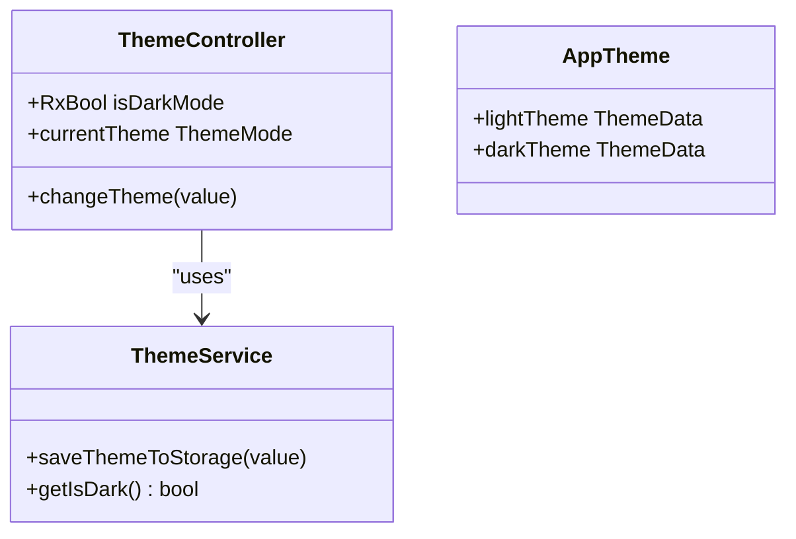
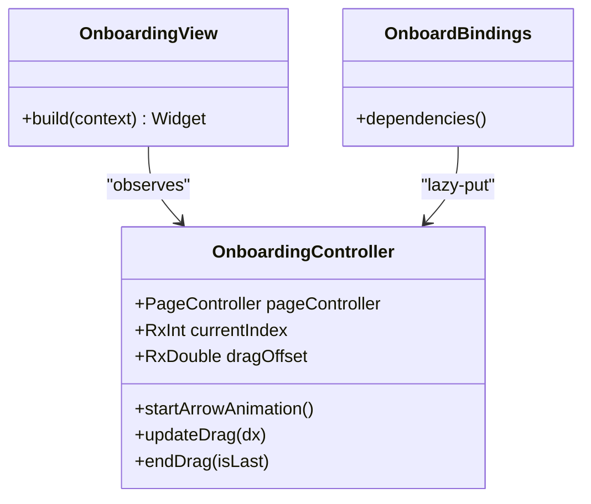
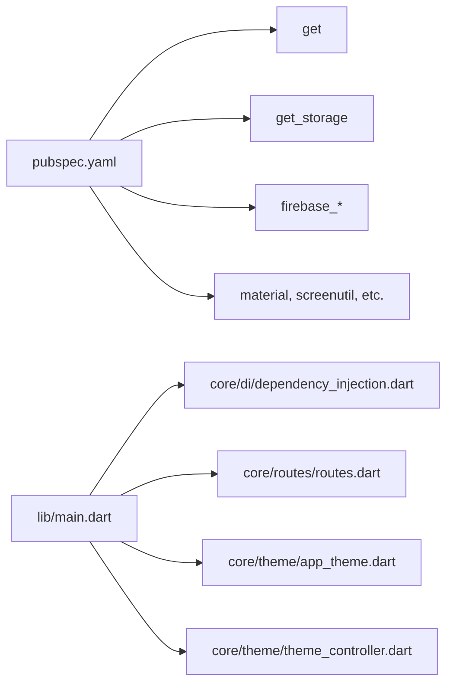

# Architecture Overview

<cite>
**Referenced Files in This Document**
- [main.dart](file://lib/main.dart)
- [pubspec.yaml](file://pubspec.yaml)
- [dependency_injection.dart](file://lib/core/di/dependency_injection.dart)
- [app_routes.dart](file://lib/core/routes/app_routes.dart)
- [routes.dart](file://lib/core/routes/routes.dart)
- [app_theme.dart](file://lib/core/theme/app_theme.dart)
- [theme_controller.dart](file://lib/core/theme/theme_controller.dart)
- [onboard_bindings.dart](file://lib/features/auth/bindings/onboard_bindings.dart)
- [onboarding_controller.dart](file://lib/features/auth/controller/onboarding_controller.dart)
- [onboarding_view.dart](file://lib/features/auth/views/onboarding_view.dart)
- [home_bindings.dart](file://lib/features/home/bindings/home_bindings.dart)
</cite>

## Table of Contents
1. [Introduction](#introduction)
2. [Project Structure](#project-structure)
3. [Core Components](#core-components)
4. [Architecture Overview](#architecture-overview)
5. [Detailed Component Analysis](#detailed-component-analysis)
6. [Dependency Analysis](#dependency-analysis)
7. [Performance Considerations](#performance-considerations)
8. [Troubleshooting Guide](#troubleshooting-guide)
9. [Conclusion](#conclusion)

## Introduction
This document describes the ZB-DEZINE system architecture with a focus on MVVM pattern, GetX state management, modular feature organization, and dependency injection. The application follows layered architecture:
- Presentation Layer: Views and controllers (MVVM)
- Business Logic Layer: Controllers and Services
- Data Access Layer: Repositories and Network clients
- Shared Utilities: Constants, extensions, and reusable widgets

Cross-cutting concerns include state management via GetX, routing via GetPageRoute, theming, and data persistence through GetStorage.

## Project Structure
The project is organized into feature-centric modules under features/, shared utilities under shared/, and core infrastructure under core/. The main entry point initializes dependency injection, sets up routing, and configures theming.



**Diagram sources**
- [main.dart](file://lib/main.dart)
- [dependency_injection.dart](file://lib/core/di/dependency_injection.dart)
- [routes.dart](file://lib/core/routes/routes.dart)
- [app_routes.dart](file://lib/core/routes/app_routes.dart)
- [app_theme.dart](file://lib/core/theme/app_theme.dart)
- [theme_controller.dart](file://lib/core/theme/theme_controller.dart)

**Section sources**
- [main.dart](file://lib/main.dart)
- [pubspec.yaml](file://pubspec.yaml)

## Core Components
- Dependency Injection: Centralized initialization of storage, theme services, and network clients using Get.put and lazy loading via Get.lazyPut.
- Routing: Named routes defined centrally and mapped to pages with bindings for feature-specific controllers.
- Theming: Static theme definitions with a reactive ThemeController managing theme mode and persistence.
- MVVM Pattern: Views extend GetView<T>, controllers extend GetxController, enabling reactive UI updates.

**Section sources**
- [dependency_injection.dart](file://lib/core/di/dependency_injection.dart)
- [app_routes.dart](file://lib/core/routes/app_routes.dart)
- [routes.dart](file://lib/core/routes/routes.dart)
- [app_theme.dart](file://lib/core/theme/app_theme.dart)
- [theme_controller.dart](file://lib/core/theme/theme_controller.dart)

## Architecture Overview
The system adheres to Clean Architecture principles with clear separation of concerns:
- Presentation Layer: Views and controllers handle UI and user interactions.
- Business Logic Layer: Controllers orchestrate use cases and coordinate repositories.
- Data Access Layer: Repositories encapsulate data sources (network) and expose domain-facing APIs.
- Shared Utilities: Constants, validators, and reusable widgets.



**Diagram sources**
- [onboarding_view.dart](file://lib/features/auth/views/onboarding_view.dart)
- [onboarding_controller.dart](file://lib/features/auth/controller/onboarding_controller.dart)
- [home_bindings.dart](file://lib/features/home/bindings/home_bindings.dart)
- [theme_controller.dart](file://lib/core/theme/theme_controller.dart)
- [dependency_injection.dart](file://lib/core/di/dependency_injection.dart)

## Detailed Component Analysis

### Dependency Injection and Initialization
- Purpose: Initialize persistent services (storage, theme, network) and resolve the initial authentication token to decide the initial route.
- Mechanism: Get.put for singletons, GetStorage.init for secure storage, and Get.find to retrieve instances across the app lifecycle.
- Outcome: Centralized control over service lifetime and availability.



**Diagram sources**
- [main.dart](file://lib/main.dart)
- [dependency_injection.dart](file://lib/core/di/dependency_injection.dart)

**Section sources**
- [main.dart](file://lib/main.dart)
- [dependency_injection.dart](file://lib/core/di/dependency_injection.dart)

### Routing and Navigation
- Routes: Centralized constants define named routes; routes.dart maps each route to a page and its binding.
- Initial Route: Decided by token presence; onboarding vs bottom navigation.
- Bindings: Each route binds a dedicated Binding class that lazy-instantiates controllers and repositories.



**Diagram sources**
- [main.dart](file://lib/main.dart)
- [routes.dart](file://lib/core/routes/routes.dart)
- [app_routes.dart](file://lib/core/routes/app_routes.dart)
- [onboard_bindings.dart](file://lib/features/auth/bindings/onboard_bindings.dart)
- [home_bindings.dart](file://lib/features/home/bindings/home_bindings.dart)

**Section sources**
- [app_routes.dart](file://lib/core/routes/app_routes.dart)
- [routes.dart](file://lib/core/routes/routes.dart)
- [onboard_bindings.dart](file://lib/features/auth/bindings/onboard_bindings.dart)
- [home_bindings.dart](file://lib/features/home/bindings/home_bindings.dart)

### Theming and State Management
- ThemeController: Reactive controller holding isDarkMode and delegating persistence to ThemeService.
- AppTheme: Static theme definitions for light/dark modes.
- Integration: MyApp reads ThemeController.currentTheme to switch themes reactively.



**Diagram sources**
- [theme_controller.dart](file://lib/core/theme/theme_controller.dart)
- [app_theme.dart](file://lib/core/theme/app_theme.dart)

**Section sources**
- [theme_controller.dart](file://lib/core/theme/theme_controller.dart)
- [app_theme.dart](file://lib/core/theme/app_theme.dart)

### MVVM Pattern in Authentication Feature
- View: OnboardingView extends GetView<OnboardingController>.
- Controller: OnboardingController extends GetxController, manages UI state and animations.
- Binding: OnboardBindings lazy-loads OnboardingController for the onboarding route.



**Diagram sources**
- [onboarding_view.dart](file://lib/features/auth/views/onboarding_view.dart)
- [onboarding_controller.dart](file://lib/features/auth/controller/onboarding_controller.dart)
- [onboard_bindings.dart](file://lib/features/auth/bindings/onboard_bindings.dart)

**Section sources**
- [onboarding_view.dart](file://lib/features/auth/views/onboarding_view.dart)
- [onboarding_controller.dart](file://lib/features/auth/controller/onboarding_controller.dart)
- [onboard_bindings.dart](file://lib/features/auth/bindings/onboard_bindings.dart)

### Modular Feature Organization and Repository Pattern
- Feature Modules: Each feature organizes its own bindings, controllers, views, models, and repositories.
- Repository Pattern: Controllers depend on repositories, which depend on network clients. This decouples UI from data sources.
- Example: HomeBindings demonstrates lazy injection of repositories and controllers, each resolving dependencies via Get.find.

```mermaid
flowchart TD
Start(["Feature Route Accessed"]) --> Bind["Binding.dependencies()"]
Bind --> Repo["Get.lazyPut(Repositories)"]
Repo --> Ctrl["Get.lazyPut(Controllers)"]
Ctrl --> View["GetX View renders"]
View --> Ctrl : "UI events"
Ctrl --> Repo : "fetch/update data"
Repo --> Net["Network Client"]
Net --> Repo : "response"
Repo --> Ctrl : "domain model"
Ctrl --> View : "reactive update"
```

**Diagram sources**
- [home_bindings.dart](file://lib/features/home/bindings/home_bindings.dart)

**Section sources**
- [home_bindings.dart](file://lib/features/home/bindings/home_bindings.dart)

## Dependency Analysis
- External Libraries: The project relies on GetX for routing/state, GetStorage for persistence, and various UI packages. These are declared in pubspec.yaml.
- Internal Coupling: Features are loosely coupled via bindings and controllers; core services (DI, routes, theme) are consumed by features but remain centralized.
- Circular Dependencies: None observed in the analyzed files; bindings isolate controller creation and dependency resolution.



**Diagram sources**
- [pubspec.yaml](file://pubspec.yaml)
- [main.dart](file://lib/main.dart)
- [dependency_injection.dart](file://lib/core/di/dependency_injection.dart)
- [routes.dart](file://lib/core/routes/routes.dart)
- [app_theme.dart](file://lib/core/theme/app_theme.dart)
- [theme_controller.dart](file://lib/core/theme/theme_controller.dart)

**Section sources**
- [pubspec.yaml](file://pubspec.yaml)

## Performance Considerations
- Reactive Updates: GetX’s reactive variables minimize rebuild scopes; prefer Rx fields for granular updates.
- Lazy Loading: Use Get.lazyPut in bindings to instantiate controllers and repositories only when needed.
- Network Efficiency: Centralize network clients and reuse instances via DI to avoid redundant allocations.
- Persistence: Persist small flags (theme, token) via GetStorage to reduce startup overhead.

## Troubleshooting Guide
- Theme Not Switching: Verify ThemeController.changeTheme is invoked and ThemeService persistence is initialized.
- Route Not Found: Confirm the route name exists in AppRoutes and a GetPage mapping exists in routes.dart.
- Token-Based Routing Issues: Ensure DependencyInjection.init completes and returns a non-empty token for authenticated flow.
- Missing Dependencies: If a controller cannot resolve a dependency, check the corresponding Binding.lazyPut registration.

**Section sources**
- [theme_controller.dart](file://lib/core/theme/theme_controller.dart)
- [dependency_injection.dart](file://lib/core/di/dependency_injection.dart)
- [app_routes.dart](file://lib/core/routes/app_routes.dart)
- [routes.dart](file://lib/core/routes/routes.dart)

## Conclusion
ZB-DEZINE employs a clean, modular architecture with MVVM and GetX to achieve scalable UI state management, centralized dependency injection, and robust routing. The layered design separates concerns effectively, while feature-based organization promotes maintainability and team autonomy. Cross-cutting concerns like theming and persistence are handled through dedicated services and controllers, ensuring consistent behavior across the app.