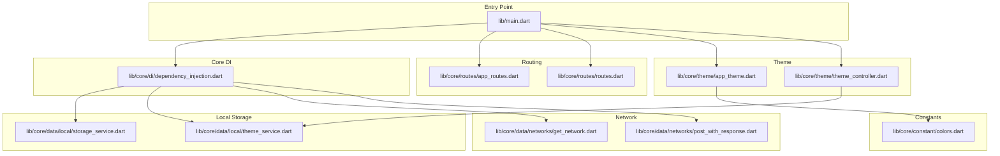
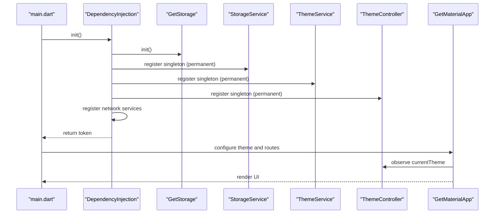
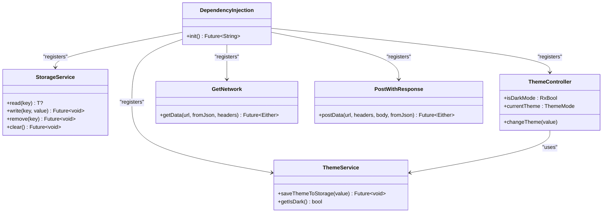
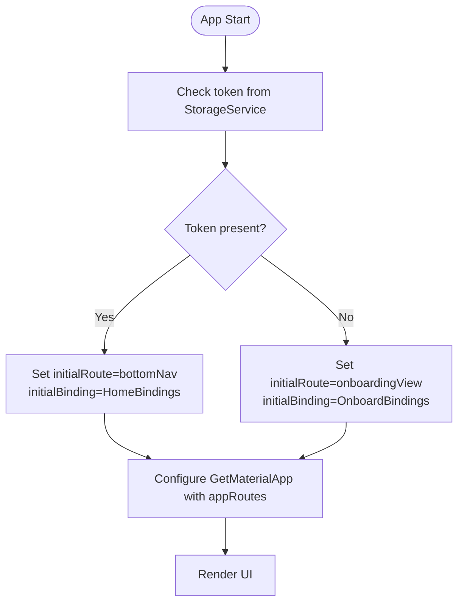
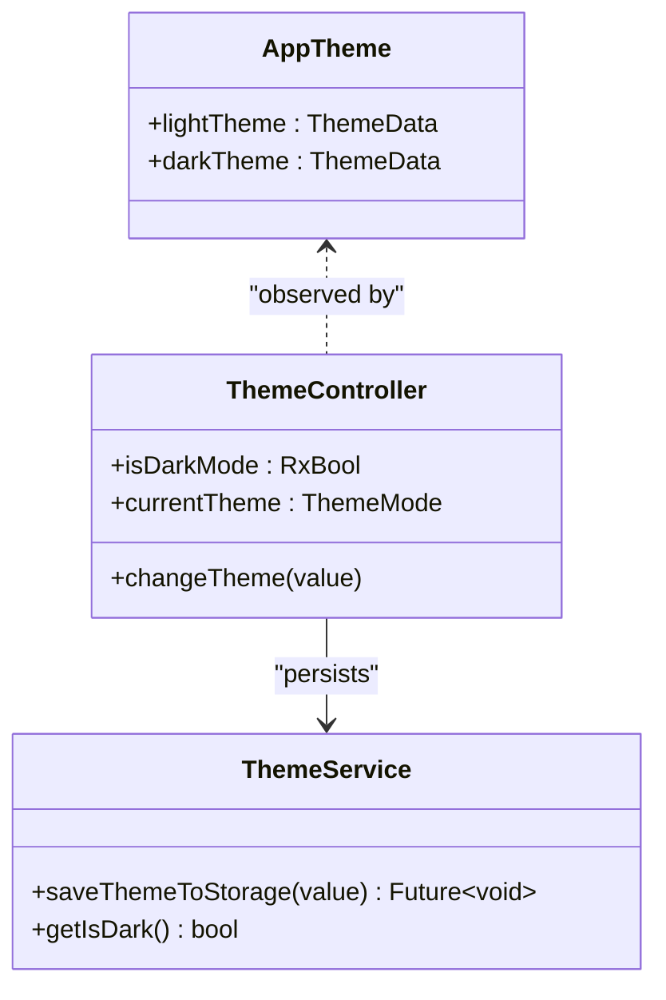
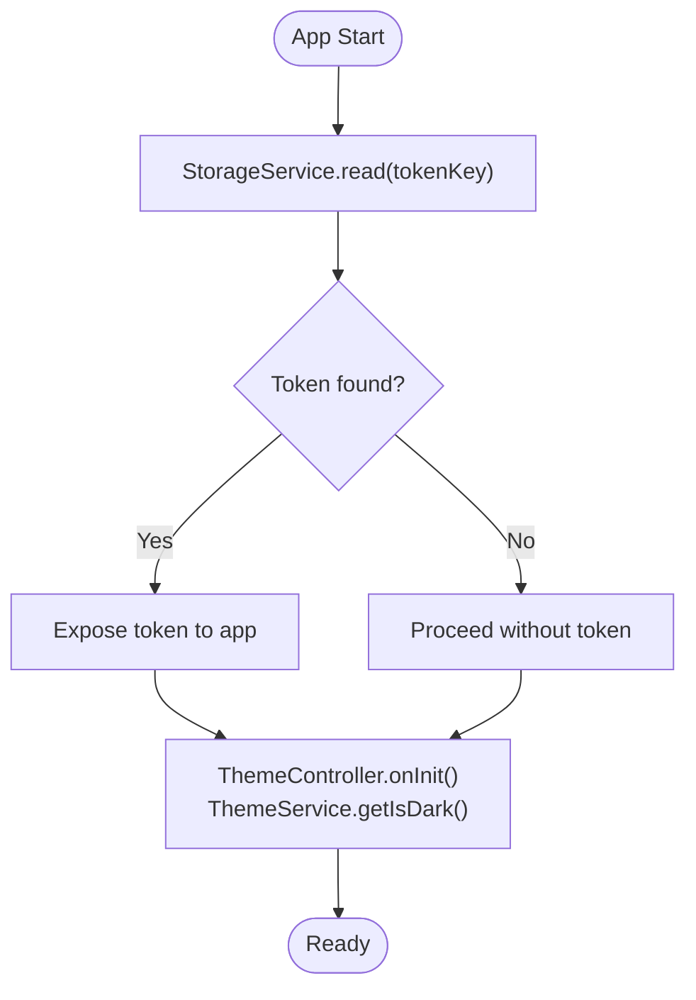
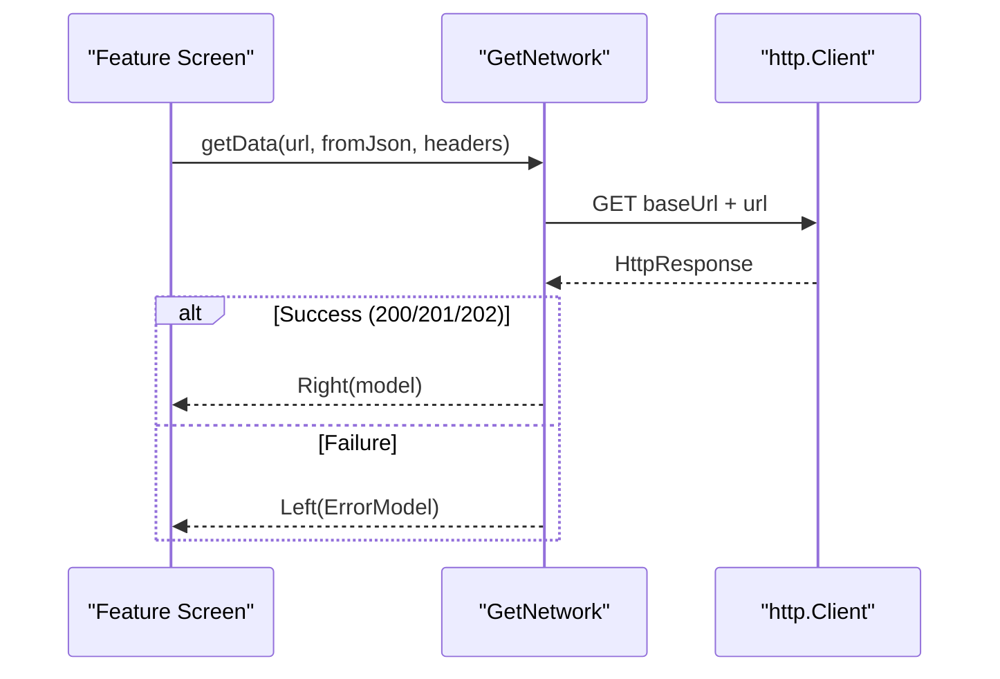
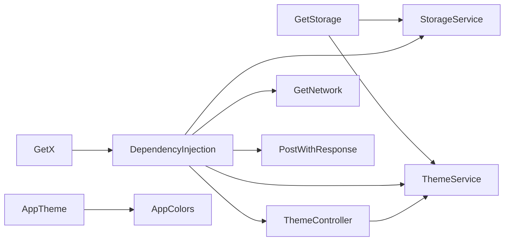

# Core Infrastructure

<cite>
**Referenced Files in This Document**
- [main.dart](file://lib/main.dart)
- [dependency_injection.dart](file://lib/core/di/dependency_injection.dart)
- [app_routes.dart](file://lib/core/routes/app_routes.dart)
- [routes.dart](file://lib/core/routes/routes.dart)
- [app_theme.dart](file://lib/core/theme/app_theme.dart)
- [theme_controller.dart](file://lib/core/theme/theme_controller.dart)
- [storage_service.dart](file://lib/core/data/local/storage_service.dart)
- [theme_service.dart](file://lib/core/data/local/theme_service.dart)
- [get_network.dart](file://lib/core/data/networks/get_network.dart)
- [post_with_response.dart](file://lib/core/data/networks/post_with_response.dart)
- [colors.dart](file://lib/core/constant/colors.dart)
- [pubspec.yaml](file://pubspec.yaml)
</cite>

## Table of Contents
1. [Introduction](#introduction)
2. [Project Structure](#project-structure)
3. [Core Components](#core-components)
4. [Architecture Overview](#architecture-overview)
5. [Detailed Component Analysis](#detailed-component-analysis)
6. [Dependency Analysis](#dependency-analysis)
7. [Performance Considerations](#performance-considerations)
8. [Troubleshooting Guide](#troubleshooting-guide)
9. [Conclusion](#conclusion)
10. [Appendices](#appendices)

## Introduction
This document explains ZB-DEZINE’s core infrastructure with a focus on:
- Dependency injection using GetX, including service registration patterns and lifecycle management
- Routing architecture with type-safe route names and authentication-aware initial route selection
- Theme management system implementing Material Design 3 with light/dark mode support and a centralized color system
- Local storage mechanisms for tokens and theme preferences
- Practical examples for initializing services, configuring routes, and switching themes
- Guidance on service dependencies, singleton patterns via GetX, and global state management

## Project Structure
The core infrastructure resides under lib/core and integrates with feature modules and shared utilities. The main entry initializes dependency injection, sets up theme and routing, and bootstraps the app.

**Diagram sources**
- [main.dart:12-46](file://lib/main.dart#L12-L46)
- [dependency_injection.dart:11-26](file://lib/core/di/dependency_injection.dart#L11-L26)
- [app_routes.dart:1-34](file://lib/core/routes/app_routes.dart#L1-L34)
- [routes.dart:55-211](file://lib/core/routes/routes.dart#L55-L211)
- [app_theme.dart:4-22](file://lib/core/theme/app_theme.dart#L4-L22)
- [theme_controller.dart:5-22](file://lib/core/theme/theme_controller.dart#L5-L22)
- [storage_service.dart:3-22](file://lib/core/data/local/storage_service.dart#L3-L22)
- [theme_service.dart:3-15](file://lib/core/data/local/theme_service.dart#L3-L15)
- [get_network.dart:8-40](file://lib/core/data/networks/get_network.dart#L8-L40)
- [post_with_response.dart:7-44](file://lib/core/data/networks/post_with_response.dart#L7-L44)
- [colors.dart:3-116](file://lib/core/constant/colors.dart#L3-L116)

**Section sources**
- [main.dart:12-46](file://lib/main.dart#L12-L46)
- [pubspec.yaml:30-60](file://pubspec.yaml#L30-L60)

## Core Components
- Dependency Injection: Centralized initialization of storage, theme, and network services as singletons using GetX.
- Routing: Type-safe route names and a comprehensive page registry with bindings per screen.
- Theme Management: Material Design 3 with separate light/dark themes and a reactive controller managing mode persistence.
- Local Storage: Token and theme preference persistence using GetStorage.
- Network Layer: Typed HTTP clients returning Either-based results for safe error handling.

**Section sources**
- [dependency_injection.dart:11-26](file://lib/core/di/dependency_injection.dart#L11-L26)
- [routes.dart:55-211](file://lib/core/routes/routes.dart#L55-L211)
- [app_theme.dart:4-22](file://lib/core/theme/app_theme.dart#L4-L22)
- [theme_controller.dart:5-22](file://lib/core/theme/theme_controller.dart#L5-L22)
- [storage_service.dart:3-22](file://lib/core/data/local/storage_service.dart#L3-L22)
- [theme_service.dart:3-15](file://lib/core/data/local/theme_service.dart#L3-L15)
- [get_network.dart:8-40](file://lib/core/data/networks/get_network.dart#L8-L40)
- [post_with_response.dart:7-44](file://lib/core/data/networks/post_with_response.dart#L7-L44)

## Architecture Overview
The app bootstraps via main, initializes DI, reads a token from storage, and configures GetMaterialApp with theme and routing. The theme controller observes theme changes and persists them. Services are registered as singletons and retrieved anywhere in the app.

**Diagram sources**
- [main.dart:12-46](file://lib/main.dart#L12-L46)
- [dependency_injection.dart:11-26](file://lib/core/di/dependency_injection.dart#L11-L26)
- [theme_controller.dart:5-22](file://lib/core/theme/theme_controller.dart#L5-L22)

## Detailed Component Analysis

### Dependency Injection System (GetX)
- Initialization pattern:
  - Ensures storage is initialized, registers services as singletons with permanent lifetime, and returns a token from storage.
  - Network services are also registered as singletons for reuse across screens.
- Lifecycle management:
  - Singletons persist for the app lifecycle; retrieval uses Get.find<T>().
- Authentication-aware bootstrap:
  - The returned token determines initial route and initial binding.

**Diagram sources**
- [dependency_injection.dart:11-26](file://lib/core/di/dependency_injection.dart#L11-L26)
- [storage_service.dart:3-22](file://lib/core/data/local/storage_service.dart#L3-L22)
- [theme_service.dart:3-15](file://lib/core/data/local/theme_service.dart#L3-L15)
- [theme_controller.dart:5-22](file://lib/core/theme/theme_controller.dart#L5-L22)
- [get_network.dart:8-40](file://lib/core/data/networks/get_network.dart#L8-L40)
- [post_with_response.dart:7-44](file://lib/core/data/networks/post_with_response.dart#L7-L44)

**Section sources**
- [dependency_injection.dart:11-26](file://lib/core/di/dependency_injection.dart#L11-L26)
- [main.dart:12-19](file://lib/main.dart#L12-L19)

### Routing Architecture (Type-Safe Navigation)
- Route names:
  - Centralized constants define all route paths, enabling compile-time safety and refactoring support.
- Page registry:
  - A typed list of GetPage entries maps each route to its view and binding(s).
- Authentication-aware routing:
  - Initial route and binding are selected based on whether a token exists.

**Diagram sources**
- [main.dart:36-40](file://lib/main.dart#L36-L40)
- [app_routes.dart:1-34](file://lib/core/routes/app_routes.dart#L1-L34)
- [routes.dart:55-211](file://lib/core/routes/routes.dart#L55-L211)

**Section sources**
- [app_routes.dart:1-34](file://lib/core/routes/app_routes.dart#L1-L34)
- [routes.dart:55-211](file://lib/core/routes/routes.dart#L55-L211)
- [main.dart:36-40](file://lib/main.dart#L36-L40)

### Theme Management (Material Design 3)
- Themes:
  - Light and dark themes are defined with Material 3 enabled.
  - Dark theme leverages a dedicated color scheme and primary color.
- Global state:
  - ThemeController holds reactive state for dark mode and exposes currentTheme for GetMaterialApp.
- Persistence:
  - ThemeService stores and retrieves the theme preference using GetStorage.

**Diagram sources**
- [app_theme.dart:4-22](file://lib/core/theme/app_theme.dart#L4-L22)
- [theme_controller.dart:5-22](file://lib/core/theme/theme_controller.dart#L5-L22)
- [theme_service.dart:3-15](file://lib/core/data/local/theme_service.dart#L3-L15)

**Section sources**
- [app_theme.dart:4-22](file://lib/core/theme/app_theme.dart#L4-L22)
- [theme_controller.dart:5-22](file://lib/core/theme/theme_controller.dart#L5-L22)
- [theme_service.dart:3-15](file://lib/core/data/local/theme_service.dart#L3-L15)
- [colors.dart:3-116](file://lib/core/constant/colors.dart#L3-L116)

### Local Storage (Tokens and Preferences)
- Token storage:
  - StorageService provides typed read/write/remove/clear with a token key.
- Theme preference:
  - ThemeService persists and restores the dark mode flag.
- Network integration:
  - Network services rely on base URLs and headers; tokens can be injected via headers manager elsewhere.

**Diagram sources**
- [dependency_injection.dart:21-24](file://lib/core/di/dependency_injection.dart#L21-L24)
- [storage_service.dart:7-9](file://lib/core/data/local/storage_service.dart#L7-L9)
- [theme_controller.dart:9-12](file://lib/core/theme/theme_controller.dart#L9-L12)
- [theme_service.dart:11-14](file://lib/core/data/local/theme_service.dart#L11-L14)

**Section sources**
- [storage_service.dart:3-22](file://lib/core/data/local/storage_service.dart#L3-L22)
- [theme_service.dart:3-15](file://lib/core/data/local/theme_service.dart#L3-L15)
- [dependency_injection.dart:11-26](file://lib/core/di/dependency_injection.dart#L11-L26)

### Network Layer (Safe HTTP Calls)
- Error modeling:
  - Responses are typed with Either<ErrorModel, T>, enabling safe handling of HTTP and parsing errors.
- Reusability:
  - Base URL and JSON decoding are centralized; services encapsulate request logic.

**Diagram sources**
- [get_network.dart:10-39](file://lib/core/data/networks/get_network.dart#L10-L39)

**Section sources**
- [get_network.dart:8-40](file://lib/core/data/networks/get_network.dart#L8-L40)
- [post_with_response.dart:7-44](file://lib/core/data/networks/post_with_response.dart#L7-L44)

## Dependency Analysis
- External dependencies:
  - GetX powers DI, routing, and reactive state.
  - GetStorage provides persistent storage.
  - http and fpdart enable HTTP requests and functional error modeling.
- Internal dependencies:
  - ThemeController depends on ThemeService.
  - DependencyInjection registers all services and returns a token for bootstrap decisions.
  - Routes depend on feature bindings and views.

**Diagram sources**
- [pubspec.yaml:37, 46:37-46](file://pubspec.yaml#L37-L46)
- [dependency_injection.dart:11-26](file://lib/core/di/dependency_injection.dart#L11-L26)
- [theme_controller.dart:5-22](file://lib/core/theme/theme_controller.dart#L5-L22)
- [app_theme.dart:4-22](file://lib/core/theme/app_theme.dart#L4-L22)
- [colors.dart:3-116](file://lib/core/constant/colors.dart#L3-L116)

**Section sources**
- [pubspec.yaml:30-60](file://pubspec.yaml#L30-L60)
- [dependency_injection.dart:11-26](file://lib/core/di/dependency_injection.dart#L11-L26)

## Performance Considerations
- Singleton services reduce overhead and memory footprint by avoiding repeated instantiation.
- Reactive theme updates via GetX minimize rebuild scopes; keep theme-dependent widgets scoped appropriately.
- Network calls should reuse services and avoid unnecessary retries; centralize error handling to prevent redundant UI work.
- Prefer lazy initialization for heavy resources and defer expensive computations until after token/bootstrap decisions are made.

## Troubleshooting Guide
- Token not applied:
  - Verify StorageService.read(tokenKey) returns a non-empty value and DI.init() propagates it to main.
- Theme not persisting:
  - Confirm ThemeController.changeTheme(value) is invoked and ThemeService.saveThemeToStorage(value) completes.
- Route not navigating:
  - Ensure the route name matches AppRoutes constants and the corresponding GetPage is registered in appRoutes.
- Network failures:
  - Inspect Either results; handle Left(ErrorModel) gracefully and surface user-friendly messages.

**Section sources**
- [dependency_injection.dart:21-24](file://lib/core/di/dependency_injection.dart#L21-L24)
- [theme_controller.dart:15-18](file://lib/core/theme/theme_controller.dart#L15-L18)
- [theme_service.dart:7-14](file://lib/core/data/local/theme_service.dart#L7-L14)
- [routes.dart:55-211](file://lib/core/routes/routes.dart#L55-L211)
- [get_network.dart:10-39](file://lib/core/data/networks/get_network.dart#L10-L39)

## Conclusion
ZB-DEZINE’s core infrastructure leverages GetX for robust dependency injection, type-safe routing, and reactive state management. Material Design 3 themes are cleanly separated and persisted, while StorageService and ThemeService provide reliable token and preference handling. The network layer offers safe, typed responses for predictable error handling. Together, these components form a scalable foundation for feature development and consistent user experience.

## Appendices

### Practical Examples Index
- Service initialization:
  - Call DependencyInjection.init() during app startup and pass the returned token to MyApp.
  - Reference: [main.dart:12-19](file://lib/main.dart#L12-L19), [dependency_injection.dart:11-26](file://lib/core/di/dependency_injection.dart#L11-L26)
- Route configuration:
  - Define route names in AppRoutes and register pages in appRoutes with bindings.
  - Reference: [app_routes.dart:1-34](file://lib/core/routes/app_routes.dart#L1-L34), [routes.dart:55-211](file://lib/core/routes/routes.dart#L55-L211)
- Theme switching:
  - Invoke ThemeController.changeTheme(value) to toggle mode and persist with ThemeService.
  - Reference: [theme_controller.dart:15-18](file://lib/core/theme/theme_controller.dart#L15-L18), [theme_service.dart:7-14](file://lib/core/data/local/theme_service.dart#L7-L14)