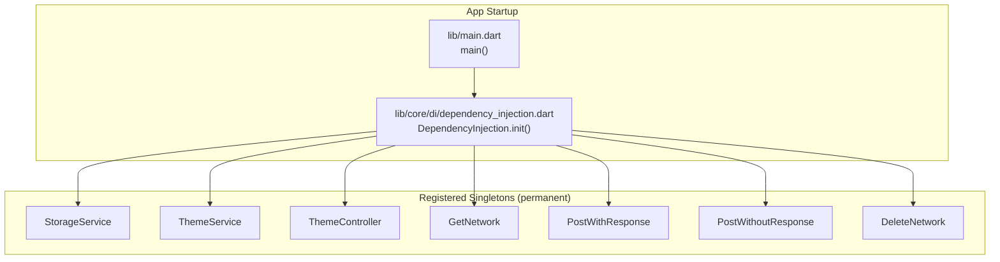
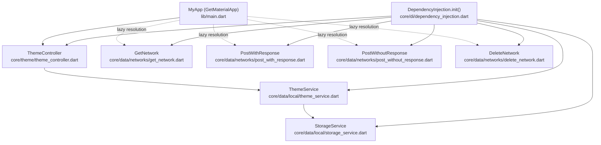
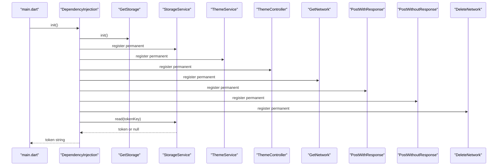
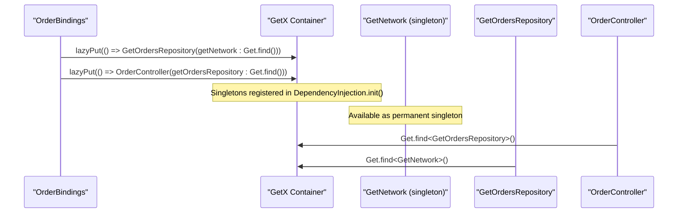
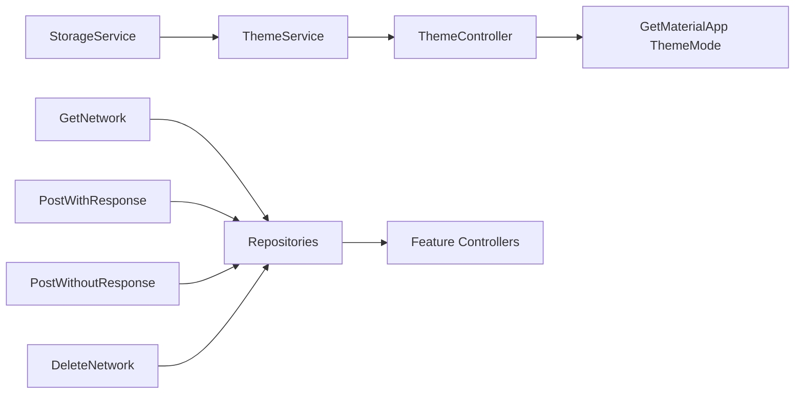

# Dependency Injection System

<cite>
**Referenced Files in This Document**
- [main.dart](file://lib/main.dart)
- [dependency_injection.dart](file://lib/core/di/dependency_injection.dart)
- [storage_service.dart](file://lib/core/data/local/storage_service.dart)
- [theme_service.dart](file://lib/core/data/local/theme_service.dart)
- [theme_controller.dart](file://lib/core/theme/theme_controller.dart)
- [get_network.dart](file://lib/core/data/networks/get_network.dart)
- [post_with_response.dart](file://lib/core/data/networks/post_with_response.dart)
- [post_without_response.dart](file://lib/core/data/networks/post_without_response.dart)
- [delete_network.dart](file://lib/core/data/networks/delete_network.dart)
- [order_bindings.dart](file://lib/features/order/bindings/order_bindings.dart)
</cite>

## Table of Contents
1. [Introduction](#introduction)
2. [Project Structure](#project-structure)
3. [Core Components](#core-components)
4. [Architecture Overview](#architecture-overview)
5. [Detailed Component Analysis](#detailed-component-analysis)
6. [Dependency Analysis](#dependency-analysis)
7. [Performance Considerations](#performance-considerations)
8. [Troubleshooting Guide](#troubleshooting-guide)
9. [Conclusion](#conclusion)

## Introduction
This document explains ZB-DEZINE's dependency injection system built on GetX. It focuses on how services are registered during app startup via the DependencyInjection class, how Get.put() ensures permanent singleton lifecycles, and how services are later retrieved using Get.find(). The documentation covers the initialization sequence, service dependencies among StorageService, ThemeService, ThemeController, and network services, and demonstrates practical patterns for adding new services, managing lifecycles, and integrating with GetX's reactive state management.

## Project Structure
The dependency injection system centers around a single initialization method that registers core services as singletons. These services are then consumed by controllers and repositories across features, often through lazy resolution with Get.lazyPut() inside binding classes.

**Diagram sources**
- [main.dart:12-19](file://lib/main.dart#L12-L19)
- [dependency_injection.dart:12-25](file://lib/core/di/dependency_injection.dart#L12-L25)

**Section sources**
- [main.dart:12-19](file://lib/main.dart#L12-L19)
- [dependency_injection.dart:12-25](file://lib/core/di/dependency_injection.dart#L12-L25)

## Core Components
- DependencyInjection.init(): Asynchronous initializer that:
  - Initializes GetStorage
  - Registers StorageService, ThemeService, ThemeController, and network services as permanent singletons
  - Returns a token string by reading from StorageService
- StorageService: Provides persistent key-value storage using GetStorage, exposes read/write/remove/clear operations.
- ThemeService: Persists theme preference using GetStorage and reads the stored theme state.
- ThemeController: Reactive controller that depends on ThemeService, observes theme state, and updates persistence when toggled.
- Network Services: Encapsulate HTTP operations (GET, POST with response, POST without response, DELETE) returning typed Either results.

Key behaviors:
- Permanent registration with Get.put(..., permanent: true) ensures services live for the app lifetime.
- Retrieval with Get.find<T>() resolves the singleton instances.
- Initialization order is explicit in DependencyInjection.init(), ensuring dependencies are available before use.

**Section sources**
- [dependency_injection.dart:12-25](file://lib/core/di/dependency_injection.dart#L12-L25)
- [storage_service.dart:3-22](file://lib/core/data/local/storage_service.dart#L3-L22)
- [theme_service.dart:3-15](file://lib/core/data/local/theme_service.dart#L3-L15)
- [theme_controller.dart:5-22](file://lib/core/theme/theme_controller.dart#L5-L22)
- [get_network.dart:8-40](file://lib/core/data/networks/get_network.dart#L8-L40)
- [post_with_response.dart:7-44](file://lib/core/data/networks/post_with_response.dart#L7-L44)

## Architecture Overview
The system follows a layered architecture:
- Presentation layer uses ThemeController for reactive theme switching.
- Domain services (StorageService, ThemeService) handle persistence.
- Infrastructure services encapsulate HTTP operations.
- Feature modules resolve dependencies lazily via Get.lazyPut() inside bindings.

**Diagram sources**
- [main.dart:21-46](file://lib/main.dart#L21-L46)
- [dependency_injection.dart:12-25](file://lib/core/di/dependency_injection.dart#L12-L25)
- [theme_controller.dart:5-22](file://lib/core/theme/theme_controller.dart#L5-L22)
- [theme_service.dart:3-15](file://lib/core/data/local/theme_service.dart#L3-L15)
- [storage_service.dart:3-22](file://lib/core/data/local/storage_service.dart#L3-L22)
- [get_network.dart:8-40](file://lib/core/data/networks/get_network.dart#L8-L40)
- [post_with_response.dart:7-44](file://lib/core/data/networks/post_with_response.dart#L7-L44)

## Detailed Component Analysis

### DependencyInjection Class
Responsibilities:
- Initialize GetStorage
- Register core services as permanent singletons
- Return a token string by reading from StorageService

Initialization sequence:
1. Await GetStorage.init()
2. Register StorageService, ThemeService, ThemeController, and network services
3. Retrieve token from StorageService and return it

**Diagram sources**
- [main.dart:12-19](file://lib/main.dart#L12-L19)
- [dependency_injection.dart:12-25](file://lib/core/di/dependency_injection.dart#L12-L25)

**Section sources**
- [dependency_injection.dart:12-25](file://lib/core/di/dependency_injection.dart#L12-L25)
- [main.dart:12-19](file://lib/main.dart#L12-L19)

### StorageService
Responsibilities:
- Provide typed read/write/remove/clear operations backed by GetStorage
- Expose a tokenKey constant for authentication token persistence

Usage pattern:
- Used by DependencyInjection.init() to read the token after registration
- Can be injected into other services or controllers via Get.find()

**Section sources**
- [storage_service.dart:3-22](file://lib/core/data/local/storage_service.dart#L3-L22)
- [dependency_injection.dart:21-24](file://lib/core/di/dependency_injection.dart#L21-L24)

### ThemeService
Responsibilities:
- Persist and retrieve theme preference using GetStorage
- Provide a themeKey constant for storage access

Integration:
- Consumed by ThemeController during initialization to set initial theme state

**Section sources**
- [theme_service.dart:3-15](file://lib/core/data/local/theme_service.dart#L3-L15)
- [theme_controller.dart:10-11](file://lib/core/theme/theme_controller.dart#L10-L11)

### ThemeController
Responsibilities:
- Reactive controller extending GetxController
- Reads initial theme from ThemeService
- Updates theme state and persists changes via ThemeService
- Exposes currentTheme for app-wide theme mode selection

Lifecycle:
- Resolves ThemeService via Get.find() in onInit()
- Uses reactive state (RxBool) to drive UI updates

**Section sources**
- [theme_controller.dart:5-22](file://lib/core/theme/theme_controller.dart#L5-L22)

### Network Services
Responsibilities:
- Encapsulate HTTP operations with typed result handling using Either<ErrorModel, T>
- Provide base URL via NetworkLinks
- Support optional headers and JSON deserialization callbacks

Patterns:
- Reusable across features
- Retrieved via Get.find() inside lazy bindings

**Section sources**
- [get_network.dart:8-40](file://lib/core/data/networks/get_network.dart#L8-L40)
- [post_with_response.dart:7-44](file://lib/core/data/networks/post_with_response.dart#L7-L44)

### Feature-Level Dependency Resolution Example
Feature bindings demonstrate lazy resolution of dependencies using Get.lazyPut() and retrieval via Get.find(). This pattern ensures services are created only when needed and leverages the singleton registry established by DependencyInjection.init().

**Diagram sources**
- [order_bindings.dart:5-10](file://lib/features/order/bindings/order_bindings.dart#L5-L10)
- [dependency_injection.dart:17-20](file://lib/core/di/dependency_injection.dart#L17-L20)

**Section sources**
- [order_bindings.dart:5-10](file://lib/features/order/bindings/order_bindings.dart#L5-L10)

## Dependency Analysis
- Coupling:
  - ThemeController depends on ThemeService
  - Feature controllers depend on repositories, which depend on network services
  - All core services are singletons registered once at startup
- Cohesion:
  - StorageService and ThemeService encapsulate persistence concerns
  - Network services encapsulate HTTP concerns
- Singleton lifecycle:
  - Permanent registration ensures services survive route changes and widget rebuilds
- Lazy resolution:
  - Feature bindings use Get.lazyPut() to instantiate dependencies on demand

**Diagram sources**
- [theme_controller.dart:10-11](file://lib/core/theme/theme_controller.dart#L10-L11)
- [theme_service.dart:11-14](file://lib/core/data/local/theme_service.dart#L11-L14)
- [dependency_injection.dart:14-20](file://lib/core/di/dependency_injection.dart#L14-L20)

**Section sources**
- [dependency_injection.dart:14-20](file://lib/core/di/dependency_injection.dart#L14-L20)
- [theme_controller.dart:10-11](file://lib/core/theme/theme_controller.dart#L10-L11)

## Performance Considerations
- Singleton registration avoids repeated instantiation overhead.
- LazyPut defers creation until dependencies are actually used, reducing startup cost.
- Using typed keys with Get.put<T>() and Get.find<T>() minimizes runtime lookup ambiguity.
- Reactive controllers update only affected widgets, leveraging GetX's optimized change notifications.

## Troubleshooting Guide
Common issues and resolutions:
- Missing GetStorage initialization:
  - Symptom: Null or missing values from StorageService
  - Fix: Ensure DependencyInjection.init() is called before accessing StorageService
- Service not found during lazy resolution:
  - Symptom: Get.find() throws or returns null
  - Fix: Verify the service was registered as permanent in DependencyInjection.init(); confirm lazyPut() occurs in the correct binding
- Theme not updating:
  - Symptom: UI does not reflect theme changes
  - Fix: Ensure ThemeController.changeTheme() is invoked and ThemeService.saveThemeToStorage() completes
- Network failures:
  - Symptom: Requests return Left(ErrorModel)
  - Fix: Inspect status codes and error model construction; verify base URL and headers

**Section sources**
- [dependency_injection.dart:12-25](file://lib/core/di/dependency_injection.dart#L12-L25)
- [theme_controller.dart:15-18](file://lib/core/theme/theme_controller.dart#L15-L18)
- [get_network.dart:14-39](file://lib/core/data/networks/get_network.dart#L14-L39)

## Conclusion
ZB-DEZINE's dependency injection system leverages GetX to establish a robust, reactive, and maintainable architecture. Core services are registered once as permanent singletons during startup, enabling reliable cross-feature access. Feature-level lazy resolution ensures efficient resource usage. The system integrates seamlessly with GetX's reactive controllers, providing a clean separation of concerns and predictable lifecycle management.