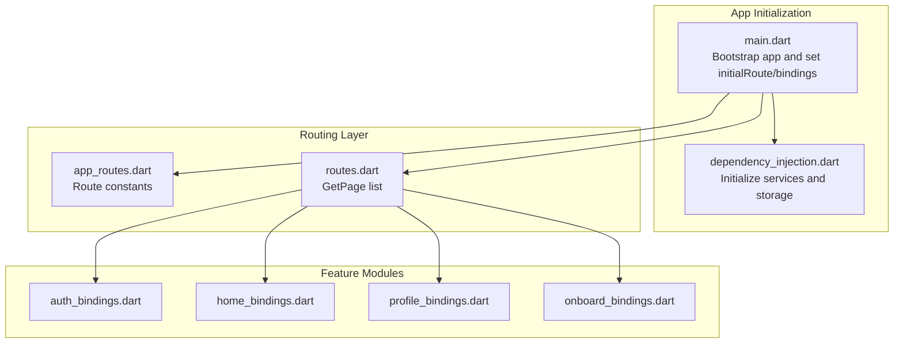
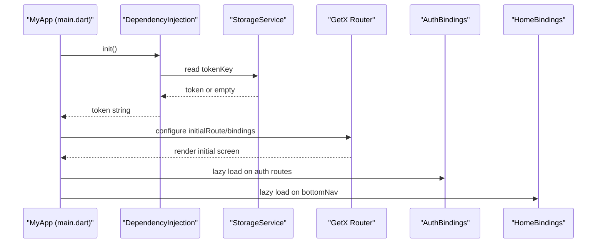
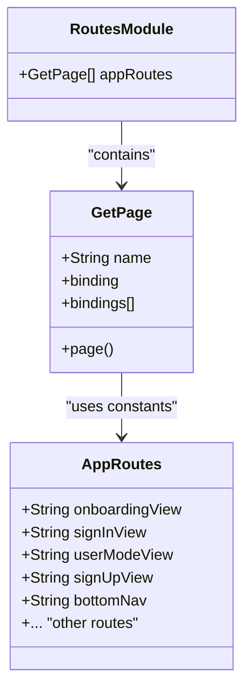
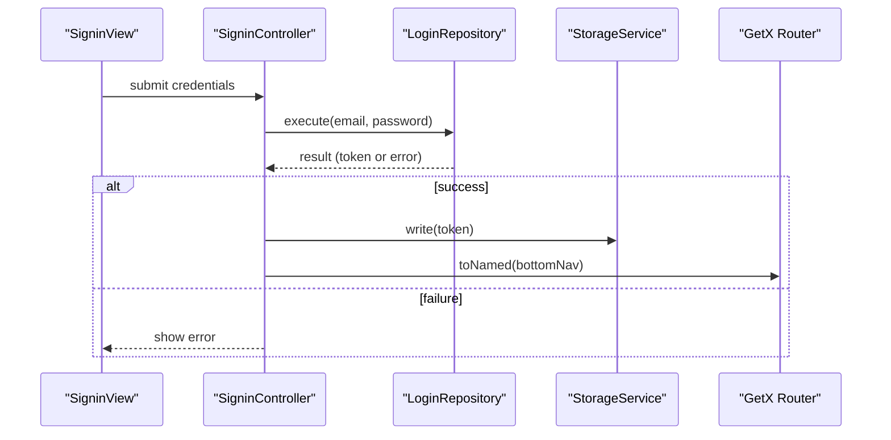
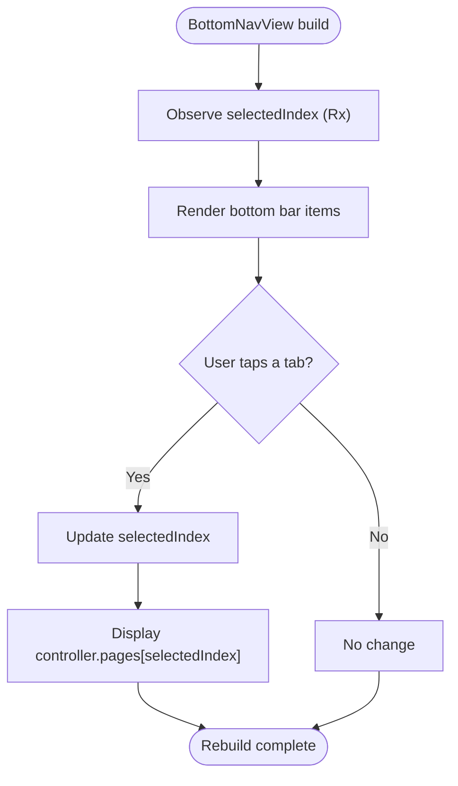
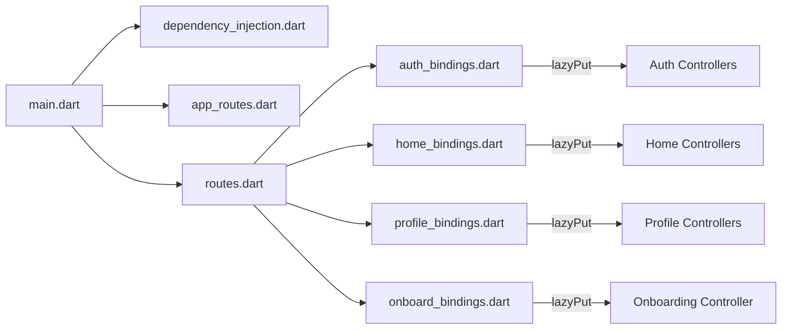

# Routing System

<cite>
**Referenced Files in This Document**
- [main.dart](file://lib/main.dart)
- [app_routes.dart](file://lib/core/routes/app_routes.dart)
- [routes.dart](file://lib/core/routes/routes.dart)
- [dependency_injection.dart](file://lib/core/di/dependency_injection.dart)
- [signin_controller.dart](file://lib/features/auth/controller/signin_controller.dart)
- [bottom_nav_view.dart](file://lib/features/home/views/bottom_nav_view.dart)
- [onboard_bindings.dart](file://lib/features/auth/bindings/onboard_bindings.dart)
- [home_bindings.dart](file://lib/features/home/bindings/home_bindings.dart)
- [auth_bindings.dart](file://lib/features/auth/bindings/auth_bindings.dart)
- [profile_bindings.dart](file://lib/features/profile/bindings/profile_bindings.dart)
</cite>

## Table of Contents
1. [Introduction](#introduction)
2. [Project Structure](#project-structure)
3. [Core Components](#core-components)
4. [Architecture Overview](#architecture-overview)
5. [Detailed Component Analysis](#detailed-component-analysis)
6. [Dependency Analysis](#dependency-analysis)
7. [Performance Considerations](#performance-considerations)
8. [Troubleshooting Guide](#troubleshooting-guide)
9. [Conclusion](#conclusion)

## Introduction
This document explains ZB-DEZINE's routing architecture powered by GetX. It covers route definition patterns, type-safe navigation via named routes, authentication-aware routing, navigation state management, and integration with the broader app architecture. Practical examples demonstrate programmatic navigation, route parameter passing, and conditional navigation based on authentication status.

## Project Structure
The routing system is centered around two core files:
- app_routes.dart: Defines all named routes as constants for type safety.
- routes.dart: Declares GetPage entries that map each named route to its view and associated bindings.

The application bootstraps routing during initialization, selecting the initial route and bindings based on authentication state.

**Diagram sources**
- [main.dart:12-46](file://lib/main.dart#L12-L46)
- [dependency_injection.dart:11-26](file://lib/core/di/dependency_injection.dart#L11-L26)
- [app_routes.dart:1-34](file://lib/core/routes/app_routes.dart#L1-L34)
- [routes.dart:55-211](file://lib/core/routes/routes.dart#L55-L211)

**Section sources**
- [main.dart:12-46](file://lib/main.dart#L12-L46)
- [app_routes.dart:1-34](file://lib/core/routes/app_routes.dart#L1-L34)
- [routes.dart:55-211](file://lib/core/routes/routes.dart#L55-L211)

## Core Components
- Route constants: Centralized, type-safe identifiers for all routes.
- GetPage declarations: Map each route to a view widget and its dependency injection bindings.
- Initial route and bindings: Determined at startup based on stored authentication token.
- Programmatic navigation: Uses Get.toNamed for type-safe navigation and Get.offAll to replace the entire stack.

Key behaviors:
- Type-safe navigation: Routes are referenced via constants, preventing typos and enabling refactoring.
- Authentication-aware routing: Initial route switches between onboarding and bottom navigation depending on token presence.
- Navigation state: Bottom navigation maintains selected tab state inside a dedicated controller.

**Section sources**
- [app_routes.dart:1-34](file://lib/core/routes/app_routes.dart#L1-L34)
- [routes.dart:55-211](file://lib/core/routes/routes.dart#L55-L211)
- [main.dart:36-40](file://lib/main.dart#L36-L40)
- [signin_controller.dart:17-36](file://lib/features/auth/controller/signin_controller.dart#L17-L36)

## Architecture Overview
The routing architecture integrates tightly with dependency injection and feature-specific bindings. Each route declares:
- name: The route constant from app_routes.dart
- page: A factory that builds the view widget
- binding(s): One or more bindings that inject controllers and repositories into the GetX service locator

**Diagram sources**
- [main.dart:12-46](file://lib/main.dart#L12-L46)
- [dependency_injection.dart:11-26](file://lib/core/di/dependency_injection.dart#L11-L26)
- [routes.dart:122-125](file://lib/core/routes/routes.dart#L122-L125)

## Detailed Component Analysis

### Route Definition Patterns
- Route constants: All routes are defined as static strings in app_routes.dart, ensuring type safety and centralized maintenance.
- GetPage entries: routes.dart enumerates all pages with their view factories and bindings. Some routes declare multiple bindings (e.g., bottom navigation).

**Diagram sources**
- [app_routes.dart:1-34](file://lib/core/routes/app_routes.dart#L1-L34)
- [routes.dart:55-211](file://lib/core/routes/routes.dart#L55-L211)

**Section sources**
- [app_routes.dart:1-34](file://lib/core/routes/app_routes.dart#L1-L34)
- [routes.dart:55-211](file://lib/core/routes/routes.dart#L55-L211)

### Authentication-Aware Routing
- Token-driven initial route: The app reads a token from persistent storage and sets the initial route accordingly.
- Programmatic navigation after login: On successful authentication, the app navigates to the bottom navigation route using Get.toNamed.

**Diagram sources**
- [signin_controller.dart:17-36](file://lib/features/auth/controller/signin_controller.dart#L17-L36)
- [main.dart:36-40](file://lib/main.dart#L36-L40)

**Section sources**
- [main.dart:12-46](file://lib/main.dart#L12-L46)
- [signin_controller.dart:17-36](file://lib/features/auth/controller/signin_controller.dart#L17-L36)

### Navigation State Management
- Bottom navigation state: Managed by a controller inside the bottom navigation view. The view observes state changes and rebuilds accordingly.
- Tab selection: Tapping a bottom nav item updates the selected index, switching the visible page in the stack.

**Diagram sources**
- [bottom_nav_view.dart:11-131](file://lib/features/home/views/bottom_nav_view.dart#L11-L131)

**Section sources**
- [bottom_nav_view.dart:11-131](file://lib/features/home/views/bottom_nav_view.dart#L11-L131)

### Route Guards and Access Control
- Current implementation: There are no explicit route guards in the provided code. Access control relies on initial route selection based on token presence and programmatic navigation after authentication.
- Recommended pattern: To enforce route guards, integrate a guard mechanism that checks authentication before navigating to protected routes. This can be implemented by intercepting navigation requests and redirecting unauthenticated users to the sign-in route.

[No sources needed since this section provides general guidance]

### Deep Linking Support
- Current implementation: No explicit deep linking handlers are present in the provided code.
- Recommended pattern: Add a deep link handler to the GetMaterialApp configuration to parse incoming URLs and navigate to appropriate routes using Get.offAllNamed or similar methods.

[No sources needed since this section provides general guidance]

### Programmatic Navigation Examples
- Navigate to a named route: Use Get.toNamed with a route constant from app_routes.dart.
- Replace entire stack: Use Get.offAllNamed to clear the backstack and set a new root.
- Conditional navigation: Based on authentication state, choose between onboarding and bottom navigation routes.

Practical references:
- Type-safe navigation to bottom navigation: [signin_controller.dart:32](file://lib/features/auth/controller/signin_controller.dart#L32)
- Initial route selection based on token: [main.dart:37-39](file://lib/main.dart#L37-L39)

**Section sources**
- [signin_controller.dart:32](file://lib/features/auth/controller/signin_controller.dart#L32)
- [main.dart:37-39](file://lib/main.dart#L37-L39)

### Route Parameter Passing
- Current implementation: No route parameters are defined in the provided code.
- Recommended pattern: Pass parameters using Get.arguments or Get.parameters when navigating. Define typed parameters in controllers to consume them safely.

[No sources needed since this section provides general guidance]

### Navigation Stack Management
- Replace stack: Get.offAllNamed replaces the entire backstack with a new route.
- Push route: Get.toNamed pushes a new route onto the stack.
- Conditional stack reset: Reset stack after authentication to avoid returning to onboarding.

References:
- Stack replacement after login: [signin_controller.dart:32](file://lib/features/auth/controller/signin_controller.dart#L32)

**Section sources**
- [signin_controller.dart:32](file://lib/features/auth/controller/signin_controller.dart#L32)

### Route Transitions
- Current implementation: No custom transitions are configured in the provided code.
- Recommended pattern: Configure pageTransitions, transitionDuration, and popGesture for desired animations. These can be set per GetPage or globally in GetMaterialApp.

[No sources needed since this section provides general guidance]

## Dependency Analysis
The routing system depends on:
- Dependency injection for service provisioning
- Feature-specific bindings for controllers and repositories
- Storage service for authentication state persistence

**Diagram sources**
- [main.dart:12-46](file://lib/main.dart#L12-L46)
- [dependency_injection.dart:11-26](file://lib/core/di/dependency_injection.dart#L11-L26)
- [routes.dart:55-211](file://lib/core/routes/routes.dart#L55-L211)
- [auth_bindings.dart:13-27](file://lib/features/auth/bindings/auth_bindings.dart#L13-L27)
- [home_bindings.dart:13-34](file://lib/features/home/bindings/home_bindings.dart#L13-L34)
- [profile_bindings.dart:8-16](file://lib/features/profile/bindings/profile_bindings.dart#L8-L16)
- [onboard_bindings.dart:4-9](file://lib/features/auth/bindings/onboard_bindings.dart#L4-L9)

**Section sources**
- [main.dart:12-46](file://lib/main.dart#L12-L46)
- [dependency_injection.dart:11-26](file://lib/core/di/dependency_injection.dart#L11-L26)
- [routes.dart:55-211](file://lib/core/routes/routes.dart#L55-L211)
- [auth_bindings.dart:13-27](file://lib/features/auth/bindings/auth_bindings.dart#L13-L27)
- [home_bindings.dart:13-34](file://lib/features/home/bindings/home_bindings.dart#L13-L34)
- [profile_bindings.dart:8-16](file://lib/features/profile/bindings/profile_bindings.dart#L8-L16)
- [onboard_bindings.dart:4-9](file://lib/features/auth/bindings/onboard_bindings.dart#L4-L9)

## Performance Considerations
- Lazy loading: Bindings use Get.lazyPut to defer instantiation until controllers are accessed, reducing startup overhead.
- Minimal rebuilds: Using controllers with reactive state (Rx) limits unnecessary widget rebuilds.
- Avoid heavy work in constructors: Keep route pages lightweight; move heavy initialization to controllers.

[No sources needed since this section provides general guidance]

## Troubleshooting Guide
Common issues and resolutions:
- Route not found: Ensure the route constant exists in app_routes.dart and a corresponding GetPage entry exists in routes.dart.
- Dependencies not injected: Verify the route's binding is registered and lazyPut is called for required controllers.
- Navigation fails silently: Confirm the initial route is set correctly and the router receives the getPages list.

**Section sources**
- [app_routes.dart:1-34](file://lib/core/routes/app_routes.dart#L1-L34)
- [routes.dart:55-211](file://lib/core/routes/routes.dart#L55-L211)
- [main.dart:36-40](file://lib/main.dart#L36-L40)

## Conclusion
ZB-DEZINE’s routing system leverages GetX for a clean separation between route definitions, view widgets, and dependency injection. Type-safe navigation, authentication-aware initial routing, and observable state management provide a robust foundation. Extending the system with route guards, deep linking, and typed parameters will further enhance maintainability and user experience.