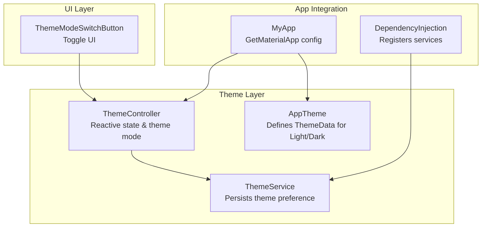
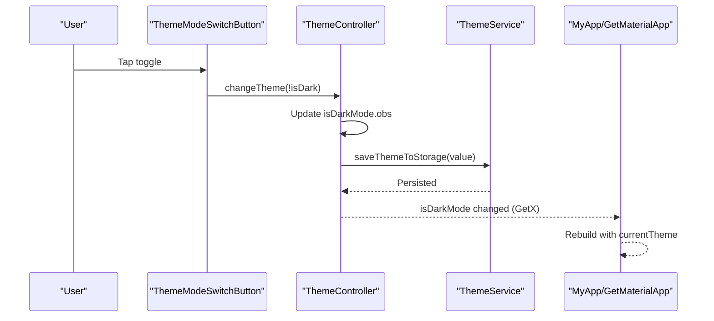
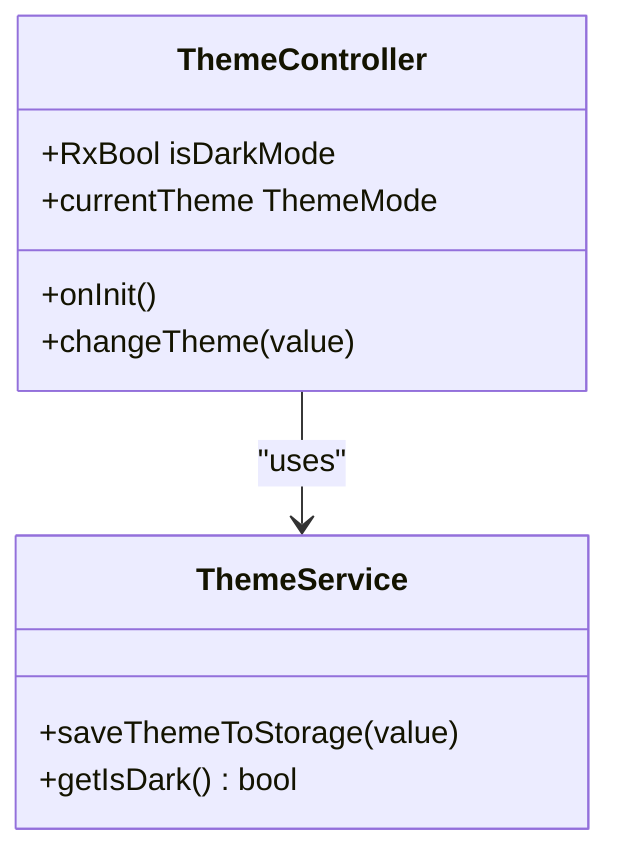
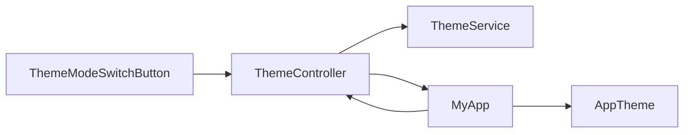

# Theme Management System

<cite>
**Referenced Files in This Document**
- [app_theme.dart](file://lib/core/theme/app_theme.dart)
- [theme_controller.dart](file://lib/core/theme/theme_controller.dart)
- [theme_service.dart](file://lib/core/data/local/theme_service.dart)
- [theme_mode_switch_button.dart](file://lib/features/profile/widgets/profile_view_widgets/theme_mode_switch_button.dart)
- [main.dart](file://lib/main.dart)
- [colors.dart](file://lib/core/constant/colors.dart)
- [icons_path.dart](file://lib/core/constant/icons_path.dart)
- [dependency_injection.dart](file://lib/core/di/dependency_injection.dart)
</cite>

## Table of Contents
1. [Introduction](#introduction)
2. [Project Structure](#project-structure)
3. [Core Components](#core-components)
4. [Architecture Overview](#architecture-overview)
5. [Detailed Component Analysis](#detailed-component-analysis)
6. [Dependency Analysis](#dependency-analysis)
7. [Performance Considerations](#performance-considerations)
8. [Troubleshooting Guide](#troubleshooting-guide)
9. [Conclusion](#conclusion)
10. [Appendices](#appendices)

## Introduction
This document explains ZB-DEZINE’s theme management system built with Material Design 3. It covers how themes are defined, persisted, and switched reactively using GetX. It also documents the integration between the theme controller, theme service, and UI components, along with practical customization examples, accessibility considerations, and performance optimization strategies.

## Project Structure
The theme system spans three primary areas:
- Theme definitions and Material 3 configuration
- Reactive state management for theme mode
- Persistence of user preferences and UI toggle component

**Diagram sources**
- [app_theme.dart:1-23](file://lib/core/theme/app_theme.dart#L1-L23)
- [theme_controller.dart:1-22](file://lib/core/theme/theme_controller.dart#L1-L22)
- [theme_service.dart:1-16](file://lib/core/data/local/theme_service.dart#L1-L16)
- [theme_mode_switch_button.dart:1-59](file://lib/features/profile/widgets/profile_view_widgets/theme_mode_switch_button.dart#L1-L59)
- [main.dart:21-46](file://lib/main.dart#L21-L46)
- [dependency_injection.dart](file://lib/core/di/dependency_injection.dart)

**Section sources**
- [main.dart:21-46](file://lib/main.dart#L21-L46)
- [app_theme.dart:1-23](file://lib/core/theme/app_theme.dart#L1-L23)
- [theme_controller.dart:1-22](file://lib/core/theme/theme_controller.dart#L1-L22)
- [theme_service.dart:1-16](file://lib/core/data/local/theme_service.dart#L1-L16)
- [theme_mode_switch_button.dart:1-59](file://lib/features/profile/widgets/profile_view_widgets/theme_mode_switch_button.dart#L1-L59)

## Core Components
- AppTheme: Centralizes Material 3 theme definitions for light and dark modes, including app bar and color scheme defaults.
- ThemeController: Manages reactive theme state using GetX, initializes from persisted storage, and exposes the current ThemeMode.
- ThemeService: Persists and retrieves the user’s theme preference using GetStorage.
- ThemeModeSwitchButton: UI toggle that flips theme mode reactively via ThemeController.
- MyApp: Integrates AppTheme and ThemeController into GetMaterialApp, wiring themeMode and initial bindings.

**Section sources**
- [app_theme.dart:4-22](file://lib/core/theme/app_theme.dart#L4-L22)
- [theme_controller.dart:5-22](file://lib/core/theme/theme_controller.dart#L5-L22)
- [theme_service.dart:3-15](file://lib/core/data/local/theme_service.dart#L3-L15)
- [theme_mode_switch_button.dart:8-58](file://lib/features/profile/widgets/profile_view_widgets/theme_mode_switch_button.dart#L8-L58)
- [main.dart:21-46](file://lib/main.dart#L21-L46)

## Architecture Overview
The theme system follows a layered reactive architecture:
- UI triggers a theme change via ThemeModeSwitchButton.
- ThemeController updates reactive state and persists the new preference.
- MyApp reads the reactive ThemeMode and applies the appropriate ThemeData.

**Diagram sources**
- [theme_mode_switch_button.dart:13-18](file://lib/features/profile/widgets/profile_view_widgets/theme_mode_switch_button.dart#L13-L18)
- [theme_controller.dart:15-18](file://lib/core/theme/theme_controller.dart#L15-L18)
- [theme_service.dart:7-9](file://lib/core/data/local/theme_service.dart#L7-L9)
- [main.dart:29-42](file://lib/main.dart#L29-L42)

## Detailed Component Analysis

### AppTheme: Material 3 Definitions
- Provides static ThemeData instances for light and dark modes.
- Enables Material 3 and sets brightness accordingly.
- Defines app bar transparency and color scheme overrides for dark mode.
- Uses design tokens from AppColors for consistent color usage.

Practical customization examples:
- To adjust primary color in dark mode, modify the color scheme assignment in the dark theme definition.
- To customize typography, extend ThemeData with font family and text scale overrides.
- To tune interactive component styles, configure elevated button, text button, and input decoration themes.

**Section sources**
- [app_theme.dart:4-22](file://lib/core/theme/app_theme.dart#L4-L22)
- [colors.dart:3-116](file://lib/core/constant/colors.dart#L3-L116)

### ThemeController: Reactive Theme State
- Extends GetX controller to expose reactive boolean state for dark mode.
- Initializes from ThemeService during onInit.
- Exposes currentTheme getter mapped to ThemeMode.
- Updates persistence on every theme change.

**Diagram sources**
- [theme_controller.dart:5-22](file://lib/core/theme/theme_controller.dart#L5-L22)
- [theme_service.dart:3-15](file://lib/core/data/local/theme_service.dart#L3-L15)

**Section sources**
- [theme_controller.dart:5-22](file://lib/core/theme/theme_controller.dart#L5-L22)

### ThemeService: Persistence Layer
- Uses GetStorage to persist a boolean flag under a dedicated key.
- Reads the stored preference on initialization.
- Returns a default fallback when no value exists.

Best practices:
- Keep the key constant stable across releases.
- Consider migrating keys if renaming is necessary.

**Section sources**
- [theme_service.dart:3-15](file://lib/core/data/local/theme_service.dart#L3-L15)

### ThemeModeSwitchButton: UI Toggle
- Renders a switch-like UI with animated assets for light/dark modes.
- Uses Obx to subscribe to ThemeController’s reactive state.
- Toggles theme mode on tap and animates the indicator position.

Accessibility considerations:
- Ensure sufficient touch target size and contrast against backgrounds.
- Provide audible feedback or announce the new mode for assistive technologies.

**Section sources**
- [theme_mode_switch_button.dart:8-58](file://lib/features/profile/widgets/profile_view_widgets/theme_mode_switch_button.dart#L8-L58)
- [icons_path.dart:88-89](file://lib/core/constant/icons_path.dart#L88-L89)

### MyApp: Integration Point
- Wraps the app with ScreenUtilInit and builds GetMaterialApp.
- Supplies AppTheme.lightTheme and AppTheme.darkTheme.
- Sets themeMode to the reactive ThemeController’s currentTheme.
- Uses bindings and routes determined by token presence.

**Section sources**
- [main.dart:21-46](file://lib/main.dart#L21-L46)

## Dependency Analysis
The theme system exhibits low coupling and clear separation of concerns:
- ThemeController depends on ThemeService for persistence.
- MyApp depends on ThemeController for themeMode and on AppTheme for ThemeData instances.
- ThemeModeSwitchButton depends on ThemeController for state and UI rendering.

**Diagram sources**
- [theme_mode_switch_button.dart:6-14](file://lib/features/profile/widgets/profile_view_widgets/theme_mode_switch_button.dart#L6-L14)
- [theme_controller.dart:7-12](file://lib/core/theme/theme_controller.dart#L7-L12)
- [main.dart:30-35](file://lib/main.dart#L30-L35)
- [app_theme.dart:4-22](file://lib/core/theme/app_theme.dart#L4-L22)

**Section sources**
- [theme_controller.dart:7-12](file://lib/core/theme/theme_controller.dart#L7-L12)
- [main.dart:30-35](file://lib/main.dart#L30-L35)

## Performance Considerations
- Reactive rebuild scope: The entire app rebuilds when theme changes because MyApp observes ThemeController. To minimize unnecessary rebuilds, consider scoping the observer to a subtree around the navigator or using a more granular state partitioning strategy.
- Asset animations: The toggle UI uses AnimatedAlign and AnimatedContainer; keep durations reasonable to avoid jank on lower-end devices.
- Storage I/O: ThemeService writes on every toggle; batching writes is unnecessary given the infrequent nature of theme changes.
- Material 3 rendering: AppTheme enables Material 3; ensure custom components avoid redundant re-compositions by using const constructors and immutable widgets.

[No sources needed since this section provides general guidance]

## Troubleshooting Guide
Common issues and resolutions:
- Theme does not persist after restart:
  - Verify ThemeService key and that saveThemeToStorage is invoked on change.
  - Confirm onInit reads the stored value correctly.
- Toggle does not reflect current mode:
  - Ensure Obx wraps the toggle and subscribes to isDarkMode.
  - Confirm currentTheme getter maps correctly to ThemeMode.
- Incorrect color usage:
  - Review AppTheme color scheme assignments and AppColors constants.
  - Validate that dark mode uses dark variants consistently.

**Section sources**
- [theme_service.dart:7-14](file://lib/core/data/local/theme_service.dart#L7-L14)
- [theme_mode_switch_button.dart:13-18](file://lib/features/profile/widgets/profile_view_widgets/theme_mode_switch_button.dart#L13-L18)
- [theme_controller.dart:20-21](file://lib/core/theme/theme_controller.dart#L20-L21)

## Conclusion
ZB-DEZINE’s theme management system cleanly separates concerns across theme definitions, reactive state, and persistence. It integrates seamlessly with GetMaterialApp and provides a responsive, customizable foundation for Material 3. By following the outlined best practices and accessibility guidelines, teams can maintain theme consistency, improve performance, and deliver a robust user experience.

[No sources needed since this section summarizes without analyzing specific files]

## Appendices

### Practical Examples

- Dynamic theme update flow:
  - User taps ThemeModeSwitchButton → ThemeController.changeTheme toggles state → ThemeService persists value → MyApp rebuilds with new ThemeMode → AppTheme applies light or dark theme.

- Theme customization checklist:
  - Adjust primary and surface colors in AppTheme.darkTheme.
  - Add typography scale overrides in AppTheme.
  - Introduce new design tokens in AppColors and reference them in AppTheme.
  - Extend ThemeController to support additional palettes or semantic roles.

- Accessibility and UX:
  - Ensure contrast ratios meet WCAG guidelines for both light and dark modes.
  - Provide keyboard and screen-reader friendly toggle affordances.
  - Test theme transitions on various device classes and OS-level dark mode integrations.

[No sources needed since this section provides general guidance]