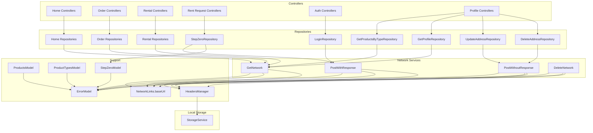
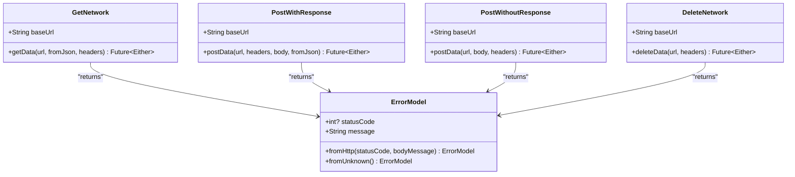
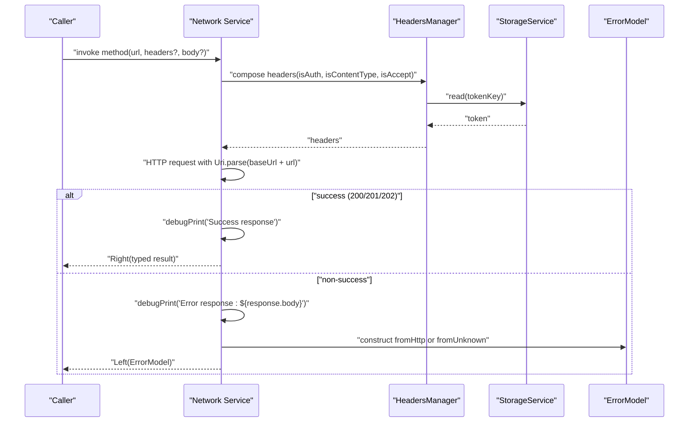
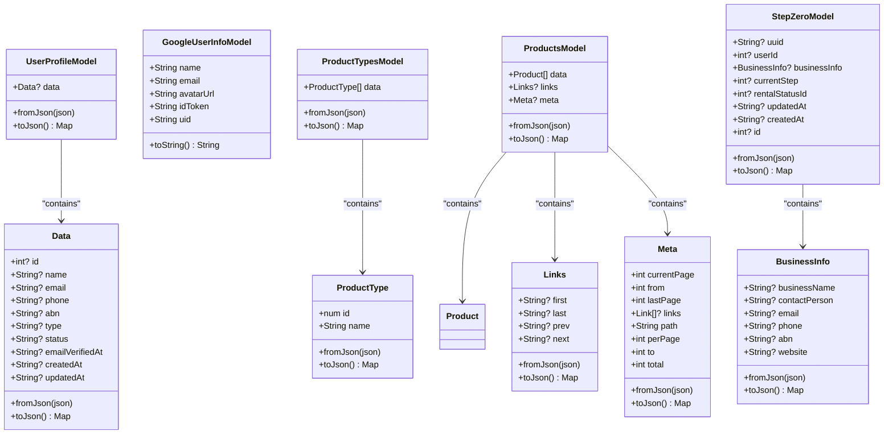
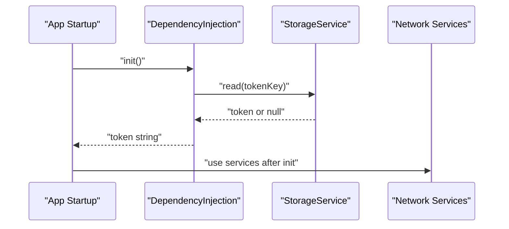
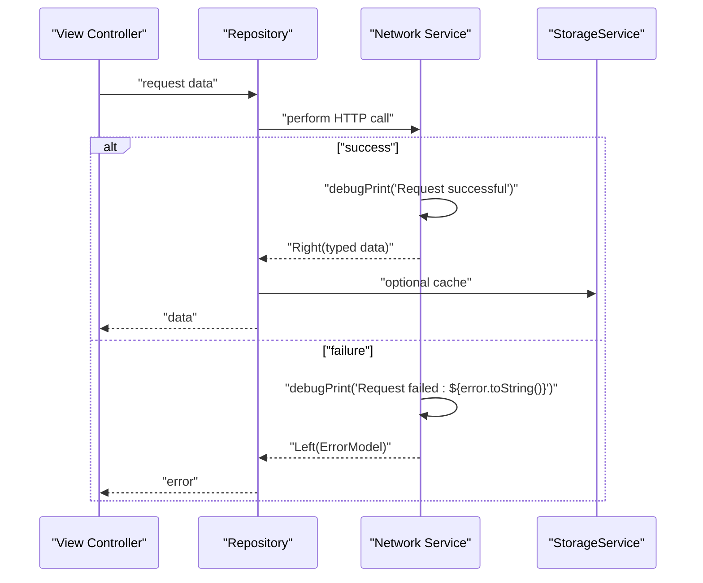
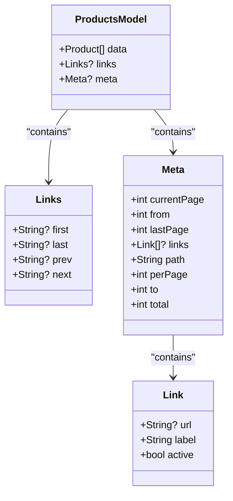
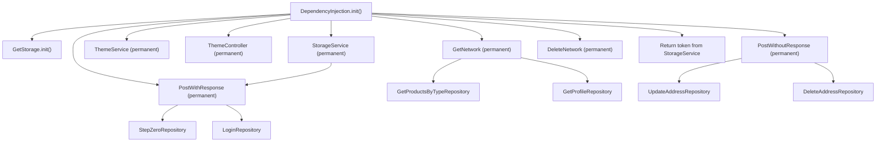
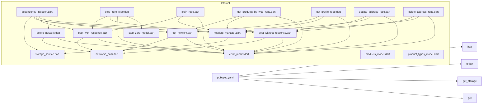

# Data Layer Architecture

<cite>
**Referenced Files in This Document**
- [pubspec.yaml](file://pubspec.yaml)
- [main.dart](file://main.dart)
- [dependency_injection.dart](file://core/di/dependency_injection.dart)
- [networks_path.dart](file://core/constant/networks_path.dart)
- [storage_service.dart](file://core/data/local/storage_service.dart)
- [headers_manager.dart](file://core/data/networks/headers_manager.dart)
- [get_network.dart](file://core/data/networks/get_network.dart)
- [post_with_response.dart](file://core/data/networks/post_with_response.dart)
- [post_without_response.dart](file://core/data/networks/post_without_response.dart)
- [delete_network.dart](file://core/data/networks/delete_network.dart)
- [error_model.dart](file://core/data/global_models/error_model.dart)
- [user_profile_model.dart](file://core/data/global_models/user_profile_model.dart)
- [google_user_info_model.dart](file://core/data/global_models/google_user_info_model.dart)
- [step_zero_repo.dart](file://features/rent_request/repositories/step_zero_repo.dart)
- [login_repo.dart](file://features/auth/repositories/login_repo.dart)
- [get_products_by_type_repo.dart](file://features/home/repositories/get_products_by_type_repo.dart)
- [get_profile_repo.dart](file://features/profile/repositories/get_profile_repo.dart)
- [update_address_repo.dart](file://features/profile/repositories/update_address_repo.dart)
- [delete_address_repo.dart](file://features/profile/repositories/delete_address_repo.dart)
- [step_zero_model.dart](file://features/rent_request/models/step_zero_model.dart)
- [home_bindings.dart](file://features/home/bindings/home_bindings.dart)
- [order_bindings.dart](file://features/order/bindings/order_bindings.dart)
- [rental_bindings.dart](file://features/rental/bindings/rental_bindings.dart)
- [rent_bindings.dart](file://features/rent_request/bindings/rent_bindings.dart)
- [auth_bindings.dart](file://features/auth/bindings/auth_bindings.dart)
- [products_model.dart](file://features/home/models/products_model.dart)
- [product_types_model.dart](file://features/home/models/product_types_model.dart)
</cite>

## Update Summary
**Changes Made**
- Added StepZeroRepository implementation demonstrating clean repository pattern with functional error handling via FP Dart's Either type
- Enhanced PostWithResponse utility for unified HTTP POST interface with improved error handling
- Expanded repository pattern documentation showing consistent Either-based error handling across all repositories
- Updated dependency injection examples to show proper repository instantiation with network services
- Added comprehensive examples of repository-to-controller integration patterns

## Table of Contents
1. [Introduction](#introduction)
2. [Project Structure](#project-structure)
3. [Core Components](#core-components)
4. [Architecture Overview](#architecture-overview)
5. [Detailed Component Analysis](#detailed-component-analysis)
6. [Dependency Analysis](#dependency-analysis)
7. [Performance Considerations](#performance-considerations)
8. [Troubleshooting Guide](#troubleshooting-guide)
9. [Conclusion](#conclusion)
10. [Appendices](#appendices)

## Introduction
This document describes the ZB-DEZINE data layer architecture with a focus on network services, local storage, and integration patterns. It explains HTTP client configuration, request/response handling, error management, and how repositories and controllers consume these services. It also covers data serialization/deserialization, offline handling via persistent storage, and practical patterns for caching and synchronization.

**Updated** Enhanced error handling with FP Dart's Either type throughout the architecture, demonstrating clean repository patterns with consistent functional error handling across all network operations.

## Project Structure
The data layer is organized under core/data with subfolders for networks and local storage, and global models for domain entities. Dependency injection registers services globally for use across features. Repository implementations demonstrate clean separation of concerns with functional error handling.

```mermaid
graph TB
subgraph "Core/Data"
subgraph "Local"
S["storage_service.dart"]
TS["theme_service.dart"]
end
subgraph "Networks"
G["get_network.dart"]
PW["post_with_response.dart"]
PWO["post_without_response.dart"]
D["delete_network.dart"]
H["headers_manager.dart"]
NP["networks_path.dart"]
end
EM["error_model.dart"]
UPM["user_profile_model.dart"]
GUI["google_user_info_model.dart"]
PM["products_model.dart"]
PTM["product_types_model.dart"]
end
subgraph "Repositories"
SZR["StepZeroRepository"]
LR["LoginRepository"]
GPSR["GetProductsByTypeRepository"]
GPR["GetProfileRepository"]
UAR["UpdateAddressRepository"]
DAR["DeleteAddressRepository"]
end
subgraph "DI"
DI["dependency_injection.dart"]
end
subgraph "App"
M["main.dart"]
end
M --> DI
DI --> S
DI --> TS
DI --> G
DI --> PW
DI --> PWO
DI --> D
G --> NP
PW --> NP
PWO --> NP
D --> NP
H --> S
G --> EM
PW --> EM
PWO --> EM
D --> EM
SZR --> PW
LR --> PW
GPSR --> G
GPR --> G
UAR --> PWO
DAR --> PWO
SZR --> H
LR --> H
GPSR --> H
GPR --> H
UAR --> H
DAR --> H
SZR --> EM
LR --> EM
GPSR --> EM
GPR --> EM
UAR --> EM
DAR --> EM
```

**Diagram sources**
- [main.dart:12-19](file://main.dart#L12-L19)
- [dependency_injection.dart:13-31](file://core/di/dependency_injection.dart#L13-L31)
- [storage_service.dart:3-22](file://core/data/local/storage_service.dart#L3-L22)
- [get_network.dart:8-38](file://core/data/networks/get_network.dart#L8-L38)
- [post_with_response.dart:7-42](file://core/data/networks/post_with_response.dart#L7-L42)
- [post_without_response.dart:9-46](file://core/data/networks/post_without_response.dart#L9-L46)
- [delete_network.dart:8-40](file://core/data/networks/delete_network.dart#L8-L40)
- [headers_manager.dart:4-22](file://core/data/networks/headers_manager.dart#L4-L22)
- [networks_path.dart:1-3](file://core/constant/networks_path.dart#L1-L3)
- [error_model.dart:1-15](file://core/data/global_models/error_model.dart#L1-L15)
- [user_profile_model.dart:1-72](file://core/data/global_models/user_profile_model.dart#L1-L72)
- [google_user_info_model.dart:1-21](file://core/data/global_models/google_user_info_model.dart#L1-L21)
- [products_model.dart:1-274](file://features/home/models/products_model.dart#L1-L274)
- [product_types_model.dart:1-37](file://features/home/models/product_types_model.dart#L1-L37)
- [step_zero_repo.dart:9-36](file://features/rent_request/repositories/step_zero_repo.dart#L9-L36)
- [login_repo.dart:9-28](file://features/auth/repositories/login_repo.dart#L9-L28)
- [get_products_by_type_repo.dart:7-21](file://features/home/repositories/get_products_by_type_repo.dart#L7-L21)
- [get_profile_repo.dart:7-19](file://features/profile/repositories/get_profile_repo.dart#L7-L19)
- [update_address_repo.dart:8-23](file://features/profile/repositories/update_address_repo.dart#L8-L23)
- [delete_address_repo.dart:6-18](file://features/profile/repositories/delete_address_repo.dart#L6-L18)

**Section sources**
- [pubspec.yaml:44-46](file://pubspec.yaml#L44-L46)
- [main.dart:12-19](file://main.dart#L12-L19)
- [dependency_injection.dart:13-31](file://core/di/dependency_injection.dart#L13-L31)

## Core Components
- Network base configuration: centralized base URL constant.
- HTTP clients: dedicated classes for GET, POST with response, POST without response, and DELETE.
- Local storage: wrapper around GetStorage for token and arbitrary key-value persistence.
- Headers manager: composes Content-Type, Accept, and Authorization headers using stored tokens.
- Error model: unified error representation for HTTP and unknown failures.
- Domain models: typed models for user profile and Google user info with enhanced type safety.
- Pagination models: Products model includes Links and Meta for pagination support.
- Repository pattern: clean separation of business logic with functional error handling via Either type.

Key responsibilities:
- Network classes encapsulate HTTP calls, status checks, JSON parsing, and error wrapping with enhanced debugging.
- Storage service persists tokens and other small data.
- Headers manager injects authentication and content-type headers.
- Error model standardizes error handling across services.
- Models use consistent num types for better type safety and numeric precision.
- Repositories provide clean interfaces for controllers with Either-based error handling.

**Updated** All repositories now implement a clean pattern with functional error handling using FP Dart's Either type, ensuring consistent error propagation throughout the application.

**Section sources**
- [networks_path.dart:1-3](file://core/constant/networks_path.dart#L1-L3)
- [get_network.dart:8-38](file://core/data/networks/get_network.dart#L8-L38)
- [post_with_response.dart:7-42](file://core/data/networks/post_with_response.dart#L7-L42)
- [post_without_response.dart:9-46](file://core/data/networks/post_without_response.dart#L9-L46)
- [delete_network.dart:8-40](file://core/data/networks/delete_network.dart#L8-L40)
- [storage_service.dart:3-22](file://core/data/local/storage_service.dart#L3-L22)
- [headers_manager.dart:4-22](file://core/data/networks/headers_manager.dart#L4-L22)
- [error_model.dart:1-15](file://core/data/global_models/error_model.dart#L1-L15)
- [user_profile_model.dart:1-72](file://core/data/global_models/user_profile_model.dart#L1-L72)
- [google_user_info_model.dart:1-21](file://core/data/global_models/google_user_info_model.dart#L1-L21)
- [products_model.dart:1-274](file://features/home/models/products_model.dart#L1-L274)
- [product_types_model.dart:1-37](file://features/home/models/product_types_model.dart#L1-L37)
- [step_zero_repo.dart:9-36](file://features/rent_request/repositories/step_zero_repo.dart#L9-L36)

## Architecture Overview
The data layer follows a layered pattern with enhanced functional programming principles:
- Controllers depend on Repositories.
- Repositories depend on Network services and optionally on Storage.
- Network services depend on the base URL constant and the Error model.
- Headers manager composes headers using the Storage service.
- All repositories implement clean patterns with Either-based error handling.



**Diagram sources**
- [home_bindings.dart:13-33](file://features/home/bindings/home_bindings.dart#L13-L33)
- [order_bindings.dart:5-10](file://features/order/bindings/order_bindings.dart#L5-L10)
- [rental_bindings.dart:5-10](file://features/rental/bindings/rental_bindings.dart#L5-L10)
- [rent_bindings.dart:16-37](file://features/rent_request/bindings/rent_bindings.dart#L16-L37)
- [auth_bindings.dart:13-28](file://features/auth/bindings/auth_bindings.dart#L13-L28)
- [get_network.dart:8-38](file://core/data/networks/get_network.dart#L8-L38)
- [post_with_response.dart:7-42](file://core/data/networks/post_with_response.dart#L7-L42)
- [post_without_response.dart:9-46](file://core/data/networks/post_without_response.dart#L9-L46)
- [delete_network.dart:8-40](file://core/data/networks/delete_network.dart#L8-L40)
- [headers_manager.dart:4-22](file://core/data/networks/headers_manager.dart#L4-L22)
- [storage_service.dart:3-22](file://core/data/local/storage_service.dart#L3-L22)
- [networks_path.dart:1-3](file://core/constant/networks_path.dart#L1-L3)
- [error_model.dart:1-15](file://core/data/global_models/error_model.dart#L1-L15)
- [products_model.dart:1-274](file://features/home/models/products_model.dart#L1-L274)
- [product_types_model.dart:1-37](file://features/home/models/product_types_model.dart#L1-L37)
- [step_zero_model.dart:1-88](file://features/rent_request/models/step_zero_model.dart#L1-L88)
- [step_zero_repo.dart:9-36](file://features/rent_request/repositories/step_zero_repo.dart#L9-L36)
- [login_repo.dart:9-28](file://features/auth/repositories/login_repo.dart#L9-L28)
- [get_products_by_type_repo.dart:7-21](file://features/home/repositories/get_products_by_type_repo.dart#L7-L21)
- [get_profile_repo.dart:7-19](file://features/profile/repositories/get_profile_repo.dart#L7-L19)
- [update_address_repo.dart:8-23](file://features/profile/repositories/update_address_repo.dart#L8-L23)
- [delete_address_repo.dart:6-18](file://features/profile/repositories/delete_address_repo.dart#L6-L18)

## Detailed Component Analysis

### Network Service Classes
- GetNetwork: performs HTTP GET requests, decodes JSON, and returns typed data or an error with enhanced debugging.
- PostWithResponse: performs HTTP POST with a typed response decoder and improved error logging, now with enhanced functional error handling.
- PostWithoutResponse: performs HTTP POST without expecting a response body with debug output.
- DeleteNetwork: performs HTTP DELETE and returns success or an error with comprehensive error handling.

Each class:
- Uses the base URL constant.
- Accepts headers and body parameters.
- Validates status codes (200, 201, 202) as success.
- Parses JSON bodies and constructs typed models via fromJson.
- Wraps errors using ErrorModel for both HTTP and unknown exceptions.
- Includes debugPrint statements for better error tracking and debugging.

**Updated** PostWithResponse now provides a unified HTTP POST interface with enhanced error handling using FP Dart's Either type for consistent functional programming patterns.



**Diagram sources**
- [get_network.dart:8-38](file://core/data/networks/get_network.dart#L8-L38)
- [post_with_response.dart:7-42](file://core/data/networks/post_with_response.dart#L7-L42)
- [post_without_response.dart:9-46](file://core/data/networks/post_without_response.dart#L9-L46)
- [delete_network.dart:8-40](file://core/data/networks/delete_network.dart#L8-L40)
- [error_model.dart:1-15](file://core/data/global_models/error_model.dart#L1-L15)

**Section sources**
- [get_network.dart:8-38](file://core/data/networks/get_network.dart#L8-L38)
- [post_with_response.dart:7-42](file://core/data/networks/post_with_response.dart#L7-L42)
- [post_without_response.dart:9-46](file://core/data/networks/post_without_response.dart#L9-L46)
- [delete_network.dart:8-40](file://core/data/networks/delete_network.dart#L8-L40)

### HTTP Client Configuration and Request/Response Handling
- Base URL: centralized in NetworkLinks.
- Headers: composed by HeadersManager with Content-Type, Accept, and Authorization (when applicable).
- Requests: constructed using http.client with Uri.parse(baseUrl + url).
- Responses: validated by status codes; successful responses are parsed and mapped to typed models.
- Errors: captured via try/catch blocks and converted to ErrorModel instances.
- Debugging: enhanced with debugPrint statements for better error tracking and development experience.



**Diagram sources**
- [headers_manager.dart:9-21](file://core/data/networks/headers_manager.dart#L9-L21)
- [storage_service.dart:7-9](file://core/data/local/storage_service.dart#L7-L9)
- [get_network.dart:14-37](file://core/data/networks/get_network.dart#L14-L37)
- [post_with_response.dart:14-41](file://core/data/networks/post_with_response.dart#L14-L41)
- [post_without_response.dart:16-45](file://core/data/networks/post_without_response.dart#L16-L45)
- [delete_network.dart:13-39](file://core/data/networks/delete_network.dart#L13-L39)
- [error_model.dart:5-13](file://core/data/global_models/error_model.dart#L5-L13)

**Section sources**
- [networks_path.dart:1-3](file://core/constant/networks_path.dart#L1-L3)
- [headers_manager.dart:4-22](file://core/data/networks/headers_manager.dart#L4-L22)
- [storage_service.dart:3-22](file://core/data/local/storage_service.dart#L3-L22)
- [error_model.dart:1-15](file://core/data/global_models/error_model.dart#L1-L15)

### Local Storage Service (GetStorage)
- Provides read/write/remove/clear operations.
- Used by HeadersManager to retrieve the token for Authorization header.
- Token key is standardized for consistent access across the app.


**Diagram sources**
- [storage_service.dart:7-9](file://core/data/local/storage_service.dart#L7-L9)
- [headers_manager.dart:17-19](file://core/data/networks/headers_manager.dart#L17-L19)

**Section sources**
- [storage_service.dart:3-22](file://core/data/local/storage_service.dart#L3-L22)
- [headers_manager.dart:4-22](file://core/data/networks/headers_manager.dart#L4-L22)

### Repository Pattern Implementation
**Updated** All repositories now implement a clean pattern with functional error handling using FP Dart's Either type, demonstrating consistent error propagation throughout the application.

- StepZeroRepository: demonstrates clean repository pattern for rental request creation with comprehensive business logic.
- LoginRepository: shows authentication flow with Either-based error handling.
- GetProductsByTypeRepository: illustrates GET request handling with typed responses.
- GetProfileRepository: demonstrates user profile retrieval with proper error handling.
- UpdateAddressRepository: shows POST without response handling.
- DeleteAddressRepository: demonstrates DELETE operation with Either return type.

Each repository:
- Accepts network services through constructor injection.
- Provides a clean execute method with typed parameters.
- Returns Future<Either<ErrorModel, T>> for consistent error handling.
- Uses HeadersManager for authentication and content-type headers.
- Encodes request bodies using jsonEncode for POST operations.

```mermaid
classDiagram
class StepZeroRepository {
+PostWithResponse postWithResponse
+execute(businessName, contactPerson, email, phone, abn, website) Future~Either<ErrorModel, StepZeroModel>~
}
class LoginRepository {
+PostWithResponse postWithResponse
+execute(email, password) Future~Either<ErrorModel, LoginModel>~
}
class GetProductsByTypeRepository {
+GetNetwork getNetwork
+execute(typeID) Future~Either<ErrorModel, ProductsModel>~
}
class GetProfileRepository {
+GetNetwork getNetwork
+execute() Future~Either<ErrorModel, UserProfileModel>~
}
class UpdateAddressRepository {
+PostWithoutResponse postWithoutResponse
+execute(addressID, isDefault) Future~Either<ErrorModel, bool>~
}
class DeleteAddressRepository {
+PostWithoutResponse postWithoutResponse
+execute(addressID) Future~Either<ErrorModel, bool>~
}
StepZeroRepository --> PostWithResponse : "uses"
LoginRepository --> PostWithResponse : "uses"
GetProductsByTypeRepository --> GetNetwork : "uses"
GetProfileRepository --> GetNetwork : "uses"
UpdateAddressRepository --> PostWithoutResponse : "uses"
DeleteAddressRepository --> PostWithoutResponse : "uses"
```



**Diagram sources**
- [step_zero_repo.dart:9-36](file://features/rent_request/repositories/step_zero_repo.dart#L9-L36)
- [login_repo.dart:9-28](file://features/auth/repositories/login_repo.dart#L9-L28)
- [get_products_by_type_repo.dart:7-21](file://features/home/repositories/get_products_by_type_repo.dart#L7-L21)
- [get_profile_repo.dart:7-19](file://features/profile/repositories/get_profile_repo.dart#L7-L19)
- [update_address_repo.dart:8-23](file://features/profile/repositories/update_address_repo.dart#L8-L23)
- [delete_address_repo.dart:6-18](file://features/profile/repositories/delete_address_repo.dart#L6-L18)

**Section sources**
- [step_zero_repo.dart:9-36](file://features/rent_request/repositories/step_zero_repo.dart#L9-L36)
- [login_repo.dart:9-28](file://features/auth/repositories/login_repo.dart#L9-L28)
- [get_products_by_type_repo.dart:7-21](file://features/home/repositories/get_products_by_type_repo.dart#L7-L21)
- [get_profile_repo.dart:7-19](file://features/profile/repositories/get_profile_repo.dart#L7-L19)
- [update_address_repo.dart:8-23](file://features/profile/repositories/update_address_repo.dart#L8-L23)
- [delete_address_repo.dart:6-18](file://features/profile/repositories/delete_address_repo.dart#L6-L18)

### Data Serialization/Deserialization Patterns
- Typed models: models expose fromJson and toJson for encoding/decoding.
- Network services pass a fromJson function to decode responses into typed models.
- Enhanced type safety: models now use num type instead of int for better numeric precision.
- Pagination support: Products model includes Links and Meta classes for pagination handling.
- Example models:
  - UserProfileModel with nested Data.
  - GoogleUserInfoModel for Google sign-in data.
  - ProductTypesModel for furniture type listings.
  - ProductsModel with pagination support for product listings.
  - StepZeroModel for rental request business information.



**Diagram sources**
- [user_profile_model.dart:1-72](file://core/data/global_models/user_profile_model.dart#L1-L72)
- [google_user_info_model.dart:1-21](file://core/data/global_models/google_user_info_model.dart#L1-L21)
- [product_types_model.dart:1-37](file://features/home/models/product_types_model.dart#L1-L37)
- [products_model.dart:1-363](file://features/home/models/products_model.dart#L1-L363)
- [step_zero_model.dart:1-88](file://features/rent_request/models/step_zero_model.dart#L1-L88)

**Section sources**
- [user_profile_model.dart:1-72](file://core/data/global_models/user_profile_model.dart#L1-L72)
- [google_user_info_model.dart:1-21](file://core/data/global_models/google_user_info_model.dart#L1-L21)
- [product_types_model.dart:1-37](file://features/home/models/product_types_model.dart#L1-L37)
- [products_model.dart:1-363](file://features/home/models/products_model.dart#L1-L363)
- [step_zero_model.dart:1-88](file://features/rent_request/models/step_zero_model.dart#L1-L88)

### Offline Data Handling
- Persistent token storage enables offline re-authentication when the app restarts.
- Dependency injection initializes GetStorage and reads the token during startup.
- Repositories can cache frequently accessed data in memory or use StorageService for small persisted items.



**Diagram sources**
- [main.dart:12-19](file://main.dart#L12-L19)
- [dependency_injection.dart:14-30](file://core/di/dependency_injection.dart#L14-L30)
- [storage_service.dart:7-9](file://core/data/local/storage_service.dart#L7-L9)

**Section sources**
- [main.dart:12-19](file://main.dart#L12-L19)
- [dependency_injection.dart:14-30](file://core/di/dependency_injection.dart#L14-L30)
- [storage_service.dart:3-22](file://core/data/local/storage_service.dart#L3-L22)

### Data Flow Between Network Services, Repositories, and Controllers
- Controllers trigger repository methods.
- Repositories use network services to fetch or mutate data.
- Repositories may use StorageService for caching or offline behavior.
- Network services return Either<ErrorModel, T>, allowing repositories to handle success and failure uniformly.
- Enhanced error handling with debugPrint statements for better debugging experience.

**Updated** All repositories now implement consistent functional error handling using FP Dart's Either type, providing a clean separation of concerns and predictable error propagation.



**Diagram sources**
- [get_network.dart:10-37](file://core/data/networks/get_network.dart#L10-L37)
- [post_with_response.dart:9-41](file://core/data/networks/post_with_response.dart#L9-L41)
- [post_without_response.dart:12-45](file://core/data/networks/post_without_response.dart#L12-L45)
- [delete_network.dart:10-39](file://core/data/networks/delete_network.dart#L10-L39)
- [storage_service.dart:7-21](file://core/data/local/storage_service.dart#L7-L21)

**Section sources**
- [home_bindings.dart:13-33](file://features/home/bindings/home_bindings.dart#L13-L33)
- [order_bindings.dart:5-10](file://features/order/bindings/order_bindings.dart#L5-L10)
- [rental_bindings.dart:5-10](file://features/rental/bindings/rental_bindings.dart#L5-L10)
- [rent_bindings.dart:16-37](file://features/rent_request/bindings/rent_bindings.dart#L16-L37)
- [auth_bindings.dart:13-28](file://features/auth/bindings/auth_bindings.dart#L13-L28)

### Caching Strategies and Data Synchronization Patterns
- In-memory caching: keep recent data in repository state to reduce network calls.
- Persistence: use StorageService for small, critical data like tokens.
- Synchronization: upon successful network updates, update in-memory state and persist changes as needed.
- Conflict handling: implement optimistic updates with rollback on error; or use server timestamps to reconcile.
- Pagination support: use Links and Meta classes to handle paginated data efficiently.

### Enhanced Type Safety and Numeric Precision
**Updated** The application now uses consistent num types across models for better numeric precision and type safety:

- Product models use num for IDs, prices, and quantities instead of int
- Meta information includes integer pagination fields (currentPage, lastPage, total)
- DefaultOptionId uses num for numeric identifiers
- Category and FurnitureType models use num for ID fields

This change improves type safety and prevents potential overflow issues with large numeric values.

**Section sources**
- [products_model.dart:251-274](file://features/home/models/products_model.dart#L251-L274)
- [product_types_model.dart:23-37](file://features/home/models/product_types_model.dart#L23-L37)

### Pagination Support for Products API
**Updated** Products model now includes comprehensive pagination support:

- Links class: handles pagination navigation (first, last, prev, next)
- Meta class: contains pagination metadata (current_page, last_page, total, per_page, etc.)
- Response structure: ProductsModel now includes links and meta alongside data
- Integration: Repositories can leverage pagination for efficient data loading



**Diagram sources**
- [products_model.dart:276-363](file://features/home/models/products_model.dart#L276-L363)

**Section sources**
- [products_model.dart:276-363](file://features/home/models/products_model.dart#L276-L363)

### Dependency Injection and Repository Integration
**Updated** Dependency injection now properly registers all network services and repositories with GetX, enabling clean constructor injection patterns.

- Network services are registered as singletons with permanent lifecycle.
- Repositories receive network services through constructor injection.
- Controllers receive repositories through Get.lazyPut with proper dependency resolution.
- StepZeroRepository demonstrates the clean repository pattern with PostWithResponse injection.



**Diagram sources**
- [dependency_injection.dart:14-30](file://core/di/dependency_injection.dart#L14-L30)
- [rent_bindings.dart:19-24](file://features/rent_request/bindings/rent_bindings.dart#L19-L24)
- [auth_bindings.dart:16-22](file://features/auth/bindings/auth_bindings.dart#L16-L22)

**Section sources**
- [dependency_injection.dart:14-30](file://core/di/dependency_injection.dart#L14-L30)
- [rent_bindings.dart:16-37](file://features/rent_request/bindings/rent_bindings.dart#L16-L37)
- [auth_bindings.dart:13-28](file://features/auth/bindings/auth_bindings.dart#L13-L28)

## Dependency Analysis
- External libraries:
  - http for HTTP requests.
  - fpdart for Either monad support.
  - get_storage for persistent key-value storage.
  - get for dependency injection and reactive state.
- Internal dependencies:
  - Network services depend on NetworkLinks and ErrorModel.
  - HeadersManager depends on StorageService.
  - Controllers depend on Repositories, which depend on Network services.
  - Models depend on ErrorModel for serialization/deserialization.
  - All repositories depend on network services and implement Either-based error handling.

**Updated** Enhanced dependency graph showing the clean repository pattern with functional error handling throughout the architecture.



**Diagram sources**
- [pubspec.yaml:44-46](file://pubspec.yaml#L44-L46)
- [dependency_injection.dart:13-31](file://core/di/dependency_injection.dart#L13-L31)
- [storage_service.dart:3-22](file://core/data/local/storage_service.dart#L3-L22)
- [headers_manager.dart:4-22](file://core/data/networks/headers_manager.dart#L4-L22)
- [get_network.dart:8-38](file://core/data/networks/get_network.dart#L8-L38)
- [post_with_response.dart:7-42](file://core/data/networks/post_with_response.dart#L7-L42)
- [post_without_response.dart:9-46](file://core/data/networks/post_without_response.dart#L9-L46)
- [delete_network.dart:8-40](file://core/data/networks/delete_network.dart#L8-L40)
- [error_model.dart:1-15](file://core/data/global_models/error_model.dart#L1-L15)
- [networks_path.dart:1-3](file://core/constant/networks_path.dart#L1-L3)
- [products_model.dart:1-363](file://features/home/models/products_model.dart#L1-L363)
- [product_types_model.dart:1-37](file://features/home/models/product_types_model.dart#L1-L37)
- [step_zero_model.dart:1-88](file://features/rent_request/models/step_zero_model.dart#L1-L88)
- [step_zero_repo.dart:9-36](file://features/rent_request/repositories/step_zero_repo.dart#L9-L36)
- [login_repo.dart:9-28](file://features/auth/repositories/login_repo.dart#L9-L28)
- [get_products_by_type_repo.dart:7-21](file://features/home/repositories/get_products_by_type_repo.dart#L7-L21)
- [get_profile_repo.dart:7-19](file://features/profile/repositories/get_profile_repo.dart#L7-L19)
- [update_address_repo.dart:8-23](file://features/profile/repositories/update_address_repo.dart#L8-L23)
- [delete_address_repo.dart:6-18](file://features/profile/repositories/delete_address_repo.dart#L6-L18)

**Section sources**
- [pubspec.yaml:44-46](file://pubspec.yaml#L44-L46)
- [dependency_injection.dart:13-31](file://core/di/dependency_injection.dart#L13-L31)

## Performance Considerations
- Prefer lightweight models and minimal JSON parsing overhead.
- Reuse network clients and headers where appropriate.
- Cache frequently accessed data in memory to reduce network latency.
- Use pagination and selective field fetching to minimize payload sizes.
- Avoid unnecessary UI rebuilds by structuring state updates efficiently.
- Enhanced error logging helps identify performance bottlenecks during development.
- Functional error handling with Either type reduces error handling overhead and improves code clarity.

## Troubleshooting Guide
Common issues and resolutions:
- Authentication failures:
  - Verify token presence in StorageService and correct Authorization header composition.
  - Ensure HeadersManager flags align with endpoint requirements.
- Unknown errors:
  - ErrorModel.fromUnknown() indicates exceptions outside HTTP parsing; inspect logs and network conditions.
  - Enhanced debugPrint statements provide better error visibility.
- Status code mismatches:
  - Confirm that 200/201/202 are considered success; adjust expectations per endpoint contract.
- JSON parsing errors:
  - Ensure fromJson handles missing keys gracefully and matches server response shape.
  - Enhanced type safety with num types reduces parsing errors for numeric values.
- Pagination issues:
  - Verify Links and Meta classes are properly populated from API responses.
  - Check pagination parameters (page, per_page) in API requests.
- Repository pattern issues:
  - Ensure repositories are properly injected with network services through constructor injection.
  - Verify Either-based error handling is properly implemented in all repositories.
  - Check that dependency injection registers all required services and repositories.

**Updated** Added troubleshooting guidance for repository pattern implementation and functional error handling.

**Section sources**
- [headers_manager.dart:9-21](file://core/data/networks/headers_manager.dart#L9-L21)
- [storage_service.dart:7-9](file://core/data/local/storage_service.dart#L7-L9)
- [error_model.dart:5-13](file://core/data/global_models/error_model.dart#L5-L13)
- [get_network.dart:14-37](file://core/data/networks/get_network.dart#L14-L37)
- [post_with_response.dart:14-41](file://core/data/networks/post_with_response.dart#L14-L41)
- [post_without_response.dart:16-45](file://core/data/networks/post_without_response.dart#L16-L45)
- [delete_network.dart:13-39](file://core/data/networks/delete_network.dart#L13-L39)
- [products_model.dart:276-363](file://features/home/models/products_model.dart#L276-L363)
- [step_zero_repo.dart:9-36](file://features/rent_request/repositories/step_zero_repo.dart#L9-L36)

## Conclusion
The ZB-DEZINE data layer cleanly separates concerns across network services, local storage, and headers management. It leverages Either for robust error handling, typed models for safe serialization/deserialization, and a DI system for easy integration across features. The enhanced error handling with debugPrint statements, improved type safety through consistent num types usage, and comprehensive pagination support make the architecture more robust, maintainable, and developer-friendly. 

**Updated** The addition of StepZeroRepository and other repositories demonstrates a clean repository pattern with functional error handling via FP Dart's Either type, providing consistent error propagation throughout the application. The enhanced PostWithResponse utility offers a unified HTTP POST interface with improved error handling, supporting the clean architecture principles across all network operations.

By combining in-memory caching, persistent storage, and clear request/response patterns, the architecture supports scalable offline-capable experiences with better debugging capabilities and functional programming paradigms.

## Appendices
- API integration patterns:
  - Use HeadersManager.getHeaders with isAuth flag to compose Authorization headers.
  - Call network services with a fromJson function that maps server responses to typed models.
  - Wrap all calls with Either handling to propagate errors consistently.
  - Leverage enhanced error logging for better debugging experience.
  - Implement clean repository pattern with constructor injection for network services.
- Offline handling:
  - Initialize StorageService during app startup and read tokens for seamless re-authentication.
  - Persist small, critical data (e.g., tokens) using StorageService; cache larger datasets in memory.
  - Use pagination models for efficient data loading and caching strategies.
  - Implement Either-based error handling in all repositories for consistent error propagation.
- Type safety best practices:
  - Use num types for numeric values to prevent overflow and improve precision.
  - Implement proper error handling with debugPrint statements for better development experience.
  - Ensure models handle nullable fields gracefully during deserialization.
  - Use FP Dart's Either type for functional error handling across the entire application.
  - Follow clean repository pattern with proper dependency injection and constructor-based service injection.