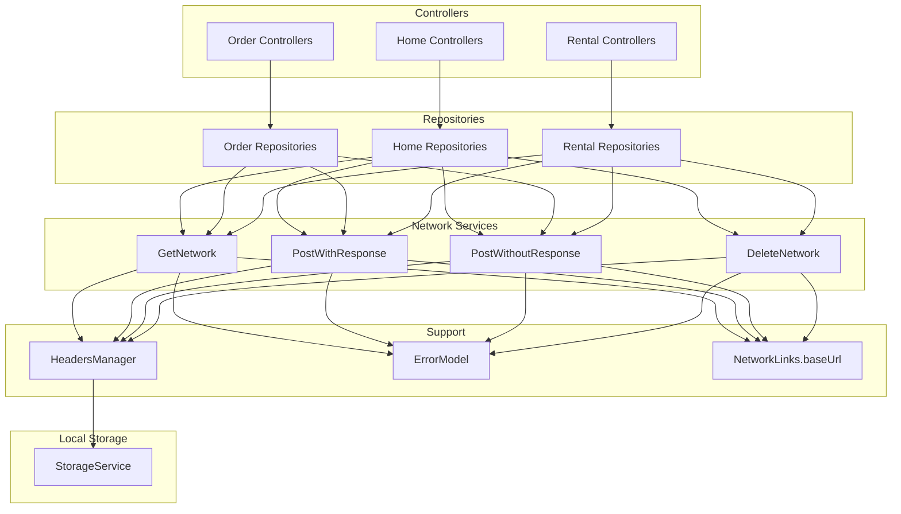
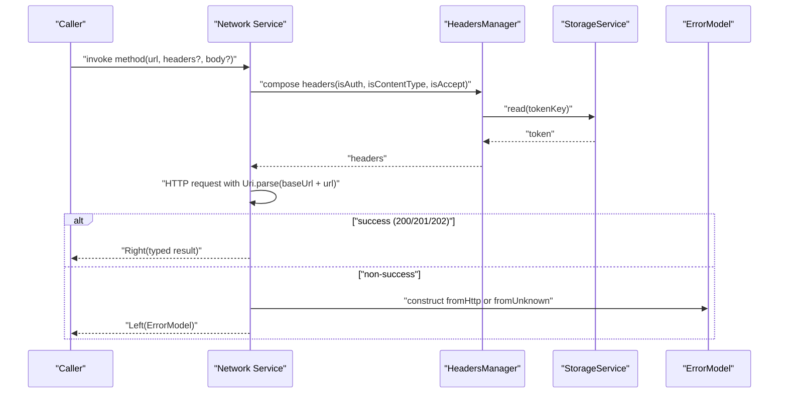
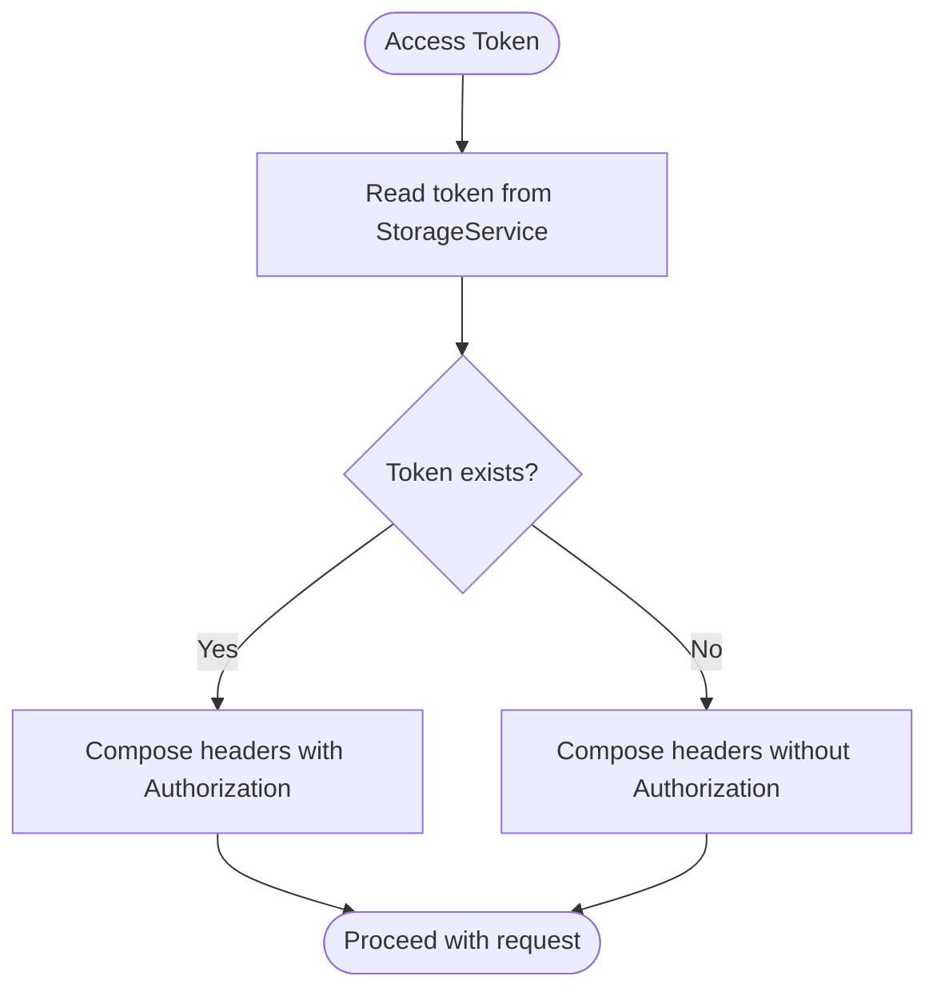
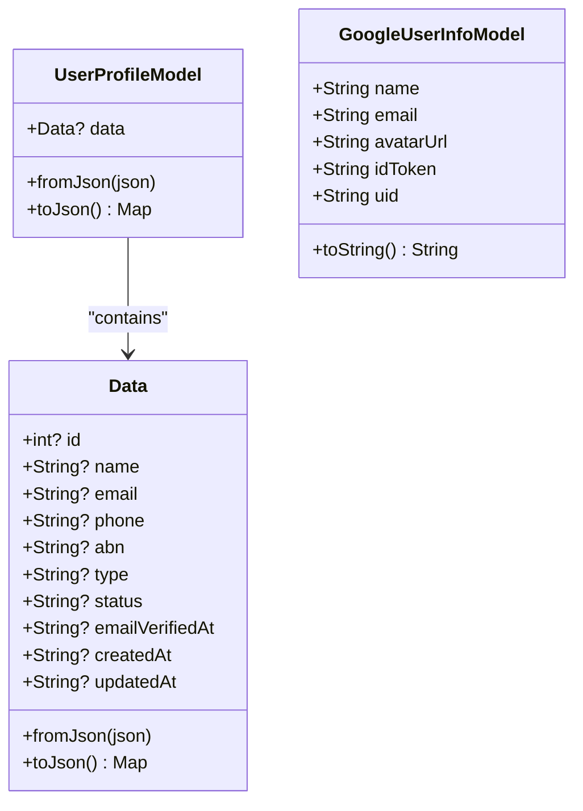
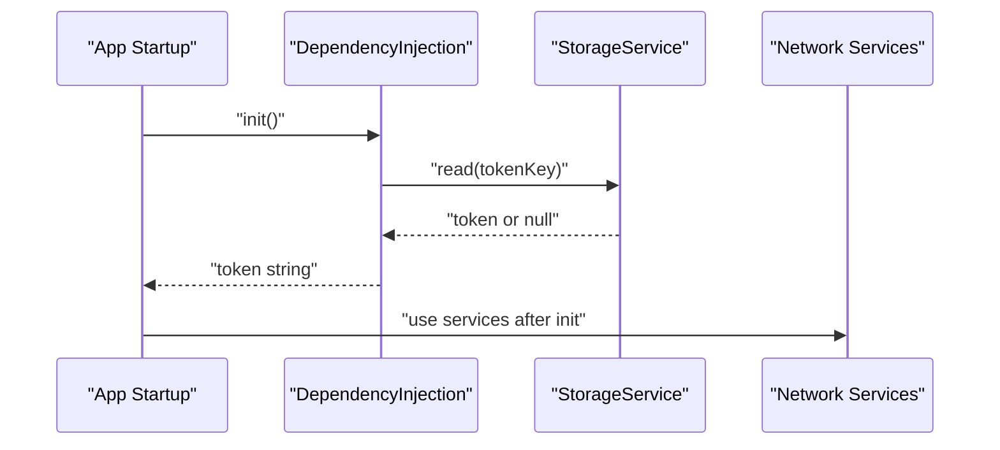
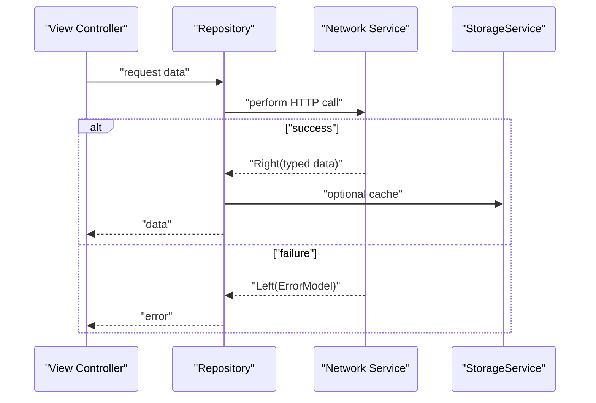
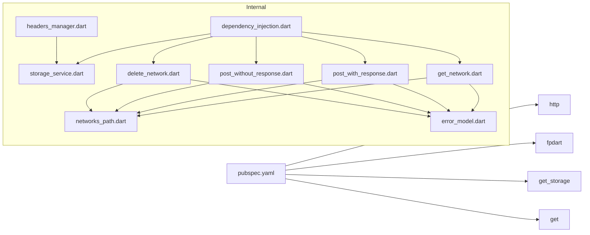

# Data Layer Architecture

<cite>
**Referenced Files in This Document**
- [pubspec.yaml](file://pubspec.yaml)
- [main.dart](file://main.dart)
- [dependency_injection.dart](file://core/di/dependency_injection.dart)
- [networks_path.dart](file://core/constant/networks_path.dart)
- [storage_service.dart](file://core/data/local/storage_service.dart)
- [headers_manager.dart](file://core/data/networks/headers_manager.dart)
- [get_network.dart](file://core/data/networks/get_network.dart)
- [post_with_response.dart](file://core/data/networks/post_with_response.dart)
- [post_without_response.dart](file://core/data/networks/post_without_response.dart)
- [delete_network.dart](file://core/data/networks/delete_network.dart)
- [error_model.dart](file://core/data/global_models/error_model.dart)
- [user_profile_model.dart](file://core/data/global_models/user_profile_model.dart)
- [google_user_info_model.dart](file://core/data/global_models/google_user_info_model.dart)
- [home_bindings.dart](file://features/home/bindings/home_bindings.dart)
- [order_bindings.dart](file://features/order/bindings/order_bindings.dart)
- [rental_bindings.dart](file://features/rental/bindings/rental_bindings.dart)
</cite>

## Table of Contents
1. [Introduction](#introduction)
2. [Project Structure](#project-structure)
3. [Core Components](#core-components)
4. [Architecture Overview](#architecture-overview)
5. [Detailed Component Analysis](#detailed-component-analysis)
6. [Dependency Analysis](#dependency-analysis)
7. [Performance Considerations](#performance-considerations)
8. [Troubleshooting Guide](#troubleshooting-guide)
9. [Conclusion](#conclusion)
10. [Appendices](#appendices)

## Introduction
This document describes the ZB-DEZINE data layer architecture with a focus on network services, local storage, and integration patterns. It explains HTTP client configuration, request/response handling, error management, and how repositories and controllers consume these services. It also covers data serialization/deserialization, offline handling via persistent storage, and practical patterns for caching and synchronization.

## Project Structure
The data layer is organized under core/data with subfolders for networks and local storage, and global models for domain entities. Dependency injection registers services globally for use across features.

```mermaid
graph TB
subgraph "Core/Data"
subgraph "Local"
S["storage_service.dart"]
end
subgraph "Networks"
G["get_network.dart"]
PW["post_with_response.dart"]
PWO["post_without_response.dart"]
D["delete_network.dart"]
H["headers_manager.dart"]
NP["networks_path.dart"]
end
EM["error_model.dart"]
UPM["user_profile_model.dart"]
GUI["google_user_info_model.dart"]
end
subgraph "DI"
DI["dependency_injection.dart"]
end
subgraph "App"
M["main.dart"]
end
M --> DI
DI --> S
DI --> G
DI --> PW
DI --> PWO
DI --> D
G --> NP
PW --> NP
PWO --> NP
D --> NP
H --> S
G --> EM
PW --> EM
PWO --> EM
D --> EM
```

**Diagram sources**
- [main.dart:12-19](file://main.dart#L12-L19)
- [dependency_injection.dart:11-26](file://core/di/dependency_injection.dart#L11-L26)
- [storage_service.dart:3-22](file://core/data/local/storage_service.dart#L3-L22)
- [get_network.dart:8-38](file://core/data/networks/get_network.dart#L8-L38)
- [post_with_response.dart:7-44](file://core/data/networks/post_with_response.dart#L7-L44)
- [post_without_response.dart:9-46](file://core/data/networks/post_without_response.dart#L9-L46)
- [delete_network.dart:8-40](file://core/data/networks/delete_network.dart#L8-L40)
- [headers_manager.dart:4-22](file://core/data/networks/headers_manager.dart#L4-L22)
- [networks_path.dart:1-3](file://core/constant/networks_path.dart#L1-L3)
- [error_model.dart:1-15](file://core/data/global_models/error_model.dart#L1-L15)
- [user_profile_model.dart:1-72](file://core/data/global_models/user_profile_model.dart#L1-L72)
- [google_user_info_model.dart:1-21](file://core/data/global_models/google_user_info_model.dart#L1-L21)

**Section sources**
- [pubspec.yaml:44-46](file://pubspec.yaml#L44-L46)
- [main.dart:12-19](file://main.dart#L12-L19)
- [dependency_injection.dart:11-26](file://core/di/dependency_injection.dart#L11-L26)

## Core Components
- Network base configuration: centralized base URL constant.
- HTTP clients: dedicated classes for GET, POST with response, POST without response, and DELETE.
- Local storage: wrapper around GetStorage for token and arbitrary key-value persistence.
- Headers manager: composes Content-Type, Accept, and Authorization headers using stored tokens.
- Error model: unified error representation for HTTP and unknown failures.
- Domain models: typed models for user profile and Google user info.

Key responsibilities:
- Network classes encapsulate HTTP calls, status checks, JSON parsing, and error wrapping.
- Storage service persists tokens and other small data.
- Headers manager injects authentication and content-type headers.
- Error model standardizes error handling across services.

**Section sources**
- [networks_path.dart:1-3](file://core/constant/networks_path.dart#L1-L3)
- [get_network.dart:8-38](file://core/data/networks/get_network.dart#L8-L38)
- [post_with_response.dart:7-44](file://core/data/networks/post_with_response.dart#L7-L44)
- [post_without_response.dart:9-46](file://core/data/networks/post_without_response.dart#L9-L46)
- [delete_network.dart:8-40](file://core/data/networks/delete_network.dart#L8-L40)
- [storage_service.dart:3-22](file://core/data/local/storage_service.dart#L3-L22)
- [headers_manager.dart:4-22](file://core/data/networks/headers_manager.dart#L4-L22)
- [error_model.dart:1-15](file://core/data/global_models/error_model.dart#L1-L15)
- [user_profile_model.dart:1-72](file://core/data/global_models/user_profile_model.dart#L1-L72)
- [google_user_info_model.dart:1-21](file://core/data/global_models/google_user_info_model.dart#L1-L21)

## Architecture Overview
The data layer follows a layered pattern:
- Controllers depend on Repositories.
- Repositories depend on Network services and optionally on Storage.
- Network services depend on the base URL constant and the Error model.
- Headers manager composes headers using the Storage service.



**Diagram sources**
- [home_bindings.dart:13-33](file://features/home/bindings/home_bindings.dart#L13-L33)
- [order_bindings.dart:5-10](file://features/order/bindings/order_bindings.dart#L5-L10)
- [rental_bindings.dart:5-10](file://features/rental/bindings/rental_bindings.dart#L5-L10)
- [get_network.dart:8-38](file://core/data/networks/get_network.dart#L8-L38)
- [post_with_response.dart:7-44](file://core/data/networks/post_with_response.dart#L7-L44)
- [post_without_response.dart:9-46](file://core/data/networks/post_without_response.dart#L9-L46)
- [delete_network.dart:8-40](file://core/data/networks/delete_network.dart#L8-L40)
- [headers_manager.dart:4-22](file://core/data/networks/headers_manager.dart#L4-L22)
- [storage_service.dart:3-22](file://core/data/local/storage_service.dart#L3-L22)
- [networks_path.dart:1-3](file://core/constant/networks_path.dart#L1-L3)
- [error_model.dart:1-15](file://core/data/global_models/error_model.dart#L1-L15)

## Detailed Component Analysis

### Network Service Classes
- GetNetwork: performs HTTP GET requests, decodes JSON, and returns typed data or an error.
- PostWithResponse: performs HTTP POST with a typed response decoder.
- PostWithoutResponse: performs HTTP POST without expecting a response body.
- DeleteNetwork: performs HTTP DELETE and returns success or an error.

Each class:
- Uses the base URL constant.
- Accepts headers and body parameters.
- Validates status codes (200, 201, 202) as success.
- Parses JSON bodies and constructs typed models via fromJson.
- Wraps errors using ErrorModel for both HTTP and unknown exceptions.


**Diagram sources**
- [get_network.dart:8-38](file://core/data/networks/get_network.dart#L8-L38)
- [post_with_response.dart:7-44](file://core/data/networks/post_with_response.dart#L7-L44)
- [post_without_response.dart:9-46](file://core/data/networks/post_without_response.dart#L9-L46)
- [delete_network.dart:8-40](file://core/data/networks/delete_network.dart#L8-L40)
- [error_model.dart:1-15](file://core/data/global_models/error_model.dart#L1-L15)

**Section sources**
- [get_network.dart:8-38](file://core/data/networks/get_network.dart#L8-L38)
- [post_with_response.dart:7-44](file://core/data/networks/post_with_response.dart#L7-L44)
- [post_without_response.dart:9-46](file://core/data/networks/post_without_response.dart#L9-L46)
- [delete_network.dart:8-40](file://core/data/networks/delete_network.dart#L8-L40)

### HTTP Client Configuration and Request/Response Handling
- Base URL: centralized in NetworkLinks.
- Headers: composed by HeadersManager with Content-Type, Accept, and Authorization (when applicable).
- Requests: constructed using http.client with Uri.parse(baseUrl + url).
- Responses: validated by status codes; successful responses are parsed and mapped to typed models.
- Errors: captured via try/catch blocks and converted to ErrorModel instances.



**Diagram sources**
- [headers_manager.dart:9-21](file://core/data/networks/headers_manager.dart#L9-L21)
- [storage_service.dart:7-9](file://core/data/local/storage_service.dart#L7-L9)
- [get_network.dart:14-37](file://core/data/networks/get_network.dart#L14-L37)
- [post_with_response.dart:14-43](file://core/data/networks/post_with_response.dart#L14-L43)
- [post_without_response.dart:16-45](file://core/data/networks/post_without_response.dart#L16-L45)
- [delete_network.dart:13-39](file://core/data/networks/delete_network.dart#L13-L39)
- [error_model.dart:5-13](file://core/data/global_models/error_model.dart#L5-L13)

**Section sources**
- [networks_path.dart:1-3](file://core/constant/networks_path.dart#L1-L3)
- [headers_manager.dart:4-22](file://core/data/networks/headers_manager.dart#L4-L22)
- [storage_service.dart:3-22](file://core/data/local/storage_service.dart#L3-L22)
- [error_model.dart:1-15](file://core/data/global_models/error_model.dart#L1-L15)

### Local Storage Service (GetStorage)
- Provides read/write/remove/clear operations.
- Used by HeadersManager to retrieve the token for Authorization header.
- Token key is standardized for consistent access across the app.



**Diagram sources**
- [storage_service.dart:7-9](file://core/data/local/storage_service.dart#L7-L9)
- [headers_manager.dart:17-19](file://core/data/networks/headers_manager.dart#L17-L19)

**Section sources**
- [storage_service.dart:3-22](file://core/data/local/storage_service.dart#L3-L22)
- [headers_manager.dart:4-22](file://core/data/networks/headers_manager.dart#L4-L22)

### Data Serialization/Deserialization Patterns
- Typed models: models expose fromJson and toJson for encoding/decoding.
- Network services pass a fromJson function to decode responses into typed models.
- Example models:
  - UserProfileModel with nested Data.
  - GoogleUserInfoModel for Google sign-in data.



**Diagram sources**
- [user_profile_model.dart:1-72](file://core/data/global_models/user_profile_model.dart#L1-L72)
- [google_user_info_model.dart:1-21](file://core/data/global_models/google_user_info_model.dart#L1-L21)

**Section sources**
- [user_profile_model.dart:1-72](file://core/data/global_models/user_profile_model.dart#L1-L72)
- [google_user_info_model.dart:1-21](file://core/data/global_models/google_user_info_model.dart#L1-L21)

### Offline Data Handling
- Persistent token storage enables offline re-authentication when the app restarts.
- Dependency injection initializes GetStorage and reads the token during startup.
- Repositories can cache frequently accessed data in memory or use StorageService for small persisted items.



**Diagram sources**
- [main.dart:12-19](file://main.dart#L12-L19)
- [dependency_injection.dart:12-25](file://core/di/dependency_injection.dart#L12-L25)
- [storage_service.dart:7-9](file://core/data/local/storage_service.dart#L7-L9)

**Section sources**
- [main.dart:12-19](file://main.dart#L12-L19)
- [dependency_injection.dart:12-25](file://core/di/dependency_injection.dart#L12-L25)
- [storage_service.dart:3-22](file://core/data/local/storage_service.dart#L3-L22)

### Data Flow Between Network Services, Repositories, and Controllers
- Controllers trigger repository methods.
- Repositories use network services to fetch or mutate data.
- Repositories may use StorageService for caching or offline behavior.
- Network services return Either<ErrorModel, T>, allowing repositories to handle success and failure uniformly.



**Diagram sources**
- [get_network.dart:10-37](file://core/data/networks/get_network.dart#L10-L37)
- [post_with_response.dart:9-43](file://core/data/networks/post_with_response.dart#L9-L43)
- [post_without_response.dart:12-45](file://core/data/networks/post_without_response.dart#L12-L45)
- [delete_network.dart:10-39](file://core/data/networks/delete_network.dart#L10-L39)
- [storage_service.dart:7-21](file://core/data/local/storage_service.dart#L7-L21)

**Section sources**
- [home_bindings.dart:13-33](file://features/home/bindings/home_bindings.dart#L13-L33)
- [order_bindings.dart:5-10](file://features/order/bindings/order_bindings.dart#L5-L10)
- [rental_bindings.dart:5-10](file://features/rental/bindings/rental_bindings.dart#L5-L10)

### Caching Strategies and Data Synchronization Patterns
- In-memory caching: keep recent data in repository state to reduce network calls.
- Persistence: use StorageService for small, critical data like tokens.
- Synchronization: upon successful network updates, update in-memory state and persist changes as needed.
- Conflict handling: implement optimistic updates with rollback on error; or use server timestamps to reconcile.

[No sources needed since this section provides general guidance]

## Dependency Analysis
- External libraries:
  - http for HTTP requests.
  - fpdart for Either monad support.
  - get_storage for persistent key-value storage.
  - get for dependency injection and reactive state.
- Internal dependencies:
  - Network services depend on NetworkLinks and ErrorModel.
  - HeadersManager depends on StorageService.
  - Controllers depend on Repositories, which depend on Network services.



**Diagram sources**
- [pubspec.yaml:44-46](file://pubspec.yaml#L44-L46)
- [dependency_injection.dart:11-26](file://core/di/dependency_injection.dart#L11-L26)
- [storage_service.dart:3-22](file://core/data/local/storage_service.dart#L3-L22)
- [headers_manager.dart:4-22](file://core/data/networks/headers_manager.dart#L4-L22)
- [get_network.dart:8-38](file://core/data/networks/get_network.dart#L8-L38)
- [post_with_response.dart:7-44](file://core/data/networks/post_with_response.dart#L7-L44)
- [post_without_response.dart:9-46](file://core/data/networks/post_without_response.dart#L9-L46)
- [delete_network.dart:8-40](file://core/data/networks/delete_network.dart#L8-L40)
- [error_model.dart:1-15](file://core/data/global_models/error_model.dart#L1-L15)
- [networks_path.dart:1-3](file://core/constant/networks_path.dart#L1-L3)

**Section sources**
- [pubspec.yaml:44-46](file://pubspec.yaml#L44-L46)
- [dependency_injection.dart:11-26](file://core/di/dependency_injection.dart#L11-L26)

## Performance Considerations
- Prefer lightweight models and minimal JSON parsing overhead.
- Reuse network clients and headers where appropriate.
- Cache frequently accessed data in memory to reduce network latency.
- Use pagination and selective field fetching to minimize payload sizes.
- Avoid unnecessary UI rebuilds by structuring state updates efficiently.

[No sources needed since this section provides general guidance]

## Troubleshooting Guide
Common issues and resolutions:
- Authentication failures:
  - Verify token presence in StorageService and correct Authorization header composition.
  - Ensure HeadersManager flags align with endpoint requirements.
- Unknown errors:
  - ErrorModel.fromUnknown() indicates exceptions outside HTTP parsing; inspect logs and network conditions.
- Status code mismatches:
  - Confirm that 200/201/202 are considered success; adjust expectations per endpoint contract.
- JSON parsing errors:
  - Ensure fromJson handles missing keys gracefully and matches server response shape.

**Section sources**
- [headers_manager.dart:9-21](file://core/data/networks/headers_manager.dart#L9-L21)
- [storage_service.dart:7-9](file://core/data/local/storage_service.dart#L7-L9)
- [error_model.dart:5-13](file://core/data/global_models/error_model.dart#L5-L13)
- [get_network.dart:14-37](file://core/data/networks/get_network.dart#L14-L37)
- [post_with_response.dart:14-43](file://core/data/networks/post_with_response.dart#L14-L43)
- [post_without_response.dart:16-45](file://core/data/networks/post_without_response.dart#L16-L45)
- [delete_network.dart:13-39](file://core/data/networks/delete_network.dart#L13-L39)

## Conclusion
The ZB-DEZINE data layer cleanly separates concerns across network services, local storage, and headers management. It leverages Either for robust error handling, typed models for safe serialization/deserialization, and a DI system for easy integration across features. By combining in-memory caching, persistent storage, and clear request/response patterns, the architecture supports scalable offline-capable experiences.

## Appendices
- API integration patterns:
  - Use HeadersManager.getHeaders with isAuth flag to compose Authorization headers.
  - Call network services with a fromJson function that maps server responses to typed models.
  - Wrap all calls with Either handling to propagate errors consistently.
- Offline handling:
  - Initialize StorageService during app startup and read tokens for seamless re-authentication.
  - Persist small, critical data (e.g., tokens) using StorageService; cache larger datasets in memory.

[No sources needed since this section provides general guidance]