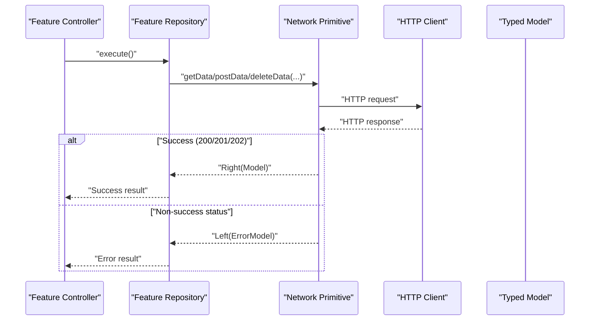
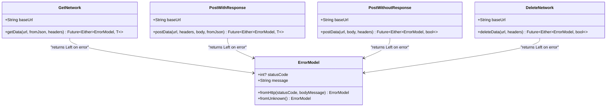
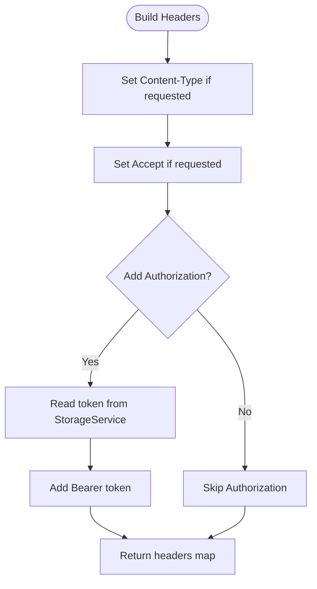
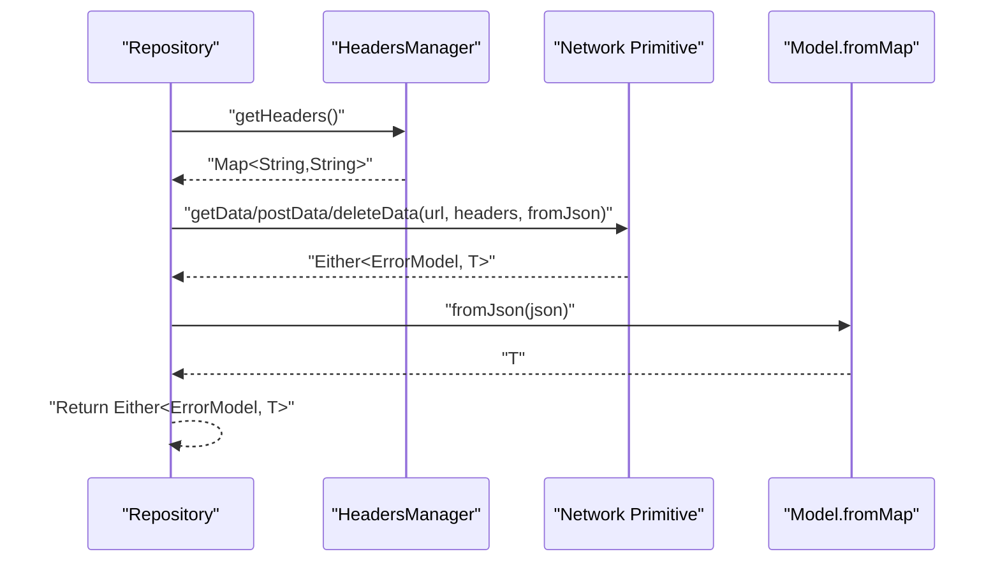
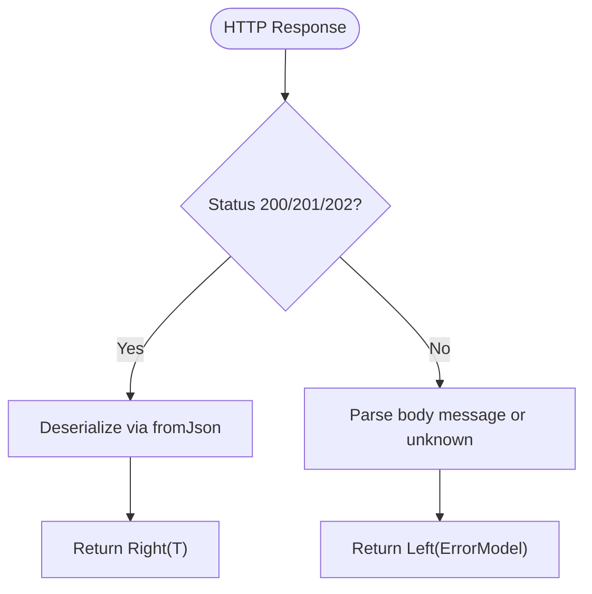
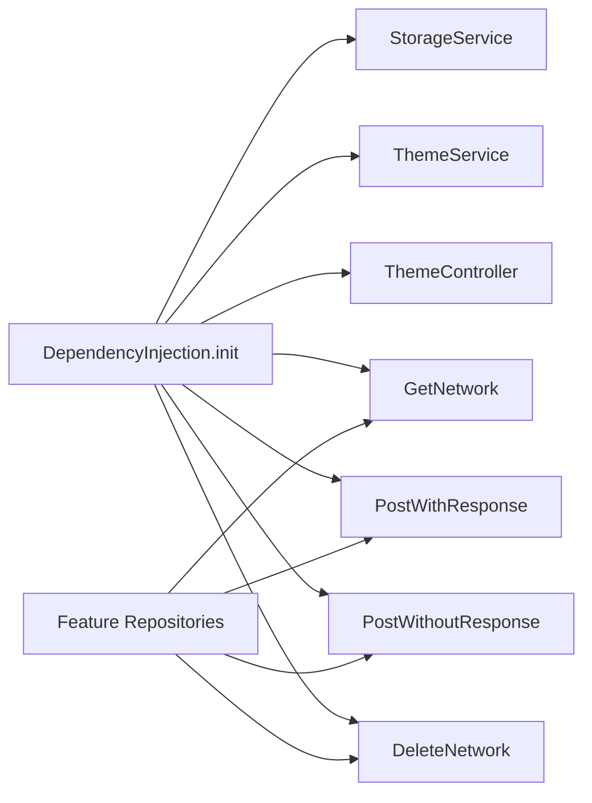

# Data Layer Architecture

<cite>
**Referenced Files in This Document**
- [main.dart](file://lib/main.dart)
- [dependency_injection.dart](file://lib/core/di/dependency_injection.dart)
- [networks_path.dart](file://lib/core/constant/networks_path.dart)
- [get_network.dart](file://lib/core/data/networks/get_network.dart)
- [post_with_response.dart](file://lib/core/data/networks/post_with_response.dart)
- [post_without_response.dart](file://lib/core/data/networks/post_without_response.dart)
- [delete_network.dart](file://lib/core/data/networks/delete_network.dart)
- [headers_manager.dart](file://lib/core/data/networks/headers_manager.dart)
- [storage_service.dart](file://lib/core/data/local/storage_service.dart)
- [error_model.dart](file://lib/core/data/global_models/error_model.dart)
- [get_rooms_repo.dart](file://lib/features/home/repositories/get_rooms_repo.dart)
- [get_products_by_type_repo.dart](file://lib/features/home/repositories/get_products_by_type_repo.dart)
- [get_orders_repo.dart](file://lib/features/order/repositories/get_orders_repo.dart)
- [order_review_repo.dart](file://lib/features/order/repositories/order_review_repo.dart)
- [get_rentals_repo.dart](file://lib/features/rental/repositories/get_rentals_repo.dart)
- [rental_details_repo.dart](file://lib/features/rental/repositories/rental_details_repo.dart)
- [get_user_address_repo.dart](file://lib/features/profile/repositories/get_user_address_repo.dart)
</cite>

## Table of Contents
1. [Introduction](#introduction)
2. [Project Structure](#project-structure)
3. [Core Components](#core-components)
4. [Architecture Overview](#architecture-overview)
5. [Detailed Component Analysis](#detailed-component-analysis)
6. [Dependency Analysis](#dependency-analysis)
7. [Performance Considerations](#performance-considerations)
8. [Troubleshooting Guide](#troubleshooting-guide)
9. [Conclusion](#conclusion)

## Introduction
This document explains ZB-DEZINE’s data layer architecture with a focus on:
- Repository pattern implementation using feature-specific repositories that depend on network primitives
- HTTP networking layer with standardized GET, POST, and DELETE operations
- Error management using a unified error model and functional error handling via Either
- Serialization/deserialization patterns and API response mapping
- Examples of network service usage and repository method implementations
- Current state of caching, offline support, and data consistency patterns

## Project Structure

```mermaid
graph TB
subgraph "Entry Point"
MAIN["main.dart"]
end
subgraph "DI Container"
DI["dependency_injection.dart"]
end
subgraph "Local Storage"
STORAGE["storage_service.dart"]
end
subgraph "Networking Primitives"
GETNET["get_network.dart"]
POSTWR["post_with_response.dart"]
POSTWOR["post_without_response.dart"]
DELNET["delete_network.dart"]
HEADERS["headers_manager.dart"]
BASEURL["networks_path.dart"]
end
subgraph "Global Models"
ERRORMODEL["error_model.dart"]
end
subgraph "Feature Repositories"
ROOMS["features/home/repositories/get_rooms_repo.dart"]
PRODUCTS["features/home/repositories/get_products_by_type_repo.dart"]
ORDERS["features/order/repositories/get_orders_repo.dart"]
ORDERREV["features/order/repositories/order_review_repo.dart"]
RENTALS["features/rental/repositories/get_rentals_repo.dart"]
RENTALDET["features/rental/repositories/rental_details_repo.dart"]
ADDRESS["features/profile/repositories/get_user_address_repo.dart"]
end
MAIN --> DI
DI --> STORAGE
DI --> GETNET
DI --> POSTWR
DI --> POSTWOR
DI --> DELNET
GETNET --> ERRORMODEL
POSTWR --> ERRORMODEL
POSTWOR --> ERRORMODEL
DELNET --> ERRORMODEL
HEADERS --> STORAGE
GETNET --> BASEURL
POSTWR --> BASEURL
POSTWOR --> BASEURL
DELNET --> BASEURL
ROOMS --> GETNET
PRODUCTS --> GETNET
ORDERS --> GETNET
ORDERREV --> POSTWOR
RENTALS --> GETNET
RENTALDET --> GETNET
ADDRESS --> GETNET
```

The data layer is organized under lib/core/data and lib/features/<feature>/repositories. It leverages a dependency injection container to wire up network services and local storage, and repositories encapsulate feature-specific data operations.

**Diagram sources**
- [main.dart:12-19](file://lib/main.dart#L12-L19)
- [dependency_injection.dart:11-25](file://lib/core/di/dependency_injection.dart#L11-L25)
- [storage_service.dart:3-22](file://lib/core/data/local/storage_service.dart#L3-L22)
- [get_network.dart:8-40](file://lib/core/data/networks/get_network.dart#L8-L40)
- [post_with_response.dart:7-44](file://lib/core/data/networks/post_with_response.dart#L7-L44)
- [post_without_response.dart:9-46](file://lib/core/data/networks/post_without_response.dart#L9-L46)
- [delete_network.dart:8-40](file://lib/core/data/networks/delete_network.dart#L8-L40)
- [headers_manager.dart:4-22](file://lib/core/data/networks/headers_manager.dart#L4-L22)
- [networks_path.dart:1-3](file://lib/core/constant/networks_path.dart#L1-L3)
- [error_model.dart:1-15](file://lib/core/data/global_models/error_model.dart#L1-L15)
- [get_rooms_repo.dart:7-19](file://lib/features/home/repositories/get_rooms_repo.dart#L7-L19)
- [get_products_by_type_repo.dart:7-21](file://lib/features/home/repositories/get_products_by_type_repo.dart#L7-L21)
- [get_orders_repo.dart:7-19](file://lib/features/order/repositories/get_orders_repo.dart#L7-L19)
- [order_review_repo.dart:8-29](file://lib/features/order/repositories/order_review_repo.dart#L8-L29)
- [get_rentals_repo.dart:7-37](file://lib/features/rental/repositories/get_rentals_repo.dart#L7-L37)
- [rental_details_repo.dart:7-21](file://lib/features/rental/repositories/rental_details_repo.dart#L7-L21)
- [get_user_address_repo.dart:7-19](file://lib/features/profile/repositories/get_user_address_repo.dart#L7-L19)

**Section sources**
- [main.dart:12-19](file://lib/main.dart#L12-L19)
- [dependency_injection.dart:11-25](file://lib/core/di/dependency_injection.dart#L11-L25)

## Core Components
- Base networking primitives:
  - GET: [GetNetwork.getData:10-39](file://lib/core/data/networks/get_network.dart#L10-L39)
  - POST with response: [PostWithResponse.postData:9-43](file://lib/core/data/networks/post_with_response.dart#L9-L43)
  - POST without response: [PostWithoutResponse.postData:12-45](file://lib/core/data/networks/post_without_response.dart#L12-L45)
  - DELETE: [DeleteNetwork.deleteData:10-39](file://lib/core/data/networks/delete_network.dart#L10-L39)
- Shared header management: [HeadersManager.getHeaders:9-21](file://lib/core/data/networks/headers_manager.dart#L9-L21)
- Local storage abstraction: [StorageService:3-22](file://lib/core/data/local/storage_service.dart#L3-L22)
- Global error model: [ErrorModel:1-15](file://lib/core/data/global_models/error_model.dart#L1-L15)
- Feature repositories implementing the repository pattern:
  - [GetRoomsRepository.execute:11-18](file://lib/features/home/repositories/get_rooms_repo.dart#L11-L18)
  - [GetProductsByTypeRepository.execute:11-20](file://lib/features/home/repositories/get_products_by_type_repo.dart#L11-L20)
  - [GetOrdersRepository.execute:11-18](file://lib/features/order/repositories/get_orders_repo.dart#L11-L18)
  - [OrderReviewRepository.execute:12-28](file://lib/features/order/repositories/order_review_repo.dart#L12-L28)
  - [GetRentalsRepository.execute:11-36](file://lib/features/rental/repositories/get_rentals_repo.dart#L11-L36)
  - [RentalDetailsRepository.execute:11-20](file://lib/features/rental/repositories/rental_details_repo.dart#L11-L20)
  - [GetUserAddressRepository.execute:11-18](file://lib/features/profile/repositories/get_user_address_repo.dart#L11-L18)

**Section sources**
- [get_network.dart:8-40](file://lib/core/data/networks/get_network.dart#L8-L40)
- [post_with_response.dart:7-44](file://lib/core/data/networks/post_with_response.dart#L7-L44)
- [post_without_response.dart:9-46](file://lib/core/data/networks/post_without_response.dart#L9-L46)
- [delete_network.dart:8-40](file://lib/core/data/networks/delete_network.dart#L8-L40)
- [headers_manager.dart:4-22](file://lib/core/data/networks/headers_manager.dart#L4-L22)
- [storage_service.dart:3-22](file://lib/core/data/local/storage_service.dart#L3-L22)
- [error_model.dart:1-15](file://lib/core/data/global_models/error_model.dart#L1-L15)
- [get_rooms_repo.dart:7-19](file://lib/features/home/repositories/get_rooms_repo.dart#L7-L19)
- [get_products_by_type_repo.dart:7-21](file://lib/features/home/repositories/get_products_by_type_repo.dart#L7-L21)
- [get_orders_repo.dart:7-19](file://lib/features/order/repositories/get_orders_repo.dart#L7-L19)
- [order_review_repo.dart:8-29](file://lib/features/order/repositories/order_review_repo.dart#L8-L29)
- [get_rentals_repo.dart:7-37](file://lib/features/rental/repositories/get_rentals_repo.dart#L7-L37)
- [rental_details_repo.dart:7-21](file://lib/features/rental/repositories/rental_details_repo.dart#L7-L21)
- [get_user_address_repo.dart:7-19](file://lib/features/profile/repositories/get_user_address_repo.dart#L7-L19)

## Architecture Overview
The data layer follows a layered approach:
- Entry point initializes dependency injection and runs the app
- DI registers network primitives, storage, theme services, and exposes them via a container
- Repositories depend on network primitives and optionally headers manager and storage
- Feature controllers consume repositories to fetch or mutate data
- Responses are mapped to typed models via fromJson callbacks; errors are normalized into ErrorModel

**Diagram sources**
- [get_network.dart:10-39](file://lib/core/data/networks/get_network.dart#L10-L39)
- [post_with_response.dart:9-43](file://lib/core/data/networks/post_with_response.dart#L9-L43)
- [post_without_response.dart:12-45](file://lib/core/data/networks/post_without_response.dart#L12-L45)
- [delete_network.dart:10-39](file://lib/core/data/networks/delete_network.dart#L10-L39)

## Detailed Component Analysis

### HTTP Networking Layer
- GET: [GetNetwork.getData:10-39](file://lib/core/data/networks/get_network.dart#L10-L39)
  - Accepts a URL, headers, and a fromJson callback to deserialize the response
  - Returns Either<ErrorModel, T> with success on 200/201/202
  - Non-success responses are parsed into ErrorModel; exceptions are captured and returned as ErrorModel
- POST with response: [PostWithResponse.postData:9-43](file://lib/core/data/networks/post_with_response.dart#L9-L43)
  - Sends JSON payload and deserializes the response into T via fromJson
  - Returns Either<ErrorModel, T> with success on 200/201/202
- POST without response: [PostWithoutResponse.postData:12-45](file://lib/core/data/networks/post_without_response.dart#L12-L45)
  - Sends JSON payload and returns Either<ErrorModel, bool> indicating success/failure
  - Success on 200/201/202
- DELETE: [DeleteNetwork.deleteData:10-39](file://lib/core/data/networks/delete_network.dart#L10-L39)
  - Deletes resource and returns Either<ErrorModel, bool>

**Diagram sources**
- [get_network.dart:8-40](file://lib/core/data/networks/get_network.dart#L8-L40)
- [post_with_response.dart:7-44](file://lib/core/data/networks/post_with_response.dart#L7-L44)
- [post_without_response.dart:9-46](file://lib/core/data/networks/post_without_response.dart#L9-L46)
- [delete_network.dart:8-40](file://lib/core/data/networks/delete_network.dart#L8-L40)
- [error_model.dart:1-15](file://lib/core/data/global_models/error_model.dart#L1-L15)

**Section sources**
- [get_network.dart:8-40](file://lib/core/data/networks/get_network.dart#L8-L40)
- [post_with_response.dart:7-44](file://lib/core/data/networks/post_with_response.dart#L7-L44)
- [post_without_response.dart:9-46](file://lib/core/data/networks/post_without_response.dart#L9-L46)
- [delete_network.dart:8-40](file://lib/core/data/networks/delete_network.dart#L8-L40)
- [error_model.dart:1-15](file://lib/core/data/global_models/error_model.dart#L1-L15)

### Header Management and Authentication
- [HeadersManager.getHeaders:9-21](file://lib/core/data/networks/headers_manager.dart#L9-L21) constructs headers with Content-Type, Accept, and Authorization (Bearer token)
- Token retrieval is delegated to [StorageService.read:7-9](file://lib/core/data/local/storage_service.dart#L7-L9)

**Diagram sources**
- [headers_manager.dart:9-21](file://lib/core/data/networks/headers_manager.dart#L9-L21)
- [storage_service.dart:7-9](file://lib/core/data/local/storage_service.dart#L7-L9)

**Section sources**
- [headers_manager.dart:4-22](file://lib/core/data/networks/headers_manager.dart#L4-L22)
- [storage_service.dart:3-22](file://lib/core/data/local/storage_service.dart#L3-L22)

### Repository Pattern Implementation
Repositories encapsulate feature-specific data operations and depend on network primitives. They:
- Compose URLs and optional query parameters
- Apply headers via HeadersManager
- Deserialize responses using fromJson callbacks
- Return Either<ErrorModel, T> to propagate errors consistently

Examples:
- [GetRoomsRepository.execute:11-18](file://lib/features/home/repositories/get_rooms_repo.dart#L11-L18)
- [GetProductsByTypeRepository.execute:11-20](file://lib/features/home/repositories/get_products_by_type_repo.dart#L11-L20)
- [GetOrdersRepository.execute:11-18](file://lib/features/order/repositories/get_orders_repo.dart#L11-L18)
- [OrderReviewRepository.execute:12-28](file://lib/features/order/repositories/order_review_repo.dart#L12-L28)
- [GetRentalsRepository.execute:11-36](file://lib/features/rental/repositories/get_rentals_repo.dart#L11-L36)
- [RentalDetailsRepository.execute:11-20](file://lib/features/rental/repositories/rental_details_repo.dart#L11-L20)
- [GetUserAddressRepository.execute:11-18](file://lib/features/profile/repositories/get_user_address_repo.dart#L11-L18)

**Diagram sources**
- [get_rooms_repo.dart:11-18](file://lib/features/home/repositories/get_rooms_repo.dart#L11-L18)
- [headers_manager.dart:9-21](file://lib/core/data/networks/headers_manager.dart#L9-L21)
- [get_network.dart:10-39](file://lib/core/data/networks/get_network.dart#L10-L39)

**Section sources**
- [get_rooms_repo.dart:7-19](file://lib/features/home/repositories/get_rooms_repo.dart#L7-L19)
- [get_products_by_type_repo.dart:7-21](file://lib/features/home/repositories/get_products_by_type_repo.dart#L7-L21)
- [get_orders_repo.dart:7-19](file://lib/features/order/repositories/get_orders_repo.dart#L7-L19)
- [order_review_repo.dart:8-29](file://lib/features/order/repositories/order_review_repo.dart#L8-L29)
- [get_rentals_repo.dart:7-37](file://lib/features/rental/repositories/get_rentals_repo.dart#L7-L37)
- [rental_details_repo.dart:7-21](file://lib/features/rental/repositories/rental_details_repo.dart#L7-L21)
- [get_user_address_repo.dart:7-19](file://lib/features/profile/repositories/get_user_address_repo.dart#L7-L19)

### Error Management and Retry Mechanisms
- Error model: [ErrorModel:1-15](file://lib/core/data/global_models/error_model.dart#L1-L15)
- Standardized error handling:
  - Non-success HTTP status codes are parsed into ErrorModel
  - Unknown errors are normalized via ErrorModel.fromUnknown
  - Exceptions during request or parsing are captured and returned as ErrorModel
- Retry and timeout:
  - No built-in retry or timeout configuration is present in the current implementation
  - Consider adding retry policies and timeouts at the HTTP client level if needed

**Diagram sources**
- [get_network.dart:14-39](file://lib/core/data/networks/get_network.dart#L14-L39)
- [post_with_response.dart:14-43](file://lib/core/data/networks/post_with_response.dart#L14-L43)
- [post_without_response.dart:16-45](file://lib/core/data/networks/post_without_response.dart#L16-L45)
- [delete_network.dart:13-39](file://lib/core/data/networks/delete_network.dart#L13-L39)
- [error_model.dart:5-13](file://lib/core/data/global_models/error_model.dart#L5-L13)

**Section sources**
- [error_model.dart:1-15](file://lib/core/data/global_models/error_model.dart#L1-L15)
- [get_network.dart:14-39](file://lib/core/data/networks/get_network.dart#L14-L39)
- [post_with_response.dart:14-43](file://lib/core/data/networks/post_with_response.dart#L14-L43)
- [post_without_response.dart:16-45](file://lib/core/data/networks/post_without_response.dart#L16-L45)
- [delete_network.dart:13-39](file://lib/core/data/networks/delete_network.dart#L13-L39)

### Serialization/Deserialization Patterns and API Mapping
- All network primitives accept a fromJson callback to convert JSON to typed models
- Repositories pass model-specific fromJson implementations (e.g., RoomsModel.fromJson)
- Example usage:
  - [GetRoomsRepository.execute:11-18](file://lib/features/home/repositories/get_rooms_repo.dart#L11-L18)
  - [GetProductsByTypeRepository.execute:11-20](file://lib/features/home/repositories/get_products_by_type_repo.dart#L11-L20)
  - [GetOrdersRepository.execute:11-18](file://lib/features/order/repositories/get_orders_repo.dart#L11-L18)

**Section sources**
- [get_rooms_repo.dart:11-18](file://lib/features/home/repositories/get_rooms_repo.dart#L11-L18)
- [get_products_by_type_repo.dart:11-20](file://lib/features/home/repositories/get_products_by_type_repo.dart#L11-L20)
- [get_orders_repo.dart:11-18](file://lib/features/order/repositories/get_orders_repo.dart#L11-L18)

### Examples of Network Service Usage and Repository Method Implementations
- GET example: [GetRoomsRepository.execute:11-18](file://lib/features/home/repositories/get_rooms_repo.dart#L11-L18)
- POST without response example: [OrderReviewRepository.execute:12-28](file://lib/features/order/repositories/order_review_repo.dart#L12-L28)
- GET with query parameters example: [GetRentalsRepository.execute:11-36](file://lib/features/rental/repositories/get_rentals_repo.dart#L11-L36)

**Section sources**
- [get_rooms_repo.dart:11-18](file://lib/features/home/repositories/get_rooms_repo.dart#L11-L18)
- [order_review_repo.dart:12-28](file://lib/features/order/repositories/order_review_repo.dart#L12-L28)
- [get_rentals_repo.dart:11-36](file://lib/features/rental/repositories/get_rentals_repo.dart#L11-L36)

### Caching Strategies, Offline Support, and Data Consistency
- Current implementation does not include explicit caching or offline persistence
- Data consistency relies on immediate network calls and direct model mapping
- Recommendations (conceptual):
  - Introduce a caching layer (e.g., in-memory cache or disk cache) with cache-control headers
  - Implement optimistic updates in repositories and fallback to stored data when offline
  - Add cache invalidation strategies after mutations (POST/DELETE)

[No sources needed since this section provides general guidance]

## Dependency Analysis
- DI wiring registers:
  - StorageService, ThemeService, ThemeController
  - Network primitives: GetNetwork, PostWithResponse, PostWithoutResponse, DeleteNetwork
- Repositories depend on injected network primitives and headers manager
- Entry point initializes DI and reads token for initial app state

**Diagram sources**
- [dependency_injection.dart:11-25](file://lib/core/di/dependency_injection.dart#L11-L25)
- [main.dart:12-19](file://lib/main.dart#L12-L19)

**Section sources**
- [dependency_injection.dart:11-25](file://lib/core/di/dependency_injection.dart#L11-L25)
- [main.dart:12-19](file://lib/main.dart#L12-L19)

## Performance Considerations
- Network calls are synchronous per repository method; consider batching or concurrency limits at the controller layer
- Avoid unnecessary JSON parsing by reusing deserialization callbacks
- Minimize header construction overhead by caching static headers where safe

[No sources needed since this section provides general guidance]

## Troubleshooting Guide
Common scenarios and resolutions:
- Non-success HTTP status:
  - Inspect ErrorModel fields (statusCode, message) returned by repositories
  - Verify API endpoint correctness and authentication token validity
- Unknown errors:
  - Ensure proper fromJson mapping and handle missing keys gracefully
- Request failures:
  - Confirm network connectivity and base URL configuration
  - Validate headers (Authorization, Content-Type) set by HeadersManager

**Section sources**
- [error_model.dart:1-15](file://lib/core/data/global_models/error_model.dart#L1-L15)
- [headers_manager.dart:9-21](file://lib/core/data/networks/headers_manager.dart#L9-L21)
- [networks_path.dart:1-3](file://lib/core/constant/networks_path.dart#L1-L3)

## Conclusion
ZB-DEZINE’s data layer employs a clean separation of concerns:
- Network primitives provide standardized HTTP operations with consistent error handling
- Repositories encapsulate feature logic and model mapping
- DI simplifies dependency management and initialization
To enhance robustness, consider integrating retry and timeout policies, introducing caching and offline capabilities, and establishing a unified cache invalidation strategy.