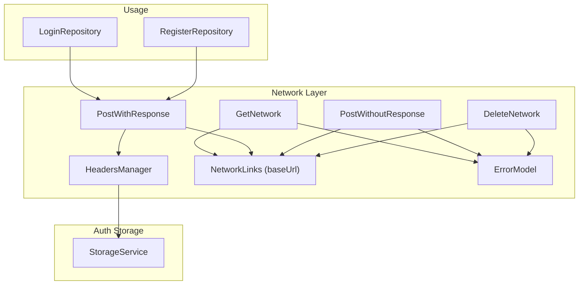
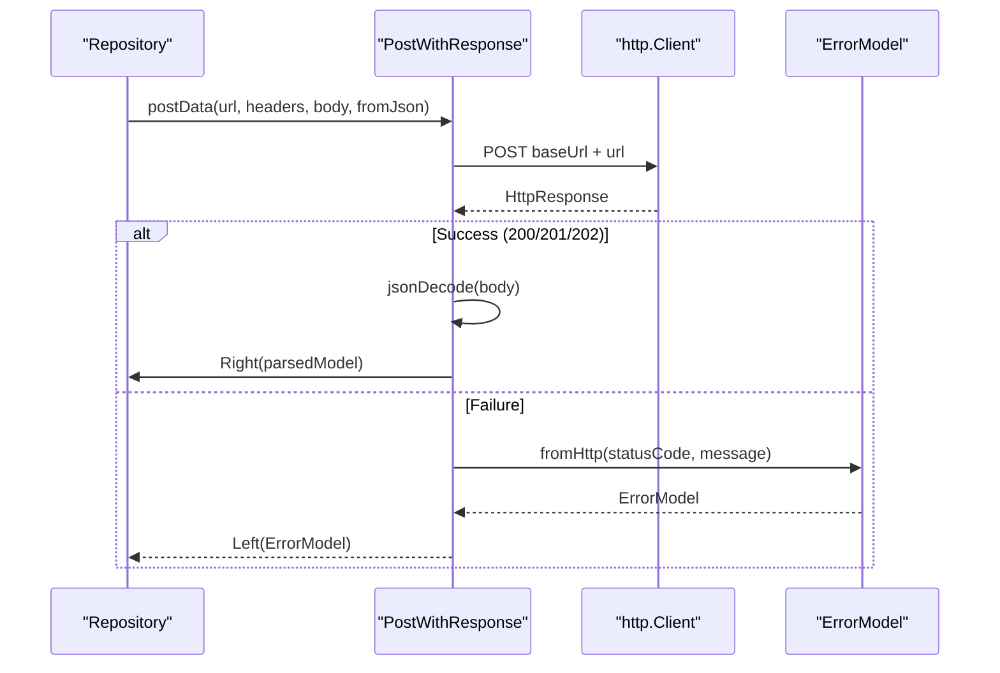
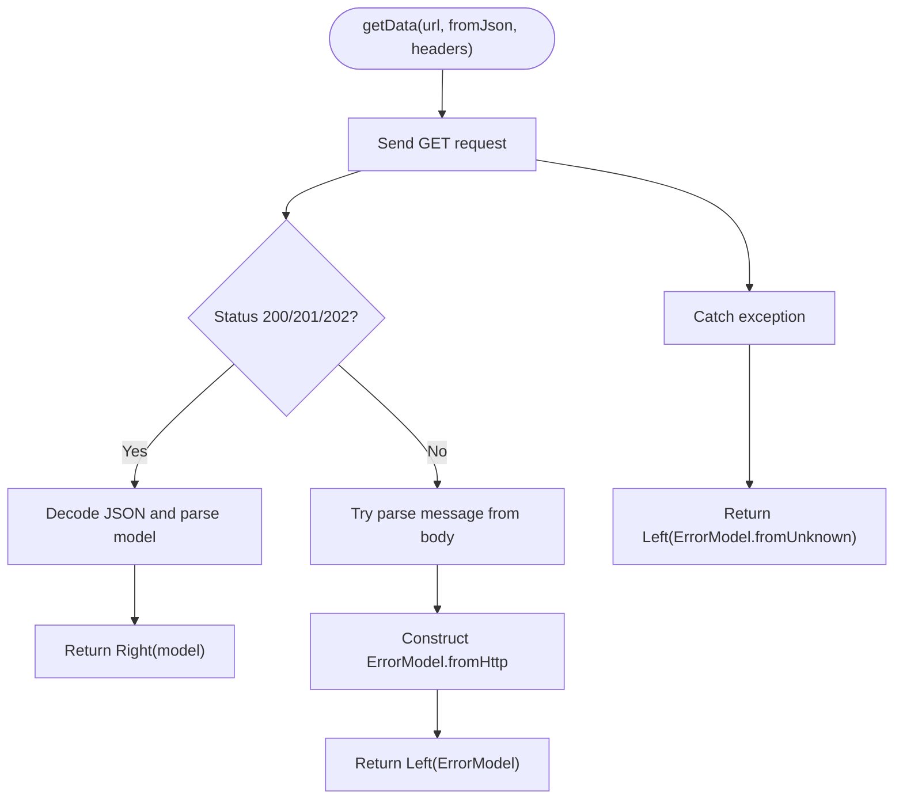
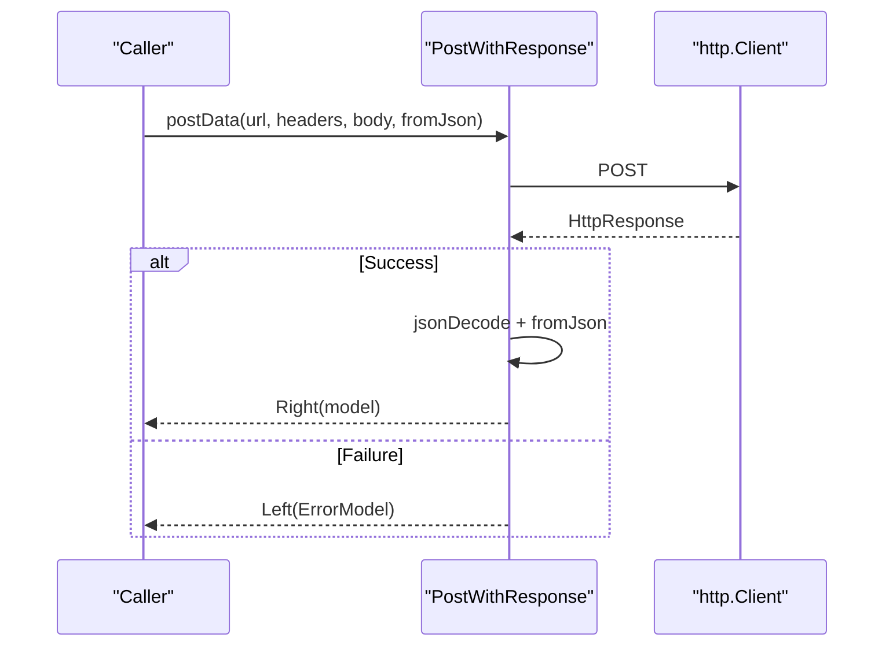
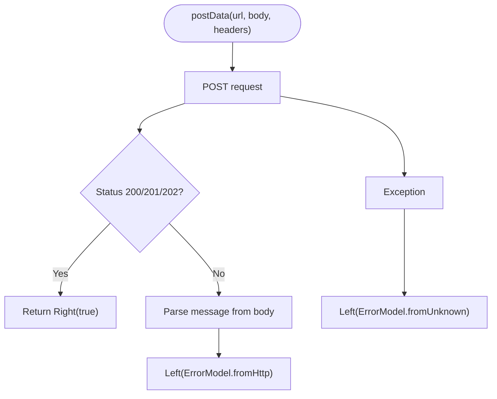
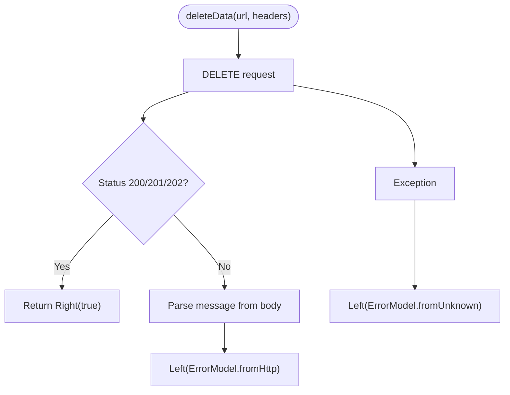
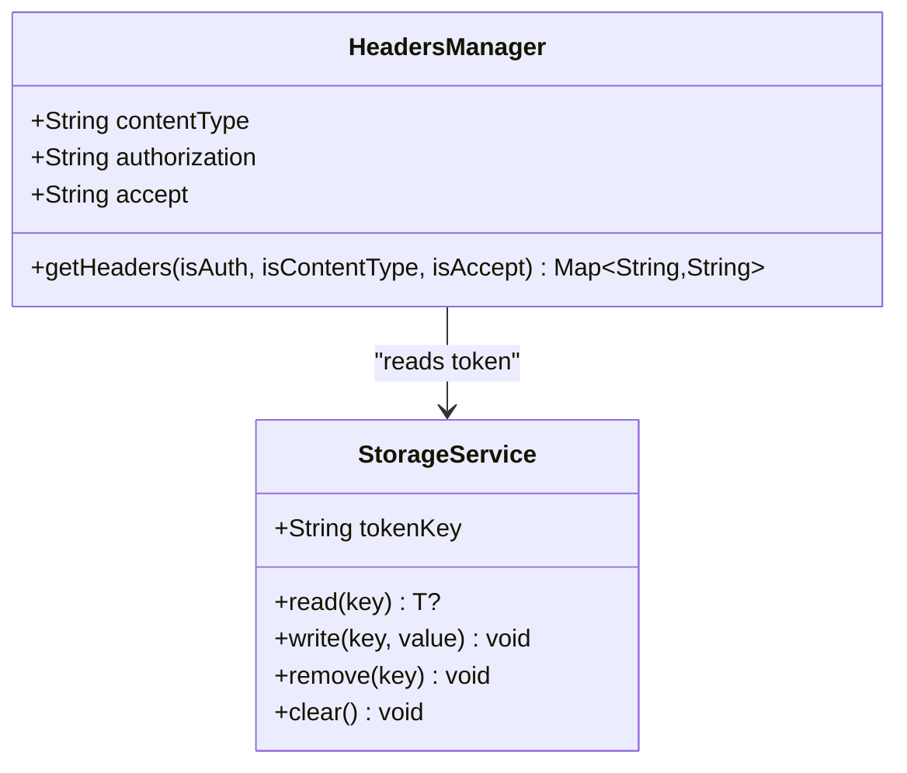
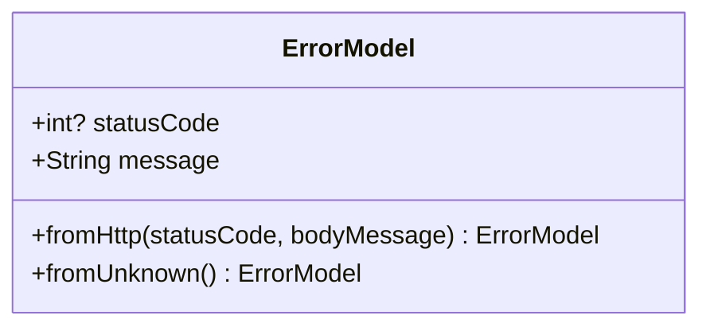
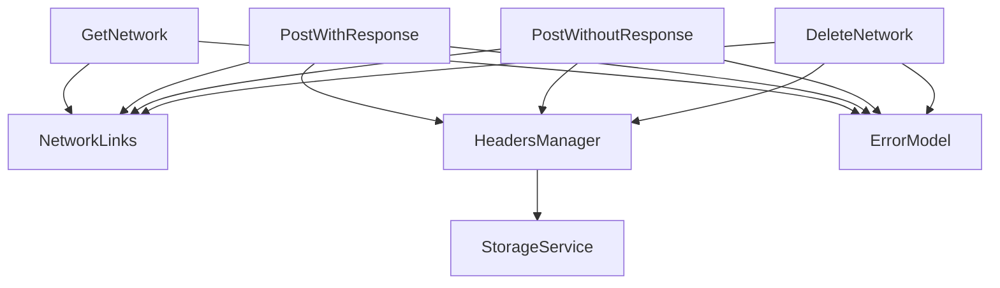

# Network Services

<cite>
**Referenced Files in This Document**
- [get_network.dart](file://lib/core/data/networks/get_network.dart)
- [post_with_response.dart](file://lib/core/data/networks/post_with_response.dart)
- [post_without_response.dart](file://lib/core/data/networks/post_without_response.dart)
- [delete_network.dart](file://lib/core/data/networks/delete_network.dart)
- [headers_manager.dart](file://lib/core/data/networks/headers_manager.dart)
- [networks_path.dart](file://lib/core/constant/networks_path.dart)
- [error_model.dart](file://lib/core/data/global_models/error_model.dart)
- [storage_service.dart](file://lib/core/data/local/storage_service.dart)
- [login_repo.dart](file://lib/features/auth/repositories/login_repo.dart)
- [register_repo.dart](file://lib/features/auth/repositories/register_repo.dart)
</cite>

## Table of Contents
1. [Introduction](#introduction)
2. [Project Structure](#project-structure)
3. [Core Components](#core-components)
4. [Architecture Overview](#architecture-overview)
5. [Detailed Component Analysis](#detailed-component-analysis)
6. [Dependency Analysis](#dependency-analysis)
7. [Performance Considerations](#performance-considerations)
8. [Troubleshooting Guide](#troubleshooting-guide)
9. [Conclusion](#conclusion)

## Introduction
This document describes the network services layer used by ZB-DEZINE. It focuses on HTTP networking implementations for GET, POST, and DELETE operations, along with standardized request/response handling patterns. The layer uses functional error handling via the Either type to unify success and failure outcomes, integrates a shared error model, and centralizes base URL and header management. Practical guidance is included for making API calls, handling different response types, implementing retry strategies, configuring timeouts, managing authentication headers, and recovering from network errors.

## Project Structure
The network services are organized under a dedicated module with clear separation of concerns:
- HTTP operation classes: GetNetwork, PostWithResponse, PostWithoutResponse, DeleteNetwork
- Header management: HeadersManager
- Global configuration: NetworkLinks (base URL)
- Error model: ErrorModel
- Authentication token storage: StorageService
- Example usage: Repositories demonstrate how to compose these services

**Diagram sources**
- [get_network.dart:8-40](file://lib/core/data/networks/get_network.dart#L8-L40)
- [post_with_response.dart:7-44](file://lib/core/data/networks/post_with_response.dart#L7-L44)
- [post_without_response.dart:9-46](file://lib/core/data/networks/post_without_response.dart#L9-L46)
- [delete_network.dart:8-39](file://lib/core/data/networks/delete_network.dart#L8-L39)
- [headers_manager.dart:4-22](file://lib/core/data/networks/headers_manager.dart#L4-L22)
- [networks_path.dart:1-3](file://lib/core/constant/networks_path.dart#L1-L3)
- [error_model.dart:1-15](file://lib/core/data/global_models/error_model.dart#L1-L15)
- [login_repo.dart:9-28](file://lib/features/auth/repositories/login_repo.dart#L9-L28)
- [register_repo.dart:9-38](file://lib/features/auth/repositories/register_repo.dart#L9-L38)
- [storage_service.dart:3-22](file://lib/core/data/local/storage_service.dart#L3-L22)

**Section sources**
- [get_network.dart:1-41](file://lib/core/data/networks/get_network.dart#L1-L41)
- [post_with_response.dart:1-45](file://lib/core/data/networks/post_with_response.dart#L1-L45)
- [post_without_response.dart:1-47](file://lib/core/data/networks/post_without_response.dart#L1-L47)
- [delete_network.dart:1-41](file://lib/core/data/networks/delete_network.dart#L1-L41)
- [headers_manager.dart:1-23](file://lib/core/data/networks/headers_manager.dart#L1-L23)
- [networks_path.dart:1-3](file://lib/core/constant/networks_path.dart#L1-L3)
- [error_model.dart:1-15](file://lib/core/data/global_models/error_model.dart#L1-L15)
- [storage_service.dart:1-23](file://lib/core/data/local/storage_service.dart#L1-L23)
- [login_repo.dart:1-29](file://lib/features/auth/repositories/login_repo.dart#L1-L29)
- [register_repo.dart:1-39](file://lib/features/auth/repositories/register_repo.dart#L1-L39)

## Core Components
This section introduces the primary network classes and their responsibilities.

- GetNetwork
  - Purpose: Perform HTTP GET requests and parse JSON responses into typed models.
  - Key capabilities:
    - Accepts a URL path, a deserialization function, and optional headers.
    - Returns Either<ErrorModel, T>, where T is the parsed model type.
    - Treats 200/201/202 as success; otherwise constructs an ErrorModel from HTTP response or falls back to unknown error.
  - Typical usage pattern: Call getData with a fromJson function that maps JSON to a domain model.

- PostWithResponse
  - Purpose: Perform HTTP POST requests expecting a JSON response payload.
  - Key capabilities:
    - Accepts URL, headers, and a serializable body.
    - Returns Either<ErrorModel, T> after parsing the response body via fromJson.
    - Success conditions mirror GET: 200/201/202.

- PostWithoutResponse
  - Purpose: Perform HTTP POST requests where the response body is not consumed.
  - Key capabilities:
    - Accepts URL, optional headers, and a serializable body.
    - Returns Either<ErrorModel, bool> with Right(true) on success.
    - Useful for actions like submitting forms or triggering server-side tasks.

- DeleteNetwork
  - Purpose: Perform HTTP DELETE requests.
  - Key capabilities:
    - Accepts URL and optional headers.
    - Returns Either<ErrorModel, bool> with Right(true) on success.
    - Uses the same success criteria and error construction as other operations.

- HeadersManager
  - Purpose: Centralize header creation for HTTP requests.
  - Capabilities:
    - Provides Content-Type and Accept headers.
    - Optionally adds Authorization header using a stored bearer token.
    - Integrates with StorageService to fetch the token.

- NetworkLinks
  - Purpose: Define the base URL for all network requests.
  - Usage: Each network class composes the base URL with endpoint paths.

- ErrorModel
  - Purpose: Standardized error representation across the network layer.
  - Capabilities:
    - Constructed from HTTP status and message.
    - Provides a fallback for unknown errors.

- StorageService
  - Purpose: Persist and retrieve tokens and other small data.
  - Used by HeadersManager to populate Authorization headers.

**Section sources**
- [get_network.dart:8-40](file://lib/core/data/networks/get_network.dart#L8-L40)
- [post_with_response.dart:7-44](file://lib/core/data/networks/post_with_response.dart#L7-L44)
- [post_without_response.dart:9-46](file://lib/core/data/networks/post_without_response.dart#L9-L46)
- [delete_network.dart:8-39](file://lib/core/data/networks/delete_network.dart#L8-L39)
- [headers_manager.dart:4-22](file://lib/core/data/networks/headers_manager.dart#L4-L22)
- [networks_path.dart:1-3](file://lib/core/constant/networks_path.dart#L1-L3)
- [error_model.dart:1-15](file://lib/core/data/global_models/error_model.dart#L1-L15)
- [storage_service.dart:3-22](file://lib/core/data/local/storage_service.dart#L3-L22)

## Architecture Overview
The network layer follows a layered architecture:
- Operation classes encapsulate HTTP logic and response parsing.
- HeadersManager provides reusable header composition.
- NetworkLinks centralizes the base URL.
- ErrorModel unifies error handling across operations.
- Repositories orchestrate calls and transform payloads.

**Diagram sources**
- [post_with_response.dart:9-43](file://lib/core/data/networks/post_with_response.dart#L9-L43)
- [error_model.dart:5-13](file://lib/core/data/global_models/error_model.dart#L5-L13)

**Section sources**
- [post_with_response.dart:1-45](file://lib/core/data/networks/post_with_response.dart#L1-L45)
- [error_model.dart:1-15](file://lib/core/data/global_models/error_model.dart#L1-L15)

## Detailed Component Analysis

### GetNetwork
- Responsibilities:
  - Build GET request with optional headers.
  - Parse successful responses into typed models.
  - Convert failures into ErrorModel instances.
- Error handling:
  - On HTTP errors, attempts to extract a message from the response body; falls back to unknown error if parsing fails.
  - Catches exceptions and converts them to ErrorModel.
- Complexity:
  - Time complexity proportional to response size and JSON decoding cost.
  - Space complexity dominated by decoded JSON and model instantiation.

**Diagram sources**
- [get_network.dart:10-39](file://lib/core/data/networks/get_network.dart#L10-L39)

**Section sources**
- [get_network.dart:8-40](file://lib/core/data/networks/get_network.dart#L8-L40)

### PostWithResponse
- Responsibilities:
  - Send POST with headers and body.
  - Deserialize response into a typed model using fromJson.
- Error handling:
  - Mirrors GET behavior for HTTP errors and unknowns.
- Usage patterns:
  - Typically used for login, registration, and other operations returning structured data.

**Diagram sources**
- [post_with_response.dart:9-43](file://lib/core/data/networks/post_with_response.dart#L9-L43)

**Section sources**
- [post_with_response.dart:7-44](file://lib/core/data/networks/post_with_response.dart#L7-L44)

### PostWithoutResponse
- Responsibilities:
  - Send POST without consuming the response body.
  - Return a boolean success indicator.
- Error handling:
  - Converts HTTP errors and exceptions into ErrorModel.

**Diagram sources**
- [post_without_response.dart:12-45](file://lib/core/data/networks/post_without_response.dart#L12-L45)

**Section sources**
- [post_without_response.dart:9-46](file://lib/core/data/networks/post_without_response.dart#L9-L46)

### DeleteNetwork
- Responsibilities:
  - Perform DELETE requests.
  - Return success or error as per unified pattern.
- Error handling:
  - Same success and error semantics as other operations.

**Diagram sources**
- [delete_network.dart:10-38](file://lib/core/data/networks/delete_network.dart#L10-L38)

**Section sources**
- [delete_network.dart:8-39](file://lib/core/data/networks/delete_network.dart#L8-L39)

### HeadersManager
- Responsibilities:
  - Compose standard headers including Content-Type and Accept.
  - Optionally attach Authorization header using a bearer token.
- Integration:
  - Reads token from StorageService via GetStorage.

**Diagram sources**
- [headers_manager.dart:4-22](file://lib/core/data/networks/headers_manager.dart#L4-L22)
- [storage_service.dart:3-22](file://lib/core/data/local/storage_service.dart#L3-L22)

**Section sources**
- [headers_manager.dart:1-23](file://lib/core/data/networks/headers_manager.dart#L1-L23)
- [storage_service.dart:1-23](file://lib/core/data/local/storage_service.dart#L1-L23)

### ErrorModel
- Responsibilities:
  - Encapsulate HTTP error details.
  - Provide constructors for known and unknown errors.

**Diagram sources**
- [error_model.dart:1-15](file://lib/core/data/global_models/error_model.dart#L1-L15)

**Section sources**
- [error_model.dart:1-15](file://lib/core/data/global_models/error_model.dart#L1-L15)

## Dependency Analysis
- Coupling:
  - All operation classes depend on NetworkLinks for the base URL.
  - PostWithResponse, PostWithoutResponse, and DeleteNetwork depend on http.Client.
  - GetNetwork and others depend on fpdart Either for error handling.
  - HeadersManager depends on StorageService for tokens.
- Cohesion:
  - Each operation class encapsulates a single HTTP verb and response handling strategy.
- External dependencies:
  - http, fpdart, get_storage, and get are used across the network layer.

**Diagram sources**
- [get_network.dart:8-9](file://lib/core/data/networks/get_network.dart#L8-L9)
- [post_with_response.dart:7-8](file://lib/core/data/networks/post_with_response.dart#L7-L8)
- [post_without_response.dart:9-10](file://lib/core/data/networks/post_without_response.dart#L9-L10)
- [delete_network.dart:8-9](file://lib/core/data/networks/delete_network.dart#L8-L9)
- [headers_manager.dart:4-21](file://lib/core/data/networks/headers_manager.dart#L4-L21)
- [networks_path.dart:1-3](file://lib/core/constant/networks_path.dart#L1-L3)
- [error_model.dart:1-15](file://lib/core/data/global_models/error_model.dart#L1-L15)
- [storage_service.dart:3-22](file://lib/core/data/local/storage_service.dart#L3-L22)

**Section sources**
- [get_network.dart:1-41](file://lib/core/data/networks/get_network.dart#L1-L41)
- [post_with_response.dart:1-45](file://lib/core/data/networks/post_with_response.dart#L1-L45)
- [post_without_response.dart:1-47](file://lib/core/data/networks/post_without_response.dart#L1-L47)
- [delete_network.dart:1-41](file://lib/core/data/networks/delete_network.dart#L1-L41)
- [headers_manager.dart:1-23](file://lib/core/data/networks/headers_manager.dart#L1-L23)
- [networks_path.dart:1-3](file://lib/core/constant/networks_path.dart#L1-L3)
- [error_model.dart:1-15](file://lib/core/data/global_models/error_model.dart#L1-L15)
- [storage_service.dart:1-23](file://lib/core/data/local/storage_service.dart#L1-L23)

## Performance Considerations
- Timeout configuration:
  - The current implementation uses the default http.Client behavior. To add timeouts, wrap http requests with a client configured with connectTimeout and receiveTimeout. This ensures predictable behavior and avoids indefinite waits.
- Retry mechanisms:
  - Implement exponential backoff for transient failures (e.g., 5xx, network timeouts). Apply retries selectively to idempotent operations (GET, DELETE) and avoid retrying unsafe POST operations unless the client guarantees idempotency.
- Payload size and parsing:
  - For large responses, consider streaming or pagination to reduce memory pressure. Ensure fromJson functions are efficient and avoid unnecessary allocations.
- Header overhead:
  - Reuse headers via HeadersManager to minimize repeated computation and ensure consistency.

[No sources needed since this section provides general guidance]

## Troubleshooting Guide
- Common issues and resolutions:
  - Unauthorized requests: Verify Authorization header generation via HeadersManager and ensure the token exists in StorageService.
  - Malformed responses: ErrorModel.fromHttp extracts messages from the response body; confirm the server returns a JSON object containing a message field.
  - Unknown errors: When response parsing fails, the layer falls back to ErrorModel.fromUnknown. Inspect server logs and network traces.
  - Timeouts and connectivity: Introduce explicit timeouts on the HTTP client and implement retry policies for transient errors.
- Logging and diagnostics:
  - The code prints response bodies on errors for debugging. Consider integrating structured logging for production environments.

**Section sources**
- [headers_manager.dart:9-21](file://lib/core/data/networks/headers_manager.dart#L9-L21)
- [storage_service.dart:7-9](file://lib/core/data/local/storage_service.dart#L7-L9)
- [get_network.dart:23-37](file://lib/core/data/networks/get_network.dart#L23-L37)
- [post_with_response.dart:27-42](file://lib/core/data/networks/post_with_response.dart#L27-L42)
- [post_without_response.dart:29-44](file://lib/core/data/networks/post_without_response.dart#L29-L44)
- [delete_network.dart:25-38](file://lib/core/data/networks/delete_network.dart#L25-L38)

## Conclusion
The network services layer provides a consistent, functional approach to HTTP operations using Either for error handling, centralized base URL and header management, and a unified error model. By composing these building blocks, repositories can reliably perform GET, POST, and DELETE operations while maintaining clean separation of concerns. Extending the layer with timeouts, retry policies, and structured logging will further improve robustness and observability.