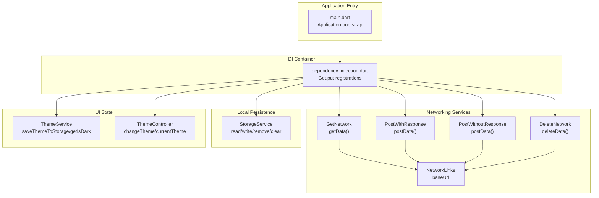
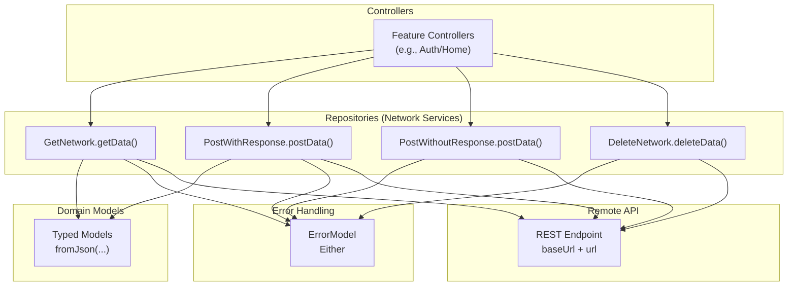
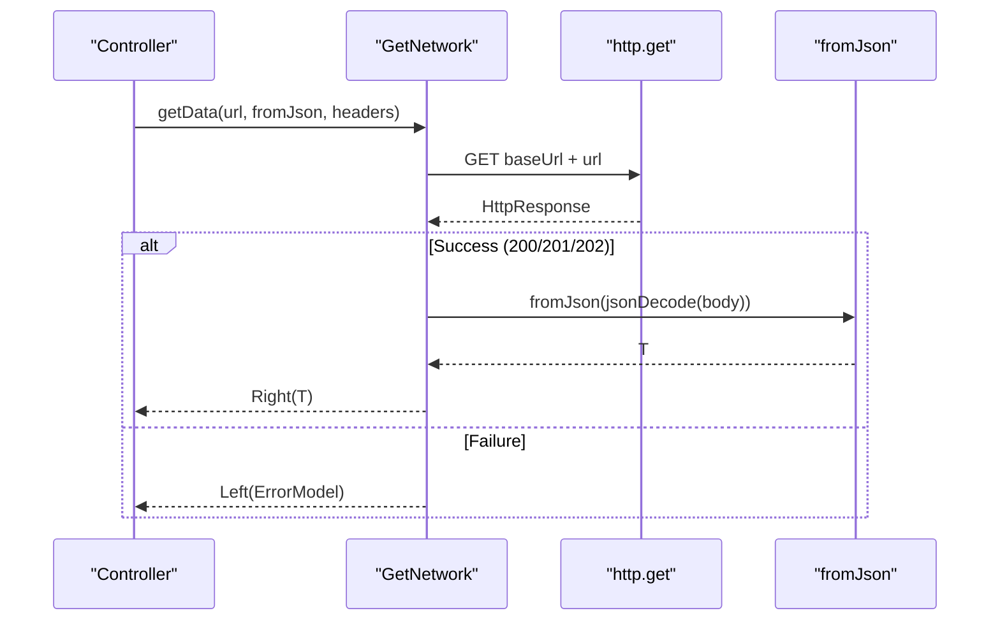
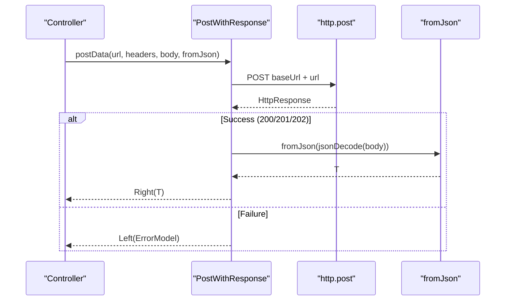
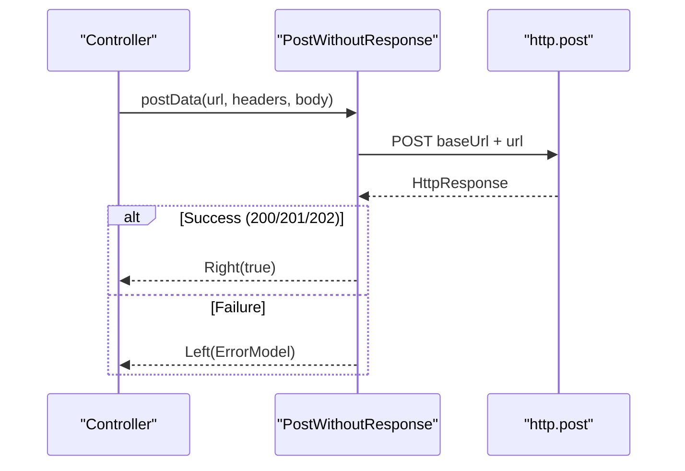
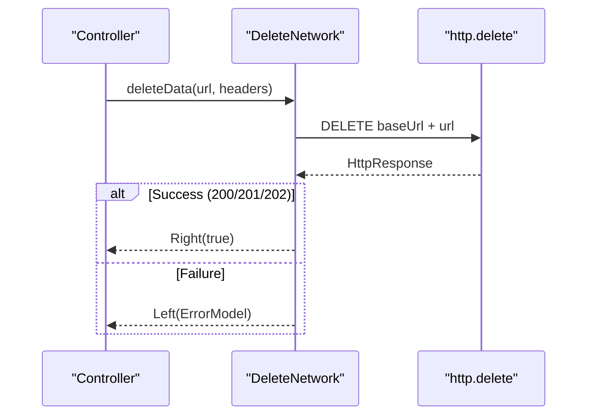
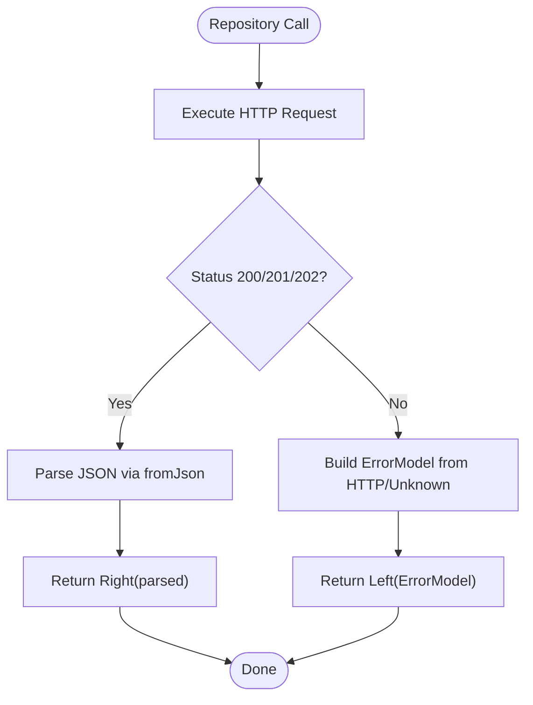
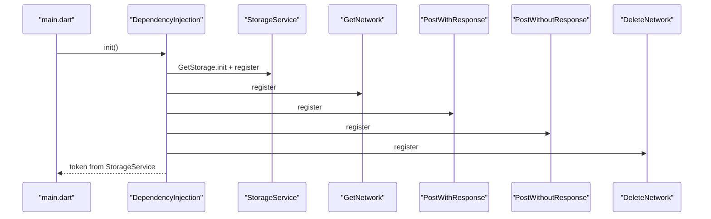
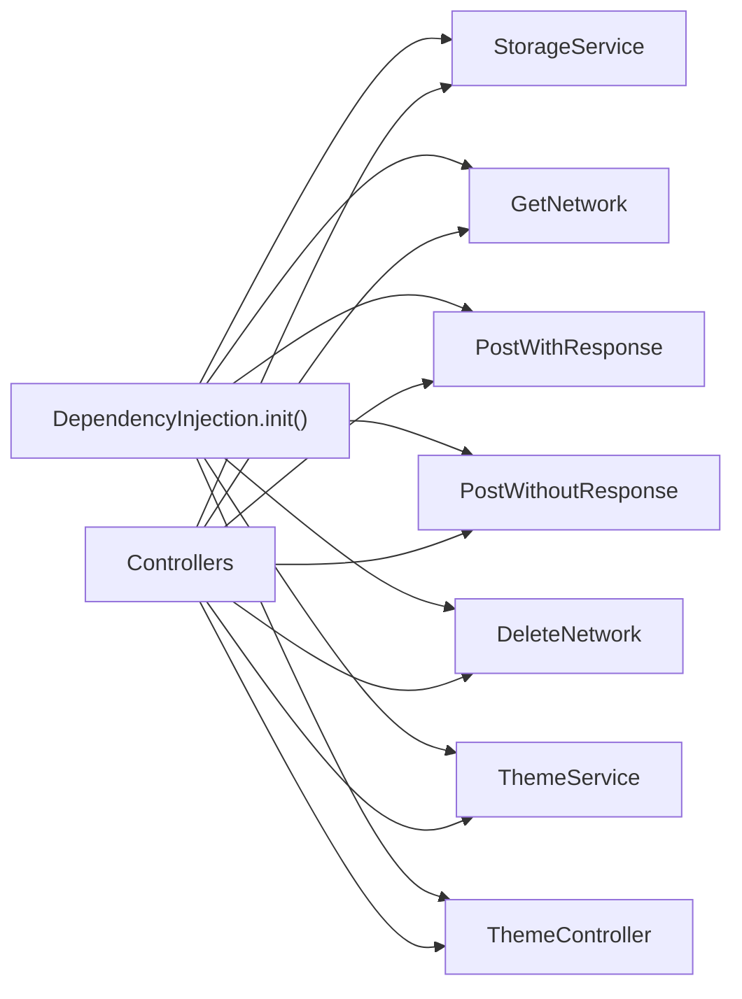

# Repository Pattern Implementation

<cite>
**Referenced Files in This Document**
- [main.dart](file://lib/main.dart)
- [dependency_injection.dart](file://lib/core/di/dependency_injection.dart)
- [get_network.dart](file://lib/core/data/networks/get_network.dart)
- [post_with_response.dart](file://lib/core/data/networks/post_with_response.dart)
- [post_without_response.dart](file://lib/core/data/networks/post_without_response.dart)
- [delete_network.dart](file://lib/core/data/networks/delete_network.dart)
- [networks_path.dart](file://lib/core/constant/networks_path.dart)
- [error_model.dart](file://lib/core/data/global_models/error_model.dart)
- [storage_service.dart](file://lib/core/data/local/storage_service.dart)
- [theme_service.dart](file://lib/core/data/local/theme_service.dart)
- [theme_controller.dart](file://lib/core/theme/theme_controller.dart)
</cite>

## Table of Contents
1. [Introduction](#introduction)
2. [Project Structure](#project-structure)
3. [Core Components](#core-components)
4. [Architecture Overview](#architecture-overview)
5. [Detailed Component Analysis](#detailed-component-analysis)
6. [Dependency Analysis](#dependency-analysis)
7. [Performance Considerations](#performance-considerations)
8. [Troubleshooting Guide](#troubleshooting-guide)
9. [Conclusion](#conclusion)

## Introduction
This document explains the repository pattern implementation in ZB-DEZINE, focusing on how the BaseRepository concept is represented through shared networking services and how the NetworkRepository extends base functionality with network-specific operations. It covers method signatures, parameter handling, return value patterns, error propagation, data transformation, and integration with the dependency injection system. It also outlines best practices for implementing custom repositories, handling asynchronous operations, and maintaining clean interfaces between controllers and data sources.

## Project Structure
The repository pattern in this project is implemented via cohesive network service classes that encapsulate HTTP operations and data transformation. These services are registered in the dependency injection container and consumed by controllers and features.

**Diagram sources**
- [main.dart:12-19](file://lib/main.dart#L12-L19)
- [dependency_injection.dart:11-26](file://lib/core/di/dependency_injection.dart#L11-L26)
- [get_network.dart:8-40](file://lib/core/data/networks/get_network.dart#L8-L40)
- [post_with_response.dart:7-44](file://lib/core/data/networks/post_with_response.dart#L7-L44)
- [post_without_response.dart:9-46](file://lib/core/data/networks/post_without_response.dart#L9-L46)
- [delete_network.dart:8-40](file://lib/core/data/networks/delete_network.dart#L8-L40)
- [networks_path.dart:1-3](file://lib/core/constant/networks_path.dart#L1-L3)
- [storage_service.dart:3-22](file://lib/core/data/local/storage_service.dart#L3-L22)
- [theme_service.dart:3-15](file://lib/core/data/local/theme_service.dart#L3-L15)
- [theme_controller.dart:5-22](file://lib/core/theme/theme_controller.dart#L5-L22)

**Section sources**
- [main.dart:12-19](file://lib/main.dart#L12-L19)
- [dependency_injection.dart:11-26](file://lib/core/di/dependency_injection.dart#L11-L26)

## Core Components
- Base Networking Layer: Encapsulated in dedicated classes that handle HTTP requests and transform JSON responses into typed domain models. They consistently return Either<ErrorModel, T> to unify success and failure handling.
- Network Operations: Separate services for GET, POST with response, POST without response, and DELETE, each tailored to specific HTTP semantics.
- Error Model: A unified ErrorModel type with factories for HTTP-derived and unknown errors.
- Local Persistence: StorageService for token and arbitrary key-value storage.
- Theme Management: ThemeService and ThemeController for theme persistence and reactive UI updates.
- Dependency Injection: Centralized registration of all services via GetX’s container.

Key patterns:
- Asynchronous operations with Future.
- Parameterized generics for data transformation.
- Consistent return types for error handling.
- Reactive UI integration via GetX.

**Section sources**
- [get_network.dart:8-40](file://lib/core/data/networks/get_network.dart#L8-L40)
- [post_with_response.dart:7-44](file://lib/core/data/networks/post_with_response.dart#L7-L44)
- [post_without_response.dart:9-46](file://lib/core/data/networks/post_without_response.dart#L9-L46)
- [delete_network.dart:8-40](file://lib/core/data/networks/delete_network.dart#L8-L40)
- [error_model.dart:1-15](file://lib/core/data/global_models/error_model.dart#L1-L15)
- [storage_service.dart:3-22](file://lib/core/data/local/storage_service.dart#L3-L22)
- [theme_service.dart:3-15](file://lib/core/data/local/theme_service.dart#L3-L15)
- [theme_controller.dart:5-22](file://lib/core/theme/theme_controller.dart#L5-L22)

## Architecture Overview
The repository abstraction is implemented as a set of network service classes that act as repositories for remote data. Controllers depend on these services rather than raw HTTP clients, ensuring separation of concerns and testability.

**Diagram sources**
- [get_network.dart:10-20](file://lib/core/data/networks/get_network.dart#L10-L20)
- [post_with_response.dart:9-24](file://lib/core/data/networks/post_with_response.dart#L9-L24)
- [post_without_response.dart:12-27](file://lib/core/data/networks/post_without_response.dart#L12-L27)
- [delete_network.dart:10-22](file://lib/core/data/networks/delete_network.dart#L10-L22)
- [error_model.dart:1-15](file://lib/core/data/global_models/error_model.dart#L1-L15)
- [networks_path.dart:1-3](file://lib/core/constant/networks_path.dart#L1-L3)

## Detailed Component Analysis

### BaseRepository Concept
While there is no explicit BaseRepository class, the BaseRepository concept is embodied by the shared networking services:
- Uniform method signatures with required parameters and generic return types.
- Consistent error handling via Either<ErrorModel, T>.
- Centralized base URL management.
- Shared data transformation via fromJson callbacks.

Benefits realized:
- Testability: Controllers depend on interfaces/services, not concrete HTTP clients.
- Maintainability: Changes to HTTP client or base URL are localized.
- Separation of concerns: Controllers orchestrate, repositories handle transport and parsing.

**Section sources**
- [get_network.dart:8-40](file://lib/core/data/networks/get_network.dart#L8-L40)
- [post_with_response.dart:7-44](file://lib/core/data/networks/post_with_response.dart#L7-L44)
- [post_without_response.dart:9-46](file://lib/core/data/networks/post_without_response.dart#L9-L46)
- [delete_network.dart:8-40](file://lib/core/data/networks/delete_network.dart#L8-L40)
- [networks_path.dart:1-3](file://lib/core/constant/networks_path.dart#L1-L3)

### NetworkRepository: GET
- Purpose: Fetch typed data from a given endpoint.
- Method signature: getData<T>({required url, required fromJson, headers}).
- Parameters:
  - url: Relative path appended to base URL.
  - fromJson: Factory-like function to parse JSON into a typed model.
  - headers: Optional HTTP headers.
- Return: Future<Either<ErrorModel, T>>.
- Behavior:
  - Validates HTTP success codes.
  - Transforms successful responses via fromJson.
  - Wraps errors into ErrorModel on HTTP failures or exceptions.

**Diagram sources**
- [get_network.dart:10-20](file://lib/core/data/networks/get_network.dart#L10-L20)
- [error_model.dart:1-15](file://lib/core/data/global_models/error_model.dart#L1-L15)

**Section sources**
- [get_network.dart:8-40](file://lib/core/data/networks/get_network.dart#L8-L40)

### NetworkRepository: POST with Response
- Purpose: Send structured data and receive a typed response.
- Method signature: postData<T>({url, headers, body, fromJson}).
- Parameters:
  - url: Relative path appended to base URL.
  - headers: Required HTTP headers.
  - body: Request payload (serialized appropriately).
  - fromJson: Parses response into typed model.
- Return: Future<Either<ErrorModel, T>>.
- Behavior:
  - Validates HTTP success codes.
  - Transforms response via fromJson.
  - Converts HTTP errors into ErrorModel.

**Diagram sources**
- [post_with_response.dart:9-24](file://lib/core/data/networks/post_with_response.dart#L9-L24)
- [error_model.dart:1-15](file://lib/core/data/global_models/error_model.dart#L1-L15)

**Section sources**
- [post_with_response.dart:7-44](file://lib/core/data/networks/post_with_response.dart#L7-L44)

### NetworkRepository: POST without Response
- Purpose: Send data and return a boolean success indicator.
- Method signature: postData({url, headers?, body}).
- Parameters:
  - url: Relative path appended to base URL.
  - headers: Optional HTTP headers.
  - body: Request payload.
- Return: Future<Either<ErrorModel, bool>>.
- Behavior:
  - Validates HTTP success codes.
  - Returns Right(true) on success.
  - Wraps HTTP or exception errors into ErrorModel.

**Diagram sources**
- [post_without_response.dart:12-27](file://lib/core/data/networks/post_without_response.dart#L12-L27)
- [error_model.dart:1-15](file://lib/core/data/global_models/error_model.dart#L1-L15)

**Section sources**
- [post_without_response.dart:9-46](file://lib/core/data/networks/post_without_response.dart#L9-L46)

### NetworkRepository: DELETE
- Purpose: Remove a resource and return a boolean success indicator.
- Method signature: deleteData({url, headers?}).
- Parameters:
  - url: Relative path appended to base URL.
  - headers: Optional HTTP headers.
- Return: Future<Either<ErrorModel, bool>>.
- Behavior:
  - Validates HTTP success codes.
  - Returns Right(true) on success.
  - Wraps HTTP or exception errors into ErrorModel.

**Diagram sources**
- [delete_network.dart:10-22](file://lib/core/data/networks/delete_network.dart#L10-L22)
- [error_model.dart:1-15](file://lib/core/data/global_models/error_model.dart#L1-L15)

**Section sources**
- [delete_network.dart:8-40](file://lib/core/data/networks/delete_network.dart#L8-L40)

### Error Propagation and Data Transformation
- ErrorModel encapsulates HTTP status codes and messages, with factories for HTTP-derived and unknown errors.
- Repositories consistently return Either<ErrorModel, T>, enabling controllers to branch on success or failure without scattered try/catch blocks.
- Data transformation is delegated to fromJson functions, ensuring repositories remain transport-focused while models remain pure.

**Diagram sources**
- [get_network.dart:14-38](file://lib/core/data/networks/get_network.dart#L14-L38)
- [post_with_response.dart:14-42](file://lib/core/data/networks/post_with_response.dart#L14-L42)
- [post_without_response.dart:16-44](file://lib/core/data/networks/post_without_response.dart#L16-L44)
- [delete_network.dart:13-37](file://lib/core/data/networks/delete_network.dart#L13-L37)
- [error_model.dart:5-13](file://lib/core/data/global_models/error_model.dart#L5-L13)

**Section sources**
- [error_model.dart:1-15](file://lib/core/data/global_models/error_model.dart#L1-L15)

### Dependency Injection Integration
- All network services and local services are registered in the DI container during application startup.
- Controllers resolve dependencies via Get.find<Service>().
- Token retrieval and routing decisions are bootstrapped from StorageService.

**Diagram sources**
- [main.dart:12-19](file://lib/main.dart#L12-L19)
- [dependency_injection.dart:11-26](file://lib/core/di/dependency_injection.dart#L11-L26)
- [storage_service.dart:7-21](file://lib/core/data/local/storage_service.dart#L7-L21)

**Section sources**
- [main.dart:12-19](file://lib/main.dart#L12-L19)
- [dependency_injection.dart:11-26](file://lib/core/di/dependency_injection.dart#L11-L26)

### Implementing Custom Repositories
Guidelines derived from existing services:
- Define a class with a base URL field and methods returning Future<Either<ErrorModel, T>>.
- Accept a fromJson function for response parsing.
- Validate HTTP status codes and wrap failures into ErrorModel.
- Keep methods parameterized for flexibility (e.g., headers, body).
- Register the new service in the DI container for controller access.

Example patterns to follow:
- GET-style fetch with typed response parsing.
- POST-style with optional response parsing.
- Boolean-result operations for mutations.

**Section sources**
- [get_network.dart:8-40](file://lib/core/data/networks/get_network.dart#L8-L40)
- [post_with_response.dart:7-44](file://lib/core/data/networks/post_with_response.dart#L7-L44)
- [post_without_response.dart:9-46](file://lib/core/data/networks/post_without_response.dart#L9-L46)
- [delete_network.dart:8-40](file://lib/core/data/networks/delete_network.dart#L8-L40)

### Caching Strategies Within Repositories
Current implementation does not include repository-level caching. Recommended approaches:
- Add an in-memory cache keyed by URL and headers to reduce redundant network calls.
- Introduce cache invalidation on mutation operations (POST/DELETE).
- Consider TTL-based cache entries to balance freshness and performance.
- Wrap cache logic inside repository methods to keep controllers agnostic.

[No sources needed since this section provides general guidance]

## Dependency Analysis
The DI container registers all services used by controllers, including network services and local persistence. This creates a clean dependency graph where controllers depend on abstractions (services) rather than concrete implementations.

**Diagram sources**
- [dependency_injection.dart:11-26](file://lib/core/di/dependency_injection.dart#L11-L26)

**Section sources**
- [dependency_injection.dart:11-26](file://lib/core/di/dependency_injection.dart#L11-L26)

## Performance Considerations
- Prefer GET with minimal headers to leverage potential HTTP-level caching at CDN/proxy layers.
- Batch related operations to reduce round trips when feasible.
- Avoid unnecessary JSON parsing by reusing parsed models and minimizing deep copies.
- Consider adding retry/backoff for transient failures in higher-level orchestrators.

[No sources needed since this section provides general guidance]

## Troubleshooting Guide
Common issues and resolutions:
- Unknown error propagation: ErrorModel.fromUnknown() is used when HTTP parsing fails; ensure server responses are valid JSON.
- HTTP error mapping: ErrorModel.fromHttp() constructs errors from status codes and message fields; verify backend returns a message field.
- Token retrieval: If token is empty, routing defaults to onboarding; confirm StorageService keys and initialization order.
- Headers mismatch: Ensure required headers are passed consistently across repositories.

**Section sources**
- [error_model.dart:5-13](file://lib/core/data/global_models/error_model.dart#L5-L13)
- [get_network.dart:25-35](file://lib/core/data/networks/get_network.dart#L25-L35)
- [post_with_response.dart:29-39](file://lib/core/data/networks/post_with_response.dart#L29-L39)
- [post_without_response.dart:31-41](file://lib/core/data/networks/post_without_response.dart#L31-L41)
- [delete_network.dart:25-35](file://lib/core/data/networks/delete_network.dart#L25-L35)
- [main.dart:14-18](file://lib/main.dart#L14-L18)
- [storage_service.dart:7-9](file://lib/core/data/local/storage_service.dart#L7-L9)

## Conclusion
ZB-DEZINE implements a repository-like abstraction through dedicated network service classes that encapsulate HTTP operations, error handling, and data transformation. This design yields testable, maintainable, and decoupled controllers, with centralized dependency injection and consistent asynchronous patterns. Extending the pattern involves adding new services with uniform signatures and registering them in the DI container, while future enhancements can introduce caching and retry strategies at the repository level.