# Dependency Injection System

<cite>
**Referenced Files in This Document**
- [main.dart](file://lib/main.dart)
- [dependency_injection.dart](file://lib/core/di/dependency_injection.dart)
- [onboard_bindings.dart](file://lib/features/auth/bindings/onboard_bindings.dart)
- [home_bindings.dart](file://lib/features/home/bindings/home_bindings.dart)
- [dashboard_bindings.dart](file://lib/features/dashboard/bindings/dashboard_bindings.dart)
- [profile_bindings.dart](file://lib/features/profile/bindings/profile_bindings.dart)
- [custom_drawer_controller.dart](file://lib/shared/widgets/custom_drawer/custom_drawer_controller.dart)
- [custom_drawer.dart](file://lib/shared/widgets/custom_drawer/custom_drawer.dart)
- [bottom_nav_view.dart](file://lib/features/home/views/bottom_nav_view.dart)
- [profile_view_items.dart](file://lib/features/profile/widgets/profile_view_widgets/profile_view_items.dart)
- [storage_service.dart](file://lib/core/data/local/storage_service.dart)
- [theme_service.dart](file://lib/core/data/local/theme_service.dart)
- [theme_controller.dart](file://lib/core/theme/theme_controller.dart)
- [get_network.dart](file://lib/core/data/networks/get_network.dart)
- [post_with_response.dart](file://lib/core/data/networks/post_with_response.dart)
- [post_without_response.dart](file://lib/core/data/networks/post_without_response.dart)
- [delete_network.dart](file://lib/core/data/networks/delete_network.dart)
- [headers_manager.dart](file://lib/core/data/networks/headers_manager.dart)
- [networks_path.dart](file://lib/core/constant/networks_path.dart)
- [error_model.dart](file://lib/core/data/global_models/error_model.dart)
- [google_user_info_model.dart](file://lib/core/data/global_models/google_user_info_model.dart)
- [google_login_model.dart](file://lib/features/auth/models/google_login_model.dart)
- [google_login_controller.dart](file://lib/features/auth/controller/google_login_controller.dart)
- [google_login_repo.dart](file://lib/features/auth/repositories/google_login_repo.dart)
- [firebase_google_auth.dart](file://lib/core/services/firebase_google_auth.dart)
- [onboarding_controller.dart](file://lib/features/auth/controller/onboarding_controller.dart)
- [routes.dart](file://lib/core/routes/routes.dart)
- [app_routes.dart](file://lib/core/routes/app_routes.dart)
</cite>

## Update Summary
**Changes Made**
- Added CustomDrawerController instances in HomeBindings and ProfileBindings for enhanced navigation management and drawer functionality
- Updated dependency injection architecture to include custom drawer navigation system
- Documented CustomDrawerController lifecycle management and integration patterns
- Enhanced navigation management with reactive drawer item selection and page routing

## Table of Contents
1. [Introduction](#introduction)
2. [Project Structure](#project-structure)
3. [Core Components](#core-components)
4. [Architecture Overview](#architecture-overview)
5. [Detailed Component Analysis](#detailed-component-analysis)
6. [Dependency Analysis](#dependency-analysis)
7. [Performance Considerations](#performance-considerations)
8. [Troubleshooting Guide](#troubleshooting-guide)
9. [Conclusion](#conclusion)
10. [Appendices](#appendices)

## Introduction
This document explains the ZB-DEZINE dependency injection (DI) system built on GetX, now enhanced with comprehensive Google authentication capabilities and a custom drawer navigation system. It covers the initialization process, service registration patterns, singleton lifecycle management, and how services are resolved and used across the application. The focus is on:
- How GetStorage is initialized and how services are bound as singletons
- The role of each registered service: StorageService, ThemeService, ThemeController, network services, Google authentication components, and CustomDrawerController
- Dependency resolution via GetX's container and how consumers access services
- Practical patterns for injecting and using services, including Google authentication flows and custom drawer navigation
- Best practices for extending the DI container with new authentication services and navigation components

## Project Structure
The DI system is centralized in a dedicated module under lib/core/di and integrates with core services located under lib/core/data, lib/core/theme, new authentication components under lib/features/auth, and custom navigation components under lib/shared/widgets/custom_drawer. The application bootstraps by initializing the DI container before runApp, with enhanced support for Google authentication flows and custom drawer navigation.

```mermaid
graph TB
A["lib/main.dart<br/>Entry Point"] --> B["lib/core/di/dependency_injection.dart<br/>DependencyInjection.init()"]
B --> C["lib/core/data/local/storage_service.dart<br/>StorageService"]
B --> D["lib/core/data/local/theme_service.dart<br/>ThemeService"]
B --> E["lib/core/theme/theme_controller.dart<br/>ThemeController"]
B --> F["lib/core/data/networks/get_network.dart<br/>GetNetwork"]
B --> G["lib/core/data/networks/post_with_response.dart<br/>PostWithResponse"]
B --> H["lib/core/data/networks/post_without_response.dart<br/>PostWithoutResponse"]
B --> I["lib/core/data/networks/delete_network.dart<br/>DeleteNetwork"]
A --> J["lib/features/auth/bindings/onboard_bindings.dart<br/>OnboardBindings"]
J --> K["lib/features/auth/controller/google_login_controller.dart<br/>GoogleLoginController"]
J --> L["lib/features/auth/repositories/google_login_repo.dart<br/>GoogleLoginRepository"]
J --> M["lib/features/auth/controller/onboarding_controller.dart<br/>OnboardingController"]
N["lib/core/services/firebase_google_auth.dart<br/>FirebaseGoogleAuthService"] -.-> K
O["lib/core/data/global_models/google_user_info_model.dart<br/>GoogleUserInfoModel"] -.-> K
P["lib/features/auth/models/google_login_model.dart<br/>GoogleLoginModel"] -.-> L
Q["lib/shared/widgets/custom_drawer/custom_drawer_controller.dart<br/>CustomDrawerController"] -.-> R["lib/shared/widgets/custom_drawer/custom_drawer.dart<br/>CustomDrawer"]
S["lib/features/home/bindings/home_bindings.dart<br/>HomeBindings"] --> Q
T["lib/features/profile/bindings/profile_bindings.dart<br/>ProfileBindings"] --> Q
U["lib/features/dashboard/bindings/dashboard_bindings.dart<br/>DashboardBindings"] --> Q
V["lib/features/home/views/bottom_nav_view.dart<br/>BottomNavView"] --> Q
W["lib/features/profile/widgets/profile_view_widgets/profile_view_items.dart<br/>ProfileViewItems"] --> Q
```

**Diagram sources**
- [main.dart:12-19](file://lib/main.dart#L12-L19)
- [dependency_injection.dart:13-31](file://lib/core/di/dependency_injection.dart#L13-L31)
- [onboard_bindings.dart:6-13](file://lib/features/auth/bindings/onboard_bindings.dart#L6-L13)
- [home_bindings.dart:34](file://lib/features/home/bindings/home_bindings.dart#L34)
- [profile_bindings.dart:17](file://lib/features/profile/bindings/profile_bindings.dart#L17)
- [dashboard_bindings.dart:11](file://lib/features/dashboard/bindings/dashboard_bindings.dart#L11)
- [custom_drawer_controller.dart:5-59](file://lib/shared/widgets/custom_drawer/custom_drawer_controller.dart#L5-L59)

**Section sources**
- [main.dart:12-19](file://lib/main.dart#L12-L19)
- [dependency_injection.dart:13-31](file://lib/core/di/dependency_injection.dart#L13-L31)
- [onboard_bindings.dart:6-13](file://lib/features/auth/bindings/onboard_bindings.dart#L6-L13)
- [home_bindings.dart:34](file://lib/features/home/bindings/home_bindings.dart#L34)
- [profile_bindings.dart:17](file://lib/features/profile/bindings/profile_bindings.dart#L17)
- [dashboard_bindings.dart:11](file://lib/features/dashboard/bindings/dashboard_bindings.dart#L11)

## Core Components
This section documents each service registered in the DI container, including responsibilities, lifecycle, and usage patterns, with enhanced coverage of Google authentication components and the new CustomDrawerController for navigation management.

### Core Services
- **StorageService**
  - Purpose: Provides persistent key-value storage using GetStorage. Exposes typed read/write/remove/clear operations.
  - Lifecycle: Singleton bound with permanent=true during DI initialization.
  - Access pattern: Consumers resolve via Get.find<StorageService>() and use keys such as tokenKey.
  - Example usage patterns:
    - Read a token: Get.find<StorageService>().read(key: Get.find<StorageService>().tokenKey)
    - Write a token: Get.find<StorageService>().write(key: "token", value: token)
    - Clear storage: Get.find<StorageService>().clear()

- **ThemeService**
  - Purpose: Manages theme preference persistence using GetStorage with a themeKey.
  - Lifecycle: Singleton bound with permanent=true during DI initialization.
  - Access pattern: Consumers resolve via Get.find<ThemeService>() and call saveThemeToStorage and getIsDark.

- **ThemeController**
  - Purpose: Reactive controller that observes theme state and persists changes via ThemeService.
  - Lifecycle: Singleton bound with permanent=true during DI initialization.
  - Dependency resolution: Resolves ThemeService in onInit and exposes currentTheme for GetMaterialApp.
  - Access pattern: Consumers observe isDarkMode or call changeTheme to toggle.

- **Network Services**
  - **GetNetwork**
    - Purpose: Generic GET requests returning Either<ErrorModel, T>.
    - Access pattern: Resolve via Get.find<GetNetwork>().getData(...) with a fromJson parser.
  - **PostWithResponse**
    - Purpose: POST requests returning Either<ErrorModel, T>.
    - Access pattern: Resolve via Get.find<PostWithResponse>().postData(...) with headers and body.
  - **PostWithoutResponse**
    - Purpose: POST requests returning Either<ErrorModel, bool> for success/failure.
    - Access pattern: Resolve via Get.find<PostWithoutResponse>().postData(...).
  - **DeleteNetwork**
    - Purpose: DELETE requests returning Either<ErrorModel, bool>.
    - Access pattern: Resolve via Get.find<DeleteNetwork>().deleteData(...).

- **HeadersManager**
  - Purpose: Builds HTTP headers for authenticated requests using the token stored in StorageService.
  - Access pattern: Static method getHeaders with optional flags for content-type and accept.

### Authentication Services
- **FirebaseGoogleAuthService**
  - Purpose: Provides Google authentication integration using Firebase and Google Sign-In SDKs.
  - Features: Handles Google sign-in, token exchange, user credential management, and sign-out operations.
  - Access pattern: Static methods for authentication operations, singleton instance via factory pattern.
  - Key methods: signInWithGoogle(), signOut(), internal FirebaseAuth and GoogleSignIn instances.

- **GoogleLoginController**
  - Purpose: Manages Google login flow, handles loading states, processes authentication responses, and manages navigation.
  - Dependencies: GoogleLoginRepository, StorageService, AppRoutes.
  - Lifecycle: Transient controller managed by GetX with reactive isLoading state.
  - Access pattern: Called from UI widgets to initiate Google login flow.

- **GoogleLoginRepository**
  - Purpose: Handles backend communication for Google login, processes user data, and manages authentication tokens.
  - Dependencies: PostWithResponse network service.
  - Access pattern: Execute method performs HTTP POST with user credentials and Google ID token.

- **OnboardingController**
  - Purpose: Manages onboarding flow and initial application state.
  - Lifecycle: Transient controller for handling initial app setup.

### Custom Drawer Navigation System
- **CustomDrawerController**
  - Purpose: Manages custom drawer navigation state with reactive item selection and navigation routes.
  - Lifecycle: Singleton controller bound via Get.lazyPut in feature-specific bindings.
  - State Management: Maintains selectedItem observable and drawerItem list with navigation configuration.
  - Integration: Used by CustomDrawer widget and various view components for consistent navigation experience.
  - Access pattern: Resolved via Get.find<CustomDrawerController>() in bottom navigation and profile views.

- **CustomDrawer**
  - Purpose: Custom drawer widget that displays navigation items with reactive styling based on selection state.
  - Dependencies: CustomDrawerController for state management and navigation routing.
  - Features: Dynamic item rendering, gradient highlighting for selected items, responsive design with ScreenUtil.
  - Integration: Used in bottom navigation and profile views for unified navigation experience.

**Section sources**
- [dependency_injection.dart:19-25](file://lib/core/di/dependency_injection.dart#L19-L25)
- [storage_service.dart:3-22](file://lib/core/data/local/storage_service.dart#L3-L22)
- [theme_service.dart:3-15](file://lib/core/data/local/theme_service.dart#L3-L15)
- [theme_controller.dart:5-22](file://lib/core/theme/theme_controller.dart#L5-L22)
- [get_network.dart:8-38](file://lib/core/data/networks/get_network.dart#L8-L38)
- [post_with_response.dart:7-44](file://lib/core/data/networks/post_with_response.dart#L7-L44)
- [post_without_response.dart:9-46](file://lib/core/data/networks/post_without_response.dart#L9-L46)
- [delete_network.dart:8-40](file://lib/core/data/networks/delete_network.dart#L8-L40)
- [headers_manager.dart:4-22](file://lib/core/data/networks/headers_manager.dart#L4-L22)
- [firebase_google_auth.dart:6-69](file://lib/core/services/firebase_google_auth.dart#L6-L69)
- [google_login_controller.dart:9-38](file://lib/features/auth/controller/google_login_controller.dart#L9-L38)
- [google_login_repo.dart:8-30](file://lib/features/auth/repositories/google_login_repo.dart#L8-L30)
- [onboarding_controller.dart:1-200](file://lib/features/auth/controller/onboarding_controller.dart#L1-L200)
- [custom_drawer_controller.dart:5-59](file://lib/shared/widgets/custom_drawer/custom_drawer_controller.dart#L5-L59)
- [custom_drawer.dart:8-129](file://lib/shared/widgets/custom_drawer/custom_drawer.dart#L8-L129)

## Architecture Overview
The DI architecture follows a comprehensive pattern that now includes Google authentication services and a custom drawer navigation system:
- **Initialization**: Firebase is initialized, GetStorage is configured, then all core services are bound as singletons with permanent=true.
- **Authentication Flow**: Google authentication services are integrated through dedicated controllers and repositories.
- **Navigation System**: Custom drawer navigation is managed through CustomDrawerController instances bound in feature-specific bindings.
- **Resolution**: Consumers retrieve services using Get.find<ServiceType>() with lazy loading support for feature-specific bindings.
- **Routing**: The app chooses initial route and bindings based on whether a token exists (resolved from StorageService).

```mermaid
sequenceDiagram
participant Main as "main.dart"
participant DI as "DependencyInjection"
participant FB as "Firebase"
participant GS as "GetStorage"
participant SS as "StorageService"
participant TS as "ThemeService"
participant TC as "ThemeController"
participant GN as "GetNetwork"
participant GLC as "GoogleLoginController"
participant GLR as "GoogleLoginRepository"
participant CDC as "CustomDrawerController"
Main->>DI : init()
DI->>FB : initializeApp()
DI->>GS : init()
DI->>SS : new StorageService() permanent : true
DI->>TS : new ThemeService() permanent : true
DI->>TC : new ThemeController() permanent : true
DI->>GN : new GetNetwork() permanent : true
DI-->>Main : return token from StorageService
Main->>Main : runApp(MyApp(token))
Note over GLC,GLR,CDC : Lazy loaded on demand
GLC->>GLR : execute(user)
GLR->>GN : postData()
GN-->>GLR : response
GLR-->>GLC : Either<ErrorModel, GoogleLoginModel>
CDC->>CDC : Manage drawer navigation state
```

**Diagram sources**
- [main.dart:12-19](file://lib/main.dart#L12-L19)
- [dependency_injection.dart:14-30](file://lib/core/di/dependency_injection.dart#L14-L30)
- [firebase_google_auth.dart:15-58](file://lib/core/services/firebase_google_auth.dart#L15-L58)
- [google_login_controller.dart:15-37](file://lib/features/auth/controller/google_login_controller.dart#L15-L37)
- [google_login_repo.dart:12-29](file://lib/features/auth/repositories/google_login_repo.dart#L12-L29)
- [custom_drawer_controller.dart:5-59](file://lib/shared/widgets/custom_drawer/custom_drawer_controller.dart#L5-L59)

**Section sources**
- [main.dart:12-19](file://lib/main.dart#L12-L19)
- [dependency_injection.dart:14-30](file://lib/core/di/dependency_injection.dart#L14-L30)

## Detailed Component Analysis

### StorageService
- Responsibilities: Encapsulates GetStorage operations with a typed API and a tokenKey constant.
- Lifecycle: Singleton via permanent binding.
- Usage: Used by DependencyInjection to read the token and by HeadersManager to construct Authorization headers.

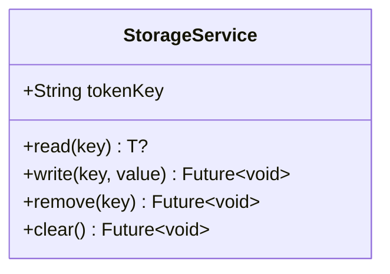

**Diagram sources**
- [storage_service.dart:3-22](file://lib/core/data/local/storage_service.dart#L3-L22)

**Section sources**
- [storage_service.dart:3-22](file://lib/core/data/local/storage_service.dart#L3-L22)
- [dependency_injection.dart:19](file://lib/core/di/dependency_injection.dart#L19)
- [headers_manager.dart:19](file://lib/core/data/networks/headers_manager.dart#L19)

### ThemeService and ThemeController
- ThemeService: Persists theme state using GetStorage with a themeKey.
- ThemeController: Reactive controller that reads initial theme from ThemeService and updates persistence on change.
- Integration: ThemeController depends on ThemeService; both are singletons.

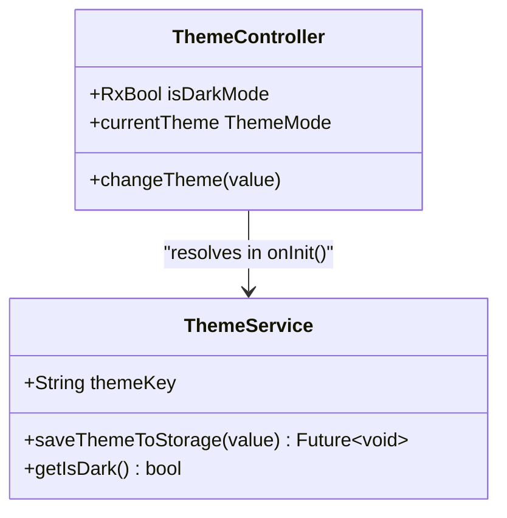

**Diagram sources**
- [theme_service.dart:3-15](file://lib/core/data/local/theme_service.dart#L3-L15)
- [theme_controller.dart:5-22](file://lib/core/theme/theme_controller.dart#L5-L22)

**Section sources**
- [theme_service.dart:3-15](file://lib/core/data/local/theme_service.dart#L3-L15)
- [theme_controller.dart:5-22](file://lib/core/theme/theme_controller.dart#L5-L22)
- [dependency_injection.dart:20-21](file://lib/core/di/dependency_injection.dart#L20-L21)

### Network Services
- GetNetwork: Performs GET requests and returns Either<ErrorModel, T>.
- PostWithResponse: Performs POST with JSON body and returns Either<ErrorModel, T>.
- PostWithoutResponse: Performs POST and returns Either<ErrorModel, bool>.
- DeleteNetwork: Performs DELETE and returns Either<ErrorModel, bool>.
- All services share a base URL from NetworkLinks and use ErrorModel for error handling.

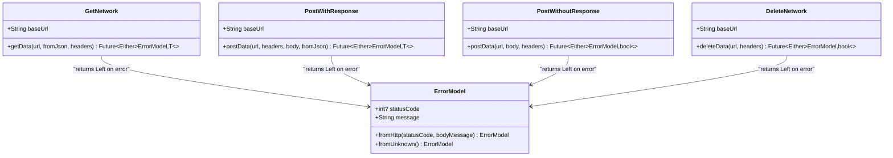

**Diagram sources**
- [get_network.dart:8-38](file://lib/core/data/networks/get_network.dart#L8-L38)
- [post_with_response.dart:7-44](file://lib/core/data/networks/post_with_response.dart#L7-L44)
- [post_without_response.dart:9-46](file://lib/core/data/networks/post_without_response.dart#L9-L46)
- [delete_network.dart:8-40](file://lib/core/data/networks/delete_network.dart#L8-L40)
- [error_model.dart:1-14](file://lib/core/data/global_models/error_model.dart#L1-L14)

**Section sources**
- [get_network.dart:8-38](file://lib/core/data/networks/get_network.dart#L8-L38)
- [post_with_response.dart:7-44](file://lib/core/data/networks/post_with_response.dart#L7-L44)
- [post_without_response.dart:9-46](file://lib/core/data/networks/post_without_response.dart#L9-L46)
- [delete_network.dart:8-40](file://lib/core/data/networks/delete_network.dart#L8-L40)
- [networks_path.dart:1-3](file://lib/core/constant/networks_path.dart#L1-L3)
- [error_model.dart:1-14](file://lib/core/data/global_models/error_model.dart#L1-L14)

### HeadersManager
- Purpose: Constructs HTTP headers including Content-Type, Accept, and Authorization using the token from StorageService.
- Dependency: Resolves StorageService at runtime to fetch the token.

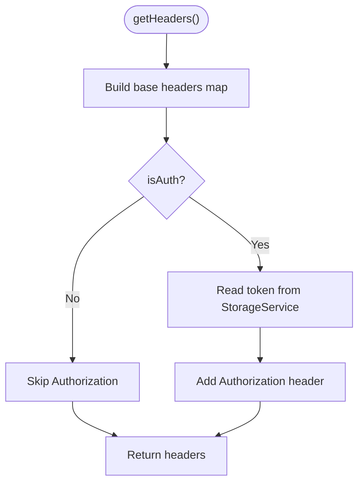

**Diagram sources**
- [headers_manager.dart:9-21](file://lib/core/data/networks/headers_manager.dart#L9-L21)
- [storage_service.dart:5](file://lib/core/data/local/storage_service.dart#L5)

**Section sources**
- [headers_manager.dart:4-22](file://lib/core/data/networks/headers_manager.dart#L4-L22)
- [storage_service.dart:3-22](file://lib/core/data/local/storage_service.dart#L3-L22)

### Google Authentication System
- **FirebaseGoogleAuthService**: Singleton service providing Google authentication capabilities with factory pattern implementation.
- **GoogleLoginController**: Controller managing the complete Google login flow with reactive loading states and error handling.
- **GoogleLoginRepository**: Repository layer handling backend communication and user data processing.
- **OnboardingController**: Controller managing initial application onboarding flow.

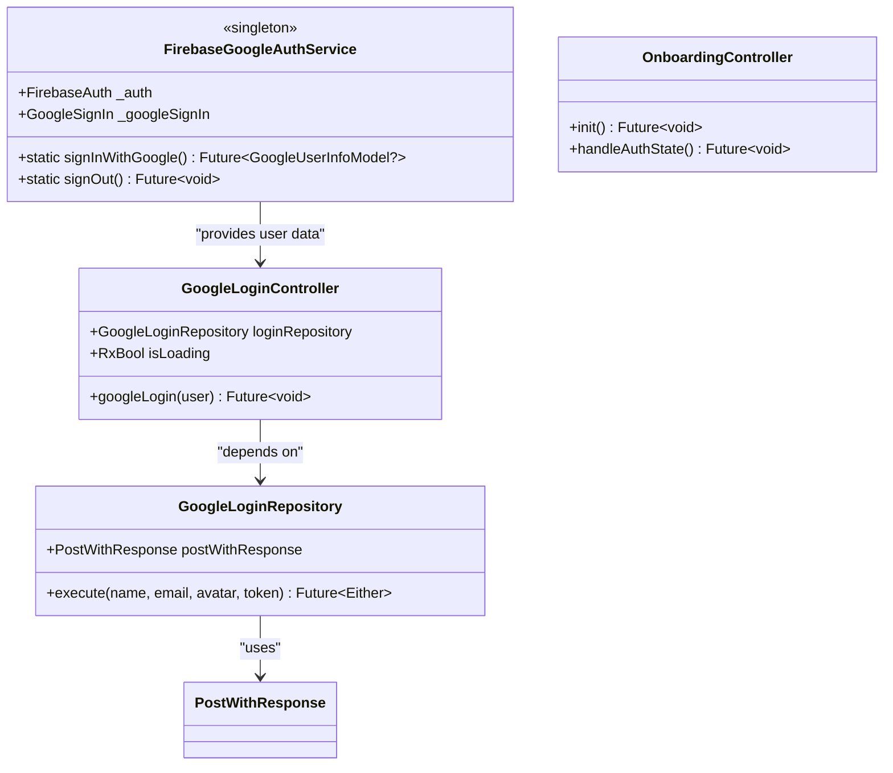

**Diagram sources**
- [firebase_google_auth.dart:6-69](file://lib/core/services/firebase_google_auth.dart#L6-L69)
- [google_login_controller.dart:9-38](file://lib/features/auth/controller/google_login_controller.dart#L9-L38)
- [google_login_repo.dart:8-30](file://lib/features/auth/repositories/google_login_repo.dart#L8-L30)
- [onboarding_controller.dart:1-200](file://lib/features/auth/controller/onboarding_controller.dart#L1-L200)

**Section sources**
- [firebase_google_auth.dart:6-69](file://lib/core/services/firebase_google_auth.dart#L6-L69)
- [google_login_controller.dart:9-38](file://lib/features/auth/controller/google_login_controller.dart#L9-L38)
- [google_login_repo.dart:8-30](file://lib/features/auth/repositories/google_login_repo.dart#L8-L30)
- [onboarding_controller.dart:1-200](file://lib/features/auth/controller/onboarding_controller.dart#L1-L200)

### Custom Drawer Navigation System
- **CustomDrawerController**: Reactive controller that manages drawer navigation state with selectedItem observable and comprehensive drawerItem configuration.
- **CustomDrawer**: Custom widget that renders navigation items with dynamic styling based on selection state and integrates with GetX reactive system.
- **Integration Pattern**: Bound via Get.lazyPut in feature-specific bindings (HomeBindings, ProfileBindings, DashboardBindings) for optimal performance.

```mermaid
classDiagram
class CustomDrawerController {
+RxInt selectedItem
+List drawerItem
+initializeDrawerItems()
+navigateToPage(index)
}
class CustomDrawer {
+CustomDrawerController controller
+build(context) Widget
+renderDrawerItems() List<Widget>
}
CustomDrawer --> CustomDrawerController : "observes state"
CustomDrawerController --> "AppRoutes" : "uses navigation routes"
```

**Diagram sources**
- [custom_drawer_controller.dart:5-59](file://lib/shared/widgets/custom_drawer/custom_drawer_controller.dart#L5-L59)
- [custom_drawer.dart:8-129](file://lib/shared/widgets/custom_drawer/custom_drawer.dart#L8-L129)

**Section sources**
- [custom_drawer_controller.dart:5-59](file://lib/shared/widgets/custom_drawer/custom_drawer_controller.dart#L5-L59)
- [custom_drawer.dart:8-129](file://lib/shared/widgets/custom_drawer/custom_drawer.dart#L8-L129)
- [home_bindings.dart:34](file://lib/features/home/bindings/home_bindings.dart#L34)
- [profile_bindings.dart:17](file://lib/features/profile/bindings/profile_bindings.dart#L17)
- [dashboard_bindings.dart:11](file://lib/features/dashboard/bindings/dashboard_bindings.dart#L11)

### OnboardBindings
- Purpose: Provides lazy loading for authentication-related services using Get.lazyPut pattern.
- Services: GoogleLoginRepository, OnboardingController, GoogleLoginController.
- Integration: Uses Get.find() to resolve dependencies from the main DI container.

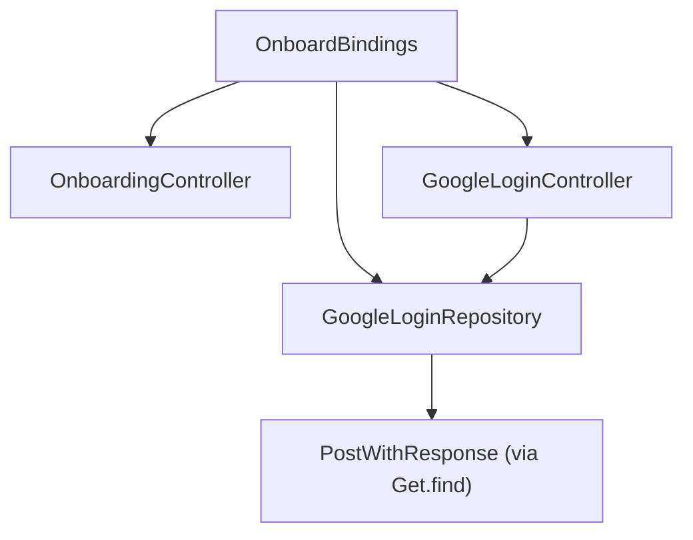

**Diagram sources**
- [onboard_bindings.dart:6-13](file://lib/features/auth/bindings/onboard_bindings.dart#L6-L13)

**Section sources**
- [onboard_bindings.dart:6-13](file://lib/features/auth/bindings/onboard_bindings.dart#L6-L13)

### Enhanced Navigation Management
- **HomeBindings**: Includes CustomDrawerController for home screen navigation with bottom navigation integration.
- **ProfileBindings**: Includes CustomDrawerController for profile screen navigation with route-specific item highlighting.
- **DashboardBindings**: Includes CustomDrawerController for dashboard navigation with payment and reminder features.
- **BottomNavView Integration**: Uses Get.find<CustomDrawerController>().selectedItem.value = 0 to reset drawer selection to dashboard.
- **ProfileViewItems Integration**: Uses Get.find<CustomDrawerController>().selectedItem.value = [index] to highlight specific drawer items based on navigation context.

**Section sources**
- [home_bindings.dart:14-36](file://lib/features/home/bindings/home_bindings.dart#L14-L36)
- [profile_bindings.dart:9-19](file://lib/features/profile/bindings/profile_bindings.dart#L9-L19)
- [dashboard_bindings.dart:7-16](file://lib/features/dashboard/bindings/dashboard_bindings.dart#L7-L16)
- [bottom_nav_view.dart:78-79](file://lib/features/home/views/bottom_nav_view.dart#L78-L79)
- [profile_view_items.dart:28-40](file://lib/features/profile/widgets/profile_view_widgets/profile_view_items.dart#L28-L40)

## Dependency Analysis
This section maps how services depend on each other and how they are resolved at runtime, including the new authentication dependencies and custom drawer navigation system.

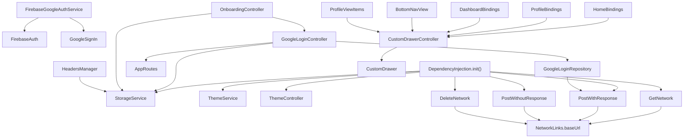

**Diagram sources**
- [dependency_injection.dart:19-25](file://lib/core/di/dependency_injection.dart#L19-L25)
- [firebase_google_auth.dart:12-13](file://lib/core/services/firebase_google_auth.dart#L12-L13)
- [google_login_controller.dart:10-13](file://lib/features/auth/controller/google_login_controller.dart#L10-L13)
- [google_login_repo.dart:9](file://lib/features/auth/repositories/google_login_repo.dart#L9)
- [onboard_bindings.dart:9-11](file://lib/features/auth/bindings/onboard_bindings.dart#L9-L11)
- [headers_manager.dart:19](file://lib/core/data/networks/headers_manager.dart#L19)
- [custom_drawer_controller.dart:5-59](file://lib/shared/widgets/custom_drawer/custom_drawer_controller.dart#L5-L59)
- [home_bindings.dart:34](file://lib/features/home/bindings/home_bindings.dart#L34)
- [profile_bindings.dart:17](file://lib/features/profile/bindings/profile_bindings.dart#L17)
- [dashboard_bindings.dart:11](file://lib/features/dashboard/bindings/dashboard_bindings.dart#L11)
- [bottom_nav_view.dart:78-79](file://lib/features/home/views/bottom_nav_view.dart#L78-L79)
- [profile_view_items.dart:28-40](file://lib/features/profile/widgets/profile_view_widgets/profile_view_items.dart#L28-L40)

**Section sources**
- [dependency_injection.dart:19-25](file://lib/core/di/dependency_injection.dart#L19-L25)
- [firebase_google_auth.dart:12-13](file://lib/core/services/firebase_google_auth.dart#L12-L13)
- [google_login_controller.dart:10-13](file://lib/features/auth/controller/google_login_controller.dart#L10-L13)
- [google_login_repo.dart:9](file://lib/features/auth/repositories/google_login_repo.dart#L9)
- [onboard_bindings.dart:9-11](file://lib/features/auth/bindings/onboard_bindings.dart#L9-L11)
- [headers_manager.dart:19](file://lib/core/data/networks/headers_manager.dart#L19)
- [custom_drawer_controller.dart:5-59](file://lib/shared/widgets/custom_drawer/custom_drawer_controller.dart#L5-L59)
- [home_bindings.dart:34](file://lib/features/home/bindings/home_bindings.dart#L34)
- [profile_bindings.dart:17](file://lib/features/profile/bindings/profile_bindings.dart#L17)
- [dashboard_bindings.dart:11](file://lib/features/dashboard/bindings/dashboard_bindings.dart#L11)
- [bottom_nav_view.dart:78-79](file://lib/features/home/views/bottom_nav_view.dart#L78-L79)
- [profile_view_items.dart:28-40](file://lib/features/profile/widgets/profile_view_widgets/profile_view_items.dart#L28-L40)

## Performance Considerations
- **Singleton lifetime**: All core services are bound as permanent singletons, minimizing allocation overhead and ensuring consistent state across the app.
- **Lazy loading**: Authentication services and CustomDrawerController use Get.lazyPut for on-demand initialization, reducing startup time.
- **Network error handling**: Using Either<ErrorModel, T> avoids throwing exceptions and centralizes error modeling, reducing try/catch proliferation.
- **Reactive theme**: ThemeController uses reactive state, avoiding unnecessary rebuilds by observing only isDarkMode.
- **Header construction**: HeadersManager lazily resolves StorageService per request, which is efficient given infrequent header generation.
- **Authentication caching**: Google authentication results are cached in StorageService for session persistence.
- **Custom drawer optimization**: CustomDrawerController uses reactive observables for minimal rebuilds when navigation state changes.
- **Navigation state management**: Drawer selection state is maintained reactively, preventing unnecessary widget rebuilds.

## Troubleshooting Guide
Common issues and resolutions:
- **Token not found**
  - Symptom: Empty token returned by DependencyInjection.init().
  - Cause: No token persisted under tokenKey.
  - Resolution: Persist a token using StorageService.write(key: "token", value: yourToken) before relying on it.

- **Theme not persisting**
  - Symptom: Theme resets after restart.
  - Cause: ThemeService.getIsDark defaults to false if no value is found.
  - Resolution: Call ThemeController.changeTheme(value) to persist the selected theme.

- **Unauthorized requests**
  - Symptom: 401/403 responses.
  - Cause: Missing or invalid Authorization header.
  - Resolution: Use HeadersManager.getHeaders(isAuth: true) to include the Bearer token.

- **Network failures**
  - Symptom: Calls return Left(ErrorModel).
  - Cause: Non-2xx responses or exceptions.
  - Resolution: Inspect ErrorModel.statusCode and message; handle accordingly in UI.

- **Google authentication failures**
  - Symptom: Google sign-in fails or returns null.
  - Cause: Network issues, Google service unavailability, or authentication errors.
  - Resolution: Check Firebase configuration, ensure Google Sign-In is enabled, verify OAuth client configuration.

- **Authentication flow issues**
  - Symptom: Login successful but navigation fails.
  - Cause: Storage write failure or route configuration issues.
  - Resolution: Verify StorageService.write operation succeeds and AppRoutes.bottomNav is properly configured.

- **Custom drawer navigation issues**
  - Symptom: Drawer items not highlighting or navigation not working.
  - Cause: CustomDrawerController not properly bound or selectedItem observable not updating.
  - Resolution: Ensure CustomDrawerController is bound via Get.lazyPut in appropriate bindings and verify drawerItem configuration.

- **Drawer selection state not resetting**
  - Symptom: Drawer item remains highlighted after navigation.
  - Cause: selectedItem observable not reset when navigating to different screens.
  - Resolution: Use Get.find<CustomDrawerController>().selectedItem.value = [index] to reset selection state appropriately.

**Section sources**
- [dependency_injection.dart:26-29](file://lib/core/di/dependency_injection.dart#L26-L29)
- [theme_service.dart:11-14](file://lib/core/data/local/theme_service.dart#L11-L14)
- [theme_controller.dart:15-18](file://lib/core/theme/theme_controller.dart#L15-L18)
- [headers_manager.dart:17-19](file://lib/core/data/networks/headers_manager.dart#L17-L19)
- [google_login_controller.dart:24-36](file://lib/features/auth/controller/google_login_controller.dart#L24-L36)
- [custom_drawer_controller.dart:5-59](file://lib/shared/widgets/custom_drawer/custom_drawer_controller.dart#L5-L59)

## Conclusion
The ZB-DEZINE DI system leverages GetX to provide a clean, testable, and maintainable architecture with comprehensive Google authentication support and enhanced navigation management:
- **Centralized initialization** ensures all core services are ready before the app runs.
- **Enhanced authentication flow** provides seamless Google sign-in integration with proper error handling.
- **Custom drawer navigation system** offers unified navigation experience across all feature screens with reactive state management.
- **Singleton lifetime management** simplifies state management and reduces memory churn.
- **Clear separation of concerns** across storage, theme, networking, authentication, and navigation services improves modularity.
- **Lazy loading support** optimizes performance by loading authentication and navigation services only when needed.
- **Consumers resolve services** via Get.find<ServiceType>() with lazyPut support for feature-specific bindings, enabling loose coupling and easy testing.
- **Enhanced navigation management** through CustomDrawerController provides consistent drawer functionality across Home, Profile, and Dashboard screens.

## Appendices

### Initialization and Boot Process
- main.dart initializes the DI container and passes the resolved token to MyApp.
- MyApp configures GetMaterialApp and selects initial route and bindings based on token presence.
- Authentication services and CustomDrawerController are lazily loaded when first accessed through their respective Bindings classes.

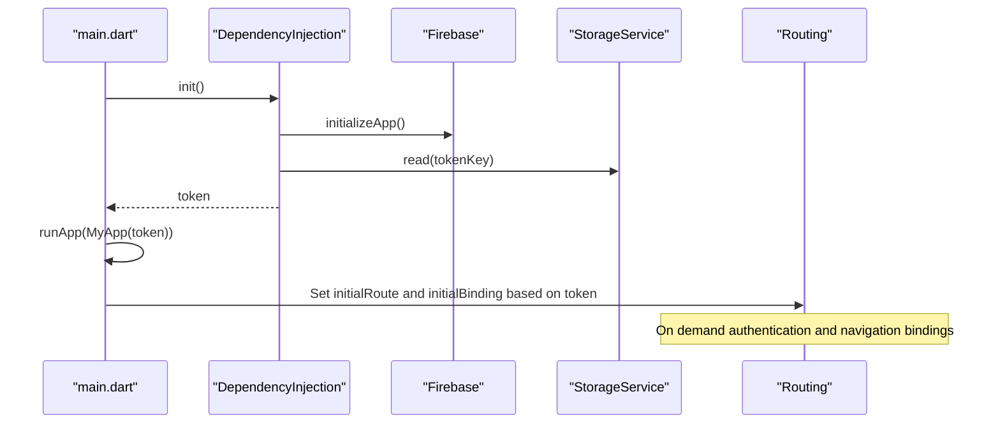

**Diagram sources**
- [main.dart:12-19](file://lib/main.dart#L12-L19)
- [dependency_injection.dart:14-30](file://lib/core/di/dependency_injection.dart#L14-L30)

**Section sources**
- [main.dart:12-19](file://lib/main.dart#L12-L19)
- [dependency_injection.dart:14-30](file://lib/core/di/dependency_injection.dart#L14-L30)

### Adding a New Service to the DI Container
Steps:
1. Create the service class and define its responsibilities.
2. Import the service in dependency_injection.dart for core services or the appropriate Bindings class for feature-specific services.
3. For core services: Bind with permanent: true inside DependencyInjection.init().
4. For feature services: Use Get.lazyPut(() => ServiceName()) in the appropriate Bindings class.
5. Inject dependencies via Get.find<ServiceType>() inside the service or controller.
6. Access the service from anywhere using Get.find<ServiceType>() or lazy loading through bindings.

**Updated** Enhanced with Google authentication patterns, lazy loading support, and custom drawer navigation integration.

Example references:
- Core service binding pattern: [dependency_injection.dart:19-25](file://lib/core/di/dependency_injection.dart#L19-L25)
- Feature service lazy loading: [onboard_bindings.dart:9-11](file://lib/features/auth/bindings/onboard_bindings.dart#L9-L11)
- Custom drawer controller binding: [home_bindings.dart:34](file://lib/features/home/bindings/home_bindings.dart#L34)
- Consumer resolution pattern: [google_login_controller.dart:13](file://lib/features/auth/controller/google_login_controller.dart#L13)

**Section sources**
- [dependency_injection.dart:19-25](file://lib/core/di/dependency_injection.dart#L19-L25)
- [onboard_bindings.dart:9-11](file://lib/features/auth/bindings/onboard_bindings.dart#L9-L11)
- [home_bindings.dart:34](file://lib/features/home/bindings/home_bindings.dart#L34)
- [google_login_controller.dart:13](file://lib/features/auth/controller/google_login_controller.dart#L13)

### Google Authentication Flow
Complete authentication flow from user interaction to token persistence:

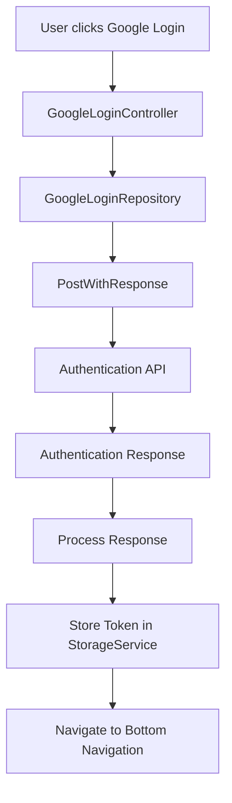

**Diagram sources**
- [google_login_controller.dart:15-37](file://lib/features/auth/controller/google_login_controller.dart#L15-L37)
- [google_login_repo.dart:12-29](file://lib/features/auth/repositories/google_login_repo.dart#L12-L29)
- [post_with_response.dart:12-27](file://lib/core/data/networks/post_with_response.dart#L12-L27)

**Section sources**
- [google_login_controller.dart:15-37](file://lib/features/auth/controller/google_login_controller.dart#L15-L37)
- [google_login_repo.dart:12-29](file://lib/features/auth/repositories/google_login_repo.dart#L12-L29)
- [post_with_response.dart:12-27](file://lib/core/data/networks/post_with_response.dart#L12-L27)

### Custom Drawer Navigation Integration
Enhanced navigation system that provides consistent drawer functionality across all feature screens:

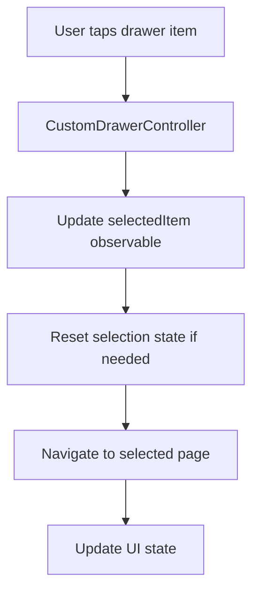

**Diagram sources**
- [custom_drawer_controller.dart:5-59](file://lib/shared/widgets/custom_drawer/custom_drawer_controller.dart#L5-L59)
- [custom_drawer.dart:40-49](file://lib/shared/widgets/custom_drawer/custom_drawer.dart#L40-L49)
- [bottom_nav_view.dart:78-79](file://lib/features/home/views/bottom_nav_view.dart#L78-L79)
- [profile_view_items.dart:28-40](file://lib/features/profile/widgets/profile_view_widgets/profile_view_items.dart#L28-L40)

**Section sources**
- [custom_drawer_controller.dart:5-59](file://lib/shared/widgets/custom_drawer/custom_drawer_controller.dart#L5-L59)
- [custom_drawer.dart:40-49](file://lib/shared/widgets/custom_drawer/custom_drawer.dart#L40-L49)
- [bottom_nav_view.dart:78-79](file://lib/features/home/views/bottom_nav_view.dart#L78-L79)
- [profile_view_items.dart:28-40](file://lib/features/profile/widgets/profile_view_widgets/profile_view_items.dart#L28-L40)