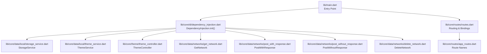
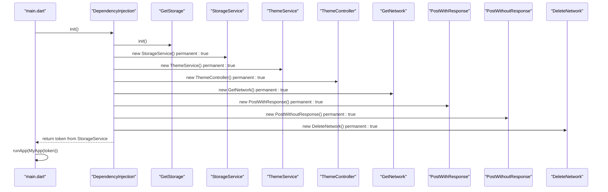
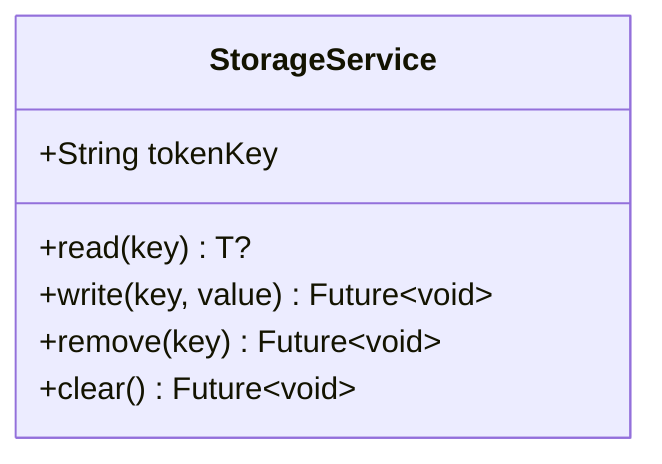
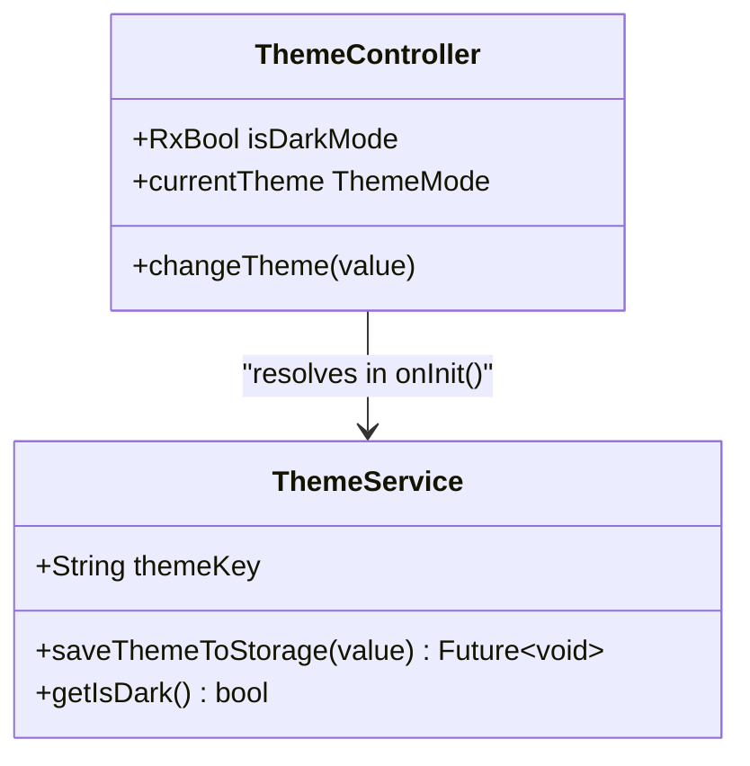
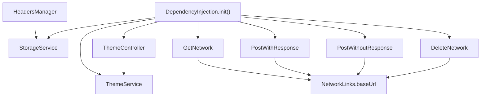
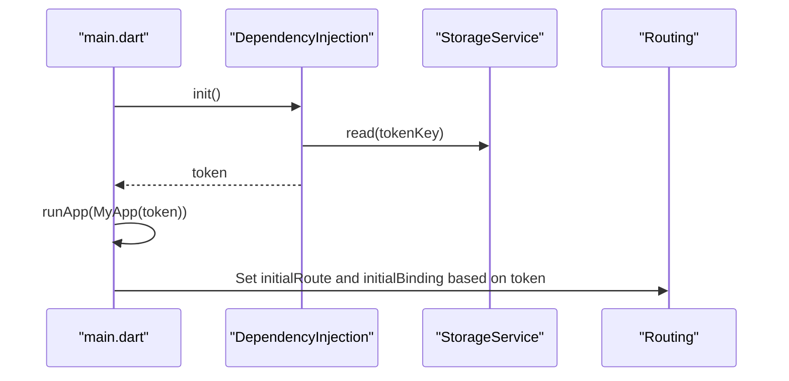

# Dependency Injection System

<cite>
**Referenced Files in This Document**
- [main.dart](file://lib/main.dart)
- [dependency_injection.dart](file://lib/core/di/dependency_injection.dart)
- [storage_service.dart](file://lib/core/data/local/storage_service.dart)
- [theme_service.dart](file://lib/core/data/local/theme_service.dart)
- [theme_controller.dart](file://lib/core/theme/theme_controller.dart)
- [get_network.dart](file://lib/core/data/networks/get_network.dart)
- [post_with_response.dart](file://lib/core/data/networks/post_with_response.dart)
- [post_without_response.dart](file://lib/core/data/networks/post_without_response.dart)
- [delete_network.dart](file://lib/core/data/networks/delete_network.dart)
- [headers_manager.dart](file://lib/core/data/networks/headers_manager.dart)
- [networks_path.dart](file://lib/core/constant/networks_path.dart)
- [error_model.dart](file://lib/core/data/global_models/error_model.dart)
- [app_routes.dart](file://lib/core/routes/app_routes.dart)
- [routes.dart](file://lib/core/routes/routes.dart)
- [firebase_google_auth.dart](file://lib/core/services/firebase_google_auth.dart)
</cite>

## Table of Contents
1. [Introduction](#introduction)
2. [Project Structure](#project-structure)
3. [Core Components](#core-components)
4. [Architecture Overview](#architecture-overview)
5. [Detailed Component Analysis](#detailed-component-analysis)
6. [Dependency Analysis](#dependency-analysis)
7. [Performance Considerations](#performance-considerations)
8. [Troubleshooting Guide](#troubleshooting-guide)
9. [Conclusion](#conclusion)
10. [Appendices](#appendices)

## Introduction
This document explains the ZB-DEZINE dependency injection (DI) system built on GetX. It covers the initialization process, service registration patterns, singleton lifecycle management, and how services are resolved and used across the application. The focus is on:
- How GetStorage is initialized and how services are bound as singletons
- The role of each registered service: StorageService, ThemeService, ThemeController, and network services (GetNetwork, PostWithResponse, PostWithoutResponse, DeleteNetwork)
- Dependency resolution via GetX’s container and how consumers access services
- Practical patterns for injecting and using services, and best practices for extending the DI container

## Project Structure
The DI system is centralized in a dedicated module under lib/core/di and integrates with core services located under lib/core/data and lib/core/theme. The application bootstraps by initializing the DI container before runApp.

**Diagram sources**
- [main.dart:12-19](file://lib/main.dart#L12-L19)
- [dependency_injection.dart:11-26](file://lib/core/di/dependency_injection.dart#L11-L26)
- [storage_service.dart:3-22](file://lib/core/data/local/storage_service.dart#L3-L22)
- [theme_service.dart:3-15](file://lib/core/data/local/theme_service.dart#L3-L15)
- [theme_controller.dart:5-22](file://lib/core/theme/theme_controller.dart#L5-L22)
- [get_network.dart:8-38](file://lib/core/data/networks/get_network.dart#L8-L38)
- [post_with_response.dart:7-44](file://lib/core/data/networks/post_with_response.dart#L7-L44)
- [post_without_response.dart:9-46](file://lib/core/data/networks/post_without_response.dart#L9-L46)
- [delete_network.dart:8-40](file://lib/core/data/networks/delete_network.dart#L8-L40)
- [routes.dart:55-211](file://lib/core/routes/routes.dart#L55-L211)
- [app_routes.dart:1-33](file://lib/core/routes/app_routes.dart#L1-L33)

**Section sources**
- [main.dart:12-19](file://lib/main.dart#L12-L19)
- [dependency_injection.dart:11-26](file://lib/core/di/dependency_injection.dart#L11-L26)
- [routes.dart:55-211](file://lib/core/routes/routes.dart#L55-L211)

## Core Components
This section documents each service registered in the DI container, including responsibilities, lifecycle, and usage patterns.

- StorageService
  - Purpose: Provides persistent key-value storage using GetStorage. Exposes typed read/write/remove/clear operations.
  - Lifecycle: Singleton bound with permanent=true during DI initialization.
  - Access pattern: Consumers resolve via Get.find<StorageService>() and use keys such as tokenKey.
  - Example usage patterns:
    - Read a token: Get.find<StorageService>().read(key: Get.find<StorageService>().tokenKey)
    - Write a token: Get.find<StorageService>().write(key: "token", value: token)
    - Clear storage: Get.find<StorageService>().clear()

- ThemeService
  - Purpose: Manages theme preference persistence using GetStorage with a themeKey.
  - Lifecycle: Singleton bound with permanent=true during DI initialization.
  - Access pattern: Consumers resolve via Get.find<ThemeService>() and call saveThemeToStorage and getIsDark.

- ThemeController
  - Purpose: Reactive controller that observes theme state and persists changes via ThemeService.
  - Lifecycle: Singleton bound with permanent=true during DI initialization.
  - Dependency resolution: Resolves ThemeService in onInit and exposes currentTheme for GetMaterialApp.
  - Access pattern: Consumers observe isDarkMode or call changeTheme to toggle.

- Network Services
  - GetNetwork
    - Purpose: Generic GET requests returning Either<ErrorModel, T>.
    - Access pattern: Resolve via Get.find<GetNetwork>().getData(...) with a fromJson parser.
  - PostWithResponse
    - Purpose: POST requests returning Either<ErrorModel, T>.
    - Access pattern: Resolve via Get.find<PostWithResponse>().postData(...) with headers and body.
  - PostWithoutResponse
    - Purpose: POST requests returning Either<ErrorModel, bool> for success/failure.
    - Access pattern: Resolve via Get.find<PostWithoutResponse>().postData(...).
  - DeleteNetwork
    - Purpose: DELETE requests returning Either<ErrorModel, bool>.
    - Access pattern: Resolve via Get.find<DeleteNetwork>().deleteData(...).

- HeadersManager
  - Purpose: Builds HTTP headers for authenticated requests using the token stored in StorageService.
  - Access pattern: Static method getHeaders with optional flags for content-type and accept.

**Section sources**
- [dependency_injection.dart:14-20](file://lib/core/di/dependency_injection.dart#L14-L20)
- [storage_service.dart:3-22](file://lib/core/data/local/storage_service.dart#L3-L22)
- [theme_service.dart:3-15](file://lib/core/data/local/theme_service.dart#L3-L15)
- [theme_controller.dart:5-22](file://lib/core/theme/theme_controller.dart#L5-L22)
- [get_network.dart:8-38](file://lib/core/data/networks/get_network.dart#L8-L38)
- [post_with_response.dart:7-44](file://lib/core/data/networks/post_with_response.dart#L7-L44)
- [post_without_response.dart:9-46](file://lib/core/data/networks/post_without_response.dart#L9-L46)
- [delete_network.dart:8-40](file://lib/core/data/networks/delete_network.dart#L8-L40)
- [headers_manager.dart:4-22](file://lib/core/data/networks/headers_manager.dart#L4-L22)

## Architecture Overview
The DI architecture follows a simple but robust pattern:
- Initialization: GetStorage is initialized, then all services are bound as singletons with permanent=true.
- Resolution: Consumers retrieve services using Get.find<ServiceType>().
- Routing: The app chooses initial route and bindings based on whether a token exists (resolved from StorageService).

**Diagram sources**
- [main.dart:12-19](file://lib/main.dart#L12-L19)
- [dependency_injection.dart:12-25](file://lib/core/di/dependency_injection.dart#L12-L25)
- [storage_service.dart:3-22](file://lib/core/data/local/storage_service.dart#L3-L22)

**Section sources**
- [main.dart:12-19](file://lib/main.dart#L12-L19)
- [dependency_injection.dart:12-25](file://lib/core/di/dependency_injection.dart#L12-L25)

## Detailed Component Analysis

### StorageService
- Responsibilities: Encapsulates GetStorage operations with a typed API and a tokenKey constant.
- Lifecycle: Singleton via permanent binding.
- Usage: Used by DependencyInjection to read the token and by HeadersManager to construct Authorization headers.

**Diagram sources**
- [storage_service.dart:3-22](file://lib/core/data/local/storage_service.dart#L3-L22)

**Section sources**
- [storage_service.dart:3-22](file://lib/core/data/local/storage_service.dart#L3-L22)
- [dependency_injection.dart:14](file://lib/core/di/dependency_injection.dart#L14)
- [headers_manager.dart:19](file://lib/core/data/networks/headers_manager.dart#L19)

### ThemeService and ThemeController
- ThemeService: Persists theme state using GetStorage with a themeKey.
- ThemeController: Reactive controller that reads initial theme from ThemeService and updates persistence on change.
- Integration: ThemeController depends on ThemeService; both are singletons.

**Diagram sources**
- [theme_service.dart:3-15](file://lib/core/data/local/theme_service.dart#L3-L15)
- [theme_controller.dart:5-22](file://lib/core/theme/theme_controller.dart#L5-L22)

**Section sources**
- [theme_service.dart:3-15](file://lib/core/data/local/theme_service.dart#L3-L15)
- [theme_controller.dart:5-22](file://lib/core/theme/theme_controller.dart#L5-L22)
- [dependency_injection.dart:15-16](file://lib/core/di/dependency_injection.dart#L15-L16)

### Network Services
- GetNetwork: Performs GET requests and returns Either<ErrorModel, T>.
- PostWithResponse: Performs POST with JSON body and returns Either<ErrorModel, T>.
- PostWithoutResponse: Performs POST and returns Either<ErrorModel, bool>.
- DeleteNetwork: Performs DELETE and returns Either<ErrorModel, bool>.
- All services share a base URL from NetworkLinks and use ErrorModel for error handling.

**Diagram sources**
- [get_network.dart:8-38](file://lib/core/data/networks/get_network.dart#L8-L38)
- [post_with_response.dart:7-44](file://lib/core/data/networks/post_with_response.dart#L7-L44)
- [post_without_response.dart:9-46](file://lib/core/data/networks/post_without_response.dart#L9-L46)
- [delete_network.dart:8-40](file://lib/core/data/networks/delete_network.dart#L8-L40)
- [error_model.dart:1-14](file://lib/core/data/global_models/error_model.dart#L1-L14)

**Section sources**
- [get_network.dart:8-38](file://lib/core/data/networks/get_network.dart#L8-L38)
- [post_with_response.dart:7-44](file://lib/core/data/networks/post_with_response.dart#L7-L44)
- [post_without_response.dart:9-46](file://lib/core/data/networks/post_without_response.dart#L9-L46)
- [delete_network.dart:8-40](file://lib/core/data/networks/delete_network.dart#L8-L40)
- [networks_path.dart:1-3](file://lib/core/constant/networks_path.dart#L1-L3)
- [error_model.dart:1-14](file://lib/core/data/global_models/error_model.dart#L1-L14)

### HeadersManager
- Purpose: Constructs HTTP headers including Content-Type, Accept, and Authorization using the token from StorageService.
- Dependency: Resolves StorageService at runtime to fetch the token.

**Diagram sources**
- [headers_manager.dart:9-21](file://lib/core/data/networks/headers_manager.dart#L9-L21)
- [storage_service.dart:5](file://lib/core/data/local/storage_service.dart#L5)

**Section sources**
- [headers_manager.dart:4-22](file://lib/core/data/networks/headers_manager.dart#L4-L22)
- [storage_service.dart:3-22](file://lib/core/data/local/storage_service.dart#L3-L22)

## Dependency Analysis
This section maps how services depend on each other and how they are resolved at runtime.

**Diagram sources**
- [dependency_injection.dart:14-20](file://lib/core/di/dependency_injection.dart#L14-L20)
- [theme_controller.dart:10](file://lib/core/theme/theme_controller.dart#L10)
- [headers_manager.dart:19](file://lib/core/data/networks/headers_manager.dart#L19)
- [networks_path.dart:2](file://lib/core/constant/networks_path.dart#L2)

**Section sources**
- [dependency_injection.dart:14-20](file://lib/core/di/dependency_injection.dart#L14-L20)
- [theme_controller.dart:10](file://lib/core/theme/theme_controller.dart#L10)
- [headers_manager.dart:19](file://lib/core/data/networks/headers_manager.dart#L19)
- [networks_path.dart:1-3](file://lib/core/constant/networks_path.dart#L1-L3)

## Performance Considerations
- Singleton lifetime: All services are bound as permanent singletons, minimizing allocation overhead and ensuring consistent state across the app.
- Network error handling: Using Either<ErrorModel, T> avoids throwing exceptions and centralizes error modeling, reducing try/catch proliferation.
- Reactive theme: ThemeController uses reactive state, avoiding unnecessary rebuilds by observing only isDarkMode.
- Header construction: HeadersManager lazily resolves StorageService per request, which is efficient given infrequent header generation.

## Troubleshooting Guide
Common issues and resolutions:
- Token not found
  - Symptom: Empty token returned by DependencyInjection.init().
  - Cause: No token persisted under tokenKey.
  - Resolution: Persist a token using StorageService.write(key: "token", value: yourToken) before relying on it.
  - Section sources
    - [dependency_injection.dart:21-24](file://lib/core/di/dependency_injection.dart#L21-L24)
    - [storage_service.dart:7-9](file://lib/core/data/local/storage_service.dart#L7-L9)

- Theme not persisting
  - Symptom: Theme resets after restart.
  - Cause: ThemeService.getIsDark defaults to false if no value is found.
  - Resolution: Call ThemeController.changeTheme(value) to persist the selected theme.
  - Section sources
    - [theme_service.dart:11-14](file://lib/core/data/local/theme_service.dart#L11-L14)
    - [theme_controller.dart:15-18](file://lib/core/theme/theme_controller.dart#L15-L18)

- Unauthorized requests
  - Symptom: 401/403 responses.
  - Cause: Missing or invalid Authorization header.
  - Resolution: Use HeadersManager.getHeaders(isAuth: true) to include the Bearer token.
  - Section sources
    - [headers_manager.dart:17-19](file://lib/core/data/networks/headers_manager.dart#L17-L19)
    - [storage_service.dart:5](file://lib/core/data/local/storage_service.dart#L5)

- Network failures
  - Symptom: Calls return Left(ErrorModel).
  - Cause: Non-2xx responses or exceptions.
  - Resolution: Inspect ErrorModel.statusCode and message; handle accordingly in UI.
  - Section sources
    - [get_network.dart:34-36](file://lib/core/data/networks/get_network.dart#L34-L36)
    - [post_with_response.dart:40-42](file://lib/core/data/networks/post_with_response.dart#L40-L42)
    - [post_without_response.dart:42-44](file://lib/core/data/networks/post_without_response.dart#L42-L44)
    - [delete_network.dart:37-38](file://lib/core/data/networks/delete_network.dart#L37-L38)
    - [error_model.dart:5-13](file://lib/core/data/global_models/error_model.dart#L5-L13)

## Conclusion
The ZB-DEZINE DI system leverages GetX to provide a clean, testable, and maintainable architecture:
- Centralized initialization ensures all services are ready before the app runs.
- Singletons with permanent lifecycle simplify state management and reduce memory churn.
- Clear separation of concerns across storage, theme, and networking services improves modularity.
- Consumers resolve services via Get.find<ServiceType>(), enabling loose coupling and easy testing.

## Appendices

### Initialization and Boot Process
- main.dart initializes the DI container and passes the resolved token to MyApp.
- MyApp configures GetMaterialApp and selects initial route and bindings based on token presence.

**Diagram sources**
- [main.dart:12-19](file://lib/main.dart#L12-L19)
- [dependency_injection.dart:21-24](file://lib/core/di/dependency_injection.dart#L21-L24)

**Section sources**
- [main.dart:12-19](file://lib/main.dart#L12-L19)
- [dependency_injection.dart:21-24](file://lib/core/di/dependency_injection.dart#L21-L24)

### Adding a New Service to the DI Container
Steps:
1. Create the service class and define its responsibilities.
2. Import the service in dependency_injection.dart.
3. Bind the service as a singleton with permanent: true inside DependencyInjection.init().
4. Inject dependencies via Get.find<ServiceType>() inside the service or controller.
5. Access the service from anywhere using Get.find<ServiceType>().

Example references:
- Service binding pattern: [dependency_injection.dart:14-20](file://lib/core/di/dependency_injection.dart#L14-L20)
- Consumer resolution pattern: [headers_manager.dart:19](file://lib/core/data/networks/headers_manager.dart#L19)

**Section sources**
- [dependency_injection.dart:14-20](file://lib/core/di/dependency_injection.dart#L14-L20)
- [headers_manager.dart:19](file://lib/core/data/networks/headers_manager.dart#L19)