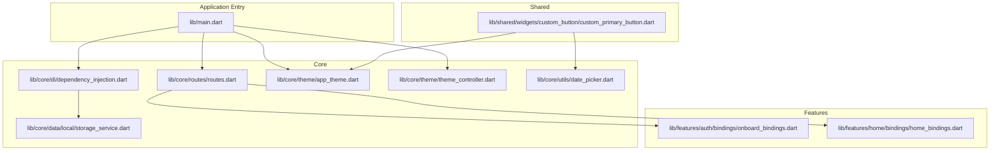
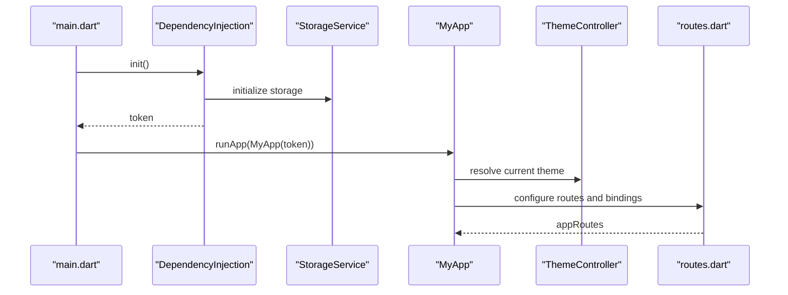
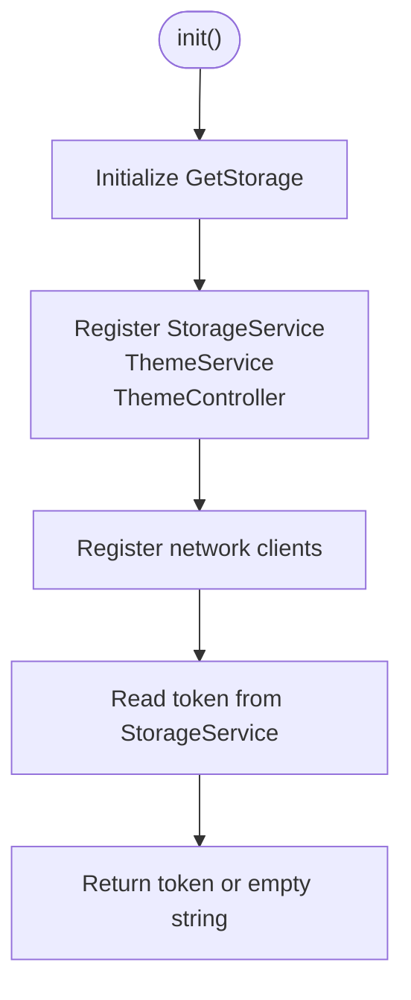
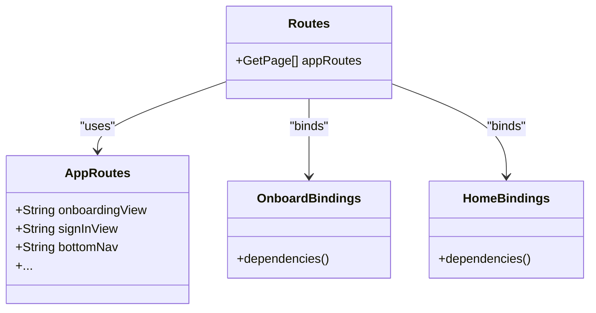
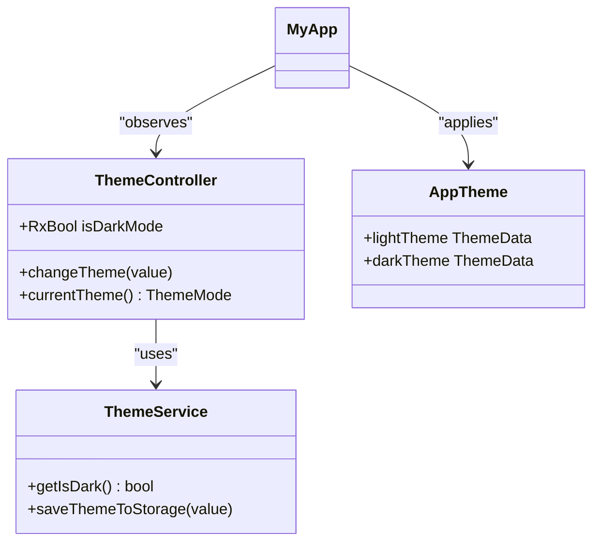
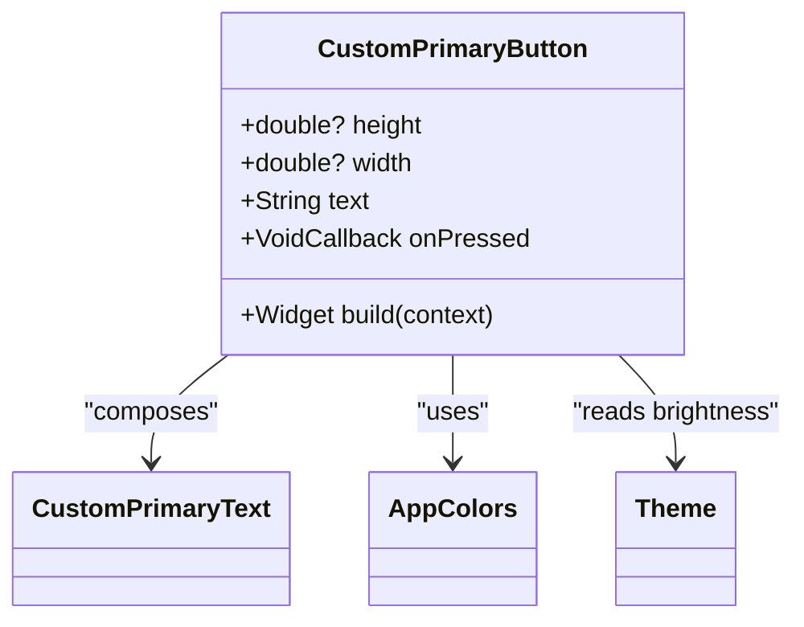
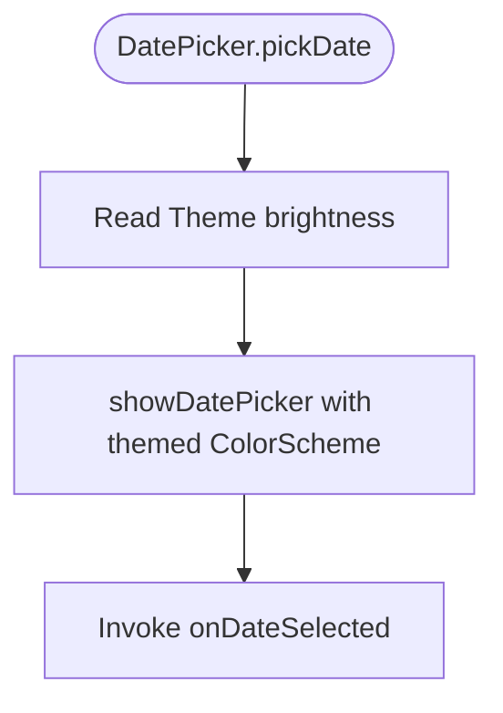
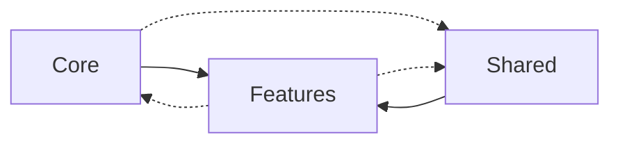

# Modular Design and Feature Organization

<cite>
**Referenced Files in This Document**
- [pubspec.yaml](file://pubspec.yaml)
- [main.dart](file://lib/main.dart)
- [dependency_injection.dart](file://lib/core/di/dependency_injection.dart)
- [app_routes.dart](file://lib/core/routes/app_routes.dart)
- [routes.dart](file://lib/core/routes/routes.dart)
- [app_theme.dart](file://lib/core/theme/app_theme.dart)
- [theme_controller.dart](file://lib/core/theme/theme_controller.dart)
- [date_picker.dart](file://lib/core/utils/date_picker.dart)
- [storage_service.dart](file://lib/core/data/local/storage_service.dart)
- [onboard_bindings.dart](file://lib/features/auth/bindings/onboard_bindings.dart)
- [home_bindings.dart](file://lib/features/home/bindings/home_bindings.dart)
- [custom_primary_button.dart](file://lib/shared/widgets/custom_button/custom_primary_button.dart)
</cite>

## Table of Contents
1. [Introduction](#introduction)
2. [Project Structure](#project-structure)
3. [Core Components](#core-components)
4. [Architecture Overview](#architecture-overview)
5. [Detailed Component Analysis](#detailed-component-analysis)
6. [Dependency Analysis](#dependency-analysis)
7. [Performance Considerations](#performance-considerations)
8. [Testing Strategies](#testing-strategies)
9. [Hot Reload and Build Optimization](#hot-reload-and-build-optimization)
10. [Adding Features and Maintaining Isolation](#adding-features-and-maintaining-isolation)
11. [Troubleshooting Guide](#troubleshooting-guide)
12. [Conclusion](#conclusion)

## Introduction
This document explains ZB-DEZINE’s modular architecture and feature organization. The project follows a clean separation of concerns:
- Core: Cross-cutting infrastructure (dependency injection, routing, theming, utilities, and data services)
- Features: Self-contained functional modules (authentication, AI design, orders, payments, profiles, etc.)
- Shared: Reusable UI components and utilities used across features

The document covers module boundaries, import patterns, dependency management, inter-module communication, testing strategies, hot reload considerations, and build optimization for large codebases.

## Project Structure
The project is organized into three primary directories:
- lib/core: foundational services and utilities used by features
- lib/features: feature-based modules with clear boundaries (bindings, controllers, views, widgets, models, repositories)
- lib/shared: reusable UI widgets and utilities

**Diagram sources**
- [main.dart:12-47](file://lib/main.dart#L12-L47)
- [dependency_injection.dart:11-26](file://lib/core/di/dependency_injection.dart#L11-L26)
- [routes.dart:55-211](file://lib/core/routes/routes.dart#L55-L211)
- [app_theme.dart:4-22](file://lib/core/theme/app_theme.dart#L4-L22)
- [theme_controller.dart:5-22](file://lib/core/theme/theme_controller.dart#L5-L22)
- [date_picker.dart:3-36](file://lib/core/utils/date_picker.dart#L3-L36)
- [storage_service.dart:3-22](file://lib/core/data/local/storage_service.dart#L3-L22)
- [onboard_bindings.dart:4-9](file://lib/features/auth/bindings/onboard_bindings.dart#L4-L9)
- [home_bindings.dart:13-34](file://lib/features/home/bindings/home_bindings.dart#L13-L34)
- [custom_primary_button.dart:6-73](file://lib/shared/widgets/custom_button/custom_primary_button.dart#L6-L73)

**Section sources**
- [pubspec.yaml:30-60](file://pubspec.yaml#L30-L60)
- [main.dart:12-47](file://lib/main.dart#L12-L47)

## Core Components
The core layer provides cross-cutting services and utilities:
- Dependency Injection: Centralized initialization and registration of services and controllers
- Routing: Central route registry and navigation constants
- Theming: Light/dark themes and theme mode controller
- Utilities: Reusable helpers (e.g., date picker)
- Data Services: Local storage abstraction

Key responsibilities:
- DependencyInjection initializes storage and registers services/controllers with lazy loading
- AppRoutes centralizes route names
- Routes binds pages to their respective bindings
- ThemeController manages theme persistence and mode switching
- DatePicker adapts to theme brightness for consistent UX
- StorageService abstracts token and preference storage

**Section sources**
- [dependency_injection.dart:11-26](file://lib/core/di/dependency_injection.dart#L11-L26)
- [app_routes.dart:1-34](file://lib/core/routes/app_routes.dart#L1-L34)
- [routes.dart:55-211](file://lib/core/routes/routes.dart#L55-L211)
- [theme_controller.dart:5-22](file://lib/core/theme/theme_controller.dart#L5-L22)
- [date_picker.dart:3-36](file://lib/core/utils/date_picker.dart#L3-L36)
- [storage_service.dart:3-22](file://lib/core/data/local/storage_service.dart#L3-L22)

## Architecture Overview
The application bootstraps via main, initializes dependencies, and configures theme and routing. Features are isolated behind bindings and controllers, communicating through injected services.

**Diagram sources**
- [main.dart:12-47](file://lib/main.dart#L12-L47)
- [dependency_injection.dart:12-25](file://lib/core/di/dependency_injection.dart#L12-L25)
- [storage_service.dart:7-21](file://lib/core/data/local/storage_service.dart#L7-L21)
- [theme_controller.dart:5-22](file://lib/core/theme/theme_controller.dart#L5-L22)
- [routes.dart:55-211](file://lib/core/routes/routes.dart#L55-L211)

## Detailed Component Analysis

### Dependency Injection and Initialization
DependencyInjection sets up persistent services and resolves the token for initial routing decisions. It registers storage, theme services, network clients, and controllers lazily.

**Diagram sources**
- [dependency_injection.dart:12-25](file://lib/core/di/dependency_injection.dart#L12-L25)
- [storage_service.dart:7-21](file://lib/core/data/local/storage_service.dart#L7-L21)

**Section sources**
- [dependency_injection.dart:11-26](file://lib/core/di/dependency_injection.dart#L11-L26)
- [storage_service.dart:3-22](file://lib/core/data/local/storage_service.dart#L3-L22)

### Routing and Feature Boundaries
Routing is centralized in routes.dart with named routes defined in app_routes.dart. Each feature registers its pages and bindings, enabling clear separation between UI, state, and navigation.

**Diagram sources**
- [app_routes.dart:1-34](file://lib/core/routes/app_routes.dart#L1-L34)
- [routes.dart:55-211](file://lib/core/routes/routes.dart#L55-L211)
- [onboard_bindings.dart:4-9](file://lib/features/auth/bindings/onboard_bindings.dart#L4-L9)
- [home_bindings.dart:13-34](file://lib/features/home/bindings/home_bindings.dart#L13-L34)

**Section sources**
- [app_routes.dart:1-34](file://lib/core/routes/app_routes.dart#L1-L34)
- [routes.dart:55-211](file://lib/core/routes/routes.dart#L55-L211)
- [onboard_bindings.dart:4-9](file://lib/features/auth/bindings/onboard_bindings.dart#L4-L9)
- [home_bindings.dart:13-34](file://lib/features/home/bindings/home_bindings.dart#L13-L34)

### Theming and Dark Mode
ThemeController observes theme preferences and persists them via ThemeService. AppTheme defines light/dark configurations.

**Diagram sources**
- [theme_controller.dart:5-22](file://lib/core/theme/theme_controller.dart#L5-L22)
- [app_theme.dart:4-22](file://lib/core/theme/app_theme.dart#L4-L22)

**Section sources**
- [theme_controller.dart:5-22](file://lib/core/theme/theme_controller.dart#L5-L22)
- [app_theme.dart:4-22](file://lib/core/theme/app_theme.dart#L4-L22)

### Shared Components Library
Shared widgets encapsulate UI patterns and reuse core utilities. Example: CustomPrimaryButton integrates typography, colors, and theme awareness.

**Diagram sources**
- [custom_primary_button.dart:6-73](file://lib/shared/widgets/custom_button/custom_primary_button.dart#L6-L73)

**Section sources**
- [custom_primary_button.dart:6-73](file://lib/shared/widgets/custom_button/custom_primary_button.dart#L6-L73)

### Utilities and Data Access
Utilities like DatePicker adapt to theme brightness. Data services abstract storage operations.

**Diagram sources**
- [date_picker.dart:10-35](file://lib/core/utils/date_picker.dart#L10-L35)

**Section sources**
- [date_picker.dart:3-36](file://lib/core/utils/date_picker.dart#L3-L36)
- [storage_service.dart:3-22](file://lib/core/data/local/storage_service.dart#L3-L22)

## Dependency Analysis
Module dependencies emphasize unidirectional flow from core to features and shared to features. Features depend on core services and shared components but avoid reverse dependencies.

- Core depends on external libraries declared in pubspec.yaml
- Features import core services and shared widgets
- Shared components import core colors and utilities

**Section sources**
- [pubspec.yaml:30-60](file://pubspec.yaml#L30-L60)
- [main.dart:1-11](file://lib/main.dart#L1-L11)

## Performance Considerations
- Lazy loading: Use lazyPut in bindings to defer instantiation until needed
- Minimize rebuilds: Prefer lightweight widgets and isolate stateful controllers
- Theme-aware widgets: Compute theme-dependent values once per build
- Network clients: Reuse single instances registered in DI
- Asset management: Keep shared assets under assets/ and reference via pubspec.yaml

## Testing Strategies
- Unit tests: Focus on controllers and repositories; mock injected services and repositories
- Widget tests: Test shared widgets in isolation with theme providers
- Integration tests: Verify bindings and routing by simulating navigation and state changes
- Dependency mocking: Replace real services with fakes during tests

## Hot Reload and Build Optimization
- Hot reload: Keep bindings lazy and avoid heavy initialization in constructors
- Build optimization: Split large features into smaller modules; leverage tree shaking by avoiding unused imports
- Dev ergonomics: Use feature-based imports and keep route definitions centralized

## Adding Features and Maintaining Isolation
Steps to add a new feature:
1. Create feature directory under lib/features/<feature_name>/ with bindings/, controller/, views/, widgets/, models/, repositories/ as needed
2. Define route constants in app_routes.dart
3. Register the page and binding in routes.dart
4. Implement OnboardingController-like bindings with lazyPut for dependencies
5. Use shared widgets and core utilities to maintain consistency
6. Avoid importing features from core or other features; pass dependencies via DI

Example references:
- Route registration pattern: [routes.dart:55-211](file://lib/core/routes/routes.dart#L55-L211)
- Binding pattern: [onboard_bindings.dart:4-9](file://lib/features/auth/bindings/onboard_bindings.dart#L4-L9), [home_bindings.dart:13-34](file://lib/features/home/bindings/home_bindings.dart#L13-L34)

## Troubleshooting Guide
Common issues and resolutions:
- Missing token on startup: Verify StorageService initialization and token key
- Theme not applying: Ensure ThemeController is resolved and currentTheme is used
- Route not found: Confirm route name exists in AppRoutes and page is registered in routes.dart
- Widget not rendering: Check theme brightness usage and shared component dependencies

**Section sources**
- [dependency_injection.dart:12-25](file://lib/core/di/dependency_injection.dart#L12-L25)
- [theme_controller.dart:20-22](file://lib/core/theme/theme_controller.dart#L20-L22)
- [app_routes.dart:1-34](file://lib/core/routes/app_routes.dart#L1-L34)
- [routes.dart:55-211](file://lib/core/routes/routes.dart#L55-L211)

## Conclusion
ZB-DEZINE’s modular architecture cleanly separates core infrastructure, feature modules, and shared components. By leveraging dependency injection, centralized routing, and shared utilities, the project maintains scalability and modularity. Following the outlined patterns ensures new features integrate seamlessly while preserving module isolation and performance.