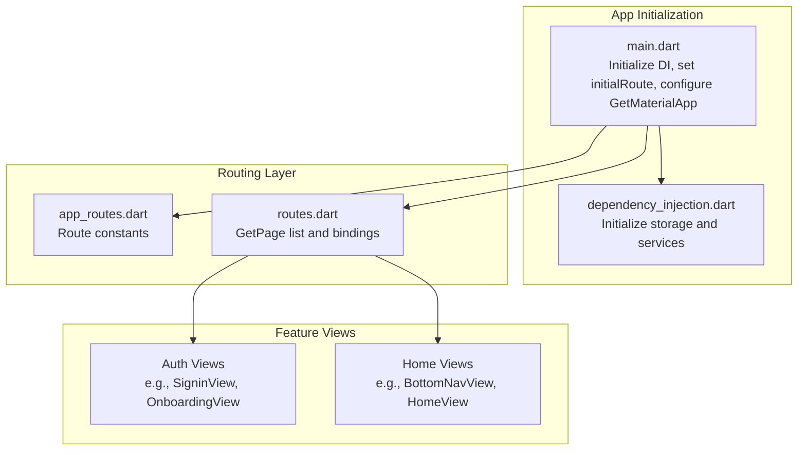
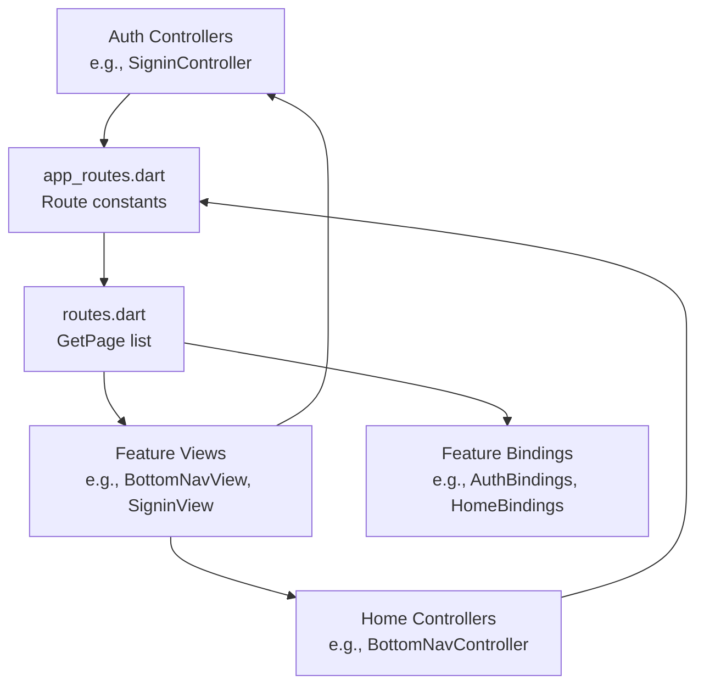
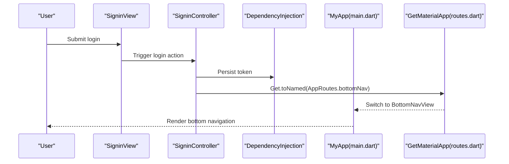
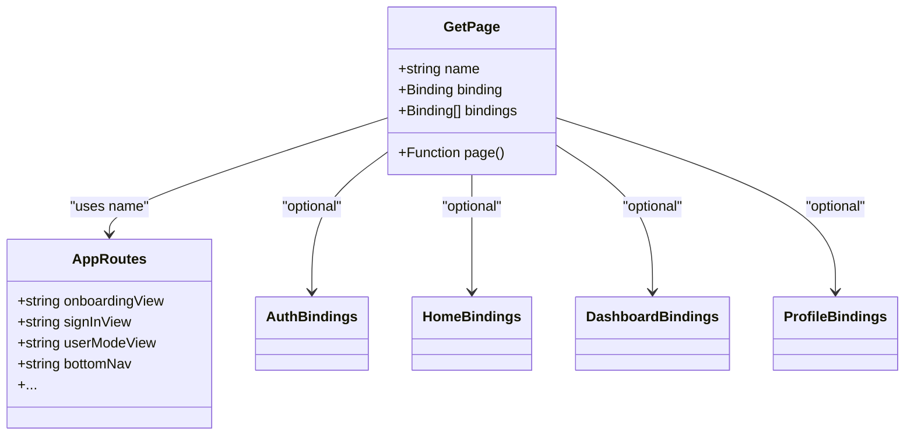
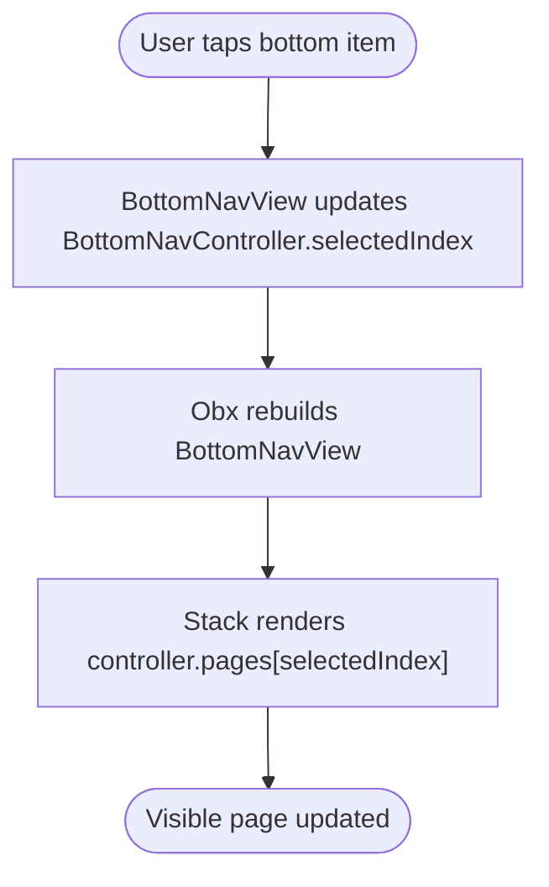
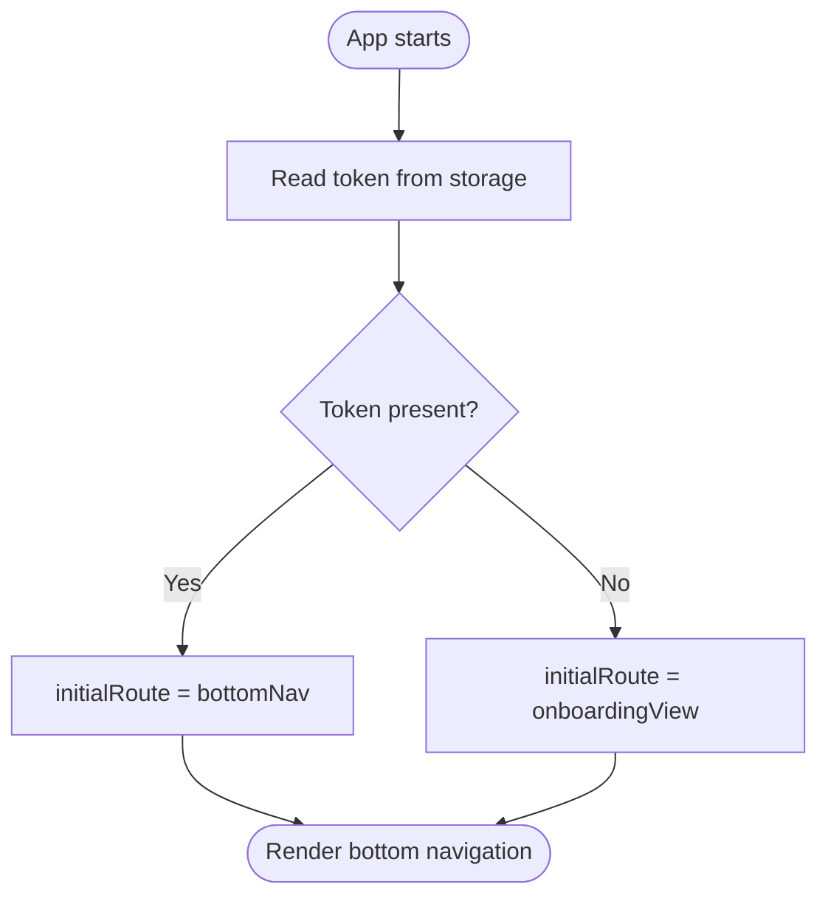
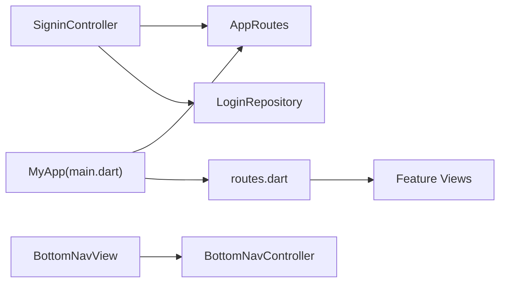

# Routing and Navigation

<cite>
**Referenced Files in This Document**
- [main.dart](file://lib/main.dart)
- [app_routes.dart](file://lib/core/routes/app_routes.dart)
- [routes.dart](file://lib/core/routes/routes.dart)
- [dependency_injection.dart](file://lib/core/di/dependency_injection.dart)
- [signin_controller.dart](file://lib/features/auth/controller/signin_controller.dart)
- [bottom_nav_view.dart](file://lib/features/home/views/bottom_nav_view.dart)
- [bottom_nav_controller.dart](file://lib/features/home/controller/bottom_nav_controller.dart)
- [onboarding_controller.dart](file://lib/features/auth/controller/onboarding_controller.dart)
</cite>

## Table of Contents
1. [Introduction](#introduction)
2. [Project Structure](#project-structure)
3. [Core Components](#core-components)
4. [Architecture Overview](#architecture-overview)
5. [Detailed Component Analysis](#detailed-component-analysis)
6. [Dependency Analysis](#dependency-analysis)
7. [Performance Considerations](#performance-considerations)
8. [Troubleshooting Guide](#troubleshooting-guide)
9. [Conclusion](#conclusion)

## Introduction
This document explains the routing and navigation system of the ZB-DEZINE application. It focuses on route definition patterns, navigation logic, page transitions, and how the system integrates with the MVVM pattern and controller-based navigation. The documentation covers the AppRoutes class, route constants, navigation helpers, programmatic navigation, deep linking considerations, and navigation state management.

## Project Structure
The routing system is implemented using the GetX package and organized under the core routes module. The application initializes routes via a central list of pages and route constants. Controllers orchestrate navigation after business logic completion.

**Diagram sources**
- [main.dart:12-46](file://lib/main.dart#L12-L46)
- [dependency_injection.dart:11-26](file://lib/core/di/dependency_injection.dart#L11-L26)
- [app_routes.dart:1-34](file://lib/core/routes/app_routes.dart#L1-L34)
- [routes.dart:55-211](file://lib/core/routes/routes.dart#L55-L211)

**Section sources**
- [main.dart:12-46](file://lib/main.dart#L12-L46)
- [dependency_injection.dart:11-26](file://lib/core/di/dependency_injection.dart#L11-L26)
- [app_routes.dart:1-34](file://lib/core/routes/app_routes.dart#L1-L34)
- [routes.dart:55-211](file://lib/core/routes/routes.dart#L55-L211)

## Core Components
- AppRoutes: Centralized route constants used for programmatic navigation and deep linking.
- routes.dart: Defines all named routes using GetPage entries, each mapping a route constant to a view and its associated binding(s).
- main.dart: Initializes the app with GetMaterialApp, sets the initial route based on authentication state, and registers all pages.

Key responsibilities:
- Route constants: Provide a single source of truth for route names.
- GetPage list: Declares all pages, their constructors, and bindings for dependency injection.
- Initial route selection: Chooses onboarding or bottom navigation based on token presence.

**Section sources**
- [app_routes.dart:1-34](file://lib/core/routes/app_routes.dart#L1-L34)
- [routes.dart:55-211](file://lib/core/routes/routes.dart#L55-L211)
- [main.dart:36-40](file://lib/main.dart#L36-L40)

## Architecture Overview
The routing architecture follows MVVM with GetX:
- Views are thin and delegate UI logic to controllers.
- Controllers perform navigation after completing business operations.
- Bindings connect controllers and models to the view lifecycle.
- Route constants and GetPage definitions decouple navigation from view code.

**Diagram sources**
- [signin_controller.dart:9-52](file://lib/features/auth/controller/signin_controller.dart#L9-L52)
- [bottom_nav_controller.dart:7-17](file://lib/features/home/controller/bottom_nav_controller.dart#L7-L17)
- [bottom_nav_view.dart:11-256](file://lib/features/home/views/bottom_nav_view.dart#L11-L256)
- [routes.dart:55-211](file://lib/core/routes/routes.dart#L55-L211)
- [app_routes.dart:1-34](file://lib/core/routes/app_routes.dart#L1-L34)

## Detailed Component Analysis

### AppRoutes and Route Constants
- Purpose: Define all route names as static constants for type-safe navigation.
- Usage: Controllers call Get.toNamed(AppRoutes.<name>) to navigate programmatically.
- Benefits: Centralization reduces typos and simplifies refactoring.

Examples of usage:
- Programmatic navigation after successful login.
- Navigating from onboarding to authentication modes.

**Section sources**
- [app_routes.dart:1-34](file://lib/core/routes/app_routes.dart#L1-L34)
- [signin_controller.dart:32](file://lib/features/auth/controller/signin_controller.dart#L32)

### Navigation Flow and Page Transitions
- Programmatic navigation: Controllers call Get.toNamed(routeName) to switch screens.
- Bottom navigation: BottomNavView renders the selected page from BottomNavController.
- Initial route: Set based on token availability during app startup.

**Diagram sources**
- [signin_controller.dart:17-36](file://lib/features/auth/controller/signin_controller.dart#L17-L36)
- [dependency_injection.dart:21-24](file://lib/core/di/dependency_injection.dart#L21-L24)
- [main.dart:36-40](file://lib/main.dart#L36-L40)
- [routes.dart:121-125](file://lib/core/routes/routes.dart#L121-L125)

**Section sources**
- [signin_controller.dart:17-36](file://lib/features/auth/controller/signin_controller.dart#L17-L36)
- [bottom_nav_view.dart:17-21](file://lib/features/home/views/bottom_nav_view.dart#L17-L21)
- [bottom_nav_controller.dart:7-17](file://lib/features/home/controller/bottom_nav_controller.dart#L7-L17)

### Route Definitions and Bindings
- Each route is defined as a GetPage with:
  - name: Route constant from AppRoutes.
  - page: Constructor for the view widget.
  - binding/bindings: One or more bindings for dependency injection and controller lifecycle.
- Bindings connect controllers and models to the view lifecycle.

**Diagram sources**
- [routes.dart:55-211](file://lib/core/routes/routes.dart#L55-L211)
- [app_routes.dart:1-34](file://lib/core/routes/app_routes.dart#L1-L34)

**Section sources**
- [routes.dart:55-211](file://lib/core/routes/routes.dart#L55-L211)

### Navigation State Management
- Bottom navigation state: Managed by BottomNavController, which holds the current selected index and page stack.
- UI updates: BottomNavView observes controller state and rebuilds the visible page.
- Local gestures: OnboardingController demonstrates gesture-driven navigation within a view.

**Diagram sources**
- [bottom_nav_view.dart:17-21](file://lib/features/home/views/bottom_nav_view.dart#L17-L21)
- [bottom_nav_controller.dart:8-15](file://lib/features/home/controller/bottom_nav_controller.dart#L8-L15)

**Section sources**
- [bottom_nav_view.dart:17-21](file://lib/features/home/views/bottom_nav_view.dart#L17-L21)
- [bottom_nav_controller.dart:7-17](file://lib/features/home/controller/bottom_nav_controller.dart#L7-L17)
- [onboarding_controller.dart:47-68](file://lib/features/auth/controller/onboarding_controller.dart#L47-L68)

### Parameter Passing and Deep Linking
- Programmatic navigation: Controllers use Get.toNamed(AppRoutes.<name>) to navigate without parameters.
- Parameter passing: Use Get.toNamed(routeName, arguments: payload) to pass data between screens.
- Deep linking: Configure initialRoute and handle external URLs by setting initialRoute to a dynamic route and resolving parameters in the target view.

Note: The current implementation primarily uses named navigation without explicit argument handling. To enable deep linking, define routes that accept parameters and initialize state accordingly.

**Section sources**
- [signin_controller.dart:32](file://lib/features/auth/controller/signin_controller.dart#L32)
- [main.dart:37-39](file://lib/main.dart#L37-L39)

### Route Guards and Authentication Flow
- Initial route guard: The app chooses onboarding or bottomNav based on token presence.
- Post-login guard: After storing credentials, controllers redirect to bottomNav.
- Future enhancements: Add guards to protect protected routes by checking token validity before rendering.

**Diagram sources**
- [main.dart:14-18](file://lib/main.dart#L14-L18)
- [main.dart:37-39](file://lib/main.dart#L37-L39)
- [dependency_injection.dart:21-24](file://lib/core/di/dependency_injection.dart#L21-L24)

**Section sources**
- [main.dart:14-18](file://lib/main.dart#L14-L18)
- [main.dart:37-39](file://lib/main.dart#L37-L39)
- [dependency_injection.dart:21-24](file://lib/core/di/dependency_injection.dart#L21-L24)

## Dependency Analysis
- Coupling: Controllers depend on AppRoutes for navigation and on repositories/services for business logic.
- Cohesion: Each feature’s bindings encapsulate its controllers and models.
- External dependencies: GetX provides routing, state, and dependency injection.

**Diagram sources**
- [signin_controller.dart:9-52](file://lib/features/auth/controller/signin_controller.dart#L9-L52)
- [bottom_nav_view.dart:11-256](file://lib/features/home/views/bottom_nav_view.dart#L11-L256)
- [main.dart:30-41](file://lib/main.dart#L30-L41)
- [routes.dart:55-211](file://lib/core/routes/routes.dart#L55-L211)

**Section sources**
- [signin_controller.dart:9-52](file://lib/features/auth/controller/signin_controller.dart#L9-L52)
- [bottom_nav_view.dart:11-256](file://lib/features/home/views/bottom_nav_view.dart#L11-L256)
- [main.dart:30-41](file://lib/main.dart#L30-L41)
- [routes.dart:55-211](file://lib/core/routes/routes.dart#L55-L211)

## Performance Considerations
- Prefer named navigation with AppRoutes to avoid string duplication and reduce runtime overhead.
- Use bindings to lazily initialize controllers and models only when a route is accessed.
- Minimize rebuilds by observing only necessary state in views (e.g., Obx around minimal UI regions).
- Avoid heavy work in constructors; defer to onInit or first use.

## Troubleshooting Guide
Common issues and resolutions:
- Route not found: Ensure the route constant exists in AppRoutes and a GetPage entry exists in routes.dart.
- Navigation not triggering: Verify controllers call Get.toNamed with the correct AppRoutes constant.
- State not updating: Confirm controllers update observable state and views observe the state via GetView/Obx.
- Initial route incorrect: Check token retrieval and initialRoute assignment in main.dart.

**Section sources**
- [app_routes.dart:1-34](file://lib/core/routes/app_routes.dart#L1-L34)
- [routes.dart:55-211](file://lib/core/routes/routes.dart#L55-L211)
- [main.dart:36-40](file://lib/main.dart#L36-L40)

## Conclusion
The ZB-DEZINE routing and navigation system leverages GetX to provide a clean separation of concerns. AppRoutes centralizes route names, routes.dart defines pages and bindings, and controllers orchestrate navigation after business logic. The system supports programmatic navigation, bottom navigation state management, and initial route selection based on authentication state. Extending the system with parameter passing, deep linking, and route guards will further enhance robustness and user experience.