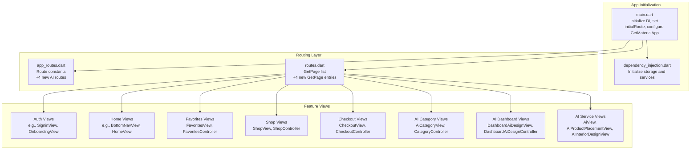
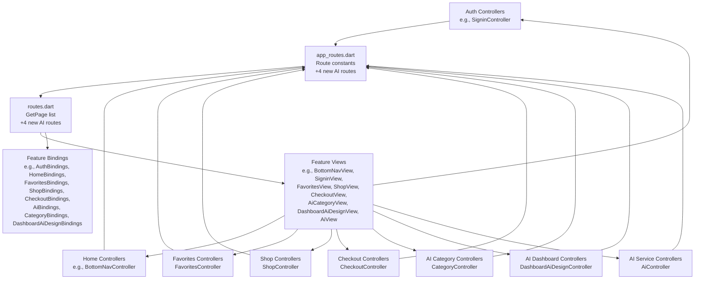
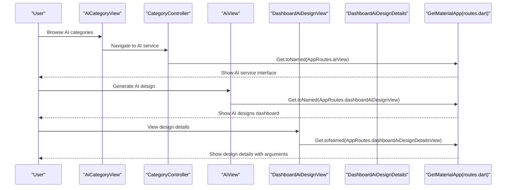
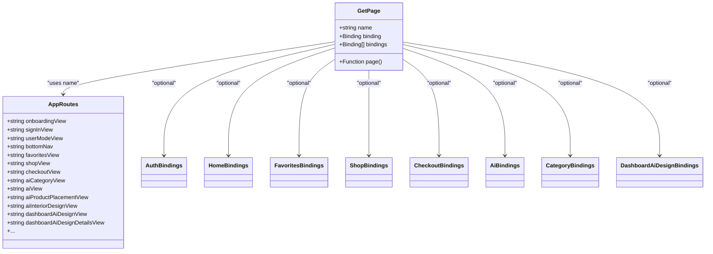
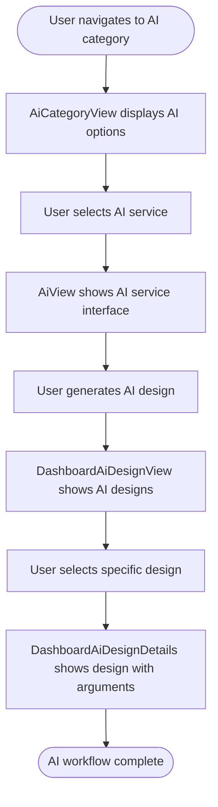
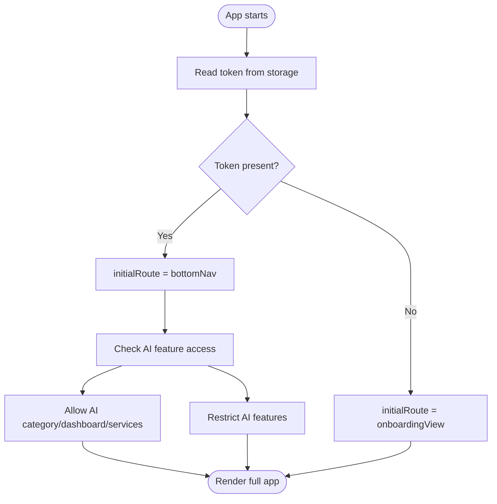
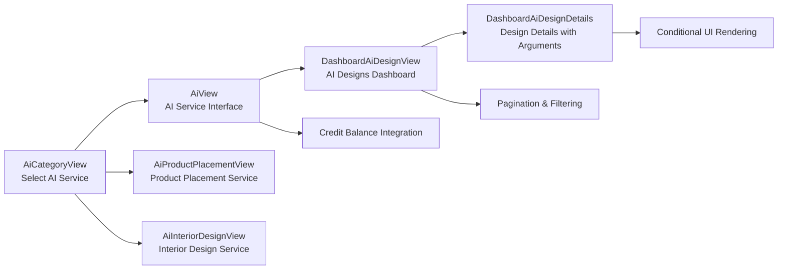
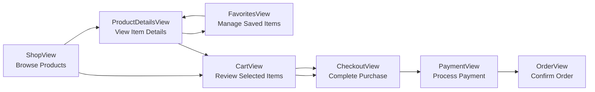
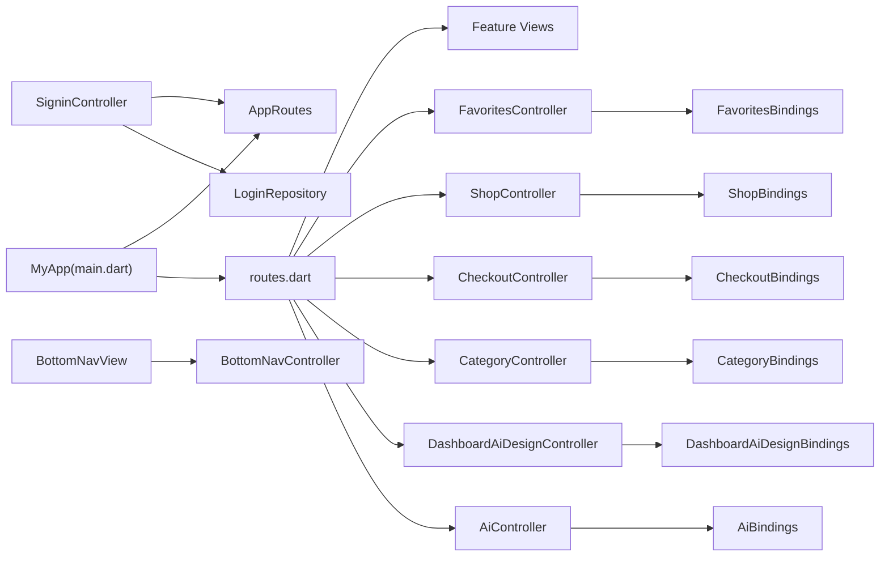

# Routing and Navigation

<cite>
**Referenced Files in This Document**
- [main.dart](file://lib/main.dart)
- [app_routes.dart](file://lib/core/routes/app_routes.dart)
- [routes.dart](file://lib/core/routes/routes.dart)
- [dependency_injection.dart](file://lib/core/di/dependency_injection.dart)
- [signin_controller.dart](file://lib/features/auth/controller/signin_controller.dart)
- [bottom_nav_view.dart](file://lib/features/home/views/bottom_nav_view.dart)
- [bottom_nav_controller.dart](file://lib/features/home/controller/bottom_nav_controller.dart)
- [onboarding_controller.dart](file://lib/features/auth/controller/onboarding_controller.dart)
- [favorites_view.dart](file://lib/features/favorites/views/favorites_view.dart)
- [shop_view.dart](file://lib/features/shop/views/shop_view.dart)
- [checkout_view.dart](file://lib/features/cart/views/checkout_view.dart)
- [favorites_bindings.dart](file://lib/features/favorites/bindings/favorites_bindings.dart)
- [shop_bindings.dart](file://lib/features/shop/bindings/shop_bindings.dart)
- [checkout_bindings.dart](file://lib/features/cart/bindings/checkout_bindings.dart)
- [ai_view.dart](file://lib/features/ai/views/ai_view.dart)
- [ai_bindings.dart](file://lib/features/ai/bindings/ai_bindings.dart)
- [ai_controller.dart](file://lib/features/ai/controller/ai_controller.dart)
- [ai_category_view.dart](file://lib/features/category/views/ai_category_view.dart)
- [dashboard_ai_design_view.dart](file://lib/features/dashboard_ai_design/views/dashboard_ai_design_view.dart)
- [dashboard_ai_design_details.dart](file://lib/features/dashboard_ai_design/views/dashboard_ai_design_details.dart)
</cite>

## Update Summary
**Changes Made**
- Added comprehensive documentation for new AI category and AI view routes
- Updated route constants section to include AI design routes: aiCategoryView, aiView, aiProductPlacementView, aiInteriorDesignView
- Enhanced route definitions section with detailed coverage of AI feature integration
- Added new sections covering AI category navigation, AI design dashboard, and AI service routes
- Updated architecture diagrams to reflect the expanded AI feature set
- Enhanced navigation flow documentation with AI integration patterns
- Replaced old AI design routes with new dashboard AI design routes

## Table of Contents
1. [Introduction](#introduction)
2. [Project Structure](#project-structure)
3. [Core Components](#core-components)
4. [Architecture Overview](#architecture-overview)
5. [Detailed Component Analysis](#detailed-component-analysis)
6. [Expanded Feature Routes](#expanded-feature-routes)
7. [AI Integration](#ai-integration)
8. [E-commerce Integration](#e-commerce-integration)
9. [Dependency Analysis](#dependency-analysis)
10. [Performance Considerations](#performance-considerations)
11. [Troubleshooting Guide](#troubleshooting-guide)
12. [Conclusion](#conclusion)

## Introduction
This document explains the routing and navigation system of the ZB-DEZINE application. It focuses on route definition patterns, navigation logic, page transitions, and how the system integrates with the MVVM pattern and controller-based navigation. The documentation covers the AppRoutes class, route constants, navigation helpers, programmatic navigation, deep linking considerations, and navigation state management. The system now includes comprehensive AI integration with category-based navigation, dashboard AI design management, and specialized AI service routes.

## Project Structure
The routing system is implemented using the GetX package and organized under the core routes module. The application initializes routes via a central list of pages and route constants. Controllers orchestrate navigation after business logic completion. The expanded system now includes dedicated routes for AI category navigation, AI design dashboard, and specialized AI service implementations.

**Diagram sources**
- [main.dart:12-46](file://lib/main.dart#L12-L46)
- [dependency_injection.dart:11-26](file://lib/core/di/dependency_injection.dart#L11-L26)
- [app_routes.dart:1-42](file://lib/core/routes/app_routes.dart#L1-L42)
- [routes.dart:63-254](file://lib/core/routes/routes.dart#L63-L254)

**Section sources**
- [main.dart:12-46](file://lib/main.dart#L12-L46)
- [dependency_injection.dart:11-26](file://lib/core/di/dependency_injection.dart#L11-L26)
- [app_routes.dart:1-42](file://lib/core/routes/app_routes.dart#L1-L42)
- [routes.dart:63-254](file://lib/core/routes/routes.dart#L63-L254)

## Core Components
- AppRoutes: Centralized route constants used for programmatic navigation and deep linking, now expanded with 4 new AI routes for AI category navigation and AI service management.
- routes.dart: Defines all named routes using GetPage entries, each mapping a route constant to a view and its associated binding(s).
- main.dart: Initializes the app with GetMaterialApp, sets the initial route based on authentication state, and registers all pages.

Key responsibilities:
- Route constants: Provide a single source of truth for route names, including AI category, AI dashboard, and AI service routes.
- GetPage list: Declares all pages, their constructors, and bindings for dependency injection.
- Initial route selection: Chooses onboarding or bottom navigation based on token presence.
- AI integration: Supports seamless navigation between AI category selection, AI design dashboard, and specialized AI services.

**Section sources**
- [app_routes.dart:1-42](file://lib/core/routes/app_routes.dart#L1-L42)
- [routes.dart:63-254](file://lib/core/routes/routes.dart#L63-L254)
- [main.dart:36-40](file://lib/main.dart#L36-L40)

## Architecture Overview
The routing architecture follows MVVM with GetX and now includes comprehensive AI capabilities:
- Views are thin and delegate UI logic to controllers.
- Controllers perform navigation after completing business operations.
- Bindings connect controllers and models to the view lifecycle.
- Route constants and GetPage definitions decouple navigation from view code.
- AI routes support category-based navigation, dashboard management, and specialized AI service implementations.

**Diagram sources**
- [signin_controller.dart:9-52](file://lib/features/auth/controller/signin_controller.dart#L9-L52)
- [bottom_nav_controller.dart:7-17](file://lib/features/home/controller/bottom_nav_controller.dart#L7-L17)
- [bottom_nav_view.dart:11-256](file://lib/features/home/views/bottom_nav_view.dart#L11-L256)
- [favorites_bindings.dart:4-9](file://lib/features/favorites/bindings/favorites_bindings.dart#L4-L9)
- [shop_bindings.dart:4-9](file://lib/features/shop/bindings/shop_bindings.dart#L4-L9)
- [checkout_bindings.dart:4-9](file://lib/features/cart/bindings/checkout_bindings.dart#L4-L9)
- [ai_bindings.dart:4-9](file://lib/features/ai/bindings/ai_bindings.dart#L4-L9)
- [ai_controller.dart:7-94](file://lib/features/ai/controller/ai_controller.dart#L7-L94)
- [routes.dart:63-254](file://lib/core/routes/routes.dart#L63-L254)
- [app_routes.dart:1-42](file://lib/core/routes/app_routes.dart#L1-L42)

## Detailed Component Analysis

### AppRoutes and Route Constants
- Purpose: Define all route names as static constants for type-safe navigation, now including 4 new AI routes for AI category navigation and AI service management.
- Usage: Controllers call Get.toNamed(AppRoutes.<name>) to navigate programmatically.
- Benefits: Centralization reduces typos and simplifies refactoring.
- New AI routes: aiCategoryView, aiView, aiProductPlacementView, aiInteriorDesignView.

Examples of usage:
- Programmatic navigation after successful login.
- Navigating from onboarding to authentication modes.
- AI flow: aiCategoryView → aiView → dashboardAiDesignView → dashboardAiDesignDetailsView.

**Section sources**
- [app_routes.dart:1-42](file://lib/core/routes/app_routes.dart#L1-L42)
- [signin_controller.dart:32](file://lib/features/auth/controller/signin_controller.dart#L32)

### Navigation Flow and Page Transitions
- Programmatic navigation: Controllers call Get.toNamed(routeName) to switch screens.
- Bottom navigation: BottomNavView renders the selected page from BottomNavController.
- Initial route: Set based on token availability during app startup.
- AI navigation: Seamless flow between AI category selection, AI service implementation, and dashboard management.

**Diagram sources**
- [ai_category_view.dart:37-40](file://lib/features/category/views/ai_category_view.dart#L37-L40)
- [ai_view.dart:1-26](file://lib/features/ai/views/ai_view.dart#L1-26)
- [dashboard_ai_design_view.dart:14-55](file://lib/features/dashboard_ai_design/views/dashboard_ai_design_view.dart#L14-L55)
- [dashboard_ai_design_details.dart:16-78](file://lib/features/dashboard_ai_design/views/dashboard_ai_design_details.dart#L16-L78)
- [routes.dart:243-252](file://lib/core/routes/routes.dart#L243-L252)

**Section sources**
- [signin_controller.dart:17-36](file://lib/features/auth/controller/signin_controller.dart#L17-L36)
- [bottom_nav_view.dart:17-21](file://lib/features/home/views/bottom_nav_view.dart#L17-L21)
- [bottom_nav_controller.dart:7-17](file://lib/features/home/controller/bottom_nav_controller.dart#L7-L17)

### Route Definitions and Bindings
- Each route is defined as a GetPage with:
  - name: Route constant from AppRoutes.
  - page: Constructor for the view widget.
  - binding/bindings: One or more bindings for dependency injection and controller lifecycle.
- Bindings connect controllers and models to the view lifecycle.
- New AI bindings: AiBindings, CategoryBindings, DashboardAiDesignBindings.

**Diagram sources**
- [routes.dart:63-254](file://lib/core/routes/routes.dart#L63-L254)
- [app_routes.dart:1-42](file://lib/core/routes/app_routes.dart#L1-L42)
- [ai_bindings.dart:4-9](file://lib/features/ai/bindings/ai_bindings.dart#L4-L9)
- [routes.dart:243-252](file://lib/core/routes/routes.dart#L243-L252)

**Section sources**
- [routes.dart:63-254](file://lib/core/routes/routes.dart#L63-L254)

### Navigation State Management
- Bottom navigation state: Managed by BottomNavController, which holds the current selected index and page stack.
- UI updates: BottomNavView observes controller state and rebuilds the visible page.
- Local gestures: OnboardingController demonstrates gesture-driven navigation within a view.
- AI state: Controllers manage AI category selection, AI service execution, and AI design dashboard navigation.

**Diagram sources**
- [ai_category_view.dart:33-96](file://lib/features/category/views/ai_category_view.dart#L33-L96)
- [ai_view.dart:7-25](file://lib/features/ai/views/ai_view.dart#L7-25)
- [dashboard_ai_design_view.dart:14-55](file://lib/features/dashboard_ai_design/views/dashboard_ai_design_view.dart#L14-55)
- [dashboard_ai_design_details.dart:21-77](file://lib/features/dashboard_ai_design/views/dashboard_ai_design_details.dart#L21-77)

**Section sources**
- [bottom_nav_view.dart:17-21](file://lib/features/home/views/bottom_nav_view.dart#L17-L21)
- [bottom_nav_controller.dart:7-17](file://lib/features/home/controller/bottom_nav_controller.dart#L7-L17)
- [onboarding_controller.dart:47-68](file://lib/features/auth/controller/onboarding_controller.dart#L47-L68)

### Parameter Passing and Deep Linking
- Programmatic navigation: Controllers use Get.toNamed(AppRoutes.<name>) to navigate without parameters.
- Parameter passing: Use Get.toNamed(routeName, arguments: payload) to pass data between screens.
- Deep linking: Configure initialRoute and handle external URLs by setting initialRoute to a dynamic route and resolving parameters in the target view.
- AI parameters: Category titles, sub-titles, and AI design model objects can be passed between AI category, AI service, and dashboard views.

Note: The current implementation uses argument passing for AI design details view to receive AiDesignModel objects. To enable deep linking for AI features, define routes that accept parameters and initialize state accordingly.

**Section sources**
- [signin_controller.dart:32](file://lib/features/auth/controller/signin_controller.dart#L32)
- [main.dart:37-39](file://lib/main.dart#L37-L39)
- [dashboard_ai_design_details.dart:21](file://lib/features/dashboard_ai_design/views/dashboard_ai_design_details.dart#L21)

### Route Guards and Authentication Flow
- Initial route guard: The app chooses onboarding or bottomNav based on token presence.
- Post-login guard: After storing credentials, controllers redirect to bottomNav.
- Future enhancements: Add guards to protect protected routes by checking token validity before rendering.
- AI access control: Ensure users can only access AI features after authentication and proper credit balance validation.

**Diagram sources**
- [main.dart:14-18](file://lib/main.dart#L14-L18)
- [main.dart:37-39](file://lib/main.dart#L37-L39)
- [dependency_injection.dart:21-24](file://lib/core/di/dependency_injection.dart#L21-L24)

**Section sources**
- [main.dart:14-18](file://lib/main.dart#L14-L18)
- [main.dart:37-39](file://lib/main.dart#L37-L39)
- [dependency_injection.dart:21-24](file://lib/core/di/dependency_injection.dart#L21-L24)

## Expanded Feature Routes

### AI Category Navigation System
The AI category system provides users with structured access to different AI services:

- **Route**: aiCategoryView (`/aiCategoryView`)
- **Controller**: CategoryController manages AI service options and user selections
- **View**: AiCategoryView displays AI service categories with interactive cards
- **Binding**: CategoryBindings handles lazy initialization of the category controller

Key features:
- Category-based AI service filtering
- Interactive card-based navigation
- Dynamic AI option generation
- Argument passing for service details

**Section sources**
- [app_routes.dart:37](file://lib/core/routes/app_routes.dart#L37)
- [routes.dart:243-247](file://lib/core/routes/routes.dart#L243-L247)
- [ai_category_view.dart:13-104](file://lib/features/category/views/ai_category_view.dart#L13-L104)

### AI Service Implementation System
The AI service system provides specialized AI functionality for interior design and product placement:

- **Route**: aiView (`/aiView`)
- **Controller**: AiController manages AI service execution and credit balance
- **View**: AiView provides the main AI service interface with header and image components
- **Binding**: AiBindings handles lazy initialization of the AI controller

Key features:
- Credit balance integration
- Dropdown credit selection
- Overlay-based UI components
- AI service execution management

**Section sources**
- [app_routes.dart:38](file://lib/core/routes/app_routes.dart#L38)
- [routes.dart:248-252](file://lib/core/routes/routes.dart#L248-L252)
- [ai_bindings.dart:4-9](file://lib/features/ai/bindings/ai_bindings.dart#L4-L9)
- [ai_controller.dart:7-94](file://lib/features/ai/controller/ai_controller.dart#L7-L94)

### AI Product Placement System
The AI product placement system specializes in virtual product placement within interior spaces:

- **Route**: aiProductPlacementView (`/aiProductPlacementView`)
- **Controller**: AiProductPlacementController manages product placement algorithms
- **View**: AiProductPlacementView provides the product placement interface
- **Binding**: AiProductPlacementBindings handles controller initialization

Key features:
- Virtual product placement visualization
- Room layout integration
- Product positioning algorithms
- Real-time preview capabilities

**Section sources**
- [app_routes.dart:39](file://lib/core/routes/app_routes.dart#L39)
- [routes.dart:248-252](file://lib/core/routes/routes.dart#L248-L252)

### AI Interior Design System
The AI interior design system provides comprehensive room design and decoration services:

- **Route**: aiInteriorDesignView (`/aiInteriorDesignView`)
- **Controller**: AiInteriorDesignController manages interior design algorithms
- **View**: AiInteriorDesignView provides the interior design interface
- **Binding**: AiInteriorDesignBindings handles controller initialization

Key features:
- Room design algorithms
- Color scheme recommendations
- Furniture arrangement suggestions
- Style-based design generation

**Section sources**
- [app_routes.dart:40](file://lib/core/routes/app_routes.dart#L40)
- [routes.dart:248-252](file://lib/core/routes/routes.dart#L248-L252)

### Dashboard AI Design Management System
The dashboard AI design system provides centralized management of generated AI designs:

- **Route**: dashboardAiDesignView (`/dashboardAiDesignView`)
- **Controller**: DashboardAiDesignController manages AI design listing and pagination
- **View**: DashboardAiDesignView displays AI designs in a table format with pagination
- **Binding**: DashboardAiDesignBindings handles controller initialization

Key features:
- AI design listing and management
- Pagination support
- Design table visualization
- Drawer integration for navigation

**Section sources**
- [app_routes.dart:24](file://lib/core/routes/app_routes.dart#L24)
- [routes.dart:178-187](file://lib/core/routes/routes.dart#L178-L187)
- [dashboard_ai_design_view.dart:14-55](file://lib/features/dashboard_ai_design/views/dashboard_ai_design_view.dart#L14-L55)

### AI Design Details Management System
The AI design details system provides comprehensive viewing and management of individual AI designs:

- **Route**: dashboardAiDesignDetailsView (`/dashboardAiDesignDetailsView`)
- **Controller**: DashboardAiDesignController manages individual design details
- **View**: DashboardAiDesignDetails displays design information with conditional rendering
- **Binding**: DashboardAiDesignBindings handles controller initialization

Key features:
- Individual design detail viewing
- Conditional UI rendering based on design type
- Back navigation support
- Design image visualization

**Section sources**
- [app_routes.dart:25](file://lib/core/routes/app_routes.dart#L25)
- [routes.dart:188-197](file://lib/core/routes/routes.dart#L188-L197)
- [dashboard_ai_design_details.dart:16-78](file://lib/features/dashboard_ai_design/views/dashboard_ai_design_details.dart#L16-L78)

## AI Integration

### Comprehensive AI Workflow
The expanded routing system creates a complete AI service experience:

**Diagram sources**
- [routes.dart:243-252](file://lib/core/routes/routes.dart#L243-L252)
- [app_routes.dart:24-40](file://lib/core/routes/app_routes.dart#L24-L40)

### Data Flow Between AI Features
The routing system facilitates smooth data transfer between AI features:

- **Category Information**: Passed as arguments from AiCategoryView to AiView
- **AI Design Models**: Shared between DashboardAiDesignView and DashboardAiDesignDetails
- **Credit Balance**: Integrated across AI service views and dashboard
- **Service Selection**: Managed through CategoryController state

### Navigation Patterns
Common navigation patterns in the AI workflow:
- Back navigation using standard Flutter Navigator.pop()
- Deep linking to specific AI services via category selection
- Direct access to dashboard from AI service completion
- Conditional navigation based on AI design type

**Section sources**
- [ai_category_view.dart:37-40](file://lib/features/category/views/ai_category_view.dart#L37-L40)
- [dashboard_ai_design_view.dart:46-49](file://lib/features/dashboard_ai_design/views/dashboard_ai_design_view.dart#L46-L49)
- [dashboard_ai_design_details.dart:58-61](file://lib/features/dashboard_ai_design/views/dashboard_ai_design_details.dart#L58-L61)

## E-commerce Integration

### Seamless Shopping Experience
The expanded routing system creates a cohesive e-commerce experience:

**Diagram sources**
- [routes.dart:214-238](file://lib/core/routes/routes.dart#L214-L238)
- [app_routes.dart:31-36](file://lib/core/routes/app_routes.dart#L31-L36)

### Data Flow Between Features
The routing system facilitates smooth data transfer between e-commerce features:

- **Product Information**: Shared between shop, product details, and favorites views
- **Shopping Cart**: Maintained across cart and checkout views
- **User Preferences**: Synced between favorites and shop filtering
- **Order History**: Connected to order management and transaction views

### Navigation Patterns
Common navigation patterns in the e-commerce flow:
- Back navigation using standard Flutter Navigator.pop()
- Deep linking to specific product categories
- Direct access to checkout from cart
- Favorites integration in product browsing

**Section sources**
- [shop_view.dart:27-33](file://lib/features/shop/views/shop_view.dart#L27-L33)
- [favorites_view.dart:27-33](file://lib/features/favorites/views/favorites_view.dart#L27-L33)
- [checkout_view.dart:33-39](file://lib/features/cart/views/checkout_view.dart#L33-L39)

## Dependency Analysis
- Coupling: Controllers depend on AppRoutes for navigation and on repositories/services for business logic.
- Cohesion: Each feature's bindings encapsulate its controllers and models.
- External dependencies: GetX provides routing, state, and dependency injection.
- AI dependencies: New AI features integrate with existing auth, dashboard, and credit balance systems.

**Diagram sources**
- [signin_controller.dart:9-52](file://lib/features/auth/controller/signin_controller.dart#L9-L52)
- [bottom_nav_view.dart:11-256](file://lib/features/home/views/bottom_nav_view.dart#L11-L256)
- [favorites_bindings.dart:4-9](file://lib/features/favorites/bindings/favorites_bindings.dart#L4-L9)
- [shop_bindings.dart:4-9](file://lib/features/shop/bindings/shop_bindings.dart#L4-L9)
- [checkout_bindings.dart:4-9](file://lib/features/cart/bindings/checkout_bindings.dart#L4-L9)
- [ai_bindings.dart:4-9](file://lib/features/ai/bindings/ai_bindings.dart#L4-L9)
- [main.dart:30-41](file://lib/main.dart#L30-L41)
- [routes.dart:63-254](file://lib/core/routes/routes.dart#L63-L254)

**Section sources**
- [signin_controller.dart:9-52](file://lib/features/auth/controller/signin_controller.dart#L9-L52)
- [bottom_nav_view.dart:11-256](file://lib/features/home/views/bottom_nav_view.dart#L11-L256)
- [main.dart:30-41](file://lib/main.dart#L30-L41)
- [routes.dart:63-254](file://lib/core/routes/routes.dart#L63-L254)

## Performance Considerations
- Prefer named navigation with AppRoutes to avoid string duplication and reduce runtime overhead.
- Use bindings to lazily initialize controllers and models only when a route is accessed.
- Minimize rebuilds by observing only necessary state in views (e.g., Obx around minimal UI regions).
- Avoid heavy work in constructors; defer to onInit or first use.
- AI optimization: Implement lazy loading for AI service components and optimize credit balance queries.
- Favorites caching: Store frequently accessed favorites locally to improve performance.
- Dashboard pagination: Use pagination for AI design lists to prevent memory issues.

## Troubleshooting Guide
Common issues and resolutions:
- Route not found: Ensure the route constant exists in AppRoutes and a GetPage entry exists in routes.dart.
- Navigation not triggering: Verify controllers call Get.toNamed with the correct AppRoutes constant.
- State not updating: Confirm controllers update observable state and views observe the state via GetView/Obx.
- Initial route incorrect: Check token retrieval and initialRoute assignment in main.dart.
- AI routes failing: Verify new GetPage entries include proper bindings and view imports.
- AI parameter passing: Ensure arguments are properly typed when passing AiDesignModel objects.
- Dashboard navigation: Verify dashboard routes are properly configured with appropriate bindings.
- Favorites not persisting: Ensure favorites controller has proper persistence setup.
- Checkout errors: Check that checkout controller validates required fields before navigation.

**Section sources**
- [app_routes.dart:1-42](file://lib/core/routes/app_routes.dart#L1-L42)
- [routes.dart:63-254](file://lib/core/routes/routes.dart#L63-L254)
- [main.dart:36-40](file://lib/main.dart#L36-L40)

## Conclusion
The ZB-DEZINE routing and navigation system leverages GetX to provide a clean separation of concerns with comprehensive AI capabilities. AppRoutes centralizes route names, routes.dart defines pages and bindings, and controllers orchestrate navigation after business logic. The expanded system now includes AI category navigation, AI service implementations, dashboard AI design management, and comprehensive e-commerce features, creating a seamless integrated experience. The system supports programmatic navigation, bottom navigation state management, AI workflow navigation, and initial route selection based on authentication state. The addition of AI routes enhances user engagement by providing specialized AI services alongside traditional e-commerce functionality. Extending the system with parameter passing, deep linking, and route guards will further enhance robustness and user experience across both AI and e-commerce features.