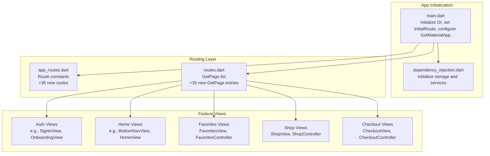
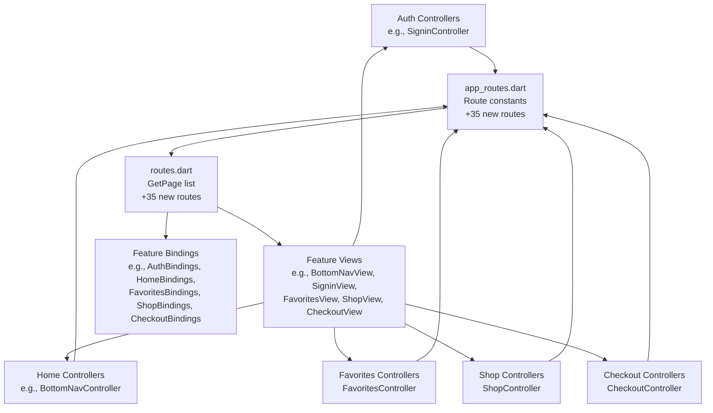
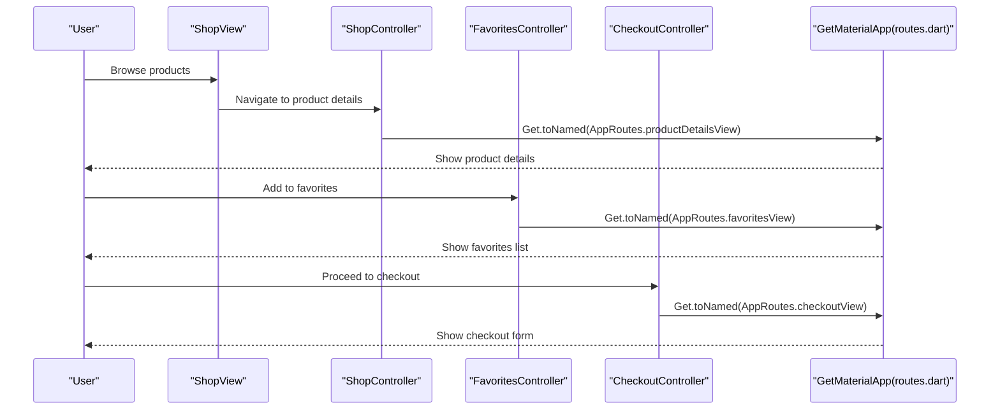
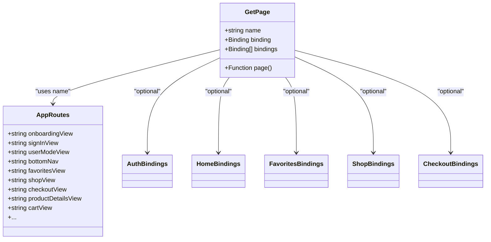
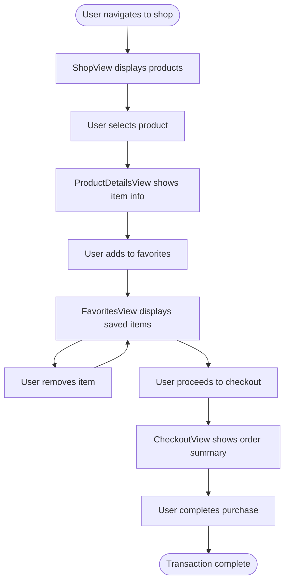
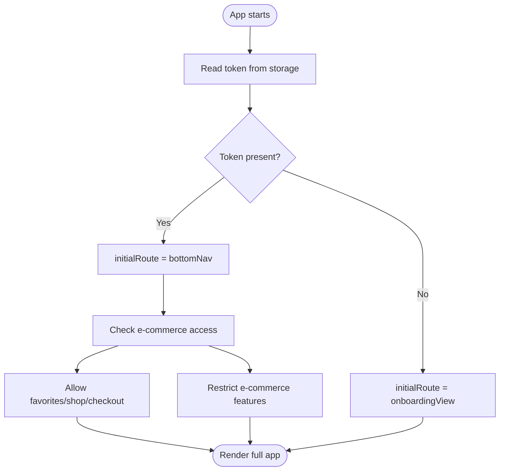
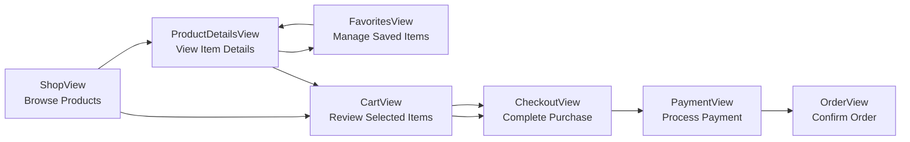
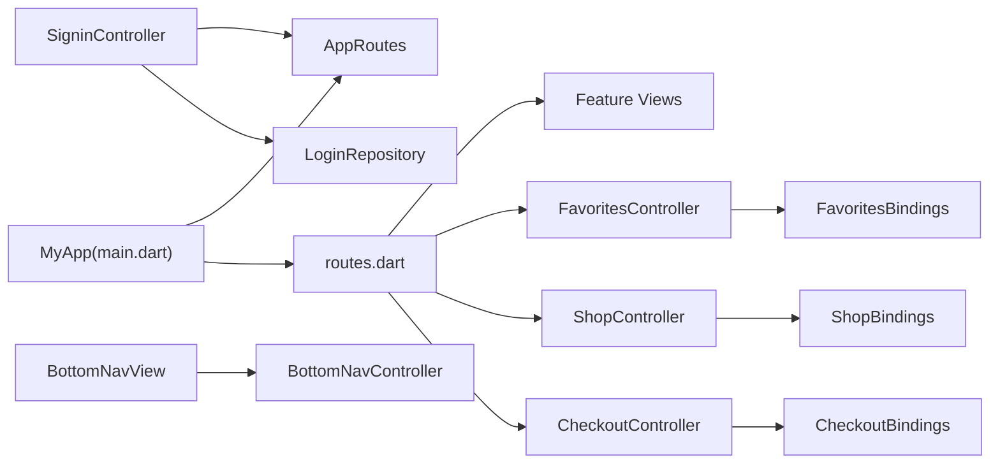

# Routing and Navigation

<cite>
**Referenced Files in This Document**
- [main.dart](file://lib/main.dart)
- [app_routes.dart](file://lib/core/routes/app_routes.dart)
- [routes.dart](file://lib/core/routes/routes.dart)
- [dependency_injection.dart](file://lib/core/di/dependency_injection.dart)
- [signin_controller.dart](file://lib/features/auth/controller/signin_controller.dart)
- [bottom_nav_view.dart](file://lib/features/home/views/bottom_nav_view.dart)
- [bottom_nav_controller.dart](file://lib/features/home/controller/bottom_nav_controller.dart)
- [onboarding_controller.dart](file://lib/features/auth/controller/onboarding_controller.dart)
- [favorites_view.dart](file://lib/features/favorites/views/favorites_view.dart)
- [shop_view.dart](file://lib/features/shop/views/shop_view.dart)
- [checkout_view.dart](file://lib/features/cart/views/checkout_view.dart)
- [favorites_bindings.dart](file://lib/features/favorites/bindings/favorites_bindings.dart)
- [shop_bindings.dart](file://lib/features/shop/bindings/shop_bindings.dart)
- [checkout_bindings.dart](file://lib/features/cart/bindings/checkout_bindings.dart)
</cite>

## Update Summary
**Changes Made**
- Added comprehensive documentation for new favorites, shop, and checkout route systems
- Updated route constants section to include new shopping and e-commerce features
- Enhanced route definitions section with detailed coverage of the expanded routing system
- Added new sections covering favorites management, shop browsing, and checkout processes
- Updated architecture diagrams to reflect the expanded feature set
- Enhanced navigation flow documentation with e-commerce integration patterns

## Table of Contents
1. [Introduction](#introduction)
2. [Project Structure](#project-structure)
3. [Core Components](#core-components)
4. [Architecture Overview](#architecture-overview)
5. [Detailed Component Analysis](#detailed-component-analysis)
6. [Expanded Feature Routes](#expanded-feature-routes)
7. [E-commerce Integration](#e-commerce-integration)
8. [Dependency Analysis](#dependency-analysis)
9. [Performance Considerations](#performance-considerations)
10. [Troubleshooting Guide](#troubleshooting-guide)
11. [Conclusion](#conclusion)

## Introduction
This document explains the routing and navigation system of the ZB-DEZINE application. It focuses on route definition patterns, navigation logic, page transitions, and how the system integrates with the MVVM pattern and controller-based navigation. The documentation covers the AppRoutes class, route constants, navigation helpers, programmatic navigation, deep linking considerations, and navigation state management. The system now includes comprehensive e-commerce functionality with favorites management, shop browsing, and checkout processes.

## Project Structure
The routing system is implemented using the GetX package and organized under the core routes module. The application initializes routes via a central list of pages and route constants. Controllers orchestrate navigation after business logic completion. The expanded system now includes dedicated routes for favorites, shop browsing, and checkout processes.

**Diagram sources**
- [main.dart:12-46](file://lib/main.dart#L12-L46)
- [dependency_injection.dart:11-26](file://lib/core/di/dependency_injection.dart#L11-L26)
- [app_routes.dart:1-38](file://lib/core/routes/app_routes.dart#L1-L38)
- [routes.dart:63-239](file://lib/core/routes/routes.dart#L63-L239)

**Section sources**
- [main.dart:12-46](file://lib/main.dart#L12-L46)
- [dependency_injection.dart:11-26](file://lib/core/di/dependency_injection.dart#L11-L26)
- [app_routes.dart:1-38](file://lib/core/routes/app_routes.dart#L1-L38)
- [routes.dart:63-239](file://lib/core/routes/routes.dart#L63-L239)

## Core Components
- AppRoutes: Centralized route constants used for programmatic navigation and deep linking, now expanded with 35 new routes for e-commerce features.
- routes.dart: Defines all named routes using GetPage entries, each mapping a route constant to a view and its associated binding(s).
- main.dart: Initializes the app with GetMaterialApp, sets the initial route based on authentication state, and registers all pages.

Key responsibilities:
- Route constants: Provide a single source of truth for route names, including favorites, shop, and checkout routes.
- GetPage list: Declares all pages, their constructors, and bindings for dependency injection.
- Initial route selection: Chooses onboarding or bottom navigation based on token presence.
- E-commerce integration: Supports seamless navigation between shopping, favorites, and checkout flows.

**Section sources**
- [app_routes.dart:1-38](file://lib/core/routes/app_routes.dart#L1-L38)
- [routes.dart:63-239](file://lib/core/routes/routes.dart#L63-L239)
- [main.dart:36-40](file://lib/main.dart#L36-L40)

## Architecture Overview
The routing architecture follows MVVM with GetX and now includes comprehensive e-commerce capabilities:
- Views are thin and delegate UI logic to controllers.
- Controllers perform navigation after completing business operations.
- Bindings connect controllers and models to the view lifecycle.
- Route constants and GetPage definitions decouple navigation from view code.
- E-commerce routes support favorites management, product browsing, and secure checkout processes.

**Diagram sources**
- [signin_controller.dart:9-52](file://lib/features/auth/controller/signin_controller.dart#L9-L52)
- [bottom_nav_controller.dart:7-17](file://lib/features/home/controller/bottom_nav_controller.dart#L7-L17)
- [bottom_nav_view.dart:11-256](file://lib/features/home/views/bottom_nav_view.dart#L11-L256)
- [favorites_bindings.dart:4-9](file://lib/features/favorites/bindings/favorites_bindings.dart#L4-L9)
- [shop_bindings.dart:4-9](file://lib/features/shop/bindings/shop_bindings.dart#L4-L9)
- [checkout_bindings.dart:4-9](file://lib/features/cart/bindings/checkout_bindings.dart#L4-L9)
- [routes.dart:63-239](file://lib/core/routes/routes.dart#L63-L239)
- [app_routes.dart:1-38](file://lib/core/routes/app_routes.dart#L1-L38)

## Detailed Component Analysis

### AppRoutes and Route Constants
- Purpose: Define all route names as static constants for type-safe navigation, now including 35 new routes for e-commerce features.
- Usage: Controllers call Get.toNamed(AppRoutes.<name>) to navigate programmatically.
- Benefits: Centralization reduces typos and simplifies refactoring.
- New e-commerce routes: favoritesView, shopView, checkoutView, productDetailsView, cartView.

Examples of usage:
- Programmatic navigation after successful login.
- Navigating from onboarding to authentication modes.
- E-commerce flow: shop → product details → cart → checkout → payment.

**Section sources**
- [app_routes.dart:1-38](file://lib/core/routes/app_routes.dart#L1-L38)
- [signin_controller.dart:32](file://lib/features/auth/controller/signin_controller.dart#L32)

### Navigation Flow and Page Transitions
- Programmatic navigation: Controllers call Get.toNamed(routeName) to switch screens.
- Bottom navigation: BottomNavView renders the selected page from BottomNavController.
- Initial route: Set based on token availability during app startup.
- E-commerce navigation: Seamless flow between shop browsing, favorites management, and checkout processes.

**Diagram sources**
- [shop_view.dart:11-45](file://lib/features/shop/views/shop_view.dart#L11-L45)
- [favorites_view.dart:11-45](file://lib/features/favorites/views/favorites_view.dart#L11-L45)
- [checkout_view.dart:17-67](file://lib/features/cart/views/checkout_view.dart#L17-L67)
- [routes.dart:224-238](file://lib/core/routes/routes.dart#L224-L238)

**Section sources**
- [signin_controller.dart:17-36](file://lib/features/auth/controller/signin_controller.dart#L17-L36)
- [bottom_nav_view.dart:17-21](file://lib/features/home/views/bottom_nav_view.dart#L17-L21)
- [bottom_nav_controller.dart:7-17](file://lib/features/home/controller/bottom_nav_controller.dart#L7-L17)

### Route Definitions and Bindings
- Each route is defined as a GetPage with:
  - name: Route constant from AppRoutes.
  - page: Constructor for the view widget.
  - binding/bindings: One or more bindings for dependency injection and controller lifecycle.
- Bindings connect controllers and models to the view lifecycle.
- New e-commerce bindings: FavoritesBindings, ShopBindings, CheckoutBindings.

**Diagram sources**
- [routes.dart:63-239](file://lib/core/routes/routes.dart#L63-L239)
- [app_routes.dart:1-38](file://lib/core/routes/app_routes.dart#L1-L38)
- [favorites_bindings.dart:4-9](file://lib/features/favorites/bindings/favorites_bindings.dart#L4-L9)
- [shop_bindings.dart:4-9](file://lib/features/shop/bindings/shop_bindings.dart#L4-L9)
- [checkout_bindings.dart:4-9](file://lib/features/cart/bindings/checkout_bindings.dart#L4-L9)

**Section sources**
- [routes.dart:63-239](file://lib/core/routes/routes.dart#L63-L239)

### Navigation State Management
- Bottom navigation state: Managed by BottomNavController, which holds the current selected index and page stack.
- UI updates: BottomNavView observes controller state and rebuilds the visible page.
- Local gestures: OnboardingController demonstrates gesture-driven navigation within a view.
- E-commerce state: Controllers manage shopping cart, favorites list, and checkout progress.

**Diagram sources**
- [shop_view.dart:11-45](file://lib/features/shop/views/shop_view.dart#L11-L45)
- [favorites_view.dart:11-45](file://lib/features/favorites/views/favorites_view.dart#L11-L45)
- [checkout_view.dart:17-67](file://lib/features/cart/views/checkout_view.dart#L17-L67)

**Section sources**
- [bottom_nav_view.dart:17-21](file://lib/features/home/views/bottom_nav_view.dart#L17-L21)
- [bottom_nav_controller.dart:7-17](file://lib/features/home/controller/bottom_nav_controller.dart#L7-L17)
- [onboarding_controller.dart:47-68](file://lib/features/auth/controller/onboarding_controller.dart#L47-L68)

### Parameter Passing and Deep Linking
- Programmatic navigation: Controllers use Get.toNamed(AppRoutes.<name>) to navigate without parameters.
- Parameter passing: Use Get.toNamed(routeName, arguments: payload) to pass data between screens.
- Deep linking: Configure initialRoute and handle external URLs by setting initialRoute to a dynamic route and resolving parameters in the target view.
- E-commerce parameters: Product IDs, quantities, and user preferences can be passed between shop, favorites, and checkout views.

Note: The current implementation primarily uses named navigation without explicit argument handling. To enable deep linking, define routes that accept parameters and initialize state accordingly.

**Section sources**
- [signin_controller.dart:32](file://lib/features/auth/controller/signin_controller.dart#L32)
- [main.dart:37-39](file://lib/main.dart#L37-L39)

### Route Guards and Authentication Flow
- Initial route guard: The app chooses onboarding or bottomNav based on token presence.
- Post-login guard: After storing credentials, controllers redirect to bottomNav.
- Future enhancements: Add guards to protect protected routes by checking token validity before rendering.
- E-commerce access control: Ensure users can only access favorites and checkout after authentication.

**Diagram sources**
- [main.dart:14-18](file://lib/main.dart#L14-L18)
- [main.dart:37-39](file://lib/main.dart#L37-L39)
- [dependency_injection.dart:21-24](file://lib/core/di/dependency_injection.dart#L21-L24)

**Section sources**
- [main.dart:14-18](file://lib/main.dart#L14-L18)
- [main.dart:37-39](file://lib/main.dart#L37-L39)
- [dependency_injection.dart:21-24](file://lib/core/di/dependency_injection.dart#L21-L24)

## Expanded Feature Routes

### Favorites Management System
The favorites system provides users with the ability to save and manage their favorite products:

- **Route**: favoritesView (`/favoritesView`)
- **Controller**: FavoritesController manages favorite items and user interactions
- **View**: FavoritesView displays saved products with remove functionality
- **Binding**: FavoritesBindings handles lazy initialization of the favorites controller

Key features:
- Add/remove products from favorites
- Browse favorite items in a dedicated view
- Sync favorites with user account across devices
- Integration with product details view for quick favorite toggling

**Section sources**
- [app_routes.dart:36](file://lib/core/routes/app_routes.dart#L36)
- [routes.dart:234-238](file://lib/core/routes/routes.dart#L234-L238)
- [favorites_bindings.dart:4-9](file://lib/features/favorites/bindings/favorites_bindings.dart#L4-L9)
- [favorites_view.dart:11-45](file://lib/features/favorites/views/favorites_view.dart#L11-L45)

### Shop Browsing System
The shop system enables users to browse, search, and discover products:

- **Route**: shopView (`/shopView`)
- **Controller**: ShopController manages product listings, filters, and search functionality
- **View**: ShopView presents products with category sorting and filtering options
- **Binding**: ShopBindings handles lazy initialization of the shop controller

Key features:
- Category-based product filtering
- Price range and material filters
- Search functionality with real-time results
- Product discovery through various filter combinations

**Section sources**
- [app_routes.dart:35](file://lib/core/routes/app_routes.dart#L35)
- [routes.dart:229-233](file://lib/core/routes/routes.dart#L229-L233)
- [shop_bindings.dart:4-9](file://lib/features/shop/bindings/shop_bindings.dart#L4-L9)
- [shop_view.dart:11-45](file://lib/features/shop/views/shop_view.dart#L11-L45)

### Checkout Process System
The checkout system provides a comprehensive e-commerce purchasing flow:

- **Route**: checkoutView (`/checkoutView`)
- **Controller**: CheckoutController manages order processing, payment, and shipping information
- **View**: CheckoutView presents delivery address, payment methods, and order summary
- **Binding**: CheckoutBindings handles lazy initialization of the checkout controller

Key features:
- Multi-step checkout process
- Delivery address management
- Payment method selection
- Order summary and calculation
- Shipping membership integration

**Section sources**
- [app_routes.dart:34](file://lib/core/routes/app_routes.dart#L34)
- [routes.dart:224-228](file://lib/core/routes/routes.dart#L224-L228)
- [checkout_bindings.dart:4-9](file://lib/features/cart/bindings/checkout_bindings.dart#L4-L9)
- [checkout_view.dart:17-67](file://lib/features/cart/views/checkout_view.dart#L17-L67)

## E-commerce Integration

### Seamless Shopping Experience
The expanded routing system creates a cohesive e-commerce experience:

**Diagram sources**
- [routes.dart:214-238](file://lib/core/routes/routes.dart#L214-L238)
- [app_routes.dart:31-36](file://lib/core/routes/app_routes.dart#L31-L36)

### Data Flow Between Features
The routing system facilitates smooth data transfer between e-commerce features:

- **Product Information**: Shared between shop, product details, and favorites views
- **Shopping Cart**: Maintained across cart and checkout views
- **User Preferences**: Synced between favorites and shop filtering
- **Order History**: Connected to order management and transaction views

### Navigation Patterns
Common navigation patterns in the e-commerce flow:
- Back navigation using standard Flutter Navigator.pop()
- Deep linking to specific product categories
- Direct access to checkout from cart
- Favorites integration in product browsing

**Section sources**
- [shop_view.dart:27-33](file://lib/features/shop/views/shop_view.dart#L27-L33)
- [favorites_view.dart:27-33](file://lib/features/favorites/views/favorites_view.dart#L27-L33)
- [checkout_view.dart:33-39](file://lib/features/cart/views/checkout_view.dart#L33-L39)

## Dependency Analysis
- Coupling: Controllers depend on AppRoutes for navigation and on repositories/services for business logic.
- Cohesion: Each feature's bindings encapsulate its controllers and models.
- External dependencies: GetX provides routing, state, and dependency injection.
- E-commerce dependencies: New features integrate with existing auth, cart, and product systems.

**Diagram sources**
- [signin_controller.dart:9-52](file://lib/features/auth/controller/signin_controller.dart#L9-L52)
- [bottom_nav_view.dart:11-256](file://lib/features/home/views/bottom_nav_view.dart#L11-L256)
- [favorites_bindings.dart:4-9](file://lib/features/favorites/bindings/favorites_bindings.dart#L4-L9)
- [shop_bindings.dart:4-9](file://lib/features/shop/bindings/shop_bindings.dart#L4-L9)
- [checkout_bindings.dart:4-9](file://lib/features/cart/bindings/checkout_bindings.dart#L4-L9)
- [main.dart:30-41](file://lib/main.dart#L30-L41)
- [routes.dart:63-239](file://lib/core/routes/routes.dart#L63-L239)

**Section sources**
- [signin_controller.dart:9-52](file://lib/features/auth/controller/signin_controller.dart#L9-L52)
- [bottom_nav_view.dart:11-256](file://lib/features/home/views/bottom_nav_view.dart#L11-L256)
- [main.dart:30-41](file://lib/main.dart#L30-L41)
- [routes.dart:63-239](file://lib/core/routes/routes.dart#L63-L239)

## Performance Considerations
- Prefer named navigation with AppRoutes to avoid string duplication and reduce runtime overhead.
- Use bindings to lazily initialize controllers and models only when a route is accessed.
- Minimize rebuilds by observing only necessary state in views (e.g., Obx around minimal UI regions).
- Avoid heavy work in constructors; defer to onInit or first use.
- E-commerce optimization: Implement pagination for shop browsing and lazy loading for product lists.
- Favorites caching: Store frequently accessed favorites locally to improve performance.

## Troubleshooting Guide
Common issues and resolutions:
- Route not found: Ensure the route constant exists in AppRoutes and a GetPage entry exists in routes.dart.
- Navigation not triggering: Verify controllers call Get.toNamed with the correct AppRoutes constant.
- State not updating: Confirm controllers update observable state and views observe the state via GetView/Obx.
- Initial route incorrect: Check token retrieval and initialRoute assignment in main.dart.
- E-commerce routes failing: Verify new GetPage entries include proper bindings and view imports.
- Favorites not persisting: Ensure favorites controller has proper persistence setup.
- Checkout errors: Check that checkout controller validates required fields before navigation.

**Section sources**
- [app_routes.dart:1-38](file://lib/core/routes/app_routes.dart#L1-L38)
- [routes.dart:63-239](file://lib/core/routes/routes.dart#L63-L239)
- [main.dart:36-40](file://lib/main.dart#L36-L40)

## Conclusion
The ZB-DEZINE routing and navigation system leverages GetX to provide a clean separation of concerns with comprehensive e-commerce capabilities. AppRoutes centralizes route names, routes.dart defines pages and bindings, and controllers orchestrate navigation after business logic. The expanded system now includes favorites management, shop browsing, and checkout processes, creating a seamless shopping experience. The system supports programmatic navigation, bottom navigation state management, and initial route selection based on authentication state. The addition of e-commerce routes enhances user engagement and provides a complete shopping journey from browsing to purchase completion. Extending the system with parameter passing, deep linking, and route guards will further enhance robustness and user experience.