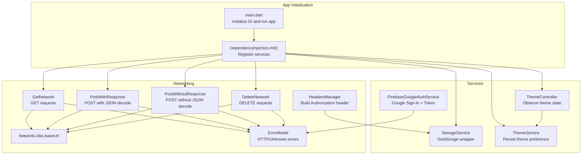
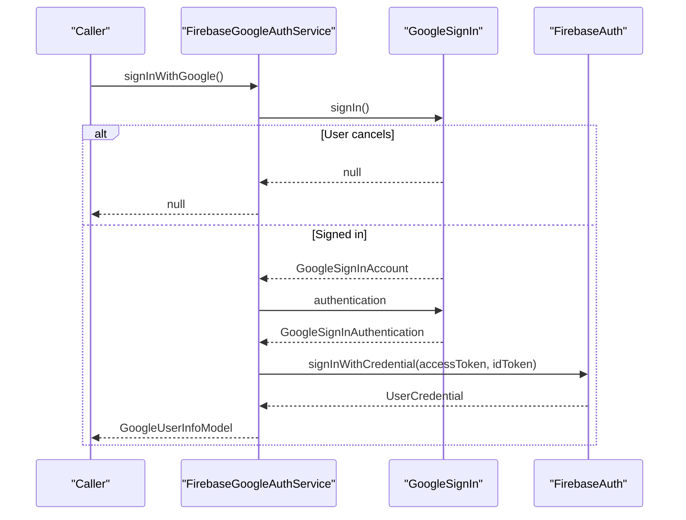
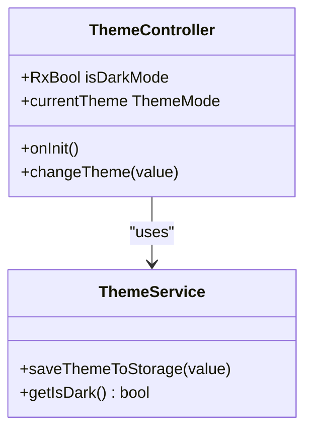
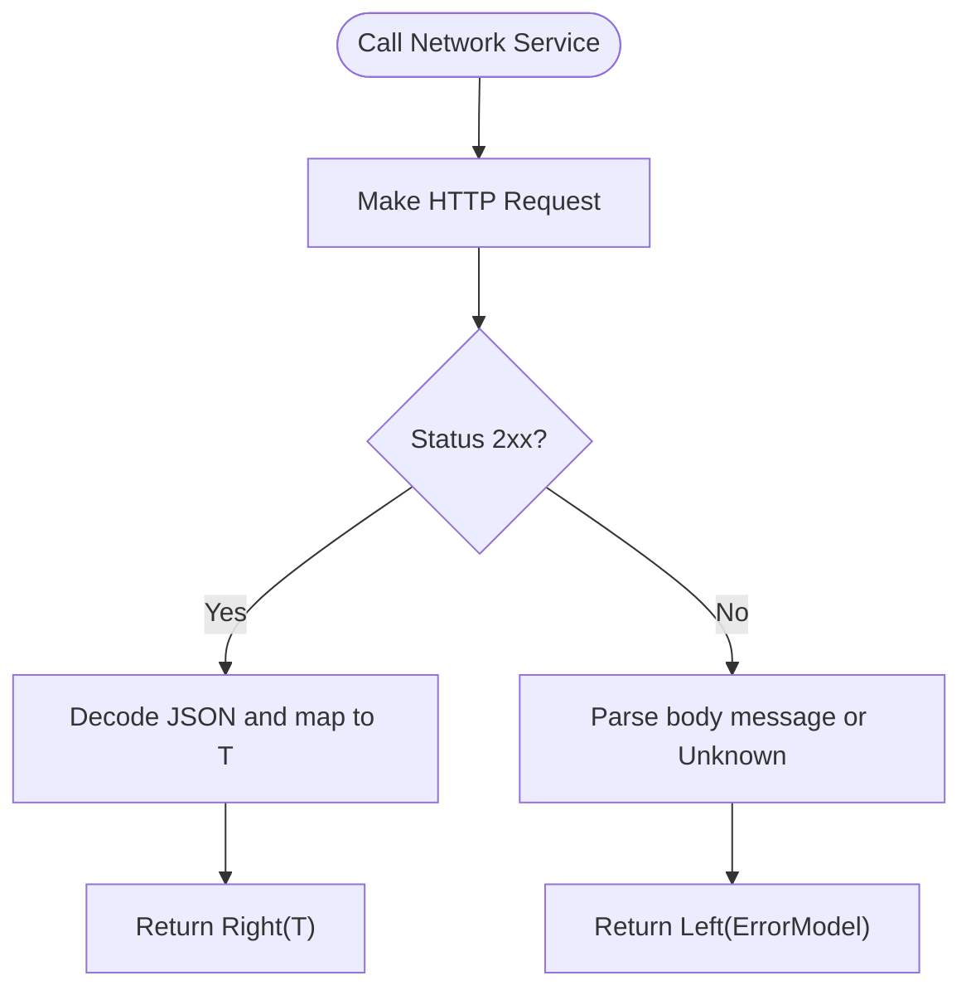
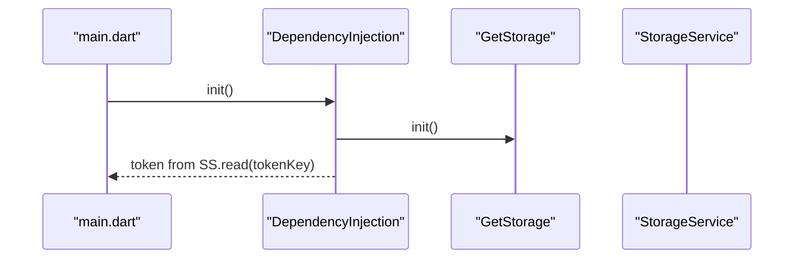
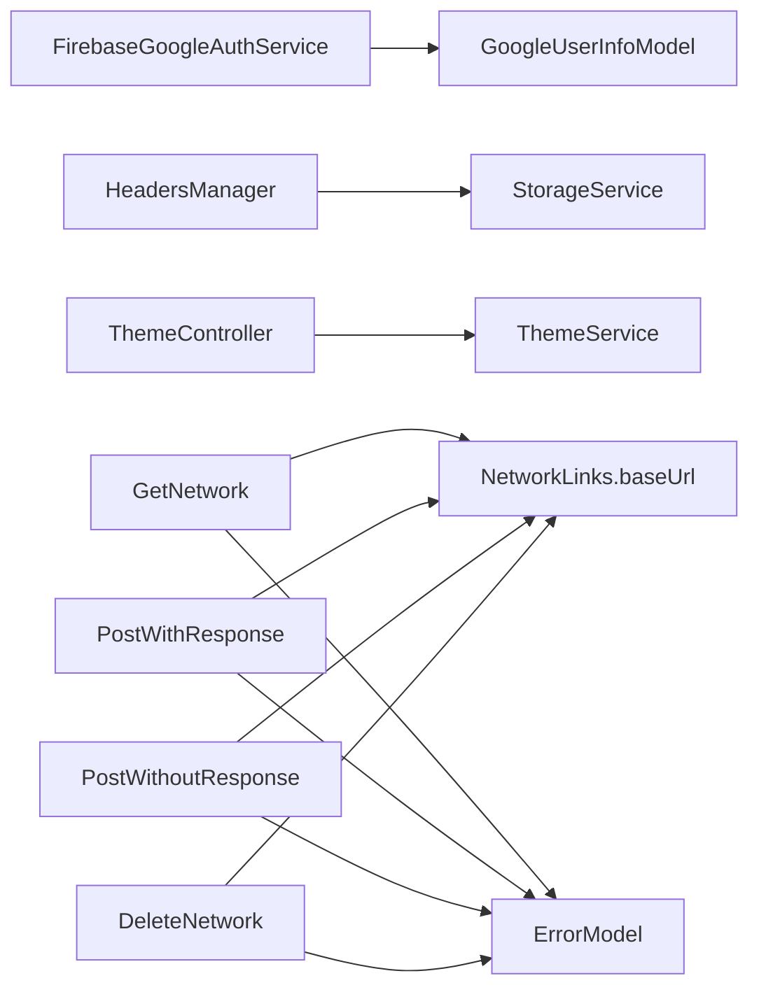

# Services Layer

<cite>
**Referenced Files in This Document**
- [main.dart](file://lib/main.dart)
- [dependency_injection.dart](file://lib/core/di/dependency_injection.dart)
- [firebase_google_auth.dart](file://lib/core/services/firebase_google_auth.dart)
- [google_user_info_model.dart](file://lib/core/data/global_models/google_user_info_model.dart)
- [storage_service.dart](file://lib/core/data/local/storage_service.dart)
- [theme_service.dart](file://lib/core/data/local/theme_service.dart)
- [theme_controller.dart](file://lib/core/theme/theme_controller.dart)
- [get_network.dart](file://lib/core/data/networks/get_network.dart)
- [post_with_response.dart](file://lib/core/data/networks/post_with_response.dart)
- [post_without_response.dart](file://lib/core/data/networks/post_without_response.dart)
- [delete_network.dart](file://lib/core/data/networks/delete_network.dart)
- [headers_manager.dart](file://lib/core/data/networks/headers_manager.dart)
- [networks_path.dart](file://lib/core/constant/networks_path.dart)
- [error_model.dart](file://lib/core/data/global_models/error_model.dart)
</cite>

## Table of Contents
1. [Introduction](#introduction)
2. [Project Structure](#project-structure)
3. [Core Components](#core-components)
4. [Architecture Overview](#architecture-overview)
5. [Detailed Component Analysis](#detailed-component-analysis)
6. [Dependency Analysis](#dependency-analysis)
7. [Performance Considerations](#performance-considerations)
8. [Troubleshooting Guide](#troubleshooting-guide)
9. [Conclusion](#conclusion)
10. [Appendices](#appendices)

## Introduction
This document explains the services layer of the ZB-DEZINE application. It focuses on the service architecture pattern, external service integrations (Firebase Google Authentication and HTTP networking), and utility services (storage and theme). It also documents the Firebase Google Authentication service, including authentication flow, token management, and user session handling. The guide covers service interface patterns, error handling strategies, and integration with the dependency injection system. Practical examples of service usage, testing strategies with mocks, and best practices for extending the services layer are included to help developers maintain clean abstractions and reliable integrations.

## Project Structure
The services layer is organized under the core directory and integrates with routing, themes, and bindings. The main entry initializes dependency injection and routes the application based on stored tokens. Utility services encapsulate persistent storage and theme preferences. Networking services abstract HTTP operations and provide consistent error modeling.

**Diagram sources**
- [main.dart:12-19](file://lib/main.dart#L12-L19)
- [dependency_injection.dart:11-26](file://lib/core/di/dependency_injection.dart#L11-L26)
- [firebase_google_auth.dart:6-69](file://lib/core/services/firebase_google_auth.dart#L6-L69)
- [storage_service.dart:3-22](file://lib/core/data/local/storage_service.dart#L3-L22)
- [theme_service.dart:3-15](file://lib/core/data/local/theme_service.dart#L3-L15)
- [theme_controller.dart:5-22](file://lib/core/theme/theme_controller.dart#L5-L22)
- [get_network.dart:8-38](file://lib/core/data/networks/get_network.dart#L8-L38)
- [post_with_response.dart:7-44](file://lib/core/data/networks/post_with_response.dart#L7-L44)
- [post_without_response.dart:9-46](file://lib/core/data/networks/post_without_response.dart#L9-L46)
- [delete_network.dart:8-40](file://lib/core/data/networks/delete_network.dart#L8-L40)
- [headers_manager.dart:4-22](file://lib/core/data/networks/headers_manager.dart#L4-L22)
- [networks_path.dart:1-3](file://lib/core/constant/networks_path.dart#L1-L3)
- [error_model.dart:1-15](file://lib/core/data/global_models/error_model.dart#L1-L15)

**Section sources**
- [main.dart:12-19](file://lib/main.dart#L12-L19)
- [dependency_injection.dart:11-26](file://lib/core/di/dependency_injection.dart#L11-L26)

## Core Components
- Firebase Google Authentication Service: Provides Google sign-in, token extraction, and sign-out. Returns a typed user info model and handles Firebase exceptions gracefully.
- Storage Service: Wraps GetStorage for key-value persistence with type-safe reads and asynchronous writes.
- Theme Service: Persists and retrieves theme preference using GetStorage.
- Theme Controller: Reactive controller observing theme state and delegating persistence to ThemeService.
- Network Services: Encapsulate GET, POST (with/without response), and DELETE operations with consistent error modeling via Either<ErrorModel, T>.
- Headers Manager: Builds HTTP headers including Authorization Bearer token sourced from StorageService.
- Error Model: Standardized error representation for HTTP failures and unknown errors.

**Section sources**
- [firebase_google_auth.dart:6-69](file://lib/core/services/firebase_google_auth.dart#L6-L69)
- [storage_service.dart:3-22](file://lib/core/data/local/storage_service.dart#L3-L22)
- [theme_service.dart:3-15](file://lib/core/data/local/theme_service.dart#L3-L15)
- [theme_controller.dart:5-22](file://lib/core/theme/theme_controller.dart#L5-L22)
- [get_network.dart:8-38](file://lib/core/data/networks/get_network.dart#L8-L38)
- [post_with_response.dart:7-44](file://lib/core/data/networks/post_with_response.dart#L7-L44)
- [post_without_response.dart:9-46](file://lib/core/data/networks/post_without_response.dart#L9-L46)
- [delete_network.dart:8-40](file://lib/core/data/networks/delete_network.dart#L8-L40)
- [headers_manager.dart:4-22](file://lib/core/data/networks/headers_manager.dart#L4-L22)
- [error_model.dart:1-15](file://lib/core/data/global_models/error_model.dart#L1-L15)

## Architecture Overview
The services layer follows a layered architecture:
- Application bootstrap initializes dependency injection and reads a token from storage to decide initial route and bindings.
- Services are registered as singletons via Get (dependency injection) and exposed as permanent instances.
- External integrations (Firebase Auth, HTTP client, GetStorage) are abstracted behind service interfaces.
- Reactive controllers observe and persist state (theme) using dedicated services.

```mermaid
sequenceDiagram
participant App as "MyApp"
participant DI as "DependencyInjection"
participant SS as "StorageService"
participant FGA as "FirebaseGoogleAuthService"
App->>DI : init()
DI->>SS : Initialize GetStorage
DI-->>App : Return token from storage
App->>App : Decide initial route/binding based on token
App->>FGA : signInWithGoogle()
FGA-->>App : GoogleUserInfoModel or null
```

- Network services return Either<ErrorModel, T> to centralize error handling and simplify callers.

**Diagram sources**
- [main.dart:12-19](file://lib/main.dart#L12-L19)
- [dependency_injection.dart:12-25](file://lib/core/di/dependency_injection.dart#L12-L25)
- [storage_service.dart:3-22](file://lib/core/data/local/storage_service.dart#L3-L22)
- [firebase_google_auth.dart:15-58](file://lib/core/services/firebase_google_auth.dart#L15-L58)

## Detailed Component Analysis

### Firebase Google Authentication Service
Purpose:
- Authenticate users via Google Sign-In.
- Exchange Google credentials for Firebase Auth credentials.
- Return a typed GoogleUserInfoModel populated from Firebase/User data.
- Provide sign-out with cleanup of GoogleSignIn and FirebaseAuth sessions.

Key behaviors:
- Handles cancellation and exceptions during sign-in.
- Extracts idToken and accessToken from GoogleSignInAuthentication.
- Uses GoogleAuthProvider.credential to sign in with FirebaseAuth.
- Builds GoogleUserInfoModel with name, email, avatarUrl, idToken, and uid.
- Logs outcomes and returns null on failure.

**Diagram sources**
- [firebase_google_auth.dart:15-58](file://lib/core/services/firebase_google_auth.dart#L15-L58)
- [google_user_info_model.dart:1-21](file://lib/core/data/global_models/google_user_info_model.dart#L1-L21)

**Section sources**
- [firebase_google_auth.dart:6-69](file://lib/core/services/firebase_google_auth.dart#L6-L69)
- [google_user_info_model.dart:1-21](file://lib/core/data/global_models/google_user_info_model.dart#L1-L21)

### Storage Service
Purpose:
- Provide a thin wrapper around GetStorage for reading, writing, removing, and clearing key-value pairs.
- Expose a tokenKey constant for centralized token storage key.

Usage patterns:
- Asynchronous write/read/remove/clear operations.
- Type-safe read via generics.

**Section sources**
- [storage_service.dart:3-22](file://lib/core/data/local/storage_service.dart#L3-L22)

### Theme Service and Theme Controller
Purpose:
- Persist and retrieve theme preference using GetStorage.
- Reactively manage theme mode and update persisted state.

Behavior:
- ThemeService saves a boolean flag and reads it with defaults.
- ThemeController observes ThemeService and exposes a reactive isDarkMode variable.
- Provides a convenience getter for ThemeMode based on current state.

**Diagram sources**
- [theme_service.dart:3-15](file://lib/core/data/local/theme_service.dart#L3-L15)
- [theme_controller.dart:5-22](file://lib/core/theme/theme_controller.dart#L5-L22)

**Section sources**
- [theme_service.dart:3-15](file://lib/core/data/local/theme_service.dart#L3-L15)
- [theme_controller.dart:5-22](file://lib/core/theme/theme_controller.dart#L5-L22)

### Network Services and Error Handling
Purpose:
- Encapsulate HTTP operations with consistent error modeling.
- Return Either<ErrorModel, T> to unify success/failure handling.

Components:
- GetNetwork: GET requests with typed decoding.
- PostWithResponse: POST requests returning decoded data.
- PostWithoutResponse: POST requests returning a boolean success indicator.
- DeleteNetwork: DELETE requests returning a boolean success indicator.
- HeadersManager: Build headers including Authorization Bearer token from storage.
- ErrorModel: Standardized error representation.

**Diagram sources**
- [get_network.dart:10-37](file://lib/core/data/networks/get_network.dart#L10-L37)
- [post_with_response.dart:9-43](file://lib/core/data/networks/post_with_response.dart#L9-L43)
- [post_without_response.dart:12-45](file://lib/core/data/networks/post_without_response.dart#L12-L45)
- [delete_network.dart:10-39](file://lib/core/data/networks/delete_network.dart#L10-L39)
- [error_model.dart:1-15](file://lib/core/data/global_models/error_model.dart#L1-L15)

**Section sources**
- [get_network.dart:8-38](file://lib/core/data/networks/get_network.dart#L8-L38)
- [post_with_response.dart:7-44](file://lib/core/data/networks/post_with_response.dart#L7-L44)
- [post_without_response.dart:9-46](file://lib/core/data/networks/post_without_response.dart#L9-L46)
- [delete_network.dart:8-40](file://lib/core/data/networks/delete_network.dart#L8-L40)
- [headers_manager.dart:4-22](file://lib/core/data/networks/headers_manager.dart#L4-L22)
- [networks_path.dart:1-3](file://lib/core/constant/networks_path.dart#L1-L3)
- [error_model.dart:1-15](file://lib/core/data/global_models/error_model.dart#L1-L15)

### Dependency Injection Integration
Purpose:
- Centralize service registration and initialization.
- Provide a startup hook to initialize storage and seed token for routing decisions.

Behavior:
- Initializes GetStorage.
- Registers StorageService, ThemeService, ThemeController, and network services as permanent instances.
- Reads token from StorageService to decide initial route and bindings.

**Diagram sources**
- [main.dart:12-19](file://lib/main.dart#L12-L19)
- [dependency_injection.dart:12-25](file://lib/core/di/dependency_injection.dart#L12-L25)
- [storage_service.dart:5](file://lib/core/data/local/storage_service.dart#L5)

**Section sources**
- [main.dart:12-19](file://lib/main.dart#L12-L19)
- [dependency_injection.dart:11-26](file://lib/core/di/dependency_injection.dart#L11-L26)

## Dependency Analysis
- External dependencies:
  - Firebase Auth and Google Sign-In for authentication.
  - GetStorage for local persistence.
  - http for HTTP operations.
  - fpdart for Either modeling.
- Internal dependencies:
  - HeadersManager depends on StorageService for Authorization token.
  - ThemeController depends on ThemeService.
  - All network services depend on NetworkLinks.baseUrl and ErrorModel.
  - FirebaseGoogleAuthService depends on GoogleUserInfoModel.

**Diagram sources**
- [firebase_google_auth.dart:4](file://lib/core/services/firebase_google_auth.dart#L4)
- [google_user_info_model.dart:1-21](file://lib/core/data/global_models/google_user_info_model.dart#L1-L21)
- [headers_manager.dart:19](file://lib/core/data/networks/headers_manager.dart#L19)
- [theme_controller.dart:10](file://lib/core/theme/theme_controller.dart#L10)
- [get_network.dart:9](file://lib/core/data/networks/get_network.dart#L9)
- [post_with_response.dart:8](file://lib/core/data/networks/post_with_response.dart#L8)
- [post_without_response.dart:9](file://lib/core/data/networks/post_without_response.dart#L9)
- [delete_network.dart:9](file://lib/core/data/networks/delete_network.dart#L9)
- [networks_path.dart:2](file://lib/core/constant/networks_path.dart#L2)
- [error_model.dart:1-15](file://lib/core/data/global_models/error_model.dart#L1-L15)

**Section sources**
- [headers_manager.dart:4-22](file://lib/core/data/networks/headers_manager.dart#L4-L22)
- [theme_controller.dart:5-22](file://lib/core/theme/theme_controller.dart#L5-L22)
- [get_network.dart:8-38](file://lib/core/data/networks/get_network.dart#L8-L38)
- [post_with_response.dart:7-44](file://lib/core/data/networks/post_with_response.dart#L7-L44)
- [post_without_response.dart:9-46](file://lib/core/data/networks/post_without_response.dart#L9-L46)
- [delete_network.dart:8-40](file://lib/core/data/networks/delete_network.dart#L8-L40)
- [networks_path.dart:1-3](file://lib/core/constant/networks_path.dart#L1-L3)
- [error_model.dart:1-15](file://lib/core/data/global_models/error_model.dart#L1-L15)

## Performance Considerations
- Prefer asynchronous storage operations to avoid blocking the UI thread.
- Reuse network clients and headers where possible to minimize overhead.
- Cache frequently accessed data (e.g., theme preference) in memory via reactive controllers.
- Use typed decoding to reduce parsing overhead and improve correctness.
- Avoid unnecessary re-renders by leveraging reactive state (GetX) appropriately.

## Troubleshooting Guide
Common issues and resolutions:
- Authentication failures:
  - Inspect Firebase exceptions caught during sign-in and log messages for actionable diagnostics.
  - Verify Google Sign-In configuration and scopes.
- Token not found:
  - Confirm tokenKey exists in storage and DependencyInjection.init() reads it correctly.
- Network errors:
  - Check ErrorModel for HTTP status and message; handle both known and unknown errors uniformly.
- Theme not persisting:
  - Ensure ThemeController.changeTheme updates ThemeService and that ThemeController.onInit reads persisted value.

**Section sources**
- [firebase_google_auth.dart:51-57](file://lib/core/services/firebase_google_auth.dart#L51-L57)
- [dependency_injection.dart:21-24](file://lib/core/di/dependency_injection.dart#L21-L24)
- [error_model.dart:5-13](file://lib/core/data/global_models/error_model.dart#L5-L13)
- [theme_controller.dart:9-18](file://lib/core/theme/theme_controller.dart#L9-L18)

## Conclusion
The services layer cleanly abstracts external dependencies and provides consistent interfaces for authentication, persistence, theming, and networking. By centralizing initialization and error handling, the layer improves maintainability and testability. The reactive controllers and dependency injection system enable predictable state management and easy integration across features.

## Appendices

### Service Usage Examples
- Authentication:
  - Call FirebaseGoogleAuthService.signInWithGoogle() and handle the returned GoogleUserInfoModel or null.
- Token Management:
  - Use StorageService.write(key: tokenKey, value: token) to persist and StorageService.read(key: tokenKey) to retrieve.
- Theme Management:
  - Use ThemeController.changeTheme(value) to toggle and persist theme; consume currentTheme for GetMaterialApp.
- Networking:
  - Use GetNetwork.getData(...), PostWithResponse.postData(...), PostWithoutResponse.postData(...), or DeleteNetwork.deleteData(...) with proper headers from HeadersManager.getHeaders().

**Section sources**
- [firebase_google_auth.dart:15-58](file://lib/core/services/firebase_google_auth.dart#L15-L58)
- [storage_service.dart:7-21](file://lib/core/data/local/storage_service.dart#L7-L21)
- [theme_controller.dart:15-21](file://lib/core/theme/theme_controller.dart#L15-L21)
- [get_network.dart:10-20](file://lib/core/data/networks/get_network.dart#L10-L20)
- [post_with_response.dart:9-24](file://lib/core/data/networks/post_with_response.dart#L9-L24)
- [post_without_response.dart:12-28](file://lib/core/data/networks/post_without_response.dart#L12-L28)
- [delete_network.dart:10-23](file://lib/core/data/networks/delete_network.dart#L10-L23)
- [headers_manager.dart:9-21](file://lib/core/data/networks/headers_manager.dart#L9-L21)

### Testing Strategies and Mocking
- Mock StorageService:
  - Replace GetStorage with a mock implementation to simulate token presence/absence and read/write behavior.
- Mock FirebaseGoogleAuthService:
  - Stub signInWithGoogle() to return predefined GoogleUserInfoModel or null for different test scenarios.
- Mock Network Services:
  - Use HTTP interceptors or replace http.Client in tests to return controlled responses and statuses.
- Mock ThemeService:
  - Provide deterministic getIsDark() and saveThemeToStorage() behavior for theme-related tests.

Best practices:
- Keep service interfaces small and focused.
- Return Either<ErrorModel, T> to simplify caller-side error handling.
- Inject dependencies via constructor or Get.find() to enable easy mocking.

[No sources needed since this section provides general guidance]