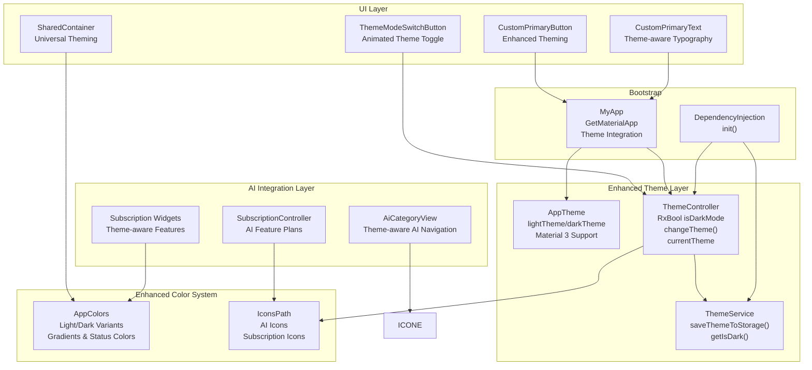
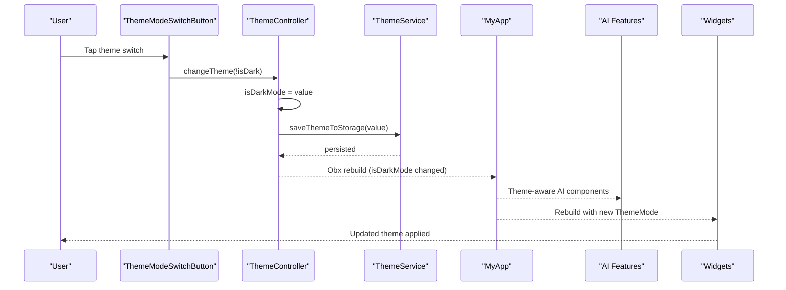
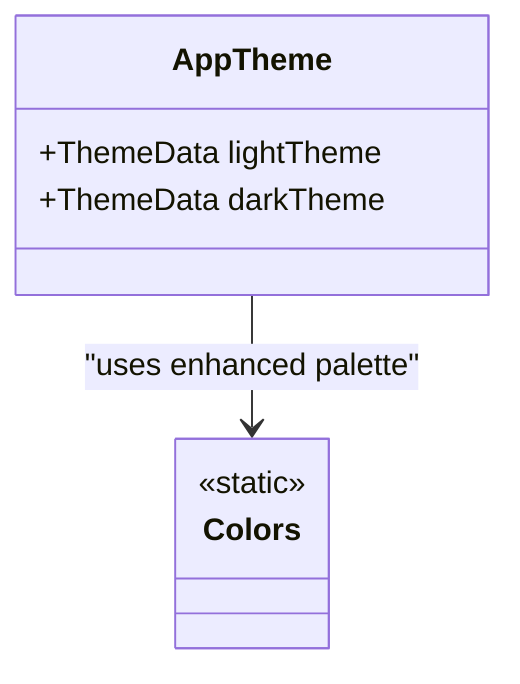
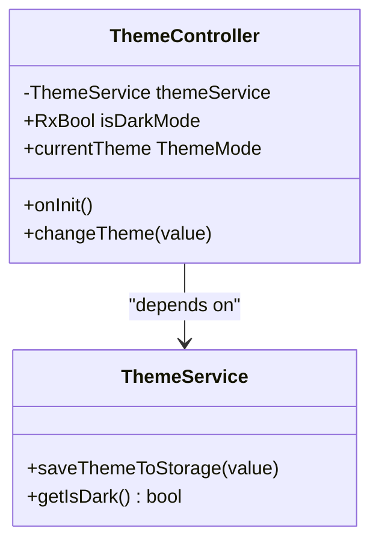
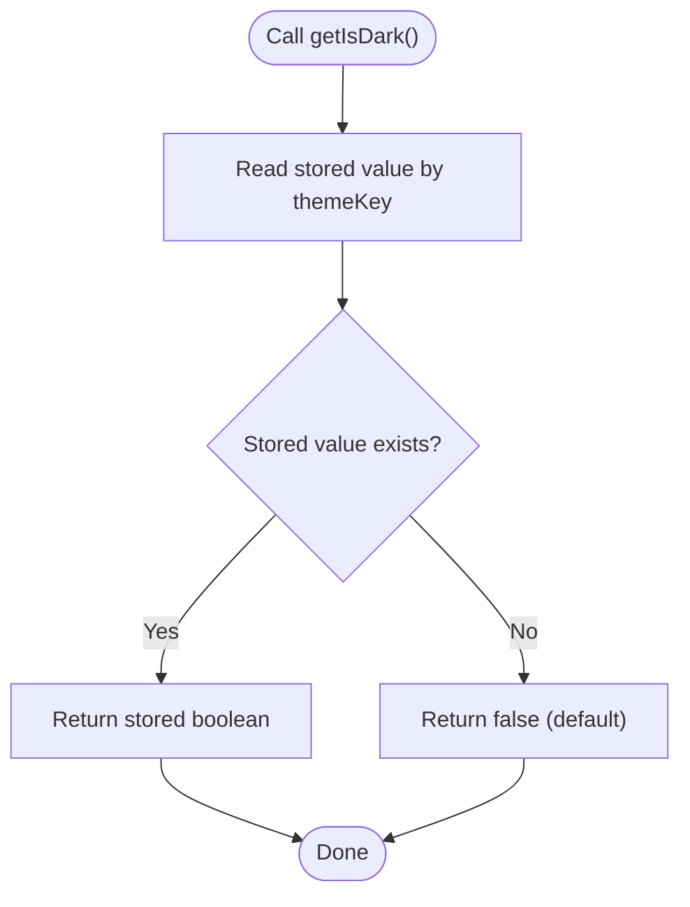
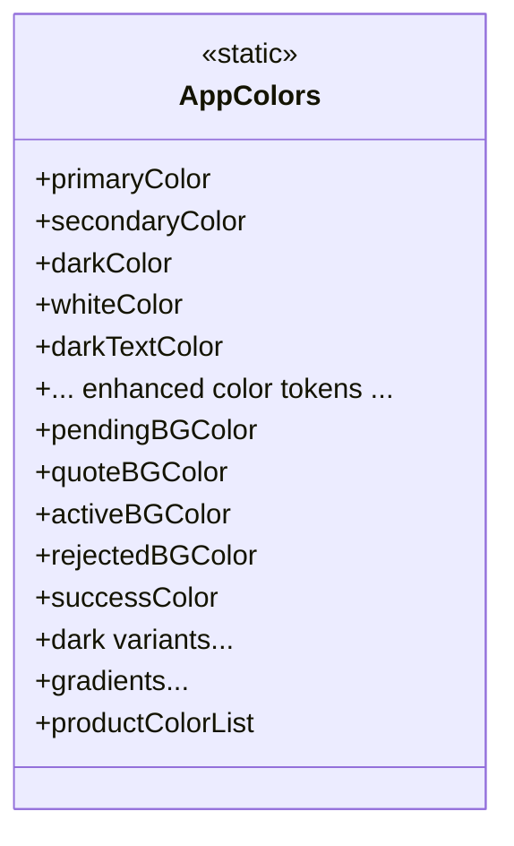
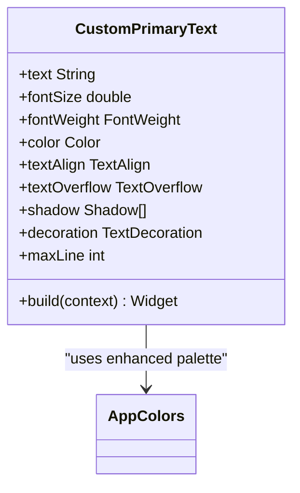
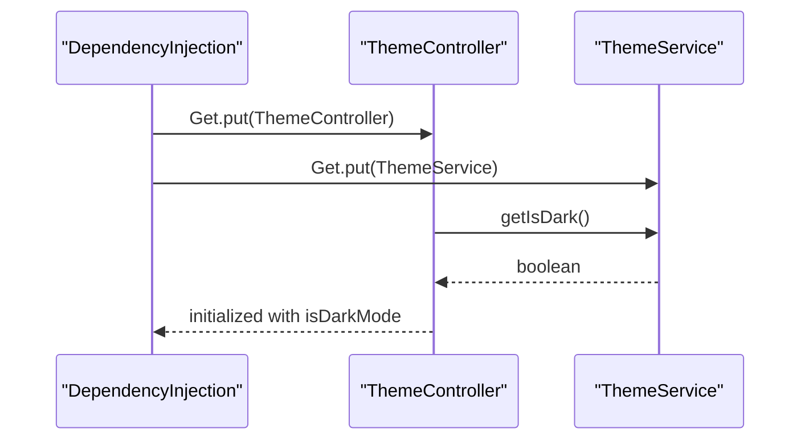
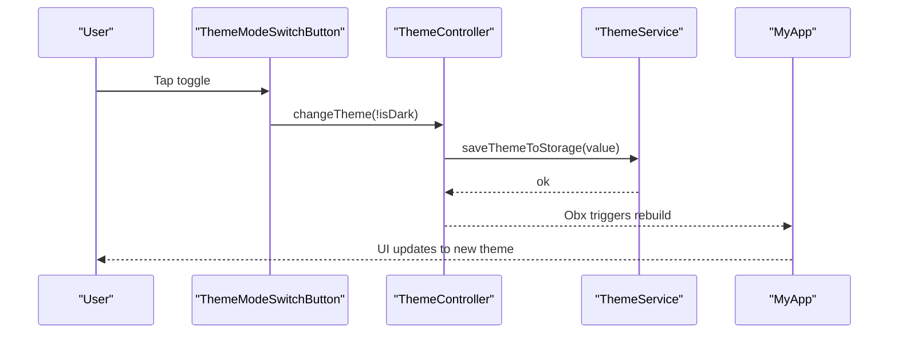
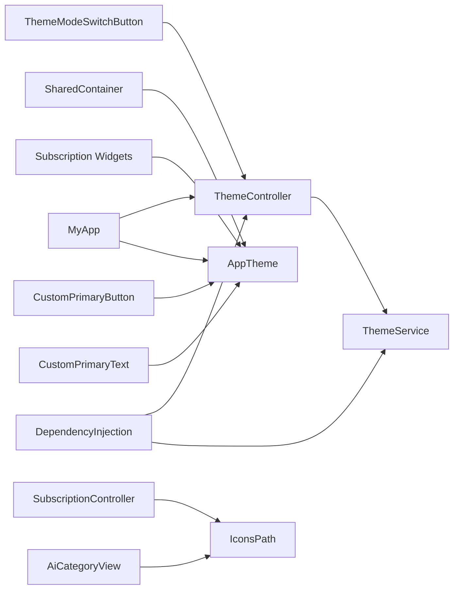

# Theme and Styling System

<cite>
**Referenced Files in This Document**
- [app_theme.dart](file://lib/core/theme/app_theme.dart)
- [theme_controller.dart](file://lib/core/theme/theme_controller.dart)
- [theme_service.dart](file://lib/core/data/local/theme_service.dart)
- [colors.dart](file://lib/core/constant/colors.dart)
- [icons_path.dart](file://lib/core/constant/icons_path.dart)
- [dependency_injection.dart](file://lib/core/di/dependency_injection.dart)
- [main.dart](file://lib/main.dart)
- [custom_primary_text.dart](file://lib/shared/widgets/custom_text/custom_primary_text.dart)
- [custom_primary_button.dart](file://lib/shared/widgets/custom_button/custom_primary_button.dart)
- [theme_mode_switch_button.dart](file://lib/features/profile/widgets/profile_view_widgets/theme_mode_switch_button.dart)
- [login_button.dart](file://lib/features/auth/widgets/login_button.dart)
- [bottom_nav_view.dart](file://lib/features/home/views/bottom_nav_view.dart)
- [custom_span_text.dart](file://lib/shared/widgets/custom_text/custom_span_text.dart)
- [dashboard_card.dart](file://lib/features/dashboard/widgets/dashboard_widget/dashboard_card.dart)
- [subscription_plan_feature.dart](file://lib/features/membership/widgets/subscription_plan_feature.dart)
- [subscription_controller.dart](file://lib/features/membership/controller/subscription_controller.dart)
- [active_subscription.dart](file://lib/features/membership/widgets/active_subscription.dart)
- [ai_category_view.dart](file://lib/features/category/views/ai_category_view.dart)
- [category_controller.dart](file://lib/features/category/controller/category_controller.dart)
- [shared_container.dart](file://lib/shared/widgets/shared_container.dart)
- [styles.xml](file://android/app/src/main/res/values/styles.xml)
- [styles.xml](file://android/app/src/main/res/values-night/styles.xml)
</cite>

## Update Summary
**Changes Made**
- Enhanced color system documentation with comprehensive dark mode color palette
- Added new AI-related icons and subscription management features
- Updated theme implementation to support AI category navigation
- Expanded subscription management with AI feature integration
- Enhanced theme-aware widget implementations for dark mode compatibility

## Table of Contents
1. [Introduction](#introduction)
2. [Project Structure](#project-structure)
3. [Core Components](#core-components)
4. [Architecture Overview](#architecture-overview)
5. [Detailed Component Analysis](#detailed-component-analysis)
6. [Enhanced Color System with Dark Mode Support](#enhanced-color-system-with-dark-mode-support)
7. [AI-Related Features and Icon Integration](#ai-related-features-and-icon-integration)
8. [Subscription Management with Theme Integration](#subscription-management-with-theme-integration)
9. [Dependency Analysis](#dependency-analysis)
10. [Performance Considerations](#performance-considerations)
11. [Troubleshooting Guide](#troubleshooting-guide)
12. [Conclusion](#conclusion)

## Introduction
This document explains the ZB-DEZINE theme and styling system, focusing on dynamic theme switching, comprehensive light/dark theme support, and an enhanced color palette management system. It documents the AppTheme class structure, theme configuration options, typography definitions, and the ThemeController functionality for state management, user preference persistence, and runtime theme switching. The system now includes comprehensive dark mode color support, AI-related icon integration for subscription management, and enhanced theme-aware components for AI features.

## Project Structure
The theme system is organized around a cohesive set of components with enhanced dark mode support and AI feature integration:
- AppTheme: Defines light and dark ThemeData instances with Material 3 support
- ThemeController: Manages theme state and exposes ThemeMode with reactive updates
- ThemeService: Persists and retrieves user theme preference using GetStorage
- Colors: Centralized color palette with comprehensive light and dark variants
- IconsPath: Complete icon library including new AI-related icons
- UI widgets: Custom widgets that adapt to theme brightness with enhanced styling
- AI Category: New AI-focused navigation with theme-aware implementations
- Subscription Management: Enhanced subscription features with AI capabilities
- Dependency Injection: Registers services and controllers with theme integration
- Application bootstrap: Integrates theme configuration with AI features

**Diagram sources**
- [app_theme.dart:4-23](file://lib/core/theme/app_theme.dart#L4-L23)
- [theme_controller.dart:5-22](file://lib/core/theme/theme_controller.dart#L5-L22)
- [theme_service.dart:3-16](file://lib/core/data/local/theme_service.dart#L3-L16)
- [colors.dart:3-131](file://lib/core/constant/colors.dart#L3-L131)
- [icons_path.dart:1-153](file://lib/core/constant/icons_path.dart#L1-L153)
- [ai_category_view.dart:13-51](file://lib/features/category/views/ai_category_view.dart#L13-L51)
- [subscription_controller.dart:4-85](file://lib/features/membership/controller/subscription_controller.dart#L4-L85)
- [subscription_plan_feature.dart:7-32](file://lib/features/membership/widgets/subscription_plan_feature.dart#L7-L32)
- [shared_container.dart:5-56](file://lib/shared/widgets/shared_container.dart#L5-L56)
- [dependency_injection.dart:11-27](file://lib/core/di/dependency_injection.dart#L11-L27)
- [main.dart:21-47](file://lib/main.dart#L21-L47)
- [custom_primary_text.dart:8-45](file://lib/shared/widgets/custom_text/custom_primary_text.dart#L8-L45)
- [custom_primary_button.dart:6-77](file://lib/shared/widgets/custom_button/custom_primary_button.dart#L6-L77)
- [theme_mode_switch_button.dart:8-59](file://lib/features/profile/widgets/profile_view_widgets/theme_mode_switch_button.dart#L8-L59)

**Section sources**
- [main.dart:12-47](file://lib/main.dart#L12-L47)
- [dependency_injection.dart:11-27](file://lib/core/di/dependency_injection.dart#L11-L27)

## Core Components
- **AppTheme**: Provides static ThemeData instances for light and dark modes with Material 3 support, enabling transparent app bars and comprehensive theme configuration
- **ThemeController**: Reactive controller managing isDarkMode state, initializing from persisted storage, and exposing ThemeMode for the app with enhanced theme awareness
- **ThemeService**: Uses GetStorage to persist and retrieve user's theme preference with reliable storage management
- **AppColors**: Centralizes all color tokens including comprehensive light and dark variants, status colors, and gradients for consistent theming across modes
- **IconsPath**: Complete icon library featuring new AI-related icons (ai_design, ai_shop, ai_favorite, ai_cart, ai_search) and subscription management icons
- **UI widgets**: Enhanced Custom widgets that adapt their colors and styling based on current theme brightness with improved theme awareness

**Section sources**
- [app_theme.dart:4-23](file://lib/core/theme/app_theme.dart#L4-L23)
- [theme_controller.dart:5-22](file://lib/core/theme/theme_controller.dart#L5-L22)
- [theme_service.dart:3-16](file://lib/core/data/local/theme_service.dart#L3-L16)
- [colors.dart:3-131](file://lib/core/constant/colors.dart#L3-L131)
- [icons_path.dart:139-152](file://lib/core/constant/icons_path.dart#L139-L152)
- [custom_primary_text.dart:8-45](file://lib/shared/widgets/custom_text/custom_primary_text.dart#L8-L45)
- [custom_primary_button.dart:6-77](file://lib/shared/widgets/custom_button/custom_primary_button.dart#L6-L77)

## Architecture Overview
The enhanced theme system follows a reactive pattern with comprehensive dark mode support:
- ThemeService persists boolean flag indicating dark mode preference with reliable storage
- ThemeController reads stored preference during initialization and exposes observable state
- MyApp configures GetMaterialApp with AppTheme instances and ThemeMode from ThemeController
- UI widgets query Theme.of(context).brightness to select appropriate color tokens from enhanced AppColors
- New AI features integrate seamlessly with theme system using theme-aware implementations

**Diagram sources**
- [theme_mode_switch_button.dart:13-58](file://lib/features/profile/widgets/profile_view_widgets/theme_mode_switch_button.dart#L13-L58)
- [theme_controller.dart:15-22](file://lib/core/theme/theme_controller.dart#L15-L22)
- [theme_service.dart:7-14](file://lib/core/data/local/theme_service.dart#L7-L14)
- [main.dart:29-42](file://lib/main.dart#L29-L42)

## Detailed Component Analysis

### AppTheme
AppTheme encapsulates the design system's ThemeData for both light and dark modes with enhanced Material 3 support:
- Light theme: Transparent app bar, Material 3 enabled for modern UI components
- Dark theme: Comprehensive ColorScheme with primary and surface colors, Material 3 enabled, date picker theme configured for consistent dark mode experience

**Diagram sources**
- [app_theme.dart:4-23](file://lib/core/theme/app_theme.dart#L4-L23)
- [colors.dart:3-131](file://lib/core/constant/colors.dart#L3-L131)

**Section sources**
- [app_theme.dart:4-23](file://lib/core/theme/app_theme.dart#L4-L23)

### ThemeController
ThemeController manages theme state reactively with enhanced functionality:
- Initializes ThemeService via dependency injection with proper service registration
- Loads persisted theme preference into isDarkMode with fallback handling
- Exposes changeTheme() to update state and persist with immediate UI updates
- Provides currentTheme getter returning ThemeMode based on isDarkMode with reactive updates

**Diagram sources**
- [theme_controller.dart:5-22](file://lib/core/theme/theme_controller.dart#L5-L22)
- [theme_service.dart:3-16](file://lib/core/data/local/theme_service.dart#L3-L16)

**Section sources**
- [theme_controller.dart:5-22](file://lib/core/theme/theme_controller.dart#L5-L22)

### ThemeService
ThemeService persists the theme preference using GetStorage with enhanced reliability:
- Stores boolean value under themeKey "isDarkMode" with persistent storage
- Reads stored value with proper fallback to default false for new users
- Provides asynchronous write operations for non-blocking UI updates

**Diagram sources**
- [theme_service.dart:11-14](file://lib/core/data/local/theme_service.dart#L11-L14)

**Section sources**
- [theme_service.dart:3-16](file://lib/core/data/local/theme_service.dart#L3-L16)

### Enhanced Color System with Dark Mode Support
The enhanced color system provides comprehensive light and dark mode support:
- **Light Colors**: Primary, secondary, and utility colors for bright theme environments
- **Dark Colors**: Complete dark variant palette including borders, text colors, and status indicators
- **Status Colors**: Specialized colors for pending, quote, revise, active, complete, and rejected states in both light and dark modes
- **Gradients**: Auth backgrounds, primary gradients, and banner gradients with dark mode variants
- **Product Colors**: Color variations for product displays with theme-aware selection

**Diagram sources**
- [colors.dart:3-131](file://lib/core/constant/colors.dart#L3-L131)

**Section sources**
- [colors.dart:3-131](file://lib/core/constant/colors.dart#L3-L131)

### Typography Definitions
Typography is defined via Google Fonts integration in CustomPrimaryText with enhanced theme support:
- Uses Montserrat font family with comprehensive weight support
- Applies fontSize, fontWeight, and color based on theme brightness with improved readability
- Supports optional shadows, decorations, and truncation for enhanced visual hierarchy
- Theme-aware color selection ensures optimal contrast in both light and dark modes

**Diagram sources**
- [custom_primary_text.dart:8-45](file://lib/shared/widgets/custom_text/custom_primary_text.dart#L8-L45)
- [colors.dart:3-131](file://lib/core/constant/colors.dart#L3-L131)

**Section sources**
- [custom_primary_text.dart:8-45](file://lib/shared/widgets/custom_text/custom_primary_text.dart#L8-L45)

### ThemeController Functionality
ThemeController integrates with ThemeService and exposes reactive state with enhanced capabilities:
- Initialization loads persisted preference with proper service dependency resolution
- changeTheme updates state and persists with immediate UI rebuild triggers
- currentTheme maps to ThemeMode for MaterialApp with reactive theme switching
- Enhanced integration with AI features and subscription management systems

**Diagram sources**
- [dependency_injection.dart:14-16](file://lib/core/di/dependency_injection.dart#L14-L16)
- [theme_controller.dart:9-12](file://lib/core/theme/theme_controller.dart#L9-L12)
- [theme_service.dart:11-14](file://lib/core/data/local/theme_service.dart#L11-L14)

**Section sources**
- [dependency_injection.dart:11-27](file://lib/core/di/dependency_injection.dart#L11-L27)
- [theme_controller.dart:9-22](file://lib/core/theme/theme_controller.dart#L9-L22)

### Runtime Theme Switching Implementation
Runtime switching is implemented with enhanced visual feedback and AI integration:
- ThemeModeSwitchButton toggles controller.isDarkMode with animated theme icons
- Uses sophisticated animations with themeLight and themeDark assets
- Triggers controller.changeTheme() which persists new value and updates all theme-aware components
- Seamless integration with AI category navigation and subscription management features

**Diagram sources**
- [theme_mode_switch_button.dart:13-58](file://lib/features/profile/widgets/profile_view_widgets/theme_mode_switch_button.dart#L13-L58)
- [theme_controller.dart:15-18](file://lib/core/theme/theme_controller.dart#L15-L18)
- [theme_service.dart:7-9](file://lib/core/data/local/theme_service.dart#L7-L9)
- [main.dart:29-42](file://lib/main.dart#L29-L42)

**Section sources**
- [theme_mode_switch_button.dart:13-58](file://lib/features/profile/widgets/profile_view_widgets/theme_mode_switch_button.dart#L13-L58)
- [theme_controller.dart:15-22](file://lib/core/theme/theme_controller.dart#L15-L22)

### Examples of Enhanced Theme Usage Across Components
- **CustomPrimaryText**: Adapts text color based on theme brightness with improved readability
- **CustomPrimaryButton**: Selects background and text colors with enhanced theme-aware logic
- **LoginButton**: Switches colors and borders according to theme brightness with better contrast
- **Bottom navigation**: Uses theme-aware colors for surfaces and borders with dark mode support
- **Dashboard cards**: Apply theme-appropriate colors to borders, shadows, and content
- **Rich text components**: Apply theme-appropriate colors to spans with enhanced dark mode compatibility
- **AI category navigation**: Theme-aware implementations for AI feature discovery
- **Subscription management**: Enhanced theme integration for subscription features and AI capabilities

**Section sources**
- [custom_primary_text.dart:28-44](file://lib/shared/widgets/custom_text/custom_primary_text.dart#L28-L44)
- [custom_primary_button.dart:37-77](file://lib/shared/widgets/custom_button/custom_primary_button.dart#L37-L77)
- [login_button.dart:26-62](file://lib/features/auth/widgets/login_button.dart#L26-L62)
- [bottom_nav_view.dart:14-51](file://lib/features/home/views/bottom_nav_view.dart#L14-L51)
- [dashboard_card.dart:24-64](file://lib/features/dashboard/widgets/dashboard_widget/dashboard_card.dart#L24-L64)
- [custom_span_text.dart:54-94](file://lib/shared/widgets/custom_text/custom_span_text.dart#L54-L94)
- [ai_category_view.dart:16-51](file://lib/features/category/views/ai_category_view.dart#L16-L51)
- [subscription_plan_feature.dart:12-32](file://lib/features/membership/widgets/subscription_plan_feature.dart#L12-L32)

### Responsive Design Considerations
The app integrates flutter_screenutil for responsive layouts with enhanced theme support:
- ScreenUtilInit wraps the app with designSize and builder for consistent scaling
- Widgets use .w, .h, and .r units for scalable sizing with theme-aware adjustments
- Typography scales via sp units with improved readability in both modes
- Theme colors adapt independently of scaling units with comprehensive dark mode support
- Enhanced container components provide universal theming across all screen sizes

**Section sources**
- [main.dart:26-44](file://lib/main.dart#L26-L44)
- [custom_primary_text.dart:36-42](file://lib/shared/widgets/custom_text/custom_primary_text.dart#L36-L42)
- [custom_primary_button.dart:43-77](file://lib/shared/widgets/custom_button/custom_primary_button.dart#L43-L77)
- [shared_container.dart:32-56](file://lib/shared/widgets/shared_container.dart#L32-L56)

### Android Platform Theme Integration
Android provides platform-level light/dark themes for seamless integration:
- values/styles.xml defines light theme defaults with Material Design compatibility
- values-night/styles.xml defines dark theme defaults with enhanced dark mode support
- These complement Flutter's theme system during app startup and lifecycle events
- Platform themes ensure consistent system-level appearance across different Android versions

**Section sources**
- [styles.xml:1-18](file://android/app/src/main/res/values/styles.xml#L1-L18)
- [styles.xml:1-18](file://android/app/src/main/res/values-night/styles.xml#L1-L18)

## Enhanced Color System with Dark Mode Support

### Comprehensive Dark Mode Color Palette
The enhanced color system provides extensive dark mode support with carefully crafted color variants:

**Light Mode Colors**:
- Primary: Deep purple (#FF15003B) for brand identity
- Secondary: Rich purple (#FF15003A) for complementary elements
- Background: Pure white (#FFFFFFFF) for bright interfaces
- Text: Multiple shades from deep gray (#FF101828) to light gray (#FF737373)
- Status: Distinct colors for pending, quote, active, and rejected states

**Dark Mode Colors**:
- Primary: Deep black (#FF000000) for dark backgrounds
- Secondary: Dark gray (#FF212121) for elevated surfaces
- Text: Light gray variants (#FFBABABA) for optimal readability
- Borders: Subtle dark borders (#FF434953) for depth definition
- Status: Dark variants with proper contrast ratios for accessibility

**Status Color System**:
- Pending: Dark yellow background (#FF6B5A2B) with light text (#FFFFFBF0)
- Quote: Dark blue background (#FF6155F5) with light text (#FFDFE2FF)
- Active: Dark green background (#FF0E5843) with light text (#FFE9FAF5)
- Complete: Dark teal background (#FF05393B) with light text (#FEF3F4)
- Rejected: Dark red background (#FFBF1F1F) with light text (#FFFFD3D3)

**Section sources**
- [colors.dart:3-74](file://lib/core/constant/colors.dart#L3-L74)

### Enhanced Gradient System
The color system includes comprehensive gradient support for both light and dark modes:

**Auth Background Gradients**:
- Light: Multi-layer transparency gradient from light to solid white
- Dark: Multi-layer transparency gradient from dark to pure black

**Brand Gradients**:
- Primary: Purple gradient from light (#FFF6F2FF) to dark (#FFF9F2FF)
- Secondary: Blue gradient from light (#FF1348D2) through intermediate to bright (#FF209DF0)
- Dark variants: Enhanced purple gradients for dark mode compatibility

**Section sources**
- [colors.dart:76-122](file://lib/core/constant/colors.dart#L76-L122)

## AI-Related Features and Icon Integration

### New AI-Related Icons
The IconsPath class now includes comprehensive AI-related icon support:

**AI Feature Icons**:
- `ai_design`: AI room design and interior concepts
- `ai_shop`: AI-powered shopping and product discovery
- `ai_favorite`: AI-enhanced favorites and recommendations
- `ai_cart`: AI shopping cart with intelligent suggestions
- `ai_search`: AI-powered search and discovery

**AI Navigation Icons**:
- `drawer_ai`: AI features in main navigation drawer
- `ai`: General AI functionality indicator

**Enhanced Subscription Icons**:
- `subs_star`: Star icon for subscription benefits
- `van`: Delivery and logistics for subscription services
- `gear`: Settings and customization for AI features
- `stopwatch`: Priority access and timing features

**Section sources**
- [icons_path.dart:103-152](file://lib/core/constant/icons_path.dart#L103-L152)

### AI Category Navigation
The AI category system provides theme-aware navigation for AI features:

**Theme-Aware Implementation**:
- Uses Theme.of(context).brightness to determine dark mode styling
- Implements SharedContainer with proper border styling for both modes
- Provides enhanced visual hierarchy with theme-appropriate colors
- Supports responsive design with proper spacing and sizing

**AI Feature Categories**:
- Product Placement: Flexible living solutions with AI assistance
- Interior Design: Room transformation tools powered by AI
- Priority Access: Early access to AI features for premium users

**Section sources**
- [ai_category_view.dart:13-51](file://lib/features/category/views/ai_category_view.dart#L13-L51)
- [category_controller.dart:5-21](file://lib/features/category/controller/category_controller.dart#L5-L21)

## Subscription Management with Theme Integration

### Enhanced Subscription Features
The subscription system now includes AI-powered features with comprehensive theme support:

**Subscription Plans with AI Integration**:
- **Earlybird Plan**: Basic membership with standard features
- **Design Plan**: AI room design & interior concepts, unlimited design prompts
- **Collection +**: Premium plan with all Design Pro features plus exclusive benefits

**Theme-Aware Subscription Components**:
- SubscriptionPlanFeature: Displays subscription benefits with theme-appropriate styling
- ActiveSubscription: Shows active subscription status with success color theming
- Membership benefits: Comprehensive feature lists with checkmark icons

**Section sources**
- [subscription_controller.dart:4-85](file://lib/features/membership/controller/subscription_controller.dart#L4-L85)
- [subscription_plan_feature.dart:7-32](file://lib/features/membership/widgets/subscription_plan_feature.dart#L7-L32)
- [active_subscription.dart:7-30](file://lib/features/membership/widgets/active_subscription.dart#L7-L30)

### Theme-Aware Subscription Components
Components throughout the subscription system adapt seamlessly to theme changes:

**SubscriptionPlanFeature**:
- Uses theme-aware text colors (white in dark mode, dark gray in light mode)
- Implements proper spacing and alignment with ScreenUtil units
- Integrates with CustomPrimaryText for consistent typography

**ActiveSubscription**:
- Uses successColor (#FF38C793) with white text for active status indication
- Implements proper shadow effects with theme-appropriate alpha values
- Provides consistent styling across light and dark modes

**Section sources**
- [subscription_plan_feature.dart:12-32](file://lib/features/membership/widgets/subscription_plan_feature.dart#L12-L32)
- [active_subscription.dart:10-30](file://lib/features/membership/widgets/active_subscription.dart#L10-L30)

## Dependency Analysis
The enhanced theme system maintains low coupling with high cohesion while supporting new AI features:

- AppTheme depends only on enhanced Colors palette
- ThemeController depends on ThemeService and exposes ThemeMode
- UI widgets depend on Theme.of(context).brightness and comprehensive Colors
- AI components integrate seamlessly with existing theme infrastructure
- Subscription management leverages theme-aware components
- DependencyInjection registers services and controllers with theme integration

**Diagram sources**
- [dependency_injection.dart:11-27](file://lib/core/di/dependency_injection.dart#L11-L27)
- [main.dart:29-42](file://lib/main.dart#L29-L42)
- [theme_controller.dart:9-12](file://lib/core/theme/theme_controller.dart#L9-L12)
- [theme_service.dart:11-14](file://lib/core/data/local/theme_service.dart#L11-L14)
- [custom_primary_text.dart:28-44](file://lib/shared/widgets/custom_text/custom_primary_text.dart#L28-L44)
- [custom_primary_button.dart:37-77](file://lib/shared/widgets/custom_button/custom_primary_button.dart#L37-L77)
- [theme_mode_switch_button.dart:13-58](file://lib/features/profile/widgets/profile_view_widgets/theme_mode_switch_button.dart#L13-L58)
- [ai_category_view.dart:13-51](file://lib/features/category/views/ai_category_view.dart#L13-L51)
- [subscription_controller.dart:4-85](file://lib/features/membership/controller/subscription_controller.dart#L4-L85)
- [subscription_plan_feature.dart:7-32](file://lib/features/membership/widgets/subscription_plan_feature.dart#L7-L32)
- [shared_container.dart:5-56](file://lib/shared/widgets/shared_container.dart#L5-L56)

**Section sources**
- [dependency_injection.dart:11-27](file://lib/core/di/dependency_injection.dart#L11-L27)
- [main.dart:29-42](file://lib/main.dart#L29-L42)

## Performance Considerations
Enhanced performance optimizations for the expanded theme system:

- **Reactive rebuilds**: ThemeController uses RxBool with optimized change detection
- **Persistent storage**: ThemeService uses asynchronous write operations with caching
- **Efficient widget adaptation**: Widgets query Theme.of(context).brightness once per build
- **Scalable units**: ScreenUtil units reduce layout recalculation overhead
- **Theme-aware caching**: Enhanced color selection minimizes repeated calculations
- **AI feature optimization**: Theme-aware AI components leverage efficient rendering
- **Memory management**: Comprehensive color palette uses constant memory allocation

## Troubleshooting Guide
Enhanced troubleshooting for the expanded theme system:

**Theme Persistence Issues**:
- Verify ThemeService.getIsDark() returns expected default and persisted values
- Confirm GetStorage initialization before accessing storage
- Check themeKey "isDarkMode" exists in storage if migration is needed

**Theme Toggle Problems**:
- Ensure ThemeController.changeTheme() is called and isDarkMode is observed by UI
- Confirm MyApp rebuilds via Obx when isDarkMode changes
- Verify ThemeMode.currentTheme maps correctly to ThemeMode values

**Color Inconsistencies**:
- Check that widgets query Theme.of(context).brightness and use AppColors appropriately
- Validate that AppTheme.darkTheme sets primary and surface colors correctly
- Ensure dark mode colors are properly defined in AppColors for all components

**AI Feature Integration Issues**:
- Verify AI icons are properly loaded from IconsPath in theme-aware components
- Check subscription features integrate with theme system correctly
- Ensure AI category navigation responds to theme changes properly

**Section sources**
- [theme_service.dart:11-14](file://lib/core/data/local/theme_service.dart#L11-L14)
- [theme_controller.dart:15-18](file://lib/core/theme/theme_controller.dart#L15-L18)
- [main.dart:29-42](file://lib/main.dart#L29-L42)
- [custom_primary_text.dart:28-44](file://lib/shared/widgets/custom_text/custom_primary_text.dart#L28-L44)
- [ai_category_view.dart:16-51](file://lib/features/category/views/ai_category_view.dart#L16-L51)

## Conclusion
The enhanced ZB-DEZINE theme and styling system provides a comprehensive, reactive foundation for dynamic light/dark theme switching with extensive AI feature integration. AppTheme defines consistent Material 3 themes with enhanced dark mode support, ThemeController manages state and ThemeMode exposure with reactive updates, and ThemeService persists user preferences reliably. The comprehensive color palette now includes extensive dark mode variants, gradients, and status colors for optimal user experience across all themes.

UI widgets adapt seamlessly to theme changes using Theme.of(context).brightness and the centralized AppColors palette, with enhanced support for AI features and subscription management. The new AI-related icons integrate seamlessly with the theme system, providing consistent visual language across light and dark modes. Combined with ScreenUtil for responsive design, the system delivers a maintainable, accessible, and feature-rich design system that supports both traditional and AI-powered functionality across all components.