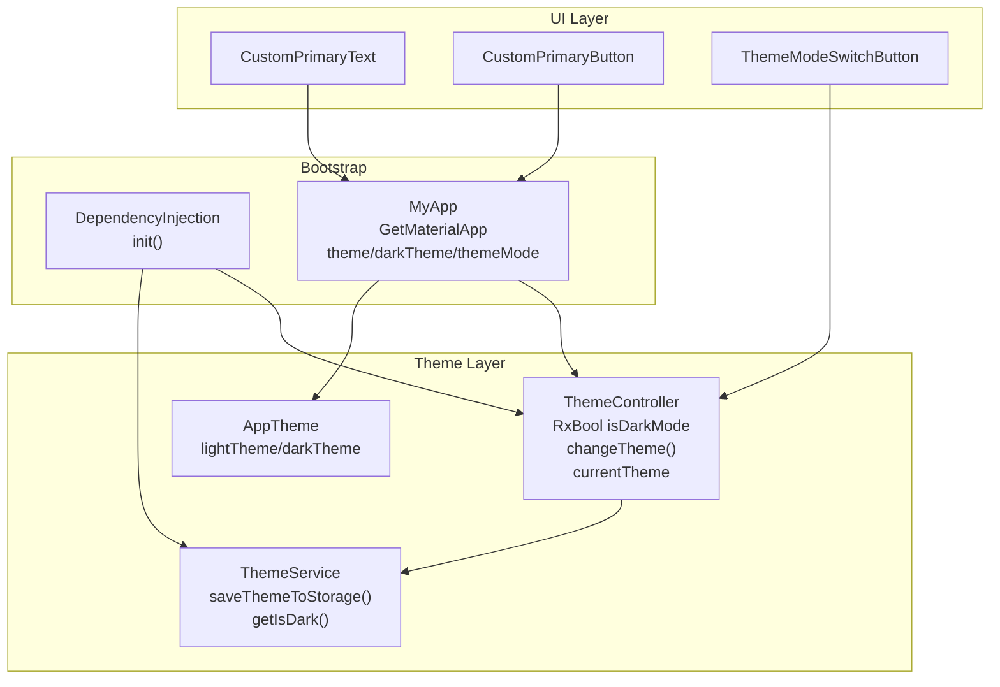
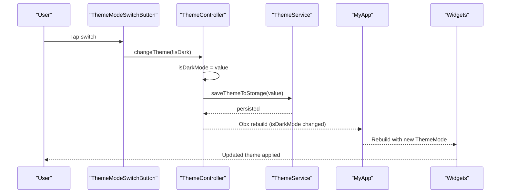
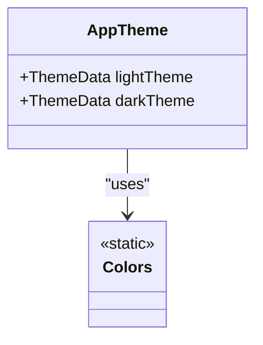
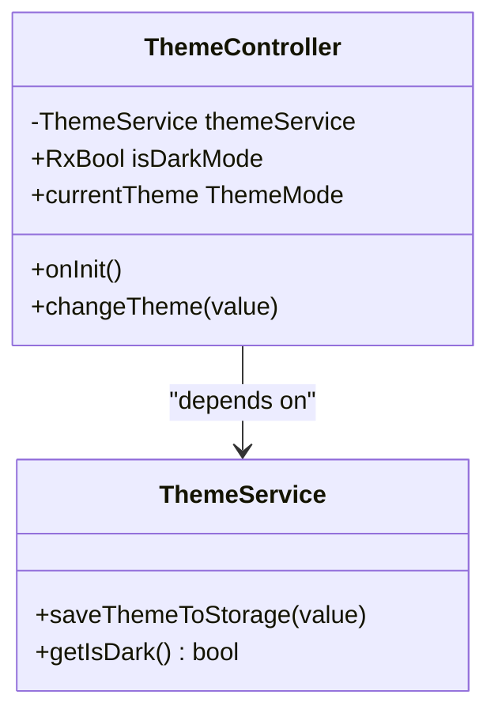
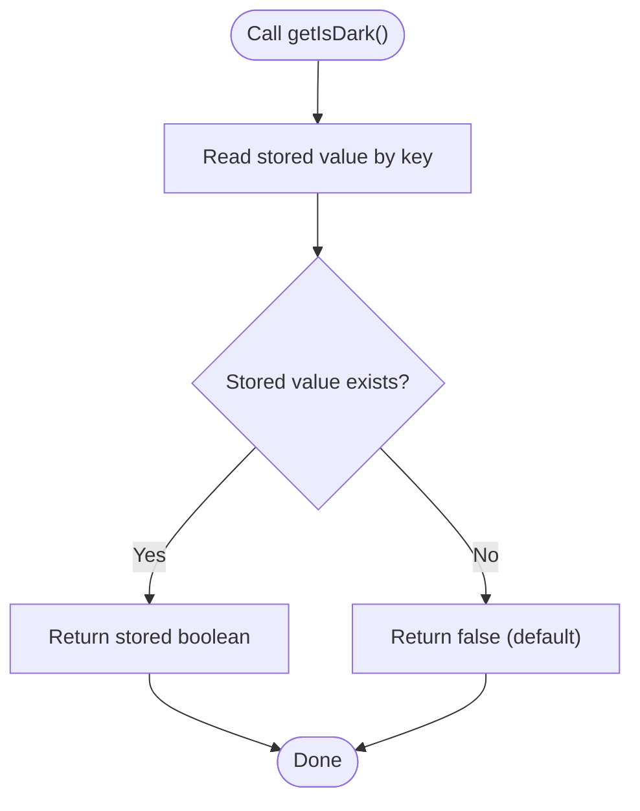
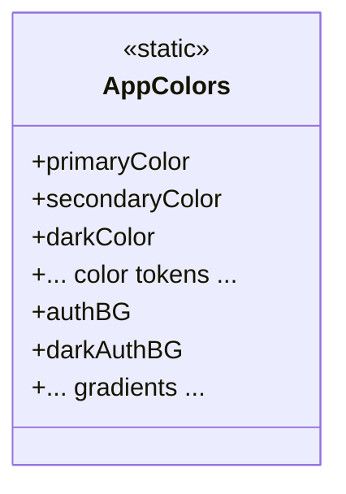
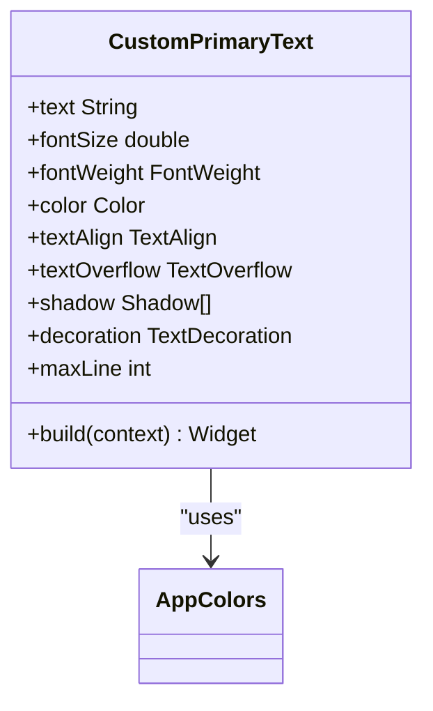
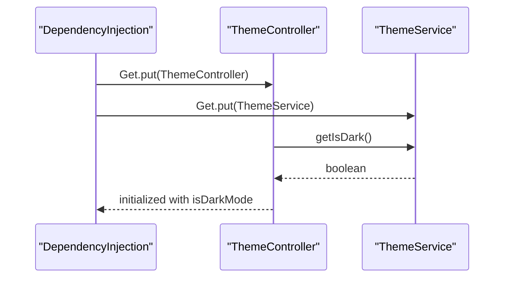
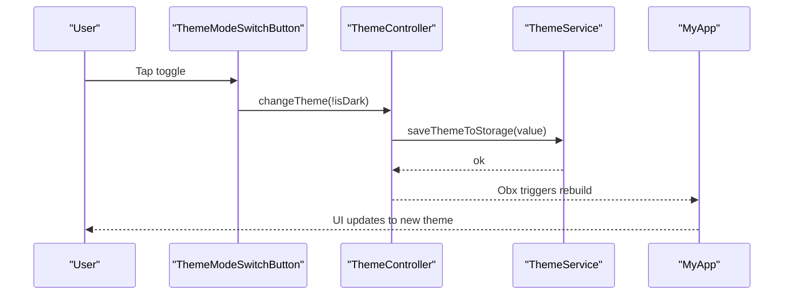
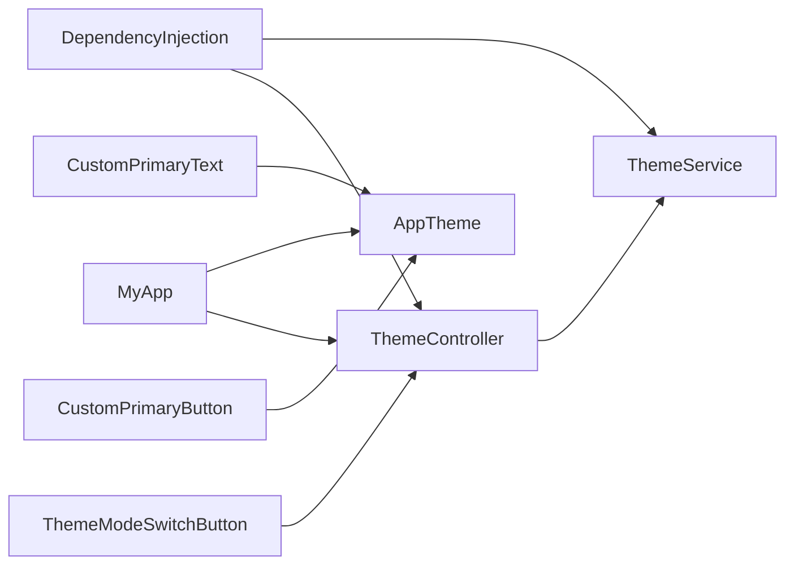

# Theme and Styling System

<cite>
**Referenced Files in This Document**
- [app_theme.dart](file://lib/core/theme/app_theme.dart)
- [theme_controller.dart](file://lib/core/theme/theme_controller.dart)
- [theme_service.dart](file://lib/core/data/local/theme_service.dart)
- [colors.dart](file://lib/core/constant/colors.dart)
- [icons_path.dart](file://lib/core/constant/icons_path.dart)
- [dependency_injection.dart](file://lib/core/di/dependency_injection.dart)
- [main.dart](file://lib/main.dart)
- [custom_primary_text.dart](file://lib/shared/widgets/custom_text/custom_primary_text.dart)
- [custom_primary_button.dart](file://lib/shared/widgets/custom_button/custom_primary_button.dart)
- [theme_mode_switch_button.dart](file://lib/features/profile/widgets/profile_view_widgets/theme_mode_switch_button.dart)
- [login_button.dart](file://lib/features/auth/widgets/login_button.dart)
- [bottom_nav_view.dart](file://lib/features/home/views/bottom_nav_view.dart)
- [custom_span_text.dart](file://lib/shared/widgets/custom_text/custom_span_text.dart)
- [dashboard_card.dart](file://lib/features/dashboard/widgets/dashboard_widget/dashboard_card.dart)
- [styles.xml](file://android/app/src/main/res/values/styles.xml)
- [styles.xml](file://android/app/src/main/res/values-night/styles.xml)
</cite>

## Table of Contents
1. [Introduction](#introduction)
2. [Project Structure](#project-structure)
3. [Core Components](#core-components)
4. [Architecture Overview](#architecture-overview)
5. [Detailed Component Analysis](#detailed-component-analysis)
6. [Dependency Analysis](#dependency-analysis)
7. [Performance Considerations](#performance-considerations)
8. [Troubleshooting Guide](#troubleshooting-guide)
9. [Conclusion](#conclusion)

## Introduction
This document explains the ZB-DEZINE theme and styling system, focusing on dynamic theme switching, light/dark theme support, and color palette management. It documents the AppTheme class structure, theme configuration options, typography definitions, and the ThemeController functionality for state management, user preference persistence, and runtime theme switching. It also covers how themes are applied across components, custom styling patterns, and responsive design considerations using ScreenUtil.

## Project Structure
The theme system is organized around a small set of cohesive components:
- AppTheme: Defines light and dark ThemeData instances
- ThemeController: Manages theme state and exposes ThemeMode
- ThemeService: Persists and retrieves user theme preference
- Colors: Centralized color palette and gradients
- UI widgets: Custom widgets that adapt to theme brightness
- Dependency Injection: Registers services and controllers
- Application bootstrap: Integrates theme configuration into the app

**Diagram sources**
- [app_theme.dart:1-23](file://lib/core/theme/app_theme.dart#L1-L23)
- [theme_controller.dart:1-22](file://lib/core/theme/theme_controller.dart#L1-L22)
- [theme_service.dart:1-16](file://lib/core/data/local/theme_service.dart#L1-L16)
- [dependency_injection.dart:1-27](file://lib/core/di/dependency_injection.dart#L1-L27)
- [main.dart:21-47](file://lib/main.dart#L21-L47)
- [custom_primary_text.dart:1-45](file://lib/shared/widgets/custom_text/custom_primary_text.dart#L1-L45)
- [custom_primary_button.dart:1-74](file://lib/shared/widgets/custom_button/custom_primary_button.dart#L1-L74)
- [theme_mode_switch_button.dart:11-58](file://lib/features/profile/widgets/profile_view_widgets/theme_mode_switch_button.dart#L11-L58)

**Section sources**
- [main.dart:12-47](file://lib/main.dart#L12-L47)
- [dependency_injection.dart:11-27](file://lib/core/di/dependency_injection.dart#L11-L27)

## Core Components
- AppTheme: Provides static ThemeData instances for light and dark modes, enabling Material 3 usage and configuring app bar and date picker themes.
- ThemeController: Reactive controller holding isDarkMode state, initializing from persisted storage, and exposing ThemeMode for the app.
- ThemeService: Uses GetStorage to persist and retrieve the user's theme preference.
- Colors: Centralizes all color tokens and gradients for consistent theming across light and dark modes.
- UI widgets: CustomPrimaryText and CustomPrimaryButton adapt their colors based on the current theme brightness.

**Section sources**
- [app_theme.dart:4-23](file://lib/core/theme/app_theme.dart#L4-L23)
- [theme_controller.dart:5-22](file://lib/core/theme/theme_controller.dart#L5-L22)
- [theme_service.dart:3-16](file://lib/core/data/local/theme_service.dart#L3-L16)
- [colors.dart:3-117](file://lib/core/constant/colors.dart#L3-L117)
- [custom_primary_text.dart:8-45](file://lib/shared/widgets/custom_text/custom_primary_text.dart#L8-L45)
- [custom_primary_button.dart:6-74](file://lib/shared/widgets/custom_button/custom_primary_button.dart#L6-L74)

## Architecture Overview
The theme system follows a reactive pattern:
- ThemeService persists a boolean flag indicating dark mode preference
- ThemeController reads the stored preference during initialization and exposes an observable boolean and ThemeMode
- MyApp configures GetMaterialApp with AppTheme.lightTheme, AppTheme.darkTheme, and ThemeMode from ThemeController
- UI widgets query Theme.of(context).brightness to select appropriate color tokens from Colors

**Diagram sources**
- [theme_mode_switch_button.dart:13-58](file://lib/features/profile/widgets/profile_view_widgets/theme_mode_switch_button.dart#L13-L58)
- [theme_controller.dart:15-22](file://lib/core/theme/theme_controller.dart#L15-L22)
- [theme_service.dart:7-14](file://lib/core/data/local/theme_service.dart#L7-L14)
- [main.dart:29-42](file://lib/main.dart#L29-L42)

## Detailed Component Analysis

### AppTheme
AppTheme encapsulates the design system's ThemeData for both light and dark modes:
- Light theme: Transparent app bar, Material 3 enabled
- Dark theme: Defined primary and surface colors via ColorScheme, Material 3 enabled, date picker theme configured

**Diagram sources**
- [app_theme.dart:4-23](file://lib/core/theme/app_theme.dart#L4-L23)
- [colors.dart:3-117](file://lib/core/constant/colors.dart#L3-L117)

**Section sources**
- [app_theme.dart:4-23](file://lib/core/theme/app_theme.dart#L4-L23)

### ThemeController
ThemeController manages theme state reactively:
- Initializes ThemeService via dependency injection
- Loads persisted theme preference into isDarkMode
- Exposes changeTheme() to update state and persist
- Provides currentTheme getter returning ThemeMode based on isDarkMode

**Diagram sources**
- [theme_controller.dart:5-22](file://lib/core/theme/theme_controller.dart#L5-L22)
- [theme_service.dart:3-16](file://lib/core/data/local/theme_service.dart#L3-L16)

**Section sources**
- [theme_controller.dart:5-22](file://lib/core/theme/theme_controller.dart#L5-L22)

### ThemeService
ThemeService persists the theme preference using GetStorage:
- Stores a boolean under a fixed key
- Reads the stored value with a fallback to default

**Diagram sources**
- [theme_service.dart:11-14](file://lib/core/data/local/theme_service.dart#L11-L14)

**Section sources**
- [theme_service.dart:3-16](file://lib/core/data/local/theme_service.dart#L3-L16)

### Colors Palette
Colors centralizes all tokens and gradients:
- Named color constants for light and dark variants
- Gradients for backgrounds and branding
- Used by widgets to select appropriate colors per theme brightness

**Diagram sources**
- [colors.dart:3-117](file://lib/core/constant/colors.dart#L3-L117)

**Section sources**
- [colors.dart:3-117](file://lib/core/constant/colors.dart#L3-L117)

### Typography Definitions
Typography is defined via Google Fonts integration in CustomPrimaryText:
- Uses Montserrat font family
- Applies fontSize, fontWeight, and color based on theme brightness
- Supports optional shadows, decorations, and truncation

**Diagram sources**
- [custom_primary_text.dart:8-45](file://lib/shared/widgets/custom_text/custom_primary_text.dart#L8-L45)
- [colors.dart:3-117](file://lib/core/constant/colors.dart#L3-L117)

**Section sources**
- [custom_primary_text.dart:8-45](file://lib/shared/widgets/custom_text/custom_primary_text.dart#L8-L45)

### ThemeController Functionality
ThemeController integrates with ThemeService and exposes reactive state:
- Initialization loads persisted preference
- changeTheme updates state and persists
- currentTheme maps to ThemeMode for MaterialApp

**Diagram sources**
- [dependency_injection.dart:14-16](file://lib/core/di/dependency_injection.dart#L14-L16)
- [theme_controller.dart:9-12](file://lib/core/theme/theme_controller.dart#L9-L12)
- [theme_service.dart:11-14](file://lib/core/data/local/theme_service.dart#L11-L14)

**Section sources**
- [dependency_injection.dart:11-27](file://lib/core/di/dependency_injection.dart#L11-L27)
- [theme_controller.dart:9-22](file://lib/core/theme/theme_controller.dart#L9-L22)

### Runtime Theme Switching Implementation
Runtime switching is implemented in a dedicated widget:
- ThemeModeSwitchButton toggles controller.isDarkMode
- Uses animated visuals with theme icons
- Triggers controller.changeTheme() which persists the new value

**Diagram sources**
- [theme_mode_switch_button.dart:13-58](file://lib/features/profile/widgets/profile_view_widgets/theme_mode_switch_button.dart#L13-L58)
- [theme_controller.dart:15-18](file://lib/core/theme/theme_controller.dart#L15-L18)
- [theme_service.dart:7-9](file://lib/core/data/local/theme_service.dart#L7-L9)
- [main.dart:29-42](file://lib/main.dart#L29-L42)

**Section sources**
- [theme_mode_switch_button.dart:13-58](file://lib/features/profile/widgets/profile_view_widgets/theme_mode_switch_button.dart#L13-L58)
- [theme_controller.dart:15-22](file://lib/core/theme/theme_controller.dart#L15-L22)

### Examples of Theme Usage Across Components
- CustomPrimaryText adapts text color based on theme brightness
- CustomPrimaryButton selects background and text colors depending on theme
- LoginButton switches colors and borders according to theme brightness
- Bottom navigation and dashboard cards use theme-aware colors for surfaces and borders
- Rich text components (CustomSpanText) apply theme-appropriate colors to spans

**Section sources**
- [custom_primary_text.dart:28-44](file://lib/shared/widgets/custom_text/custom_primary_text.dart#L28-L44)
- [custom_primary_button.dart:37-73](file://lib/shared/widgets/custom_button/custom_primary_button.dart#L37-L73)
- [login_button.dart:26-62](file://lib/features/auth/widgets/login_button.dart#L26-L62)
- [bottom_nav_view.dart:14-51](file://lib/features/home/views/bottom_nav_view.dart#L14-L51)
- [dashboard_card.dart:24-64](file://lib/features/dashboard/widgets/dashboard_widget/dashboard_card.dart#L24-L64)
- [custom_span_text.dart:54-94](file://lib/shared/widgets/custom_text/custom_span_text.dart#L54-L94)

### Responsive Design Considerations
The app integrates flutter_screenutil for responsive layouts:
- ScreenUtilInit wraps the app with designSize and builder
- Widgets use .w, .h, and .r units for scalable sizing
- Typography scales via sp units
- Theme colors adapt independently of scaling units

**Section sources**
- [main.dart:26-44](file://lib/main.dart#L26-L44)
- [custom_primary_text.dart:36-42](file://lib/shared/widgets/custom_text/custom_primary_text.dart#L36-L42)
- [custom_primary_button.dart:43-71](file://lib/shared/widgets/custom_button/custom_primary_button.dart#L43-L71)

### Android Platform Theme Integration
Android provides platform-level light/dark themes for launch and normal states:
- values/styles.xml defines light theme defaults
- values-night/styles.xml defines dark theme defaults
- These complement Flutter's theme system during app startup

**Section sources**
- [styles.xml:1-18](file://android/app/src/main/res/values/styles.xml#L1-L18)
- [styles.xml:1-18](file://android/app/src/main/res/values-night/styles.xml#L1-L18)

## Dependency Analysis
The theme system exhibits low coupling and high cohesion:
- AppTheme depends only on Colors
- ThemeController depends on ThemeService and exposes ThemeMode
- UI widgets depend on Theme.of(context).brightness and Colors
- DependencyInjection registers services and controllers at startup

**Diagram sources**
- [dependency_injection.dart:11-27](file://lib/core/di/dependency_injection.dart#L11-L27)
- [main.dart:29-42](file://lib/main.dart#L29-L42)
- [theme_controller.dart:9-12](file://lib/core/theme/theme_controller.dart#L9-L12)
- [theme_service.dart:11-14](file://lib/core/data/local/theme_service.dart#L11-L14)
- [custom_primary_text.dart:28-44](file://lib/shared/widgets/custom_text/custom_primary_text.dart#L28-L44)
- [custom_primary_button.dart:37-73](file://lib/shared/widgets/custom_button/custom_primary_button.dart#L37-L73)
- [theme_mode_switch_button.dart:13-58](file://lib/features/profile/widgets/profile_view_widgets/theme_mode_switch_button.dart#L13-L58)

**Section sources**
- [dependency_injection.dart:11-27](file://lib/core/di/dependency_injection.dart#L11-L27)
- [main.dart:29-42](file://lib/main.dart#L29-L42)

## Performance Considerations
- Reactive rebuilds: ThemeController uses RxBool, minimizing unnecessary rebuilds by updating only when the boolean value changes
- Persistent storage: ThemeService uses asynchronous write operations to avoid blocking UI
- Efficient widget adaptation: Widgets query Theme.of(context).brightness once per build and rely on inherited theme data
- Scalable units: ScreenUtil units reduce layout recalculation overhead by providing consistent scaling factors

## Troubleshooting Guide
Common issues and resolutions:
- Theme does not persist after restart:
  - Verify ThemeService.getIsDark() returns the expected default and persisted value
  - Confirm GetStorage is initialized before accessing storage
- Theme toggle does not visually update:
  - Ensure ThemeController.changeTheme() is called and isDarkMode is observed by the UI
  - Confirm MyApp rebuilds via Obx when isDarkMode changes
- Colors appear incorrect in widgets:
  - Check that widgets query Theme.of(context).brightness and use Colors tokens appropriately
  - Validate that AppTheme.darkTheme sets primary and surface colors correctly

**Section sources**
- [theme_service.dart:11-14](file://lib/core/data/local/theme_service.dart#L11-L14)
- [theme_controller.dart:15-18](file://lib/core/theme/theme_controller.dart#L15-L18)
- [main.dart:29-42](file://lib/main.dart#L29-L42)
- [custom_primary_text.dart:28-44](file://lib/shared/widgets/custom_text/custom_primary_text.dart#L28-L44)

## Conclusion
The ZB-DEZINE theme and styling system provides a clean, reactive foundation for dynamic light/dark theme switching. AppTheme defines consistent Material 3 themes, ThemeController manages state and ThemeMode exposure, and ThemeService persists user preferences. UI widgets adapt seamlessly to theme changes using Theme.of(context).brightness and a centralized Colors palette. Combined with ScreenUtil, the system delivers a responsive and maintainable design system across components.