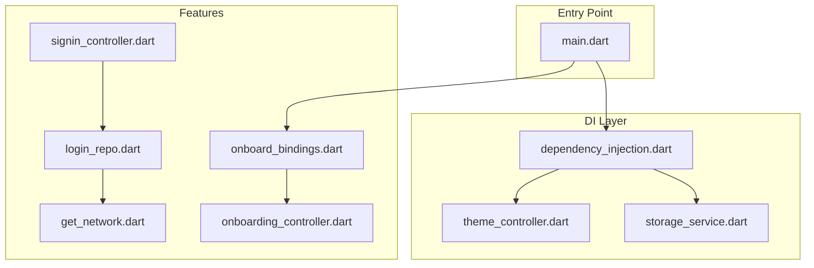
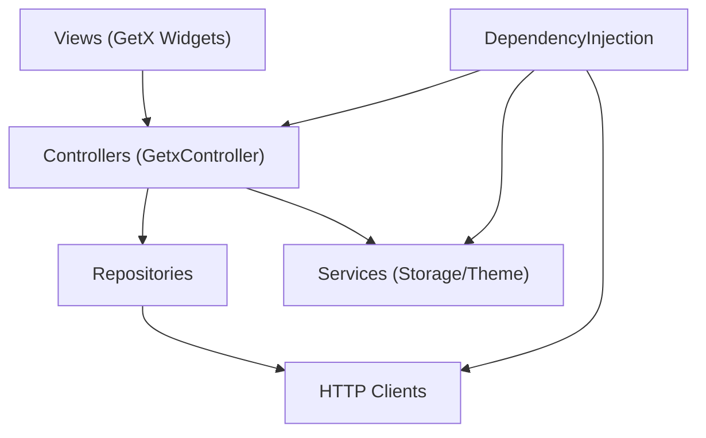
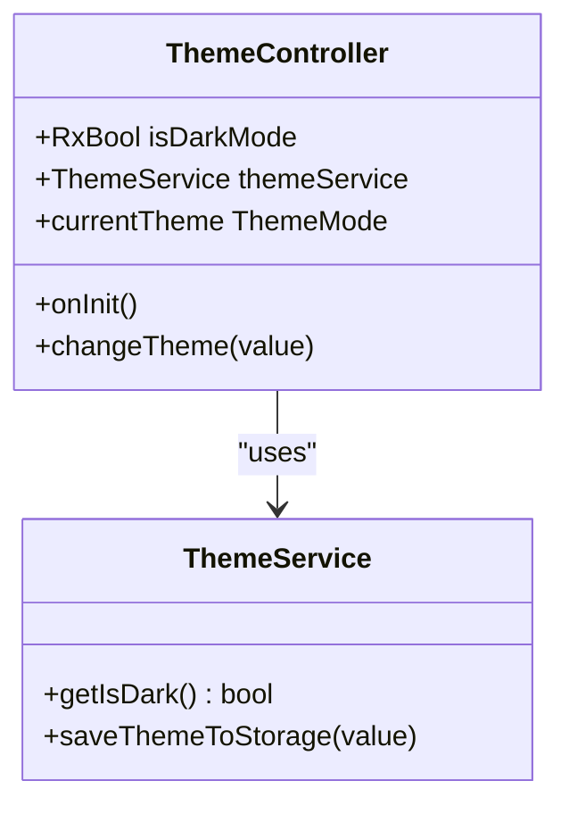
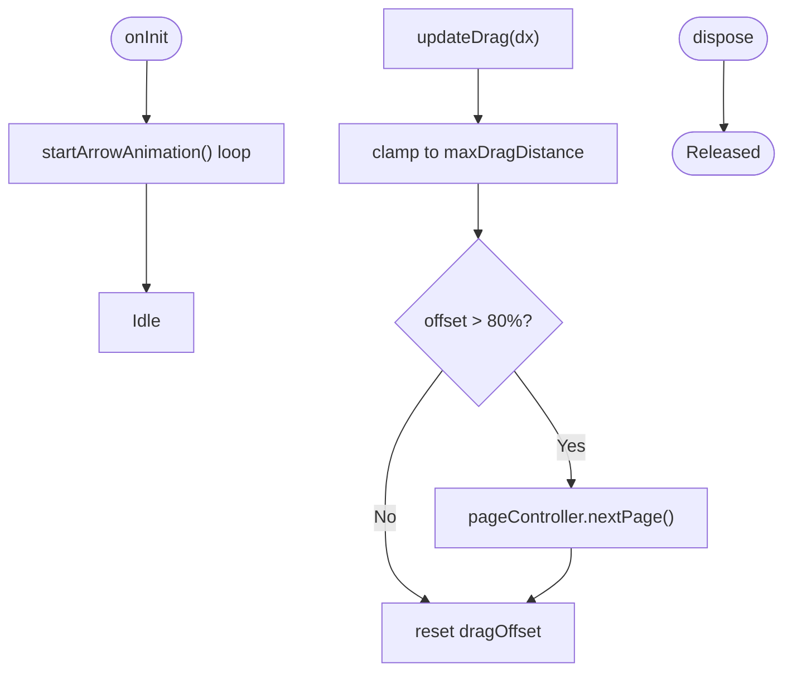
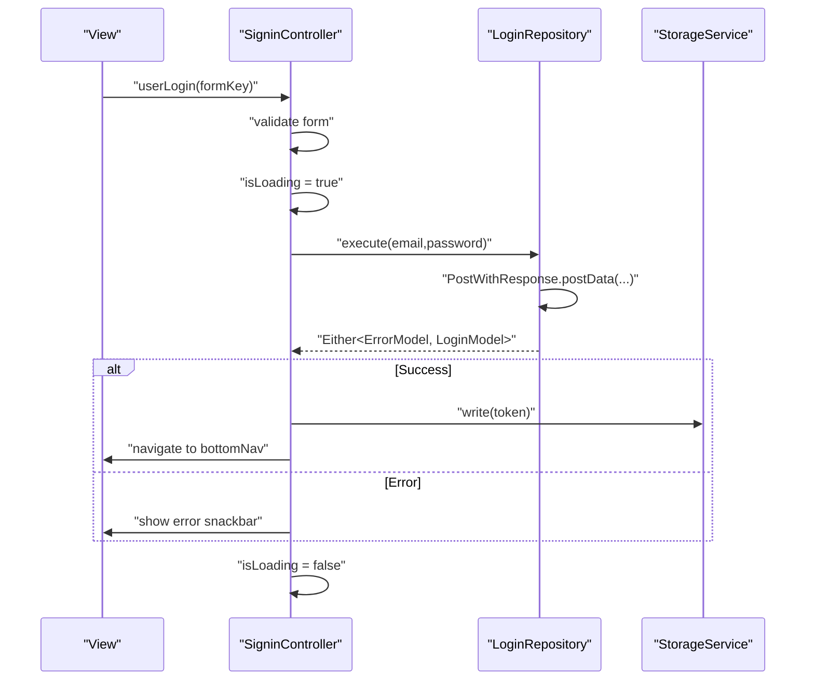
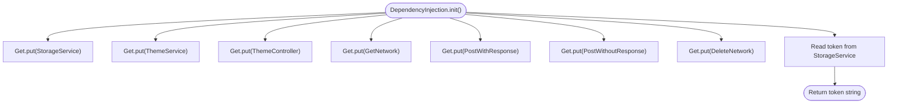
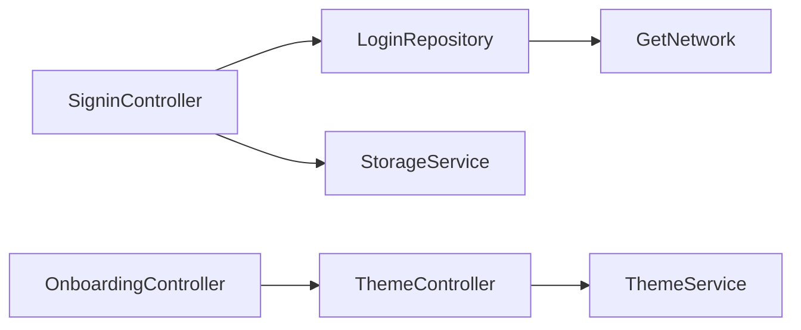

# MVVM Pattern Implementation

<cite>
**Referenced Files in This Document**
- [main.dart](file://lib/main.dart)
- [dependency_injection.dart](file://lib/core/di/dependency_injection.dart)
- [theme_controller.dart](file://lib/core/theme/theme_controller.dart)
- [storage_service.dart](file://lib/core/data/local/storage_service.dart)
- [onboarding_controller.dart](file://lib/features/auth/controller/onboarding_controller.dart)
- [signin_controller.dart](file://lib/features/auth/controller/signin_controller.dart)
- [login_repo.dart](file://lib/features/auth/repositories/login_repo.dart)
- [get_network.dart](file://lib/core/data/networks/get_network.dart)
- [onboard_bindings.dart](file://lib/features/auth/bindings/onboard_bindings.dart)
</cite>

## Table of Contents
1. [Introduction](#introduction)
2. [Project Structure](#project-structure)
3. [Core Components](#core-components)
4. [Architecture Overview](#architecture-overview)
5. [Detailed Component Analysis](#detailed-component-analysis)
6. [Dependency Analysis](#dependency-analysis)
7. [Performance Considerations](#performance-considerations)
8. [Troubleshooting Guide](#troubleshooting-guide)
9. [Conclusion](#conclusion)

## Introduction
This document explains how ZB-DEZINE implements the MVVM pattern using GetX. It focuses on how controllers manage business logic and reactive state, how views bind to controllers, and how state synchronization works. It also covers the observer pattern, reactive updates, dependency injection via GetX, controller lifecycle management, state persistence, error handling, best practices for controller organization, memory management, and performance optimization.

## Project Structure
The application follows a layered structure:
- Entry point initializes dependency injection and sets up routing and themes.
- Controllers live under feature folders and extend GetX’s reactive controller base class.
- Repositories encapsulate network calls and return typed results.
- Services and storage are injected globally for cross-feature access.
- Bindings lazily instantiate controllers per screen.

**Diagram sources**
- [main.dart:12-46](file://lib/main.dart#L12-L46)
- [dependency_injection.dart:11-26](file://lib/core/di/dependency_injection.dart#L11-L26)
- [onboard_bindings.dart:4-9](file://lib/features/auth/bindings/onboard_bindings.dart#L4-L9)
- [onboarding_controller.dart:7-124](file://lib/features/auth/controller/onboarding_controller.dart#L7-L124)
- [signin_controller.dart:9-52](file://lib/features/auth/controller/signin_controller.dart#L9-L52)
- [login_repo.dart:9-29](file://lib/features/auth/repositories/login_repo.dart#L9-L29)
- [get_network.dart:8-41](file://lib/core/data/networks/get_network.dart#L8-L41)

**Section sources**
- [main.dart:12-46](file://lib/main.dart#L12-L46)
- [dependency_injection.dart:11-26](file://lib/core/di/dependency_injection.dart#L11-L26)

## Core Components
- GetX controllers: Reactive state containers that extend GetxController and expose observable fields.
- Repositories: Encapsulate network logic and return Either<ErrorModel, Model>.
- Services: Injected singletons for storage and theme management.
- Bindings: Lazy instantiation of controllers per route.
- Views: Observe controllers via GetBuilder/Obx and react to state changes.

Key implementation highlights:
- Reactive state: Fields prefixed with Rx or obs enable automatic UI updates.
- Error modeling: Consistent ErrorModel usage across network failures.
- DI: Global singletons and lazy bindings decouple controllers from dependencies.

**Section sources**
- [theme_controller.dart:5-22](file://lib/core/theme/theme_controller.dart#L5-L22)
- [onboarding_controller.dart:7-124](file://lib/features/auth/controller/onboarding_controller.dart#L7-L124)
- [signin_controller.dart:9-52](file://lib/features/auth/controller/signin_controller.dart#L9-L52)
- [login_repo.dart:9-29](file://lib/features/auth/repositories/login_repo.dart#L9-L29)
- [get_network.dart:8-41](file://lib/core/data/networks/get_network.dart#L8-L41)
- [onboard_bindings.dart:4-9](file://lib/features/auth/bindings/onboard_bindings.dart#L4-L9)

## Architecture Overview
The MVVM architecture leverages GetX’s reactive ecosystem:
- Model: Plain Dart models (e.g., LoginModel) and ErrorModel.
- View: Stateless widgets that observe controller state.
- ViewModel: GetxController instances managing state and business logic.
- Services: StorageService and ThemeService injected globally.
- DI: DependencyInjection registers singletons and resolves tokens.

**Diagram sources**
- [main.dart:12-46](file://lib/main.dart#L12-L46)
- [dependency_injection.dart:11-26](file://lib/core/di/dependency_injection.dart#L11-L26)
- [signin_controller.dart:9-52](file://lib/features/auth/controller/signin_controller.dart#L9-L52)
- [login_repo.dart:9-29](file://lib/features/auth/repositories/login_repo.dart#L9-L29)
- [get_network.dart:8-41](file://lib/core/data/networks/get_network.dart#L8-L41)
- [storage_service.dart:3-23](file://lib/core/data/local/storage_service.dart#L3-L23)
- [theme_controller.dart:5-22](file://lib/core/theme/theme_controller.dart#L5-L22)

## Detailed Component Analysis

### ThemeController: Reactive Theme Management
ThemeController manages dark/light mode state reactively and persists it via ThemeService. It exposes a reactive boolean and a computed ThemeMode getter.

**Diagram sources**
- [theme_controller.dart:5-22](file://lib/core/theme/theme_controller.dart#L5-L22)

**Section sources**
- [theme_controller.dart:5-22](file://lib/core/theme/theme_controller.dart#L5-L22)

### OnboardingController: Gesture-Driven Reactive State
OnboardingController demonstrates gesture-driven reactive state with:
- Observable page index and drag offset.
- Animated arrow indicator synchronized with theme.
- Lifecycle initialization and disposal.

**Diagram sources**
- [onboarding_controller.dart:119-122](file://lib/features/auth/controller/onboarding_controller.dart#L119-L122)
- [onboarding_controller.dart:38-68](file://lib/features/auth/controller/onboarding_controller.dart#L38-L68)

**Section sources**
- [onboarding_controller.dart:7-124](file://lib/features/auth/controller/onboarding_controller.dart#L7-L124)

### SigninController: Authentication Workflow with Reactive Loading
SigninController orchestrates login:
- Validates forms.
- Sets loading state.
- Calls repository to authenticate.
- Persists token and navigates on success.
- Handles errors via snackbars.

**Diagram sources**
- [signin_controller.dart:17-36](file://lib/features/auth/controller/signin_controller.dart#L17-L36)
- [login_repo.dart:14-27](file://lib/features/auth/repositories/login_repo.dart#L14-L27)
- [storage_service.dart:11-13](file://lib/core/data/local/storage_service.dart#L11-L13)

**Section sources**
- [signin_controller.dart:9-52](file://lib/features/auth/controller/signin_controller.dart#L9-L52)
- [login_repo.dart:9-29](file://lib/features/auth/repositories/login_repo.dart#L9-L29)
- [storage_service.dart:3-23](file://lib/core/data/local/storage_service.dart#L3-L23)

### Dependency Injection: Singletons and Lazy Bindings
DependencyInjection initializes storage, theme service, and network clients as singletons. Bindings lazily instantiate controllers per route.

**Diagram sources**
- [dependency_injection.dart:12-25](file://lib/core/di/dependency_injection.dart#L12-L25)

**Section sources**
- [dependency_injection.dart:11-26](file://lib/core/di/dependency_injection.dart#L11-L26)
- [onboard_bindings.dart:4-9](file://lib/features/auth/bindings/onboard_bindings.dart#L4-L9)

## Dependency Analysis
- Controllers depend on repositories/services via constructor injection.
- Repositories depend on network clients returning Either<ErrorModel, T>.
- DI provides singletons and lazy bindings to decouple views from implementation details.
- ThemeController depends on ThemeService for persistence and exposes reactive state.

**Diagram sources**
- [signin_controller.dart:9-52](file://lib/features/auth/controller/signin_controller.dart#L9-L52)
- [login_repo.dart:9-29](file://lib/features/auth/repositories/login_repo.dart#L9-L29)
- [get_network.dart:8-41](file://lib/core/data/networks/get_network.dart#L8-L41)
- [onboarding_controller.dart:24-29](file://lib/features/auth/controller/onboarding_controller.dart#L24-L29)
- [theme_controller.dart:5-22](file://lib/core/theme/theme_controller.dart#L5-L22)

**Section sources**
- [signin_controller.dart:9-52](file://lib/features/auth/controller/signin_controller.dart#L9-L52)
- [login_repo.dart:9-29](file://lib/features/auth/repositories/login_repo.dart#L9-L29)
- [get_network.dart:8-41](file://lib/core/data/networks/get_network.dart#L8-L41)
- [onboarding_controller.dart:7-124](file://lib/features/auth/controller/onboarding_controller.dart#L7-L124)
- [theme_controller.dart:5-22](file://lib/core/theme/theme_controller.dart#L5-L22)

## Performance Considerations
- Prefer Rx<T> fields only where needed to minimize rebuild scope.
- Use Get.lazyPut for controllers to defer instantiation until first use.
- Avoid heavy computations in onInit; offload to background tasks when possible.
- Dispose controllers and controllers’ resources (e.g., PageController) to prevent leaks.
- Cache frequently accessed services via Get.find to avoid repeated lookups.
- Use compact observables (e.g., booleans, small integers) to reduce unnecessary rebuilds.

## Troubleshooting Guide
Common issues and resolutions:
- Token not persisted: Verify StorageService write path and key correctness.
- Theme not updating: Ensure ThemeController is a singleton and isDarkMode is properly observed by the UI.
- Login errors: Inspect ErrorModel construction from HTTP responses and repository calls.
- Memory leaks: Confirm dispose() clears controllers and native resources.

**Section sources**
- [storage_service.dart:11-13](file://lib/core/data/local/storage_service.dart#L11-L13)
- [theme_controller.dart:5-22](file://lib/core/theme/theme_controller.dart#L5-L22)
- [signin_controller.dart:25-34](file://lib/features/auth/controller/signin_controller.dart#L25-L34)
- [get_network.dart:14-39](file://lib/core/data/networks/get_network.dart#L14-L39)
- [onboarding_controller.dart:113-116](file://lib/features/auth/controller/onboarding_controller.dart#L113-L116)

## Conclusion
ZB-DEZINE’s MVVM with GetX emphasizes reactive controllers, centralized dependency injection, and repository-based networking. Controllers encapsulate state and business logic, views remain declarative and reactive, and services provide cross-cutting concerns. Following the outlined best practices ensures maintainable, performant, and scalable UI updates across the application.