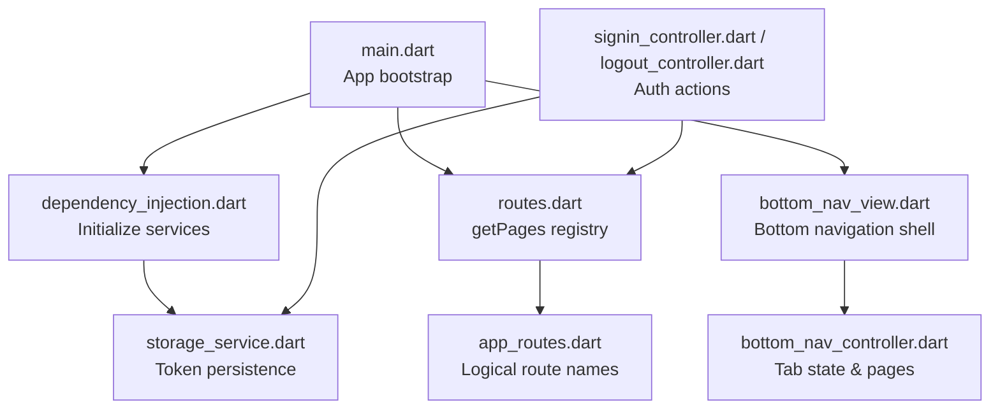
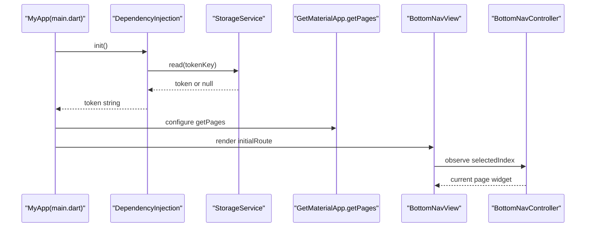
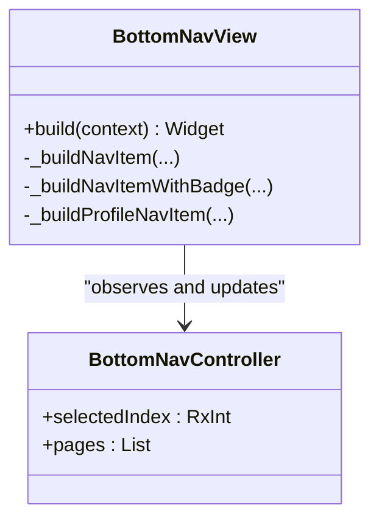
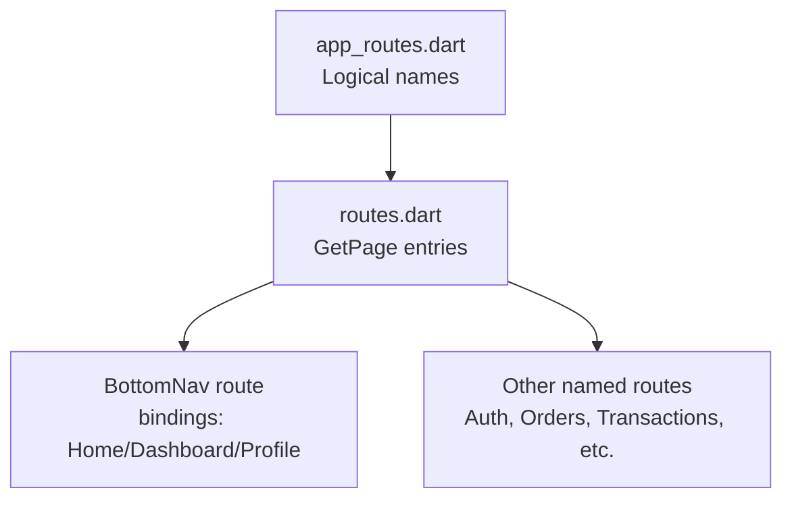
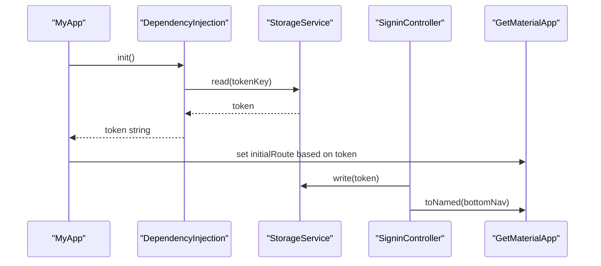
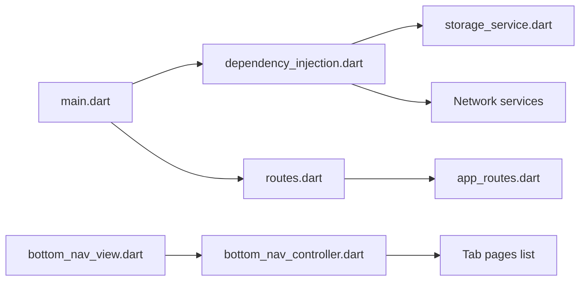

# Navigation and Screen Management

<cite>
**Referenced Files in This Document**
- [main.dart](file://lib/main.dart)
- [app_routes.dart](file://lib/core/routes/app_routes.dart)
- [routes.dart](file://lib/core/routes/routes.dart)
- [bottom_nav_view.dart](file://lib/features/home/views/bottom_nav_view.dart)
- [bottom_nav_controller.dart](file://lib/features/home/controller/bottom_nav_controller.dart)
- [home_bindings.dart](file://lib/features/home/bindings/home_bindings.dart)
- [onboard_bindings.dart](file://lib/features/auth/bindings/onboard_bindings.dart)
- [dependency_injection.dart](file://lib/core/di/dependency_injection.dart)
- [storage_service.dart](file://lib/core/data/local/storage_service.dart)
- [signin_controller.dart](file://lib/features/auth/controller/signin_controller.dart)
- [logout_controller.dart](file://lib/features/auth/controller/logout_controller.dart)
</cite>

## Table of Contents
1. [Introduction](#introduction)
2. [Project Structure](#project-structure)
3. [Core Components](#core-components)
4. [Architecture Overview](#architecture-overview)
5. [Detailed Component Analysis](#detailed-component-analysis)
6. [Dependency Analysis](#dependency-analysis)
7. [Performance Considerations](#performance-considerations)
8. [Troubleshooting Guide](#troubleshooting-guide)
9. [Conclusion](#conclusion)

## Introduction
This document explains ZB-DEZINE’s navigation and screen management architecture built on Flutter with GetX. It covers:
- Bottom navigation implementation and state management
- Route definitions and registration
- Authentication-aware routing and initial route selection
- Programmatic navigation and deep linking considerations
- Navigation state persistence and performance optimization
- Best practices for complex navigation flows

## Project Structure
The navigation system centers around:
- A single entry point that configures the app shell and initial route
- A centralized route registry that maps logical names to screens and bindings
- A bottom navigation container that hosts multiple tabbed screens
- DI initialization that seeds authentication state and services

**Diagram sources**
- [main.dart:12-46](file://lib/main.dart#L12-L46)
- [dependency_injection.dart:11-26](file://lib/core/di/dependency_injection.dart#L11-L26)
- [routes.dart:55-211](file://lib/core/routes/routes.dart#L55-L211)
- [app_routes.dart:1-34](file://lib/core/routes/app_routes.dart#L1-L34)
- [bottom_nav_view.dart:11-131](file://lib/features/home/views/bottom_nav_view.dart#L11-L131)
- [bottom_nav_controller.dart:7-16](file://lib/features/home/controller/bottom_nav_controller.dart#L7-L16)
- [storage_service.dart:3-22](file://lib/core/data/local/storage_service.dart#L3-L22)
- [signin_controller.dart:9-51](file://lib/features/auth/controller/signin_controller.dart#L9-L51)
- [logout_controller.dart:7-29](file://lib/features/auth/controller/logout_controller.dart#L7-L29)

**Section sources**
- [main.dart:12-46](file://lib/main.dart#L12-L46)
- [routes.dart:55-211](file://lib/core/routes/routes.dart#L55-L211)
- [app_routes.dart:1-34](file://lib/core/routes/app_routes.dart#L1-L34)

## Core Components
- Initial route selection: The app chooses the initial route based on whether a token exists. If present, it starts at the bottom navigation shell; otherwise, it opens the onboarding flow.
- Route registry: All named routes are declared centrally and mapped to their respective screens and bindings.
- Bottom navigation shell: A custom bottom bar with five tabs and a floating center action. The selected tab index drives which child page is shown.
- Binding setup: Each major area (home, dashboard, profile) registers its own binding to inject dependencies lazily.

**Section sources**
- [main.dart:36-40](file://lib/main.dart#L36-L40)
- [app_routes.dart:1-34](file://lib/core/routes/app_routes.dart#L1-L34)
- [routes.dart:121-125](file://lib/core/routes/routes.dart#L121-L125)
- [bottom_nav_view.dart:11-131](file://lib/features/home/views/bottom_nav_view.dart#L11-L131)
- [bottom_nav_controller.dart:7-16](file://lib/features/home/controller/bottom_nav_controller.dart#L7-L16)
- [home_bindings.dart:13-34](file://lib/features/home/bindings/home_bindings.dart#L13-L34)

## Architecture Overview
The navigation architecture follows a layered pattern:
- App bootstrap sets theme, initial binding, and initial route
- DI initializes storage and network services and reads the token
- Route registry defines all screens and their bindings
- Bottom navigation shell manages tab state and renders the active page
- Authentication controllers update storage and navigate after login/logout

**Diagram sources**
- [main.dart:12-46](file://lib/main.dart#L12-L46)
- [dependency_injection.dart:11-26](file://lib/core/di/dependency_injection.dart#L11-L26)
- [storage_service.dart:7-9](file://lib/core/data/local/storage_service.dart#L7-L9)
- [routes.dart:55-211](file://lib/core/routes/routes.dart#L55-L211)
- [bottom_nav_view.dart:11-131](file://lib/features/home/views/bottom_nav_view.dart#L11-L131)
- [bottom_nav_controller.dart:7-16](file://lib/features/home/controller/bottom_nav_controller.dart#L7-L16)

## Detailed Component Analysis

### Bottom Navigation Implementation
The bottom navigation shell renders a custom bar with five items and a floating center action. The active page is determined by an observable index that selects from a fixed list of page widgets. The controller holds the page list and exposes the selected index.

**Diagram sources**
- [bottom_nav_view.dart:11-256](file://lib/features/home/views/bottom_nav_view.dart#L11-L256)
- [bottom_nav_controller.dart:7-16](file://lib/features/home/controller/bottom_nav_controller.dart#L7-L16)

**Section sources**
- [bottom_nav_view.dart:11-131](file://lib/features/home/views/bottom_nav_view.dart#L11-L131)
- [bottom_nav_view.dart:133-256](file://lib/features/home/views/bottom_nav_view.dart#L133-L256)
- [bottom_nav_controller.dart:7-16](file://lib/features/home/controller/bottom_nav_controller.dart#L7-L16)

### Route Definitions and Registration
Route names are defined in a central constants file and registered in a typed list with associated bindings. The bottom navigation route aggregates multiple bindings for its child screens.

**Diagram sources**
- [app_routes.dart:1-34](file://lib/core/routes/app_routes.dart#L1-L34)
- [routes.dart:55-211](file://lib/core/routes/routes.dart#L55-L211)
- [routes.dart:121-125](file://lib/core/routes/routes.dart#L121-L125)

**Section sources**
- [app_routes.dart:1-34](file://lib/core/routes/app_routes.dart#L1-L34)
- [routes.dart:55-211](file://lib/core/routes/routes.dart#L55-L211)

### Authentication-Aware Routing
Initial route selection depends on the presence of a stored token. After successful login, the app navigates to the bottom navigation shell. Logout clears the token and returns to the sign-in route.

**Diagram sources**
- [main.dart:12-46](file://lib/main.dart#L12-L46)
- [dependency_injection.dart:11-26](file://lib/core/di/dependency_injection.dart#L11-L26)
- [storage_service.dart:7-13](file://lib/core/data/local/storage_service.dart#L7-L13)
- [signin_controller.dart:17-36](file://lib/features/auth/controller/signin_controller.dart#L17-L36)

**Section sources**
- [main.dart:36-40](file://lib/main.dart#L36-L40)
- [dependency_injection.dart:11-26](file://lib/core/di/dependency_injection.dart#L11-L26)
- [storage_service.dart:7-13](file://lib/core/data/local/storage_service.dart#L7-L13)
- [signin_controller.dart:17-36](file://lib/features/auth/controller/signin_controller.dart#L17-L36)
- [logout_controller.dart:13-28](file://lib/features/auth/controller/logout_controller.dart#L13-L28)

### Programmatic Navigation Examples
- Navigate to a named route by its logical name constant
- Replace the entire backstack and jump to a specific screen
- Use bindings to ensure dependencies are ready before navigating

Examples are referenced by file paths:
- [Programmatic navigation to bottom navigation](file://lib/features/auth/controller/signin_controller.dart#L32)
- [Replace backstack to sign-in after logout](file://lib/features/auth/controller/logout_controller.dart#L21)

**Section sources**
- [signin_controller.dart:32](file://lib/features/auth/controller/signin_controller.dart#L32)
- [logout_controller.dart:21](file://lib/features/auth/controller/logout_controller.dart#L21)

### Deep Linking Considerations
Deep linking is not implemented in the current codebase. To support it:
- Add a deep link handler to parse incoming URIs
- Map URIs to logical route names
- Initialize DI and storage before navigation
- Consider preloading bindings for target screens

[No sources needed since this section provides general guidance]

### Navigation Guards and Permissions
There are no explicit route guards in the current codebase. To implement guards:
- Add a guard layer that checks token and permissions before allowing navigation
- Use a wrapper around Get.toNamed to enforce policies
- Store last-known good route and redirect after authentication

[No sources needed since this section provides general guidance]

## Dependency Analysis
The navigation stack relies on:
- GetX for routing, state, and dependency injection
- Centralized route registry for decoupled navigation
- DI module for storage and network services
- Bottom navigation controller for tab state

**Diagram sources**
- [dependency_injection.dart:11-26](file://lib/core/di/dependency_injection.dart#L11-L26)
- [storage_service.dart:3-22](file://lib/core/data/local/storage_service.dart#L3-L22)
- [main.dart:12-46](file://lib/main.dart#L12-L46)
- [routes.dart:55-211](file://lib/core/routes/routes.dart#L55-L211)
- [app_routes.dart:1-34](file://lib/core/routes/app_routes.dart#L1-L34)
- [bottom_nav_view.dart:11-131](file://lib/features/home/views/bottom_nav_view.dart#L11-L131)
- [bottom_nav_controller.dart:7-16](file://lib/features/home/controller/bottom_nav_controller.dart#L7-L16)

**Section sources**
- [dependency_injection.dart:11-26](file://lib/core/di/dependency_injection.dart#L11-L26)
- [routes.dart:55-211](file://lib/core/routes/routes.dart#L55-L211)
- [bottom_nav_controller.dart:7-16](file://lib/features/home/controller/bottom_nav_controller.dart#L7-L16)

## Performance Considerations
- Prefer lazy loading via bindings to avoid initializing unused dependencies
- Keep bottom navigation pages lightweight; defer heavy work to controllers
- Use observables sparingly; batch updates when switching tabs
- Avoid rebuilding entire subtrees by scoping Obx appropriately
- Cache frequently accessed data in controllers to reduce repeated fetches

[No sources needed since this section provides general guidance]

## Troubleshooting Guide
Common issues and remedies:
- Token not persisted: Verify storage writes after login and reads during startup
- Incorrect initial route: Confirm token availability and initialRoute logic
- Tab not updating: Ensure selectedIndex is an observable and triggers rebuilds
- Memory leaks: Use dispose in controllers and avoid holding long-lived references

**Section sources**
- [storage_service.dart:7-13](file://lib/core/data/local/storage_service.dart#L7-L13)
- [main.dart:36-40](file://lib/main.dart#L36-L40)
- [bottom_nav_controller.dart:8](file://lib/features/home/controller/bottom_nav_controller.dart#L8)
- [signin_controller.dart:46-50](file://lib/features/auth/controller/signin_controller.dart#L46-L50)

## Conclusion
ZB-DEZINE’s navigation system leverages a clean separation of concerns:
- Centralized route definitions and bindings
- DI-driven service initialization
- A custom bottom navigation shell with observable state
- Authentication-aware routing based on token presence

Extending the system should focus on adding guards, deep linking, and performance optimizations while preserving the existing modular structure.