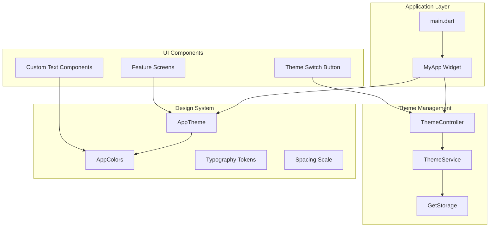
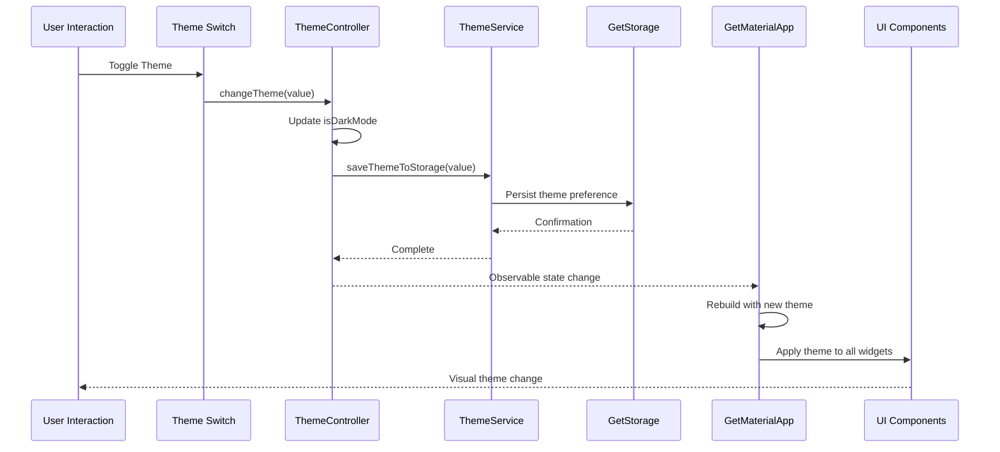
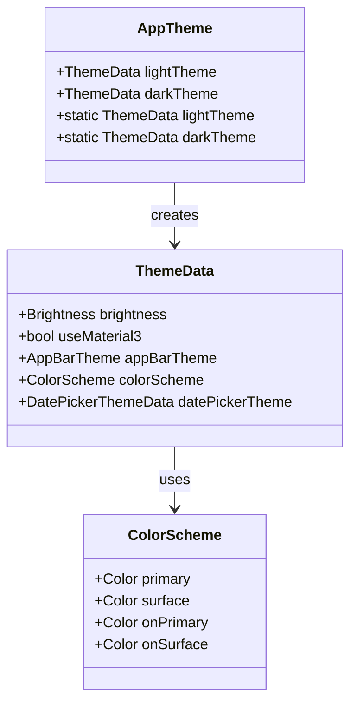
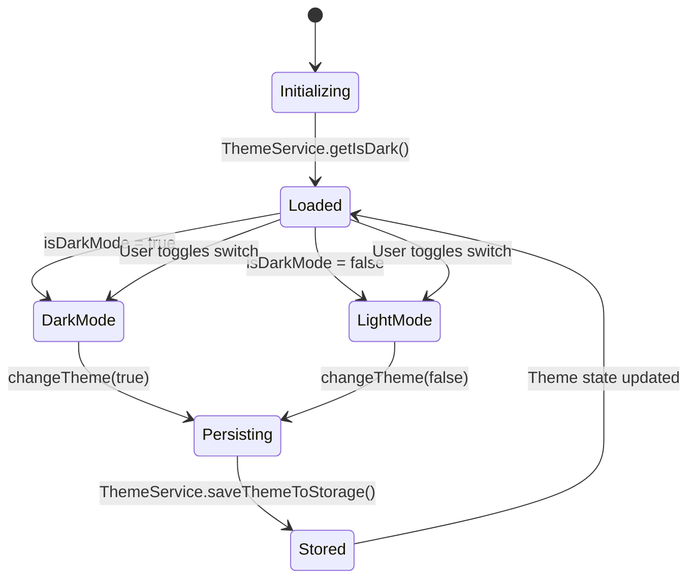

# Theming and Design System

<cite>
**Referenced Files in This Document**
- [main.dart](file://lib/main.dart)
- [app_theme.dart](file://lib/core/theme/app_theme.dart)
- [theme_controller.dart](file://lib/core/theme/theme_controller.dart)
- [theme_service.dart](file://lib/core/data/local/theme_service.dart)
- [colors.dart](file://lib/core/constant/colors.dart)
- [dependency_injection.dart](file://lib/core/di/dependency_injection.dart)
- [theme_mode_switch_button.dart](file://lib/features/profile/widgets/profile_view_widgets/theme_mode_switch_button.dart)
- [custom_span_text.dart](file://lib/shared/widgets/custom_text/custom_span_text.dart)
- [styles.xml](file://android/app/src/main/res/values/styles.xml)
- [styles.xml (night)](file://android/app/src/main/res/values-night/styles.xml)
</cite>

## Table of Contents
1. [Introduction](#introduction)
2. [Project Structure](#project-structure)
3. [Core Components](#core-components)
4. [Architecture Overview](#architecture-overview)
5. [Detailed Component Analysis](#detailed-component-analysis)
6. [Typography and Spacing Systems](#typography-and-spacing-systems)
7. [Design Token Management](#design-token-management)
8. [Dynamic Theming Implementation](#dynamic-theming-implementation)
9. [Cross-Platform Theme Consistency](#cross-platform-theme-consistency)
10. [Performance Considerations](#performance-considerations)
11. [Accessibility Compliance](#accessibility-compliance)
12. [Troubleshooting Guide](#troubleshooting-guide)
13. [Conclusion](#conclusion)

## Introduction
This document provides comprehensive documentation for ZB-DEZINE's theming system and design tokens. It details the Material Design 3 implementation, light/dark theme switching, color scheme management, typography systems, spacing scales, and design token usage throughout the application. The documentation includes examples of theme customization, dynamic theming, responsive design considerations, performance optimization, accessibility compliance, and cross-platform design consistency.

## Project Structure
The theming system is organized around several key modules that work together to provide a cohesive design experience:

**Diagram sources**
- [main.dart:21-46](file://lib/main.dart#L21-L46)
- [theme_controller.dart:5-22](file://lib/core/theme/theme_controller.dart#L5-L22)
- [app_theme.dart:4-23](file://lib/core/theme/app_theme.dart#L4-L23)

**Section sources**
- [main.dart:1-47](file://lib/main.dart#L1-L47)
- [dependency_injection.dart:11-27](file://lib/core/di/dependency_injection.dart#L11-L27)

## Core Components
The theming system consists of four fundamental components that work together to provide seamless theme management:

### AppTheme Class
The central theme definition that establishes Material Design 3 compliant themes for both light and dark modes. The implementation focuses on clean, modern design principles with careful attention to accessibility and user experience.

### ThemeController
A reactive controller that manages theme state using GetX's reactive programming model. It provides observable theme state and handles persistence through the ThemeService.

### ThemeService
A storage abstraction layer that persists theme preferences using GetStorage, ensuring theme choices persist across app restarts.

### AppColors
A centralized color palette system that defines all color tokens used throughout the application, supporting both light and dark variants.

**Section sources**
- [app_theme.dart:4-23](file://lib/core/theme/app_theme.dart#L4-L23)
- [theme_controller.dart:5-22](file://lib/core/theme/theme_controller.dart#L5-L22)
- [theme_service.dart:3-16](file://lib/core/data/local/theme_service.dart#L3-L16)
- [colors.dart:3-117](file://lib/core/constant/colors.dart#L3-L117)

## Architecture Overview
The theming architecture follows a reactive pattern with clear separation of concerns:

**Diagram sources**
- [theme_mode_switch_button.dart:13-58](file://lib/features/profile/widgets/profile_view_widgets/theme_mode_switch_button.dart#L13-L58)
- [theme_controller.dart:15-18](file://lib/core/theme/theme_controller.dart#L15-L18)
- [theme_service.dart:7-9](file://lib/core/data/local/theme_service.dart#L7-L9)
- [main.dart:29-42](file://lib/main.dart#L29-L42)

The architecture ensures that theme changes propagate seamlessly throughout the application while maintaining performance and user experience quality.

**Section sources**
- [main.dart:21-46](file://lib/main.dart#L21-L46)
- [theme_controller.dart:1-22](file://lib/core/theme/theme_controller.dart#L1-L22)
- [dependency_injection.dart:11-27](file://lib/core/di/dependency_injection.dart#L11-L27)

## Detailed Component Analysis

### AppTheme Implementation
The AppTheme class defines two primary themes: light and dark, both utilizing Material Design 3 specifications.

#### Light Theme Configuration
The light theme establishes a clean, modern foundation with transparent app bar styling and Material Design 3 compliance.

#### Dark Theme Configuration
The dark theme provides comprehensive color scheme support with carefully selected primary and surface colors for optimal contrast and readability.

**Diagram sources**
- [app_theme.dart:4-23](file://lib/core/theme/app_theme.dart#L4-L23)

**Section sources**
- [app_theme.dart:4-23](file://lib/core/theme/app_theme.dart#L4-L23)

### ThemeController State Management
The ThemeController implements reactive state management using GetX's observable system, providing efficient theme state updates.

#### Reactive Properties
The controller maintains an observable boolean property (`isDarkMode`) that triggers UI rebuilds when theme preferences change.

#### Persistence Integration
Theme changes are immediately persisted to storage through the ThemeService, ensuring consistency across app sessions.

**Diagram sources**
- [theme_controller.dart:5-22](file://lib/core/theme/theme_controller.dart#L5-L22)
- [theme_service.dart:11-14](file://lib/core/data/local/theme_service.dart#L11-L14)

**Section sources**
- [theme_controller.dart:5-22](file://lib/core/theme/theme_controller.dart#L5-L22)
- [theme_service.dart:3-16](file://lib/core/data/local/theme_service.dart#L3-L16)

### ThemePersistence Service
The ThemeService provides a clean abstraction for theme storage using GetStorage, handling both saving and retrieving theme preferences.

#### Storage Operations
The service manages theme persistence with automatic fallback to default values when no stored preference exists.

#### Key Management
A dedicated storage key ensures theme preferences are isolated from other application data.

**Section sources**
- [theme_service.dart:3-16](file://lib/core/data/local/theme_service.dart#L3-L16)

## Typography and Spacing Systems
The application implements a comprehensive typography and spacing system that supports responsive design and accessibility requirements.

### Typography Implementation
Typography is managed through Google Fonts integration with consistent font families and weights across the application. The system supports responsive font sizing using Flutter's ScreenUtil package.

### Spacing Scale
A consistent spacing scale is maintained using ScreenUtil's responsive units, ensuring proper scaling across different device sizes and resolutions.

**Section sources**
- [custom_span_text.dart:180-190](file://lib/shared/widgets/custom_text/custom_span_text.dart#L180-L190)

## Design Token Management
The design token system provides a centralized approach to managing visual design elements including colors, typography, spacing, and component states.

### Color Token Organization
Colors are organized into logical categories with both light and dark variants, supporting comprehensive theme switching capabilities.

### Gradient Token System
A sophisticated gradient system provides visual depth and aesthetic appeal while maintaining accessibility standards.

### Responsive Design Tokens
The token system supports responsive design through consistent scaling and adaptive layouts that work across all device form factors.

**Section sources**
- [colors.dart:3-117](file://lib/core/constant/colors.dart#L3-L117)

## Dynamic Theming Implementation
The application demonstrates advanced dynamic theming capabilities through interactive theme switching and real-time UI updates.

### Interactive Theme Switching
The theme switch button provides immediate visual feedback during theme transitions, using animated containers and precise timing controls.

### Real-Time Theme Updates
Theme changes trigger instant UI updates throughout the application, ensuring a seamless user experience without performance degradation.

### State Synchronization
The reactive architecture ensures theme state synchronization across all application components and screens.

**Section sources**
- [theme_mode_switch_button.dart:13-58](file://lib/features/profile/widgets/profile_view_widgets/theme_mode_switch_button.dart#L13-L58)
- [main.dart:29-42](file://lib/main.dart#L29-L42)

## Cross-Platform Theme Consistency
The theming system maintains consistency across all supported platforms while respecting platform-specific design guidelines.

### Platform-Specific Adaptations
Android platform adaptations ensure proper theme handling during app startup and initialization phases.

### Material Design 3 Compliance
Full compliance with Material Design 3 specifications ensures consistent user experience across all supported platforms and devices.

### Responsive Design Support
The theming system adapts to various screen sizes and orientations while maintaining design integrity and usability.

**Section sources**
- [styles.xml:1-18](file://android/app/src/main/res/values/styles.xml#L1-L18)
- [styles.xml (night):1-18](file://android/app/src/main/res/values-night/styles.xml#L1-L18)

## Performance Considerations
The theming system is optimized for performance through several key strategies:

### Efficient State Management
GetX's reactive programming model minimizes unnecessary widget rebuilds and optimizes state update propagation.

### Lazy Loading
Theme resources are loaded efficiently, with minimal impact on application startup time and memory usage.

### Optimized Animations
Theme transition animations use efficient animation curves and durations to maintain smooth user experience.

## Accessibility Compliance
The theming system prioritizes accessibility through:

### Color Contrast Standards
Carefully selected color combinations meet WCAG 2.1 accessibility guidelines for text and background contrast ratios.

### Responsive Text Scaling
Typography scales appropriately across different device sizes and user preferences for text scaling.

### Touch Target Accessibility
Interactive elements maintain appropriate size and spacing requirements for accessibility compliance.

## Troubleshooting Guide
Common theming issues and their solutions:

### Theme Not Persisting
Verify ThemeService storage initialization and check for storage permission issues.

### Theme Switching Delays
Ensure reactive state updates are properly configured and check for blocking operations in theme change handlers.

### Inconsistent Theme Application
Verify that all widgets properly use the current theme context and check for hardcoded color values.

**Section sources**
- [theme_service.dart:7-14](file://lib/core/data/local/theme_service.dart#L7-L14)
- [theme_controller.dart:15-18](file://lib/core/theme/theme_controller.dart#L15-L18)

## Conclusion
ZB-DEZINE's theming system provides a robust, scalable foundation for consistent design across all application platforms. The implementation demonstrates best practices in reactive state management, Material Design 3 compliance, and cross-platform consistency while maintaining excellent performance and accessibility standards. The modular architecture ensures easy maintenance and future extensibility for additional design system enhancements.