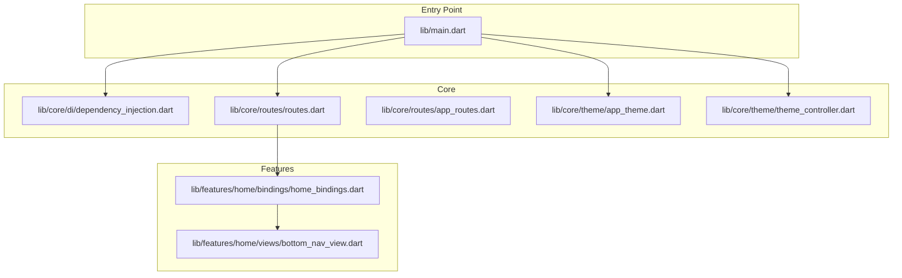
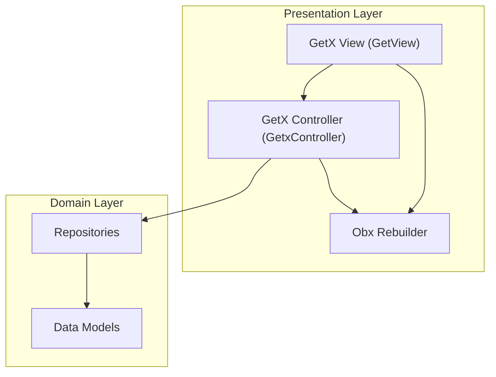
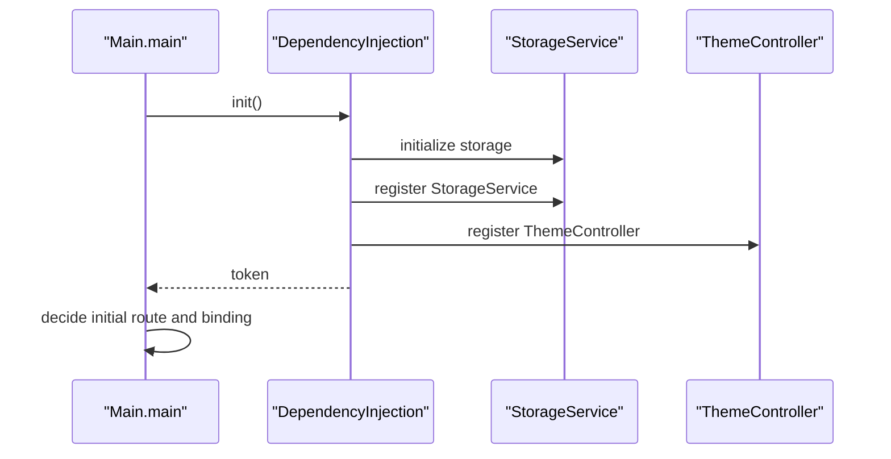
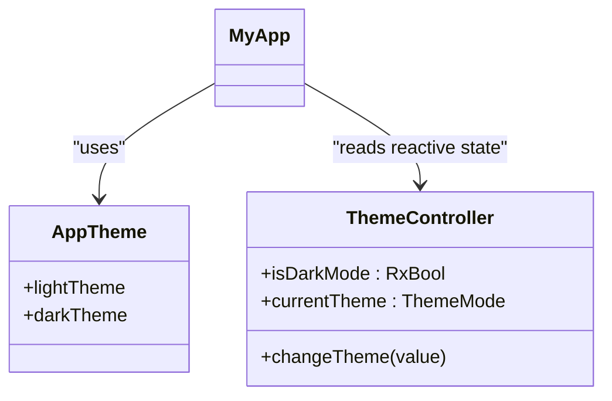
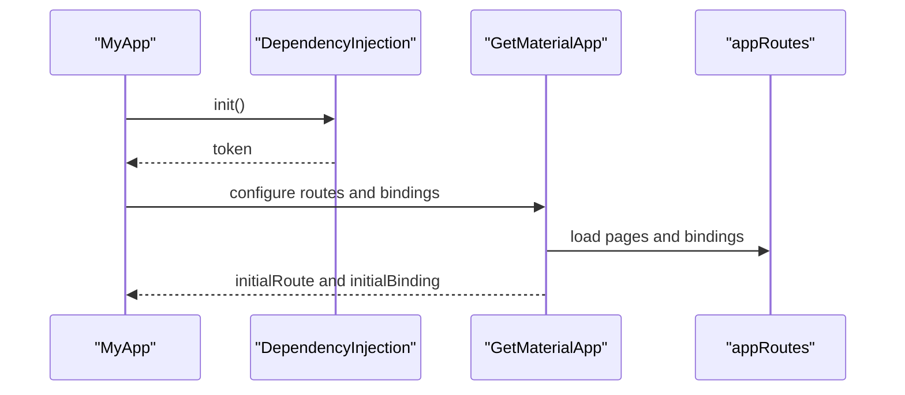
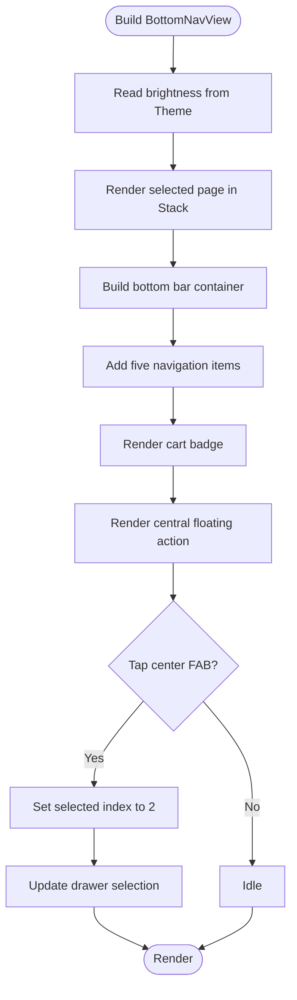
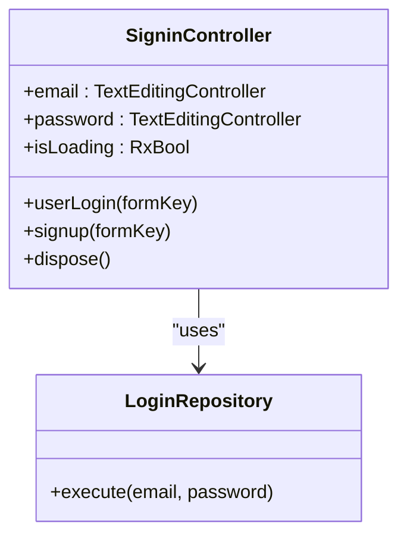
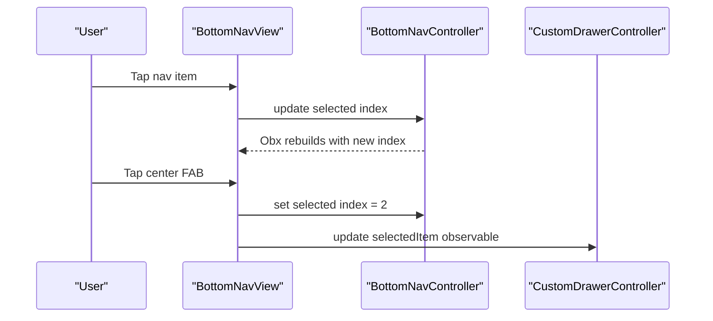
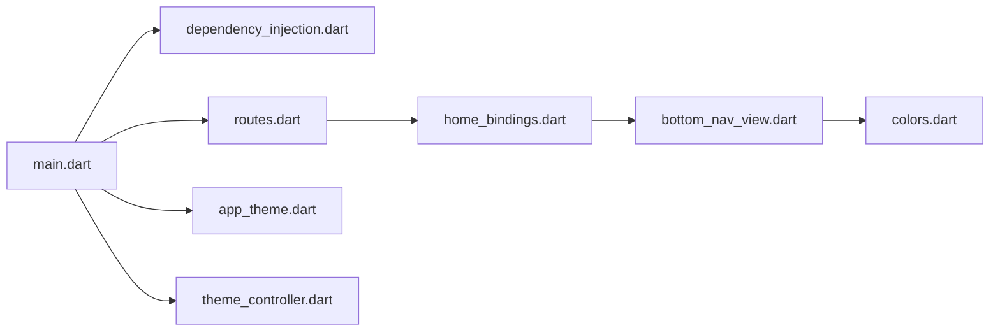

# UI Architecture and Design Patterns

<cite>
**Referenced Files in This Document**
- [main.dart](file://lib/main.dart)
- [dependency_injection.dart](file://lib/core/di/dependency_injection.dart)
- [app_routes.dart](file://lib/core/routes/app_routes.dart)
- [routes.dart](file://lib/core/routes/routes.dart)
- [app_theme.dart](file://lib/core/theme/app_theme.dart)
- [theme_controller.dart](file://lib/core/theme/theme_controller.dart)
- [home_bindings.dart](file://lib/features/home/bindings/home_bindings.dart)
- [bottom_nav_view.dart](file://lib/features/home/views/bottom_nav_view.dart)
- [signin_controller.dart](file://lib/features/auth/controller/signin_controller.dart)
- [pubspec.yaml](file://pubspec.yaml)
- [colors.dart](file://lib/core/constant/colors.dart)
- [custom_primary_button.dart](file://lib/shared/widgets/custom_button/custom_primary_button.dart)
- [custom_text_form_field.dart](file://lib/shared/widgets/custom_form_field/custom_text_form_field.dart)
- [custom_dropdown_menu.dart](file://lib/shared/widgets/custom_dropdown/custom_dropdown_menu.dart)
- [custom_drawer.dart](file://lib/shared/widgets/custom_drawer/custom_drawer.dart)
- [custom_pagination.dart](file://lib/shared/widgets/custom_pagination/custom_pagination.dart)
- [snackbar_error.dart](file://lib/shared/widgets/snackbars/error_snackbar.dart)
- [snackbar_success.dart](file://lib/shared/widgets/snackbars/success_snackbar.dart)
</cite>

## Table of Contents
1. [Introduction](#introduction)
2. [Project Structure](#project-structure)
3. [Core Components](#core-components)
4. [Architecture Overview](#architecture-overview)
5. [Detailed Component Analysis](#detailed-component-analysis)
6. [Dependency Analysis](#dependency-analysis)
7. [Performance Considerations](#performance-considerations)
8. [Troubleshooting Guide](#troubleshooting-guide)
9. [Conclusion](#conclusion)
10. [Appendices](#appendices)

## Introduction
This document explains the UI architecture and design patterns of ZB-DEZINE with a focus on the MVVM pattern implemented via GetX controllers, reactive state management, and modular screen organization. It documents widget composition patterns, reusable component architecture, bottom navigation, transitions, responsive design, theme integration, and Material Design 3 usage. It also covers controller-view binding, state synchronization, performance optimization, memory management, and UI testing strategies.

## Project Structure
The project follows a layered, feature-centric structure:
- Entry point initializes dependency injection, theme, routing, and screen sizing.
- Core module provides constants, DI, routes, theme, and utilities.
- Features module organizes screens and controllers per functional domain (e.g., auth, home, dashboard).
- Shared module provides reusable UI components and helpers.

**Diagram sources**
- [main.dart:12-46](file://lib/main.dart#L12-L46)
- [dependency_injection.dart:11-26](file://lib/core/di/dependency_injection.dart#L11-L26)
- [routes.dart:55-211](file://lib/core/routes/routes.dart#L55-L211)
- [app_routes.dart:1-34](file://lib/core/routes/app_routes.dart#L1-L34)
- [app_theme.dart:4-22](file://lib/core/theme/app_theme.dart#L4-L22)
- [theme_controller.dart:5-22](file://lib/core/theme/theme_controller.dart#L5-L22)
- [home_bindings.dart:13-34](file://lib/features/home/bindings/home_bindings.dart#L13-L34)
- [bottom_nav_view.dart:11-131](file://lib/features/home/views/bottom_nav_view.dart#L11-L131)

**Section sources**
- [main.dart:12-46](file://lib/main.dart#L12-L46)
- [pubspec.yaml:30-60](file://pubspec.yaml#L30-L60)

## Core Components
- Dependency Injection: Centralized service registration and lifecycle management for storage, theme, network clients, and controllers.
- Routing: Named routes and page bindings define navigation and initial route selection.
- Theme: Material Design 3 themes with light/dark modes controlled by a reactive controller.
- Controllers: GetX controllers manage UI state, user interactions, and navigation actions.
- Views: GetView widgets bind to controllers and render reactive UI using Obx.

Key implementation references:
- Dependency injection initialization and registrations.
- Reactive theme mode selection and theme persistence.
- Route definitions and initial route selection based on token presence.
- Bottom navigation view rendering pages and handling selection.

**Section sources**
- [dependency_injection.dart:11-26](file://lib/core/di/dependency_injection.dart#L11-L26)
- [theme_controller.dart:5-22](file://lib/core/theme/theme_controller.dart#L5-L22)
- [app_theme.dart:4-22](file://lib/core/theme/app_theme.dart#L4-L22)
- [routes.dart:55-211](file://lib/core/routes/routes.dart#L55-L211)
- [app_routes.dart:1-34](file://lib/core/routes/app_routes.dart#L1-L34)
- [bottom_nav_view.dart:11-131](file://lib/features/home/views/bottom_nav_view.dart#L11-L131)

## Architecture Overview
The architecture implements MVVM with GetX:
- Model: Data models and repositories (not shown here) encapsulate business logic and data access.
- View: StatelessWidget widgets using GetView<T> bind to controllers and react to state changes via Obx.
- ViewModel: GetX controllers expose observable state (Rx*) and handle UI actions.

[No sources needed since this diagram shows conceptual workflow, not actual code structure]

## Detailed Component Analysis

### Dependency Injection and Initialization
- Initializes storage, registers services and controllers as singletons, and resolves initial token.
- Exposes a token to decide initial route and bindings.

**Diagram sources**
- [main.dart:12-19](file://lib/main.dart#L12-L19)
- [dependency_injection.dart:12-25](file://lib/core/di/dependency_injection.dart#L12-L25)

**Section sources**
- [main.dart:12-19](file://lib/main.dart#L12-L19)
- [dependency_injection.dart:11-26](file://lib/core/di/dependency_injection.dart#L11-L26)

### Theme and Material Design 3
- AppTheme defines light and dark themes with Material 3 enabled.
- ThemeController manages reactive theme mode and persists preference.
- MyApp reads current theme from ThemeController and applies it.

**Diagram sources**
- [app_theme.dart:4-22](file://lib/core/theme/app_theme.dart#L4-L22)
- [theme_controller.dart:5-22](file://lib/core/theme/theme_controller.dart#L5-L22)
- [main.dart:25-42](file://lib/main.dart#L25-L42)

**Section sources**
- [app_theme.dart:4-22](file://lib/core/theme/app_theme.dart#L4-L22)
- [theme_controller.dart:5-22](file://lib/core/theme/theme_controller.dart#L5-L22)
- [main.dart:25-42](file://lib/main.dart#L25-L42)

### Routing and Navigation
- Routes are defined centrally with named constants and page builders.
- Initial route depends on token presence; bindings are attached to pages.
- Bottom navigation aggregates multiple bindings for tabbed screens.

**Diagram sources**
- [main.dart:25-42](file://lib/main.dart#L25-L42)
- [routes.dart:55-211](file://lib/core/routes/routes.dart#L55-L211)
- [app_routes.dart:1-34](file://lib/core/routes/app_routes.dart#L1-L34)

**Section sources**
- [routes.dart:55-211](file://lib/core/routes/routes.dart#L55-L211)
- [app_routes.dart:1-34](file://lib/core/routes/app_routes.dart#L1-L34)
- [main.dart:25-42](file://lib/main.dart#L25-L42)

### Bottom Navigation System
- BottomNavView renders a custom bottom bar with five segments: Home, Category, Cart with badge, and Profile.
- Uses a selected index observable to switch between stacked pages.
- Handles central floating action tap to navigate to a specific segment.

**Diagram sources**
- [bottom_nav_view.dart:17-131](file://lib/features/home/views/bottom_nav_view.dart#L17-L131)

**Section sources**
- [bottom_nav_view.dart:11-256](file://lib/features/home/views/bottom_nav_view.dart#L11-L256)

### MVVM Pattern with GetX Controllers
- Example: SigninController encapsulates form state, loading state, and navigation after successful login.
- Uses repository abstraction and handles success/error via fold semantics.
- Disposes of text editing controllers in dispose.

**Diagram sources**
- [signin_controller.dart:9-52](file://lib/features/auth/controller/signin_controller.dart#L9-L52)

**Section sources**
- [signin_controller.dart:9-52](file://lib/features/auth/controller/signin_controller.dart#L9-L52)

### Controller-View Binding and State Synchronization
- BottomNavView extends GetView<BottomNavController>, enabling direct access to controller state and methods.
- Uses Obx to rebuild only when reactive state changes (e.g., selected index).
- State synchronization occurs via controller observables and direct method calls.

**Diagram sources**
- [bottom_nav_view.dart:17-131](file://lib/features/home/views/bottom_nav_view.dart#L17-L131)

**Section sources**
- [bottom_nav_view.dart:11-131](file://lib/features/home/views/bottom_nav_view.dart#L11-L131)

### Reusable Component Architecture
Reusable components live under shared/widgets and follow consistent patterns:
- Buttons: Primary, secondary, radio, switch variants.
- Form fields: Text, date, phone, and other specialized fields.
- Dropdowns: Menu and item variants.
- Dialogs: Payment, rating, rejection dialogs.
- Pagination: Dots, numbers, buttons.
- Tables, timelines, snackbars, containers, and app bars.

These components promote consistency and reduce duplication across features.

**Section sources**
- [custom_primary_button.dart](file://lib/shared/widgets/custom_button/custom_primary_button.dart)
- [custom_text_form_field.dart](file://lib/shared/widgets/custom_form_field/custom_text_form_field.dart)
- [custom_dropdown_menu.dart](file://lib/shared/widgets/custom_dropdown/custom_dropdown_menu.dart)
- [custom_drawer.dart](file://lib/shared/widgets/custom_drawer/custom_drawer.dart)
- [custom_pagination.dart](file://lib/shared/widgets/custom_pagination/custom_pagination.dart)
- [snackbar_error.dart](file://lib/shared/widgets/snackbars/error_snackbar.dart)
- [snackbar_success.dart](file://lib/shared/widgets/snackbars/success_snackbar.dart)

### Screen Organization and Feature Modules
- Each feature module contains:
  - Bindings: Dependency registration for controllers and repositories.
  - Controller: UI state and actions.
  - Views: Screens implementing GetView<T>.
  - Widgets: Feature-specific UI components.
- Centralized routes and bindings enable modular navigation and lifecycle management.

**Section sources**
- [home_bindings.dart:13-34](file://lib/features/home/bindings/home_bindings.dart#L13-L34)

### Responsive Design Considerations
- ScreenUtilInit configures design size for responsive scaling.
- Uses ScreenUtil helpers (e.g., r, w, h, sp) for sizes and spacing.
- Adaptive layouts leverage MediaQuery and flexible widgets.

**Section sources**
- [main.dart:26-28](file://lib/main.dart#L26-L28)
- [pubspec.yaml:38](file://pubspec.yaml#L38)

### Material Design 3 Implementation
- AppTheme enables Material 3 with light/dark themes.
- Uses Material 3 color schemes and modern components.
- Integrates with GetMaterialApp for theme propagation.

**Section sources**
- [app_theme.dart:7, 15](file://lib/core/theme/app_theme.dart#L7,L15)
- [main.dart:33-35](file://lib/main.dart#L33-L35)

## Dependency Analysis
The system exhibits low coupling and high cohesion:
- Entry point depends on DI, routes, theme, and bindings.
- Controllers depend on repositories and services via Get.
- Views depend on controllers via GetView and Obx.
- Shared widgets are decoupled and reusable.

**Diagram sources**
- [main.dart:12-46](file://lib/main.dart#L12-L46)
- [dependency_injection.dart:11-26](file://lib/core/di/dependency_injection.dart#L11-L26)
- [routes.dart:55-211](file://lib/core/routes/routes.dart#L55-L211)
- [app_theme.dart:4-22](file://lib/core/theme/app_theme.dart#L4-L22)
- [theme_controller.dart:5-22](file://lib/core/theme/theme_controller.dart#L5-L22)
- [home_bindings.dart:13-34](file://lib/features/home/bindings/home_bindings.dart#L13-L34)
- [bottom_nav_view.dart:11-131](file://lib/features/home/views/bottom_nav_view.dart#L11-L131)
- [colors.dart](file://lib/core/constant/colors.dart)

**Section sources**
- [main.dart:12-46](file://lib/main.dart#L12-L46)
- [routes.dart:55-211](file://lib/core/routes/routes.dart#L55-L211)
- [home_bindings.dart:13-34](file://lib/features/home/bindings/home_bindings.dart#L13-L34)

## Performance Considerations
- Use lazy loading for heavy controllers and repositories via Get.lazyPut.
- Minimize rebuild scope by isolating state inside controllers and using targeted Obx wrappers.
- Dispose of controllers and text editing controllers to prevent leaks.
- Prefer lightweight widgets and avoid unnecessary layout passes.
- Cache frequently accessed data and debounce user input where appropriate.

[No sources needed since this section provides general guidance]

## Troubleshooting Guide
Common areas to inspect:
- Theme switching: Verify ThemeController observable and theme persistence.
- Navigation: Confirm route names and bindings; ensure initial route matches token state.
- State updates: Ensure controllers expose observables and views wrap reactive sections in Obx.
- Memory leaks: Check controller disposal and controller lifecycle hooks.

**Section sources**
- [theme_controller.dart:5-22](file://lib/core/theme/theme_controller.dart#L5-L22)
- [signin_controller.dart:45-50](file://lib/features/auth/controller/signin_controller.dart#L45-L50)

## Conclusion
ZB-DEZINE employs a clean MVVM architecture powered by GetX. The design emphasizes:
- Reactive state management with controllers and observables.
- Modular feature organization with bindings and centralized routing.
- Consistent UI through reusable components and Material Design 3 theming.
- Responsive layouts and efficient navigation with bottom tabs and named routes.

Adhering to these patterns ensures maintainability, scalability, and a robust user experience.

## Appendices
- Example references for reuse:
  - [SigninController:9-52](file://lib/features/auth/controller/signin_controller.dart#L9-L52)
  - [BottomNavView:11-256](file://lib/features/home/views/bottom_nav_view.dart#L11-L256)
  - [HomeBindings:13-34](file://lib/features/home/bindings/home_bindings.dart#L13-L34)
  - [AppTheme:4-22](file://lib/core/theme/app_theme.dart#L4-L22)
  - [ThemeController:5-22](file://lib/core/theme/theme_controller.dart#L5-L22)
  - [AppRoutes:1-34](file://lib/core/routes/app_routes.dart#L1-L34)
  - [Routes:55-211](file://lib/core/routes/routes.dart#L55-L211)
  - [DependencyInjection:11-26](file://lib/core/di/dependency_injection.dart#L11-L26)
  - [Colors](file://lib/core/constant/colors.dart)