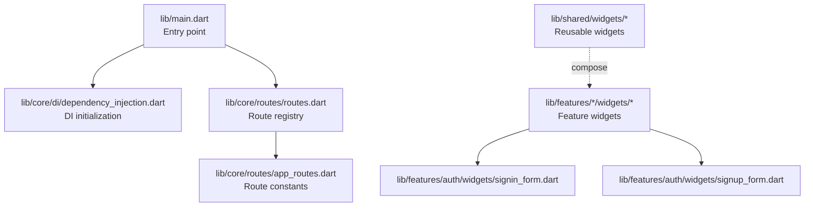
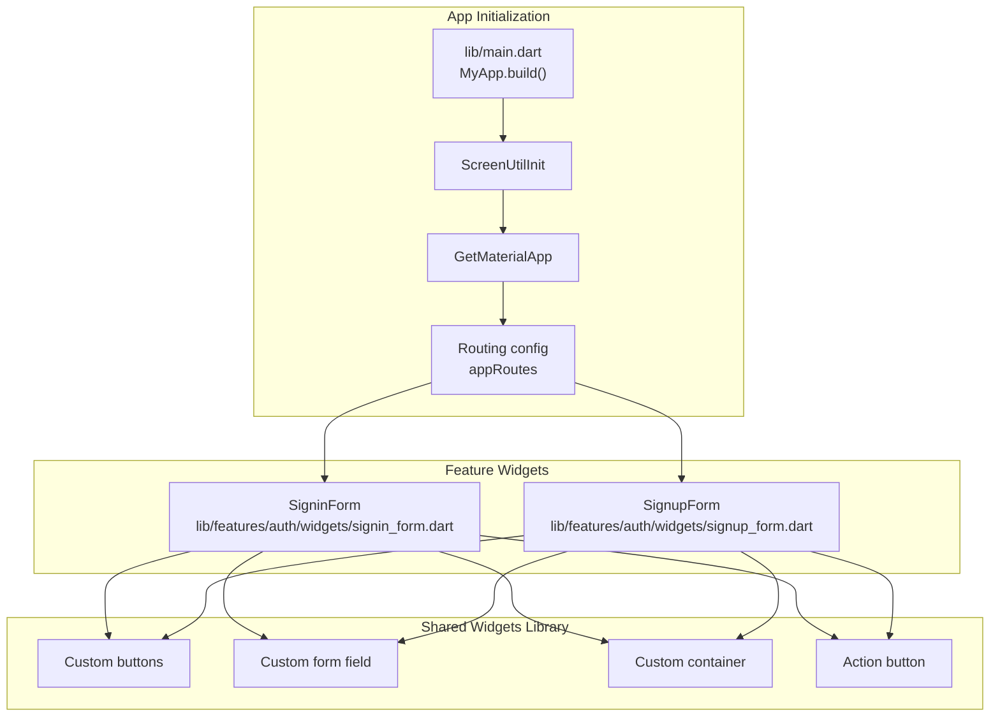
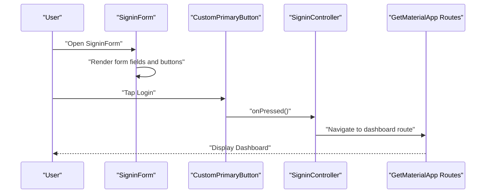
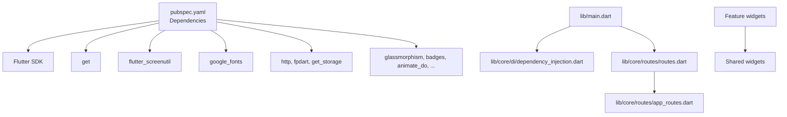

# Widget Composition and Reusability

<cite>
**Referenced Files in This Document**
- [lib/main.dart](file://lib/main.dart)
- [pubspec.yaml](file://pubspec.yaml)
- [lib/core/di/dependency_injection.dart](file://lib/core/di/dependency_injection.dart)
- [lib/core/routes/app_routes.dart](file://lib/core/routes/app_routes.dart)
- [lib/core/routes/routes.dart](file://lib/core/routes/routes.dart)
- [lib/shared/widgets/custom_button/custom_primary_button.dart](file://lib/shared/widgets/custom_button/custom_primary_button.dart)
- [lib/shared/widgets/custom_button/custom_secondary_button.dart](file://lib/shared/widgets/custom_button/custom_secondary_button.dart)
- [lib/shared/widgets/custom_form_field/custom_text_form_field.dart](file://lib/shared/widgets/custom_form_field/custom_text_form_field.dart)
- [lib/shared/widgets/custom_container.dart](file://lib/shared/widgets/custom_container.dart)
- [lib/shared/widgets/action_button.dart](file://lib/shared/widgets/action_button.dart)
- [lib/features/auth/widgets/signin_form.dart](file://lib/features/auth/widgets/signin_form.dart)
- [lib/features/auth/widgets/signup_form.dart](file://lib/features/auth/widgets/signup_form.dart)
</cite>

## Table of Contents
1. [Introduction](#introduction)
2. [Project Structure](#project-structure)
3. [Core Components](#core-components)
4. [Architecture Overview](#architecture-overview)
5. [Detailed Component Analysis](#detailed-component-analysis)
6. [Dependency Analysis](#dependency-analysis)
7. [Performance Considerations](#performance-considerations)
8. [Troubleshooting Guide](#troubleshooting-guide)
9. [Conclusion](#conclusion)

## Introduction
This document explains ZB-DEZINE’s widget composition patterns and reusable component architecture. It focuses on the shared widgets library, composition strategies, parameter passing, event handling, stateful and stateless composition, conditional rendering, dynamic widget building, performance optimization, memory management, and testing strategies for reusable components. The project uses a layered structure with a shared widgets library and feature-specific widgets that compose with shared components.

## Project Structure
The project follows a modular structure:
- Entry point initializes dependency injection and routing, then runs the app.
- Shared widgets provide reusable UI primitives.
- Feature-specific widgets compose shared widgets and controllers/bindings.
- Routing is centralized via named routes and bindings.

**Diagram sources**
- [lib/main.dart:12-47](file://lib/main.dart#L12-L47)
- [lib/core/di/dependency_injection.dart:11-27](file://lib/core/di/dependency_injection.dart#L11-L27)
- [lib/core/routes/routes.dart:55-212](file://lib/core/routes/routes.dart#L55-L212)
- [lib/core/routes/app_routes.dart:1-34](file://lib/core/routes/app_routes.dart#L1-L34)
- [lib/features/auth/widgets/signin_form.dart:12-60](file://lib/features/auth/widgets/signin_form.dart#L12-L60)
- [lib/features/auth/widgets/signup_form.dart:15-104](file://lib/features/auth/widgets/signup_form.dart#L15-L104)

**Section sources**
- [lib/main.dart:12-47](file://lib/main.dart#L12-L47)
- [lib/core/di/dependency_injection.dart:11-27](file://lib/core/di/dependency_injection.dart#L11-L27)
- [lib/core/routes/app_routes.dart:1-34](file://lib/core/routes/app_routes.dart#L1-L34)
- [lib/core/routes/routes.dart:55-212](file://lib/core/routes/routes.dart#L55-L212)

## Core Components
This section documents the shared widgets library and how feature widgets compose them.

- Custom primary button
  - Stateless button with flexible sizing, colors, typography, borders, shadows, and optional child content.
  - Accepts callbacks for press events and integrates with theme brightness.
  - Snippet path: [lib/shared/widgets/custom_button/custom_primary_button.dart:6-74](file://lib/shared/widgets/custom_button/custom_primary_button.dart#L6-L74)

- Custom secondary button
  - Stateless button variant with icon, text, and layout configuration.
  - Supports icon sizing, colors, and row-based layout with spacing.
  - Snippet path: [lib/shared/widgets/custom_button/custom_secondary_button.dart:6-88](file://lib/shared/widgets/custom_button/custom_secondary_button.dart#L6-L88)

- Custom text form field
  - Comprehensive text input widget with extensive customization for labels, hints, icons, validation, keyboard type, and styling.
  - Integrates with theme brightness and typography.
  - Snippet path: [lib/shared/widgets/custom_form_field/custom_text_form_field.dart:7-191](file://lib/shared/widgets/custom_form_field/custom_text_form_field.dart#L7-L191)

- Custom container
  - A container wrapper that optionally renders a scaffold with appbar, drawer, and bottom navigation.
  - Applies gradient backgrounds based on theme brightness and supports transparent scaffolds.
  - Snippet path: [lib/shared/widgets/custom_container.dart:5-58](file://lib/shared/widgets/custom_container.dart#L5-L58)

- Action button
  - Minimal action button with gesture handling and theme-aware styling.
  - Snippet path: [lib/shared/widgets/action_button.dart:5-43](file://lib/shared/widgets/action_button.dart#L5-L43)

**Section sources**
- [lib/shared/widgets/custom_button/custom_primary_button.dart:6-74](file://lib/shared/widgets/custom_button/custom_primary_button.dart#L6-L74)
- [lib/shared/widgets/custom_button/custom_secondary_button.dart:6-88](file://lib/shared/widgets/custom_button/custom_secondary_button.dart#L6-L88)
- [lib/shared/widgets/custom_form_field/custom_text_form_field.dart:7-191](file://lib/shared/widgets/custom_form_field/custom_text_form_field.dart#L7-L191)
- [lib/shared/widgets/custom_container.dart:5-58](file://lib/shared/widgets/custom_container.dart#L5-L58)
- [lib/shared/widgets/action_button.dart:5-43](file://lib/shared/widgets/action_button.dart#L5-L43)

## Architecture Overview
The app initializes dependencies, sets up theme and routing, and composes feature screens from shared widgets. Feature widgets use controllers/bindings via GetX and compose shared widgets for consistent UI and UX.

**Diagram sources**
- [lib/main.dart:21-47](file://lib/main.dart#L21-L47)
- [lib/core/routes/routes.dart:55-212](file://lib/core/routes/routes.dart#L55-L212)
- [lib/shared/widgets/custom_button/custom_primary_button.dart:6-74](file://lib/shared/widgets/custom_button/custom_primary_button.dart#L6-L74)
- [lib/shared/widgets/custom_button/custom_secondary_button.dart:6-88](file://lib/shared/widgets/custom_button/custom_secondary_button.dart#L6-L88)
- [lib/shared/widgets/custom_form_field/custom_text_form_field.dart:7-191](file://lib/shared/widgets/custom_form_field/custom_text_form_field.dart#L7-L191)
- [lib/shared/widgets/custom_container.dart:5-58](file://lib/shared/widgets/custom_container.dart#L5-L58)
- [lib/shared/widgets/action_button.dart:5-43](file://lib/shared/widgets/action_button.dart#L5-L43)
- [lib/features/auth/widgets/signin_form.dart:12-60](file://lib/features/auth/widgets/signin_form.dart#L12-L60)
- [lib/features/auth/widgets/signup_form.dart:15-104](file://lib/features/auth/widgets/signup_form.dart#L15-L104)

## Detailed Component Analysis

### Stateless Widget Composition Patterns
- Parameter passing
  - Buttons accept explicit parameters for sizing, colors, typography, borders, shadows, and optional child widgets.
  - Form fields accept a wide range of parameters for styling, validation, keyboard type, and content padding/margin.
  - Container accepts child, gradient, appbar, drawer, bottom navigation, and transparency flags.
  - Action button accepts icon asset path and callback.

- Event handling
  - Buttons expose a callback for tap events.
  - Form fields expose controller, validator, onChanged, and focusNode for interaction.
  - Action button exposes a callback for gesture handling.

- Conditional rendering and dynamic building
  - Feature forms conditionally render additional fields based on controller state (e.g., business mode requiring extra inputs).
  - Buttons adapt visuals based on theme brightness and optional child content.

- Examples
  - Button composition: [lib/shared/widgets/custom_button/custom_primary_button.dart:6-74](file://lib/shared/widgets/custom_button/custom_primary_button.dart#L6-L74)
  - Form field composition: [lib/shared/widgets/custom_form_field/custom_text_form_field.dart:7-191](file://lib/shared/widgets/custom_form_field/custom_text_form_field.dart#L7-L191)
  - Container composition: [lib/shared/widgets/custom_container.dart:5-58](file://lib/shared/widgets/custom_container.dart#L5-L58)
  - Action button composition: [lib/shared/widgets/action_button.dart:5-43](file://lib/shared/widgets/action_button.dart#L5-L43)
  - Conditional rendering in forms: [lib/features/auth/widgets/signin_form.dart:12-60](file://lib/features/auth/widgets/signin_form.dart#L12-L60), [lib/features/auth/widgets/signup_form.dart:15-104](file://lib/features/auth/widgets/signup_form.dart#L15-L104)

**Section sources**
- [lib/shared/widgets/custom_button/custom_primary_button.dart:6-74](file://lib/shared/widgets/custom_button/custom_primary_button.dart#L6-L74)
- [lib/shared/widgets/custom_button/custom_secondary_button.dart:6-88](file://lib/shared/widgets/custom_button/custom_secondary_button.dart#L6-L88)
- [lib/shared/widgets/custom_form_field/custom_text_form_field.dart:7-191](file://lib/shared/widgets/custom_form_field/custom_text_form_field.dart#L7-L191)
- [lib/shared/widgets/custom_container.dart:5-58](file://lib/shared/widgets/custom_container.dart#L5-L58)
- [lib/shared/widgets/action_button.dart:5-43](file://lib/shared/widgets/action_button.dart#L5-L43)
- [lib/features/auth/widgets/signin_form.dart:12-60](file://lib/features/auth/widgets/signin_form.dart#L12-L60)
- [lib/features/auth/widgets/signup_form.dart:15-104](file://lib/features/auth/widgets/signup_form.dart#L15-L104)

### Stateful vs Stateless Composition
- Stateless composition
  - Buttons and form fields are stateless and receive all configuration via constructor parameters.
  - They rely on external state (e.g., controllers, theme) and callbacks for interactions.

- Stateful composition
  - Feature widgets integrate controllers/bindings via GetX and manage local state (e.g., form keys, visibility toggles).
  - Example: [lib/features/auth/widgets/signin_form.dart:12-60](file://lib/features/auth/widgets/signin_form.dart#L12-L60), [lib/features/auth/widgets/signup_form.dart:15-104](file://lib/features/auth/widgets/signup_form.dart#L15-L104)

- Composition strategy
  - Feature widgets own state and orchestrate interactions; shared widgets remain pure and reusable.

**Section sources**
- [lib/features/auth/widgets/signin_form.dart:12-60](file://lib/features/auth/widgets/signin_form.dart#L12-L60)
- [lib/features/auth/widgets/signup_form.dart:15-104](file://lib/features/auth/widgets/signup_form.dart#L15-L104)

### Parameter Passing Mechanisms
- Explicit parameters
  - All shared widgets accept parameters for appearance, behavior, and content.
- Callbacks
  - Tap handlers and form callbacks enable decoupled event handling.
- Controllers and bindings
  - Feature widgets use GetX controllers and bindings to manage state and pass data to shared widgets.

**Section sources**
- [lib/shared/widgets/custom_button/custom_primary_button.dart:6-74](file://lib/shared/widgets/custom_button/custom_primary_button.dart#L6-L74)
- [lib/shared/widgets/custom_form_field/custom_text_form_field.dart:7-191](file://lib/shared/widgets/custom_form_field/custom_text_form_field.dart#L7-L191)
- [lib/features/auth/widgets/signin_form.dart:12-60](file://lib/features/auth/widgets/signin_form.dart#L12-L60)
- [lib/features/auth/widgets/signup_form.dart:15-104](file://lib/features/auth/widgets/signup_form.dart#L15-L104)

### Event Handling Patterns
- Gesture handling
  - Buttons wrap content in gesture detectors and forward taps to provided callbacks.
- Form interactions
  - Form fields expose onChanged, validator, and focusNode for robust input handling.
- Navigation
  - Feature widgets trigger navigation via named routes.

**Section sources**
- [lib/shared/widgets/custom_button/custom_primary_button.dart:40-42](file://lib/shared/widgets/custom_button/custom_primary_button.dart#L40-L42)
- [lib/shared/widgets/custom_button/custom_secondary_button.dart:49-51](file://lib/shared/widgets/custom_button/custom_secondary_button.dart#L49-L51)
- [lib/shared/widgets/custom_form_field/custom_text_form_field.dart:103-104](file://lib/shared/widgets/custom_form_field/custom_text_form_field.dart#L103-L104)
- [lib/features/auth/widgets/signin_form.dart:46-48](file://lib/features/auth/widgets/signin_form.dart#L46-L48)

### Conditional Rendering and Dynamic Building
- Conditional fields
  - Business mode triggers additional inputs in sign-up form.
- Dynamic labels and icons
  - Labels and icons change based on selected index in user mode controller.
- Dynamic layouts
  - Buttons and containers adapt to theme brightness and optional child content.

**Section sources**
- [lib/features/auth/widgets/signup_form.dart:27-98](file://lib/features/auth/widgets/signup_form.dart#L27-L98)
- [lib/shared/widgets/custom_button/custom_primary_button.dart:38-72](file://lib/shared/widgets/custom_button/custom_primary_button.dart#L38-L72)
- [lib/shared/widgets/custom_container.dart:27-56](file://lib/shared/widgets/custom_container.dart#L27-L56)

### Sequence of a Typical Widget Interaction

**Diagram sources**
- [lib/features/auth/widgets/signin_form.dart:12-60](file://lib/features/auth/widgets/signin_form.dart#L12-L60)
- [lib/shared/widgets/custom_button/custom_primary_button.dart:6-74](file://lib/shared/widgets/custom_button/custom_primary_button.dart#L6-L74)
- [lib/core/routes/routes.dart:117-125](file://lib/core/routes/routes.dart#L117-L125)

## Dependency Analysis
- External dependencies
  - UI toolkit and utilities: Flutter SDK, get, flutter_screenutil, google_fonts, badges, animate_do, etc.
  - Network and storage: http, fpdart, get_storage.
  - UI components: glassmorphism, flutter_spinkit, flutter_typeahead, convex_bottom_bar, flutter_rating_bar, timeline_tile, dotted_line, table_calendar, fl_chart, image_picker, cached_network_image, carousel_slider.

- Internal dependencies
  - Entry point depends on DI, routes, theme, and bindings.
  - Feature widgets depend on shared widgets and controllers.
  - Shared widgets depend on core constants and theme-aware utilities.

**Diagram sources**
- [pubspec.yaml:30-60](file://pubspec.yaml#L30-L60)
- [lib/main.dart:12-19](file://lib/main.dart#L12-L19)
- [lib/core/di/dependency_injection.dart:11-27](file://lib/core/di/dependency_injection.dart#L11-L27)
- [lib/core/routes/routes.dart:55-212](file://lib/core/routes/routes.dart#L55-L212)
- [lib/core/routes/app_routes.dart:1-34](file://lib/core/routes/app_routes.dart#L1-L34)

**Section sources**
- [pubspec.yaml:30-60](file://pubspec.yaml#L30-L60)
- [lib/main.dart:12-19](file://lib/main.dart#L12-L19)
- [lib/core/di/dependency_injection.dart:11-27](file://lib/core/di/dependency_injection.dart#L11-L27)
- [lib/core/routes/routes.dart:55-212](file://lib/core/routes/routes.dart#L55-L212)
- [lib/core/routes/app_routes.dart:1-34](file://lib/core/routes/app_routes.dart#L1-L34)

## Performance Considerations
- Prefer stateless widgets for reusable components to minimize rebuild scope and improve composition flexibility.
- Use explicit parameters and callbacks to avoid unnecessary coupling to global state.
- Leverage theme-aware properties to reduce branching logic inside widgets.
- Keep shared widgets lightweight; defer heavy logic to controllers/bindings.
- Use memoization and stable keys for lists and grids in feature widgets.
- Avoid deep rebuild chains by isolating stateful regions and using scoped updates.

## Troubleshooting Guide
- Widget not responding to taps
  - Verify gesture detector wrapping and callback wiring.
  - Check button callback invocation and event propagation.
  - Reference: [lib/shared/widgets/custom_button/custom_primary_button.dart:40-42](file://lib/shared/widgets/custom_button/custom_primary_button.dart#L40-L42), [lib/shared/widgets/custom_button/custom_secondary_button.dart:49-51](file://lib/shared/widgets/custom_button/custom_secondary_button.dart#L49-L51)

- Form validation not triggering
  - Confirm validator function and autovalidate mode are set.
  - Ensure controller is passed correctly to the form field.
  - Reference: [lib/shared/widgets/custom_form_field/custom_text_form_field.dart:103-104](file://lib/shared/widgets/custom_form_field/custom_text_form_field.dart#L103-L104)

- Navigation not working
  - Confirm route name exists and binding is registered.
  - Verify initial route selection logic based on token.
  - References: [lib/core/routes/app_routes.dart:1-34](file://lib/core/routes/app_routes.dart#L1-L34), [lib/core/routes/routes.dart:55-212](file://lib/core/routes/routes.dart#L55-212), [lib/main.dart:36-40](file://lib/main.dart#L36-L40)

- Theme inconsistencies
  - Ensure theme brightness is considered and fallback colors are applied.
  - Reference: [lib/shared/widgets/custom_button/custom_primary_button.dart:38-72](file://lib/shared/widgets/custom_button/custom_primary_button.dart#L38-L72), [lib/shared/widgets/custom_container.dart:27-56](file://lib/shared/widgets/custom_container.dart#L27-L56)

**Section sources**
- [lib/shared/widgets/custom_button/custom_primary_button.dart:40-42](file://lib/shared/widgets/custom_button/custom_primary_button.dart#L40-L42)
- [lib/shared/widgets/custom_button/custom_secondary_button.dart:49-51](file://lib/shared/widgets/custom_button/custom_secondary_button.dart#L49-L51)
- [lib/shared/widgets/custom_form_field/custom_text_form_field.dart:103-104](file://lib/shared/widgets/custom_form_field/custom_text_form_field.dart#L103-L104)
- [lib/core/routes/app_routes.dart:1-34](file://lib/core/routes/app_routes.dart#L1-L34)
- [lib/core/routes/routes.dart:55-212](file://lib/core/routes/routes.dart#L55-L212)
- [lib/main.dart:36-40](file://lib/main.dart#L36-L40)
- [lib/shared/widgets/custom_button/custom_primary_button.dart:38-72](file://lib/shared/widgets/custom_button/custom_primary_button.dart#L38-L72)
- [lib/shared/widgets/custom_container.dart:27-56](file://lib/shared/widgets/custom_container.dart#L27-L56)

## Conclusion
ZB-DEZINE’s architecture emphasizes reusable, stateless shared widgets composed by feature widgets that manage state and orchestrate navigation. The design leverages explicit parameters, callbacks, and theme-aware rendering to ensure consistency and maintainability. By following the composition patterns and guidelines outlined here, teams can build scalable, testable, and performant UI components across the application.