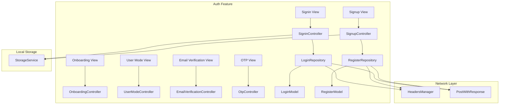
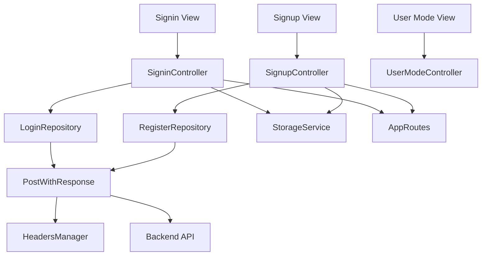
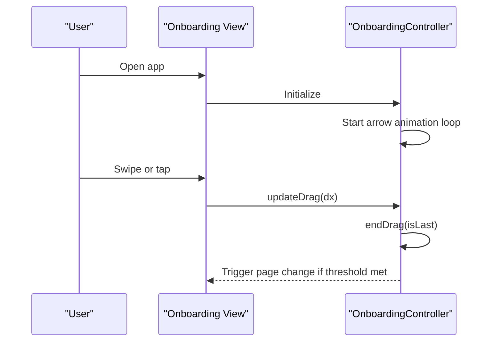
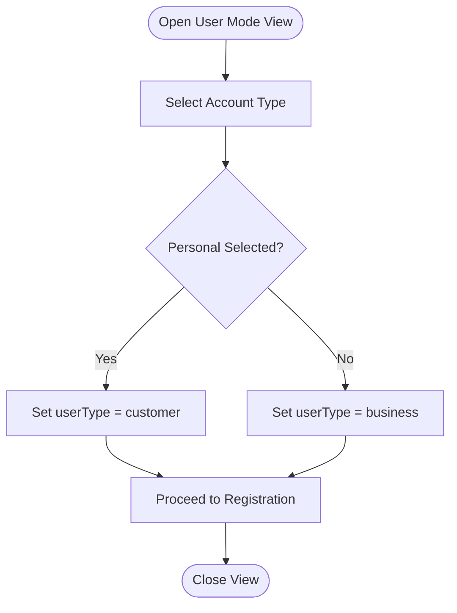
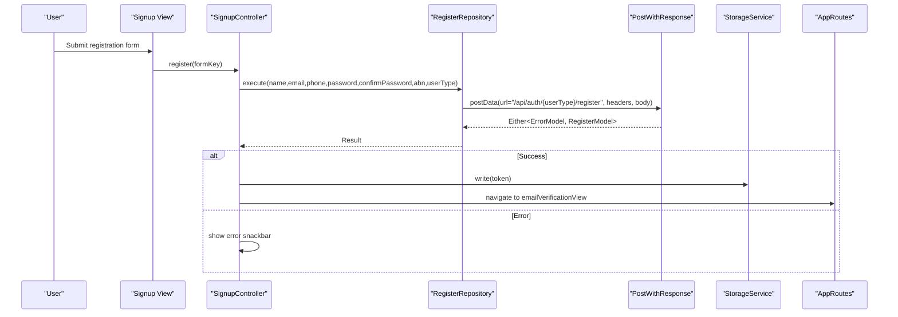
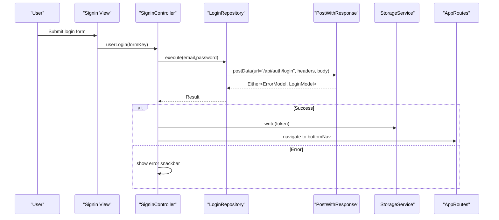
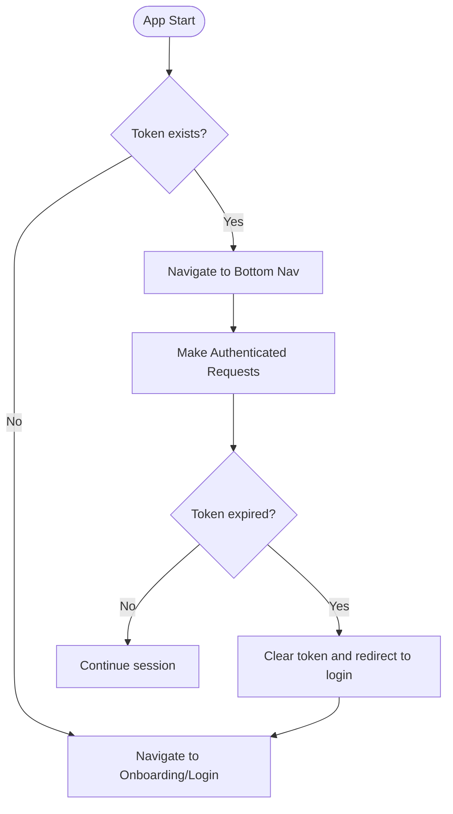
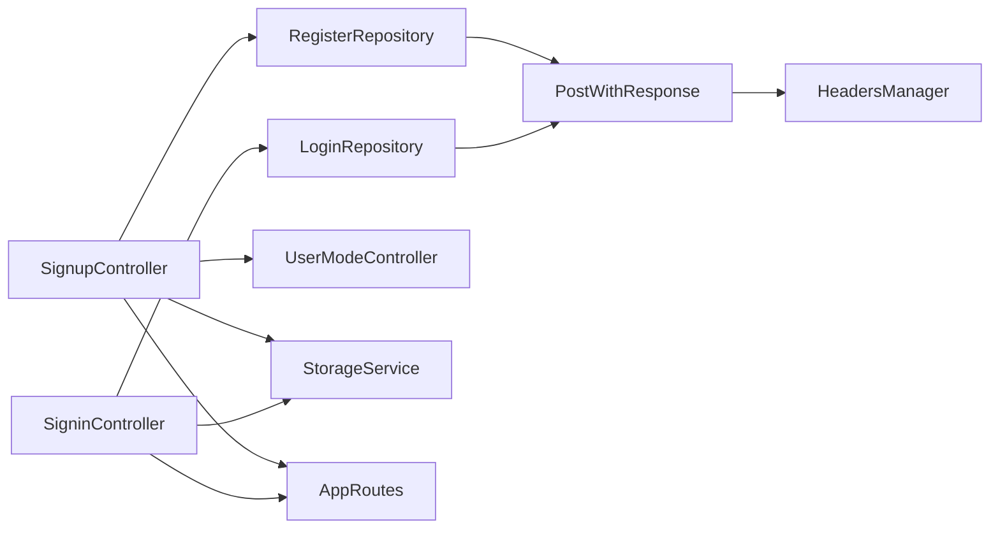

# Authentication System

<cite>
**Referenced Files in This Document**
- [main.dart](file://lib/main.dart)
- [app_routes.dart](file://lib/core/routes/app_routes.dart)
- [storage_service.dart](file://lib/core/data/local/storage_service.dart)
- [headers_manager.dart](file://lib/core/data/networks/headers_manager.dart)
- [post_with_response.dart](file://lib/core/data/networks/post_with_response.dart)
- [login_repo.dart](file://lib/features/auth/repositories/login_repo.dart)
- [register_repo.dart](file://lib/features/auth/repositories/register_repo.dart)
- [signin_controller.dart](file://lib/features/auth/controller/signin_controller.dart)
- [signup_controller.dart](file://lib/features/auth/controller/signup_controller.dart)
- [onboarding_controller.dart](file://lib/features/auth/controller/onboarding_controller.dart)
- [user_mode_controller.dart](file://lib/features/auth/controller/user_mode_controller.dart)
- [email_verification_controller.dart](file://lib/features/auth/controller/email_verification_controller.dart)
- [otp_controller.dart](file://lib/features/auth/controller/otp_controller.dart)
- [login_model.dart](file://lib/features/auth/models/login_model.dart)
- [register_model.dart](file://lib/features/auth/models/register_model.dart)
- [signin_view.dart](file://lib/features/auth/views/signin_view.dart)
- [signup_view.dart](file://lib/features/auth/views/signup_view.dart)
- [onboarding_view.dart](file://lib/features/auth/views/onboarding_view.dart)
- [user_mode_view.dart](file://lib/features/auth/views/user_mode_view.dart)
- [email_verification_view.dart](file://lib/features/auth/views/email_verification_view.dart)
- [otp_view.dart](file://lib/features/auth/views/otp_view.dart)
- [auth_bindings.dart](file://lib/features/auth/bindings/auth_bindings.dart)
- [onboard_bindings.dart](file://lib/features/auth/bindings/onboard_bindings.dart)
- [snackbar_error.dart](file://lib/shared/widgets/snackbars/error_snackbar.dart)
- [snackbar_success.dart](file://lib/shared/widgets/snackbars/success_snackbar.dart)
</cite>

## Table of Contents
1. [Introduction](#introduction)
2. [Project Structure](#project-structure)
3. [Core Components](#core-components)
4. [Architecture Overview](#architecture-overview)
5. [Detailed Component Analysis](#detailed-component-analysis)
6. [Dependency Analysis](#dependency-analysis)
7. [Performance Considerations](#performance-considerations)
8. [Troubleshooting Guide](#troubleshooting-guide)
9. [Conclusion](#conclusion)

## Introduction
This document describes the authentication system for ZB-DEZINE, covering the complete user journey from onboarding to login, registration, email verification, OTP validation, and user mode selection. It explains session management, token handling, security measures, and integration with backend APIs. It also documents controllers, repositories, models, and UI flows, along with error handling strategies, security best practices, and troubleshooting procedures.

## Project Structure
The authentication system is organized under the features/auth module with clear separation of concerns:
- Controllers manage UI state and orchestrate business logic
- Repositories encapsulate network calls and data transformations
- Models define API response structures
- Views implement UI screens
- Bindings integrate controllers with routing and DI
- Local storage persists tokens and preferences
- Network utilities handle headers and HTTP requests

**Diagram sources**
- [onboarding_controller.dart:1-124](file://lib/features/auth/controller/onboarding_controller.dart#L1-L124)
- [signin_controller.dart:1-52](file://lib/features/auth/controller/signin_controller.dart#L1-L52)
- [signup_controller.dart:1-67](file://lib/features/auth/controller/signup_controller.dart#L1-L67)
- [user_mode_controller.dart:1-19](file://lib/features/auth/controller/user_mode_controller.dart#L1-L19)
- [email_verification_controller.dart:1-3](file://lib/features/auth/controller/email_verification_controller.dart#L1-L3)
- [otp_controller.dart:1-3](file://lib/features/auth/controller/otp_controller.dart#L1-L3)
- [login_repo.dart:1-29](file://lib/features/auth/repositories/login_repo.dart#L1-L29)
- [register_repo.dart:1-39](file://lib/features/auth/repositories/register_repo.dart#L1-L39)
- [login_model.dart:1-74](file://lib/features/auth/models/login_model.dart#L1-L74)
- [register_model.dart:1-74](file://lib/features/auth/models/register_model.dart#L1-L74)
- [storage_service.dart](file://lib/core/data/local/storage_service.dart)
- [headers_manager.dart](file://lib/core/data/networks/headers_manager.dart)
- [post_with_response.dart](file://lib/core/data/networks/post_with_response.dart)

**Section sources**
- [onboarding_controller.dart:1-124](file://lib/features/auth/controller/onboarding_controller.dart#L1-L124)
- [signin_controller.dart:1-52](file://lib/features/auth/controller/signin_controller.dart#L1-L52)
- [signup_controller.dart:1-67](file://lib/features/auth/controller/signup_controller.dart#L1-L67)
- [user_mode_controller.dart:1-19](file://lib/features/auth/controller/user_mode_controller.dart#L1-L19)
- [email_verification_controller.dart:1-3](file://lib/features/auth/controller/email_verification_controller.dart#L1-L3)
- [otp_controller.dart:1-3](file://lib/features/auth/controller/otp_controller.dart#L1-L3)
- [login_repo.dart:1-29](file://lib/features/auth/repositories/login_repo.dart#L1-L29)
- [register_repo.dart:1-39](file://lib/features/auth/repositories/register_repo.dart#L1-L39)
- [login_model.dart:1-74](file://lib/features/auth/models/login_model.dart#L1-L74)
- [register_model.dart:1-74](file://lib/features/auth/models/register_model.dart#L1-L74)
- [storage_service.dart](file://lib/core/data/local/storage_service.dart)
- [headers_manager.dart](file://lib/core/data/networks/headers_manager.dart)
- [post_with_response.dart](file://lib/core/data/networks/post_with_response.dart)

## Core Components
- Controllers
  - OnboardingController: Manages onboarding slides, animations, and navigation cues
  - SigninController: Handles login form validation, repository call, token persistence, and navigation
  - SignupController: Handles registration form validation, user mode selection, repository call, token persistence, and navigation to email verification
  - UserModeController: Stores selected account type (personal/business) for registration
  - EmailVerificationController and OtpController: Placeholders for verification and OTP flows
- Repositories
  - LoginRepository: Encapsulates login API call with JSON body and response parsing
  - RegisterRepository: Encapsulates registration API call with dynamic user type endpoint and conditional ABN field
- Models
  - LoginModel and RegisterModel: Define token and user payload structures
- Local Storage
  - StorageService: Provides token persistence and retrieval for session management
- Network Utilities
  - HeadersManager: Supplies standardized headers for authenticated requests
  - PostWithResponse: Generic HTTP client wrapper for API calls

**Section sources**
- [onboarding_controller.dart:1-124](file://lib/features/auth/controller/onboarding_controller.dart#L1-L124)
- [signin_controller.dart:1-52](file://lib/features/auth/controller/signin_controller.dart#L1-L52)
- [signup_controller.dart:1-67](file://lib/features/auth/controller/signup_controller.dart#L1-L67)
- [user_mode_controller.dart:1-19](file://lib/features/auth/controller/user_mode_controller.dart#L1-L19)
- [email_verification_controller.dart:1-3](file://lib/features/auth/controller/email_verification_controller.dart#L1-L3)
- [otp_controller.dart:1-3](file://lib/features/auth/controller/otp_controller.dart#L1-L3)
- [login_repo.dart:1-29](file://lib/features/auth/repositories/login_repo.dart#L1-L29)
- [register_repo.dart:1-39](file://lib/features/auth/repositories/register_repo.dart#L1-L39)
- [login_model.dart:1-74](file://lib/features/auth/models/login_model.dart#L1-L74)
- [register_model.dart:1-74](file://lib/features/auth/models/register_model.dart#L1-L74)
- [storage_service.dart](file://lib/core/data/local/storage_service.dart)
- [headers_manager.dart](file://lib/core/data/networks/headers_manager.dart)
- [post_with_response.dart](file://lib/core/data/networks/post_with_response.dart)

## Architecture Overview
The authentication system follows a layered architecture:
- Presentation Layer: Views trigger controller actions
- Controller Layer: Orchestrates validation, repository calls, and navigation
- Repository Layer: Performs HTTP requests and parses responses
- Model Layer: Defines typed data structures
- Persistence Layer: Uses StorageService for tokens
- Network Layer: Uses HeadersManager and PostWithResponse

**Diagram sources**
- [signin_view.dart](file://lib/features/auth/views/signin_view.dart)
- [signup_view.dart](file://lib/features/auth/views/signup_view.dart)
- [user_mode_view.dart](file://lib/features/auth/views/user_mode_view.dart)
- [signin_controller.dart:1-52](file://lib/features/auth/controller/signin_controller.dart#L1-L52)
- [signup_controller.dart:1-67](file://lib/features/auth/controller/signup_controller.dart#L1-L67)
- [user_mode_controller.dart:1-19](file://lib/features/auth/controller/user_mode_controller.dart#L1-L19)
- [login_repo.dart:1-29](file://lib/features/auth/repositories/login_repo.dart#L1-L29)
- [register_repo.dart:1-39](file://lib/features/auth/repositories/register_repo.dart#L1-L39)
- [post_with_response.dart](file://lib/core/data/networks/post_with_response.dart)
- [headers_manager.dart](file://lib/core/data/networks/headers_manager.dart)
- [storage_service.dart](file://lib/core/data/local/storage_service.dart)
- [app_routes.dart](file://lib/core/routes/app_routes.dart)

## Detailed Component Analysis

### Onboarding Flow
The onboarding screen presents feature highlights and allows users to navigate to sign-in or sign-up. The controller manages page transitions, animations, and drag gestures.

**Diagram sources**
- [onboarding_controller.dart:38-68](file://lib/features/auth/controller/onboarding_controller.dart#L38-L68)
- [onboarding_view.dart](file://lib/features/auth/views/onboarding_view.dart)

**Section sources**
- [onboarding_controller.dart:1-124](file://lib/features/auth/controller/onboarding_controller.dart#L1-L124)
- [onboarding_view.dart](file://lib/features/auth/views/onboarding_view.dart)

### User Mode Selection
Users choose between Personal and Business accounts during registration. The selection influences the registration endpoint and subsequent flows.

**Diagram sources**
- [user_mode_controller.dart:1-19](file://lib/features/auth/controller/user_mode_controller.dart#L1-L19)
- [user_mode_view.dart](file://lib/features/auth/views/user_mode_view.dart)

**Section sources**
- [user_mode_controller.dart:1-19](file://lib/features/auth/controller/user_mode_controller.dart#L1-L19)
- [user_mode_view.dart](file://lib/features/auth/views/user_mode_view.dart)

### Registration Flow
The registration process validates inputs, sends a request to the backend with dynamic user type, stores the returned token, and navigates to email verification.

**Diagram sources**
- [signup_controller.dart:25-54](file://lib/features/auth/controller/signup_controller.dart#L25-L54)
- [register_repo.dart:14-38](file://lib/features/auth/repositories/register_repo.dart#L14-L38)
- [register_model.dart:1-74](file://lib/features/auth/models/register_model.dart#L1-L74)
- [storage_service.dart](file://lib/core/data/local/storage_service.dart)
- [app_routes.dart](file://lib/core/routes/app_routes.dart)

**Section sources**
- [signup_controller.dart:1-67](file://lib/features/auth/controller/signup_controller.dart#L1-L67)
- [register_repo.dart:1-39](file://lib/features/auth/repositories/register_repo.dart#L1-L39)
- [register_model.dart:1-74](file://lib/features/auth/models/register_model.dart#L1-L74)

### Login Flow
The login process validates credentials, calls the backend, persists the token, and navigates to the bottom navigation.

**Diagram sources**
- [signin_controller.dart:17-36](file://lib/features/auth/controller/signin_controller.dart#L17-L36)
- [login_repo.dart:14-28](file://lib/features/auth/repositories/login_repo.dart#L14-L28)
- [login_model.dart:1-74](file://lib/features/auth/models/login_model.dart#L1-L74)
- [storage_service.dart](file://lib/core/data/local/storage_service.dart)
- [app_routes.dart](file://lib/core/routes/app_routes.dart)

**Section sources**
- [signin_controller.dart:1-52](file://lib/features/auth/controller/signin_controller.dart#L1-L52)
- [login_repo.dart:1-29](file://lib/features/auth/repositories/login_repo.dart#L1-L29)
- [login_model.dart:1-74](file://lib/features/auth/models/login_model.dart#L1-L74)

### Email Verification and OTP Validation
Placeholder controllers indicate that email verification and OTP validation are pending implementation. These flows should:
- Verify email address via backend endpoint
- Send OTP to user email
- Validate OTP input against backend challenge
- Persist verified status and proceed to main app

Current state:
- EmailVerificationController and OtpController are minimal placeholders

**Section sources**
- [email_verification_controller.dart:1-3](file://lib/features/auth/controller/email_verification_controller.dart#L1-L3)
- [otp_controller.dart:1-3](file://lib/features/auth/controller/otp_controller.dart#L1-L3)

### Session Management and Token Handling
Token lifecycle:
- On successful login or registration, the token is written to persistent storage
- Subsequent authenticated requests should include the stored token in headers
- Logout should clear the stored token and reset navigation state

**Diagram sources**
- [storage_service.dart](file://lib/core/data/local/storage_service.dart)
- [signin_controller.dart:29-34](file://lib/features/auth/controller/signin_controller.dart#L29-L34)
- [signup_controller.dart:44-52](file://lib/features/auth/controller/signup_controller.dart#L44-L52)

**Section sources**
- [signin_controller.dart:1-52](file://lib/features/auth/controller/signin_controller.dart#L1-L52)
- [signup_controller.dart:1-67](file://lib/features/auth/controller/signup_controller.dart#L1-L67)
- [storage_service.dart](file://lib/core/data/local/storage_service.dart)

### Security Measures
- Token storage: Use secure local storage for tokens
- Header management: Centralized headers manager for consistent auth headers
- Input validation: Form validation in controllers before network calls
- Error handling: Unified error snackbars for user feedback
- Endpoint segregation: Separate endpoints for customer vs business registration

**Section sources**
- [headers_manager.dart](file://lib/core/data/networks/headers_manager.dart)
- [signin_controller.dart:17-36](file://lib/features/auth/controller/signin_controller.dart#L17-L36)
- [signup_controller.dart:25-54](file://lib/features/auth/controller/signup_controller.dart#L25-L54)
- [snackbar_error.dart](file://lib/shared/widgets/snackbars/error_snackbar.dart)
- [snackbar_success.dart](file://lib/shared/widgets/snackbars/success_snackbar.dart)

## Dependency Analysis
Controllers depend on repositories and StorageService. Repositories depend on network utilities and model parsers. Views bind to controllers via GetX bindings.

**Diagram sources**
- [signin_controller.dart:1-52](file://lib/features/auth/controller/signin_controller.dart#L1-L52)
- [signup_controller.dart:1-67](file://lib/features/auth/controller/signup_controller.dart#L1-L67)
- [user_mode_controller.dart:1-19](file://lib/features/auth/controller/user_mode_controller.dart#L1-L19)
- [login_repo.dart:1-29](file://lib/features/auth/repositories/login_repo.dart#L1-L29)
- [register_repo.dart:1-39](file://lib/features/auth/repositories/register_repo.dart#L1-L39)
- [post_with_response.dart](file://lib/core/data/networks/post_with_response.dart)
- [headers_manager.dart](file://lib/core/data/networks/headers_manager.dart)
- [storage_service.dart](file://lib/core/data/local/storage_service.dart)
- [app_routes.dart](file://lib/core/routes/app_routes.dart)

**Section sources**
- [signin_controller.dart:1-52](file://lib/features/auth/controller/signin_controller.dart#L1-L52)
- [signup_controller.dart:1-67](file://lib/features/auth/controller/signup_controller.dart#L1-L67)
- [user_mode_controller.dart:1-19](file://lib/features/auth/controller/user_mode_controller.dart#L1-L19)
- [login_repo.dart:1-29](file://lib/features/auth/repositories/login_repo.dart#L1-L29)
- [register_repo.dart:1-39](file://lib/features/auth/repositories/register_repo.dart#L1-L39)
- [post_with_response.dart](file://lib/core/data/networks/post_with_response.dart)
- [headers_manager.dart](file://lib/core/data/networks/headers_manager.dart)
- [storage_service.dart](file://lib/core/data/local/storage_service.dart)
- [app_routes.dart](file://lib/core/routes/app_routes.dart)

## Performance Considerations
- Minimize UI rebuilds by using reactive variables (Rx) in controllers
- Debounce network calls and avoid redundant validations
- Cache frequently accessed user data after login
- Use lightweight snackbars for immediate feedback instead of heavy dialogs
- Keep controllers thin; delegate heavy logic to repositories and services

## Troubleshooting Guide
Common issues and resolutions:
- Login fails with error message
  - Verify form validation passes before calling repository
  - Check error snackbar content for backend messages
  - Confirm network connectivity and endpoint correctness
- Registration succeeds but does not navigate to email verification
  - Ensure token is persisted before navigation
  - Verify route name matches AppRoutes constant
- Token not persisting
  - Confirm StorageService write operation completes
  - Check for exceptions during write
- Navigation not working
  - Ensure routes are registered in AppRoutes
  - Verify binding initialization in auth_bindings.dart

**Section sources**
- [signin_controller.dart:25-36](file://lib/features/auth/controller/signin_controller.dart#L25-L36)
- [signup_controller.dart:40-54](file://lib/features/auth/controller/signup_controller.dart#L40-L54)
- [snackbar_error.dart](file://lib/shared/widgets/snackbars/error_snackbar.dart)
- [app_routes.dart](file://lib/core/routes/app_routes.dart)
- [auth_bindings.dart](file://lib/features/auth/bindings/auth_bindings.dart)

## Conclusion
ZB-DEZINE’s authentication system is structured around clean separation of concerns with controllers orchestrating flows, repositories managing network calls, and models defining API payloads. Token persistence and navigation are integrated to provide a seamless user experience. The system is extensible for email verification and OTP validation, and includes robust error handling and security practices. Future enhancements should focus on implementing email verification and OTP controllers, adding token refresh logic, and enforcing stricter input validation and sanitization.