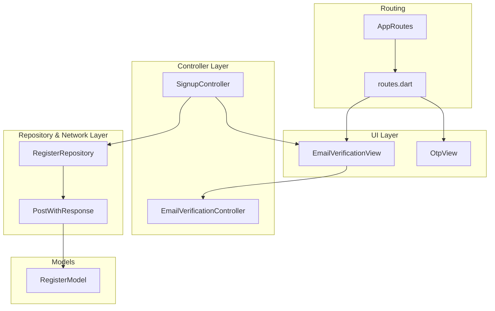
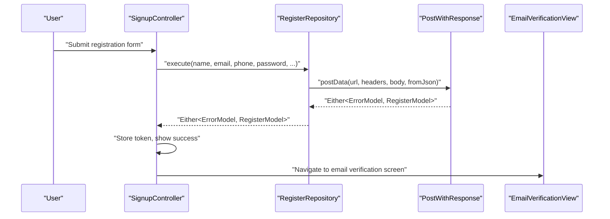
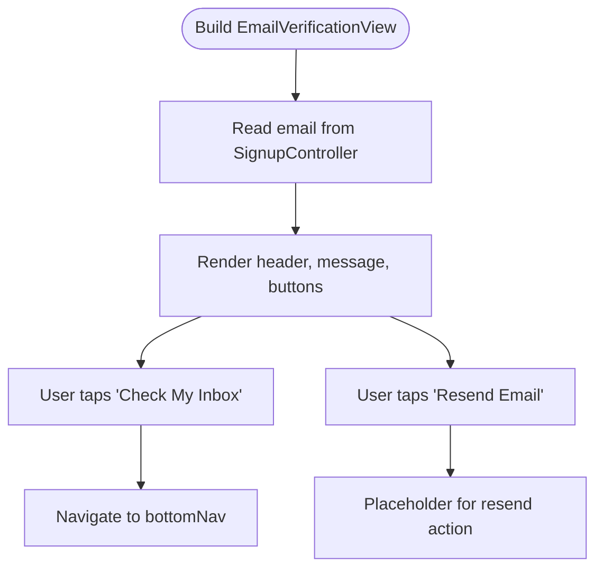
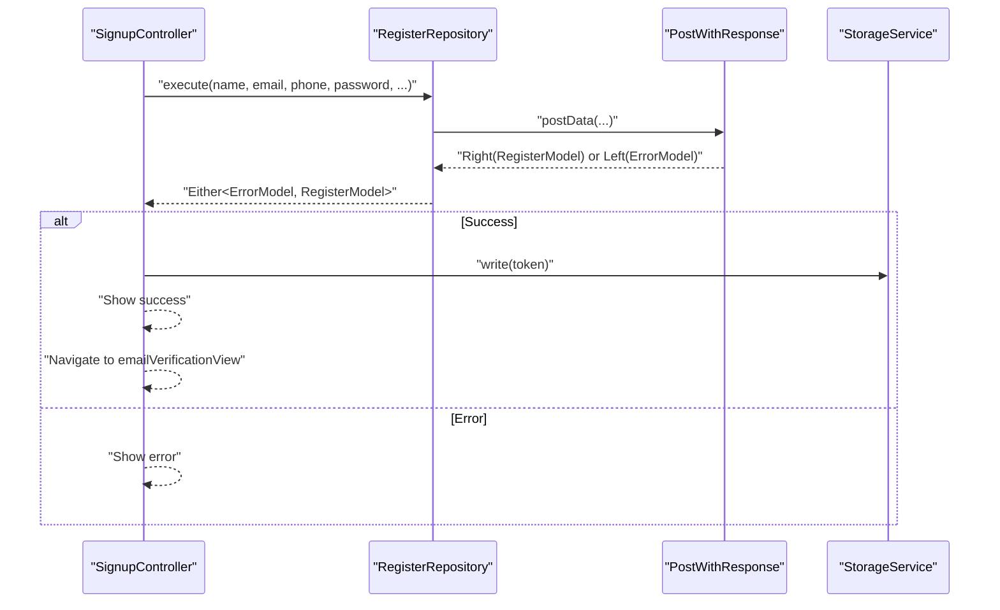
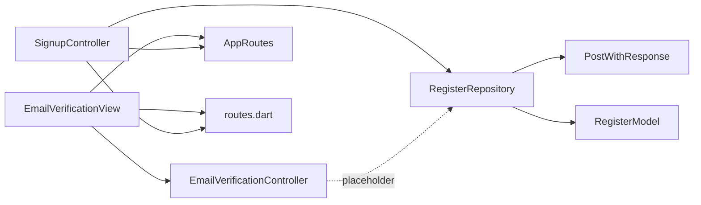

# Email Verification System

<cite>
**Referenced Files in This Document**
- [email_verification_controller.dart](file://lib/features/auth/controller/email_verification_controller.dart)
- [email_verification_view.dart](file://lib/features/auth/views/email_verification_view.dart)
- [signup_controller.dart](file://lib/features/auth/controller/signup_controller.dart)
- [register_repo.dart](file://lib/features/auth/repositories/register_repo.dart)
- [post_with_response.dart](file://lib/core/data/networks/post_with_response.dart)
- [register_model.dart](file://lib/features/auth/models/register_model.dart)
- [auth_bindings.dart](file://lib/features/auth/bindings/auth_bindings.dart)
- [app_routes.dart](file://lib/core/routes/app_routes.dart)
- [routes.dart](file://lib/core/routes/routes.dart)
- [otp_view.dart](file://lib/features/auth/views/otp_view.dart)
</cite>

## Table of Contents
1. [Introduction](#introduction)
2. [Project Structure](#project-structure)
3. [Core Components](#core-components)
4. [Architecture Overview](#architecture-overview)
5. [Detailed Component Analysis](#detailed-component-analysis)
6. [Dependency Analysis](#dependency-analysis)
7. [Performance Considerations](#performance-considerations)
8. [Troubleshooting Guide](#troubleshooting-guide)
9. [Conclusion](#conclusion)

## Introduction
This document describes the email verification system implemented in the application. It focuses on the email verification controller, the user interface for verification, the registration flow that triggers verification, and the underlying API integration patterns. The current implementation navigates users to an email verification screen after successful registration but does not include backend verification code handling, resend functionality, or verification status management in the frontend. This document outlines the existing flow, highlights missing pieces, and provides recommendations for extending the system with robust verification code handling, resend capabilities, and verification status management.

## Project Structure
The email verification system spans several layers:
- View layer: An email verification screen that informs users their email has been sent and provides navigation and resend actions.
- Controller layer: A lightweight controller for the verification screen and a registration controller that orchestrates the registration flow.
- Repository and network layer: A registration repository that performs the HTTP POST request and deserializes the response into typed models.
- Routing layer: Routes that connect the registration completion to the verification screen and subsequent navigation.

**Diagram sources**
- [email_verification_view.dart:13-69](file://lib/features/auth/views/email_verification_view.dart#L13-L69)
- [email_verification_controller.dart:1-3](file://lib/features/auth/controller/email_verification_controller.dart#L1-L3)
- [signup_controller.dart:10-67](file://lib/features/auth/controller/signup_controller.dart#L10-L67)
- [register_repo.dart:9-39](file://lib/features/auth/repositories/register_repo.dart#L9-L39)
- [post_with_response.dart:7-45](file://lib/core/data/networks/post_with_response.dart#L7-L45)
- [register_model.dart:1-74](file://lib/features/auth/models/register_model.dart#L1-L74)
- [app_routes.dart:1-34](file://lib/core/routes/app_routes.dart#L1-L34)
- [routes.dart:106-110](file://lib/core/routes/routes.dart#L106-L110)

**Section sources**
- [email_verification_view.dart:13-69](file://lib/features/auth/views/email_verification_view.dart#L13-L69)
- [signup_controller.dart:10-67](file://lib/features/auth/controller/signup_controller.dart#L10-L67)
- [register_repo.dart:9-39](file://lib/features/auth/repositories/register_repo.dart#L9-L39)
- [post_with_response.dart:7-45](file://lib/core/data/networks/post_with_response.dart#L7-L45)
- [register_model.dart:1-74](file://lib/features/auth/models/register_model.dart#L1-L74)
- [app_routes.dart:1-34](file://lib/core/routes/app_routes.dart#L1-L34)
- [routes.dart:106-110](file://lib/core/routes/routes.dart#L106-L110)

## Core Components
- EmailVerificationView: Displays the email verification screen, shows the target email address, and provides navigation and resend actions.
- EmailVerificationController: A placeholder controller for the verification screen.
- SignupController: Handles user registration, invokes the repository, stores the returned token, and navigates to the email verification screen.
- RegisterRepository: Encapsulates the registration API call and response parsing.
- PostWithResponse: Provides generic HTTP POST functionality with typed response decoding and error modeling.
- RegisterModel: Typed model for registration response data.
- Routing: Defines the email verification route and integrates it into the application pages.

**Section sources**
- [email_verification_view.dart:13-69](file://lib/features/auth/views/email_verification_view.dart#L13-L69)
- [email_verification_controller.dart:1-3](file://lib/features/auth/controller/email_verification_controller.dart#L1-L3)
- [signup_controller.dart:10-67](file://lib/features/auth/controller/signup_controller.dart#L10-L67)
- [register_repo.dart:9-39](file://lib/features/auth/repositories/register_repo.dart#L9-L39)
- [post_with_response.dart:7-45](file://lib/core/data/networks/post_with_response.dart#L7-L45)
- [register_model.dart:1-74](file://lib/features/auth/models/register_model.dart#L1-L74)
- [app_routes.dart:1-34](file://lib/core/routes/app_routes.dart#L1-L34)
- [routes.dart:106-110](file://lib/core/routes/routes.dart#L106-L110)

## Architecture Overview
The email verification flow begins after successful registration. The registration controller calls the registration repository, which performs an HTTP POST via the network layer. On success, the controller stores the token, shows a success message, and navigates to the email verification screen. The verification screen currently provides navigation and a placeholder for resend functionality.

**Diagram sources**
- [signup_controller.dart:25-54](file://lib/features/auth/controller/signup_controller.dart#L25-L54)
- [register_repo.dart:14-37](file://lib/features/auth/repositories/register_repo.dart#L14-L37)
- [post_with_response.dart:9-43](file://lib/core/data/networks/post_with_response.dart#L9-L43)
- [email_verification_view.dart:48-51](file://lib/features/auth/views/email_verification_view.dart#L48-L51)

## Detailed Component Analysis

### EmailVerificationView
- Purpose: Presents the email verification screen with:
  - Header and iconography.
  - A message indicating the verification email was sent to the registered email address.
  - A primary action to navigate to the bottom navigation.
  - A secondary action labeled "Resend Email" (placeholder).
- Data source: Reads the email address from the signup controller's email controller.
- Navigation: Navigates to the bottom navigation route upon user action.

**Diagram sources**
- [email_verification_view.dart:17-63](file://lib/features/auth/views/email_verification_view.dart#L17-L63)
- [signup_controller.dart:16-18](file://lib/features/auth/controller/signup_controller.dart#L16-L18)

**Section sources**
- [email_verification_view.dart:13-69](file://lib/features/auth/views/email_verification_view.dart#L13-L69)
- [signup_controller.dart:16-18](file://lib/features/auth/controller/signup_controller.dart#L16-L18)

### EmailVerificationController
- Current state: Minimal placeholder controller extending GetX.
- Extension opportunities: Add verification code handling, resend logic, and verification status updates.

**Section sources**
- [email_verification_controller.dart:1-3](file://lib/features/auth/controller/email_verification_controller.dart#L1-L3)

### SignupController
- Responsibilities:
  - Validates the registration form.
  - Calls the registration repository with collected user data.
  - Stores the returned token in local storage.
  - Shows success or error feedback.
  - Navigates to the email verification screen after successful registration.
- Integration: Uses the RegisterRepository and routes to the verification view.

**Diagram sources**
- [signup_controller.dart:25-54](file://lib/features/auth/controller/signup_controller.dart#L25-L54)
- [register_repo.dart:14-37](file://lib/features/auth/repositories/register_repo.dart#L14-L37)
- [post_with_response.dart:9-43](file://lib/core/data/networks/post_with_response.dart#L9-L43)

**Section sources**
- [signup_controller.dart:10-67](file://lib/features/auth/controller/signup_controller.dart#L10-L67)

### RegisterRepository
- Responsibilities:
  - Builds the registration endpoint URL based on user type.
  - Sets headers and encodes the request body.
  - Invokes the network layer to send the POST request.
  - Parses the JSON response into a typed RegisterModel.
- Integration: Returns Either<ErrorModel, RegisterModel> to the controller.

**Section sources**
- [register_repo.dart:9-39](file://lib/features/auth/repositories/register_repo.dart#L9-L39)

### PostWithResponse
- Responsibilities:
  - Sends HTTP POST requests with base URL concatenation.
  - Handles success and error responses.
  - Converts JSON bodies to typed models using a fromJson factory.
  - Wraps outcomes in Either for functional error handling.
- Integration: Used by repositories to perform network operations.

**Section sources**
- [post_with_response.dart:7-45](file://lib/core/data/networks/post_with_response.dart#L7-L45)

### RegisterModel
- Responsibilities:
  - Deserializes registration response JSON into strongly-typed fields.
  - Provides serialization and nested User model mapping.
- Integration: Consumed by repositories and controllers to access token and user data.

**Section sources**
- [register_model.dart:1-74](file://lib/features/auth/models/register_model.dart#L1-L74)

### Routing Integration
- Route definition: The email verification route is declared in AppRoutes.
- Page registration: The route is mapped to the EmailVerificationView with AuthBindings.
- Additional context: The OTP view exists for password reset flows, indicating potential reuse of verification patterns.

**Section sources**
- [app_routes.dart:12-12](file://lib/core/routes/app_routes.dart#L12-L12)
- [routes.dart:106-110](file://lib/core/routes/routes.dart#L106-L110)
- [otp_view.dart:13-79](file://lib/features/auth/views/otp_view.dart#L13-L79)

## Dependency Analysis
The email verification system exhibits a clean separation of concerns:
- UI depends on controllers and routing.
- Controllers depend on repositories and services.
- Repositories depend on the network layer.
- Models encapsulate data structures.

**Diagram sources**
- [email_verification_view.dart:13-69](file://lib/features/auth/views/email_verification_view.dart#L13-L69)
- [email_verification_controller.dart:1-3](file://lib/features/auth/controller/email_verification_controller.dart#L1-L3)
- [signup_controller.dart:10-67](file://lib/features/auth/controller/signup_controller.dart#L10-L67)
- [register_repo.dart:9-39](file://lib/features/auth/repositories/register_repo.dart#L9-L39)
- [post_with_response.dart:7-45](file://lib/core/data/networks/post_with_response.dart#L7-L45)
- [register_model.dart:1-74](file://lib/features/auth/models/register_model.dart#L1-L74)
- [app_routes.dart:1-34](file://lib/core/routes/app_routes.dart#L1-L34)
- [routes.dart:106-110](file://lib/core/routes/routes.dart#L106-L110)

**Section sources**
- [auth_bindings.dart:13-28](file://lib/features/auth/bindings/auth_bindings.dart#L13-L28)

## Performance Considerations
- Network latency: The registration flow performs a single HTTP request. Consider adding loading indicators and retry mechanisms for transient failures.
- UI responsiveness: Keep the verification screen lightweight; avoid heavy computations on build.
- Token handling: Store tokens securely and efficiently; ensure minimal serialization overhead.
- Error handling: Use typed error models to prevent unnecessary retries on client-side errors.

## Troubleshooting Guide
Common issues and remedies:
- Registration failure:
  - Symptom: Error snackbar appears after registration submission.
  - Cause: Backend validation errors or network issues.
  - Action: Inspect the error model returned by the network layer and surface user-friendly messages.
- Navigation to verification screen:
  - Symptom: App does not navigate after registration.
  - Cause: Missing route registration or incorrect route name.
  - Action: Verify the route constants and page registration.
- Token storage:
  - Symptom: User not authenticated after registration.
  - Cause: Token not written to storage or retrieval failure.
  - Action: Confirm storage service integration and key usage.
- Resend functionality:
  - Symptom: Resend button is inactive or unimplemented.
  - Cause: Placeholder action in the verification view.
  - Action: Implement resend logic in the verification controller and wire it to the UI.

**Section sources**
- [signup_controller.dart:40-44](file://lib/features/auth/controller/signup_controller.dart#L40-L44)
- [post_with_response.dart:29-42](file://lib/core/data/networks/post_with_response.dart#L29-L42)
- [email_verification_view.dart:53-63](file://lib/features/auth/views/email_verification_view.dart#L53-L63)

## Conclusion
The current email verification system provides a foundation with a verification screen and a registration flow that leads to the screen. To achieve a complete verification experience, the system should incorporate:
- Verification code handling: Capture and validate user-entered codes.
- Resend functionality: Allow users to request new verification emails.
- Verification status management: Track and update user verification state.
- Security measures: Enforce rate limits, secure token handling, and code expiration.
- User experience enhancements: Provide real-time feedback, countdown timers, and clear messaging.

These enhancements will transform the placeholder verification controller into a robust, production-ready component that seamlessly integrates with the existing registration and routing infrastructure.