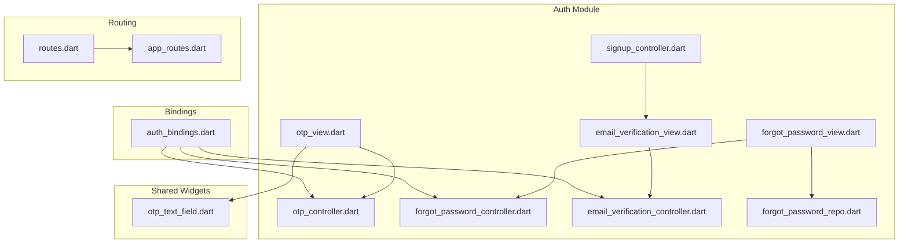
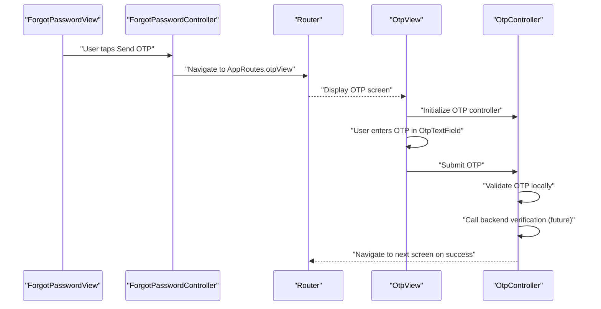
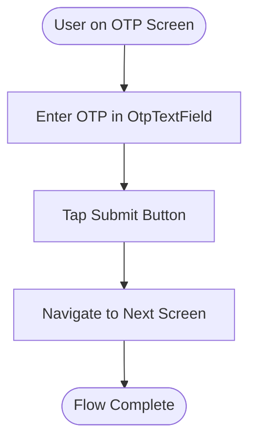
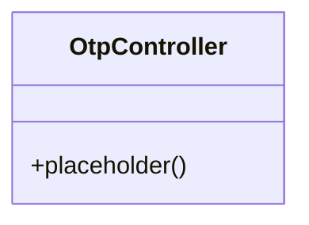
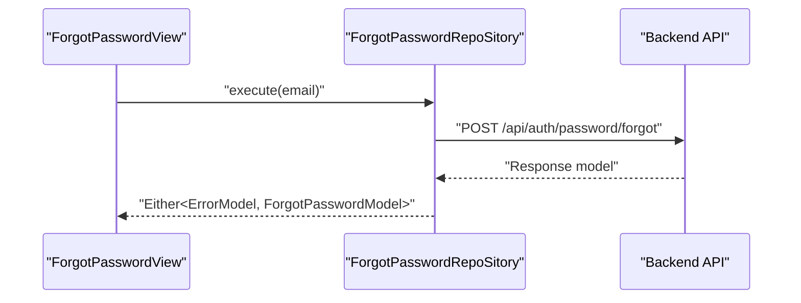
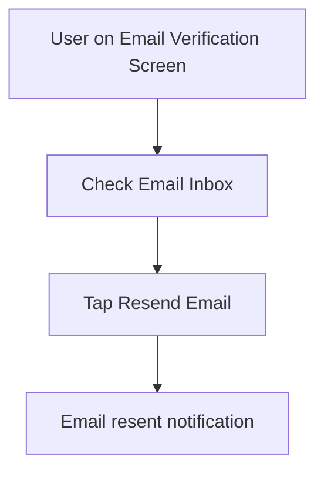
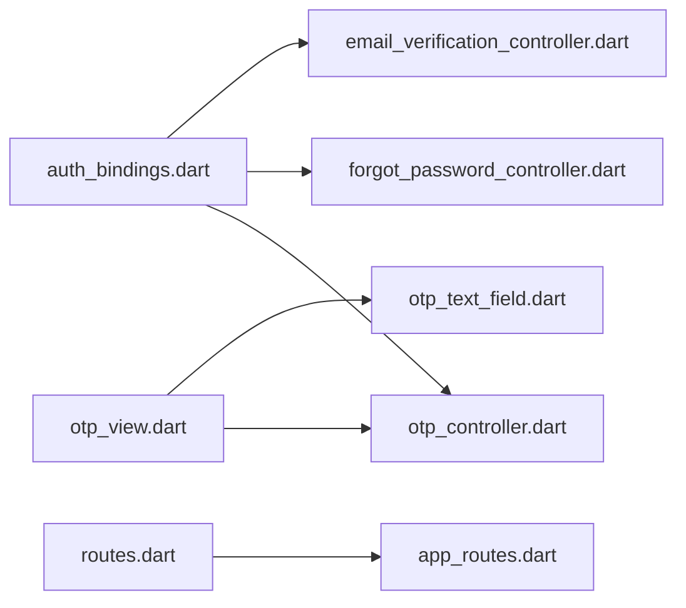

# OTP Authentication

<cite>
**Referenced Files in This Document**
- [otp_controller.dart](file://lib/features/auth/controller/otp_controller.dart)
- [otp_view.dart](file://lib/features/auth/views/otp_view.dart)
- [forgot_password_controller.dart](file://lib/features/auth/controller/forgot_password_controller.dart)
- [forgot_password_view.dart](file://lib/features/auth/views/forgot_password_view.dart)
- [email_verification_controller.dart](file://lib/features/auth/controller/email_verification_controller.dart)
- [email_verification_view.dart](file://lib/features/auth/views/email_verification_view.dart)
- [signup_controller.dart](file://lib/features/auth/controller/signup_controller.dart)
- [app_routes.dart](file://lib/core/routes/app_routes.dart)
- [routes.dart](file://lib/core/routes/routes.dart)
- [auth_bindings.dart](file://lib/features/auth/bindings/auth_bindings.dart)
- [forgot_password_repo.dart](file://lib/features/auth/repositories/forgot_password_repo.dart)
- [post_with_response.dart](file://lib/core/data/networks/post_with_response.dart)
- [headers_manager.dart](file://lib/core/data/networks/headers_manager.dart)
- [error_model.dart](file://lib/core/data/global_models/error_model.dart)
- [otp_text_field.dart](file://lib/shared/widgets/otp_text_field.dart)
</cite>

## Table of Contents
1. [Introduction](#introduction)
2. [Project Structure](#project-structure)
3. [Core Components](#core-components)
4. [Architecture Overview](#architecture-overview)
5. [Detailed Component Analysis](#detailed-component-analysis)
6. [Dependency Analysis](#dependency-analysis)
7. [Performance Considerations](#performance-considerations)
8. [Troubleshooting Guide](#troubleshooting-guide)
9. [Conclusion](#conclusion)

## Introduction
This document describes the OTP (One-Time Password) authentication system implemented in the Flutter application. It focuses on the OTP controller, OTP view, OTP input handling, navigation flow, and the supporting infrastructure for sending OTP via email. The current implementation includes UI scaffolding for OTP entry and navigation to subsequent screens, but the backend OTP generation, delivery, and verification logic are not present in the repository snapshot. This guide documents the existing frontend components, their interactions, and outlines how to extend the system with OTP generation, delivery, and verification capabilities.

## Project Structure
The OTP authentication feature is organized under the features/auth module with clear separation of concerns:
- Controllers manage state and orchestrate business logic
- Views define the UI and handle user interactions
- Repositories encapsulate network operations
- Routes and bindings connect UI to controllers
- Shared widgets provide reusable UI elements

**Diagram sources**
- [otp_view.dart:1-80](file://lib/features/auth/views/otp_view.dart#L1-L80)
- [otp_controller.dart:1-3](file://lib/features/auth/controller/otp_controller.dart#L1-L3)
- [forgot_password_view.dart:1-72](file://lib/features/auth/views/forgot_password_view.dart#L1-L72)
- [forgot_password_controller.dart:1-13](file://lib/features/auth/controller/forgot_password_controller.dart#L1-L13)
- [email_verification_view.dart:1-69](file://lib/features/auth/views/email_verification_view.dart#L1-L69)
- [email_verification_controller.dart:1-3](file://lib/features/auth/controller/email_verification_controller.dart#L1-L3)
- [forgot_password_repo.dart:1-25](file://lib/features/auth/repositories/forgot_password_repo.dart#L1-L25)
- [routes.dart:91-107](file://lib/core/routes/routes.dart#L91-L107)
- [app_routes.dart:8-11](file://lib/core/routes/app_routes.dart#L8-L11)
- [auth_bindings.dart:22-25](file://lib/features/auth/bindings/auth_bindings.dart#L22-L25)
- [signup_controller.dart:1-67](file://lib/features/auth/controller/signup_controller.dart#L1-L67)
- [otp_text_field.dart](file://lib/shared/widgets/otp_text_field.dart)

**Section sources**
- [otp_view.dart:1-80](file://lib/features/auth/views/otp_view.dart#L1-L80)
- [otp_controller.dart:1-3](file://lib/features/auth/controller/otp_controller.dart#L1-L3)
- [forgot_password_view.dart:1-72](file://lib/features/auth/views/forgot_password_view.dart#L1-L72)
- [forgot_password_controller.dart:1-13](file://lib/features/auth/controller/forgot_password_controller.dart#L1-L13)
- [email_verification_view.dart:1-69](file://lib/features/auth/views/email_verification_view.dart#L1-L69)
- [email_verification_controller.dart:1-3](file://lib/features/auth/controller/email_verification_controller.dart#L1-L3)
- [forgot_password_repo.dart:1-25](file://lib/features/auth/repositories/forgot_password_repo.dart#L1-L25)
- [routes.dart:91-107](file://lib/core/routes/routes.dart#L91-L107)
- [app_routes.dart:8-11](file://lib/core/routes/app_routes.dart#L8-L11)
- [auth_bindings.dart:22-25](file://lib/features/auth/bindings/auth_bindings.dart#L22-L25)
- [signup_controller.dart:1-67](file://lib/features/auth/controller/signup_controller.dart#L1-L67)

## Core Components
- OTP View: Presents the OTP input interface with a 5-digit field, styled text styles, and submit button. It reads the target email from the Forgot Password controller and displays a contextual message.
- OTP Controller: Placeholder controller extending GetX state management. It currently does not implement OTP logic but serves as a hook for future OTP state and actions.
- Forgot Password View and Controller: Provide the initial step to request OTP via email. The view triggers navigation to the OTP view upon pressing the send OTP action.
- Email Verification View and Controller: Handles post-registration email verification flow and includes a resend option.
- Forgot Password Repository: Encapsulates the network call to request an OTP via email using a POST endpoint.
- Routing and Bindings: Define named routes and lazy-load controllers for dependency injection.

Key implementation references:
- OTP input field and styling: [otp_view.dart:54-64](file://lib/features/auth/views/otp_view.dart#L54-L64)
- Navigation to OTP view: [forgot_password_view.dart:62-64](file://lib/features/auth/views/forgot_password_view.dart#L62-L64)
- OTP controller placeholder: [otp_controller.dart:1-3](file://lib/features/auth/controller/otp_controller.dart#L1-L3)
- Email verification UI and resend link: [email_verification_view.dart:53-63](file://lib/features/auth/views/email_verification_view.dart#L53-L63)
- OTP request repository method: [forgot_password_repo.dart:13-23](file://lib/features/auth/repositories/forgot_password_repo.dart#L13-L23)

**Section sources**
- [otp_view.dart:40-73](file://lib/features/auth/views/otp_view.dart#L40-L73)
- [otp_controller.dart:1-3](file://lib/features/auth/controller/otp_controller.dart#L1-L3)
- [forgot_password_view.dart:61-64](file://lib/features/auth/views/forgot_password_view.dart#L61-L64)
- [email_verification_view.dart:53-63](file://lib/features/auth/views/email_verification_view.dart#L53-L63)
- [forgot_password_repo.dart:13-23](file://lib/features/auth/repositories/forgot_password_repo.dart#L13-L23)

## Architecture Overview
The OTP flow is composed of three primary steps:
1. Request OTP: User enters email on the Forgot Password screen and triggers navigation to the OTP screen.
2. Enter OTP: User inputs the OTP code into the OTP text field on the OTP screen.
3. Verify OTP: On submission, the system would validate the OTP against the backend and proceed to the next step (e.g., reset password).

**Diagram sources**
- [forgot_password_view.dart:61-64](file://lib/features/auth/views/forgot_password_view.dart#L61-L64)
- [app_routes.dart:8-11](file://lib/core/routes/app_routes.dart#L8-L11)
- [otp_view.dart:54-73](file://lib/features/auth/views/otp_view.dart#L54-L73)
- [otp_controller.dart:1-3](file://lib/features/auth/controller/otp_controller.dart#L1-L3)

## Detailed Component Analysis

### OTP View and Input Handling
The OTP view renders a 5-digit OTP input field and a submit button. The input field is configured with:
- Number keyboard input
- Custom border and focus styling
- Cursor color customization
- Empty callbacks for code change and submit events

User experience highlights:
- Clear messaging indicating the target email address
- Styled input fields aligned with the current theme
- Immediate navigation to the next screen on submit

References:
- OTP field configuration: [otp_view.dart:54-64](file://lib/features/auth/views/otp_view.dart#L54-L64)
- Submit button and navigation: [otp_view.dart:66-73](file://lib/features/auth/views/otp_view.dart#L66-L73)
- Email context from Forgot Password controller: [otp_view.dart:48-52](file://lib/features/auth/views/otp_view.dart#L48-L52)

**Diagram sources**
- [otp_view.dart:54-73](file://lib/features/auth/views/otp_view.dart#L54-L73)

**Section sources**
- [otp_view.dart:40-73](file://lib/features/auth/views/otp_view.dart#L40-L73)

### OTP Controller
The OTP controller is currently a minimal placeholder extending GetX state management. It does not implement OTP-specific logic yet. Future enhancements should include:
- OTP state management (entered digits, validity)
- Timer-based expiration handling
- Retry mechanism and resend operations
- Validation and error reporting

References:
- Controller definition: [otp_controller.dart:1-3](file://lib/features/auth/controller/otp_controller.dart#L1-L3)

**Diagram sources**
- [otp_controller.dart:1-3](file://lib/features/auth/controller/otp_controller.dart#L1-L3)

**Section sources**
- [otp_controller.dart:1-3](file://lib/features/auth/controller/otp_controller.dart#L1-L3)

### Forgot Password Flow and OTP Request
The Forgot Password view collects the user's email and navigates to the OTP screen. The repository method encapsulates the OTP request to the backend endpoint.

References:
- Navigation trigger: [forgot_password_view.dart:62-64](file://lib/features/auth/views/forgot_password_view.dart#L62-L64)
- OTP request method: [forgot_password_repo.dart:13-23](file://lib/features/auth/repositories/forgot_password_repo.dart#L13-L23)
- Endpoint and headers: [forgot_password_repo.dart:16-19](file://lib/features/auth/repositories/forgot_password_repo.dart#L16-L19)

**Diagram sources**
- [forgot_password_view.dart:62-64](file://lib/features/auth/views/forgot_password_view.dart#L62-L64)
- [forgot_password_repo.dart:13-23](file://lib/features/auth/repositories/forgot_password_repo.dart#L13-L23)

**Section sources**
- [forgot_password_view.dart:61-64](file://lib/features/auth/views/forgot_password_view.dart#L61-L64)
- [forgot_password_repo.dart:13-23](file://lib/features/auth/repositories/forgot_password_repo.dart#L13-L23)

### Email Verification Flow
The email verification view informs the user that a verification email was sent and provides a link to resend the email. This complements the OTP flow for account registration.

References:
- Resend link placeholder: [email_verification_view.dart:53-63](file://lib/features/auth/views/email_verification_view.dart#L53-L63)
- Email context display: [email_verification_view.dart:35-42](file://lib/features/auth/views/email_verification_view.dart#L35-L42)

**Diagram sources**
- [email_verification_view.dart:53-63](file://lib/features/auth/views/email_verification_view.dart#L53-L63)

**Section sources**
- [email_verification_view.dart:35-63](file://lib/features/auth/views/email_verification_view.dart#L35-L63)

## Dependency Analysis
Controllers are registered via bindings and injected into views. The OTP view depends on the OTP controller and the shared OTP text field widget. Routing connects views to named routes.

**Diagram sources**
- [auth_bindings.dart:22-25](file://lib/features/auth/bindings/auth_bindings.dart#L22-L25)
- [otp_view.dart:1-15](file://lib/features/auth/views/otp_view.dart#L1-L15)
- [otp_controller.dart:1-3](file://lib/features/auth/controller/otp_controller.dart#L1-L3)
- [routes.dart:91-107](file://lib/core/routes/routes.dart#L91-L107)
- [app_routes.dart:8-11](file://lib/core/routes/app_routes.dart#L8-L11)

**Section sources**
- [auth_bindings.dart:22-25](file://lib/features/auth/bindings/auth_bindings.dart#L22-L25)
- [otp_view.dart:1-15](file://lib/features/auth/views/otp_view.dart#L1-L15)
- [routes.dart:91-107](file://lib/core/routes/routes.dart#L91-L107)

## Performance Considerations
- Minimize unnecessary rebuilds by using GetView/GetxController patterns effectively.
- Debounce or throttle OTP input handlers to avoid excessive recomputation.
- Cache email context from controllers to prevent repeated lookups.
- Keep network calls asynchronous to maintain UI responsiveness.

## Troubleshooting Guide
Common issues and remedies:
- Invalid OTP code: Implement validation feedback and retry prompts in the OTP controller.
- Rate limiting: Integrate backend rate limits and show user-friendly messages.
- Security measures: Enforce secure OTP generation, short expiration windows, and single-use tokens.
- User experience: Provide clear resend options, auto-focus on the first OTP field, and visual cues for input completion.

References for extending functionality:
- OTP controller placeholder for adding logic: [otp_controller.dart:1-3](file://lib/features/auth/controller/otp_controller.dart#L1-L3)
- OTP request repository for backend integration: [forgot_password_repo.dart:13-23](file://lib/features/auth/repositories/forgot_password_repo.dart#L13-L23)
- Error model for consistent error handling: [error_model.dart](file://lib/core/data/global_models/error_model.dart)

**Section sources**
- [otp_controller.dart:1-3](file://lib/features/auth/controller/otp_controller.dart#L1-L3)
- [forgot_password_repo.dart:13-23](file://lib/features/auth/repositories/forgot_password_repo.dart#L13-L23)

## Conclusion
The OTP authentication system currently provides the UI scaffolding and routing for OTP entry and navigation. The OTP controller and backend verification logic are placeholders awaiting implementation. By leveraging the existing repository pattern for OTP requests and integrating OTP generation, delivery, and validation, the system can achieve a robust and user-friendly OTP flow. Focus on state management, error handling, and UX improvements such as auto-fill and resend functionality to enhance the user experience.