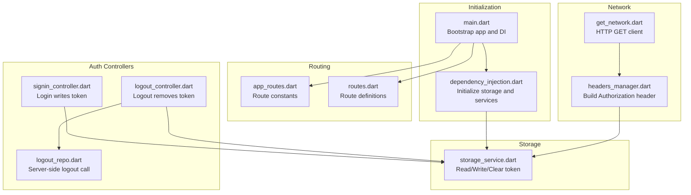
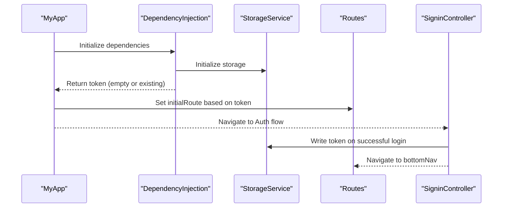
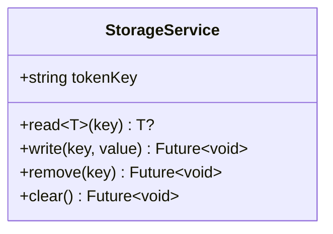
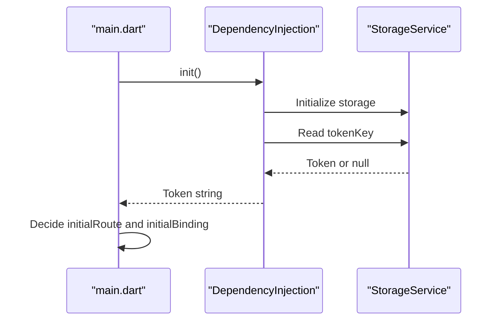
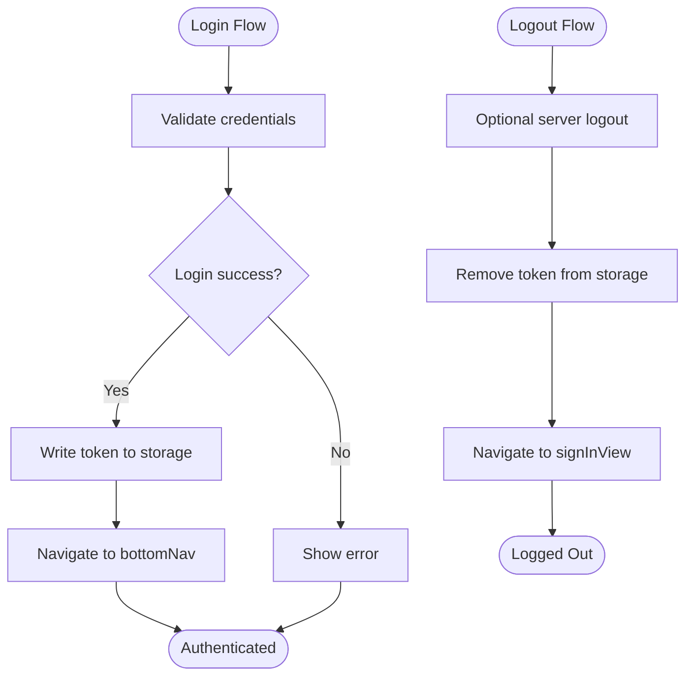
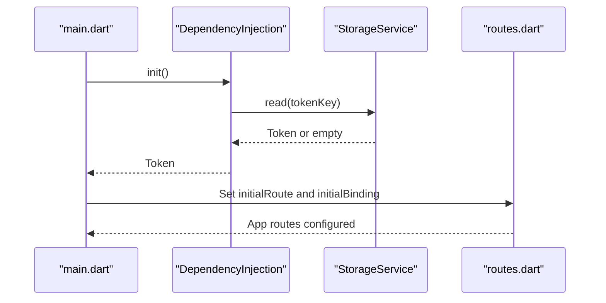
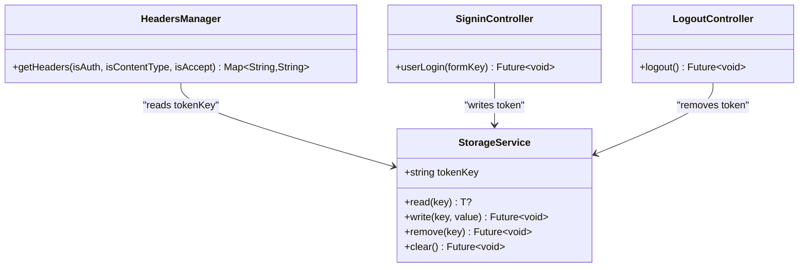
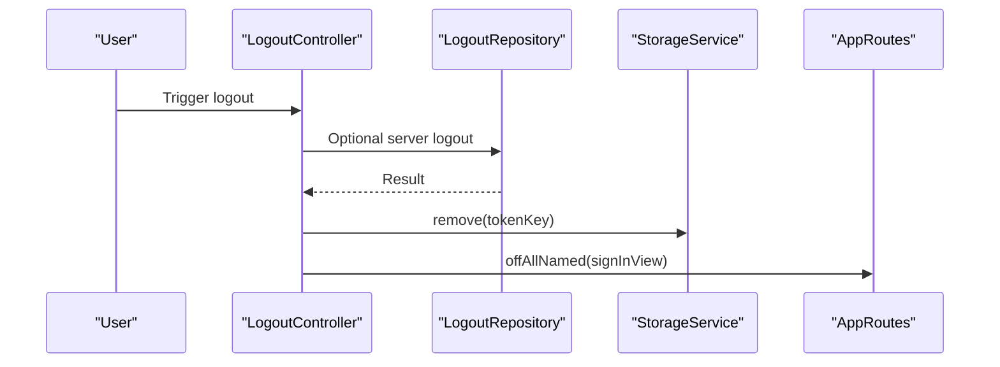
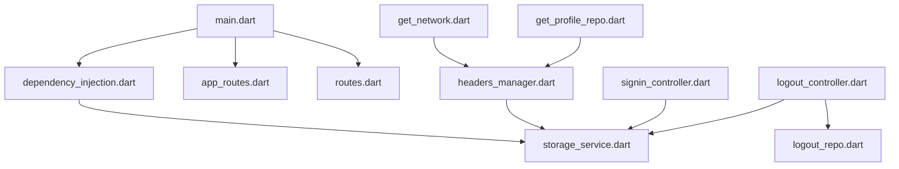

# Session Management

<cite>
**Referenced Files in This Document**
- [main.dart](file://lib/main.dart)
- [dependency_injection.dart](file://lib/core/di/dependency_injection.dart)
- [storage_service.dart](file://lib/core/data/local/storage_service.dart)
- [headers_manager.dart](file://lib/core/data/networks/headers_manager.dart)
- [get_network.dart](file://lib/core/data/networks/get_network.dart)
- [app_routes.dart](file://lib/core/routes/app_routes.dart)
- [routes.dart](file://lib/core/routes/routes.dart)
- [signin_controller.dart](file://lib/features/auth/controller/signin_controller.dart)
- [logout_controller.dart](file://lib/features/auth/controller/logout_controller.dart)
- [logout_repo.dart](file://lib/features/auth/repositories/logout_repo.dart)
- [get_profile_repo.dart](file://lib/features/profile/repositories/get_profile_repo.dart)
</cite>

## Table of Contents
1. [Introduction](#introduction)
2. [Project Structure](#project-structure)
3. [Core Components](#core-components)
4. [Architecture Overview](#architecture-overview)
5. [Detailed Component Analysis](#detailed-component-analysis)
6. [Dependency Analysis](#dependency-analysis)
7. [Performance Considerations](#performance-considerations)
8. [Troubleshooting Guide](#troubleshooting-guide)
9. [Conclusion](#conclusion)

## Introduction
This document explains session management and token handling in the application. It focuses on secure token storage via a dedicated service, session persistence across app restarts, and automatic logout functionality. It also documents the token lifecycle, integration with the routing system for authentication-aware navigation, and security best practices for token storage, session timeout handling, and logout procedures.

## Project Structure
The session management system spans several layers:
- Initialization and DI: Application bootstraps dependencies and initializes storage.
- Token storage: A lightweight wrapper around persistent storage.
- Network layer: Automatic inclusion of Authorization headers using stored tokens.
- Authentication controllers: Login writes tokens; logout removes tokens and navigates.
- Routing: Initial route selection and navigation decisions based on token presence.

**Diagram sources**
- [main.dart:12-46](file://lib/main.dart#L12-L46)
- [dependency_injection.dart:11-26](file://lib/core/di/dependency_injection.dart#L11-L26)
- [storage_service.dart:3-22](file://lib/core/data/local/storage_service.dart#L3-L22)
- [headers_manager.dart:4-22](file://lib/core/data/networks/headers_manager.dart#L4-L22)
- [get_network.dart:8-40](file://lib/core/data/networks/get_network.dart#L8-L40)
- [app_routes.dart:1-34](file://lib/core/routes/app_routes.dart#L1-L34)
- [routes.dart:55-211](file://lib/core/routes/routes.dart#L55-L211)
- [signin_controller.dart:9-36](file://lib/features/auth/controller/signin_controller.dart#L9-L36)
- [logout_controller.dart:7-28](file://lib/features/auth/controller/logout_controller.dart#L7-L28)
- [logout_repo.dart:8-19](file://lib/features/auth/repositories/logout_repo.dart#L8-L19)

**Section sources**
- [main.dart:12-46](file://lib/main.dart#L12-L46)
- [dependency_injection.dart:11-26](file://lib/core/di/dependency_injection.dart#L11-L26)
- [app_routes.dart:1-34](file://lib/core/routes/app_routes.dart#L1-L34)
- [routes.dart:55-211](file://lib/core/routes/routes.dart#L55-L211)

## Core Components
- StorageService: Provides typed read/write/remove/clear operations for keys including the token key. It encapsulates persistent storage access and exposes a single token key constant for uniform handling.
- HeadersManager: Builds HTTP headers with an Authorization Bearer token derived from StorageService. It ensures consistent header composition across requests.
- DependencyInjection: Initializes persistent storage, registers StorageService and other services, and returns the current token to main for initial route selection.
- MyApp: Uses the resolved token to decide initial binding and route, enabling authentication-aware navigation from startup.
- SigninController: On successful login, writes the returned token to storage and navigates to the authenticated area.
- LogoutController and LogoutRepository: Perform server-side logout (optional), then remove the token from storage and navigate to the sign-in route.

**Section sources**
- [storage_service.dart:3-22](file://lib/core/data/local/storage_service.dart#L3-L22)
- [headers_manager.dart:4-22](file://lib/core/data/networks/headers_manager.dart#L4-L22)
- [dependency_injection.dart:11-26](file://lib/core/di/dependency_injection.dart#L11-L26)
- [main.dart:21-46](file://lib/main.dart#L21-L46)
- [signin_controller.dart:9-36](file://lib/features/auth/controller/signin_controller.dart#L9-L36)
- [logout_controller.dart:7-28](file://lib/features/auth/controller/logout_controller.dart#L7-L28)
- [logout_repo.dart:8-19](file://lib/features/auth/repositories/logout_repo.dart#L8-L19)

## Architecture Overview
The session management architecture integrates initialization, storage, routing, and network layers to provide seamless authentication-aware navigation and secure token handling.

**Diagram sources**
- [main.dart:12-46](file://lib/main.dart#L12-L46)
- [dependency_injection.dart:11-26](file://lib/core/di/dependency_injection.dart#L11-L26)
- [storage_service.dart:3-22](file://lib/core/data/local/storage_service.dart#L3-L22)
- [routes.dart:55-211](file://lib/core/routes/routes.dart#L55-L211)
- [signin_controller.dart:17-36](file://lib/features/auth/controller/signin_controller.dart#L17-L36)

## Detailed Component Analysis

### StorageService Implementation
StorageService centralizes token and arbitrary key-value persistence. It:
- Exposes a token key constant for consistent identification.
- Provides generic read<T>, asynchronous write, remove, and clear operations.
- Delegates to a persistent storage backend via a storage box abstraction.

**Diagram sources**
- [storage_service.dart:3-22](file://lib/core/data/local/storage_service.dart#L3-L22)

**Section sources**
- [storage_service.dart:3-22](file://lib/core/data/local/storage_service.dart#L3-L22)

### Dependency Injection and Token Resolution
DependencyInjection initializes persistent storage, registers services, and returns the current token value. This enables MyApp to select the initial route based on whether a token exists.

**Diagram sources**
- [main.dart:12-19](file://lib/main.dart#L12-L19)
- [dependency_injection.dart:11-26](file://lib/core/di/dependency_injection.dart#L11-L26)
- [storage_service.dart:7-9](file://lib/core/data/local/storage_service.dart#L7-L9)

**Section sources**
- [main.dart:12-19](file://lib/main.dart#L12-L19)
- [dependency_injection.dart:11-26](file://lib/core/di/dependency_injection.dart#L11-L26)

### Token Lifecycle Management
- Login: On success, the token is written to storage and the app navigates to the authenticated area.
- Navigation: The presence of a token determines the initial route and binding at startup.
- Logout: The token is removed from storage and the app navigates to the sign-in route. A server-side logout call is optional but supported.

**Diagram sources**
- [signin_controller.dart:17-36](file://lib/features/auth/controller/signin_controller.dart#L17-L36)
- [logout_controller.dart:13-28](file://lib/features/auth/controller/logout_controller.dart#L13-L28)
- [logout_repo.dart:12-19](file://lib/features/auth/repositories/logout_repo.dart#L12-L19)
- [app_routes.dart:2-33](file://lib/core/routes/app_routes.dart#L2-L33)

**Section sources**
- [signin_controller.dart:17-36](file://lib/features/auth/controller/signin_controller.dart#L17-L36)
- [logout_controller.dart:13-28](file://lib/features/auth/controller/logout_controller.dart#L13-L28)
- [logout_repo.dart:12-19](file://lib/features/auth/repositories/logout_repo.dart#L12-L19)
- [app_routes.dart:2-33](file://lib/core/routes/app_routes.dart#L2-L33)

### Integration with Routing System
- Initial Route Selection: MyApp chooses initialRoute and initialBinding based on the token returned by DependencyInjection.
- Route Definitions: All routes are declared centrally, enabling consistent navigation across the app.
- Authentication Guards: While explicit guards are not shown in the provided files, the token-driven initial route selection acts as a guard for authenticated access.

**Diagram sources**
- [main.dart:12-19](file://lib/main.dart#L12-L19)
- [dependency_injection.dart:21-25](file://lib/core/di/dependency_injection.dart#L21-L25)
- [storage_service.dart:7-9](file://lib/core/data/local/storage_service.dart#L7-L9)
- [routes.dart:55-211](file://lib/core/routes/routes.dart#L55-L211)

**Section sources**
- [main.dart:12-19](file://lib/main.dart#L12-L19)
- [dependency_injection.dart:21-25](file://lib/core/di/dependency_injection.dart#L21-L25)
- [routes.dart:55-211](file://lib/core/routes/routes.dart#L55-L211)

### Secure Token Handling Patterns
- Centralized Storage: All token operations go through StorageService, ensuring consistent handling and reducing duplication.
- Authorization Header Construction: HeadersManager builds Authorization headers using the stored token, avoiding manual token concatenation.
- Controlled Access: Token presence controls initial navigation, preventing unauthorized access to authenticated areas.

**Diagram sources**
- [headers_manager.dart:9-21](file://lib/core/data/networks/headers_manager.dart#L9-L21)
- [storage_service.dart:3-22](file://lib/core/data/local/storage_service.dart#L3-L22)
- [signin_controller.dart:29-33](file://lib/features/auth/controller/signin_controller.dart#L29-L33)
- [logout_controller.dart:20-26](file://lib/features/auth/controller/logout_controller.dart#L20-L26)

**Section sources**
- [headers_manager.dart:9-21](file://lib/core/data/networks/headers_manager.dart#L9-L21)
- [storage_service.dart:3-22](file://lib/core/data/local/storage_service.dart#L3-L22)
- [signin_controller.dart:29-33](file://lib/features/auth/controller/signin_controller.dart#L29-L33)
- [logout_controller.dart:20-26](file://lib/features/auth/controller/logout_controller.dart#L20-L26)

### Session Validation and Automatic Logout
- Session Validation: The presence of a token in storage indicates an active session. The app leverages this to decide initial navigation.
- Automatic Logout: On logout, the token is removed from storage and the app navigates to the sign-in route. A server-side logout call is optional but supported.

**Diagram sources**
- [logout_controller.dart:13-28](file://lib/features/auth/controller/logout_controller.dart#L13-L28)
- [logout_repo.dart:12-19](file://lib/features/auth/repositories/logout_repo.dart#L12-L19)
- [storage_service.dart:15-17](file://lib/core/data/local/storage_service.dart#L15-L17)
- [app_routes.dart:2-33](file://lib/core/routes/app_routes.dart#L2-L33)

**Section sources**
- [logout_controller.dart:13-28](file://lib/features/auth/controller/logout_controller.dart#L13-L28)
- [logout_repo.dart:12-19](file://lib/features/auth/repositories/logout_repo.dart#L12-L19)
- [storage_service.dart:15-17](file://lib/core/data/local/storage_service.dart#L15-L17)
- [app_routes.dart:2-33](file://lib/core/routes/app_routes.dart#L2-L33)

### Protected Route Access and Authentication Guards
- Protected Access: The initial route selection based on token presence enforces access control at the application boundary.
- Route Protection: While explicit guards are not shown in the provided files, the token-driven navigation pattern provides a foundation for protecting routes. Additional guards can be implemented by checking token presence before allowing navigation to protected pages.

[No sources needed since this section provides conceptual guidance]

## Dependency Analysis
The following diagram shows how components depend on each other for session management and navigation.

**Diagram sources**
- [main.dart:12-46](file://lib/main.dart#L12-L46)
- [dependency_injection.dart:11-26](file://lib/core/di/dependency_injection.dart#L11-L26)
- [storage_service.dart:3-22](file://lib/core/data/local/storage_service.dart#L3-L22)
- [headers_manager.dart:4-22](file://lib/core/data/networks/headers_manager.dart#L4-L22)
- [get_network.dart:8-40](file://lib/core/data/networks/get_network.dart#L8-L40)
- [signin_controller.dart:9-36](file://lib/features/auth/controller/signin_controller.dart#L9-L36)
- [logout_controller.dart:7-28](file://lib/features/auth/controller/logout_controller.dart#L7-L28)
- [logout_repo.dart:8-19](file://lib/features/auth/repositories/logout_repo.dart#L8-L19)
- [get_profile_repo.dart:7-19](file://lib/features/profile/repositories/get_profile_repo.dart#L7-L19)
- [app_routes.dart:1-34](file://lib/core/routes/app_routes.dart#L1-L34)
- [routes.dart:55-211](file://lib/core/routes/routes.dart#L55-L211)

**Section sources**
- [main.dart:12-46](file://lib/main.dart#L12-L46)
- [dependency_injection.dart:11-26](file://lib/core/di/dependency_injection.dart#L11-L26)
- [routes.dart:55-211](file://lib/core/routes/routes.dart#L55-L211)

## Performance Considerations
- Minimize Storage Calls: Batch token writes and reads; avoid frequent synchronous disk operations.
- Lazy Initialization: Continue using lazy initialization for controllers and repositories to reduce startup overhead.
- Network Efficiency: Reuse headers and avoid redundant header construction by leveraging the centralized headers manager.

[No sources needed since this section provides general guidance]

## Troubleshooting Guide
Common issues and resolutions:
- Token Not Persisting: Verify that StorageService write operations occur after successful login and that the token key matches across components.
- Unauthorized Requests: Ensure HeadersManager includes the Authorization header and that the token is present in storage.
- Incorrect Initial Route: Confirm that DependencyInjection returns the token and that MyApp sets the initial route accordingly.
- Logout Not Working: Check that LogoutController removes the token and navigates to the sign-in route, and optionally verifies server-side logout behavior.

**Section sources**
- [storage_service.dart:7-21](file://lib/core/data/local/storage_service.dart#L7-L21)
- [headers_manager.dart:9-21](file://lib/core/data/networks/headers_manager.dart#L9-L21)
- [dependency_injection.dart:21-25](file://lib/core/di/dependency_injection.dart#L21-L25)
- [logout_controller.dart:13-28](file://lib/features/auth/controller/logout_controller.dart#L13-L28)

## Conclusion
The session management system uses a clean separation of concerns: a dedicated storage service for tokens, a centralized headers manager for secure header construction, and controllers that orchestrate login and logout flows. The routing system leverages token presence for authentication-aware navigation. Together, these components provide a robust foundation for secure token handling, session persistence, and controlled access to authenticated features.