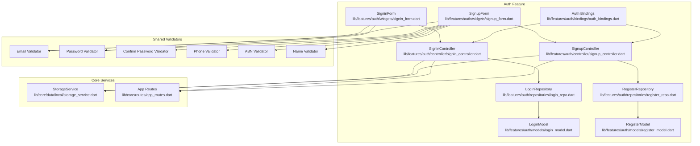
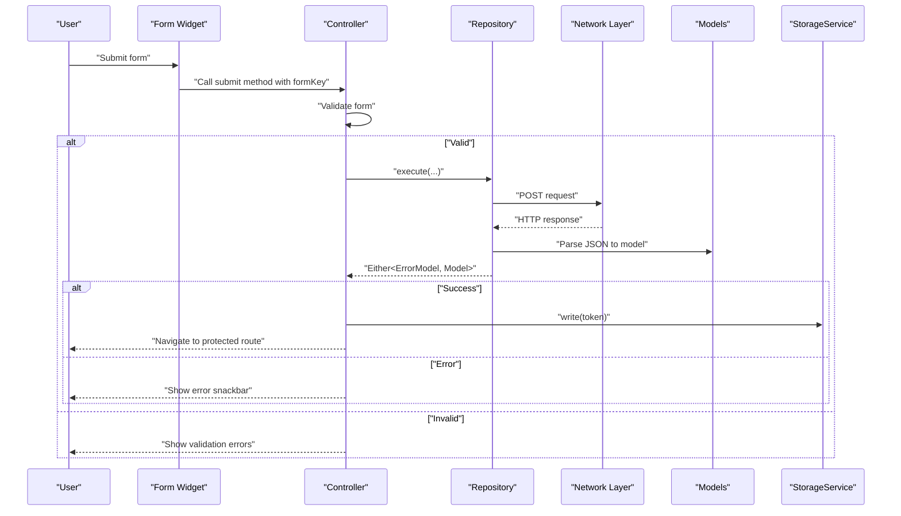
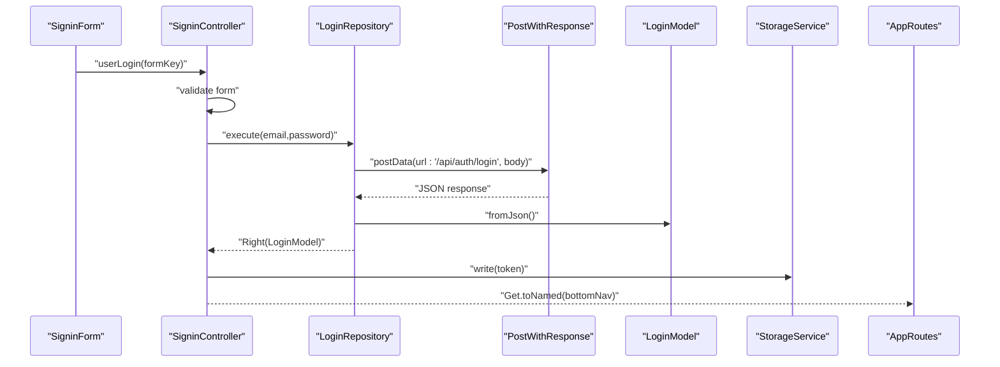
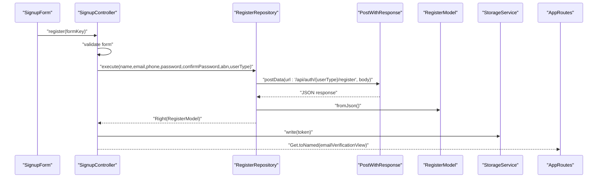
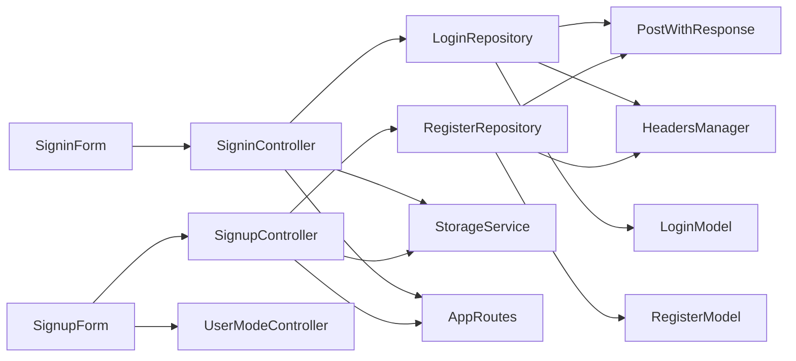

# User Authentication Flow

<cite>
**Referenced Files in This Document**
- [signin_controller.dart](file://lib/features/auth/controller/signin_controller.dart)
- [signup_controller.dart](file://lib/features/auth/controller/signup_controller.dart)
- [login_repo.dart](file://lib/features/auth/repositories/login_repo.dart)
- [register_repo.dart](file://lib/features/auth/repositories/register_repo.dart)
- [login_model.dart](file://lib/features/auth/models/login_model.dart)
- [register_model.dart](file://lib/features/auth/models/register_model.dart)
- [storage_service.dart](file://lib/core/data/local/storage_service.dart)
- [signin_form.dart](file://lib/features/auth/widgets/signin_form.dart)
- [signup_form.dart](file://lib/features/auth/widgets/signup_form.dart)
- [email_validator.dart](file://lib/shared/extensions/validators/email_validator.dart)
- [password_validator.dart](file://lib/shared/extensions/validators/password_validator.dart)
- [confirm_password_validator.dart](file://lib/shared/extensions/validators/confirm_password_validator.dart)
- [phone_validator.dart](file://lib/shared/extensions/validators/phone_validator.dart)
- [abn_validator.dart](file://lib/shared/extensions/validators/abn_validator.dart)
- [name_validator.dart](file://lib/shared/extensions/validators/name_validator.dart)
- [app_routes.dart](file://lib/core/routes/app_routes.dart)
- [auth_bindings.dart](file://lib/features/auth/bindings/auth_bindings.dart)
</cite>

## Table of Contents
1. [Introduction](#introduction)
2. [Project Structure](#project-structure)
3. [Core Components](#core-components)
4. [Architecture Overview](#architecture-overview)
5. [Detailed Component Analysis](#detailed-component-analysis)
6. [Dependency Analysis](#dependency-analysis)
7. [Performance Considerations](#performance-considerations)
8. [Troubleshooting Guide](#troubleshooting-guide)
9. [Conclusion](#conclusion)

## Introduction
This document explains the complete user authentication flow, covering login and registration processes. It details form validation, API integration, response handling, controller implementations, repository patterns, token persistence via StorageService, and navigation to protected routes. It also addresses common authentication scenarios, validation rules, and security considerations.

## Project Structure
Authentication-related components are organized under the `lib/features/auth/` directory with clear separation of concerns:
- Controllers: business logic for sign-in and sign-up
- Repositories: network-layer abstraction for login and registration
- Models: typed JSON responses for login and registration
- Widgets: reusable form components with validation
- Bindings: dependency injection setup for controllers

**Diagram sources**
- [signin_controller.dart:1-52](file://lib/features/auth/controller/signin_controller.dart#L1-L52)
- [signup_controller.dart:1-67](file://lib/features/auth/controller/signup_controller.dart#L1-L67)
- [login_repo.dart:1-29](file://lib/features/auth/repositories/login_repo.dart#L1-L29)
- [register_repo.dart:1-39](file://lib/features/auth/repositories/register_repo.dart#L1-L39)
- [login_model.dart:1-74](file://lib/features/auth/models/login_model.dart#L1-L74)
- [register_model.dart:1-74](file://lib/features/auth/models/register_model.dart#L1-L74)
- [signin_form.dart:1-60](file://lib/features/auth/widgets/signin_form.dart#L1-L60)
- [signup_form.dart:1-104](file://lib/features/auth/widgets/signup_form.dart#L1-L104)
- [storage_service.dart:1-23](file://lib/core/data/local/storage_service.dart#L1-L23)
- [app_routes.dart](file://lib/core/routes/app_routes.dart)
- [auth_bindings.dart](file://lib/features/auth/bindings/auth_bindings.dart)

**Section sources**
- [signin_controller.dart:1-52](file://lib/features/auth/controller/signin_controller.dart#L1-L52)
- [signup_controller.dart:1-67](file://lib/features/auth/controller/signup_controller.dart#L1-L67)
- [login_repo.dart:1-29](file://lib/features/auth/repositories/login_repo.dart#L1-L29)
- [register_repo.dart:1-39](file://lib/features/auth/repositories/register_repo.dart#L1-L39)
- [signin_form.dart:1-60](file://lib/features/auth/widgets/signin_form.dart#L1-L60)
- [signup_form.dart:1-104](file://lib/features/auth/widgets/signup_form.dart#L1-L104)
- [storage_service.dart:1-23](file://lib/core/data/local/storage_service.dart#L1-L23)
- [auth_bindings.dart](file://lib/features/auth/bindings/auth_bindings.dart)

## Core Components
- SigninController: Manages login form state, validation, API call, error/success handling, token persistence, and route navigation.
- SignupController: Manages registration form state, validation, API call, user type selection, token persistence, and verification flow.
- LoginRepository/RegisterRepository: Encapsulate network requests for login and registration, returning typed models wrapped in Either.
- Models: LoginModel/RegisterModel define token and user payload structures.
- StorageService: Provides secure token persistence using GetStorage.
- Forms and Validators: Reusable form widgets with field-specific validators for robust client-side validation.

**Section sources**
- [signin_controller.dart:9-51](file://lib/features/auth/controller/signin_controller.dart#L9-L51)
- [signup_controller.dart:10-66](file://lib/features/auth/controller/signup_controller.dart#L10-L66)
- [login_repo.dart:9-28](file://lib/features/auth/repositories/login_repo.dart#L9-L28)
- [register_repo.dart:9-38](file://lib/features/auth/repositories/register_repo.dart#L9-L38)
- [login_model.dart:1-74](file://lib/features/auth/models/login_model.dart#L1-L74)
- [register_model.dart:1-74](file://lib/features/auth/models/register_model.dart#L1-L74)
- [storage_service.dart:3-22](file://lib/core/data/local/storage_service.dart#L3-L22)
- [signin_form.dart:12-59](file://lib/features/auth/widgets/signin_form.dart#L12-L59)
- [signup_form.dart:15-103](file://lib/features/auth/widgets/signup_form.dart#L15-L103)

## Architecture Overview
The authentication flow follows a layered architecture:
- Presentation Layer: Forms and controllers handle user input and UI state.
- Business Logic Layer: Controllers orchestrate validation, repository calls, and navigation.
- Repository Layer: Repositories encapsulate network calls and response parsing.
- Data Layer: Models represent server responses; StorageService persists tokens.

**Diagram sources**
- [signin_controller.dart:17-36](file://lib/features/auth/controller/signin_controller.dart#L17-L36)
- [signup_controller.dart:25-54](file://lib/features/auth/controller/signup_controller.dart#L25-L54)
- [login_repo.dart:14-27](file://lib/features/auth/repositories/login_repo.dart#L14-L27)
- [register_repo.dart:14-37](file://lib/features/auth/repositories/register_repo.dart#L14-L37)
- [storage_service.dart:11-13](file://lib/core/data/local/storage_service.dart#L11-L13)

## Detailed Component Analysis

### SigninController Implementation
Responsibilities:
- Manage email and password fields via TextEditingController.
- Toggle loading state during login.
- Validate form using FormState and show errors via snackbars.
- Call LoginRepository.execute with validated credentials.
- Persist token via StorageService and navigate to bottom navigation on success.
- Clear form fields and navigate to user mode selection on signup intent.

Key methods:
- userLogin(formKey): Orchestrates validation, repository call, and response handling.
- signup(formKey): Clears form and navigates to user mode view.
- dispose(): Releases text controllers.

State management:
- RxBool isLoading controls UI loading state.
- Email and password stored in TextEditingController instances.

Navigation and token persistence:
- On success, token is written to StorageService and user is routed to AppRoutes.bottomNav.
- On failure, an error snackbar is displayed.

**Section sources**
- [signin_controller.dart:9-51](file://lib/features/auth/controller/signin_controller.dart#L9-L51)

#### Login Flow Sequence

**Diagram sources**
- [signin_controller.dart:17-36](file://lib/features/auth/controller/signin_controller.dart#L17-L36)
- [login_repo.dart:14-27](file://lib/features/auth/repositories/login_repo.dart#L14-L27)
- [login_model.dart:1-20](file://lib/features/auth/models/login_model.dart#L1-L20)
- [storage_service.dart:11-13](file://lib/core/data/local/storage_service.dart#L11-L13)
- [app_routes.dart](file://lib/core/routes/app_routes.dart)

### SignupController Implementation
Responsibilities:
- Manage multiple fields: name, email, phone, password, confirm password, ABN (optional).
- Track checkbox state and loading state.
- Determine user type from UserModeController (customer/business).
- Validate form using validators and show errors via snackbars.
- Call RegisterRepository.execute with structured payload.
- Persist token and navigate to email verification on success.

Key methods:
- register(formKey): Validates, calls repository, handles response, persists token, and navigates.
- dispose(): Releases all text controllers.

Payload construction:
- userType derived from UserModeController selectedIndex.
- abn included only if not empty.

**Section sources**
- [signup_controller.dart:10-66](file://lib/features/auth/controller/signup_controller.dart#L10-L66)

#### Registration Flow Sequence

**Diagram sources**
- [signup_controller.dart:25-54](file://lib/features/auth/controller/signup_controller.dart#L25-L54)
- [register_repo.dart:14-37](file://lib/features/auth/repositories/register_repo.dart#L14-L37)
- [register_model.dart:1-20](file://lib/features/auth/models/register_model.dart#L1-L20)
- [storage_service.dart:11-13](file://lib/core/data/local/storage_service.dart#L11-L13)
- [app_routes.dart](file://lib/core/routes/app_routes.dart)

### Authentication Repository Patterns
LoginRepository:
- Accepts email and password.
- Sends POST request to "/api/auth/login".
- Parses response into LoginModel.
- Returns Either<ErrorModel, LoginModel>.

RegisterRepository:
- Accepts name, email, phone, password, confirm password, optional abn.
- Determines endpoint based on userType ("customer" or "business").
- Sends POST request to "/api/auth/{userType}/register".
- Parses response into RegisterModel.
- Returns Either<ErrorModel, RegisterModel>.

Both repositories rely on PostWithResponse and HeadersManager for HTTP communication and JSON deserialization.

**Section sources**
- [login_repo.dart:9-28](file://lib/features/auth/repositories/login_repo.dart#L9-L28)
- [register_repo.dart:9-38](file://lib/features/auth/repositories/register_repo.dart#L9-L38)

### Data Models
LoginModel and RegisterModel share a common structure:
- token: JWT or session token.
- user: User object containing id, name, email, phone, abn, type, status, timestamps.

User model fields:
- id, name, email, phone, abn, type, status, emailVerifiedAt, createdAt, updatedAt.

These models enable consistent handling of authentication responses across controllers and repositories.

**Section sources**
- [login_model.dart:1-74](file://lib/features/auth/models/login_model.dart#L1-L74)
- [register_model.dart:1-74](file://lib/features/auth/models/register_model.dart#L1-L74)

### Form Validation and User Experience
SigninForm:
- Validates email and password using dedicated validators.
- Provides "Forgot Password" navigation.
- Integrates with SigninController for submission.

SignupForm:
- Dynamically adjusts labels and icons based on user type selection.
- Validates name, email, password, confirm password, phone, and ABN (businesses).
- Uses UserModeController to switch validation rules.

Validators:
- EmailValidator: Ensures non-empty and syntactically valid email.
- PasswordValidator: Enforces minimum length and complexity rules.
- ConfirmPasswordValidator: Compares password and confirmation fields.
- PhoneValidator: Validates phone number format.
- ABNValidator: Validates Australian Business Number format.
- NameValidator: Ensures non-empty name.

**Section sources**
- [signin_form.dart:12-59](file://lib/features/auth/widgets/signin_form.dart#L12-L59)
- [signup_form.dart:15-103](file://lib/features/auth/widgets/signup_form.dart#L15-L103)
- [email_validator.dart:1-14](file://lib/shared/extensions/validators/email_validator.dart#L1-L14)
- [password_validator.dart](file://lib/shared/extensions/validators/password_validator.dart)
- [confirm_password_validator.dart](file://lib/shared/extensions/validators/confirm_password_validator.dart)
- [phone_validator.dart](file://lib/shared/extensions/validators/phone_validator.dart)
- [abn_validator.dart](file://lib/shared/extensions/validators/abn_validator.dart)
- [name_validator.dart](file://lib/shared/extensions/validators/name_validator.dart)

### Token Persistence and Navigation
StorageService:
- Provides read/write/remove/clear operations using GetStorage.
- Uses a fixed tokenKey for storing the authentication token.

Integration:
- On successful login or registration, controllers persist the token and navigate to protected routes.
- Navigation targets are centralized in AppRoutes for maintainability.

**Section sources**
- [storage_service.dart:3-22](file://lib/core/data/local/storage_service.dart#L3-L22)
- [signin_controller.dart:29-34](file://lib/features/auth/controller/signin_controller.dart#L29-L34)
- [signup_controller.dart:44-51](file://lib/features/auth/controller/signup_controller.dart#L44-L51)
- [app_routes.dart](file://lib/core/routes/app_routes.dart)

### Common Authentication Scenarios and Security Considerations
Common scenarios:
- Empty or invalid email: handled by EmailValidator.
- Weak or mismatched passwords: enforced by PasswordValidator and ConfirmPasswordValidator.
- Business registration without ABN: optional field guarded by ABNValidator and repository conditionals.
- Phone number formatting: validated by PhoneValidator.
- Forgot password flow: navigates to forgot password view from SigninForm.

Security considerations:
- Client-side validation improves UX but must be complemented by server-side validation.
- Tokens are persisted locally; ensure secure storage and consider token expiration handling.
- Passwords are transmitted over HTTPS; avoid logging sensitive data.
- Use HTTPS endpoints and enforce strong password policies server-side.

[No sources needed since this section provides general guidance]

## Dependency Analysis
Controllers depend on repositories, which depend on network utilities and headers manager. Models are consumed by repositories and controllers. Forms depend on validators and controllers. StorageService and AppRoutes are used by controllers for persistence and navigation.

**Diagram sources**
- [signin_controller.dart:9-51](file://lib/features/auth/controller/signin_controller.dart#L9-L51)
- [signup_controller.dart:10-66](file://lib/features/auth/controller/signup_controller.dart#L10-L66)
- [login_repo.dart:9-28](file://lib/features/auth/repositories/login_repo.dart#L9-L28)
- [register_repo.dart:9-38](file://lib/features/auth/repositories/register_repo.dart#L9-L38)
- [signin_form.dart:12-59](file://lib/features/auth/widgets/signin_form.dart#L12-L59)
- [signup_form.dart:15-103](file://lib/features/auth/widgets/signup_form.dart#L15-L103)
- [storage_service.dart:3-22](file://lib/core/data/local/storage_service.dart#L3-L22)
- [app_routes.dart](file://lib/core/routes/app_routes.dart)

**Section sources**
- [signin_controller.dart:9-51](file://lib/features/auth/controller/signin_controller.dart#L9-L51)
- [signup_controller.dart:10-66](file://lib/features/auth/controller/signup_controller.dart#L10-L66)
- [login_repo.dart:9-28](file://lib/features/auth/repositories/login_repo.dart#L9-L28)
- [register_repo.dart:9-38](file://lib/features/auth/repositories/register_repo.dart#L9-L38)
- [signin_form.dart:12-59](file://lib/features/auth/widgets/signin_form.dart#L12-L59)
- [signup_form.dart:15-103](file://lib/features/auth/widgets/signup_form.dart#L15-L103)
- [storage_service.dart:3-22](file://lib/core/data/local/storage_service.dart#L3-L22)
- [app_routes.dart](file://lib/core/routes/app_routes.dart)

## Performance Considerations
- Minimize unnecessary rebuilds by using Rx state sparingly and leveraging GetX observables effectively.
- Debounce or throttle rapid form submissions to reduce redundant network calls.
- Cache frequently accessed user data after login to reduce repeated fetches.
- Keep payloads minimal; only send required fields for login and registration.

[No sources needed since this section provides general guidance]

## Troubleshooting Guide
Common issues and resolutions:
- Form does not submit: Ensure formKey is passed correctly to controllers and FormState.validate returns true.
- Network errors: Inspect Either error handling in controllers; display user-friendly messages via snackbars.
- Token not saved: Verify StorageService.write is called with correct tokenKey and value type.
- Navigation fails: Confirm AppRoutes constants match named routes and bindings are registered.
- Validation not triggered: Check AutovalidateMode and validator function return values.

**Section sources**
- [signin_controller.dart:17-36](file://lib/features/auth/controller/signin_controller.dart#L17-L36)
- [signup_controller.dart:25-54](file://lib/features/auth/controller/signup_controller.dart#L25-L54)
- [storage_service.dart:11-13](file://lib/core/data/local/storage_service.dart#L11-L13)
- [signin_form.dart:18-57](file://lib/features/auth/widgets/signin_form.dart#L18-L57)
- [signup_form.dart:22-101](file://lib/features/auth/widgets/signup_form.dart#L22-L101)

## Conclusion
The authentication system employs a clean separation of concerns with controllers managing UI logic, repositories encapsulating network operations, and models ensuring type-safe responses. Robust client-side validation enhances user experience, while StorageService and AppRoutes centralize persistence and navigation. By following the outlined patterns and addressing common scenarios, teams can maintain a secure, scalable, and user-friendly authentication flow.