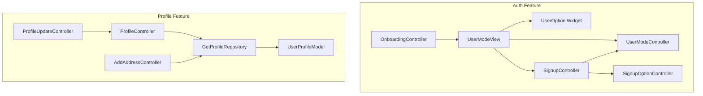
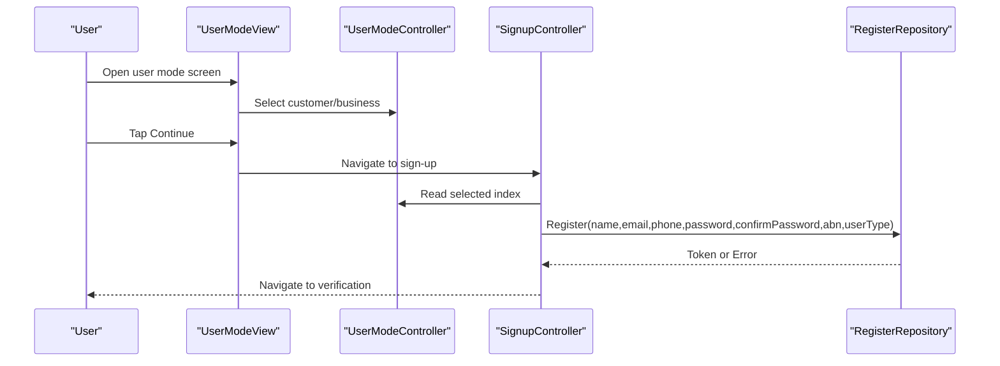
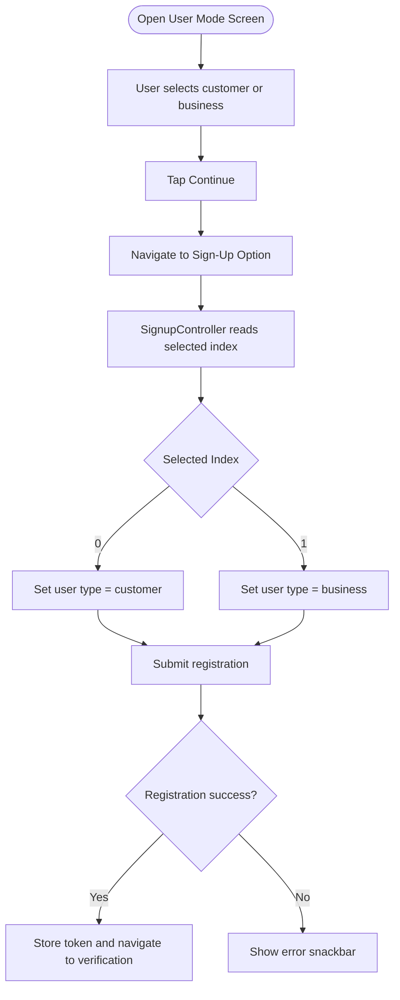
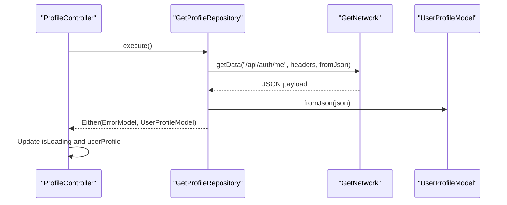
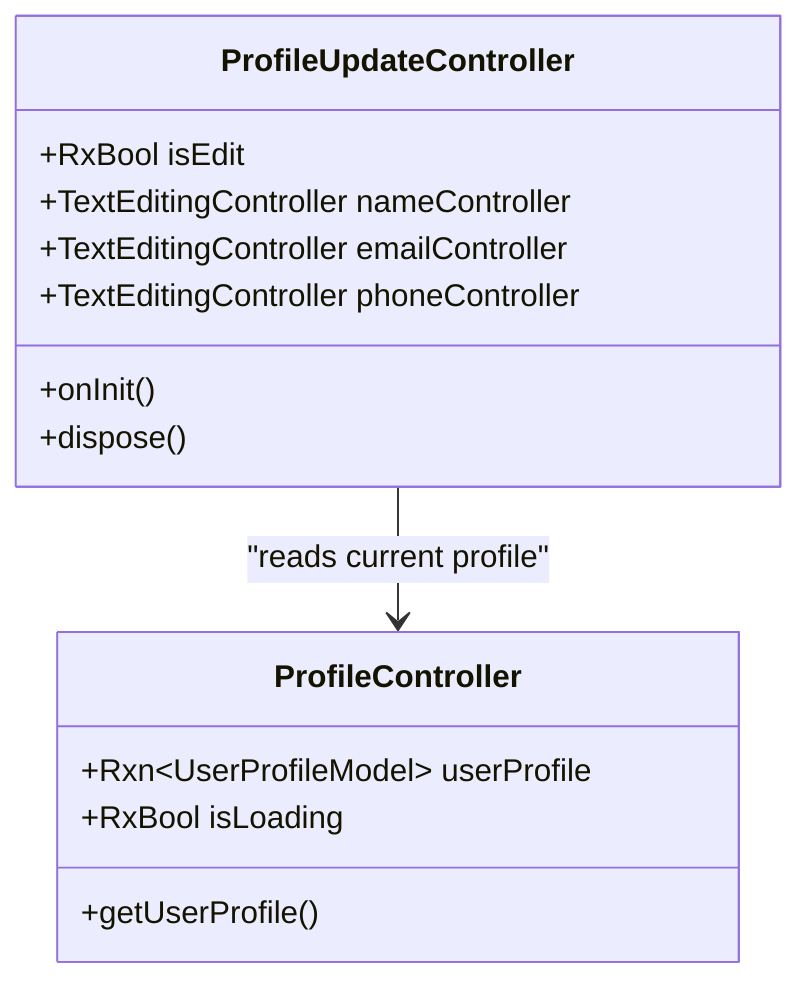
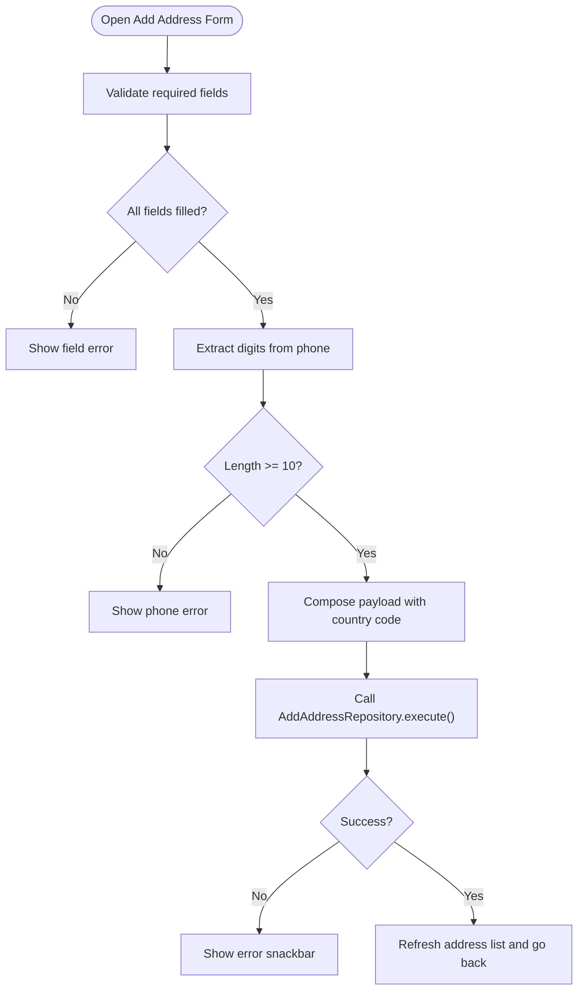
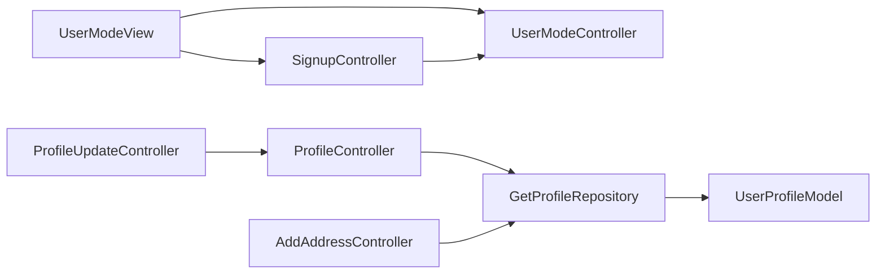

# User Modes and Profiles

<cite>
**Referenced Files in This Document**
- [user_mode_controller.dart](file://lib/features/auth/controller/user_mode_controller.dart)
- [user_mode_view.dart](file://lib/features/auth/views/user_mode_view.dart)
- [user_option.dart](file://lib/features/auth/widgets/user_option.dart)
- [signup_controller.dart](file://lib/features/auth/controller/signup_controller.dart)
- [onboarding_controller.dart](file://lib/features/auth/controller/onboarding_controller.dart)
- [profile_controller.dart](file://lib/features/profile/controllers/profile_controller.dart)
- [get_profile_repo.dart](file://lib/features/profile/repositories/get_profile_repo.dart)
- [user_profile_model.dart](file://lib/core/data/global_models/user_profile_model.dart)
- [profile_update_controller.dart](file://lib/features/profile/controllers/profile_update_controller.dart)
- [add_address_controller.dart](file://lib/features/profile/controllers/add_address_controller.dart)
</cite>

## Table of Contents
1. [Introduction](#introduction)
2. [Project Structure](#project-structure)
3. [Core Components](#core-components)
4. [Architecture Overview](#architecture-overview)
5. [Detailed Component Analysis](#detailed-component-analysis)
6. [Dependency Analysis](#dependency-analysis)
7. [Performance Considerations](#performance-considerations)
8. [Troubleshooting Guide](#troubleshooting-guide)
9. [Conclusion](#conclusion)

## Introduction
This document explains the user modes and profile management system, focusing on how users select their account type (customer or business), how registration integrates with user modes, and how profiles are fetched and updated. It also documents address management capabilities and outlines validation and onboarding flows to optimize user completion and permissions alignment.

## Project Structure
The user modes and profiles system spans the Authentication and Profile features:
- Authentication: user mode selection, onboarding, and registration
- Profile: fetching user profile, updating profile data, and managing addresses

**Diagram sources**
- [user_mode_view.dart:14-76](file://lib/features/auth/views/user_mode_view.dart#L14-L76)
- [user_mode_controller.dart:4-18](file://lib/features/auth/controller/user_mode_controller.dart#L4-L18)
- [user_option.dart:9-82](file://lib/features/auth/widgets/user_option.dart#L9-L82)
- [signup_controller.dart:10-66](file://lib/features/auth/controller/signup_controller.dart#L10-L66)
- [onboarding_controller.dart:7-123](file://lib/features/auth/controller/onboarding_controller.dart#L7-L123)
- [profile_controller.dart:6-31](file://lib/features/profile/controllers/profile_controller.dart#L6-L31)
- [get_profile_repo.dart:7-19](file://lib/features/profile/repositories/get_profile_repo.dart#L7-L19)
- [user_profile_model.dart:1-71](file://lib/core/data/global_models/user_profile_model.dart#L1-L71)
- [profile_update_controller.dart:5-27](file://lib/features/profile/controllers/profile_update_controller.dart#L5-L27)
- [add_address_controller.dart:7-111](file://lib/features/profile/controllers/add_address_controller.dart#L7-L111)

**Section sources**
- [user_mode_view.dart:14-76](file://lib/features/auth/views/user_mode_view.dart#L14-L76)
- [user_mode_controller.dart:4-18](file://lib/features/auth/controller/user_mode_controller.dart#L4-L18)
- [user_option.dart:9-82](file://lib/features/auth/widgets/user_option.dart#L9-L82)
- [signup_controller.dart:10-66](file://lib/features/auth/controller/signup_controller.dart#L10-L66)
- [onboarding_controller.dart:7-123](file://lib/features/auth/controller/onboarding_controller.dart#L7-L123)
- [profile_controller.dart:6-31](file://lib/features/profile/controllers/profile_controller.dart#L6-L31)
- [get_profile_repo.dart:7-19](file://lib/features/profile/repositories/get_profile_repo.dart#L7-L19)
- [user_profile_model.dart:1-71](file://lib/core/data/global_models/user_profile_model.dart#L1-L71)
- [profile_update_controller.dart:5-27](file://lib/features/profile/controllers/profile_update_controller.dart#L5-L27)
- [add_address_controller.dart:7-111](file://lib/features/profile/controllers/add_address_controller.dart#L7-L111)

## Core Components
- UserModeController: Manages user mode selection (customer/business) and displays selectable options.
- UserModeView and UserOption: UI for selecting user mode and navigating to registration options.
- SignupController: Integrates user mode selection into registration and persists tokens.
- ProfileController: Fetches current user profile via repository and exposes loading and error handling.
- GetProfileRepository: Encapsulates network call to fetch profile data.
- UserProfileModel: Defines profile data structure returned by the backend.
- ProfileUpdateController: Prepares editable fields from the current profile.
- AddAddressController: Handles address creation with validation and persistence.

**Section sources**
- [user_mode_controller.dart:4-18](file://lib/features/auth/controller/user_mode_controller.dart#L4-L18)
- [user_mode_view.dart:14-76](file://lib/features/auth/views/user_mode_view.dart#L14-L76)
- [user_option.dart:9-82](file://lib/features/auth/widgets/user_option.dart#L9-L82)
- [signup_controller.dart:10-66](file://lib/features/auth/controller/signup_controller.dart#L10-L66)
- [profile_controller.dart:6-31](file://lib/features/profile/controllers/profile_controller.dart#L6-L31)
- [get_profile_repo.dart:7-19](file://lib/features/profile/repositories/get_profile_repo.dart#L7-L19)
- [user_profile_model.dart:1-71](file://lib/core/data/global_models/user_profile_model.dart#L1-L71)
- [profile_update_controller.dart:5-27](file://lib/features/profile/controllers/profile_update_controller.dart#L5-L27)
- [add_address_controller.dart:7-111](file://lib/features/profile/controllers/add_address_controller.dart#L7-L111)

## Architecture Overview
The system follows a layered pattern:
- UI Views depend on GetX controllers for state and navigation.
- Controllers orchestrate repositories and models.
- Repositories encapsulate network calls and error modeling.
- Models define data contracts for profile and related entities.

**Diagram sources**
- [user_mode_view.dart:41-47](file://lib/features/auth/views/user_mode_view.dart#L41-L47)
- [user_mode_controller.dart:5-17](file://lib/features/auth/controller/user_mode_controller.dart#L5-L17)
- [signup_controller.dart:35-37](file://lib/features/auth/controller/signup_controller.dart#L35-L37)

## Detailed Component Analysis

### User Mode Selection and Registration Integration
- UserModeController holds selectable items and the currently selected index.
- UserModeView renders the selection UI and routes to sign-up regardless of selection.
- UserOption binds radio selection to the controller’s index.
- SignupController reads the selected index to set user type ("customer" or "business") and submits registration.

**Diagram sources**
- [user_mode_view.dart:41-47](file://lib/features/auth/views/user_mode_view.dart#L41-L47)
- [user_mode_controller.dart:5-17](file://lib/features/auth/controller/user_mode_controller.dart#L5-L17)
- [signup_controller.dart:35-37](file://lib/features/auth/controller/signup_controller.dart#L35-L37)

**Section sources**
- [user_mode_controller.dart:4-18](file://lib/features/auth/controller/user_mode_controller.dart#L4-L18)
- [user_mode_view.dart:14-76](file://lib/features/auth/views/user_mode_view.dart#L14-L76)
- [user_option.dart:9-82](file://lib/features/auth/widgets/user_option.dart#L9-L82)
- [signup_controller.dart:10-66](file://lib/features/auth/controller/signup_controller.dart#L10-L66)

### Profile Fetching and Data Model
- ProfileController initializes by fetching the profile via GetProfileRepository.
- GetProfileRepository performs a GET call to the authenticated endpoint and parses JSON into UserProfileModel.
- UserProfileModel defines top-level data and nested Data fields for user identity and metadata.

**Diagram sources**
- [profile_controller.dart:13-24](file://lib/features/profile/controllers/profile_controller.dart#L13-L24)
- [get_profile_repo.dart:11-18](file://lib/features/profile/repositories/get_profile_repo.dart#L11-L18)
- [user_profile_model.dart:6-16](file://lib/core/data/global_models/user_profile_model.dart#L6-L16)

**Section sources**
- [profile_controller.dart:6-31](file://lib/features/profile/controllers/profile_controller.dart#L6-L31)
- [get_profile_repo.dart:7-19](file://lib/features/profile/repositories/get_profile_repo.dart#L7-L19)
- [user_profile_model.dart:1-71](file://lib/core/data/global_models/user_profile_model.dart#L1-L71)

### Profile Update Workflow
- ProfileUpdateController initializes text controllers with current profile data.
- It supports toggling edit mode and disposes controllers on teardown.
- Typical update flows would leverage this controller to prefill forms and trigger updates through repository patterns.

**Diagram sources**
- [profile_update_controller.dart:5-27](file://lib/features/profile/controllers/profile_update_controller.dart#L5-L27)
- [profile_controller.dart:10-11](file://lib/features/profile/controllers/profile_controller.dart#L10-L11)

**Section sources**
- [profile_update_controller.dart:5-27](file://lib/features/profile/controllers/profile_update_controller.dart#L5-L27)
- [profile_controller.dart:6-31](file://lib/features/profile/controllers/profile_controller.dart#L6-L31)

### Address Management and Validation
- AddAddressController groups input fields into a map of controllers for maintainability.
- It validates required fields and enforces phone digit length after stripping non-digits.
- It composes a complete phone number using a stored country code and sends the payload to the repository.
- On success, it refreshes the address list and navigates back.

**Diagram sources**
- [add_address_controller.dart:46-71](file://lib/features/profile/controllers/add_address_controller.dart#L46-L71)
- [add_address_controller.dart:84-110](file://lib/features/profile/controllers/add_address_controller.dart#L84-L110)

**Section sources**
- [add_address_controller.dart:7-111](file://lib/features/profile/controllers/add_address_controller.dart#L7-L111)

### Onboarding and User Mode Switching
- OnboardingController manages animated onboarding slides and theme-aware visuals.
- While it does not directly control user mode selection, it provides the initial user journey before reaching the user mode screen.

**Section sources**
- [onboarding_controller.dart:7-123](file://lib/features/auth/controller/onboarding_controller.dart#L7-L123)
- [user_mode_view.dart:14-76](file://lib/features/auth/views/user_mode_view.dart#L14-L76)

## Dependency Analysis
- UI depends on GetX controllers for reactive state and navigation.
- Controllers depend on repositories for data operations.
- Repositories depend on network utilities and model parsers.
- Models are decoupled from UI and controllers, enabling reuse across features.

**Diagram sources**
- [user_mode_view.dart:14-76](file://lib/features/auth/views/user_mode_view.dart#L14-L76)
- [user_mode_controller.dart:4-18](file://lib/features/auth/controller/user_mode_controller.dart#L4-L18)
- [signup_controller.dart:10-66](file://lib/features/auth/controller/signup_controller.dart#L10-L66)
- [profile_controller.dart:6-31](file://lib/features/profile/controllers/profile_controller.dart#L6-L31)
- [get_profile_repo.dart:7-19](file://lib/features/profile/repositories/get_profile_repo.dart#L7-L19)
- [user_profile_model.dart:1-71](file://lib/core/data/global_models/user_profile_model.dart#L1-L71)
- [profile_update_controller.dart:5-27](file://lib/features/profile/controllers/profile_update_controller.dart#L5-L27)
- [add_address_controller.dart:7-111](file://lib/features/profile/controllers/add_address_controller.dart#L7-L111)

**Section sources**
- [user_mode_view.dart:14-76](file://lib/features/auth/views/user_mode_view.dart#L14-L76)
- [signup_controller.dart:10-66](file://lib/features/auth/controller/signup_controller.dart#L10-L66)
- [profile_controller.dart:6-31](file://lib/features/profile/controllers/profile_controller.dart#L6-L31)
- [get_profile_repo.dart:7-19](file://lib/features/profile/repositories/get_profile_repo.dart#L7-L19)
- [user_profile_model.dart:1-71](file://lib/core/data/global_models/user_profile_model.dart#L1-L71)
- [profile_update_controller.dart:5-27](file://lib/features/profile/controllers/profile_update_controller.dart#L5-L27)
- [add_address_controller.dart:7-111](file://lib/features/profile/controllers/add_address_controller.dart#L7-L111)

## Performance Considerations
- Reactive state: Using GetX improves UI responsiveness and reduces unnecessary rebuilds.
- Network caching: Consider caching profile data locally to avoid repeated network calls on re-entry.
- Validation short-circuit: Early validation in address creation prevents redundant API calls.
- Dispose controllers: Properly disposing controllers and text editing controllers avoids memory leaks.

## Troubleshooting Guide
- Registration fails with user type: Verify that the selected index maps to the intended user type in the registration call.
- Profile not loading: Confirm the authenticated endpoint returns expected JSON and that the model parser handles optional fields.
- Address submission errors: Ensure required fields are present and phone number meets minimum digit length after normalization.
- Navigation issues: Confirm route names and controller initialization order to prevent null references.

**Section sources**
- [signup_controller.dart:35-37](file://lib/features/auth/controller/signup_controller.dart#L35-L37)
- [get_profile_repo.dart:11-18](file://lib/features/profile/repositories/get_profile_repo.dart#L11-L18)
- [add_address_controller.dart:46-71](file://lib/features/profile/controllers/add_address_controller.dart#L46-L71)

## Conclusion
The user modes and profiles system integrates user mode selection into registration, fetches and exposes profile data, and provides robust address management with validation. By leveraging GetX for state and repositories for networking, the system remains modular and maintainable. Optimizing profile caching and refining validation feedback can further improve onboarding and user experience.