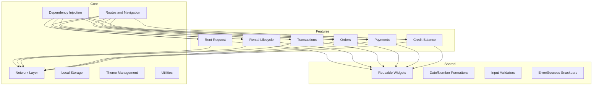
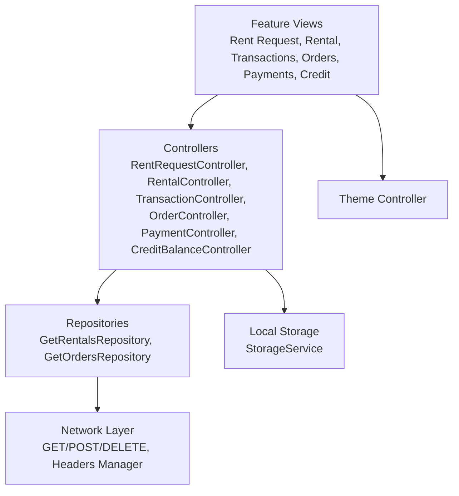
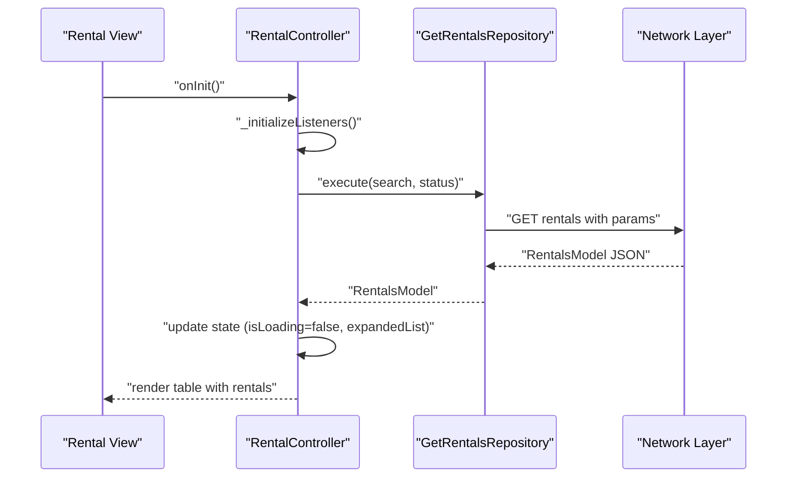
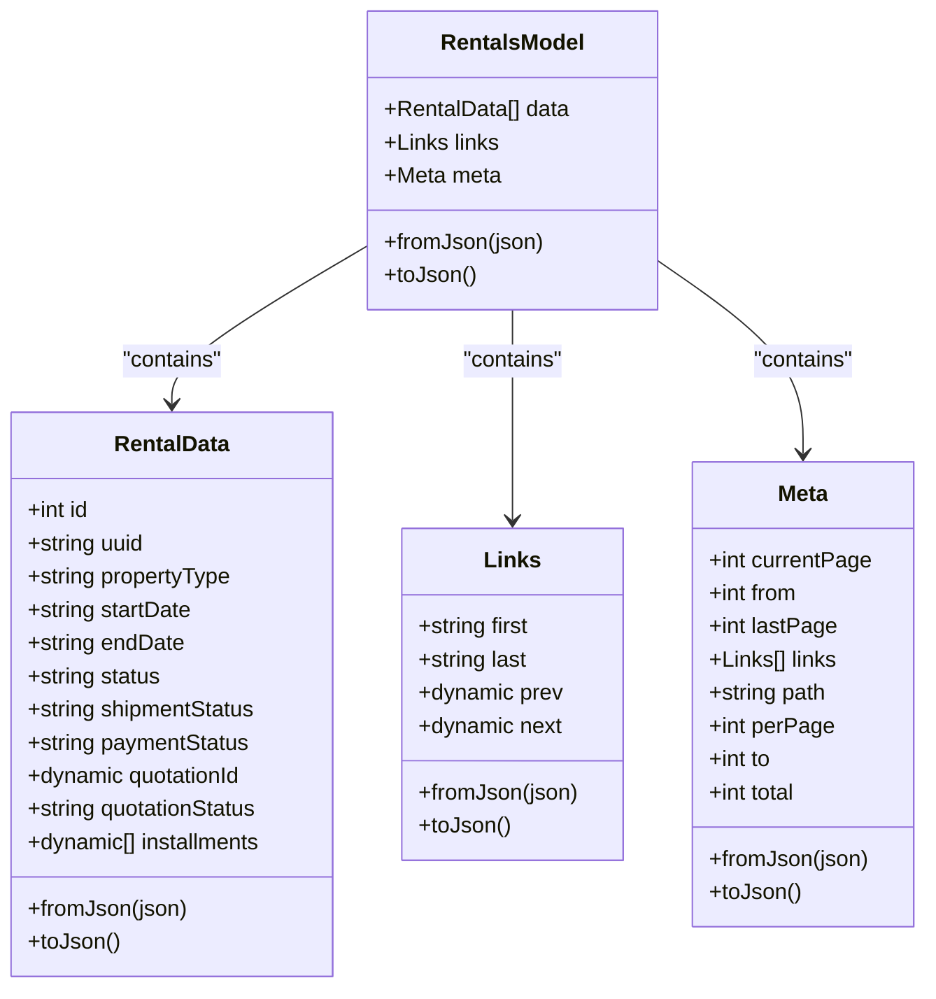
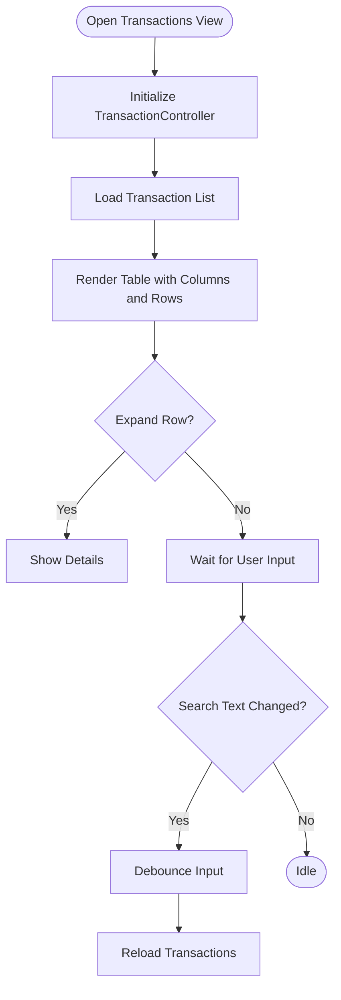
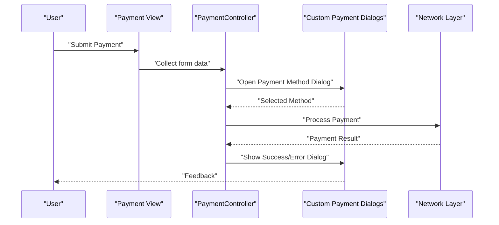
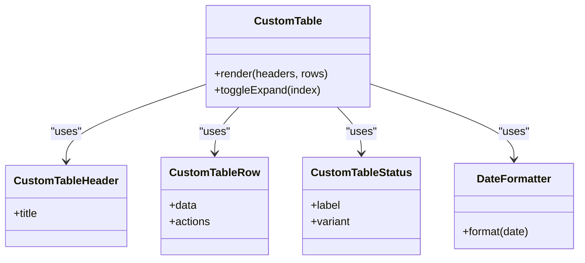
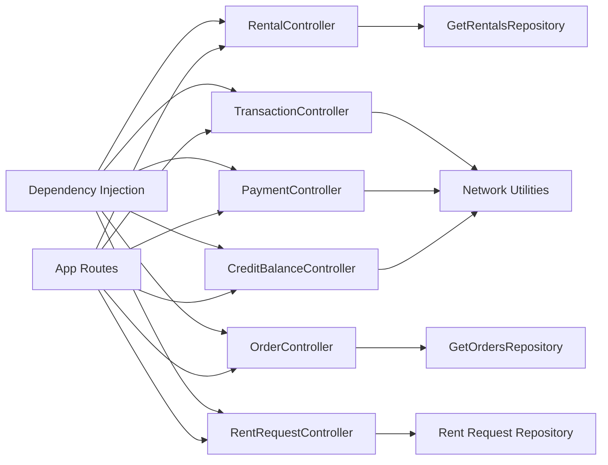

# Business Operations

<cite>
**Referenced Files in This Document**
- [README.md](file://README.md)
- [pubspec.yaml](file://pubspec.yaml)
- [main.dart](file://lib/main.dart)
- [app_routes.dart](file://lib/core/routes/app_routes.dart)
- [routes.dart](file://lib/core/routes/routes.dart)
- [dependency_injection.dart](file://lib/core/di/dependency_injection.dart)
- [headers_manager.dart](file://lib/core/data/networks/headers_manager.dart)
- [get_network.dart](file://lib/core/data/networks/get_network.dart)
- [post_with_response.dart](file://lib/core/data/networks/post_with_response.dart)
- [delete_network.dart](file://lib/core/data/networks/delete_network.dart)
- [storage_service.dart](file://lib/core/data/local/storage_service.dart)
- [theme_controller.dart](file://lib/core/theme/theme_controller.dart)
- [date_formatter.dart](file://lib/shared/extensions/formatters/date_formatter.dart)
- [custom_payment_dialog.dart](file://lib/shared/widgets/custom_dialog/custom_payment_dialog.dart)
- [custom_payment_dialog_method.dart](file://lib/shared/widgets/custom_dialog/custom_payment_dialog_method.dart)
- [custom_payment_success_dialog.dart](file://lib/shared/widgets/custom_dialog/custom_payment_success_dialog.dart)
- [custom_table.dart](file://lib/shared/widgets/custom_table/custom_table.dart)
- [custom_table_header.dart](file://lib/shared/widgets/custom_table/custom_table_header.dart)
- [custom_table_row.dart](file://lib/shared/widgets/custom_table/custom_table_row.dart)
- [custom_table_status.dart](file://lib/shared/widgets/custom_table/custom_table_status.dart)
- [snackbar_error.dart](file://lib/shared/widgets/snackbars/error_snackbar.dart)
- [snackbar_success.dart](file://lib/shared/widgets/snackbars/success_snackbar.dart)
- [rent_request_controller.dart](file://lib/features/rent_request/controller/rent_request_controller.dart)
- [rental_controller.dart](file://lib/features/rental/controllers/rental_controller.dart)
- [rental_bindings.dart](file://lib/features/rental/bindings/rental_bindings.dart)
- [rentals_model.dart](file://lib/features/rental/models/rentals_model.dart)
- [get_rentals_repo.dart](file://lib/features/rental/repositories/get_rentals_repo.dart)
- [credit_balance_controller.dart](file://lib/features/credit_balance/controller/credit_balance_controller.dart)
- [credit_balance_bindings.dart](file://lib/features/credit_balance/bindings/credit_balance_bindings.dart)
- [transaction_controller.dart](file://lib/features/transaction/controller/transaction_controller.dart)
- [transaction_model.dart](file://lib/features/transaction/models/transaction_model.dart)
- [order_controller.dart](file://lib/features/order/controllers/order_controller.dart)
- [orders_model.dart](file://lib/features/order/models/orders_model.dart)
- [get_orders_repo.dart](file://lib/features/order/repositories/get_orders_repo.dart)
- [payment_controller.dart](file://lib/features/payment/controller/payment_controller.dart)
</cite>

## Table of Contents
1. [Introduction](#introduction)
2. [Project Structure](#project-structure)
3. [Core Components](#core-components)
4. [Architecture Overview](#architecture-overview)
5. [Detailed Component Analysis](#detailed-component-analysis)
6. [Dependency Analysis](#dependency-analysis)
7. [Performance Considerations](#performance-considerations)
8. [Troubleshooting Guide](#troubleshooting-guide)
9. [Conclusion](#conclusion)
10. [Appendices](#appendices)

## Introduction
This document describes the business operations for ZB-DEZINE’s commercial functionality with a focus on:
- Furniture rental system: request management, rental lifecycle, and inventory tracking
- Transaction management: credit balance tracking and financial transaction history
- Controllers, request processing, and payment workflows
- Business analytics, reporting capabilities, and operational metrics
- Integration patterns with accounting systems, payment processors, and inventory management
- Examples of rental workflows, transaction processing, and financial reporting
- Business rule enforcement, audit trails, and compliance considerations

The application follows a modular feature-based architecture with reactive controllers, dependency injection, and reusable UI components. It leverages network utilities for backend communication and local storage for persistence.

## Project Structure
The project is organized into core infrastructure, feature modules, and shared components:
- Core: routing, DI, networking, themes, and utilities
- Features: business domains such as rental requests, rentals, transactions, orders, payments, and credit balance
- Shared: reusable widgets, formatters, validators, and snackbars

**Diagram sources**
- [app_routes.dart](file://lib/core/routes/app_routes.dart)
- [routes.dart](file://lib/core/routes/routes.dart)
- [dependency_injection.dart](file://lib/core/di/dependency_injection.dart)
- [get_network.dart](file://lib/core/data/networks/get_network.dart)
- [post_with_response.dart](file://lib/core/data/networks/post_with_response.dart)
- [storage_service.dart](file://lib/core/data/local/storage_service.dart)
- [theme_controller.dart](file://lib/core/theme/theme_controller.dart)
- [custom_table.dart](file://lib/shared/widgets/custom_table/custom_table.dart)
- [date_formatter.dart](file://lib/shared/extensions/formatters/date_formatter.dart)
- [snackbar_error.dart](file://lib/shared/widgets/snackbars/error_snackbar.dart)

**Section sources**
- [README.md:1-17](file://README.md#L1-L17)
- [pubspec.yaml:1-112](file://pubspec.yaml#L1-L112)
- [main.dart](file://lib/main.dart)

## Core Components
- Routing and navigation: centralized route definitions and navigation helpers
- Dependency injection: lazy binding of repositories and controllers
- Network layer: standardized GET/POST/DELETE utilities and header management
- Local storage: persistent storage service for tokens and preferences
- Theme management: reactive theme controller
- Utilities: date formatting and image pickers
- Shared widgets: tables, dialogs, pagination, and snackbars

These components underpin business features by providing consistent data access, UI behavior, and state management.

**Section sources**
- [app_routes.dart](file://lib/core/routes/app_routes.dart)
- [routes.dart](file://lib/core/routes/routes.dart)
- [dependency_injection.dart](file://lib/core/di/dependency_injection.dart)
- [headers_manager.dart](file://lib/core/data/networks/headers_manager.dart)
- [get_network.dart](file://lib/core/data/networks/get_network.dart)
- [post_with_response.dart](file://lib/core/data/networks/post_with_response.dart)
- [delete_network.dart](file://lib/core/data/networks/delete_network.dart)
- [storage_service.dart](file://lib/core/data/local/storage_service.dart)
- [theme_controller.dart](file://lib/core/theme/theme_controller.dart)
- [date_formatter.dart](file://lib/shared/extensions/formatters/date_formatter.dart)
- [custom_table.dart](file://lib/shared/widgets/custom_table/custom_table.dart)
- [snackbar_error.dart](file://lib/shared/widgets/snackbars/error_snackbar.dart)

## Architecture Overview
The system follows a layered architecture:
- Presentation: Feature controllers and views
- Domain: Reactive controllers managing state and UI logic
- Data: Repositories encapsulating network calls
- Infrastructure: Network utilities, DI, storage, and theme

**Diagram sources**
- [rent_request_controller.dart](file://lib/features/rent_request/controller/rent_request_controller.dart)
- [rental_controller.dart](file://lib/features/rental/controllers/rental_controller.dart)
- [transaction_controller.dart](file://lib/features/transaction/controller/transaction_controller.dart)
- [order_controller.dart](file://lib/features/order/controllers/order_controller.dart)
- [payment_controller.dart](file://lib/features/payment/controller/payment_controller.dart)
- [credit_balance_controller.dart](file://lib/features/credit_balance/controller/credit_balance_controller.dart)
- [get_rentals_repo.dart](file://lib/features/rental/repositories/get_rentals_repo.dart)
- [get_orders_repo.dart](file://lib/features/order/repositories/get_orders_repo.dart)
- [get_network.dart](file://lib/core/data/networks/get_network.dart)
- [post_with_response.dart](file://lib/core/data/networks/post_with_response.dart)
- [headers_manager.dart](file://lib/core/data/networks/headers_manager.dart)
- [storage_service.dart](file://lib/core/data/local/storage_service.dart)
- [theme_controller.dart](file://lib/core/theme/theme_controller.dart)

## Detailed Component Analysis

### Furniture Rental System
The rental system encompasses request management, lifecycle tracking, and reporting.

- Rent Request Controller
  - Manages a multi-step form flow for property type, property details, floor plan, furniture selection, appliances, brand, period, delivery, and review
  - Maintains form keys, scroll controllers, and current index for navigation
  - Disposes of controllers on close

- Rental Controller
  - Fetches paginated rental lists with search and status filtering
  - Debounces search input and updates pagination state
  - Initializes expanded rows for table detail views
  - Uses a repository pattern to call network endpoints
  - Displays error snackbar on failures

- Rental Model
  - Deserializes rental data, pagination metadata, and links
  - Includes rental item fields such as UUID, property type, dates, status, shipment/payment status, quotation info, and installments

- Rental Bindings
  - Registers repository and controller via dependency injection

**Diagram sources**
- [rental_controller.dart](file://lib/features/rental/controllers/rental_controller.dart)
- [get_rentals_repo.dart](file://lib/features/rental/repositories/get_rentals_repo.dart)
- [get_network.dart](file://lib/core/data/networks/get_network.dart)

**Diagram sources**
- [rentals_model.dart](file://lib/features/rental/models/rentals_model.dart)

**Section sources**
- [rent_request_controller.dart:14-46](file://lib/features/rent_request/controller/rent_request_controller.dart#L14-L46)
- [rental_controller.dart:1-95](file://lib/features/rental/controllers/rental_controller.dart#L1-L95)
- [rental_bindings.dart:1-12](file://lib/features/rental/bindings/rental_bindings.dart#L1-L12)
- [rentals_model.dart:1-171](file://lib/features/rental/models/rentals_model.dart#L1-L171)

### Transaction Management and Credit Balance
- Transaction Controller
  - Manages a static list of transactions for display in a table
  - Tracks pagination, search, and expandable rows
  - Initializes expanded list based on transaction count

- Transaction Model
  - Immutable model representing a single transaction record

- Credit Balance Controller
  - Manages selected card and card list for credit-related operations
  - Provides reactive state for UI binding

- Credit Balance Bindings
  - Registers the controller via dependency injection

**Diagram sources**
- [transaction_controller.dart:1-66](file://lib/features/transaction/controller/transaction_controller.dart#L1-L66)
- [transaction_model.dart:1-18](file://lib/features/transaction/models/transaction_model.dart#L1-L18)

**Section sources**
- [transaction_controller.dart:1-66](file://lib/features/transaction/controller/transaction_controller.dart#L1-L66)
- [transaction_model.dart:1-18](file://lib/features/transaction/models/transaction_model.dart#L1-L18)
- [credit_balance_controller.dart:1-8](file://lib/features/credit_balance/controller/credit_balance_controller.dart#L1-L8)
- [credit_balance_bindings.dart:1-10](file://lib/features/credit_balance/bindings/credit_balance_bindings.dart#L1-L10)

### Orders and Payment Workflows
- Order Controller
  - Fetches order data via repository and handles loading and error states
  - Displays error snackbar on failure

- Payment Controller
  - Manages payment form fields for bank account and card details
  - Tracks edit mode and disposes of controllers on close

- Payment Dialogs (Shared)
  - Reusable dialogs for payment methods, payment success, and rejection
  - Integrated into feature views for checkout flows

**Diagram sources**
- [payment_controller.dart:1-23](file://lib/features/payment/controller/payment_controller.dart#L1-L23)
- [custom_payment_dialog.dart](file://lib/shared/widgets/custom_dialog/custom_payment_dialog.dart)
- [custom_payment_dialog_method.dart](file://lib/shared/widgets/custom_dialog/custom_payment_dialog_method.dart)
- [custom_payment_success_dialog.dart](file://lib/shared/widgets/custom_dialog/custom_payment_success_dialog.dart)
- [get_network.dart](file://lib/core/data/networks/get_network.dart)

**Section sources**
- [order_controller.dart:1-41](file://lib/features/order/controllers/order_controller.dart#L1-L41)
- [orders_model.dart](file://lib/features/order/models/orders_model.dart)
- [get_orders_repo.dart](file://lib/features/order/repositories/get_orders_repo.dart)
- [payment_controller.dart:1-23](file://lib/features/payment/controller/payment_controller.dart#L1-L23)
- [custom_payment_dialog.dart](file://lib/shared/widgets/custom_dialog/custom_payment_dialog.dart)
- [custom_payment_dialog_method.dart](file://lib/shared/widgets/custom_dialog/custom_payment_dialog_method.dart)
- [custom_payment_success_dialog.dart](file://lib/shared/widgets/custom_dialog/custom_payment_success_dialog.dart)

### Reporting and Operational Metrics
- Custom Table Widgets
  - Reusable table components for rendering lists with headers, rows, and status indicators
  - Support pagination and expandable rows for detailed views

- Date Formatting
  - Centralized date formatter for consistent display across features

- Snackbars
  - Error and success snackbars for user feedback on operations

**Diagram sources**
- [custom_table.dart](file://lib/shared/widgets/custom_table/custom_table.dart)
- [custom_table_header.dart](file://lib/shared/widgets/custom_table/custom_table_header.dart)
- [custom_table_row.dart](file://lib/shared/widgets/custom_table/custom_table_row.dart)
- [custom_table_status.dart](file://lib/shared/widgets/custom_table/custom_table_status.dart)
- [date_formatter.dart](file://lib/shared/extensions/formatters/date_formatter.dart)

**Section sources**
- [custom_table.dart](file://lib/shared/widgets/custom_table/custom_table.dart)
- [custom_table_header.dart](file://lib/shared/widgets/custom_table/custom_table_header.dart)
- [custom_table_row.dart](file://lib/shared/widgets/custom_table/custom_table_row.dart)
- [custom_table_status.dart](file://lib/shared/widgets/custom_table/custom_table_status.dart)
- [date_formatter.dart](file://lib/shared/extensions/formatters/date_formatter.dart)
- [snackbar_error.dart](file://lib/shared/widgets/snackbars/error_snackbar.dart)
- [snackbar_success.dart](file://lib/shared/widgets/snackbars/success_snackbar.dart)

## Dependency Analysis
- Feature controllers depend on repositories for data access
- Repositories depend on network utilities for HTTP operations
- Controllers rely on shared widgets and snackbars for UI feedback
- Dependency injection registers repositories and controllers lazily
- Routes connect views to controllers and bind them to navigation

**Diagram sources**
- [rental_controller.dart](file://lib/features/rental/controllers/rental_controller.dart)
- [get_rentals_repo.dart](file://lib/features/rental/repositories/get_rentals_repo.dart)
- [transaction_controller.dart](file://lib/features/transaction/controller/transaction_controller.dart)
- [order_controller.dart](file://lib/features/order/controllers/order_controller.dart)
- [get_orders_repo.dart](file://lib/features/order/repositories/get_orders_repo.dart)
- [payment_controller.dart](file://lib/features/payment/controller/payment_controller.dart)
- [credit_balance_controller.dart](file://lib/features/credit_balance/controller/credit_balance_controller.dart)
- [rental_bindings.dart](file://lib/features/rental/bindings/rental_bindings.dart)
- [credit_balance_bindings.dart](file://lib/features/credit_balance/bindings/credit_balance_bindings.dart)
- [app_routes.dart](file://lib/core/routes/app_routes.dart)
- [dependency_injection.dart](file://lib/core/di/dependency_injection.dart)

**Section sources**
- [rental_controller.dart:1-95](file://lib/features/rental/controllers/rental_controller.dart#L1-L95)
- [transaction_controller.dart:1-66](file://lib/features/transaction/controller/transaction_controller.dart#L1-L66)
- [order_controller.dart:1-41](file://lib/features/order/controllers/order_controller.dart#L1-L41)
- [payment_controller.dart:1-23](file://lib/features/payment/controller/payment_controller.dart#L1-L23)
- [credit_balance_controller.dart:1-8](file://lib/features/credit_balance/controller/credit_balance_controller.dart#L1-L8)
- [rental_bindings.dart:1-12](file://lib/features/rental/bindings/rental_bindings.dart#L1-L12)
- [credit_balance_bindings.dart:1-10](file://lib/features/credit_balance/bindings/credit_balance_bindings.dart#L1-L10)
- [app_routes.dart](file://lib/core/routes/app_routes.dart)
- [dependency_injection.dart](file://lib/core/di/dependency_injection.dart)

## Performance Considerations
- Debounced search: Rental controller debounces search input to reduce network calls during typing
- Pagination: Rental and transaction lists support pagination to limit payload sizes
- Reactive state: Controllers use reactive variables to minimize unnecessary rebuilds
- Lazy loading: Dependency injection registers repositories and controllers lazily to optimize startup
- Local storage: Persistent caching of tokens and preferences reduces repeated authentication overhead

[No sources needed since this section provides general guidance]

## Troubleshooting Guide
- Error handling: Controllers use error snackbars to surface backend errors to users
- Network failures: Ensure headers manager sets required authentication and content-type headers
- State cleanup: Controllers dispose of text editing controllers to prevent memory leaks
- UI feedback: Use success and error snackbars consistently after operations

**Section sources**
- [rental_controller.dart:68-80](file://lib/features/rental/controllers/rental_controller.dart#L68-L80)
- [order_controller.dart:19-26](file://lib/features/order/controllers/order_controller.dart#L19-L26)
- [headers_manager.dart](file://lib/core/data/networks/headers_manager.dart)
- [snackbar_error.dart](file://lib/shared/widgets/snackbars/error_snackbar.dart)
- [snackbar_success.dart](file://lib/shared/widgets/snackbars/success_snackbar.dart)

## Conclusion
ZB-DEZINE’s business operations are structured around modular features with clear separation of concerns. The rental system supports multi-step request flows and lifecycle tracking with robust pagination and search. Transaction and credit management provide visibility into financial activity, while payment workflows integrate reusable dialogs for a smooth checkout experience. The architecture emphasizes dependency injection, reactive controllers, and shared UI components to ensure maintainability and scalability.

[No sources needed since this section summarizes without analyzing specific files]

## Appendices

### Example Workflows

- Rental Request Workflow
  - Step 1: Enter contact and business details
  - Step 2: Select property type and details
  - Step 3: Upload floor plan
  - Step 4: Choose furniture and appliances
  - Step 5: Select brand and rental period
  - Step 6: Confirm delivery details
  - Step 7: Review and submit

- Transaction Processing Workflow
  - Load transaction list
  - Filter by status or search term
  - Expand row to view details
  - Export or report on filtered results

- Payment Workflow
  - Open payment dialog
  - Select payment method
  - Submit payment
  - Show success or error dialog

[No sources needed since this section provides conceptual examples]

### Compliance and Audit Considerations
- Maintain audit trails by logging all state transitions and actions in controllers
- Enforce business rules at the controller level (e.g., required fields, date ranges)
- Secure sensitive data using local storage and secure headers
- Provide granular reporting for compliance by exposing filters and export capabilities

[No sources needed since this section provides general guidance]