# Credit Balance System

<cite>
**Referenced Files in This Document**
- [credit_balance_controller.dart](file://lib/features/credit_balance/controller/credit_balance_controller.dart)
- [credit_balance_bindings.dart](file://lib/features/credit_balance/bindings/credit_balance_bindings.dart)
- [credit_balance_view.dart](file://lib/features/credit_balance/views/credit_balance_view.dart)
- [credit_balance.dart](file://lib/features/credit_balance/widgets/credit_balance_view_widgets/credit_balance.dart)
- [credit_section.dart](file://lib/features/credit_balance/widgets/credit_balance_view_widgets/credit_section.dart)
- [credit_usage_card.dart](file://lib/features/credit_balance/widgets/credit_balance_view_widgets/credit_usage_card.dart)
- [credit_headar.dart](file://lib/features/credit_balance/widgets/credit_balance_view_widgets/credit_headar.dart)
- [credit_chart.dart](file://lib/features/credit_balance/widgets/credit_balance_view_widgets/credit_chart.dart)
- [credit_transaction_list.dart](file://lib/features/credit_balance/widgets/credit_balance_view_widgets/credit_transaction_list.dart)
- [credit_transaction_item.dart](file://lib/features/credit_balance/widgets/credit_balance_view_widgets/credit_transaction_item.dart)
- [credit_transaction_model.dart](file://lib/features/credit_balance/models/credit_transaction_model.dart)
- [credit_chart_model.dart](file://lib/features/credit_balance/models/credit_chart_model.dart)
</cite>

## Table of Contents
1. [Introduction](#introduction)
2. [Project Structure](#project-structure)
3. [Core Components](#core-components)
4. [Architecture Overview](#architecture-overview)
5. [Detailed Component Analysis](#detailed-component-analysis)
6. [Dependency Analysis](#dependency-analysis)
7. [Performance Considerations](#performance-considerations)
8. [Troubleshooting Guide](#troubleshooting-guide)
9. [Conclusion](#conclusion)

## Introduction
This document describes the credit balance management system implemented in the Flutter application. It focuses on the user-facing credit dashboard, including credit balance display, top-up purchase flow, credit usage visualization, and transaction history. The current implementation emphasizes UI composition and reactive state via GetX, while the underlying credit balance model and persistence mechanisms are represented conceptually through models and widgets.

## Project Structure
The credit balance feature is organized under a feature-based layout with clear separation of concerns:
- Controller: Reactive state management for selection and payment card list.
- Models: Lightweight data structures representing transactions and chart data.
- Views: Top-level screen container and navigation scaffolding.
- Widgets: Reusable UI components composing the credit dashboard, including balance display, purchase section, usage chart, and transaction list.

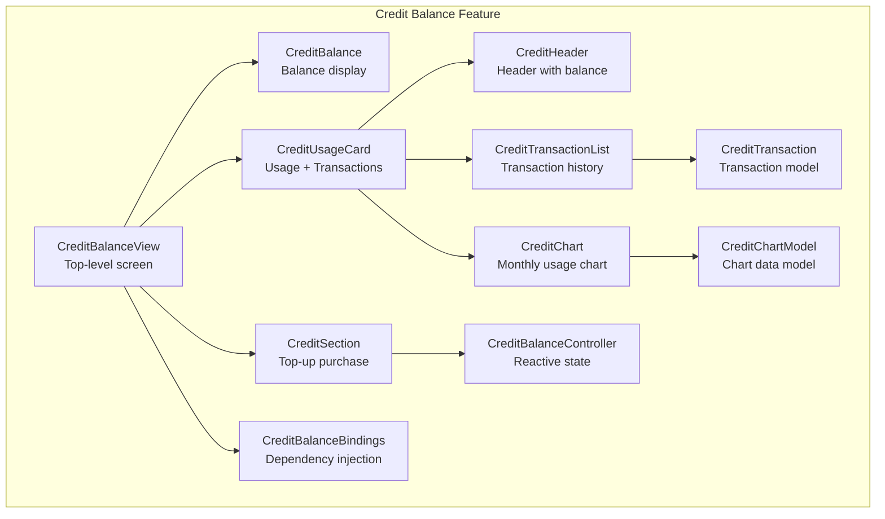

**Diagram sources**
- [credit_balance_view.dart:13-68](file://lib/features/credit_balance/views/credit_balance_view.dart#L13-L68)
- [credit_balance.dart:10-95](file://lib/features/credit_balance/widgets/credit_balance_view_widgets/credit_balance.dart#L10-L95)
- [credit_section.dart:13-110](file://lib/features/credit_balance/widgets/credit_balance_view_widgets/credit_section.dart#L13-L110)
- [credit_usage_card.dart:9-37](file://lib/features/credit_balance/widgets/credit_balance_view_widgets/credit_usage_card.dart#L9-L37)
- [credit_headar.dart:7-37](file://lib/features/credit_balance/widgets/credit_balance_view_widgets/credit_headar.dart#L7-L37)
- [credit_chart.dart:9-126](file://lib/features/credit_balance/widgets/credit_balance_view_widgets/credit_chart.dart#L9-L126)
- [credit_transaction_list.dart:10-121](file://lib/features/credit_balance/widgets/credit_balance_view_widgets/credit_transaction_list.dart#L10-L121)
- [credit_transaction_model.dart:1-11](file://lib/features/credit_balance/models/credit_transaction_model.dart#L1-L11)
- [credit_chart_model.dart:1-6](file://lib/features/credit_balance/models/credit_chart_model.dart#L1-L6)
- [credit_balance_controller.dart:3-7](file://lib/features/credit_balance/controller/credit_balance_controller.dart#L3-L7)
- [credit_balance_bindings.dart:4-8](file://lib/features/credit_balance/bindings/credit_balance_bindings.dart#L4-L8)

**Section sources**
- [credit_balance_view.dart:13-68](file://lib/features/credit_balance/views/credit_balance_view.dart#L13-L68)
- [credit_balance_controller.dart:3-7](file://lib/features/credit_balance/controller/credit_balance_controller.dart#L3-L7)
- [credit_balance_bindings.dart:4-8](file://lib/features/credit_balance/bindings/credit_balance_bindings.dart#L4-L8)

## Core Components
- CreditBalanceController: Manages reactive state for the selected item index and a list of payment cards used during top-up. It extends GetX’s reactive controller pattern to enable UI updates without manual subscriptions.
- CreditTransaction: Immutable model representing a single credit movement with title, date, and amount. Positive amounts indicate credits added; negative amounts indicate deductions.
- CreditChartModel: Immutable model representing monthly usage for visualization.
- CreditBalanceView: Top-level screen integrating app bar, drawer, and the three primary widgets: CreditBalance, CreditSection, and CreditUsageCard.
- Widgets:
  - CreditBalance: Displays current credit balance and a “Purchase Credits” action button.
  - CreditSection: Presents credit packs and opens a payment dialog with card selection.
  - CreditUsageCard: Aggregates header, chart, and transaction list.
  - CreditHeader: Provides title, description, and current balance label.
  - CreditChart: Renders a bar chart of monthly credit usage.
  - CreditTransactionList: Lists recent credit movements with a scrollable interface.
  - CreditTransactionItem: Renders a single transaction row with positive/negative amount formatting.

**Section sources**
- [credit_balance_controller.dart:3-7](file://lib/features/credit_balance/controller/credit_balance_controller.dart#L3-L7)
- [credit_transaction_model.dart:1-11](file://lib/features/credit_balance/models/credit_transaction_model.dart#L1-L11)
- [credit_chart_model.dart:1-6](file://lib/features/credit_balance/models/credit_chart_model.dart#L1-L6)
- [credit_balance_view.dart:13-68](file://lib/features/credit_balance/views/credit_balance_view.dart#L13-L68)
- [credit_balance.dart:10-95](file://lib/features/credit_balance/widgets/credit_balance_view_widgets/credit_balance.dart#L10-L95)
- [credit_section.dart:13-110](file://lib/features/credit_balance/widgets/credit_balance_view_widgets/credit_section.dart#L13-L110)
- [credit_usage_card.dart:9-37](file://lib/features/credit_balance/widgets/credit_balance_view_widgets/credit_usage_card.dart#L9-L37)
- [credit_headar.dart:7-37](file://lib/features/credit_balance/widgets/credit_balance_view_widgets/credit_headar.dart#L7-L37)
- [credit_chart.dart:9-126](file://lib/features/credit_balance/widgets/credit_balance_view_widgets/credit_chart.dart#L9-L126)
- [credit_transaction_list.dart:10-121](file://lib/features/credit_balance/widgets/credit_balance_view_widgets/credit_transaction_list.dart#L10-L121)
- [credit_transaction_item.dart:8-73](file://lib/features/credit_balance/widgets/credit_balance_view_widgets/credit_transaction_item.dart#L8-L73)

## Architecture Overview
The system follows a reactive UI architecture:
- State: Managed by CreditBalanceController using GetX observables.
- UI Composition: CreditBalanceView composes reusable widgets that render static or dynamic content.
- Data Models: CreditTransaction and CreditChartModel encapsulate presentation data.
- Navigation and Interaction: CreditSection triggers a payment dialog and card selection, while CreditBalance exposes a top-up action.

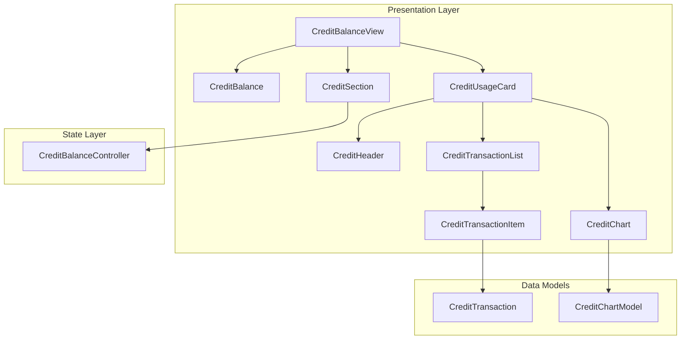

**Diagram sources**
- [credit_balance_view.dart:13-68](file://lib/features/credit_balance/views/credit_balance_view.dart#L13-L68)
- [credit_balance.dart:10-95](file://lib/features/credit_balance/widgets/credit_balance_view_widgets/credit_balance.dart#L10-L95)
- [credit_section.dart:13-110](file://lib/features/credit_balance/widgets/credit_balance_view_widgets/credit_section.dart#L13-L110)
- [credit_usage_card.dart:9-37](file://lib/features/credit_balance/widgets/credit_balance_view_widgets/credit_usage_card.dart#L9-L37)
- [credit_headar.dart:7-37](file://lib/features/credit_balance/widgets/credit_balance_view_widgets/credit_headar.dart#L7-L37)
- [credit_chart.dart:9-126](file://lib/features/credit_balance/widgets/credit_balance_view_widgets/credit_chart.dart#L9-L126)
- [credit_transaction_list.dart:10-121](file://lib/features/credit_balance/widgets/credit_balance_view_widgets/credit_transaction_list.dart#L10-L121)
- [credit_transaction_item.dart:8-73](file://lib/features/credit_balance/widgets/credit_balance_view_widgets/credit_transaction_item.dart#L8-L73)
- [credit_transaction_model.dart:1-11](file://lib/features/credit_balance/models/credit_transaction_model.dart#L1-L11)
- [credit_chart_model.dart:1-6](file://lib/features/credit_balance/models/credit_chart_model.dart#L1-L6)
- [credit_balance_controller.dart:3-7](file://lib/features/credit_balance/controller/credit_balance_controller.dart#L3-L7)

## Detailed Component Analysis

### CreditBalanceController
Responsibilities:
- Maintains the currently selected item index for UI affordances.
- Holds a list of payment cards for top-up selection.
- Tracks the currently selected card reactively for downstream UI updates.

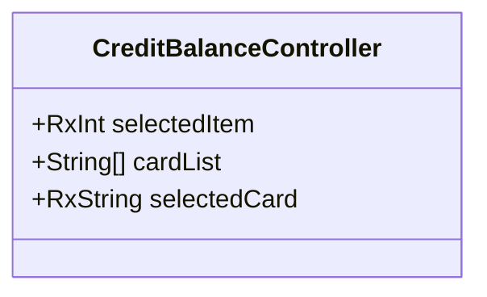

**Diagram sources**
- [credit_balance_controller.dart:3-7](file://lib/features/credit_balance/controller/credit_balance_controller.dart#L3-L7)

**Section sources**
- [credit_balance_controller.dart:3-7](file://lib/features/credit_balance/controller/credit_balance_controller.dart#L3-L7)

### Credit Transaction Model
Responsibilities:
- Encapsulates a single credit movement with immutable fields for title, date, and amount.
- Supports positive amounts for credits added and negative amounts for deductions.

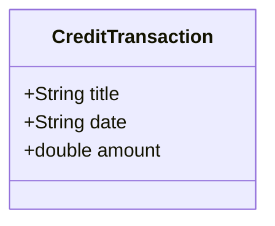

**Diagram sources**
- [credit_transaction_model.dart:1-11](file://lib/features/credit_balance/models/credit_transaction_model.dart#L1-L11)

**Section sources**
- [credit_transaction_model.dart:1-11](file://lib/features/credit_balance/models/credit_transaction_model.dart#L1-L11)

### Credit Chart Model
Responsibilities:
- Encapsulates a single data point for the monthly usage chart with month and value.

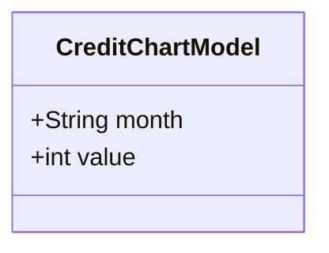

**Diagram sources**
- [credit_chart_model.dart:1-6](file://lib/features/credit_balance/models/credit_chart_model.dart#L1-L6)

**Section sources**
- [credit_chart_model.dart:1-6](file://lib/features/credit_balance/models/credit_chart_model.dart#L1-L6)

### CreditBalanceView
Responsibilities:
- Serves as the root screen for the credit balance feature.
- Integrates app bar, drawer, and the three primary widgets: CreditBalance, CreditSection, and CreditUsageCard.

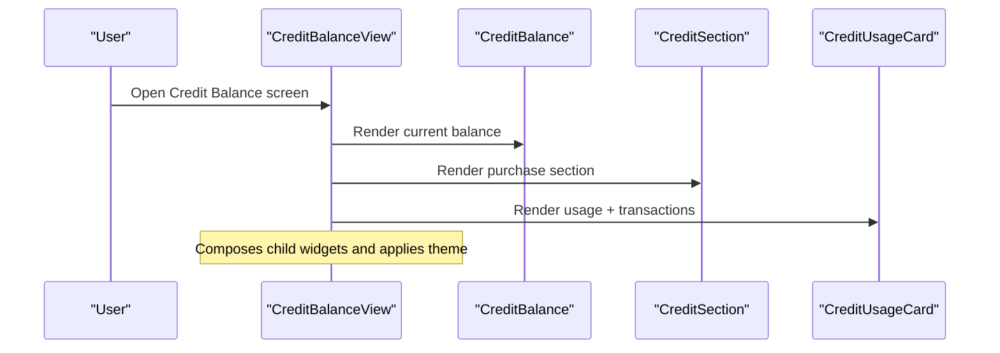

**Diagram sources**
- [credit_balance_view.dart:13-68](file://lib/features/credit_balance/views/credit_balance_view.dart#L13-L68)
- [credit_balance.dart:10-95](file://lib/features/credit_balance/widgets/credit_balance_view_widgets/credit_balance.dart#L10-L95)
- [credit_section.dart:13-110](file://lib/features/credit_balance/widgets/credit_balance_view_widgets/credit_section.dart#L13-L110)
- [credit_usage_card.dart:9-37](file://lib/features/credit_balance/widgets/credit_balance_view_widgets/credit_usage_card.dart#L9-L37)

**Section sources**
- [credit_balance_view.dart:13-68](file://lib/features/credit_balance/views/credit_balance_view.dart#L13-L68)

### CreditBalance Widget
Responsibilities:
- Displays the current credit balance and last updated information.
- Provides a “Purchase Credits” action button for initiating top-ups.

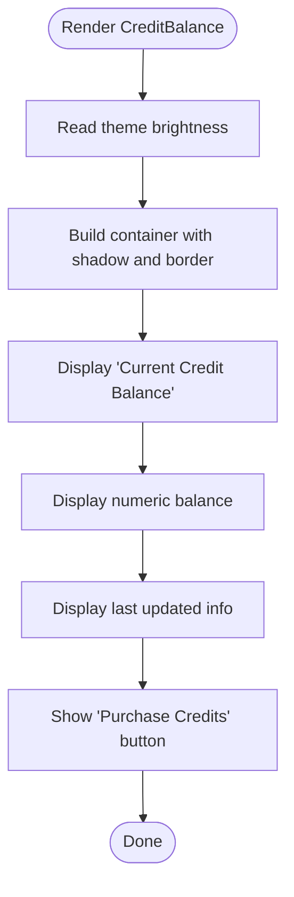

**Diagram sources**
- [credit_balance.dart:10-95](file://lib/features/credit_balance/widgets/credit_balance_view_widgets/credit_balance.dart#L10-L95)

**Section sources**
- [credit_balance.dart:10-95](file://lib/features/credit_balance/widgets/credit_balance_view_widgets/credit_balance.dart#L10-L95)

### CreditSection Widget
Responsibilities:
- Presents credit pack options and a “Proceed to Payment” action.
- Opens a payment dialog pre-populated with the card list and selected card from the controller.
- Updates the selected card reactively when the user makes a selection.

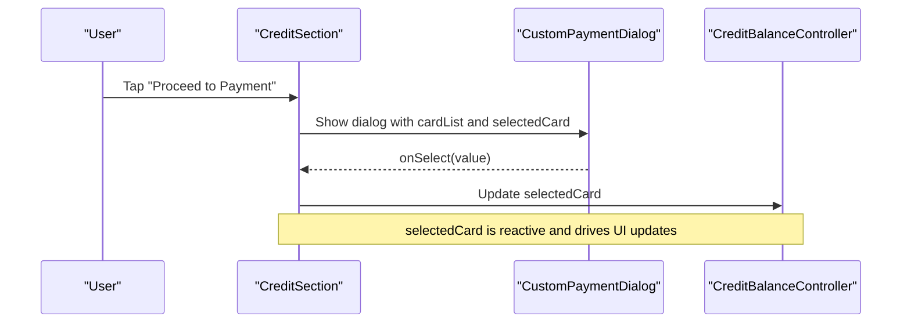

**Diagram sources**
- [credit_section.dart:13-110](file://lib/features/credit_balance/widgets/credit_balance_view_widgets/credit_section.dart#L13-L110)
- [credit_balance_controller.dart:3-7](file://lib/features/credit_balance/controller/credit_balance_controller.dart#L3-L7)

**Section sources**
- [credit_section.dart:13-110](file://lib/features/credit_balance/widgets/credit_balance_view_widgets/credit_section.dart#L13-L110)
- [credit_balance_controller.dart:3-7](file://lib/features/credit_balance/controller/credit_balance_controller.dart#L3-L7)

### CreditUsageCard Widget
Responsibilities:
- Aggregates CreditHeader, CreditChart, and CreditTransactionList into a cohesive usage card.
- Provides a bordered container with shadow and rounded corners.

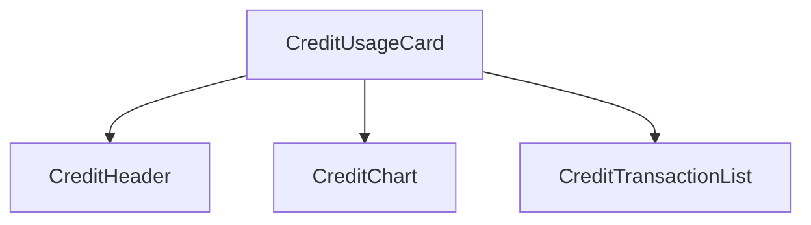

**Diagram sources**
- [credit_usage_card.dart:9-37](file://lib/features/credit_balance/widgets/credit_balance_view_widgets/credit_usage_card.dart#L9-L37)
- [credit_headar.dart:7-37](file://lib/features/credit_balance/widgets/credit_balance_view_widgets/credit_headar.dart#L7-L37)
- [credit_chart.dart:9-126](file://lib/features/credit_balance/widgets/credit_balance_view_widgets/credit_chart.dart#L9-L126)
- [credit_transaction_list.dart:10-121](file://lib/features/credit_balance/widgets/credit_balance_view_widgets/credit_transaction_list.dart#L10-L121)

**Section sources**
- [credit_usage_card.dart:9-37](file://lib/features/credit_balance/widgets/credit_balance_view_widgets/credit_usage_card.dart#L9-L37)

### CreditHeader Widget
Responsibilities:
- Displays the section title, description, and current balance label.

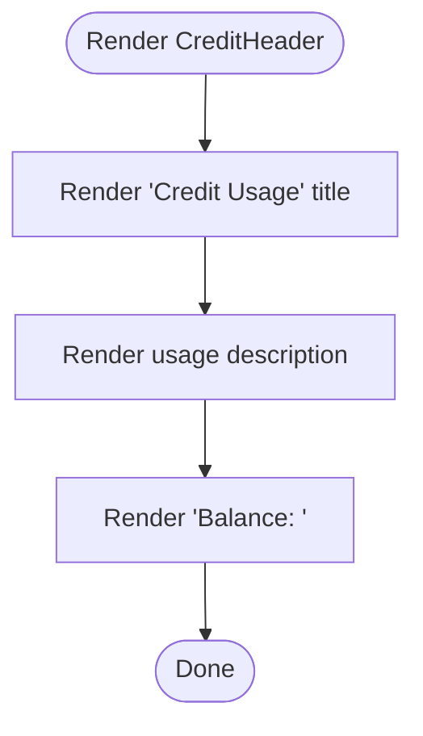

**Diagram sources**
- [credit_headar.dart:7-37](file://lib/features/credit_balance/widgets/credit_balance_view_widgets/credit_headar.dart#L7-L37)

**Section sources**
- [credit_headar.dart:7-37](file://lib/features/credit_balance/widgets/credit_balance_view_widgets/credit_headar.dart#L7-L37)

### CreditChart Widget
Responsibilities:
- Renders a bar chart of monthly credit usage using CreditChartModel entries.
- Highlights the most recent month differently for emphasis.

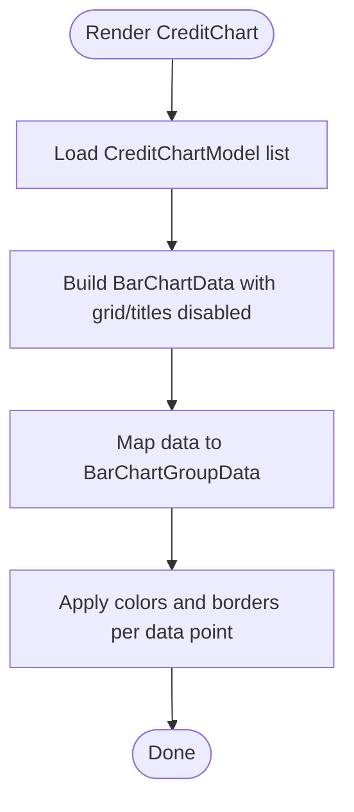

**Diagram sources**
- [credit_chart.dart:9-126](file://lib/features/credit_balance/widgets/credit_balance_view_widgets/credit_chart.dart#L9-L126)
- [credit_chart_model.dart:1-6](file://lib/features/credit_balance/models/credit_chart_model.dart#L1-L6)

**Section sources**
- [credit_chart.dart:9-126](file://lib/features/credit_balance/widgets/credit_balance_view_widgets/credit_chart.dart#L9-L126)
- [credit_chart_model.dart:1-6](file://lib/features/credit_balance/models/credit_chart_model.dart#L1-L6)

### CreditTransactionList Widget
Responsibilities:
- Displays a scrollable list of CreditTransaction entries.
- Uses a themed scrollbar and a fixed-height viewport for readability.

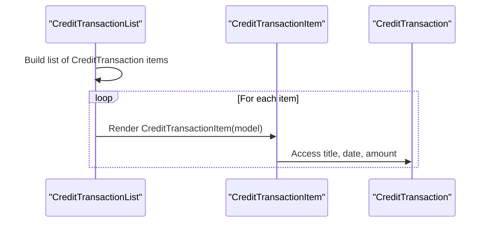

**Diagram sources**
- [credit_transaction_list.dart:10-121](file://lib/features/credit_balance/widgets/credit_balance_view_widgets/credit_transaction_list.dart#L10-L121)
- [credit_transaction_item.dart:8-73](file://lib/features/credit_balance/widgets/credit_balance_view_widgets/credit_transaction_item.dart#L8-L73)
- [credit_transaction_model.dart:1-11](file://lib/features/credit_balance/models/credit_transaction_model.dart#L1-L11)

**Section sources**
- [credit_transaction_list.dart:10-121](file://lib/features/credit_balance/widgets/credit_balance_view_widgets/credit_transaction_list.dart#L10-L121)
- [credit_transaction_item.dart:8-73](file://lib/features/credit_balance/widgets/credit_balance_view_widgets/credit_transaction_item.dart#L8-L73)
- [credit_transaction_model.dart:1-11](file://lib/features/credit_balance/models/credit_transaction_model.dart#L1-L11)

### CreditTransactionItem Widget
Responsibilities:
- Renders a single transaction row with title, date, and formatted amount.
- Formats positive amounts with a leading plus sign and handles decimal precision.

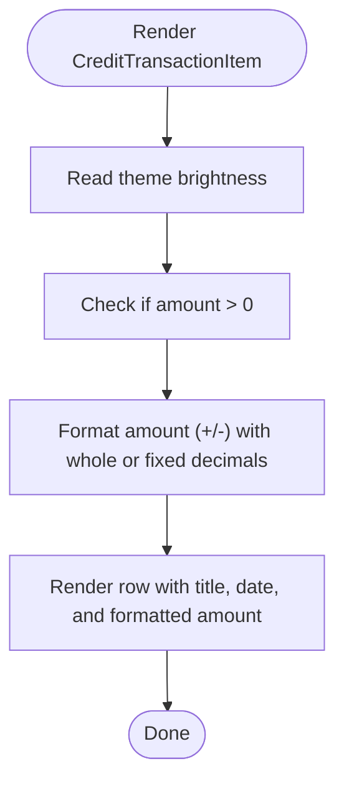

**Diagram sources**
- [credit_transaction_item.dart:8-73](file://lib/features/credit_balance/widgets/credit_balance_view_widgets/credit_transaction_item.dart#L8-L73)

**Section sources**
- [credit_transaction_item.dart:8-73](file://lib/features/credit_balance/widgets/credit_balance_view_widgets/credit_transaction_item.dart#L8-L73)

## Dependency Analysis
- Binding: CreditBalanceBindings registers CreditBalanceController lazily with GetX, ensuring it is available to dependent widgets.
- Controller usage: CreditSection depends on CreditBalanceController for card list and selected card state.
- Models: CreditTransactionList consumes CreditTransaction instances; CreditChart consumes CreditChartModel instances.

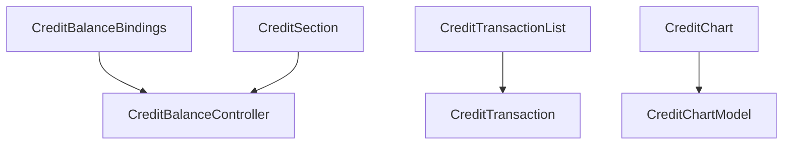

**Diagram sources**
- [credit_balance_bindings.dart:4-8](file://lib/features/credit_balance/bindings/credit_balance_bindings.dart#L4-L8)
- [credit_balance_controller.dart:3-7](file://lib/features/credit_balance/controller/credit_balance_controller.dart#L3-L7)
- [credit_section.dart:13-110](file://lib/features/credit_balance/widgets/credit_balance_view_widgets/credit_section.dart#L13-L110)
- [credit_transaction_list.dart:10-121](file://lib/features/credit_balance/widgets/credit_balance_view_widgets/credit_transaction_list.dart#L10-L121)
- [credit_transaction_model.dart:1-11](file://lib/features/credit_balance/models/credit_transaction_model.dart#L1-L11)
- [credit_chart.dart:9-126](file://lib/features/credit_balance/widgets/credit_balance_view_widgets/credit_chart.dart#L9-L126)
- [credit_chart_model.dart:1-6](file://lib/features/credit_balance/models/credit_chart_model.dart#L1-L6)

**Section sources**
- [credit_balance_bindings.dart:4-8](file://lib/features/credit_balance/bindings/credit_balance_bindings.dart#L4-L8)
- [credit_balance_controller.dart:3-7](file://lib/features/credit_balance/controller/credit_balance_controller.dart#L3-L7)
- [credit_section.dart:13-110](file://lib/features/credit_balance/widgets/credit_balance_view_widgets/credit_section.dart#L13-L110)
- [credit_transaction_list.dart:10-121](file://lib/features/credit_balance/widgets/credit_balance_view_widgets/credit_transaction_list.dart#L10-L121)
- [credit_chart.dart:9-126](file://lib/features/credit_balance/widgets/credit_balance_view_widgets/credit_chart.dart#L9-L126)

## Performance Considerations
- Reactive updates: GetX observables minimize unnecessary rebuilds by notifying only dependent widgets when state changes.
- List rendering: CreditTransactionList uses a fixed viewport and a scroll controller to optimize rendering of long lists.
- Chart rendering: CreditChart disables grid and border labels to reduce overdraw and improve responsiveness.
- Theming: Dynamic theme checks occur at build time; caching theme-dependent values can further reduce recompositions if needed.

## Troubleshooting Guide
- Empty or stale balance: Verify that CreditBalance reads the current balance from a data source. If balance is not updating, ensure the reactive source is properly triggered.
- Payment dialog not opening: Confirm that CreditSection invokes the dialog and passes the card list and selected card from the controller.
- Selected card not updating: Ensure the dialog’s onSelect callback updates controller.selectedCard and that dependent widgets are observing this observable.
- Transaction list not visible: Check that CreditTransactionList is included in CreditUsageCard and that the list items are populated with CreditTransaction instances.
- Chart not displaying: Confirm CreditChart receives a non-empty list of CreditChartModel entries and that BarChartData is configured with appropriate min/max and group mappings.

**Section sources**
- [credit_section.dart:13-110](file://lib/features/credit_balance/widgets/credit_balance_view_widgets/credit_section.dart#L13-L110)
- [credit_balance_controller.dart:3-7](file://lib/features/credit_balance/controller/credit_balance_controller.dart#L3-L7)
- [credit_transaction_list.dart:10-121](file://lib/features/credit_balance/widgets/credit_balance_view_widgets/credit_transaction_list.dart#L10-L121)
- [credit_chart.dart:9-126](file://lib/features/credit_balance/widgets/credit_balance_view_widgets/credit_chart.dart#L9-L126)

## Conclusion
The credit balance system is structured around a clean separation of state, models, and UI components. While the current implementation focuses on presentation and reactive state, it provides a solid foundation for integrating backend credit balance logic, validation rules, and persistence. Future enhancements can include real-time balance updates, credit limit enforcement, overdraft protection, and transactional credit movement handling, all while leveraging the existing GetX architecture and widget composition.