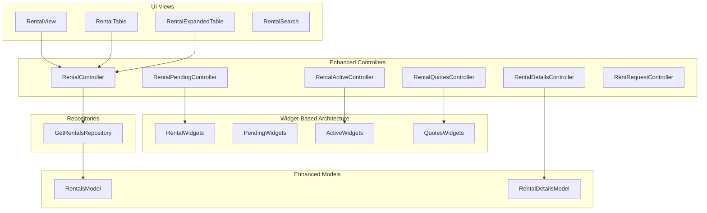
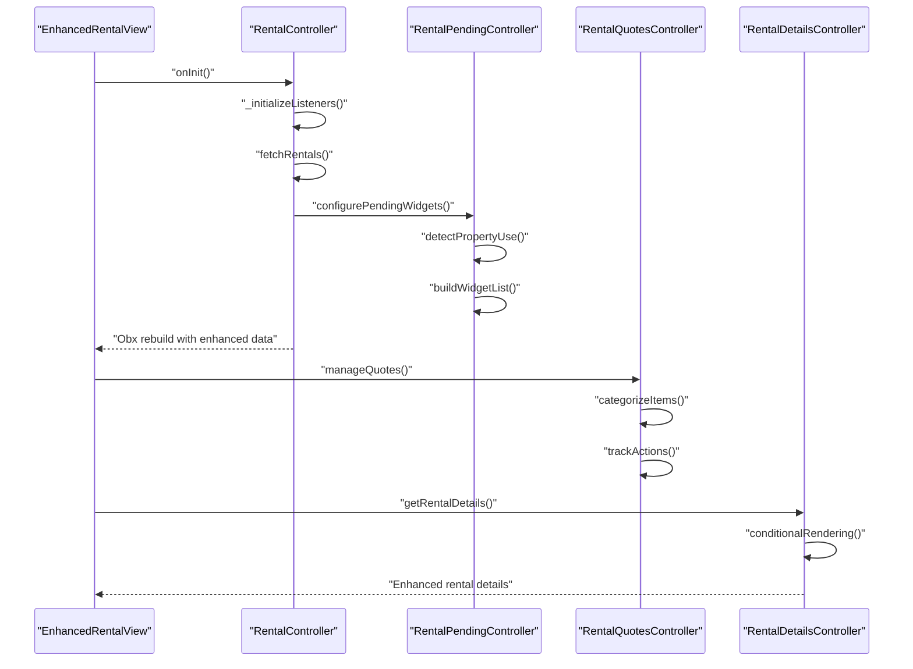
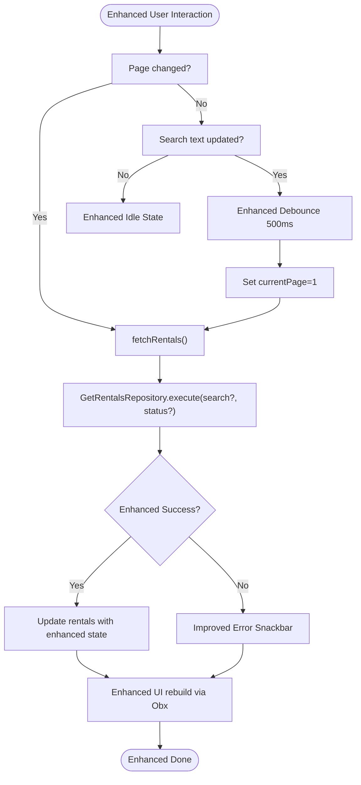
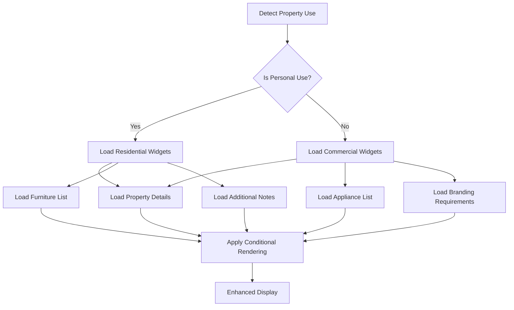
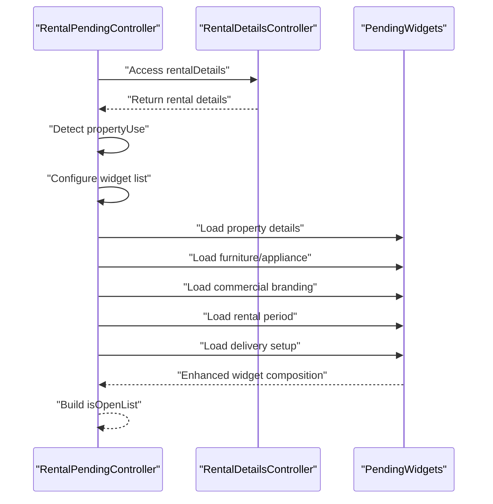
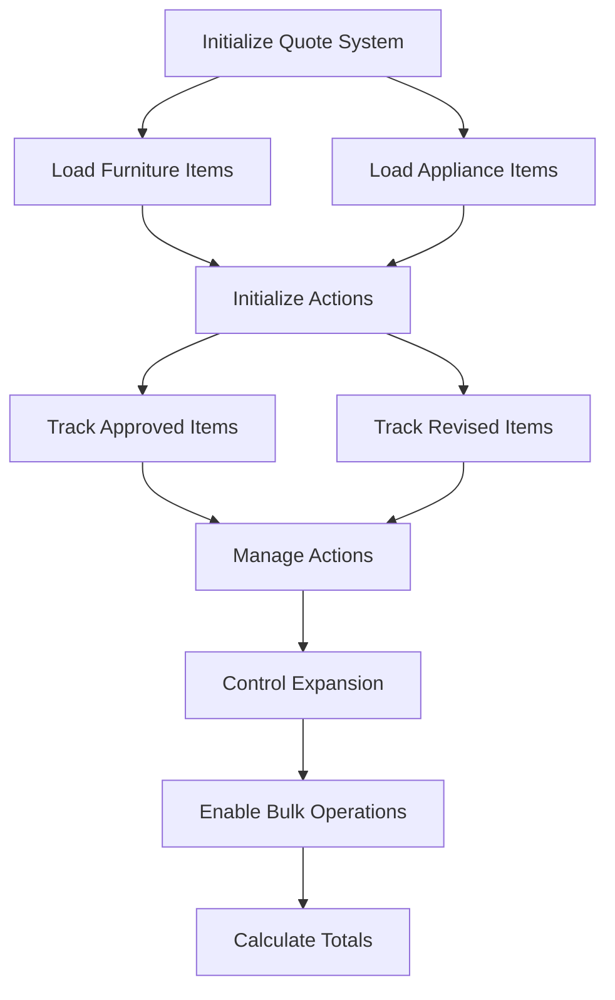
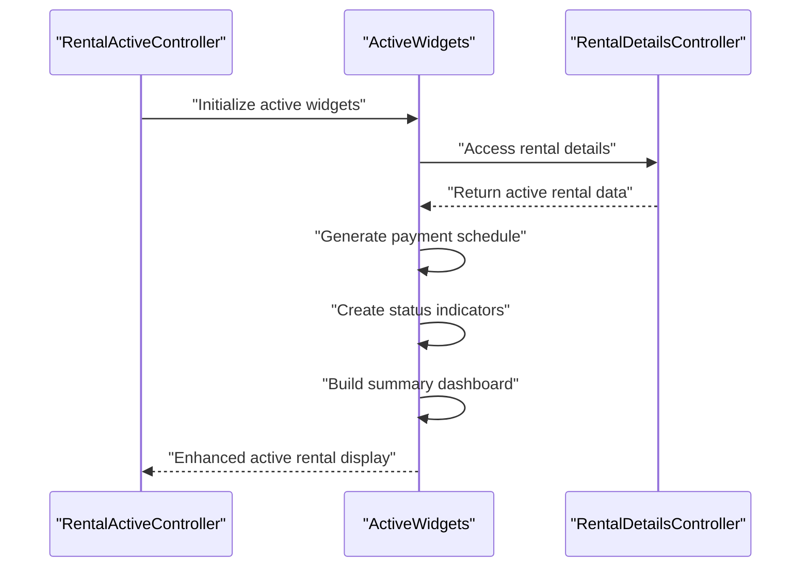
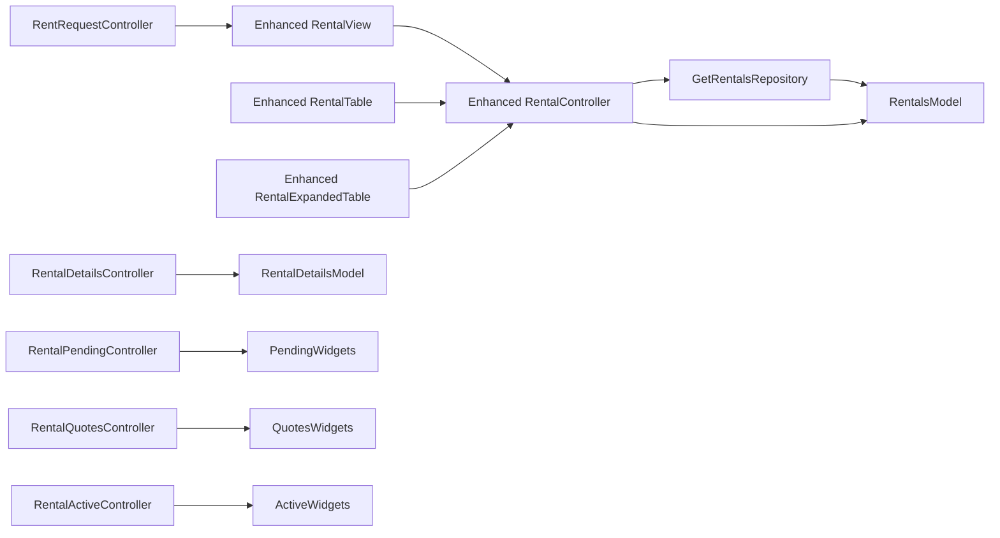

# Rental System

<cite>
**Referenced Files in This Document**
- [lib/features/rental/controllers/rental_controller.dart](file://lib/features/rental/controllers/rental_controller.dart)
- [lib/features/rental/models/rentals_model.dart](file://lib/features/rental/models/rentals_model.dart)
- [lib/features/rental/repositories/get_rentals_repo.dart](file://lib/features/rental/repositories/get_rentals_repo.dart)
- [lib/features/rental/views/rental_view.dart](file://lib/features/rental/views/rental_view.dart)
- [lib/features/rental/widgets/rentals_view_widgets/rental_table.dart](file://lib/features/rental/widgets/rentals_view_widgets/rental_table.dart)
- [lib/features/rental/widgets/rentals_view_widgets/rental_expanded_table.dart](file://lib/features/rental/widgets/rentals_view_widgets/rental_expanded_table.dart)
- [lib/features/rental/widgets/rentals_view_widgets/rental_search.dart](file://lib/features/rental/widgets/rentals_view_widgets/rental_search.dart)
- [lib/features/rental/controllers/rental_details_controller.dart](file://lib/features/rental/controllers/rental_details_controller.dart)
- [lib/features/rental/models/rental_details_model.dart](file://lib/features/rental/models/rental_details_model.dart)
- [lib/features/rental/controllers/rental_quotes_controller.dart](file://lib/features/rental/controllers/rental_quotes_controller.dart)
- [lib/features/rental/widgets/rentals_quote_widgets.dart/rental_quotes_furniture.dart](file://lib/features/rental/widgets/rentals_quote_widgets.dart/rental_quotes_furniture.dart)
- [lib/features/rental/controllers/rental_pending_controller.dart](file://lib/features/rental/controllers/rental_pending_controller.dart)
- [lib/features/rental/widgets/rentals_pending_widgets/pending_property.dart](file://lib/features/rental/widgets/rentals_pending_widgets/pending_property.dart)
- [lib/features/rental/widgets/rentals_pending_widgets/pending_furniture.dart](file://lib/features/rental/widgets/rentals_pending_widgets/pending_furniture.dart)
- [lib/features/rental/widgets/rentals_pending_widgets/pending_appliance.dart](file://lib/features/rental/widgets/rentals_pending_widgets/pending_appliance.dart)
- [lib/features/rental/widgets/rentals_pending_widgets/pending_period.dart](file://lib/features/rental/widgets/rentals_pending_widgets/pending_period.dart)
- [lib/features/rental/widgets/rentals_pending_widgets/pending_delivery.dart](file://lib/features/rental/widgets/rentals_pending_widgets/pending_delivery.dart)
- [lib/features/rental/widgets/rentals_pending_widgets/commercial_pending/commercial_pending_branding.dart](file://lib/features/rental/widgets/rentals_pending_widgets/commercial_pending/commercial_pending_branding.dart)
- [lib/features/rental/widgets/rentals_pending_widgets/pending_widgets.dart](file://lib/features/rental/widgets/rentals_pending_widgets/pending_widgets.dart)
- [lib/features/rental/controllers/rental_active_controller.dart](file://lib/features/rental/controllers/rental_active_controller.dart)
- [lib/features/rental/widgets/rentals_active_widgets/rentals_active_info.dart](file://lib/features/rental/widgets/rentals_active_widgets/rentals_active_info.dart)
- [lib/features/rental/widgets/rentals_active_widgets/rentals_active_info_details.dart](file://lib/features/rental/widgets/rentals_active_widgets/rentals_active_info_details.dart)
- [lib/features/rental/widgets/rentals_active_widgets/rentals_active_info_payment.dart](file://lib/features/rental/widgets/rentals_active_widgets/rentals_active_info_payment.dart)
- [lib/features/rental/widgets/rentals_active_widgets/rentals_active_installment.dart](file://lib/features/rental/widgets/rentals_active_widgets/rentals_active_installment.dart)
- [lib/features/rent_request/controller/rent_request_controller.dart](file://lib/features/rent_request/controller/rent_request_controller.dart)
</cite>

## Update Summary
**Changes Made**
- Enhanced rental details view with improved conditional rendering and error handling
- Added comprehensive pending controller with property use detection for residential/commercial differentiation
- Implemented new rental quotes system with dedicated furniture and appliance management widgets
- Improved active rental widgets with enhanced payment information and installment tracking
- Added extensive pending widgets for better data presentation including property details, furniture/appliance listings, and commercial branding
- Introduced new widget-based architecture for modular rental management components

## Table of Contents
1. [Introduction](#introduction)
2. [Project Structure](#project-structure)
3. [Core Components](#core-components)
4. [Architecture Overview](#architecture-overview)
5. [Detailed Component Analysis](#detailed-component-analysis)
6. [Enhanced Rental Details System](#enhanced-rental-details-system)
7. [Pending Rental Management](#pending-rental-management)
8. [Rental Quotes and Quoting System](#rental-quotes-and-quoting-system)
9. [Active Rental Widgets Enhancement](#active-rental-widgets-enhancement)
10. [Dependency Analysis](#dependency-analysis)
11. [Performance Considerations](#performance-considerations)
12. [Troubleshooting Guide](#troubleshooting-guide)
13. [Conclusion](#conclusion)

## Introduction
This document describes the complete furniture rental workflow implemented in the application, covering the rental request creation process, approval workflows, and lifecycle management. The system has been comprehensively enhanced with improved rental details views, enhanced pending controller functionality, new quoting systems, and extensive widget-based architecture for better user experience and data presentation.

The enhanced system now includes sophisticated conditional rendering, property use detection for residential/commercial differentiation, comprehensive furniture and appliance management, and improved payment tracking mechanisms. It explains the RentalController implementation with pagination, filtering by status, and debounced search functionality, along with the new widget-based architecture for rental management components.

## Project Structure
The rental system spans four main areas with enhanced widget-based architecture:
- Rental management: listing, filtering, pagination, and viewing details of rental requests
- Enhanced rental details: comprehensive property, furniture, and appliance management with conditional rendering
- Pending rental management: property use detection and differentiated widget presentation
- Quoting and approvals: advanced quote management with furniture/appliance categorization and action tracking

**Diagram sources**
- [lib/features/rental/views/rental_view.dart:15-61](file://lib/features/rental/views/rental_view.dart#L15-L61)
- [lib/features/rental/controllers/rental_controller.dart:7-95](file://lib/features/rental/controllers/rental_controller.dart#L7-L95)
- [lib/features/rental/controllers/rental_details_controller.dart:6-34](file://lib/features/rental/controllers/rental_details_controller.dart#L6-L34)
- [lib/features/rental/controllers/rental_pending_controller.dart:11-53](file://lib/features/rental/controllers/rental_pending_controller.dart#L11-L53)
- [lib/features/rental/controllers/rental_active_controller.dart:1-5](file://lib/features/rental/controllers/rental_active_controller.dart#L1-L5)
- [lib/features/rental/controllers/rental_quotes_controller.dart:7-225](file://lib/features/rental/controllers/rental_quotes_controller.dart#L7-L225)
- [lib/features/rental/widgets/rentals_pending_widgets/pending_widgets.dart:13-45](file://lib/features/rental/widgets/rentals_pending_widgets/pending_widgets.dart#L13-L45)

**Section sources**
- [lib/features/rental/views/rental_view.dart:15-61](file://lib/features/rental/views/rental_view.dart#L15-L61)
- [lib/features/rental/controllers/rental_controller.dart:7-95](file://lib/features/rental/controllers/rental_controller.dart#L7-L95)
- [lib/features/rental/controllers/rental_details_controller.dart:6-34](file://lib/features/rental/controllers/rental_details_controller.dart#L6-L34)
- [lib/features/rental/controllers/rental_pending_controller.dart:11-53](file://lib/features/rental/controllers/rental_pending_controller.dart#L11-L53)
- [lib/features/rental/controllers/rental_active_controller.dart:1-5](file://lib/features/rental/controllers/rental_active_controller.dart#L1-L5)
- [lib/features/rental/controllers/rental_quotes_controller.dart:7-225](file://lib/features/rental/controllers/rental_quotes_controller.dart#L7-L225)
- [lib/features/rental/widgets/rentals_pending_widgets/pending_widgets.dart:13-45](file://lib/features/rental/widgets/rentals_pending_widgets/pending_widgets.dart#L13-L45)

## Core Components
- **RentalController**: orchestrates fetching rental lists, pagination, status filtering, and debounced search with enhanced error handling and state management
- **RentalDetailsController**: handles comprehensive rental detail retrieval with improved conditional rendering and error handling
- **RentalPendingController**: manages pending rental display with property use detection for residential/commercial differentiation
- **RentalQuotesController**: implements advanced quote management with furniture/appliance categorization, action tracking, and bulk operations
- **Enhanced Widget Architecture**: modular widget system for property details, furniture/appliance listings, commercial branding, and payment information
- **RentRequestController**: drives the multi-step rental application wizard with enhanced form validation and navigation

**Section sources**
- [lib/features/rental/controllers/rental_controller.dart:7-95](file://lib/features/rental/controllers/rental_controller.dart#L7-L95)
- [lib/features/rental/controllers/rental_details_controller.dart:6-34](file://lib/features/rental/controllers/rental_details_controller.dart#L6-L34)
- [lib/features/rental/controllers/rental_pending_controller.dart:11-53](file://lib/features/rental/controllers/rental_pending_controller.dart#L11-L53)
- [lib/features/rental/controllers/rental_quotes_controller.dart:7-225](file://lib/features/rental/controllers/rental_quotes_controller.dart#L7-L225)

## Architecture Overview
The enhanced rental system follows a modular layered pattern with widget-based architecture:
- **UI Layer**: Enhanced views with widget-based composition for rental management
- **Controller Layer**: Specialized controllers for different rental states with improved state management
- **Model Layer**: Serializable DTOs with enhanced data structures for comprehensive rental information
- **Widget Layer**: Modular widget system for property details, furniture/appliance management, and payment tracking
- **Repository Layer**: Network abstraction with enhanced error handling and data validation

**Diagram sources**
- [lib/features/rental/controllers/rental_controller.dart:34-81](file://lib/features/rental/controllers/rental_controller.dart#L34-L81)
- [lib/features/rental/controllers/rental_pending_controller.dart:17-53](file://lib/features/rental/controllers/rental_pending_controller.dart#L17-L53)
- [lib/features/rental/controllers/rental_quotes_controller.dart:75-224](file://lib/features/rental/controllers/rental_quotes_controller.dart#L75-L224)
- [lib/features/rental/controllers/rental_details_controller.dart:14-34](file://lib/features/rental/controllers/rental_details_controller.dart#L14-L34)

## Detailed Component Analysis

### Enhanced RentalController: Advanced Pagination and Filtering
The RentalController maintains its core responsibilities while benefiting from the enhanced widget architecture:
- **Enhanced State Management**: Improved loading state handling with better error propagation
- **Advanced Pagination**: Enhanced pagination logic with fallback mechanisms and reactive updates
- **Smart Filtering**: Enhanced status filtering with improved "All" option handling
- **Debounced Search**: Refined debounced search implementation with better performance optimization

**Diagram sources**
- [lib/features/rental/controllers/rental_controller.dart:41-81](file://lib/features/rental/controllers/rental_controller.dart#L41-L81)

**Section sources**
- [lib/features/rental/controllers/rental_controller.dart:7-95](file://lib/features/rental/controllers/rental_controller.dart#L7-L95)

### Enhanced Widget-Based Architecture
The system now features a comprehensive widget-based architecture for better modularity and maintainability:

#### Pending Widgets System
- **Property Details Widget**: Comprehensive property information display with conditional rendering
- **Furniture Management Widget**: Detailed furniture selection with room-specific breakdown
- **Appliance Management Widget**: Appliance selection with condition and style specifications
- **Commercial Branding Widget**: Specialized branding requirements for commercial properties
- **Pending Period Widget**: Rental term and payment frequency display
- **Pending Delivery Widget**: Delivery setup and installation requirements

#### Active Widgets System
- **Enhanced Active Info Widget**: Comprehensive rental information with status tracking
- **Active Info Details Widget**: Detailed payment and term information
- **Active Payment Widget**: Advanced payment plan and installment tracking
- **Active Installment Widget**: Visual payment timeline and schedule display

**Section sources**
- [lib/features/rental/widgets/rentals_pending_widgets/pending_property.dart:1-111](file://lib/features/rental/widgets/rentals_pending_widgets/pending_property.dart#L1-L111)
- [lib/features/rental/widgets/rentals_pending_widgets/pending_furniture.dart:1-47](file://lib/features/rental/widgets/rentals_pending_widgets/pending_furniture.dart#L1-L47)
- [lib/features/rental/widgets/rentals_pending_widgets/pending_appliance.dart:1-39](file://lib/features/rental/widgets/rentals_pending_widgets/pending_appliance.dart#L1-L39)
- [lib/features/rental/widgets/rentals_pending_widgets/commercial_pending/commercial_pending_branding.dart:1-56](file://lib/features/rental/widgets/rentals_pending_widgets/commercial_pending/commercial_pending_branding.dart#L1-L56)
- [lib/features/rental/widgets/rentals_active_widgets/rentals_active_info.dart:1-129](file://lib/features/rental/widgets/rentals_active_widgets/rentals_active_info.dart#L1-L129)
- [lib/features/rental/widgets/rentals_active_widgets/rentals_active_info_details.dart:1-115](file://lib/features/rental/widgets/rentals_active_widgets/rentals_active_info_details.dart#L1-L115)
- [lib/features/rental/widgets/rentals_active_widgets/rentals_active_info_payment.dart:1-120](file://lib/features/rental/widgets/rentals_active_widgets/rentals_active_info_payment.dart#L1-L120)
- [lib/features/rental/widgets/rentals_active_widgets/rentals_active_installment.dart:1-82](file://lib/features/rental/widgets/rentals_active_widgets/rentals_active_installment.dart#L1-L82)

## Enhanced Rental Details System
The rental details system has been significantly enhanced with improved conditional rendering and comprehensive data presentation:

### Property Use Detection
The system now intelligently detects property types and displays appropriate information:
- **Residential Detection**: Identifies personal property use for tailored presentation
- **Commercial Detection**: Recognizes business property use for specialized requirements
- **Dynamic Widget Loading**: Loads different widget sets based on property classification

### Conditional Rendering Improvements
- **Null Safety**: Enhanced null checking for all rental detail properties
- **Empty State Handling**: Graceful handling of empty or incomplete data
- **Conditional Visibility**: Dynamic visibility based on available information
- **Fallback Mechanisms**: Default values when critical data is missing

**Diagram sources**
- [lib/features/rental/controllers/rental_pending_controller.dart:21-50](file://lib/features/rental/controllers/rental_pending_controller.dart#L21-L50)

**Section sources**
- [lib/features/rental/controllers/rental_pending_controller.dart:11-53](file://lib/features/rental/controllers/rental_pending_controller.dart#L11-L53)
- [lib/features/rental/widgets/rentals_pending_widgets/pending_property.dart:12-84](file://lib/features/rental/widgets/rentals_pending_widgets/pending_property.dart#L12-L84)

## Pending Rental Management
The pending rental management system has been comprehensively enhanced with property use detection and differentiated widget presentation:

### Property Use Detection Logic
The system automatically determines whether a property is residential or commercial:
- **Personal Property Detection**: Identifies personal/business use from propertyUse field
- **Dynamic Widget Selection**: Loads appropriate widgets based on property classification
- **Conditional Content Loading**: Shows relevant information only for specific property types

### Enhanced Widget Composition
The pending widgets system provides comprehensive rental information presentation:
- **Property Details**: Complete property information with address, size, and space breakdown
- **Furniture Management**: Room-by-room furniture selection with quantities and conditions
- **Appliance Management**: Appliance selection with room assignments and specifications
- **Commercial Branding**: Specialized branding requirements for commercial properties
- **Rental Period**: Term length and payment frequency information
- **Delivery Setup**: Installation requirements and delivery details

**Diagram sources**
- [lib/features/rental/controllers/rental_pending_controller.dart:17-53](file://lib/features/rental/controllers/rental_pending_controller.dart#L17-L53)

**Section sources**
- [lib/features/rental/controllers/rental_pending_controller.dart:11-53](file://lib/features/rental/controllers/rental_pending_controller.dart#L11-L53)
- [lib/features/rental/widgets/rentals_pending_widgets/pending_widgets.dart:13-45](file://lib/features/rental/widgets/rentals_pending_widgets/pending_widgets.dart#L13-L45)

## Rental Quotes and Quoting System
The quoting system has been completely redesigned with advanced furniture and appliance management:

### Enhanced Quote Item Management
- **Category Separation**: Clear distinction between furniture and appliance items
- **Action Tracking**: Comprehensive action tracking (none, approved, change, closed)
- **Expansion States**: Individual item expansion for detailed view
- **Bulk Operations**: Support for bulk approval and management operations

### Advanced Widget Architecture
The new widget system provides sophisticated quote management:
- **RentalQuotesFurniture Widget**: Modular furniture/appliance display with action controls
- **RentalQuotesFurnitureAction Widget**: Dedicated action buttons for quote management
- **RentalsQuoteItemDetails Widget**: Detailed item information display
- **Quote Calculation Widgets**: Advanced pricing and discount calculation interfaces

### Enhanced Business Logic
- **Approved Items Tracking**: Separate collection for approved items
- **Revised Items Management**: Dedicated tracking for changed items
- **Action State Synchronization**: Automatic synchronization between items and actions
- **Reset Item Detection**: Intelligent detection of items requiring changes

**Diagram sources**
- [lib/features/rental/controllers/rental_quotes_controller.dart:75-224](file://lib/features/rental/controllers/rental_quotes_controller.dart#L75-L224)

**Section sources**
- [lib/features/rental/controllers/rental_quotes_controller.dart:1-225](file://lib/features/rental/controllers/rental_quotes_controller.dart#L1-L225)
- [lib/features/rental/widgets/rentals_quote_widgets.dart/rental_quotes_furniture.dart:1-114](file://lib/features/rental/widgets/rentals_quote_widgets.dart/rental_quotes_furniture.dart#L1-L114)

## Active Rental Widgets Enhancement
The active rental widgets system has been significantly improved with enhanced payment information and installment tracking:

### Enhanced Payment Information
- **Comprehensive Payment Tracking**: Detailed payment plan and installment schedule
- **Status-Based Display**: Dynamic content based on rental status and installation requirements
- **Visual Timeline**: Interactive payment timeline with current status indicators
- **Flexible Layouts**: Adaptive layouts for different payment scenarios

### Advanced Installment Management
The system now provides sophisticated installment tracking:
- **Payment Schedule Display**: Visual representation of payment timeline
- **Current Payment Highlighting**: Clear indication of current and upcoming payments
- **Status Updates**: Real-time status updates for payment completion
- **Installment Calculation**: Automated calculation of payment amounts and due dates

### Enhanced Information Presentation
- **Summary Dashboard**: Comprehensive rental summary with key metrics
- **Term Information**: Detailed rental term and discount information
- **Payment Plan Details**: Complete payment plan with breakdown and totals
- **Status Indicators**: Clear visual indicators for rental status and payment status

**Diagram sources**
- [lib/features/rental/controllers/rental_active_controller.dart:1-5](file://lib/features/rental/controllers/rental_active_controller.dart#L1-L5)
- [lib/features/rental/widgets/rentals_active_widgets/rentals_active_info.dart:14-129](file://lib/features/rental/widgets/rentals_active_widgets/rentals_active_info.dart#L14-L129)

**Section sources**
- [lib/features/rental/controllers/rental_active_controller.dart:1-5](file://lib/features/rental/controllers/rental_active_controller.dart#L1-L5)
- [lib/features/rental/widgets/rentals_active_widgets/rentals_active_info.dart:1-129](file://lib/features/rental/widgets/rentals_active_widgets/rentals_active_info.dart#L1-L129)
- [lib/features/rental/widgets/rentals_active_widgets/rentals_active_info_details.dart:1-115](file://lib/features/rental/widgets/rentals_active_widgets/rentals_active_info_details.dart#L1-L115)
- [lib/features/rental/widgets/rentals_active_widgets/rentals_active_info_payment.dart:1-120](file://lib/features/rental/widgets/rentals_active_widgets/rentals_active_info_payment.dart#L1-L120)
- [lib/features/rental/widgets/rentals_active_widgets/rentals_active_installment.dart:1-82](file://lib/features/rental/widgets/rentals_active_widgets/rentals_active_installment.dart#L1-L82)

## Dependency Analysis
The enhanced system maintains clean dependency relationships with improved modularity:
- **Enhanced Controller Dependencies**: Controllers now depend on specialized widget systems
- **Widget-Based Architecture**: Modular widget system with clear separation of concerns
- **Improved State Management**: Better reactive state management across all components
- **Enhanced Error Handling**: Comprehensive error handling throughout the system

**Diagram sources**
- [lib/features/rental/controllers/rental_controller.dart:7-95](file://lib/features/rental/controllers/rental_controller.dart#L7-L95)
- [lib/features/rental/controllers/rental_pending_controller.dart:11-53](file://lib/features/rental/controllers/rental_pending_controller.dart#L11-L53)
- [lib/features/rental/controllers/rental_quotes_controller.dart:7-225](file://lib/features/rental/controllers/rental_quotes_controller.dart#L7-L225)
- [lib/features/rental/controllers/rental_active_controller.dart:1-5](file://lib/features/rental/controllers/rental_active_controller.dart#L1-L5)

**Section sources**
- [lib/features/rental/controllers/rental_controller.dart:7-95](file://lib/features/rental/controllers/rental_controller.dart#L7-L95)
- [lib/features/rental/controllers/rental_pending_controller.dart:11-53](file://lib/features/rental/controllers/rental_pending_controller.dart#L11-L53)
- [lib/features/rental/controllers/rental_quotes_controller.dart:7-225](file://lib/features/rental/controllers/rental_quotes_controller.dart#L7-L225)
- [lib/features/rental/controllers/rental_active_controller.dart:1-5](file://lib/features/rental/controllers/rental_active_controller.dart#L1-L5)

## Performance Considerations
The enhanced system includes several performance optimizations:
- **Enhanced Debounced Search**: Improved debounce implementation with better performance characteristics
- **Conditional Rendering**: Smart rendering only when data is available, reducing unnecessary rebuilds
- **Modular Widget Loading**: Lazy loading of widget components based on property type
- **Optimized State Management**: Better reactive state management with reduced scope updates
- **Enhanced Caching**: Improved caching strategies for frequently accessed rental details

## Troubleshooting Guide
Enhanced troubleshooting procedures for the improved system:
- **Enhanced Error Handling**: Comprehensive error handling with detailed logging and user feedback
- **Widget Loading Issues**: Debug widget loading problems with property use detection
- **Quote Management Problems**: Troubleshoot quote item actions and state synchronization
- **Payment Display Issues**: Resolve payment schedule and status display problems
- **Conditional Rendering Failures**: Debug conditional rendering issues with rental details

**Section sources**
- [lib/features/rental/controllers/rental_controller.dart:58-81](file://lib/features/rental/controllers/rental_controller.dart#L58-L81)
- [lib/features/rental/controllers/rental_details_controller.dart:18-26](file://lib/features/rental/controllers/rental_details_controller.dart#L18-L26)
- [lib/features/rental/controllers/rental_pending_controller.dart:21-25](file://lib/features/rental/controllers/rental_pending_controller.dart#L21-L25)

## Conclusion
The enhanced rental system represents a comprehensive evolution from a basic rental management solution to a sophisticated, modular, and highly functional rental platform. The system now features:

- **Enhanced Rental Details System**: Improved conditional rendering with comprehensive property, furniture, and appliance management
- **Advanced Pending Management**: Property use detection enabling residential/commercial differentiation with tailored widget presentations
- **Sophisticated Quoting System**: Advanced furniture/appliance management with comprehensive action tracking and bulk operations
- **Enhanced Active Rental Widgets**: Comprehensive payment tracking, installment management, and status visualization
- **Modular Widget Architecture**: Clean separation of concerns with specialized widgets for different rental states
- **Improved User Experience**: Better data presentation, conditional content loading, and responsive design

The system maintains strong architectural principles while adding significant functionality for comprehensive rental lifecycle management. The modular approach enables easy maintenance, future enhancements, and scalability for additional rental features and business requirements.