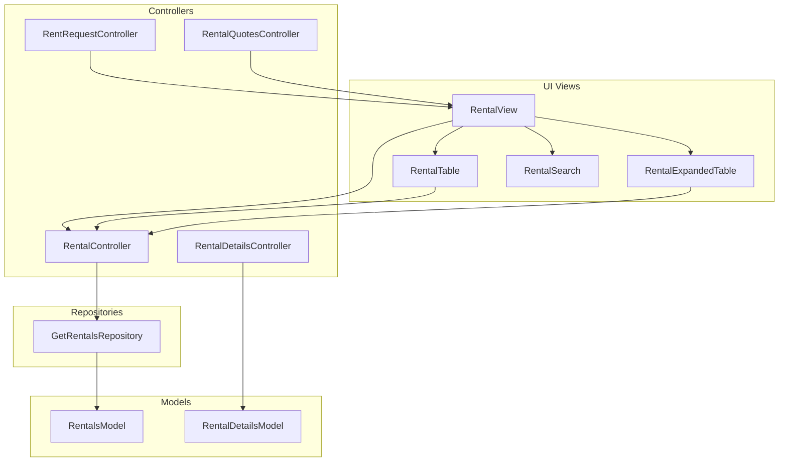
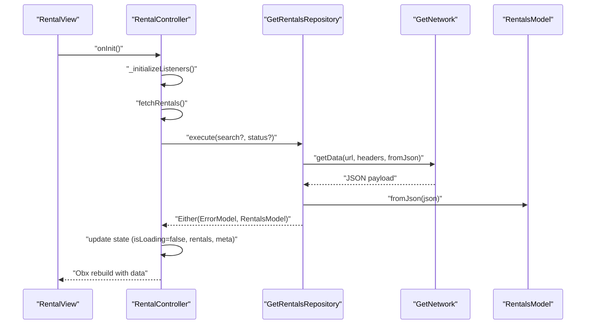
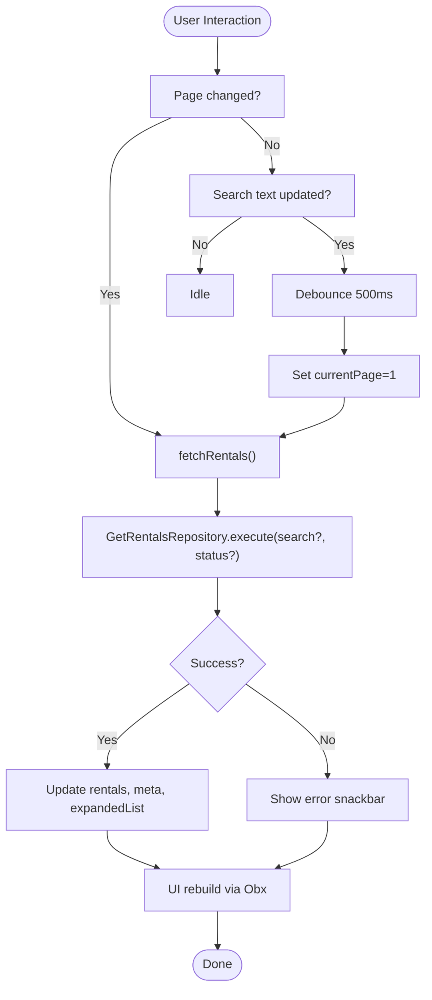
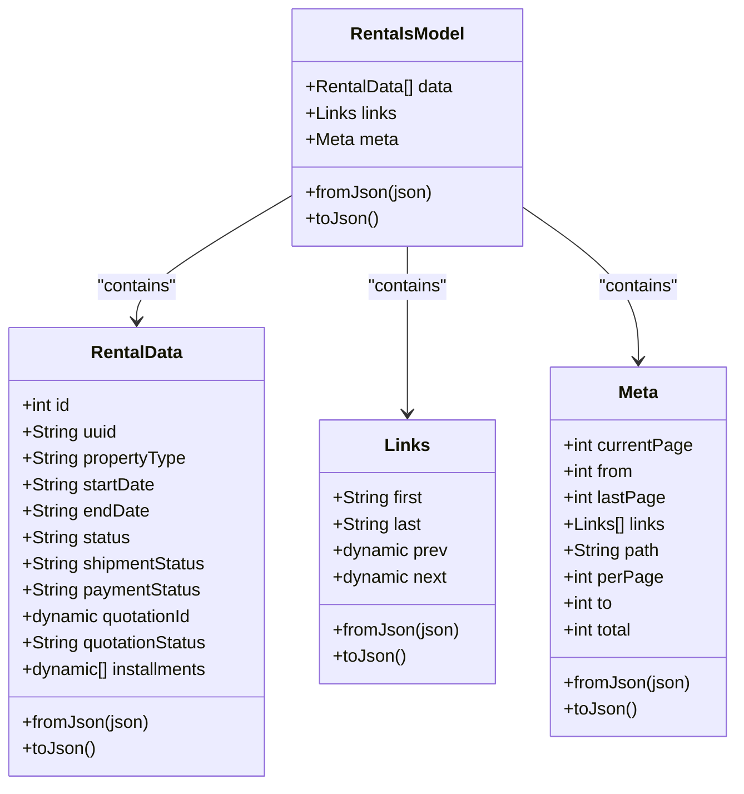
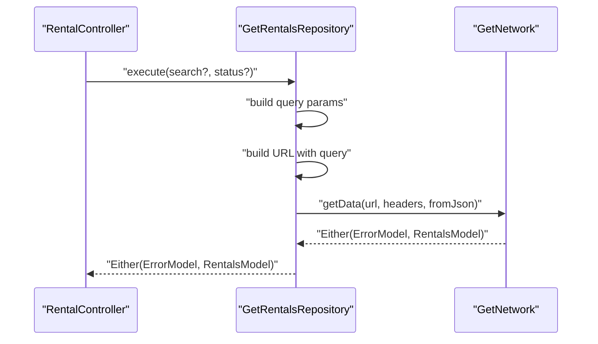
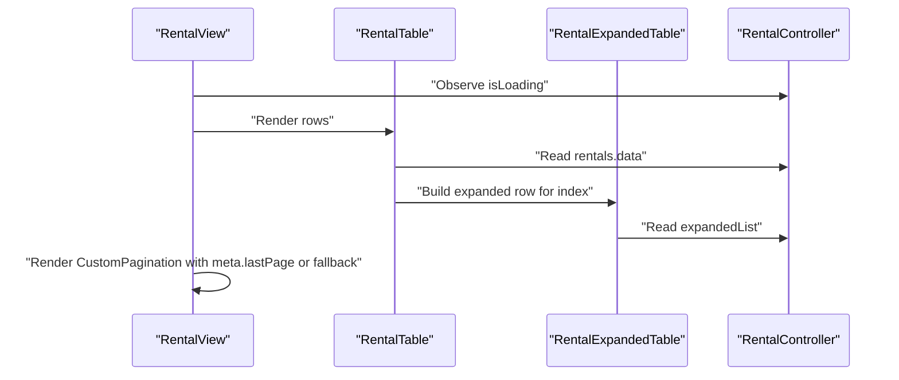
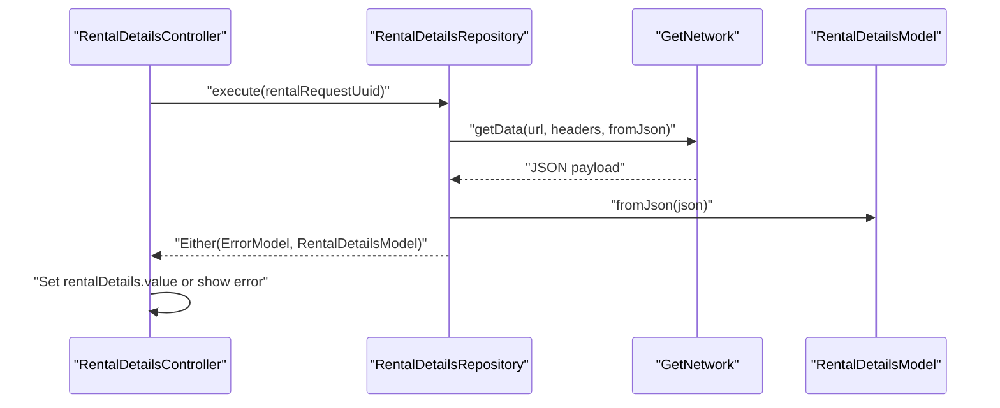
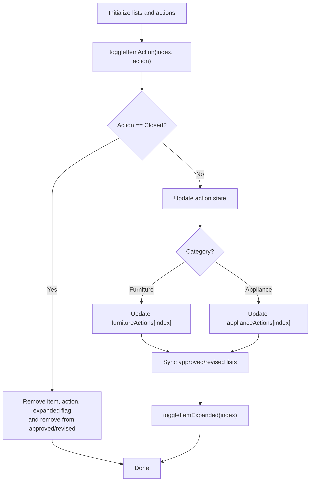
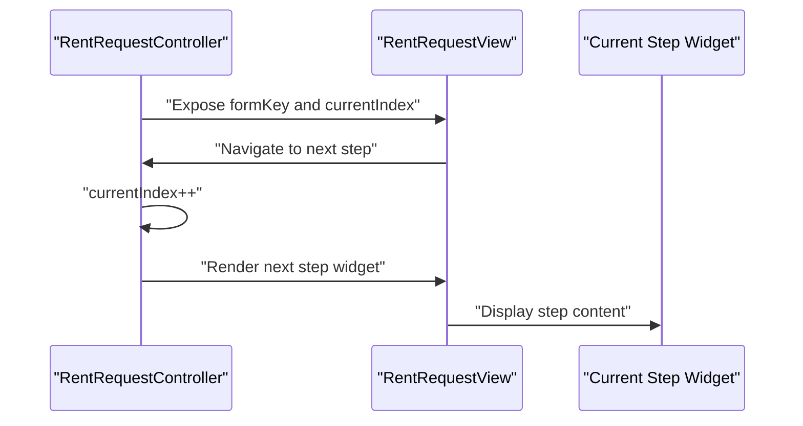
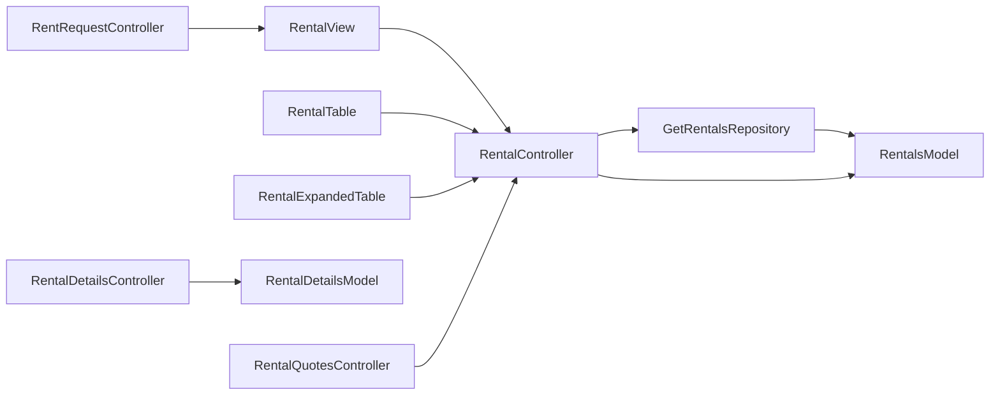

# Rental System

<cite>
**Referenced Files in This Document**
- [lib/features/rental/controllers/rental_controller.dart](file://lib/features/rental/controllers/rental_controller.dart)
- [lib/features/rental/models/rentals_model.dart](file://lib/features/rental/models/rentals_model.dart)
- [lib/features/rental/repositories/get_rentals_repo.dart](file://lib/features/rental/repositories/get_rentals_repo.dart)
- [lib/features/rental/views/rental_view.dart](file://lib/features/rental/views/rental_view.dart)
- [lib/features/rental/widgets/rentals_view_widgets/rental_table.dart](file://lib/features/rental/widgets/rentals_view_widgets/rental_table.dart)
- [lib/features/rental/widgets/rentals_view_widgets/rental_expanded_table.dart](file://lib/features/rental/widgets/rentals_view_widgets/rental_expanded_table.dart)
- [lib/features/rental/widgets/rentals_view_widgets/rental_search.dart](file://lib/features/rental/widgets/rentals_view_widgets/rental_search.dart)
- [lib/features/rental/controllers/rental_details_controller.dart](file://lib/features/rental/controllers/rental_details_controller.dart)
- [lib/features/rental/models/rental_details_model.dart](file://lib/features/rental/models/rental_details_model.dart)
- [lib/features/rental/controllers/rental_quotes_controller.dart](file://lib/features/rental/controllers/rental_quotes_controller.dart)
- [lib/features/rent_request/controller/rent_request_controller.dart](file://lib/features/rent_request/controller/rent_request_controller.dart)
</cite>

## Table of Contents
1. [Introduction](#introduction)
2. [Project Structure](#project-structure)
3. [Core Components](#core-components)
4. [Architecture Overview](#architecture-overview)
5. [Detailed Component Analysis](#detailed-component-analysis)
6. [Dependency Analysis](#dependency-analysis)
7. [Performance Considerations](#performance-considerations)
8. [Troubleshooting Guide](#troubleshooting-guide)
9. [Conclusion](#conclusion)

## Introduction
This document describes the complete furniture rental workflow implemented in the application, covering the rental request creation process, approval workflows, and lifecycle management. It explains the RentalController implementation with pagination, filtering by status, and debounced search functionality. It also documents the RentalsModel structure and the data flow from repository to UI, along with the rent request controller responsible for managing rental applications, quoting, and approval workflows. Examples of rental status management (Active, Pending, Quoted, Completed), pagination handling, and debounced search are included. Business rules for rental terms, pricing calculations, and inventory tracking integration are addressed conceptually.

## Project Structure
The rental system spans three main areas:
- Rental management: listing, filtering, pagination, and viewing details of rental requests
- Rental request creation: multi-step wizard for collecting property, furniture, appliance, period, delivery, and review details
- Quoting and approvals: managing quote items, actions (approve/change/closed), and bulk operations

**Diagram sources**
- [lib/features/rental/views/rental_view.dart:15-61](file://lib/features/rental/views/rental_view.dart#L15-L61)
- [lib/features/rental/controllers/rental_controller.dart:7-95](file://lib/features/rental/controllers/rental_controller.dart#L7-L95)
- [lib/features/rental/models/rentals_model.dart:1-171](file://lib/features/rental/models/rentals_model.dart#L1-L171)
- [lib/features/rental/repositories/get_rentals_repo.dart:7-38](file://lib/features/rental/repositories/get_rentals_repo.dart#L7-L38)
- [lib/features/rental/widgets/rentals_view_widgets/rental_table.dart:10-61](file://lib/features/rental/widgets/rentals_view_widgets/rental_table.dart#L10-L61)
- [lib/features/rental/widgets/rentals_view_widgets/rental_expanded_table.dart:12-80](file://lib/features/rental/widgets/rentals_view_widgets/rental_expanded_table.dart#L12-L80)
- [lib/features/rental/widgets/rentals_view_widgets/rental_search.dart:8-31](file://lib/features/rental/widgets/rentals_view_widgets/rental_search.dart#L8-L31)
- [lib/features/rental/controllers/rental_details_controller.dart:6-34](file://lib/features/rental/controllers/rental_details_controller.dart#L6-L34)
- [lib/features/rental/models/rental_details_model.dart:1-155](file://lib/features/rental/models/rental_details_model.dart#L1-L155)
- [lib/features/rental/controllers/rental_quotes_controller.dart:7-225](file://lib/features/rental/controllers/rental_quotes_controller.dart#L7-L225)
- [lib/features/rent_request/controller/rent_request_controller.dart:14-47](file://lib/features/rent_request/controller/rent_request_controller.dart#L14-L47)

**Section sources**
- [lib/features/rental/views/rental_view.dart:15-61](file://lib/features/rental/views/rental_view.dart#L15-L61)
- [lib/features/rental/controllers/rental_controller.dart:7-95](file://lib/features/rental/controllers/rental_controller.dart#L7-L95)
- [lib/features/rental/models/rentals_model.dart:1-171](file://lib/features/rental/models/rentals_model.dart#L1-L171)
- [lib/features/rental/repositories/get_rentals_repo.dart:7-38](file://lib/features/rental/repositories/get_rentals_repo.dart#L7-L38)
- [lib/features/rental/widgets/rentals_view_widgets/rental_table.dart:10-61](file://lib/features/rental/widgets/rentals_view_widgets/rental_table.dart#L10-L61)
- [lib/features/rental/widgets/rentals_view_widgets/rental_expanded_table.dart:12-80](file://lib/features/rental/widgets/rentals_view_widgets/rental_expanded_table.dart#L12-L80)
- [lib/features/rental/widgets/rentals_view_widgets/rental_search.dart:8-31](file://lib/features/rental/widgets/rentals_view_widgets/rental_search.dart#L8-L31)
- [lib/features/rental/controllers/rental_details_controller.dart:6-34](file://lib/features/rental/controllers/rental_details_controller.dart#L6-L34)
- [lib/features/rental/models/rental_details_model.dart:1-155](file://lib/features/rental/models/rental_details_model.dart#L1-L155)
- [lib/features/rental/controllers/rental_quotes_controller.dart:7-225](file://lib/features/rental/controllers/rental_quotes_controller.dart#L7-L225)
- [lib/features/rent_request/controller/rent_request_controller.dart:14-47](file://lib/features/rent_request/controller/rent_request_controller.dart#L14-L47)

## Core Components
- RentalController: orchestrates fetching rental lists, pagination, status filtering, and debounced search. It manages UI state (loading, current page, expanded rows) and delegates network calls to the repository.
- RentalsModel: serializable DTO representing paginated rental data with nested data, links, and metadata.
- GetRentalsRepository: encapsulates HTTP GET to the rental endpoint with optional query parameters for search and status.
- RentalView and RentalTable: UI composition rendering the list, search bar, status filter, pagination, and expandable rows.
- RentalDetailsController and RentalDetailsModel: handle retrieval and display of a single rental’s detailed information.
- RentalQuotesController: manages quote items, actions (approve/change/closed), and bulk operations for furniture/appliance selections.
- RentRequestController: drives the multi-step rental application wizard.

**Section sources**
- [lib/features/rental/controllers/rental_controller.dart:7-95](file://lib/features/rental/controllers/rental_controller.dart#L7-L95)
- [lib/features/rental/models/rentals_model.dart:1-171](file://lib/features/rental/models/rentals_model.dart#L1-L171)
- [lib/features/rental/repositories/get_rentals_repo.dart:7-38](file://lib/features/rental/repositories/get_rentals_repo.dart#L7-L38)
- [lib/features/rental/views/rental_view.dart:15-61](file://lib/features/rental/views/rental_view.dart#L15-L61)
- [lib/features/rental/widgets/rentals_view_widgets/rental_table.dart:10-61](file://lib/features/rental/widgets/rentals_view_widgets/rental_table.dart#L10-L61)
- [lib/features/rental/controllers/rental_details_controller.dart:6-34](file://lib/features/rental/controllers/rental_details_controller.dart#L6-L34)
- [lib/features/rental/models/rental_details_model.dart:1-155](file://lib/features/rental/models/rental_details_model.dart#L1-L155)
- [lib/features/rental/controllers/rental_quotes_controller.dart:7-225](file://lib/features/rental/controllers/rental_quotes_controller.dart#L7-L225)
- [lib/features/rent_request/controller/rent_request_controller.dart:14-47](file://lib/features/rent_request/controller/rent_request_controller.dart#L14-L47)

## Architecture Overview
The rental system follows a layered pattern:
- UI layer: RentalView, RentalTable, RentalExpandedTable, RentalSearch
- Controller layer: RentalController, RentalDetailsController, RentalQuotesController, RentRequestController
- Model layer: RentalsModel, RentalDetailsModel
- Repository layer: GetRentalsRepository
- Network layer: GetNetwork (via HeadersManager)

**Diagram sources**
- [lib/features/rental/views/rental_view.dart:15-61](file://lib/features/rental/views/rental_view.dart#L15-L61)
- [lib/features/rental/controllers/rental_controller.dart:34-81](file://lib/features/rental/controllers/rental_controller.dart#L34-L81)
- [lib/features/rental/repositories/get_rentals_repo.dart:11-36](file://lib/features/rental/repositories/get_rentals_repo.dart#L11-L36)
- [lib/features/rental/models/rentals_model.dart:8-31](file://lib/features/rental/models/rentals_model.dart#L8-L31)

## Detailed Component Analysis

### RentalController: Pagination, Filtering, and Debounced Search
- Responsibilities:
  - Initialize listeners for page changes and debounced search
  - Fetch rentals via repository with optional search and status filters
  - Manage loading state, current page, expanded rows, and search text
- Key behaviors:
  - Page change triggers fetchRentals
  - Search text updates are debounced (500 ms) and reset to page 1
  - Status filter uses predefined list with “All” as default
  - On successful load, expands rows to match data length and updates current page from meta
- Pagination:
  - Uses meta.lastPage for total pages; falls back to a constant when unavailable
  - currentPage is reactive and drives repository queries
- Filtering:
  - Filters by status using index mapping to statusList
  - Search parameter is applied only when non-empty

**Diagram sources**
- [lib/features/rental/controllers/rental_controller.dart:41-81](file://lib/features/rental/controllers/rental_controller.dart#L41-L81)

**Section sources**
- [lib/features/rental/controllers/rental_controller.dart:7-95](file://lib/features/rental/controllers/rental_controller.dart#L7-L95)

### RentalsModel: Data Structure and Serialization
- Top-level structure:
  - data: list of RentalData entries
  - links: first/last/prev/next URLs
  - meta: pagination info (current_page, from, last_page, path, per_page, to, total)
- RentalData fields:
  - id, uuid, propertyType, startDate, endDate, status, shipmentStatus, paymentStatus, quotationId, quotationStatus, installments
- Serialization:
  - fromJson and toJson for API round-trips

**Diagram sources**
- [lib/features/rental/models/rentals_model.dart:1-171](file://lib/features/rental/models/rentals_model.dart#L1-L171)

**Section sources**
- [lib/features/rental/models/rentals_model.dart:1-171](file://lib/features/rental/models/rentals_model.dart#L1-L171)

### GetRentalsRepository: Network Layer
- Builds query parameters:
  - search: optional
  - status: optional
- Constructs URL with query string if parameters exist
- Calls GetNetwork.getData with fromJson mapping to RentalsModel
- Returns Either<ErrorModel, RentalsModel>

**Diagram sources**
- [lib/features/rental/repositories/get_rentals_repo.dart:11-36](file://lib/features/rental/repositories/get_rentals_repo.dart#L11-L36)

**Section sources**
- [lib/features/rental/repositories/get_rentals_repo.dart:7-38](file://lib/features/rental/repositories/get_rentals_repo.dart#L7-L38)

### Rental UI: Table, Expanded Rows, Search, Pagination
- RentalView:
  - Renders app bar, top controls, status filter, search field, table, and pagination
  - Uses Obx to reactively render loading state and data
- RentalTable:
  - Maps RentalData to table rows with id, status, and model
  - Supports expandable rows via RentalExpandedTable
  - Action button navigates to rental details
- RentalExpandedTable:
  - Displays property type, start/end dates, status, shipment, payment, and action
- RentalSearch:
  - Debounced search input bound to controller.searchController

**Diagram sources**
- [lib/features/rental/views/rental_view.dart:15-61](file://lib/features/rental/views/rental_view.dart#L15-L61)
- [lib/features/rental/widgets/rentals_view_widgets/rental_table.dart:10-61](file://lib/features/rental/widgets/rentals_view_widgets/rental_table.dart#L10-L61)
- [lib/features/rental/widgets/rentals_view_widgets/rental_expanded_table.dart:12-80](file://lib/features/rental/widgets/rentals_view_widgets/rental_expanded_table.dart#L12-L80)
- [lib/features/rental/widgets/rentals_view_widgets/rental_search.dart:8-31](file://lib/features/rental/widgets/rentals_view_widgets/rental_search.dart#L8-L31)

**Section sources**
- [lib/features/rental/views/rental_view.dart:15-61](file://lib/features/rental/views/rental_view.dart#L15-L61)
- [lib/features/rental/widgets/rentals_view_widgets/rental_table.dart:10-61](file://lib/features/rental/widgets/rentals_view_widgets/rental_table.dart#L10-L61)
- [lib/features/rental/widgets/rentals_view_widgets/rental_expanded_table.dart:12-80](file://lib/features/rental/widgets/rentals_view_widgets/rental_expanded_table.dart#L12-L80)
- [lib/features/rental/widgets/rentals_view_widgets/rental_search.dart:8-31](file://lib/features/rental/widgets/rentals_view_widgets/rental_search.dart#L8-L31)

### Rental Details: Lifecycle and Data Presentation
- RentalDetailsController:
  - Retrieves a single rental by uuid argument
  - Handles error via snackbar and sets loading state
- RentalDetailsModel:
  - Comprehensive structure including business info, property details, space breakdown, room dimensions, furniture/appliance selections, rental terms, delivery setup, additional notes, and timestamps
  - Nested models for structured data (e.g., InstallmentSchedule, AccessDetails)

**Diagram sources**
- [lib/features/rental/controllers/rental_details_controller.dart:13-26](file://lib/features/rental/controllers/rental_details_controller.dart#L13-L26)
- [lib/features/rental/models/rental_details_model.dart:56-154](file://lib/features/rental/models/rental_details_model.dart#L56-L154)

**Section sources**
- [lib/features/rental/controllers/rental_details_controller.dart:6-34](file://lib/features/rental/controllers/rental_details_controller.dart#L6-L34)
- [lib/features/rental/models/rental_details_model.dart:1-155](file://lib/features/rental/models/rental_details_model.dart#L1-L155)

### Rental Quotes Controller: Quoting and Approval Workflows
- Manages:
  - Furniture and appliance lists with titles and widgets
  - Actions per item: none, approved, change, closed
  - Expansion state per category
  - Approved and revised item collections
- Key methods:
  - toggleItemAction: toggles action state and updates approved/revised lists
  - toggleItemExpanded: toggles expansion for furniture/appliance
  - approveAll: bulk approval for all items
- Business implications:
  - Supports granular item-level decisions during quoting
  - Maintains separation between approved and revised items for auditability

**Diagram sources**
- [lib/features/rental/controllers/rental_quotes_controller.dart:75-224](file://lib/features/rental/controllers/rental_quotes_controller.dart#L75-L224)

**Section sources**
- [lib/features/rental/controllers/rental_quotes_controller.dart:7-225](file://lib/features/rental/controllers/rental_quotes_controller.dart#L7-L225)

### Rent Request Controller: Application Creation Workflow
- Manages a multi-step wizard:
  - Form fields for business/personal info and contact details
  - Navigation via currentIndex through a list of step widgets
  - ScrollController for step navigation
- Steps include property type, property details, floor plan, furniture selection, appliances, brand preferences, rental period, delivery setup, and review
- Provides centralized state for the application flow

**Diagram sources**
- [lib/features/rent_request/controller/rent_request_controller.dart:14-47](file://lib/features/rent_request/controller/rent_request_controller.dart#L14-L47)

**Section sources**
- [lib/features/rent_request/controller/rent_request_controller.dart:14-47](file://lib/features/rent_request/controller/rent_request_controller.dart#L14-L47)

## Dependency Analysis
- Controllers depend on repositories for data access and on models for serialization.
- UI depends on controllers via GetX Obx bindings.
- Repositories depend on network utilities and headers manager.
- Models are decoupled and reusable across controllers.

**Diagram sources**
- [lib/features/rental/controllers/rental_controller.dart:7-95](file://lib/features/rental/controllers/rental_controller.dart#L7-L95)
- [lib/features/rental/repositories/get_rentals_repo.dart:7-38](file://lib/features/rental/repositories/get_rentals_repo.dart#L7-L38)
- [lib/features/rental/models/rentals_model.dart:1-171](file://lib/features/rental/models/rentals_model.dart#L1-L171)
- [lib/features/rental/views/rental_view.dart:15-61](file://lib/features/rental/views/rental_view.dart#L15-L61)
- [lib/features/rental/widgets/rentals_view_widgets/rental_table.dart:10-61](file://lib/features/rental/widgets/rentals_view_widgets/rental_table.dart#L10-L61)
- [lib/features/rental/widgets/rentals_view_widgets/rental_expanded_table.dart:12-80](file://lib/features/rental/widgets/rentals_view_widgets/rental_expanded_table.dart#L12-L80)
- [lib/features/rental/controllers/rental_details_controller.dart:6-34](file://lib/features/rental/controllers/rental_details_controller.dart#L6-L34)
- [lib/features/rental/models/rental_details_model.dart:1-155](file://lib/features/rental/models/rental_details_model.dart#L1-L155)
- [lib/features/rental/controllers/rental_quotes_controller.dart:7-225](file://lib/features/rental/controllers/rental_quotes_controller.dart#L7-L225)
- [lib/features/rent_request/controller/rent_request_controller.dart:14-47](file://lib/features/rent_request/controller/rent_request_controller.dart#L14-L47)

**Section sources**
- [lib/features/rental/controllers/rental_controller.dart:7-95](file://lib/features/rental/controllers/rental_controller.dart#L7-L95)
- [lib/features/rental/repositories/get_rentals_repo.dart:7-38](file://lib/features/rental/repositories/get_rentals_repo.dart#L7-L38)
- [lib/features/rental/models/rentals_model.dart:1-171](file://lib/features/rental/models/rentals_model.dart#L1-L171)
- [lib/features/rental/views/rental_view.dart:15-61](file://lib/features/rental/views/rental_view.dart#L15-L61)
- [lib/features/rental/widgets/rentals_view_widgets/rental_table.dart:10-61](file://lib/features/rental/widgets/rentals_view_widgets/rental_table.dart#L10-L61)
- [lib/features/rental/widgets/rentals_view_widgets/rental_expanded_table.dart:12-80](file://lib/features/rental/widgets/rentals_view_widgets/rental_expanded_table.dart#L12-L80)
- [lib/features/rental/controllers/rental_details_controller.dart:6-34](file://lib/features/rental/controllers/rental_details_controller.dart#L6-L34)
- [lib/features/rental/models/rental_details_model.dart:1-155](file://lib/features/rental/models/rental_details_model.dart#L1-L155)
- [lib/features/rental/controllers/rental_quotes_controller.dart:7-225](file://lib/features/rental/controllers/rental_quotes_controller.dart#L7-L225)
- [lib/features/rent_request/controller/rent_request_controller.dart:14-47](file://lib/features/rent_request/controller/rent_request_controller.dart#L14-L47)

## Performance Considerations
- Debounced search reduces network calls during typing; adjust debounce duration based on UX needs.
- Pagination via meta.lastPage prevents unnecessary re-fetches; fallback to a constant ensures UI stability when meta is missing.
- Reactive state updates minimize rebuild scope; keep models immutable and use Rx fields judiciously.
- Consider caching frequently accessed rental details to reduce network overhead.

## Troubleshooting Guide
- Error handling:
  - Repository returns Either; controllers fold the result and show error snackbars on failure.
  - Verify headers and URL construction in repository.
- Pagination anomalies:
  - If meta.lastPage is null, UI falls back to a constant total; confirm backend returns proper pagination metadata.
- Search not filtering:
  - Ensure searchController is bound to the search widget and debounce is configured.
- Status filter not applying:
  - Confirm statusIndex mapping aligns with statusList and that “All” is handled correctly.

**Section sources**
- [lib/features/rental/controllers/rental_controller.dart:58-81](file://lib/features/rental/controllers/rental_controller.dart#L58-L81)
- [lib/features/rental/repositories/get_rentals_repo.dart:11-36](file://lib/features/rental/repositories/get_rentals_repo.dart#L11-L36)
- [lib/features/rental/controllers/rental_details_controller.dart:18-26](file://lib/features/rental/controllers/rental_details_controller.dart#L18-L26)

## Conclusion
The rental system integrates a robust UI layer with reactive controllers, a clean model hierarchy, and a repository-driven network layer. It supports comprehensive rental lifecycle management from request creation to quoting and approvals, with strong pagination, filtering, and search capabilities. The design enables maintainability and extensibility for future enhancements such as inventory tracking integration and advanced pricing calculations.