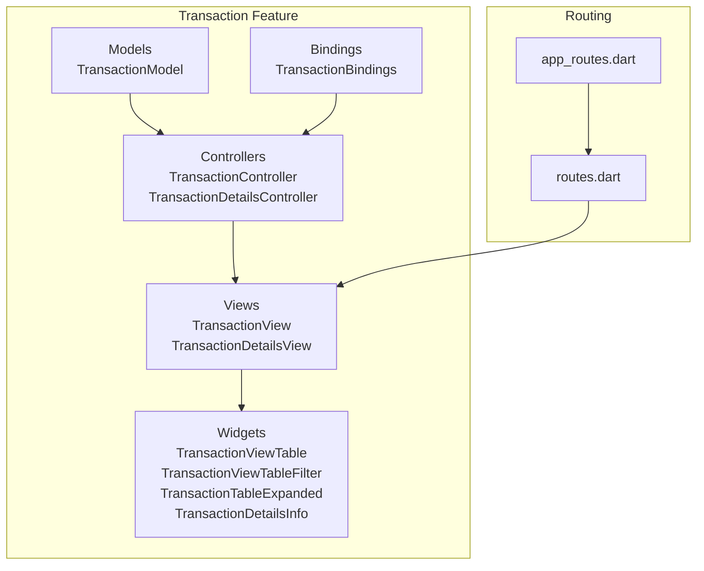
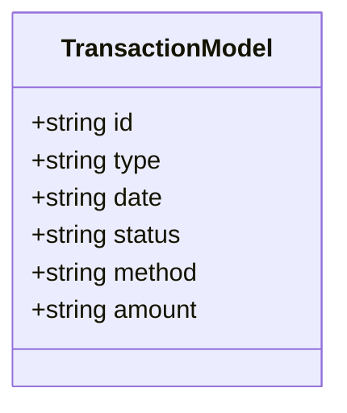
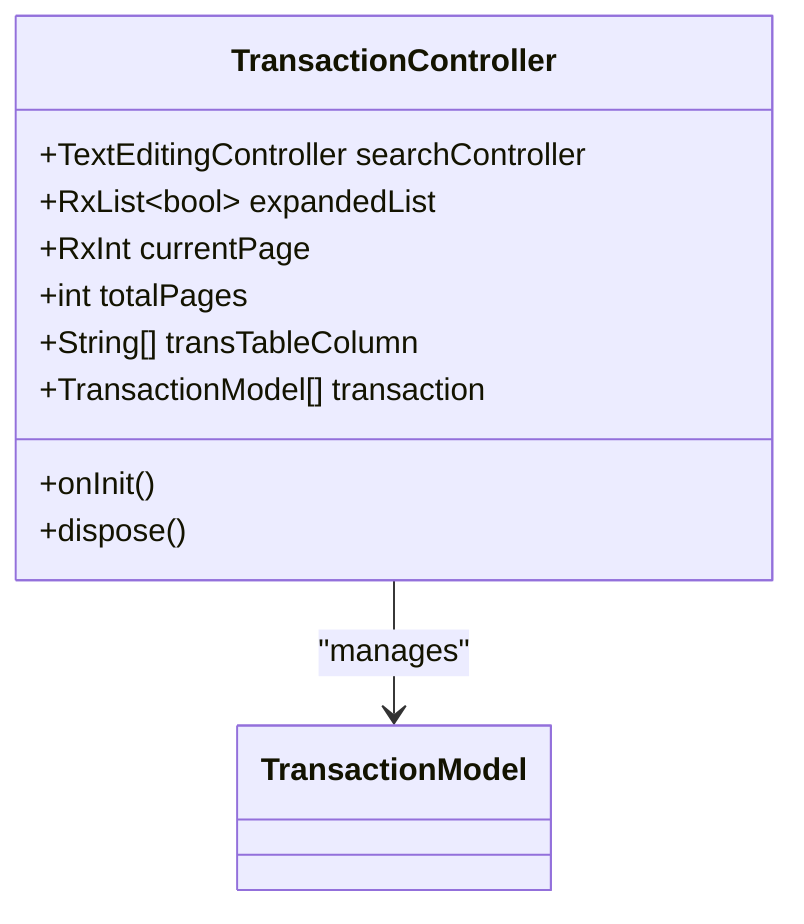
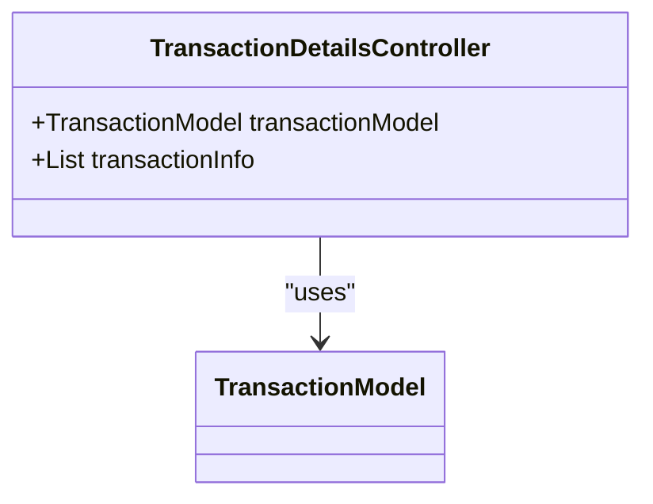
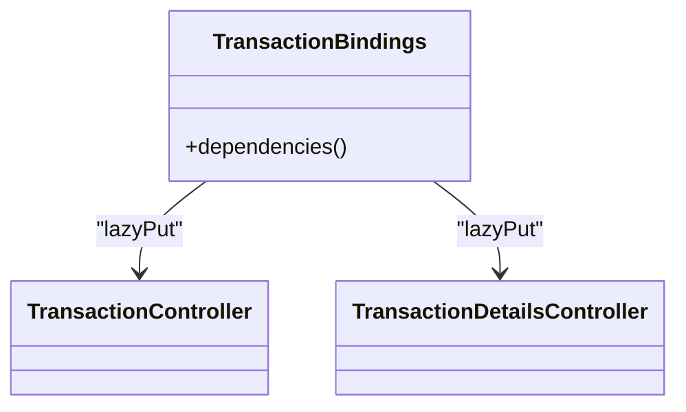
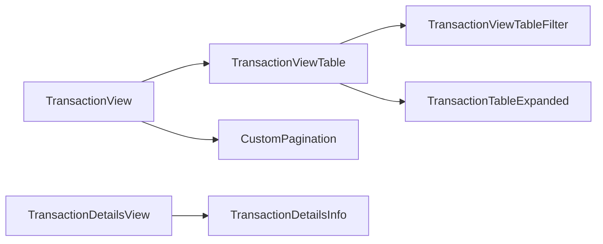
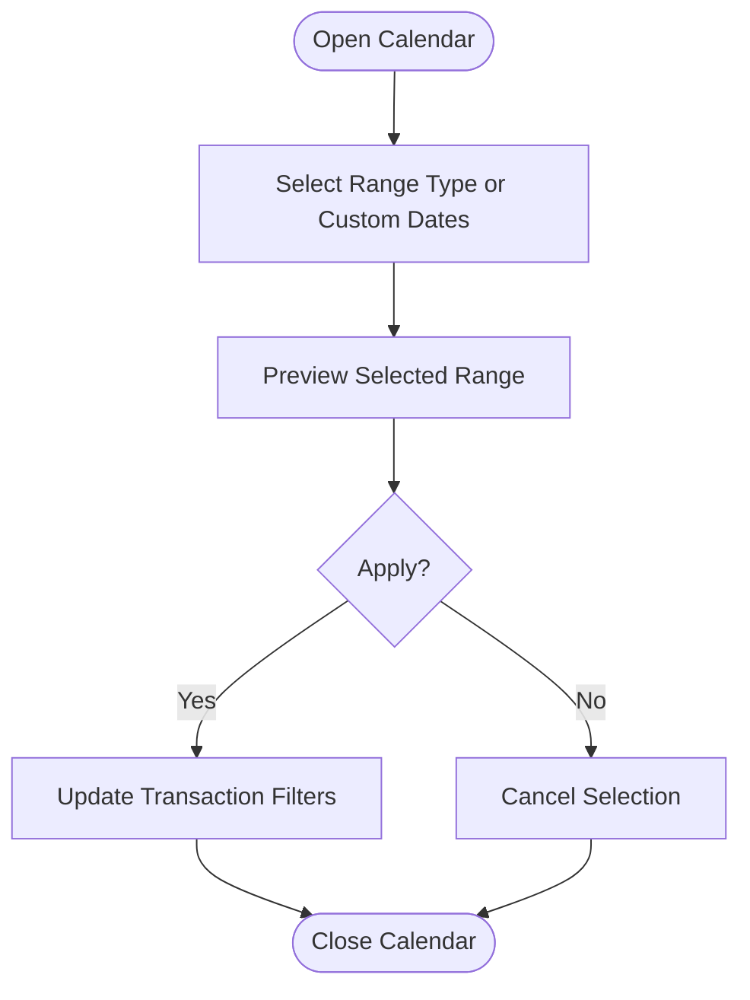
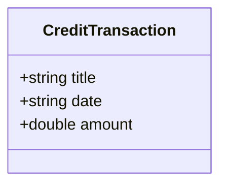
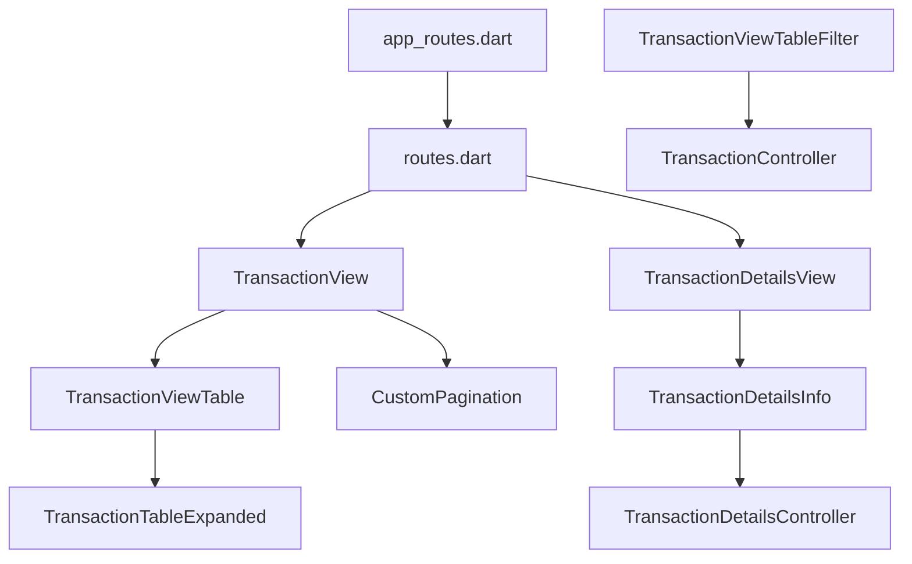
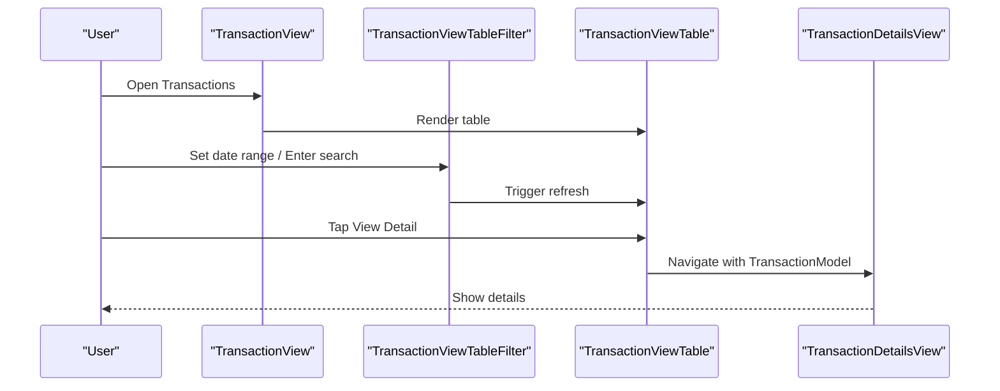

# Transaction Management

<cite>
**Referenced Files in This Document**
- [transaction_model.dart](file://lib/features/transaction/models/transaction_model.dart)
- [transaction_controller.dart](file://lib/features/transaction/controller/transaction_controller.dart)
- [transaction_details_controller.dart](file://lib/features/transaction/controller/transaction_details_controller.dart)
- [transaction_bindings.dart](file://lib/features/transaction/bindings/transaction_bindings.dart)
- [transaction_view.dart](file://lib/features/transaction/views/transaction_view.dart)
- [transaction_details_view.dart](file://lib/features/transaction/views/transaction_details_view.dart)
- [transaction_view_table.dart](file://lib/features/transaction/widgets/transaction_view_widgets/transaction_view_table.dart)
- [transaction_view_table_filter.dart](file://lib/features/transaction/widgets/transaction_view_widgets/transaction_view_table_filter.dart)
- [transaction_table_expanded.dart](file://lib/features/transaction/widgets/transaction_view_widgets/transaction_table_expanded.dart)
- [transaction_details_info.dart](file://lib/features/transaction/widgets/transaction_details_widgets/transaction_details_info.dart)
- [routes.dart](file://lib/core/routes/routes.dart)
- [app_routes.dart](file://lib/core/routes/app_routes.dart)
- [transaction_calender_controller.dart](file://lib/features/transaction/controller/transaction_calender_controller.dart)
- [transaction_calender.dart](file://lib/features/transaction/widgets/transaction_view_widgets/transaction_calender.dart)
- [credit_transaction_model.dart](file://lib/features/credit_balance/models/credit_transaction_model.dart)
</cite>

## Table of Contents
1. [Introduction](#introduction)
2. [Project Structure](#project-structure)
3. [Core Components](#core-components)
4. [Architecture Overview](#architecture-overview)
5. [Detailed Component Analysis](#detailed-component-analysis)
6. [Dependency Analysis](#dependency-analysis)
7. [Performance Considerations](#performance-considerations)
8. [Troubleshooting Guide](#troubleshooting-guide)
9. [Conclusion](#conclusion)
10. [Appendices](#appendices)

## Introduction
This document describes the transaction management system implemented in the Flutter application. It focuses on the transaction controller that orchestrates payment processing views, tracks financial activities, and maintains transaction history. The documentation covers the transaction model structure, repository patterns for data access and persistence, examples of transaction workflows, payment processing integration, financial reporting capabilities, transaction categorization, audit trails, compliance requirements, error handling for failed transactions, and reconciliation processes.

## Project Structure
The transaction management feature is organized around a set of controllers, models, views, and widgets that follow a layered architecture:
- Models define the transaction entity structure.
- Controllers manage UI state, search, pagination, and expansion toggles.
- Views render pages for listing and detail views.
- Widgets encapsulate reusable UI components for tables, filters, and expanded rows.
- Routing integrates the feature into the application navigation.



**Diagram sources**
- [transaction_model.dart:1-18](file://lib/features/transaction/models/transaction_model.dart#L1-L18)
- [transaction_controller.dart:1-66](file://lib/features/transaction/controller/transaction_controller.dart#L1-L66)
- [transaction_details_controller.dart:1-17](file://lib/features/transaction/controller/transaction_details_controller.dart#L1-L17)
- [transaction_view.dart:1-55](file://lib/features/transaction/views/transaction_view.dart#L1-L55)
- [transaction_details_view.dart:1-43](file://lib/features/transaction/views/transaction_details_view.dart#L1-L43)
- [transaction_view_table.dart:1-74](file://lib/features/transaction/widgets/transaction_view_widgets/transaction_view_table.dart#L1-L74)
- [transaction_view_table_filter.dart:1-109](file://lib/features/transaction/widgets/transaction_view_widgets/transaction_view_table_filter.dart#L1-L109)
- [transaction_table_expanded.dart:1-84](file://lib/features/transaction/widgets/transaction_view_widgets/transaction_table_expanded.dart#L1-L84)
- [transaction_details_info.dart:1-156](file://lib/features/transaction/widgets/transaction_details_widgets/transaction_details_info.dart#L1-L156)
- [transaction_bindings.dart:1-12](file://lib/features/transaction/bindings/transaction_bindings.dart#L1-L12)
- [routes.dart:55-212](file://lib/core/routes/routes.dart#L55-L212)
- [app_routes.dart:25-26](file://lib/core/routes/app_routes.dart#L25-L26)

**Section sources**
- [transaction_model.dart:1-18](file://lib/features/transaction/models/transaction_model.dart#L1-L18)
- [transaction_controller.dart:1-66](file://lib/features/transaction/controller/transaction_controller.dart#L1-L66)
- [transaction_details_controller.dart:1-17](file://lib/features/transaction/controller/transaction_details_controller.dart#L1-L17)
- [transaction_bindings.dart:1-12](file://lib/features/transaction/bindings/transaction_bindings.dart#L1-L12)
- [transaction_view.dart:1-55](file://lib/features/transaction/views/transaction_view.dart#L1-L55)
- [transaction_details_view.dart:1-43](file://lib/features/transaction/views/transaction_details_view.dart#L1-L43)
- [transaction_view_table.dart:1-74](file://lib/features/transaction/widgets/transaction_view_widgets/transaction_view_table.dart#L1-L74)
- [transaction_view_table_filter.dart:1-109](file://lib/features/transaction/widgets/transaction_view_widgets/transaction_view_table_filter.dart#L1-L109)
- [transaction_table_expanded.dart:1-84](file://lib/features/transaction/widgets/transaction_view_widgets/transaction_table_expanded.dart#L1-L84)
- [transaction_details_info.dart:1-156](file://lib/features/transaction/widgets/transaction_details_widgets/transaction_details_info.dart#L1-L156)
- [routes.dart:55-212](file://lib/core/routes/routes.dart#L55-L212)
- [app_routes.dart:25-26](file://lib/core/routes/app_routes.dart#L25-L26)

## Core Components
- TransactionModel: Defines the shape of a transaction record with identifiers, type, date, status, method, and amount.
- TransactionController: Manages transaction list state, search input, pagination, and expandable rows.
- TransactionDetailsController: Prepares transaction detail information for display.
- TransactionBindings: Provides dependency injection for controllers.
- TransactionView and TransactionDetailsView: Render the transaction list and detail screens.
- TransactionViewTable, TransactionViewTableFilter, TransactionTableExpanded, TransactionDetailsInfo: Reusable UI components for rendering and interacting with transaction data.
- Routes: Integrates transaction pages into the application routing system.

**Section sources**
- [transaction_model.dart:1-18](file://lib/features/transaction/models/transaction_model.dart#L1-L18)
- [transaction_controller.dart:1-66](file://lib/features/transaction/controller/transaction_controller.dart#L1-L66)
- [transaction_details_controller.dart:1-17](file://lib/features/transaction/controller/transaction_details_controller.dart#L1-L17)
- [transaction_bindings.dart:1-12](file://lib/features/transaction/bindings/transaction_bindings.dart#L1-L12)
- [transaction_view.dart:1-55](file://lib/features/transaction/views/transaction_view.dart#L1-L55)
- [transaction_details_view.dart:1-43](file://lib/features/transaction/views/transaction_details_view.dart#L1-L43)
- [transaction_view_table.dart:1-74](file://lib/features/transaction/widgets/transaction_view_widgets/transaction_view_table.dart#L1-L74)
- [transaction_view_table_filter.dart:1-109](file://lib/features/transaction/widgets/transaction_view_widgets/transaction_view_table_filter.dart#L1-L109)
- [transaction_table_expanded.dart:1-84](file://lib/features/transaction/widgets/transaction_view_widgets/transaction_table_expanded.dart#L1-L84)
- [transaction_details_info.dart:1-156](file://lib/features/transaction/widgets/transaction_details_widgets/transaction_details_info.dart#L1-L156)
- [routes.dart:55-212](file://lib/core/routes/routes.dart#L55-L212)

## Architecture Overview
The transaction management system follows a reactive architecture using a controller-layer pattern:
- Controllers hold state and expose observable properties for UI updates.
- Views observe controller state and react to changes.
- Widgets encapsulate presentation logic and handle user interactions.
- Routing connects views to navigation.

```mermaid
sequenceDiagram
participant User as "User"
participant View as "TransactionView"
participant Table as "TransactionViewTable"
participant Filter as "TransactionViewTableFilter"
participant Controller as "TransactionController"
participant Details as "TransactionDetailsView"
User->>View : Open Transactions
View->>Controller : Initialize state
Controller-->>View : Observable transaction list
View->>Table : Render table with rows
User->>Filter : Apply date range / Search
Filter->>Controller : Update search/filter state
Controller-->>Table : Refresh rows
User->>Table : Tap View Detail
Table->>Details : Navigate with TransactionModel argument
Details-->>User : Show transaction details
```

**Diagram sources**
- [transaction_view.dart:1-55](file://lib/features/transaction/views/transaction_view.dart#L1-L55)
- [transaction_view_table.dart:1-74](file://lib/features/transaction/widgets/transaction_view_widgets/transaction_view_table.dart#L1-L74)
- [transaction_view_table_filter.dart:1-109](file://lib/features/transaction/widgets/transaction_view_widgets/transaction_view_table_filter.dart#L1-L109)
- [transaction_controller.dart:1-66](file://lib/features/transaction/controller/transaction_controller.dart#L1-L66)
- [transaction_details_view.dart:1-43](file://lib/features/transaction/views/transaction_details_view.dart#L1-L43)

## Detailed Component Analysis

### Transaction Model
The TransactionModel defines the core attributes of a transaction:
- Identifier: Unique transaction ID.
- Type: Category or classification of the transaction (e.g., Order).
- Date: Human-readable transaction date.
- Status: Current state of the transaction (e.g., Success).
- Method: Payment method used (e.g., Mastercard).
- Amount: Monetary value associated with the transaction.



**Diagram sources**
- [transaction_model.dart:1-18](file://lib/features/transaction/models/transaction_model.dart#L1-L18)

**Section sources**
- [transaction_model.dart:1-18](file://lib/features/transaction/models/transaction_model.dart#L1-L18)

### Transaction Controller
The TransactionController manages:
- Search input via TextEditingController.
- Expandable rows for detailed transaction information.
- Pagination state (current page and total pages).
- Static transaction list populated with TransactionModel instances.
- Initialization and disposal lifecycle hooks.



**Diagram sources**
- [transaction_controller.dart:1-66](file://lib/features/transaction/controller/transaction_controller.dart#L1-L66)

**Section sources**
- [transaction_controller.dart:1-66](file://lib/features/transaction/controller/transaction_controller.dart#L1-L66)

### Transaction Details Controller
The TransactionDetailsController prepares detail information for display:
- Receives a TransactionModel from navigation arguments.
- Builds a structured list of key-value pairs for rendering in the details view.



**Diagram sources**
- [transaction_details_controller.dart:1-17](file://lib/features/transaction/controller/transaction_details_controller.dart#L1-L17)

**Section sources**
- [transaction_details_controller.dart:1-17](file://lib/features/transaction/controller/transaction_details_controller.dart#L1-L17)

### Transaction Bindings
The TransactionBindings class registers controllers with the dependency injection framework, enabling lazy instantiation and scoped lifecycle management.



**Diagram sources**
- [transaction_bindings.dart:1-12](file://lib/features/transaction/bindings/transaction_bindings.dart#L1-L12)

**Section sources**
- [transaction_bindings.dart:1-12](file://lib/features/transaction/bindings/transaction_bindings.dart#L1-L12)

### Transaction Views and Widgets
- TransactionView: Renders the transaction list screen, including the app bar, container, table, and pagination controls.
- TransactionDetailsView: Displays detailed transaction information and navigation back to the list.
- TransactionViewTable: Builds a table from the controller’s transaction list, supports expansion, filtering, and actions.
- TransactionViewTableFilter: Provides date range selection and search input.
- TransactionTableExpanded: Shows detailed fields and actions for a selected transaction.
- TransactionDetailsInfo: Presents a formatted layout of transaction detail fields.



**Diagram sources**
- [transaction_view.dart:1-55](file://lib/features/transaction/views/transaction_view.dart#L1-L55)
- [transaction_details_view.dart:1-43](file://lib/features/transaction/views/transaction_details_view.dart#L1-L43)
- [transaction_view_table.dart:1-74](file://lib/features/transaction/widgets/transaction_view_widgets/transaction_view_table.dart#L1-L74)
- [transaction_view_table_filter.dart:1-109](file://lib/features/transaction/widgets/transaction_view_widgets/transaction_view_table_filter.dart#L1-L109)
- [transaction_table_expanded.dart:1-84](file://lib/features/transaction/widgets/transaction_view_widgets/transaction_table_expanded.dart#L1-L84)
- [transaction_details_info.dart:1-156](file://lib/features/transaction/widgets/transaction_details_widgets/transaction_details_info.dart#L1-L156)

**Section sources**
- [transaction_view.dart:1-55](file://lib/features/transaction/views/transaction_view.dart#L1-L55)
- [transaction_details_view.dart:1-43](file://lib/features/transaction/views/transaction_details_view.dart#L1-L43)
- [transaction_view_table.dart:1-74](file://lib/features/transaction/widgets/transaction_view_widgets/transaction_view_table.dart#L1-L74)
- [transaction_view_table_filter.dart:1-109](file://lib/features/transaction/widgets/transaction_view_widgets/transaction_view_table_filter.dart#L1-L109)
- [transaction_table_expanded.dart:1-84](file://lib/features/transaction/widgets/transaction_view_widgets/transaction_table_expanded.dart#L1-L84)
- [transaction_details_info.dart:1-156](file://lib/features/transaction/widgets/transaction_details_widgets/transaction_details_info.dart#L1-L156)

### Calendar and Filtering (Planned)
The calendar controller and widget are present but currently inactive. They are designed to support date-range filtering and apply selections to the transaction list.



**Diagram sources**
- [transaction_calender_controller.dart:1-181](file://lib/features/transaction/controller/transaction_calender_controller.dart#L1-L181)
- [transaction_calender.dart:1-11](file://lib/features/transaction/widgets/transaction_view_widgets/transaction_calender.dart#L1-L11)

**Section sources**
- [transaction_calender_controller.dart:1-181](file://lib/features/transaction/controller/transaction_calender_controller.dart#L1-L181)
- [transaction_calender.dart:1-11](file://lib/features/transaction/widgets/transaction_view_widgets/transaction_calender.dart#L1-L11)

### Credit Transaction Model (Related Entity)
A separate CreditTransaction model exists for credit balance tracking, differing from the payment-focused TransactionModel by using numeric amounts and a different structure.



**Diagram sources**
- [credit_transaction_model.dart:1-12](file://lib/features/credit_balance/models/credit_transaction_model.dart#L1-L12)

**Section sources**
- [credit_transaction_model.dart:1-12](file://lib/features/credit_balance/models/credit_transaction_model.dart#L1-L12)

## Dependency Analysis
The transaction feature integrates with the application routing system and depends on shared UI components.



**Diagram sources**
- [app_routes.dart:25-26](file://lib/core/routes/app_routes.dart#L25-L26)
- [routes.dart:55-212](file://lib/core/routes/routes.dart#L55-L212)
- [transaction_view.dart:1-55](file://lib/features/transaction/views/transaction_view.dart#L1-L55)
- [transaction_details_view.dart:1-43](file://lib/features/transaction/views/transaction_details_view.dart#L1-L43)
- [transaction_view_table.dart:1-74](file://lib/features/transaction/widgets/transaction_view_widgets/transaction_view_table.dart#L1-L74)
- [transaction_table_expanded.dart:1-84](file://lib/features/transaction/widgets/transaction_view_widgets/transaction_table_expanded.dart#L1-L84)
- [transaction_details_info.dart:1-156](file://lib/features/transaction/widgets/transaction_details_widgets/transaction_details_info.dart#L1-L156)
- [transaction_view_table_filter.dart:1-109](file://lib/features/transaction/widgets/transaction_view_widgets/transaction_view_table_filter.dart#L1-L109)
- [transaction_controller.dart:1-66](file://lib/features/transaction/controller/transaction_controller.dart#L1-L66)
- [transaction_details_controller.dart:1-17](file://lib/features/transaction/controller/transaction_details_controller.dart#L1-L17)

**Section sources**
- [routes.dart:55-212](file://lib/core/routes/routes.dart#L55-L212)
- [app_routes.dart:25-26](file://lib/core/routes/app_routes.dart#L25-L26)

## Performance Considerations
- Reactive state management: Using observable lists and controllers minimizes unnecessary rebuilds by updating only changed parts of the UI.
- Lazy loading: Controllers are registered via dependency injection to avoid immediate instantiation until needed.
- Pagination: The controller exposes total pages and current page, enabling efficient rendering of large datasets.
- Expansion toggles: Expanding rows is controlled per index to prevent excessive recomputation of unrelated items.

[No sources needed since this section provides general guidance]

## Troubleshooting Guide
- Navigation arguments: Ensure TransactionModel is passed as an argument when navigating to the details view.
- State initialization: Verify controllers initialize expandedList and searchController in onInit and dispose them properly.
- Empty or stale data: Confirm the transaction list is populated and refreshed after applying filters or pagination changes.
- Calendar integration: If date-range filtering is enabled, ensure the calendar controller applies selections and updates the transaction list accordingly.

**Section sources**
- [transaction_details_controller.dart:1-17](file://lib/features/transaction/controller/transaction_details_controller.dart#L1-L17)
- [transaction_controller.dart:54-64](file://lib/features/transaction/controller/transaction_controller.dart#L54-L64)
- [transaction_view_table.dart:40-67](file://lib/features/transaction/widgets/transaction_view_widgets/transaction_view_table.dart#L40-L67)
- [transaction_calender_controller.dart:140-151](file://lib/features/transaction/controller/transaction_calender_controller.dart#L140-L151)

## Conclusion
The transaction management system provides a clear separation of concerns with models, controllers, views, and widgets. It supports listing, filtering, expanding details, and navigating to detailed views. While the calendar filtering is present, it is currently inactive and can be integrated to enhance date-range queries. The architecture is extensible for adding repository patterns, error handling, and reconciliation features.

[No sources needed since this section summarizes without analyzing specific files]

## Appendices

### Transaction Workflows
- Listing transactions: The view renders a table from the controller’s transaction list, supports search and pagination, and expands rows to show details.
- Viewing details: Tapping “View Detail” navigates to the details view with the selected TransactionModel.
- Filtering: The filter widget allows date range selection and text search; the controller updates state accordingly.



**Diagram sources**
- [transaction_view.dart:1-55](file://lib/features/transaction/views/transaction_view.dart#L1-L55)
- [transaction_view_table_filter.dart:1-109](file://lib/features/transaction/widgets/transaction_view_widgets/transaction_view_table_filter.dart#L1-L109)
- [transaction_view_table.dart:1-74](file://lib/features/transaction/widgets/transaction_view_widgets/transaction_view_table.dart#L1-L74)
- [transaction_details_view.dart:1-43](file://lib/features/transaction/views/transaction_details_view.dart#L1-L43)

### Payment Processing Integration
- Payment method display: The details view shows the payment method and related information.
- Amount representation: The amount is presented with appropriate styling for negative values.
- Action buttons: Buttons for viewing details and downloading receipts are available in expanded rows and detail view.

**Section sources**
- [transaction_table_expanded.dart:58-79](file://lib/features/transaction/widgets/transaction_view_widgets/transaction_table_expanded.dart#L58-L79)
- [transaction_details_info.dart:82-143](file://lib/features/transaction/widgets/transaction_details_widgets/transaction_details_info.dart#L82-L143)

### Financial Reporting Capabilities
- Transaction history: The table lists historical transactions with type, date, status, and amount.
- Status indicators: Status is shown using a dedicated status component for quick visual assessment.
- Pagination: Pagination controls enable browsing through large transaction histories.

**Section sources**
- [transaction_view_table.dart:34-68](file://lib/features/transaction/widgets/transaction_view_widgets/transaction_view_table.dart#L34-L68)
- [transaction_controller.dart:8-9](file://lib/features/transaction/controller/transaction_controller.dart#L8-L9)

### Transaction Categorization, Audit Trails, and Compliance
- Categorization: The type field enables categorizing transactions (e.g., Order).
- Audit trail: The date and status fields support basic audit trail visibility.
- Compliance: Additional fields such as reference IDs and order IDs can be integrated to meet compliance requirements.

**Section sources**
- [transaction_model.dart:2-7](file://lib/features/transaction/models/transaction_model.dart#L2-L7)
- [transaction_details_info.dart:10-12](file://lib/features/transaction/widgets/transaction_details_widgets/transaction_details_info.dart#L10-L12)

### Error Handling and Reconciliation
- Error handling: Implement centralized error handling for network requests and invalid states.
- Reconciliation: Add reconciliation workflows to compare transaction records with external systems and mark discrepancies.

[No sources needed since this section provides general guidance]