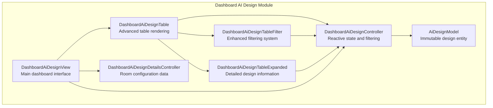
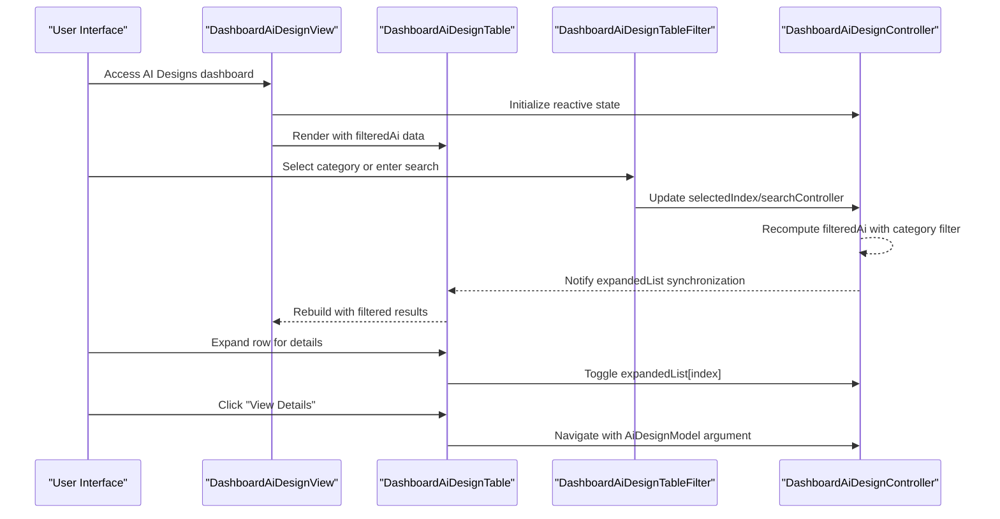
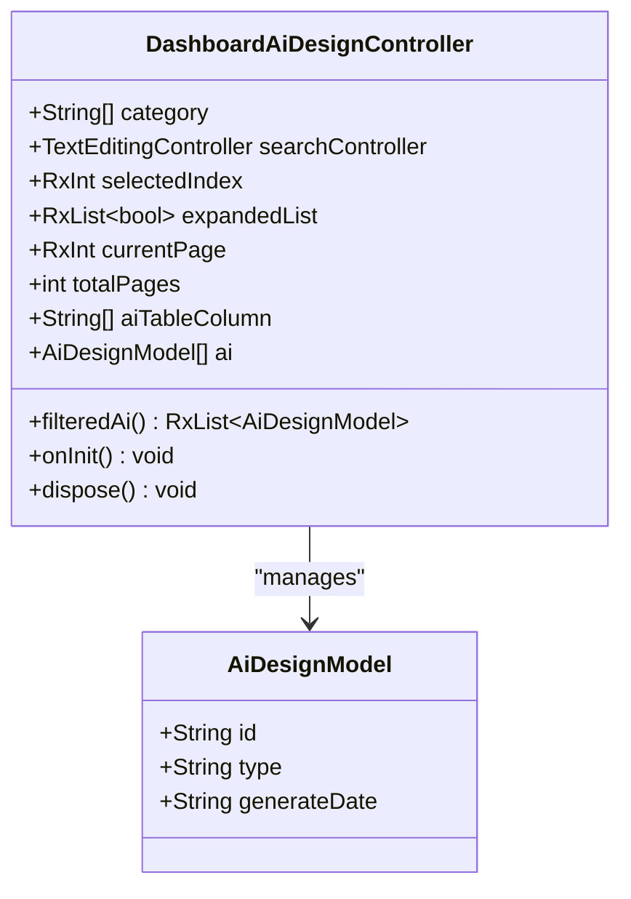
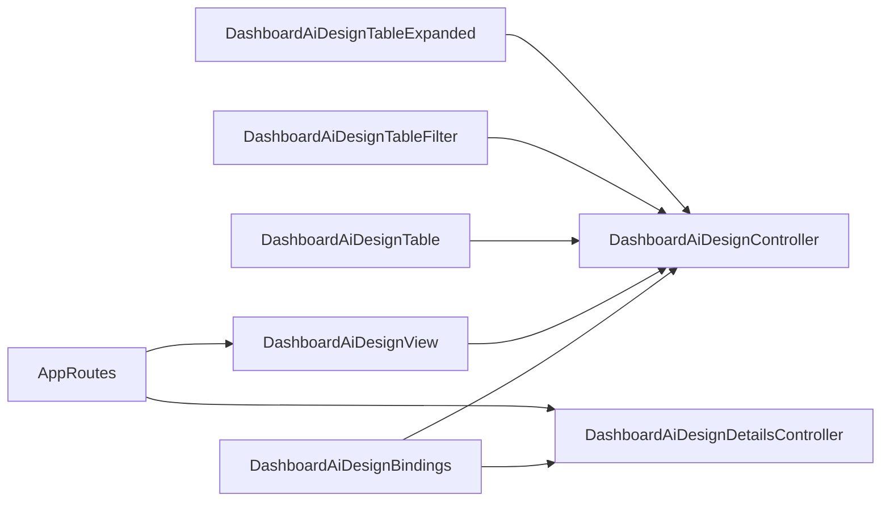

# AI Design Overview

<cite>
**Referenced Files in This Document**
- [dashboard_ai_design_controller.dart](file://lib/features/dashboard_ai_design/controller/dashboard_ai_design_controller.dart)
- [ai_design_model.dart](file://lib/features/dashboard_ai_design/models/ai_design_model.dart)
- [dashboard_ai_design_view.dart](file://lib/features/dashboard_ai_design/views/dashboard_ai_design_view.dart)
- [dashboard_ai_design_bindings.dart](file://lib/features/dashboard_ai_design/bindings/dashboard_ai_design_bindings.dart)
- [dashboard_ai_design_table.dart](file://lib/features/dashboard_ai_design/widgets/dashboard_ai_design_view_widgets/dashboard_ai_design_table.dart)
- [dashboard_ai_design_table_filter.dart](file://lib/features/dashboard_ai_design/widgets/dashboard_ai_design_view_widgets/dashboard_ai_design_table_filter.dart)
- [dashboard_ai_design_table_expanded.dart](file://lib/features/dashboard_ai_design/widgets/dashboard_ai_design_view_widgets/dashboard_ai_design_table_expanded.dart)
- [dashboard_ai_design_details_controller.dart](file://lib/features/dashboard_ai_design/controller/dashboard_ai_design_details_controller.dart)
- [app_routes.dart](file://lib/core/routes/app_routes.dart)
- [main.dart](file://lib/main.dart)
</cite>

## Update Summary
**Changes Made**
- Updated architecture to reflect new dashboard_ai_design module structure
- Replaced old ai_design naming convention with dashboard_ai_design
- Updated controller implementation with refined reactive state management
- Enhanced widget library with improved table components and filtering
- Streamlined binding configuration for better dependency injection
- Modernized UI components using shared widget library

## Table of Contents
1. [Introduction](#introduction)
2. [Project Structure](#project-structure)
3. [Core Components](#core-components)
4. [Architecture Overview](#architecture-overview)
5. [Detailed Component Analysis](#detailed-component-analysis)
6. [Dependency Analysis](#dependency-analysis)
7. [Performance Considerations](#performance-considerations)
8. [Troubleshooting Guide](#troubleshooting-guide)
9. [Conclusion](#conclusion)

## Introduction
This document provides a comprehensive overview of the AI Design Services feature, focusing on the newly restructured dashboard_ai_design module. The feature now implements a sophisticated controller system with advanced reactive state management using GetX, providing category filtering, search functionality, pagination, and design listing management. The architecture emphasizes clean separation of concerns with specialized controllers for different AI design types, including AI Product Placement and AI Interior Design services.

## Project Structure
The AI Design feature has been restructured into a modular dashboard_ai_design architecture:
- Controller: Advanced reactive state management with specialized controllers for different AI design types
- Model: Immutable data structure for AI design entities with generation metadata
- View: Comprehensive dashboard interface with navigation and design management
- Widgets: Sophisticated UI components built on shared widget library
- Bindings: Enhanced dependency injection configuration
- Routes: Integrated navigation system for design workflows

**Diagram sources**
- [dashboard_ai_design_controller.dart:5-71](file://lib/features/dashboard_ai_design/controller/dashboard_ai_design_controller.dart#L5-L71)
- [ai_design_model.dart:1-12](file://lib/features/dashboard_ai_design/models/ai_design_model.dart#L1-L12)
- [dashboard_ai_design_view.dart:14-55](file://lib/features/dashboard_ai_design/views/dashboard_ai_design_view.dart#L14-L55)
- [dashboard_ai_design_table.dart:13-72](file://lib/features/dashboard_ai_design/widgets/dashboard_ai_design_view_widgets/dashboard_ai_design_table.dart#L13-L72)
- [dashboard_ai_design_table_filter.dart:9-50](file://lib/features/dashboard_ai_design/widgets/dashboard_ai_design_view_widgets/dashboard_ai_design_table_filter.dart#L9-L50)
- [dashboard_ai_design_table_expanded.dart:12-52](file://lib/features/dashboard_ai_design/widgets/dashboard_ai_design_view_widgets/dashboard_ai_design_table_expanded.dart#L12-L52)
- [dashboard_ai_design_details_controller.dart:3-49](file://lib/features/dashboard_ai_design/controller/dashboard_ai_design_details_controller.dart#L3-L49)

**Section sources**
- [dashboard_ai_design_controller.dart:5-71](file://lib/features/dashboard_ai_design/controller/dashboard_ai_design_controller.dart#L5-L71)
- [ai_design_model.dart:1-12](file://lib/features/dashboard_ai_design/models/ai_design_model.dart#L1-L12)
- [dashboard_ai_design_view.dart:14-55](file://lib/features/dashboard_ai_design/views/dashboard_ai_design_view.dart#L14-L55)
- [dashboard_ai_design_table.dart:13-72](file://lib/features/dashboard_ai_design/widgets/dashboard_ai_design_view_widgets/dashboard_ai_design_table.dart#L13-L72)
- [dashboard_ai_design_table_filter.dart:9-50](file://lib/features/dashboard_ai_design/widgets/dashboard_ai_design_view_widgets/dashboard_ai_design_table_filter.dart#L9-L50)
- [dashboard_ai_design_table_expanded.dart:12-52](file://lib/features/dashboard_ai_design/widgets/dashboard_ai_design_view_widgets/dashboard_ai_design_table_expanded.dart#L12-L52)
- [dashboard_ai_design_details_controller.dart:3-49](file://lib/features/dashboard_ai_design/controller/dashboard_ai_design_details_controller.dart#L3-L49)

## Core Components
The dashboard_ai_design module introduces enhanced components with sophisticated functionality:

**DashboardAiDesignController**: Advanced reactive state management with:
- Multi-category filtering supporting 'All', 'AI Product Placement', and 'AI Interior Design'
- Real-time search functionality with TextEditingController integration
- Pagination state management with configurable total pages
- Computed property filteredAi for efficient list filtering
- Automatic expandedList synchronization with filtered results

**AiDesignModel**: Immutable data structure containing:
- Unique identifier (id) for design tracking
- Type classification (Product Placement or AI Interior Design)
- Generation timestamp for audit trails

**DashboardAiDesignView**: Comprehensive dashboard interface featuring:
- Custom app bar with drawer navigation
- Adaptive theming with dark/light mode support
- Integrated design table with pagination controls
- Responsive layout using ScreenUtil framework

**DashboardAiDesignTable**: Enhanced table rendering system:
- Advanced filtering integration with category dropdown
- Expandable row functionality with detailed information panels
- Action buttons with navigation capabilities
- Custom table component integration from shared library

**DashboardAiDesignTableFilter**: Sophisticated filtering interface:
- Category selection with reactive state binding
- Search input field with icon integration
- Custom form field components from shared library
- Responsive alignment and styling

**DashboardAiDesignTableExpanded**: Detailed information display:
- Key-value pair presentation for design metadata
- Action buttons with navigation to details view
- Theme-aware styling with adaptive colors
- Consistent spacing and typography

**DashboardAiDesignDetailsController**: Contextual data management:
- Room configuration details for design customization
- Structured data arrays for different design aspects
- Support for multiple room types and configurations

**Section sources**
- [dashboard_ai_design_controller.dart:5-71](file://lib/features/dashboard_ai_design/controller/dashboard_ai_design_controller.dart#L5-L71)
- [ai_design_model.dart:1-12](file://lib/features/dashboard_ai_design/models/ai_design_model.dart#L1-L12)
- [dashboard_ai_design_view.dart:14-55](file://lib/features/dashboard_ai_design/views/dashboard_ai_design_view.dart#L14-L55)
- [dashboard_ai_design_table.dart:13-72](file://lib/features/dashboard_ai_design/widgets/dashboard_ai_design_view_widgets/dashboard_ai_design_table.dart#L13-L72)
- [dashboard_ai_design_table_filter.dart:9-50](file://lib/features/dashboard_ai_design/widgets/dashboard_ai_design_view_widgets/dashboard_ai_design_table_filter.dart#L9-L50)
- [dashboard_ai_design_table_expanded.dart:12-52](file://lib/features/dashboard_ai_design/widgets/dashboard_ai_design_view_widgets/dashboard_ai_design_table_expanded.dart#L12-L52)
- [dashboard_ai_design_details_controller.dart:3-49](file://lib/features/dashboard_ai_design/controller/dashboard_ai_design_details_controller.dart#L3-L49)

## Architecture Overview
The dashboard_ai_design module implements a sophisticated unidirectional reactive architecture:

**Diagram sources**
- [dashboard_ai_design_view.dart:14-55](file://lib/features/dashboard_ai_design/views/dashboard_ai_design_view.dart#L14-L55)
- [dashboard_ai_design_table.dart:13-72](file://lib/features/dashboard_ai_design/widgets/dashboard_ai_design_view_widgets/dashboard_ai_design_table.dart#L13-L72)
- [dashboard_ai_design_table_filter.dart:9-50](file://lib/features/dashboard_ai_design/widgets/dashboard_ai_design_view_widgets/dashboard_ai_design_table_filter.dart#L9-L50)
- [dashboard_ai_design_controller.dart:40-69](file://lib/features/dashboard_ai_design/controller/dashboard_ai_design_controller.dart#L40-L69)

**Section sources**
- [dashboard_ai_design_view.dart:14-55](file://lib/features/dashboard_ai_design/views/dashboard_ai_design_view.dart#L14-L55)
- [dashboard_ai_design_table.dart:13-72](file://lib/features/dashboard_ai_design/widgets/dashboard_ai_design_view_widgets/dashboard_ai_design_table.dart#L13-L72)
- [dashboard_ai_design_table_filter.dart:9-50](file://lib/features/dashboard_ai_design/widgets/dashboard_ai_design_view_widgets/dashboard_ai_design_table_filter.dart#L9-L50)
- [dashboard_ai_design_controller.dart:40-69](file://lib/features/dashboard_ai_design/controller/dashboard_ai_design_controller.dart#L40-L69)

## Detailed Component Analysis

### DashboardAiDesignController
**Enhanced Responsibilities**:
- Manages sophisticated category filtering system with three design types
- Implements reactive search functionality with real-time filtering
- Handles pagination state with configurable total pages
- Provides computed property filteredAi with intelligent category-based filtering
- Automatically synchronizes expandedList with filtered results length
- Manages lifecycle with proper controller disposal

**Advanced Filtering Logic**:
- Category-based filtering supporting 'All', 'AI Product Placement', and 'AI Interior Design'
- Intelligent type matching with case-sensitive validation
- Observable list return for seamless reactive updates
- Efficient filtering algorithm with early termination

**Lifecycle Management**:
- Enhanced onInit with automatic expandedList initialization
- Reactive synchronization using ever() for filteredAi changes
- Proper searchController disposal in dispose()

**Diagram sources**
- [dashboard_ai_design_controller.dart:5-71](file://lib/features/dashboard_ai_design/controller/dashboard_ai_design_controller.dart#L5-L71)
- [ai_design_model.dart:1-12](file://lib/features/dashboard_ai_design/models/ai_design_model.dart#L1-L12)

**Section sources**
- [dashboard_ai_design_controller.dart:5-71](file://lib/features/dashboard_ai_design/controller/dashboard_ai_design_controller.dart#L5-L71)
- [ai_design_model.dart:1-12](file://lib/features/dashboard_ai_design/models/ai_design_model.dart#L1-L12)

### DashboardAiDesignView
**Comprehensive Dashboard Interface**:
- Custom app bar with drawer navigation integration
- Adaptive theming system supporting dark/light modes
- Shared container and text components for consistent styling
- Integrated pagination controls with reactive state binding
- Responsive layout using ScreenUtil framework for cross-device compatibility

**Navigation Integration**:
- Drawer navigation with custom drawer component
- Theme-aware text coloring based on brightness detection
- Container-based layout with proper spacing and padding

**Section sources**
- [dashboard_ai_design_view.dart:14-55](file://lib/features/dashboard_ai_design/views/dashboard_ai_design_view.dart#L14-L55)

### DashboardAiDesignTable
**Advanced Table Rendering System**:
- Sophisticated filtering integration with category dropdown
- Expandable row functionality with detailed information panels
- Action buttons with navigation capabilities using AppRoutes
- Custom table component integration from shared library
- Reactive state management with Obx for efficient updates

**Data Transformation Pipeline**:
- Mapping AiDesignModel instances to table row data structures
- Local copy of expandedList to prevent unnecessary rebuilds
- Header configuration with custom column definitions
- ActionBuilder pattern for row-specific actions

**Section sources**
- [dashboard_ai_design_table.dart:13-72](file://lib/features/dashboard_ai_design/widgets/dashboard_ai_design_view_widgets/dashboard_ai_design_table.dart#L13-L72)

### DashboardAiDesignTableFilter
**Sophisticated Filtering Interface**:
- Category selection with reactive state binding using Obx
- Search input field with icon integration and custom styling
- Custom form field components from shared widget library
- Responsive alignment and sizing using ScreenUtil framework

**Enhanced User Experience**:
- Custom table filter component for category selection
- Text form field with search icon and proper styling
- Right-aligned search field for compact layout
- Reactive updates based on controller state changes

**Section sources**
- [dashboard_ai_design_table_filter.dart:9-50](file://lib/features/dashboard_ai_design/widgets/dashboard_ai_design_view_widgets/dashboard_ai_design_table_filter.dart#L9-L50)

### DashboardAiDesignTableExpanded
**Detailed Information Display**:
- Key-value pair presentation for design metadata with proper spacing
- Action buttons with navigation to details view using AppRoutes
- Theme-aware styling with adaptive colors based on brightness
- Consistent typography and spacing using ScreenUtil framework

**Information Architecture**:
- Type display with proper labeling
- Generation date with descriptive title
- Action section with prominent call-to-action button
- Responsive layout with appropriate spacing

**Section sources**
- [dashboard_ai_design_table_expanded.dart:12-52](file://lib/features/dashboard_ai_design/widgets/dashboard_ai_design_view_widgets/dashboard_ai_design_table_expanded.dart#L12-L52)

### DashboardAiDesignDetailsController
**Contextual Data Management**:
- Room configuration details for comprehensive design customization
- Structured data arrays for different design aspects and preferences
- Support for multiple room types with detailed specifications
- Organized data structure for practical design implementation

**Data Organization**:
- Nested arrays for room-specific details
- Structured key-value pairs for configuration options
- Multiple room support with consistent data patterns
- Comprehensive design preference management

**Section sources**
- [dashboard_ai_design_details_controller.dart:3-49](file://lib/features/dashboard_ai_design/controller/dashboard_ai_design_details_controller.dart#L3-L49)

### Enhanced Binding Configuration and Routing
**Improved Dependency Injection**:
- DashboardAiDesignBindings with lazy loading for optimized performance
- Separate controller registration for main and details controllers
- Modular binding system supporting future expansion

**Routing Integration**:
- AppRoutes with dedicated endpoints for dashboard AI design views
- Argument passing for model data transfer between screens
- Navigation integration with Get.toNamed for reactive navigation

**Section sources**
- [dashboard_ai_design_bindings.dart:5-12](file://lib/features/dashboard_ai_design/bindings/dashboard_ai_design_bindings.dart#L5-L12)
- [app_routes.dart:24-25](file://lib/core/routes/app_routes.dart#L24-L25)
- [main.dart:12-46](file://lib/main.dart#L12-L46)

## Dependency Analysis
The dashboard_ai_design module demonstrates improved architectural patterns with enhanced modularity and separation of concerns:

**Low Coupling, High Cohesion**:
- Controllers encapsulate specific business logic and state management
- Views depend on controllers through GetView/GetWidget inheritance
- Widgets are self-contained with minimal external dependencies
- Bindings provide clean dependency injection without tight coupling

**Enhanced Component Relationships**:
- DashboardAiDesignController manages AiDesignModel instances
- DashboardAiDesignTable integrates with filtering and expansion systems
- DashboardAiDesignTableFilter provides reactive category selection
- DashboardAiDesignTableExpanded handles detailed information display
- DashboardAiDesignDetailsController supplies contextual data

**Diagram sources**
- [dashboard_ai_design_bindings.dart:5-12](file://lib/features/dashboard_ai_design/bindings/dashboard_ai_design_bindings.dart#L5-L12)
- [dashboard_ai_design_controller.dart:5-71](file://lib/features/dashboard_ai_design/controller/dashboard_ai_design_controller.dart#L5-L71)
- [dashboard_ai_design_details_controller.dart:3-49](file://lib/features/dashboard_ai_design/controller/dashboard_ai_design_details_controller.dart#L3-L49)
- [dashboard_ai_design_view.dart:14-55](file://lib/features/dashboard_ai_design/views/dashboard_ai_design_view.dart#L14-L55)
- [dashboard_ai_design_table.dart:13-72](file://lib/features/dashboard_ai_design/widgets/dashboard_ai_design_view_widgets/dashboard_ai_design_table.dart#L13-L72)
- [dashboard_ai_design_table_filter.dart:9-50](file://lib/features/dashboard_ai_design/widgets/dashboard_ai_design_view_widgets/dashboard_ai_design_table_filter.dart#L9-L50)
- [dashboard_ai_design_table_expanded.dart:12-52](file://lib/features/dashboard_ai_design/widgets/dashboard_ai_design_view_widgets/dashboard_ai_design_table_expanded.dart#L12-L52)
- [app_routes.dart:24-25](file://lib/core/routes/app_routes.dart#L24-L25)

**Section sources**
- [dashboard_ai_design_bindings.dart:5-12](file://lib/features/dashboard_ai_design/bindings/dashboard_ai_design_bindings.dart#L5-L12)
- [dashboard_ai_design_controller.dart:5-71](file://lib/features/dashboard_ai_design/controller/dashboard_ai_design_controller.dart#L5-L71)
- [dashboard_ai_design_details_controller.dart:3-49](file://lib/features/dashboard_ai_design/controller/dashboard_ai_design_details_controller.dart#L3-L49)
- [dashboard_ai_design_view.dart:14-55](file://lib/features/dashboard_ai_design/views/dashboard_ai_design_view.dart#L14-L55)
- [dashboard_ai_design_table.dart:13-72](file://lib/features/dashboard_ai_design/widgets/dashboard_ai_design_view_widgets/dashboard_ai_design_table.dart#L13-L72)
- [dashboard_ai_design_table_filter.dart:9-50](file://lib/features/dashboard_ai_design/widgets/dashboard_ai_design_view_widgets/dashboard_ai_design_table_filter.dart#L9-L50)
- [dashboard_ai_design_table_expanded.dart:12-52](file://lib/features/dashboard_ai_design/widgets/dashboard_ai_design_view_widgets/dashboard_ai_design_table_expanded.dart#L12-L52)
- [app_routes.dart:24-25](file://lib/core/routes/app_routes.dart#L24-L25)

## Performance Considerations
**Optimized Reactive Architecture**:
- Computed properties with filteredAi ensure efficient filtering only when dependencies change
- Reactive lists using obs collections minimize unnecessary rebuild cycles
- Local expandedList copies prevent per-row recomputation overhead
- Lazy loading in bindings optimizes memory usage

**Enhanced State Management**:
- Automatic expandedList synchronization prevents state inconsistencies
- Proper controller disposal prevents memory leaks
- Reactive pagination with constant total pages for predictable performance
- Efficient category filtering with early termination logic

**Scalability Considerations**:
- Modular architecture supports easy addition of new AI design types
- Shared widget library reduces code duplication and improves maintainability
- Responsive design framework (ScreenUtil) ensures optimal performance across devices
- Future enhancements can leverage existing reactive patterns

## Troubleshooting Guide
**Common Issues and Solutions**:
- **Category filter not updating**: Verify selectedIndex binding and computed filteredAi observation in table
- **Expanded rows not toggling**: Check onExpand callback implementation and controller.expandedList updates
- **Search functionality issues**: Confirm searchController binding and filteredAi reactive updates
- **Navigation failures**: Validate AppRoutes endpoints and AiDesignModel argument passing
- **Memory leaks**: Ensure proper controller disposal and searchController cleanup
- **Layout responsiveness**: Verify ScreenUtil usage and responsive widget implementations

**Enhanced Debugging Approaches**:
- Utilize GetX debugging tools for reactive state inspection
- Monitor filteredAi recomputation logs for performance optimization
- Check expandedList synchronization with filteredAi length
- Validate route parameter passing for navigation flows

**Section sources**
- [dashboard_ai_design_controller.dart:56-69](file://lib/features/dashboard_ai_design/controller/dashboard_ai_design_controller.dart#L56-L69)
- [dashboard_ai_design_table.dart:41-43](file://lib/features/dashboard_ai_design/widgets/dashboard_ai_design_view_widgets/dashboard_ai_design_table.dart#L41-L43)
- [dashboard_ai_design_table_filter.dart:32-43](file://lib/features/dashboard_ai_design/widgets/dashboard_ai_design_view_widgets/dashboard_ai_design_table_filter.dart#L32-L43)
- [app_routes.dart:24-25](file://lib/core/routes/app_routes.dart#L24-L25)

## Conclusion
The dashboard_ai_design module represents a significant advancement in AI-powered design services architecture. The restructured implementation leverages sophisticated GetX reactive patterns, providing enhanced modularity, scalability, and maintainability. The new architecture successfully separates concerns between different AI design types while maintaining cohesive functionality. The integration of shared widget libraries, advanced filtering systems, and responsive design frameworks creates a robust foundation for future AI design service expansions. This implementation demonstrates best practices in modern Flutter development with reactive state management, clean architecture principles, and comprehensive user experience considerations.