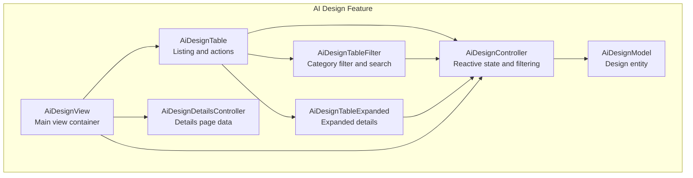
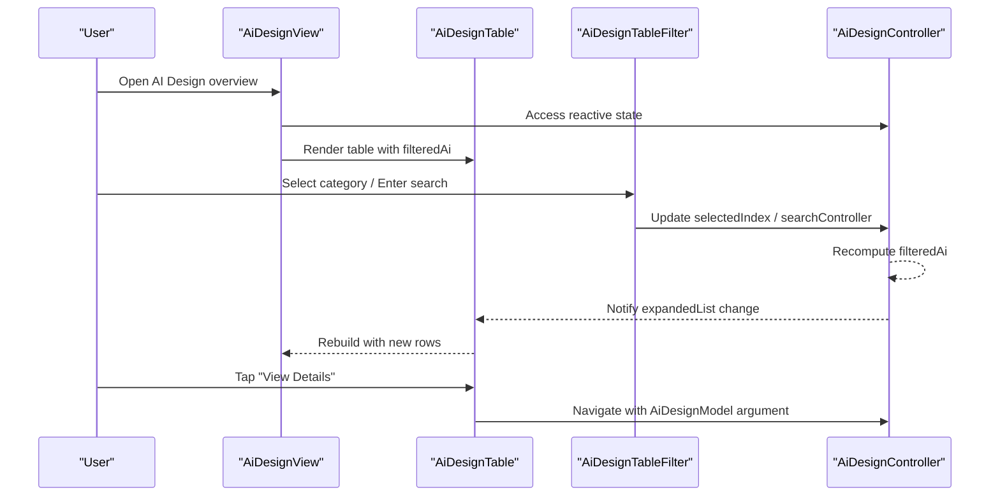
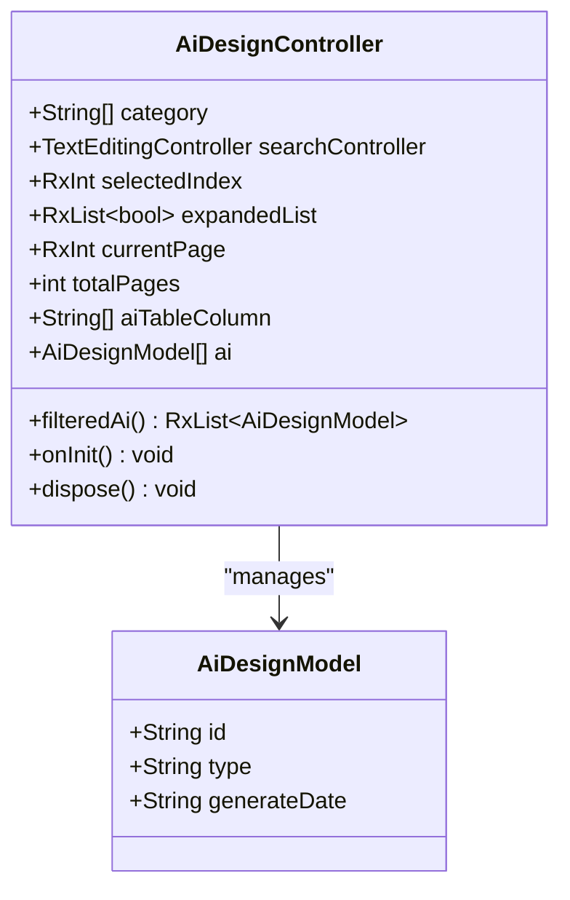
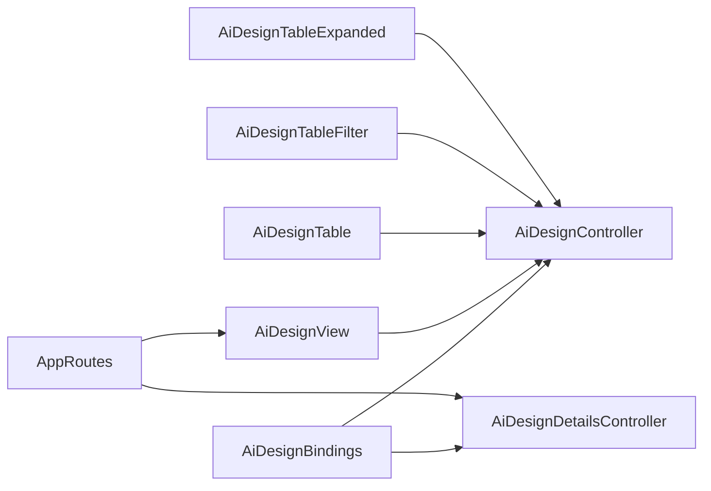

# AI Design Overview

<cite>
**Referenced Files in This Document**
- [ai_design_controller.dart](file://lib/features/ai_design/controller/ai_design_controller.dart)
- [ai_design_model.dart](file://lib/features/ai_design/models/ai_design_model.dart)
- [ai_design_view.dart](file://lib/features/ai_design/views/ai_design_view.dart)
- [ai_design_bindings.dart](file://lib/features/ai_design/bindings/ai_design_bindings.dart)
- [ai_design_table.dart](file://lib/features/ai_design/widgets/ai_design_view_widgets/ai_design_table.dart)
- [ai_design_table_filter.dart](file://lib/features/ai_design/widgets/ai_design_view_widgets/ai_design_table_filter.dart)
- [ai_design_table_expanded.dart](file://lib/features/ai_design/widgets/ai_design_view_widgets/ai_design_table_expanded.dart)
- [ai_design_details_controller.dart](file://lib/features/ai_design/controller/ai_design_details_controller.dart)
- [app_routes.dart](file://lib/core/routes/app_routes.dart)
- [main.dart](file://lib/main.dart)
</cite>

## Table of Contents
1. [Introduction](#introduction)
2. [Project Structure](#project-structure)
3. [Core Components](#core-components)
4. [Architecture Overview](#architecture-overview)
5. [Detailed Component Analysis](#detailed-component-analysis)
6. [Dependency Analysis](#dependency-analysis)
7. [Performance Considerations](#performance-considerations)
8. [Troubleshooting Guide](#troubleshooting-guide)
9. [Conclusion](#conclusion)

## Introduction
This document provides a comprehensive overview of the AI Design Services feature, focusing on the AI design overview section. It explains the main AI design controller implementation, including category filtering, search functionality, pagination, and design listing management. It details the controller's reactive state management using GetX, including the filteredAi computed property and expandedList handling. It covers the binding configuration and initialization process, the main AI design view structure, layout components, and user interface patterns. It documents the design model structure and the data flow between the controller and the view. Finally, it outlines the business logic for design categorization and filtering mechanisms.

## Project Structure
The AI Design feature is organized into distinct layers:
- Controller: Implements business logic and reactive state using GetX.
- Model: Defines the data structure for AI designs.
- View: Renders the UI and orchestrates widgets.
- Widgets: Reusable UI components for table rendering, filtering, and expanded details.
- Bindings: Configure dependency injection for controllers.
- Routes: Define navigation endpoints for views.

**Diagram sources**
- [ai_design_controller.dart:1-71](file://lib/features/ai_design/controller/ai_design_controller.dart#L1-L71)
- [ai_design_model.dart:1-12](file://lib/features/ai_design/models/ai_design_model.dart#L1-L12)
- [ai_design_view.dart:14-54](file://lib/features/ai_design/views/ai_design_view.dart#L14-L54)
- [ai_design_table.dart:13-71](file://lib/features/ai_design/widgets/ai_design_view_widgets/ai_design_table.dart#L13-L71)
- [ai_design_table_filter.dart:9-49](file://lib/features/ai_design/widgets/ai_design_view_widgets/ai_design_table_filter.dart#L9-L49)
- [ai_design_table_expanded.dart:12-51](file://lib/features/ai_design/widgets/ai_design_view_widgets/ai_design_table_expanded.dart#L12-L51)
- [ai_design_details_controller.dart:3-48](file://lib/features/ai_design/controller/ai_design_details_controller.dart#L3-L48)

**Section sources**
- [ai_design_controller.dart:1-71](file://lib/features/ai_design/controller/ai_design_controller.dart#L1-L71)
- [ai_design_model.dart:1-12](file://lib/features/ai_design/models/ai_design_model.dart#L1-L12)
- [ai_design_view.dart:14-54](file://lib/features/ai_design/views/ai_design_view.dart#L14-L54)
- [ai_design_table.dart:13-71](file://lib/features/ai_design/widgets/ai_design_view_widgets/ai_design_table.dart#L13-L71)
- [ai_design_table_filter.dart:9-49](file://lib/features/ai_design/widgets/ai_design_view_widgets/ai_design_table_filter.dart#L9-L49)
- [ai_design_table_expanded.dart:12-51](file://lib/features/ai_design/widgets/ai_design_view_widgets/ai_design_table_expanded.dart#L12-L51)
- [ai_design_details_controller.dart:3-48](file://lib/features/ai_design/controller/ai_design_details_controller.dart#L3-L48)

## Core Components
- AiDesignController: Manages reactive state, category selection, search input, pagination state, and filtered design lists. It exposes a computed property for filteredAi and maintains expandedList for expandable rows.
- AiDesignModel: Immutable data model representing a single AI design entry with identifiers and metadata.
- AiDesignView: Top-level view that renders the app bar, title, design table, and pagination controls.
- AiDesignTable: Renders the design list as a table, integrates filters, and manages expand/collapse behavior.
- AiDesignTableFilter: Provides category filtering and a search input bound to the controller.
- AiDesignTableExpanded: Displays detailed information for an expanded row and triggers navigation to the details view.
- AiDesignDetailsController: Supplies contextual details data for the design details page.

Key reactive state highlights:
- Reactive category selection via selectedIndex.
- Reactive search input via searchController.
- Reactive pagination state via currentPage.
- Computed filteredAi list derived from category and search.
- Reactive expandedList synchronized with filteredAi length.

**Section sources**
- [ai_design_controller.dart:5-71](file://lib/features/ai_design/controller/ai_design_controller.dart#L5-L71)
- [ai_design_model.dart:1-12](file://lib/features/ai_design/models/ai_design_model.dart#L1-L12)
- [ai_design_view.dart:14-54](file://lib/features/ai_design/views/ai_design_view.dart#L14-L54)
- [ai_design_table.dart:13-71](file://lib/features/ai_design/widgets/ai_design_view_widgets/ai_design_table.dart#L13-L71)
- [ai_design_table_filter.dart:9-49](file://lib/features/ai_design/widgets/ai_design_view_widgets/ai_design_table_filter.dart#L9-L49)
- [ai_design_table_expanded.dart:12-51](file://lib/features/ai_design/widgets/ai_design_view_widgets/ai_design_table_expanded.dart#L12-L51)
- [ai_design_details_controller.dart:3-48](file://lib/features/ai_design/controller/ai_design_details_controller.dart#L3-L48)

## Architecture Overview
The AI Design feature follows a unidirectional reactive flow:
- Controllers hold state and expose computed properties.
- Views observe controller state and rebuild reactively.
- Widgets encapsulate presentation and trigger controller updates.
- Navigation routes connect views and pass model arguments.

**Diagram sources**
- [ai_design_view.dart:14-54](file://lib/features/ai_design/views/ai_design_view.dart#L14-L54)
- [ai_design_table.dart:13-71](file://lib/features/ai_design/widgets/ai_design_view_widgets/ai_design_table.dart#L13-L71)
- [ai_design_table_filter.dart:9-49](file://lib/features/ai_design/widgets/ai_design_view_widgets/ai_design_table_filter.dart#L9-L49)
- [ai_design_controller.dart:40-63](file://lib/features/ai_design/controller/ai_design_controller.dart#L40-L63)

**Section sources**
- [ai_design_view.dart:14-54](file://lib/features/ai_design/views/ai_design_view.dart#L14-L54)
- [ai_design_table.dart:13-71](file://lib/features/ai_design/widgets/ai_design_view_widgets/ai_design_table.dart#L13-L71)
- [ai_design_table_filter.dart:9-49](file://lib/features/ai_design/widgets/ai_design_view_widgets/ai_design_table_filter.dart#L9-L49)
- [ai_design_controller.dart:40-63](file://lib/features/ai_design/controller/ai_design_controller.dart#L40-L63)

## Detailed Component Analysis

### AiDesignController
Responsibilities:
- Maintains category list, selected index, search controller, pagination state, and table column headers.
- Exposes filteredAi as a computed property that filters the ai list based on category selection.
- Synchronizes expandedList with the length of filteredAi upon recomputation.
- Initializes reactive lists and disposes of the search controller.

Filtered logic:
- When the selected index is All, returns the full list.
- Otherwise, filters by type matching the selected category.
- Returns an observable list for reactive updates.

Initialization and lifecycle:
- onInit sets up listeners to synchronize expandedList with filteredAi length.
- dispose handles controller cleanup.

**Diagram sources**
- [ai_design_controller.dart:5-71](file://lib/features/ai_design/controller/ai_design_controller.dart#L5-L71)
- [ai_design_model.dart:1-12](file://lib/features/ai_design/models/ai_design_model.dart#L1-L12)

**Section sources**
- [ai_design_controller.dart:5-71](file://lib/features/ai_design/controller/ai_design_controller.dart#L5-L71)
- [ai_design_model.dart:1-12](file://lib/features/ai_design/models/ai_design_model.dart#L1-L12)

### AiDesignModel
Structure:
- Immutable fields for id, type, and generateDate.
- Used across controllers and views for consistent data representation.

Complexity:
- O(1) access for all fields.
- Suitable for repeated rendering in lists.

**Section sources**
- [ai_design_model.dart:1-12](file://lib/features/ai_design/models/ai_design_model.dart#L1-L12)

### AiDesignView
Layout and composition:
- Uses a custom container and list layout.
- Renders an app bar, title, design table, and pagination controls.
- Reads current theme brightness to adapt text colors.

Integration:
- Depends on AiDesignController for pagination and reactive state.
- Hosts AiDesignTable and CustomPagination components.

**Section sources**
- [ai_design_view.dart:14-54](file://lib/features/ai_design/views/ai_design_view.dart#L14-L54)

### AiDesignTable
Rendering pipeline:
- Renders AiDesignTableFilter at the top.
- Builds table rows from filteredAi, mapping each AiDesignModel to a row map.
- Passes headerList, expandedList, and onExpand callback to CustomTable.
- Provides actionBuilder to navigate to the details view with AiDesignModel as argument.
- Uses buildExpanded to render AiDesignTableExpanded for each row.

Reactive behavior:
- Observes filteredAi via Obx to rebuild when the list changes.
- Uses a local copy of expandedList to avoid unnecessary rebuilds.

**Section sources**
- [ai_design_table.dart:13-71](file://lib/features/ai_design/widgets/ai_design_view_widgets/ai_design_table.dart#L13-L71)

### AiDesignTableFilter
Filtering and search:
- Exposes a category filter controlled by selectedIndex.
- Updates controller.selectedIndex when a category is tapped.
- Provides a search text field bound to controller.searchController.

UI pattern:
- Uses Obx to reactively update the filter UI when selectedIndex changes.
- Aligns the search field to the right for compact layout.

**Section sources**
- [ai_design_table_filter.dart:9-49](file://lib/features/ai_design/widgets/ai_design_view_widgets/ai_design_table_filter.dart#L9-L49)

### AiDesignTableExpanded
Expanded details:
- Displays key-value pairs for design metadata.
- Provides a button to navigate to the details view with AiDesignModel as argument.

UI pattern:
- Uses theme-aware text colors and spacing.
- Integrates with the routing system to pass model arguments.

**Section sources**
- [ai_design_table_expanded.dart:12-51](file://lib/features/ai_design/widgets/ai_design_view_widgets/ai_design_table_expanded.dart#L12-L51)

### AiDesignDetailsController
Details page data:
- Supplies room-related details and titles for the design details view.
- Supports multiple rooms and structured detail entries.

Usage:
- Accessed from the details view to render contextual information.

**Section sources**
- [ai_design_details_controller.dart:3-48](file://lib/features/ai_design/controller/ai_design_details_controller.dart#L3-L48)

### Binding Configuration and Initialization
- AiDesignBindings registers AiDesignController and AiDesignDetailsController using lazy loading for dependency injection.
- The bindings are integrated into the application bootstrap process.

Routing:
- AppRoutes defines aiDesignView and aiDesignDetailsView endpoints used for navigation.

**Section sources**
- [ai_design_bindings.dart:5-11](file://lib/features/ai_design/bindings/ai_design_bindings.dart#L5-L11)
- [app_routes.dart:24-25](file://lib/core/routes/app_routes.dart#L24-L25)
- [main.dart:12-46](file://lib/main.dart#L12-L46)

## Dependency Analysis
The AI Design feature exhibits low coupling and high cohesion:
- Controllers own state and business logic.
- Views depend on controllers via GetView/GetWidget.
- Widgets depend on controllers via GetWidget and are self-contained.
- Bindings decouple instantiation from usage.

**Diagram sources**
- [ai_design_bindings.dart:5-11](file://lib/features/ai_design/bindings/ai_design_bindings.dart#L5-L11)
- [ai_design_controller.dart:5-71](file://lib/features/ai_design/controller/ai_design_controller.dart#L5-L71)
- [ai_design_details_controller.dart:3-48](file://lib/features/ai_design/controller/ai_design_details_controller.dart#L3-L48)
- [ai_design_view.dart:14-54](file://lib/features/ai_design/views/ai_design_view.dart#L14-L54)
- [ai_design_table.dart:13-71](file://lib/features/ai_design/widgets/ai_design_view_widgets/ai_design_table.dart#L13-L71)
- [ai_design_table_filter.dart:9-49](file://lib/features/ai_design/widgets/ai_design_view_widgets/ai_design_table_filter.dart#L9-L49)
- [ai_design_table_expanded.dart:12-51](file://lib/features/ai_design/widgets/ai_design_view_widgets/ai_design_table_expanded.dart#L12-L51)
- [app_routes.dart:24-25](file://lib/core/routes/app_routes.dart#L24-L25)

**Section sources**
- [ai_design_bindings.dart:5-11](file://lib/features/ai_design/bindings/ai_design_bindings.dart#L5-L11)
- [ai_design_controller.dart:5-71](file://lib/features/ai_design/controller/ai_design_controller.dart#L5-L71)
- [ai_design_details_controller.dart:3-48](file://lib/features/ai_design/controller/ai_design_details_controller.dart#L3-L48)
- [ai_design_view.dart:14-54](file://lib/features/ai_design/views/ai_design_view.dart#L14-L54)
- [ai_design_table.dart:13-71](file://lib/features/ai_design/widgets/ai_design_view_widgets/ai_design_table.dart#L13-L71)
- [ai_design_table_filter.dart:9-49](file://lib/features/ai_design/widgets/ai_design_view_widgets/ai_design_table_filter.dart#L9-L49)
- [ai_design_table_expanded.dart:12-51](file://lib/features/ai_design/widgets/ai_design_view_widgets/ai_design_table_expanded.dart#L12-L51)
- [app_routes.dart:24-25](file://lib/core/routes/app_routes.dart#L24-L25)

## Performance Considerations
- Computed properties: filteredAi recomputes only when dependencies change, minimizing unnecessary work.
- Reactive lists: Using obs collections ensures targeted rebuilds via GetX observers.
- Expand/collapse: expandedList is rebuilt only when filteredAi length changes, avoiding per-row recomputation.
- Pagination: currentPage is reactive but total pages are constant; consider dynamic pagination if backend paging is introduced.
- Search: Current search is client-side; for large datasets, consider server-side filtering or debounced search.

## Troubleshooting Guide
Common issues and resolutions:
- Category filter not updating: Ensure selectedIndex is properly bound and the computed filteredAi is observed in the table.
- Expanded rows not toggling: Verify onExpand callback updates controller.expandedList at the correct index.
- Search not applying: Confirm searchController is bound to the filter input and that filteredAi reflects the search criteria.
- Navigation failures: Check that AppRoutes endpoints are defined and that AiDesignModel is passed as an argument during navigation.
- Memory leaks: Ensure controllers are disposed and searchController is disposed in onInit/dispose lifecycle hooks.

**Section sources**
- [ai_design_controller.dart:56-69](file://lib/features/ai_design/controller/ai_design_controller.dart#L56-L69)
- [ai_design_table.dart:41-43](file://lib/features/ai_design/widgets/ai_design_view_widgets/ai_design_table.dart#L41-L43)
- [ai_design_table_filter.dart:32-43](file://lib/features/ai_design/widgets/ai_design_view_widgets/ai_design_table_filter.dart#L32-L43)
- [app_routes.dart:24-25](file://lib/core/routes/app_routes.dart#L24-L25)

## Conclusion
The AI Design overview feature leverages GetX for reactive state management, providing a clean separation of concerns between controllers, models, views, and widgets. The AiDesignController encapsulates filtering, search, pagination, and expandable row state, while the view and widgets render the UI and handle user interactions. The binding configuration and routing integrate seamlessly into the application architecture, enabling scalable enhancements such as server-side pagination and advanced search capabilities.