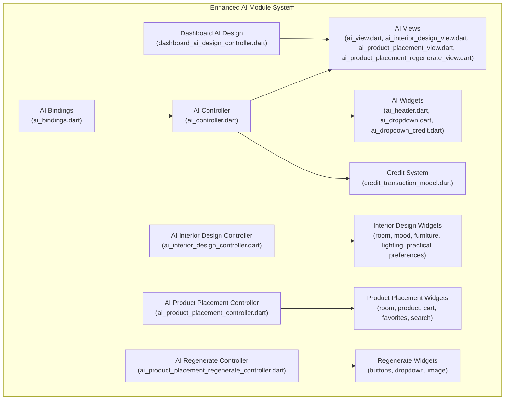
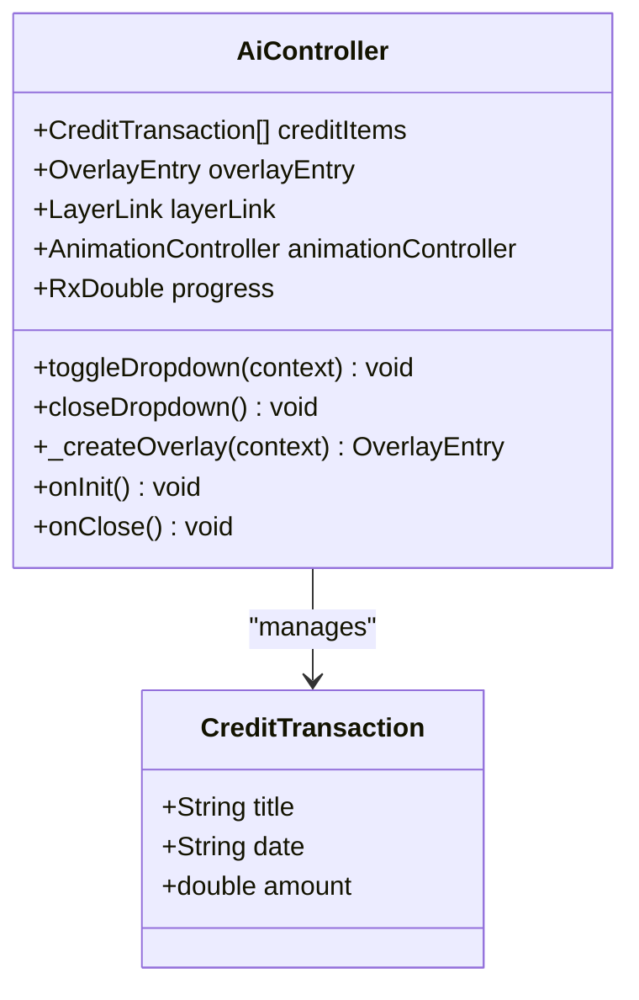
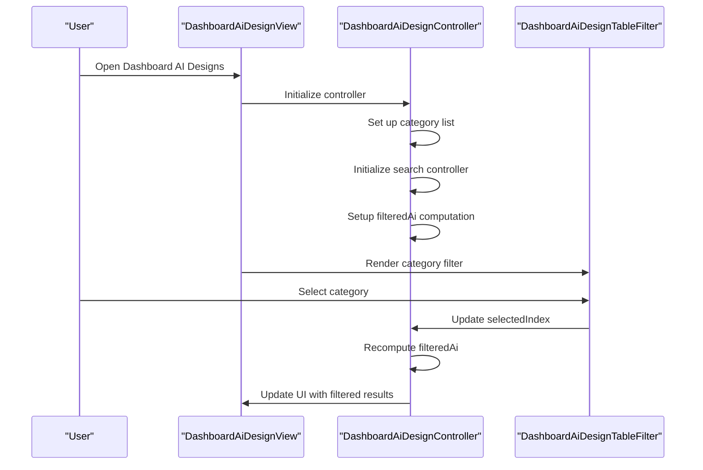
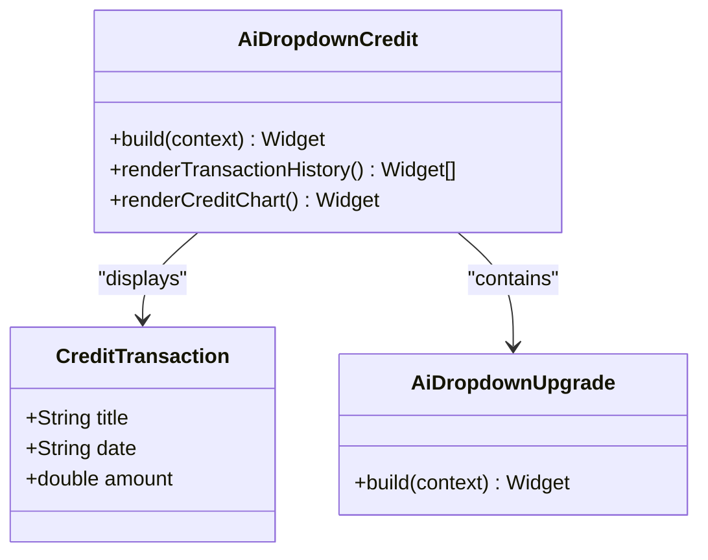
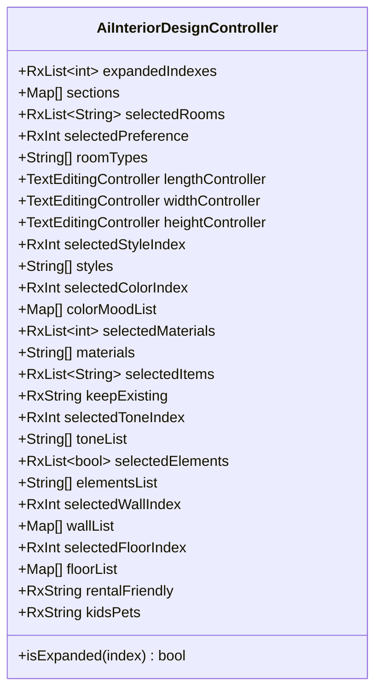
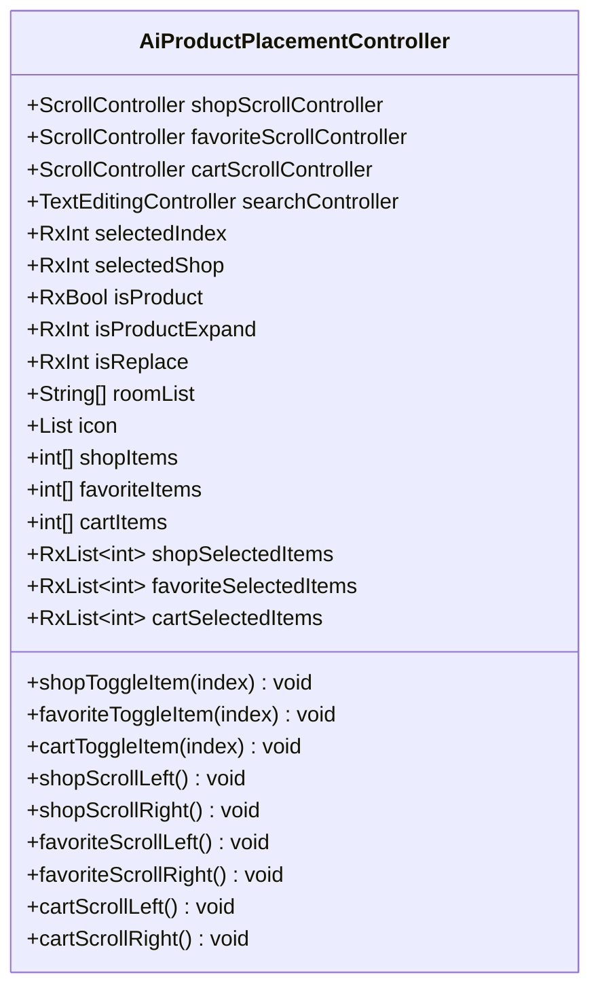
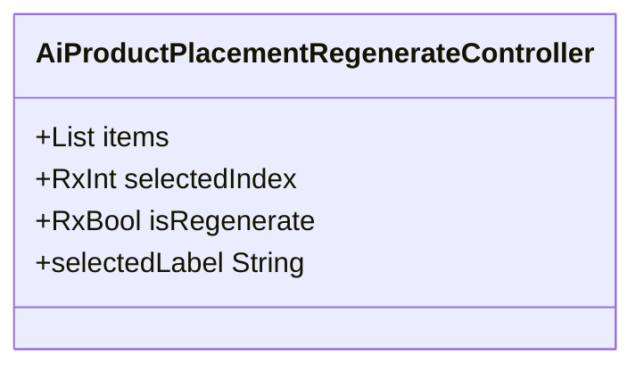
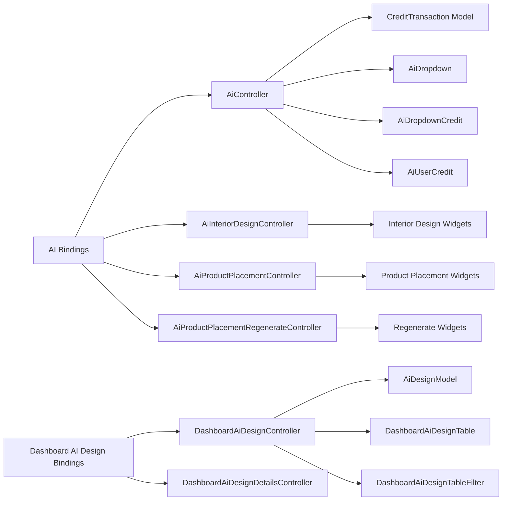

# AI Design Services

<cite>
**Referenced Files in This Document**
- [ai_controller.dart](file://lib/features/ai/controller/ai_controller.dart)
- [ai_interior_design_controller.dart](file://lib/features/ai/controller/ai_interior_design_controller.dart)
- [ai_product_placement_controller.dart](file://lib/features/ai/controller/ai_product_placement_controller.dart)
- [ai_product_placement_regenerate_controller.dart](file://lib/features/ai/controller/ai_product_placement_regenerate_controller.dart)
- [ai_bindings.dart](file://lib/features/ai/bindings/ai_bindings.dart)
- [ai_interior_design_bindings.dart](file://lib/features/ai/bindings/ai_interior_design_bindings.dart)
- [ai_product_placement_bindings.dart](file://lib/features/ai/bindings/ai_product_placement_bindings.dart)
- [ai_product_placement_regenerate_bindings.dart](file://lib/features/ai/bindings/ai_product_placement_regenerate_bindings.dart)
- [ai_view.dart](file://lib/features/ai/views/ai_view.dart)
- [ai_interior_design_view.dart](file://lib/features/ai/views/ai_interior_design_view.dart)
- [ai_product_placement_view.dart](file://lib/features/ai/views/ai_product_placement_view.dart)
- [ai_product_placement_regenerate_view.dart](file://lib/features/ai/views/ai_product_placement_regenerate_view.dart)
- [ai_header.dart](file://lib/features/ai/widgets/ai_header.dart)
- [ai_dropdown.dart](file://lib/features/ai/widgets/ai_view_widgets/ai_dropdown.dart)
- [ai_dropdown_credit.dart](file://lib/features/ai/widgets/ai_view_widgets/ai_dropdown_credit.dart)
- [ai_dropdown_upgrade.dart](file://lib/features/ai/widgets/ai_view_widgets/ai_dropdown_upgrade.dart)
- [ai_user_credit.dart](file://lib/features/ai/widgets/ai_view_widgets/ai_user_credit.dart)
- [ai_view_image.dart](file://lib/features/ai/widgets/ai_view_widgets/ai_view_image.dart)
- [ai_interior_design_preference_room.dart](file://lib/features/ai/widgets/ai_interior_design_widgets/ai_interior_design_preference_room.dart)
- [ai_interior_design_preference_room_type.dart](file://lib/features/ai/widgets/ai_interior_design_widgets/ai_interior_design_preference_room_type.dart)
- [ai_interior_design_preference_room_field.dart](file://lib/features/ai/widgets/ai_interior_design_widgets/ai_interior_design_preference_room_field.dart)
- [ai_interior_design_preference_mood.dart](file://lib/features/ai/widgets/ai_interior_design_widgets/ai_interior_design_preference_mood.dart)
- [ai_interior_design_preference_mood_color.dart](file://lib/features/ai/widgets/ai_interior_design_widgets/ai_interior_design_preference_mood_color.dart)
- [ai_interior_design_preference_mood_style.dart](file://lib/features/ai/widgets/ai_interior_design_widgets/ai_interior_design_preference_mood_style.dart)
- [ai_interior_design_preference_furniture.dart](file://lib/features/ai/widgets/ai_interior_design_widgets/ai_interior_design_preference_furniture.dart)
- [ai_interior_design_preference_lighting.dart](file://lib/features/ai/widgets/ai_interior_design_widgets/ai_interior_design_preference_lighting.dart)
- [ai_interior_design_preference_lighting_wall.dart](file://lib/features/ai/widgets/ai_interior_design_widgets/ai_interior_design_preference_lighting_wall.dart)
- [ai_interior_design_preference_lighting_floor.dart](file://lib/features/ai/widgets/ai_interior_design_widgets/ai_interior_design_preference_lighting_floor.dart)
- [ai_interior_design_preference_practical.dart](file://lib/features/ai/widgets/ai_interior_design_widgets/ai_interior_design_preference_practical.dart)
- [ai_product_placement_room.dart](file://lib/features/ai/widgets/ai_product_placement_widgets/ai_product_placement_room.dart)
- [ai_product_placement_product.dart](file://lib/features/ai/widgets/ai_product_placement_widgets/ai_product_placement_product.dart)
- [ai_product_placement_product_cart.dart](file://lib/features/ai/widgets/ai_product_placement_widgets/ai_product_placement_product_cart.dart)
- [ai_product_placement_product_cart_select.dart](file://lib/features/ai/widgets/ai_product_placement_widgets/ai_product_placement_product_cart_select.dart)
- [ai_product_placement_product_favorite.dart](file://lib/features/ai/widgets/ai_product_placement_widgets/ai_product_placement_product_favorite.dart)
- [ai_product_placement_product_favorite_select.dart](file://lib/features/ai/widgets/ai_product_placement_widgets/ai_product_placement_product_favorite_select.dart)
- [ai_product_placement_product_search.dart](file://lib/features/ai/widgets/ai_product_placement_widgets/ai_product_placement_product_search.dart)
- [ai_product_placement_product_helper.dart](file://lib/features/ai/widgets/ai_product_placement_widgets/ai_product_placement_product_helper.dart)
- [ai_product_placement_shop_buttons.dart](file://lib/features/ai/widgets/ai_product_placement_widgets/ai_product_placement_shop_buttons.dart)
- [ai_product_placement_regenerate_button.dart](file://lib/features/ai/widgets/ai_product_placement_widgets/ai_product_placement_regenerate_button.dart)
- [ai_product_placement_regenerate_dropdown.dart](file://lib/features/ai/widgets/ai_product_placement_widgets/ai_product_placement_regenerate_dropdown.dart)
- [ai_product_placement_regenerate_dropdown_item.dart](file://lib/features/ai/widgets/ai_product_placement_widgets/ai_product_placement_regenerate_dropdown_item.dart)
- [ai_product_placement_regenerate_image.dart](file://lib/features/ai/widgets/ai_product_placement_widgets/ai_product_placement_regenerate_image.dart)
- [dashboard_ai_design_controller.dart](file://lib/features/dashboard_ai_design/controller/dashboard_ai_design_controller.dart)
- [dashboard_ai_design_details_controller.dart](file://lib/features/dashboard_ai_design/controller/dashboard_ai_design_details_controller.dart)
- [dashboard_ai_design_view.dart](file://lib/features/dashboard_ai_design/views/dashboard_ai_design_view.dart)
- [dashboard_ai_design_details.dart](file://lib/features/dashboard_ai_design/views/dashboard_ai_design_details.dart)
- [dashboard_ai_design_table.dart](file://lib/features/dashboard_ai_design/widgets/dashboard_ai_design_view_widgets/dashboard_ai_design_table.dart)
- [dashboard_ai_design_table_expanded.dart](file://lib/features/dashboard_ai_design/widgets/dashboard_ai_design_view_widgets/dashboard_ai_design_table_expanded.dart)
- [dashboard_ai_design_table_filter.dart](file://lib/features/dashboard_ai_design/widgets/dashboard_ai_design_view_widgets/dashboard_ai_design_table_filter.dart)
- [dashboard_ai_interior_design.dart](file://lib/features/dashboard_ai_design/widgets/dashboard_ai_design_details_widgets/dashboard_ai_interior_design.dart)
- [dashboard_ai_product_placement.dart](file://lib/features/dashboard_ai_design/widgets/dashboard_ai_design_details_widgets/dashboard_ai_product_placement.dart)
- [ai_design_model.dart](file://lib/features/dashboard_ai_design/models/ai_design_model.dart)
- [credit_transaction_model.dart](file://lib/features/credit_balance/models/credit_transaction_model.dart)
- [app_routes.dart](file://lib/core/routes/app_routes.dart)
</cite>

## Update Summary
**Changes Made**
- Added comprehensive AI Interior Design system with detailed preference management
- Implemented AI Product Placement system with shopping, favorites, and cart functionality
- Introduced AI Product Placement Regenerate system for design iteration
- Enhanced AI controllers with specialized functionality for each service type
- Added extensive widget components for both AI services
- Integrated new regenerate workflow from interior design to product placement

## Table of Contents
1. [Introduction](#introduction)
2. [Project Structure](#project-structure)
3. [Core Components](#core-components)
4. [Architecture Overview](#architecture-overview)
5. [Detailed Component Analysis](#detailed-component-analysis)
6. [AI Interior Design System](#ai-interior-design-system)
7. [AI Product Placement System](#ai-product-placement-system)
8. [AI Product Placement Regenerate System](#ai-product-placement-regenerate-system)
9. [Dependency Analysis](#dependency-analysis)
10. [Performance Considerations](#performance-considerations)
11. [Troubleshooting Guide](#troubleshooting-guide)
12. [Conclusion](#conclusion)

## Introduction
This document describes the AI Design Services feature, which has undergone major architectural restructuring to include comprehensive AI interior design and product placement systems. The new system features enhanced AI controllers (AiInteriorDesignController, AiProductPlacementController, AiProductPlacementRegenerateController), sophisticated preference management, and seamless integration between different AI services. The AI-powered design generation workflow now includes detailed interior design customization, product placement functionality, and iterative regeneration capabilities with credit deduction and purchase/download processes.

## Project Structure
The AI Design Services feature is now organized under the enhanced `lib/features/ai/` module with comprehensive support for multiple AI services:

**Enhanced AI Module Structure:**
- **AI Core Module**: Central AI functionality with credit management and user interface
- **AI Interior Design Module**: Comprehensive room design customization with 5 preference categories
- **AI Product Placement Module**: Shopping, favorites, and cart functionality for product placement
- **AI Regenerate Module**: Iterative design generation and export capabilities
- **Dashboard AI Design Module**: Comprehensive design management with filtering and pagination
- **Credit Balance Integration**: Seamless credit system integration with transaction history



**Diagram sources**
- [ai_controller.dart:1-121](file://lib/features/ai/controller/ai_controller.dart#L1-L121)
- [ai_interior_design_controller.dart:1-106](file://lib/features/ai/controller/ai_interior_design_controller.dart#L1-L106)
- [ai_product_placement_controller.dart:1-123](file://lib/features/ai/controller/ai_product_placement_controller.dart#L1-L123)
- [ai_product_placement_regenerate_controller.dart:1-16](file://lib/features/ai/controller/ai_product_placement_regenerate_controller.dart#L1-L16)
- [ai_bindings.dart](file://lib/features/ai/bindings/ai_bindings.dart)
- [ai_interior_design_bindings.dart:1-10](file://lib/features/ai/bindings/ai_interior_design_bindings.dart#L1-L10)
- [ai_product_placement_bindings.dart:1-10](file://lib/features/ai/bindings/ai_product_placement_bindings.dart#L1-L10)
- [ai_product_placement_regenerate_bindings.dart](file://lib/features/ai/bindings/ai_product_placement_regenerate_bindings.dart)
- [ai_view.dart:1-26](file://lib/features/ai/views/ai_view.dart#L1-L26)
- [ai_interior_design_view.dart:1-51](file://lib/features/ai/views/ai_interior_design_view.dart#L1-L51)
- [ai_product_placement_view.dart](file://lib/features/ai/views/ai_product_placement_view.dart)
- [ai_product_placement_regenerate_view.dart](file://lib/features/ai/views/ai_product_placement_regenerate_view.dart)
- [ai_header.dart:1-32](file://lib/features/ai/widgets/ai_header.dart#L1-L32)
- [ai_dropdown.dart:1-70](file://lib/features/ai/widgets/ai_view_widgets/ai_dropdown.dart#L1-L70)
- [ai_dropdown_credit.dart:1-88](file://lib/features/ai/widgets/ai_view_widgets/ai_dropdown_credit.dart#L1-L88)
- [dashboard_ai_design_controller.dart:1-71](file://lib/features/dashboard_ai_design/controller/dashboard_ai_design_controller.dart#L1-L71)
- [credit_transaction_model.dart:1-12](file://lib/features/credit_balance/models/credit_transaction_model.dart#L1-L12)

**Section sources**
- [ai_bindings.dart](file://lib/features/ai/bindings/ai_bindings.dart)
- [ai_interior_design_bindings.dart:1-10](file://lib/features/ai/bindings/ai_interior_design_bindings.dart#L1-L10)
- [ai_product_placement_bindings.dart:1-10](file://lib/features/ai/bindings/ai_product_placement_bindings.dart#L1-L10)
- [ai_product_placement_regenerate_bindings.dart](file://lib/features/ai/bindings/ai_product_placement_regenerate_bindings.dart)
- [ai_view.dart:1-26](file://lib/features/ai/views/ai_view.dart#L1-L26)
- [dashboard_ai_design_view.dart:1-55](file://lib/features/dashboard_ai_design/views/dashboard_ai_design_view.dart#L1-L55)

## Core Components
The enhanced AI Design Services feature now includes several key components working together:

**AI Core Controllers:**
- **AiController**: Manages credit system integration, overlay dropdown functionality, and user credit display
- **AiInteriorDesignController**: Handles comprehensive interior design customization with 5 preference categories
- **AiProductPlacementController**: Manages product placement shopping, favorites, cart, and room selection
- **AiProductPlacementRegenerateController**: Handles design regeneration options and iterative improvements

**Enhanced Dashboard Components:**
- **DashboardAiDesignController**: Advanced design list management with category filtering, search, and pagination
- **DashboardAiDesignDetailsController**: Specialized controller for design details and customization options

**Credit System Integration:**
- **CreditTransaction Model**: Structured credit transaction data with title, date, and amount
- **AiDropdownCredit**: Interactive credit dropdown with transaction history and chart visualization
- **AiDropdownUpgrade**: Upgrade options within the credit dropdown interface

**Comprehensive UI Enhancement Components:**
- **AiHeader**: Enhanced header with navigation and credit display
- **AiViewImage**: Optimized image display for AI-generated designs
- **AiUserCredit**: User credit display with dropdown functionality

**Section sources**
- [ai_controller.dart:1-121](file://lib/features/ai/controller/ai_controller.dart#L1-L121)
- [ai_interior_design_controller.dart:1-106](file://lib/features/ai/controller/ai_interior_design_controller.dart#L1-L106)
- [ai_product_placement_controller.dart:1-123](file://lib/features/ai/controller/ai_product_placement_controller.dart#L1-L123)
- [ai_product_placement_regenerate_controller.dart:1-16](file://lib/features/ai/controller/ai_product_placement_regenerate_controller.dart#L1-L16)
- [dashboard_ai_design_controller.dart:1-71](file://lib/features/dashboard_ai_design/controller/dashboard_ai_design_controller.dart#L1-L71)
- [dashboard_ai_design_details_controller.dart](file://lib/features/dashboard_ai_design/controller/dashboard_ai_design_details_controller.dart)
- [credit_transaction_model.dart:1-12](file://lib/features/credit_balance/models/credit_transaction_model.dart#L1-L12)

## Architecture Overview
The enhanced AI Design Services feature follows a comprehensive layered architecture with improved modularity and integration:

**Enhanced Architecture Pattern:**
- **Presentation Layer**: Enhanced views with credit integration and category navigation
- **Domain Layer**: Specialized controllers for AI services and design management
- **Integration Layer**: Credit system and dashboard integration
- **UI Layer**: Modular widgets with overlay dropdown functionality

```mermaid
graph TB
subgraph "Enhanced AI Architecture"
V1["AiView"] --> C1["AiController"]
V2["AiInteriorDesignView"] --> C2["AiInteriorDesignController"]
V3["AiProductPlacementView"] --> C3["AiProductPlacementController"]
V4["AiProductPlacementRegenerateView"] --> C4["AiProductPlacementRegenerateController"]
D1["DashboardAiDesignView"] --> DC1["DashboardAiDesignController"]
D2["DashboardAiDesignDetails"] --> DC2["DashboardAiDesignDetailsController"]
C1 --> M1["CreditTransaction Model"]
C1 --> W1["AiDropdown"]
C1 --> W2["AiDropdownCredit"]
C1 --> W3["AiUserCredit"]
C2 --> W4["Interior Design Widgets"]
C3 --> W5["Product Placement Widgets"]
C4 --> W6["Regenerate Widgets"]
DC1 --> M2["AiDesignModel"]
DC1 --> W7["DashboardAiDesignTable"]
DC1 --> W8["DashboardAiDesignTableFilter"]
W1 --> O1["Overlay Entry"]
W2 --> C1
W3 --> C1
```

**Diagram sources**
- [ai_view.dart:1-26](file://lib/features/ai/views/ai_view.dart#L1-L26)
- [ai_interior_design_view.dart:1-51](file://lib/features/ai/views/ai_interior_design_view.dart#L1-L51)
- [ai_product_placement_view.dart](file://lib/features/ai/views/ai_product_placement_view.dart)
- [ai_product_placement_regenerate_view.dart](file://lib/features/ai/views/ai_product_placement_regenerate_view.dart)
- [dashboard_ai_design_view.dart:1-55](file://lib/features/dashboard_ai_design/views/dashboard_ai_design_view.dart#L1-L55)
- [dashboard_ai_design_details.dart:1-78](file://lib/features/dashboard_ai_design/views/dashboard_ai_design_details.dart#L1-L78)
- [ai_controller.dart:1-121](file://lib/features/ai/controller/ai_controller.dart#L1-L121)
- [ai_interior_design_controller.dart:1-106](file://lib/features/ai/controller/ai_interior_design_controller.dart#L1-L106)
- [ai_product_placement_controller.dart:1-123](file://lib/features/ai/controller/ai_product_placement_controller.dart#L1-L123)
- [ai_product_placement_regenerate_controller.dart:1-16](file://lib/features/ai/controller/ai_product_placement_regenerate_controller.dart#L1-L16)
- [dashboard_ai_design_controller.dart:1-71](file://lib/features/dashboard_ai_design/controller/dashboard_ai_design_controller.dart#L1-L71)
- [credit_transaction_model.dart:1-12](file://lib/features/credit_balance/models/credit_transaction_model.dart#L1-L12)

## Detailed Component Analysis

### Enhanced AI Controller
The AiController now manages sophisticated credit system integration with overlay dropdown functionality:

**Key Responsibilities:**
- **Credit Management**: Handles credit transactions with structured data model
- **Overlay Dropdown**: Manages overlay entry lifecycle with LayerLink positioning
- **User Interface**: Controls dropdown visibility and interaction
- **Credit Visualization**: Integrates with credit balance system

**Advanced Features:**
- Overlay entry creation with CompositedTransformFollower
- LayerLink-based positioning system
- Credit transaction list management
- Dynamic dropdown opening/closing functionality
- Animation controller for progress indication



**Diagram sources**
- [ai_controller.dart:1-121](file://lib/features/ai/controller/ai_controller.dart#L1-L121)
- [credit_transaction_model.dart:1-12](file://lib/features/credit_balance/models/credit_transaction_model.dart#L1-L12)

**Section sources**
- [ai_controller.dart:1-121](file://lib/features/ai/controller/ai_controller.dart#L1-L121)

### Enhanced Dashboard AI Design System
The dashboard AI design module provides comprehensive design management with advanced filtering and pagination:

**DashboardAiDesignController Responsibilities:**
- **Category Management**: Handles AI design categories (All, Product Placement, AI Interior Design)
- **Search Functionality**: Implements real-time search with TextEditingController
- **Filtering Logic**: Advanced filtering based on category selection
- **State Management**: Reactive state management with GetX observables

**Processing Logic:**
- Category-based filtering with conditional logic
- Automatic expansion list initialization
- Pagination support with total pages tracking
- Reactive filtered list computation



**Diagram sources**
- [dashboard_ai_design_view.dart:1-55](file://lib/features/dashboard_ai_design/views/dashboard_ai_design_view.dart#L1-L55)
- [dashboard_ai_design_controller.dart:1-71](file://lib/features/dashboard_ai_design/controller/dashboard_ai_design_controller.dart#L1-L71)
- [dashboard_ai_design_table_filter.dart](file://lib/features/dashboard_ai_design/widgets/dashboard_ai_design_view_widgets/dashboard_ai_design_table_filter.dart)

**Section sources**
- [dashboard_ai_design_controller.dart:1-71](file://lib/features/dashboard_ai_design/controller/dashboard_ai_design_controller.dart#L1-L71)

### Credit System Integration
The enhanced credit system provides comprehensive financial tracking and management:

**CreditTransaction Model Structure:**
- **Immutable Data**: Structured credit transaction data
- **Transaction History**: Complete credit usage and addition history
- **Financial Tracking**: Amount-based credit management

**Credit Dropdown Features:**
- **Transaction Visualization**: Scrollable transaction history
- **Credit Chart Integration**: Visual credit usage representation
- **Upgrade Options**: Integrated upgrade functionality
- **Real-time Balance**: Current credit balance display



**Diagram sources**
- [credit_transaction_model.dart:1-12](file://lib/features/credit_balance/models/credit_transaction_model.dart#L1-L12)
- [ai_dropdown_credit.dart:1-88](file://lib/features/ai/widgets/ai_view_widgets/ai_dropdown_credit.dart#L1-L88)
- [ai_dropdown_upgrade.dart](file://lib/features/ai/widgets/ai_view_widgets/ai_dropdown_upgrade.dart)

**Section sources**
- [credit_transaction_model.dart:1-12](file://lib/features/credit_balance/models/credit_transaction_model.dart#L1-L12)
- [ai_dropdown_credit.dart:1-88](file://lib/features/ai/widgets/ai_view_widgets/ai_dropdown_credit.dart#L1-L88)

### Enhanced UI Components
The new AI module introduces sophisticated UI components with overlay functionality:

**AiHeader Component:**
- **Navigation Integration**: Enhanced navigation with back button
- **Credit Display**: Integrated credit balance display
- **Dynamic Content**: Supports dynamic title and subtitle

**AiDropdown Component:**
- **Overlay Integration**: LayerLink-based positioning
- **Interactive Elements**: Tap-to-open functionality
- **Visual Feedback**: Arrow indicator for dropdown state

**AiDropdownCredit Component:**
- **Comprehensive Layout**: Credit usage, chart, and transaction history
- **Gradient Styling**: Modern gradient background design
- **Scrollable Content**: Bouncing scroll physics for transactions

**Section sources**
- [ai_header.dart:1-32](file://lib/features/ai/widgets/ai_header.dart#L1-L32)
- [ai_dropdown.dart:1-70](file://lib/features/ai/widgets/ai_view_widgets/ai_dropdown.dart#L1-L70)
- [ai_dropdown_credit.dart:1-88](file://lib/features/ai/widgets/ai_view_widgets/ai_dropdown_credit.dart#L1-L88)

## AI Interior Design System
The AI Interior Design system provides comprehensive room design customization with five distinct preference categories:

### AiInteriorDesignController
**Comprehensive Preference Management:**
- **Room Basics**: Room type selection and dimensions
- **Style & Mood**: Color schemes and design aesthetics
- **Furniture & Layout**: Furniture arrangement and placement
- **Lighting & Finishes**: Lighting options and surface treatments
- **Practical Preferences**: Rental-friendly and family considerations

**Key Features:**
- Expandable preference sections with accordion-style UI
- Real-time preference validation and selection tracking
- Comprehensive room dimension management
- Material and finish selection options
- Practical considerations for different living situations



**Diagram sources**
- [ai_interior_design_controller.dart:1-106](file://lib/features/ai/controller/ai_interior_design_controller.dart#L1-L106)

**Section sources**
- [ai_interior_design_controller.dart:1-106](file://lib/features/ai/controller/ai_interior_design_controller.dart#L1-L106)

### Interior Design Preference Widgets
**Room Preference Components:**
- **AiInteriorDesignPreferenceRoom**: Room type selection and styling options
- **AiInteriorDesignPreferenceRoomType**: Specific room type selection
- **AiInteriorDesignPreferenceRoomField**: Dimension input fields

**Style & Mood Components:**
- **AiInteriorDesignPreferenceMood**: Overall design style selection
- **AiInteriorDesignPreferenceMoodColor**: Color scheme preferences
- **AiInteriorDesignPreferenceMoodStyle**: Design aesthetic choices

**Furniture & Layout Components:**
- **AiInteriorDesignPreferenceFurniture**: Furniture item selection and arrangement
- **AiInteriorDesignPreferencePractical**: Practical considerations for different scenarios

**Lighting & Finishes Components:**
- **AiInteriorDesignPreferenceLighting**: General lighting preferences
- **AiInteriorDesignPreferenceLightingWall**: Wall lighting options
- **AiInteriorDesignPreferenceLightingFloor**: Floor lighting options

**Section sources**
- [ai_interior_design_preference_room.dart:1-86](file://lib/features/ai/widgets/ai_interior_design_widgets/ai_interior_design_preference_room.dart#L1-L86)
- [ai_interior_design_preference_room_type.dart](file://lib/features/ai/widgets/ai_interior_design_widgets/ai_interior_design_preference_room_type.dart)
- [ai_interior_design_preference_room_field.dart](file://lib/features/ai/widgets/ai_interior_design_widgets/ai_interior_design_preference_room_field.dart)
- [ai_interior_design_preference_mood.dart](file://lib/features/ai/widgets/ai_interior_design_widgets/ai_interior_design_preference_mood.dart)
- [ai_interior_design_preference_mood_color.dart](file://lib/features/ai/widgets/ai_interior_design_widgets/ai_interior_design_preference_mood_color.dart)
- [ai_interior_design_preference_mood_style.dart](file://lib/features/ai/widgets/ai_interior_design_widgets/ai_interior_design_preference_mood_style.dart)
- [ai_interior_design_preference_furniture.dart](file://lib/features/ai/widgets/ai_interior_design_widgets/ai_interior_design_preference_furniture.dart)
- [ai_interior_design_preference_lighting.dart](file://lib/features/ai/widgets/ai_interior_design_widgets/ai_interior_design_preference_lighting.dart)
- [ai_interior_design_preference_lighting_wall.dart](file://lib/features/ai/widgets/ai_interior_design_widgets/ai_interior_design_preference_lighting_wall.dart)
- [ai_interior_design_preference_lighting_floor.dart](file://lib/features/ai/widgets/ai_interior_design_widgets/ai_interior_design_preference_lighting_floor.dart)
- [ai_interior_design_preference_practical.dart](file://lib/features/ai/widgets/ai_interior_design_widgets/ai_interior_design_preference_practical.dart)

## AI Product Placement System
The AI Product Placement system provides comprehensive shopping, favorites, and cart functionality for placing products in rooms:

### AiProductPlacementController
**Comprehensive Shopping Management:**
- **Room Selection**: Six room types for product placement
- **Shopping Interface**: Three-column layout (Shop, Favorites, Cart)
- **Product Interaction**: Toggle selection and scroll through products
- **Search Functionality**: Text-based product search
- **Navigation Controls**: Tab-based interface with scroll animations

**Key Features:**
- Multi-scroll controller management for different sections
- State management for selected items across all sections
- Smooth horizontal scrolling with animated transitions
- Product selection toggling with visual feedback
- Room-specific product categorization



**Diagram sources**
- [ai_product_placement_controller.dart:1-123](file://lib/features/ai/controller/ai_product_placement_controller.dart#L1-L123)

**Section sources**
- [ai_product_placement_controller.dart:1-123](file://lib/features/ai/controller/ai_product_placement_controller.dart#L1-L123)

### Product Placement Widget Components
**Room Selection Component:**
- **AiProductPlacementRoom**: Room type selection with visual indicators
- **AiProductPlacementProduct**: Individual product display and selection
- **AiProductPlacementProductCart**: Shopping cart functionality
- **AiProductPlacementProductFavorite**: Favorite products management
- **AiProductPlacementProductSearch**: Search interface for product discovery
- **AiProductPlacementProductHelper**: Helper utilities for product placement
- **AiProductPlacementShopButtons**: Navigation buttons for different sections

**Section sources**
- [ai_product_placement_room.dart:1-124](file://lib/features/ai/widgets/ai_product_placement_widgets/ai_product_placement_room.dart#L1-L124)
- [ai_product_placement_product.dart](file://lib/features/ai/widgets/ai_product_placement_widgets/ai_product_placement_product.dart)
- [ai_product_placement_product_cart.dart](file://lib/features/ai/widgets/ai_product_placement_widgets/ai_product_placement_product_cart.dart)
- [ai_product_placement_product_cart_select.dart](file://lib/features/ai/widgets/ai_product_placement_widgets/ai_product_placement_product_cart_select.dart)
- [ai_product_placement_product_favorite.dart](file://lib/features/ai/widgets/ai_product_placement_widgets/ai_product_placement_product_favorite.dart)
- [ai_product_placement_product_favorite_select.dart](file://lib/features/ai/widgets/ai_product_placement_widgets/ai_product_placement_product_favorite_select.dart)
- [ai_product_placement_product_search.dart](file://lib/features/ai/widgets/ai_product_placement_widgets/ai_product_placement_product_search.dart)
- [ai_product_placement_product_helper.dart](file://lib/features/ai/widgets/ai_product_placement_widgets/ai_product_placement_product_helper.dart)
- [ai_product_placement_shop_buttons.dart](file://lib/features/ai/widgets/ai_product_placement_widgets/ai_product_placement_shop_buttons.dart)

## AI Product Placement Regenerate System
The AI Product Placement Regenerate system provides iterative design improvement and export capabilities:

### AiProductPlacementRegenerateController
**Regeneration and Export Management:**
- **Design Options**: Four different design iterations
- **Selection Management**: Track selected design option
- **Regenerate Toggle**: Enable/disable regeneration mode
- **Image Management**: Dynamic image switching based on selection

**Key Features:**
- Simple design iteration system with four options
- State management for selection and regeneration status
- Dynamic label generation for selected images
- Integration with product placement workflow



**Diagram sources**
- [ai_product_placement_regenerate_controller.dart:1-16](file://lib/features/ai/controller/ai_product_placement_regenerate_controller.dart#L1-L16)

**Section sources**
- [ai_product_placement_regenerate_controller.dart:1-16](file://lib/features/ai/controller/ai_product_placement_regenerate_controller.dart#L1-L16)

### Regenerate Widget Components
**Export and Save Functionality:**
- **AiProductPlacementRegenerateButton**: Export and save action buttons
- **AiProductPlacementRegenerateDropdown**: Design option selection dropdown
- **AiProductPlacementRegenerateDropdownItem**: Individual design option items
- **AiProductPlacementRegenerateImage**: Dynamic image display for selected designs

**Section sources**
- [ai_product_placement_regenerate_button.dart:1-63](file://lib/features/ai/widgets/ai_product_placement_widgets/ai_product_placement_regenerate_button.dart#L1-L63)
- [ai_product_placement_regenerate_dropdown.dart](file://lib/features/ai/widgets/ai_product_placement_widgets/ai_product_placement_regenerate_dropdown.dart)
- [ai_product_placement_regenerate_dropdown_item.dart](file://lib/features/ai/widgets/ai_product_placement_widgets/ai_product_placement_regenerate_dropdown_item.dart)
- [ai_product_placement_regenerate_image.dart](file://lib/features/ai/widgets/ai_product_placement_widgets/ai_product_placement_regenerate_image.dart)

## Dependency Analysis
The enhanced AI Design Services feature uses a sophisticated dependency injection system with improved modularity:

**Enhanced Dependency Structure:**
- **AI Bindings**: Register AI controllers with lazy initialization
- **Dashboard Bindings**: Separate bindings for dashboard AI design
- **Credit Integration**: Direct integration with credit balance module
- **Route Management**: Dedicated routes for AI services
- **Widget Dependencies**: Comprehensive widget hierarchy for each AI service



**Diagram sources**
- [ai_bindings.dart](file://lib/features/ai/bindings/ai_bindings.dart)
- [ai_interior_design_bindings.dart:1-10](file://lib/features/ai/bindings/ai_interior_design_bindings.dart#L1-L10)
- [ai_product_placement_bindings.dart:1-10](file://lib/features/ai/bindings/ai_product_placement_bindings.dart#L1-L10)
- [ai_product_placement_regenerate_bindings.dart](file://lib/features/ai/bindings/ai_product_placement_regenerate_bindings.dart)
- [dashboard_ai_design_controller.dart:1-71](file://lib/features/dashboard_ai_design/controller/dashboard_ai_design_controller.dart#L1-L71)
- [credit_transaction_model.dart:1-12](file://lib/features/credit_balance/models/credit_transaction_model.dart#L1-L12)

**Section sources**
- [ai_bindings.dart](file://lib/features/ai/bindings/ai_bindings.dart)
- [ai_interior_design_bindings.dart:1-10](file://lib/features/ai/bindings/ai_interior_design_bindings.dart#L1-L10)
- [ai_product_placement_bindings.dart:1-10](file://lib/features/ai/bindings/ai_product_placement_bindings.dart#L1-L10)
- [dashboard_ai_design_controller.dart:1-71](file://lib/features/dashboard_ai_design/controller/dashboard_ai_design_controller.dart#L1-L71)

## Performance Considerations
The enhanced AI Design Services feature incorporates several performance optimizations:

**Enhanced Performance Features:**
- **Overlay Optimization**: Efficient overlay entry lifecycle management
- **Reactive Filtering**: Optimized filtered list computation with category-based filtering
- **Credit System Efficiency**: Structured credit transaction data for fast rendering
- **Modular Architecture**: Separate controllers for different AI services
- **Lazy Loading**: Lazy initialization of controllers and widgets
- **Memory Management**: Proper disposal of search controllers and overlay entries
- **Animation Optimization**: Efficient animation controller management
- **Scroll Performance**: Optimized scroll controllers for product placement sections

**Optimization Strategies:**
- Overlay entries are created only when needed
- Credit transaction lists are managed efficiently
- Dashboard filtering uses optimized reactive computations
- UI components use efficient widget rebuilding patterns
- Scroll controllers are properly disposed of to prevent memory leaks
- Animation controllers are disposed of during cleanup

**Section sources**
- [ai_controller.dart:95-121](file://lib/features/ai/controller/ai_controller.dart#L95-L121)
- [dashboard_ai_design_controller.dart:40-71](file://lib/features/dashboard_ai_design/controller/dashboard_ai_design_controller.dart#L40-L71)
- [ai_product_placement_controller.dart:111-123](file://lib/features/ai/controller/ai_product_placement_controller.dart#L111-L123)

## Troubleshooting Guide
Enhanced troubleshooting guidance for the new AI module architecture:

**Common Issues and Resolutions:**
- **Overlay Dropdown Not Working**: Verify LayerLink setup and overlay entry lifecycle
- **Credit System Integration Failures**: Check CreditTransaction model structure and initialization
- **Dashboard Filtering Issues**: Confirm category list setup and filtered list computation
- **Navigation Problems**: Ensure proper route registration for new AI services
- **Credit Balance Display**: Verify credit transaction data and dropdown integration
- **Performance Issues**: Check overlay entry disposal and reactive computation optimization
- **Interior Design Preferences Not Saving**: Verify RxList state management and controller lifecycle
- **Product Placement Scrolling Issues**: Check scroll controller initialization and disposal
- **Regenerate Button Functionality**: Verify controller state and image switching logic

**Enhanced Debugging Steps:**
- Verify AI controller initialization and overlay entry management
- Check credit transaction model instantiation and data binding
- Validate dashboard controller reactive state management
- Test overlay dropdown positioning with LayerLink
- Monitor credit system performance with large transaction lists
- Verify interior design controller state persistence
- Check product placement controller scroll controller disposal
- Test regenerate controller state management and image switching

**Section sources**
- [ai_controller.dart:1-121](file://lib/features/ai/controller/ai_controller.dart#L1-L121)
- [dashboard_ai_design_controller.dart:1-71](file://lib/features/dashboard_ai_design/controller/dashboard_ai_design_controller.dart#L1-L71)
- [ai_interior_design_controller.dart:1-106](file://lib/features/ai/controller/ai_interior_design_controller.dart#L1-L106)
- [ai_product_placement_controller.dart:1-123](file://lib/features/ai/controller/ai_product_placement_controller.dart#L1-L123)
- [ai_product_placement_regenerate_controller.dart:1-16](file://lib/features/ai/controller/ai_product_placement_regenerate_controller.dart#L1-L16)

## Conclusion
The enhanced AI Design Services feature represents a significant architectural advancement with comprehensive AI interior design and product placement systems. The system now provides sophisticated preference management, shopping and cart functionality, and iterative design regeneration capabilities. The modular architecture with specialized controllers (AiInteriorDesignController, AiProductPlacementController, AiProductPlacementRegenerateController) supports future expansion while maintaining clean separation of concerns. The integration with credit systems, category-based navigation, and comprehensive widget hierarchies creates a robust foundation for AI-powered design workflows with seamless user experience and efficient resource management. The new regenerate workflow seamlessly connects interior design customization to product placement, providing users with a complete AI-driven design solution.