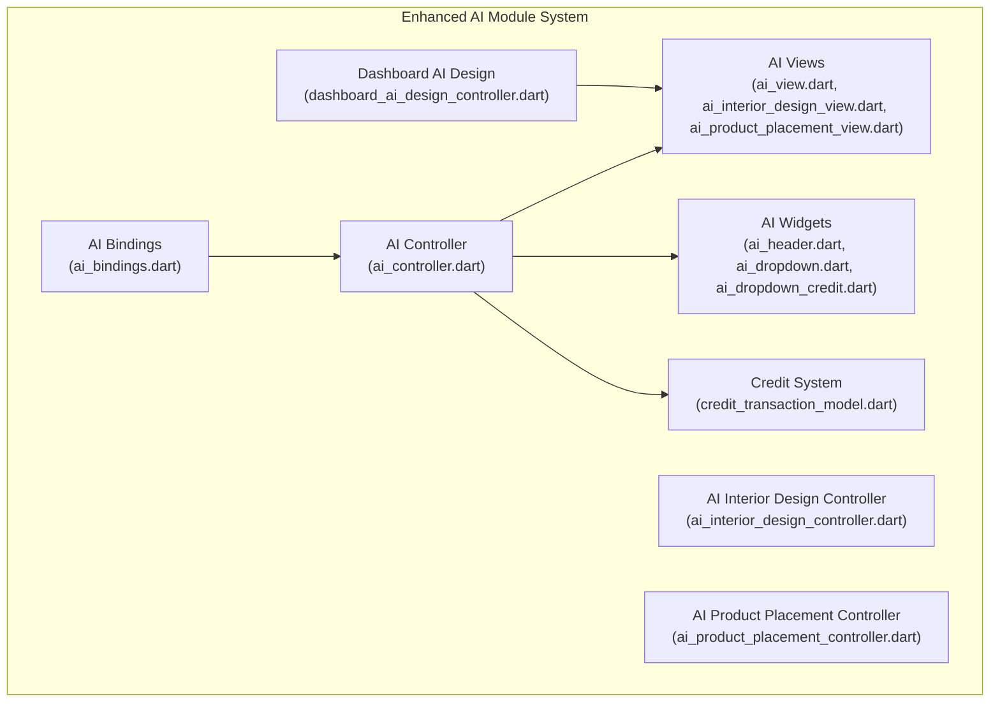
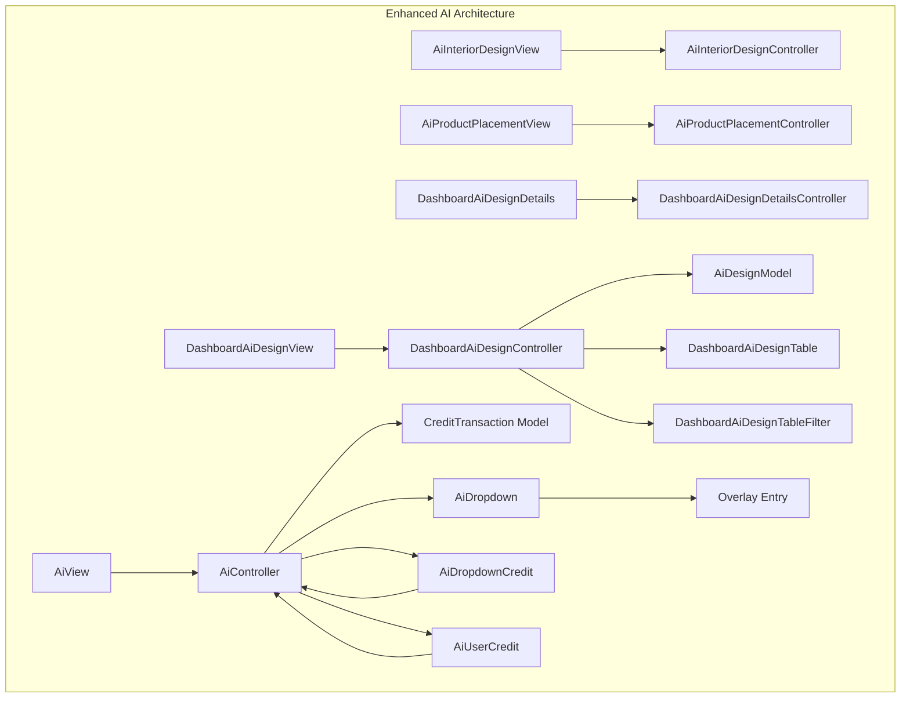
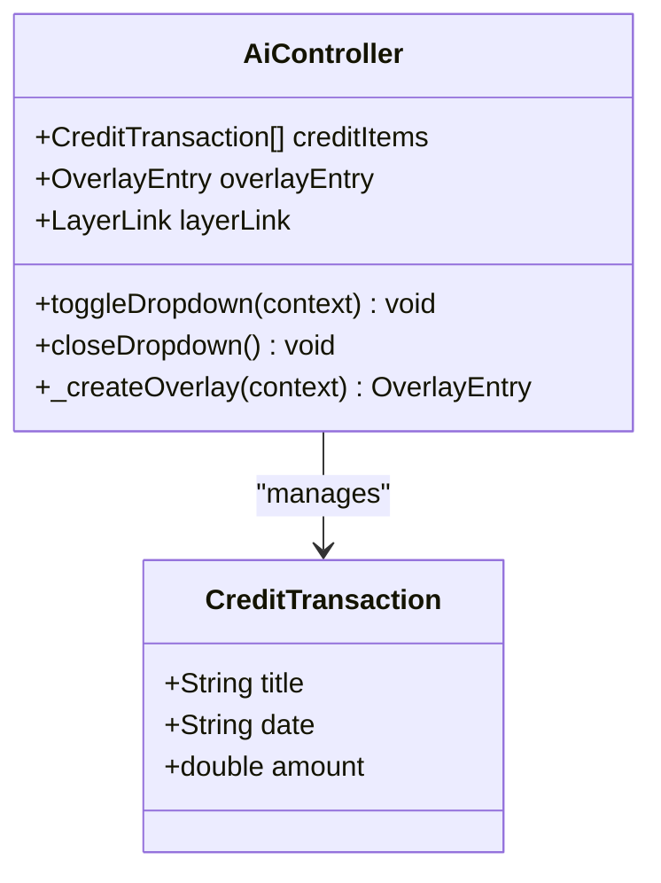
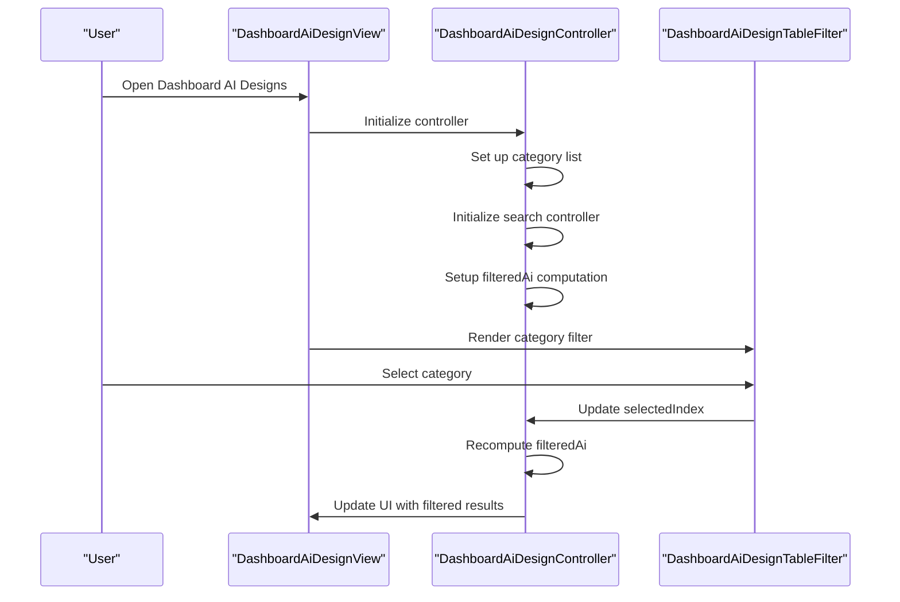
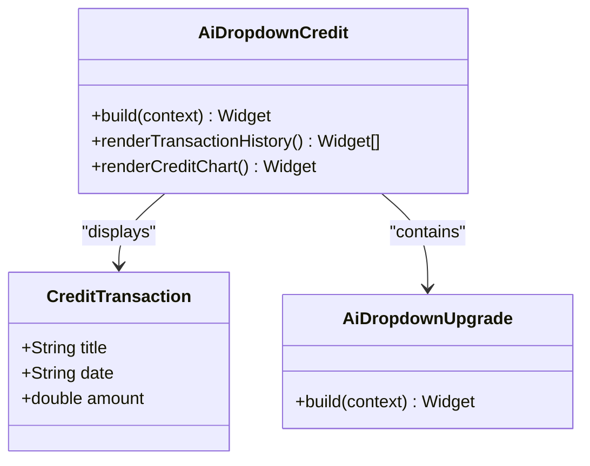
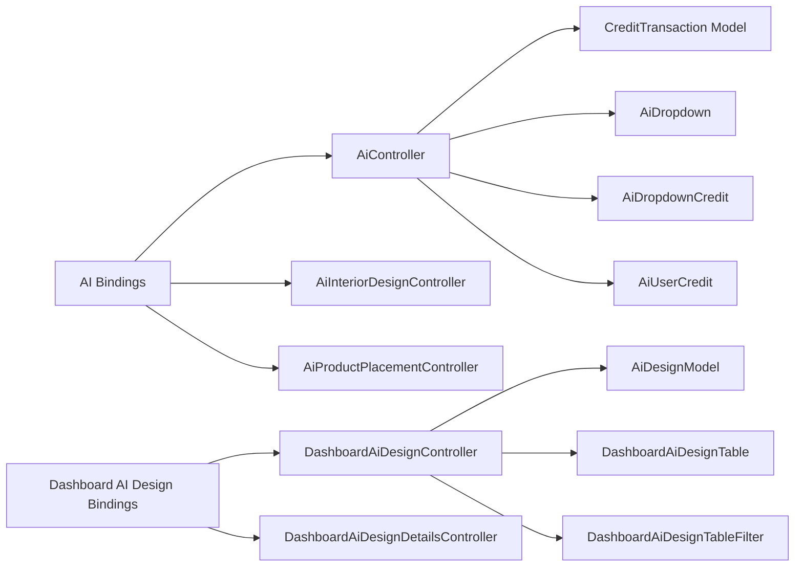

# AI Design Services

<cite>
**Referenced Files in This Document**
- [ai_controller.dart](file://lib/features/ai/controller/ai_controller.dart)
- [ai_interior_design_controller.dart](file://lib/features/ai/controller/ai_interior_design_controller.dart)
- [ai_product_placement_controller.dart](file://lib/features/ai/controller/ai_product_placement_controller.dart)
- [ai_bindings.dart](file://lib/features/ai/bindings/ai_bindings.dart)
- [ai_interior_design_bindings.dart](file://lib/features/ai/bindings/ai_interior_design_bindings.dart)
- [ai_product_placement_bindings.dart](file://lib/features/ai/bindings/ai_product_placement_bindings.dart)
- [ai_view.dart](file://lib/features/ai/views/ai_view.dart)
- [ai_interior_design_view.dart](file://lib/features/ai/views/ai_interior_design_view.dart)
- [ai_product_placement_view.dart](file://lib/features/ai/views/ai_product_placement_view.dart)
- [ai_header.dart](file://lib/features/ai/widgets/ai_header.dart)
- [ai_dropdown.dart](file://lib/features/ai/widgets/ai_view_widgets/ai_dropdown.dart)
- [ai_dropdown_credit.dart](file://lib/features/ai/widgets/ai_view_widgets/ai_dropdown_credit.dart)
- [ai_dropdown_upgrade.dart](file://lib/features/ai/widgets/ai_view_widgets/ai_dropdown_upgrade.dart)
- [ai_user_credit.dart](file://lib/features/ai/widgets/ai_view_widgets/ai_user_credit.dart)
- [ai_view_image.dart](file://lib/features/ai/widgets/ai_view_widgets/ai_view_image.dart)
- [dashboard_ai_design_controller.dart](file://lib/features/dashboard_ai_design/controller/dashboard_ai_design_controller.dart)
- [dashboard_ai_design_details_controller.dart](file://lib/features/dashboard_ai_design/controller/dashboard_ai_design_details_controller.dart)
- [dashboard_ai_design_view.dart](file://lib/features/dashboard_ai_design/views/dashboard_ai_design_view.dart)
- [dashboard_ai_design_details.dart](file://lib/features/dashboard_ai_design/views/dashboard_ai_design_details.dart)
- [dashboard_ai_design_table.dart](file://lib/features/dashboard_ai_design/widgets/dashboard_ai_design_view_widgets/dashboard_ai_design_table.dart)
- [dashboard_ai_design_table_expanded.dart](file://lib/features/dashboard_ai_design/widgets/dashboard_ai_design_view_widgets/dashboard_ai_design_table_expanded.dart)
- [dashboard_ai_design_table_filter.dart](file://lib/features/dashboard_ai_design/widgets/dashboard_ai_design_view_widgets/dashboard_ai_design_table_filter.dart)
- [dashboard_ai_interior_design.dart](file://lib/features/dashboard_ai_design/widgets/dashboard_ai_design_details_widgets/dashboard_ai_interior_design.dart)
- [dashboard_ai_product_placement.dart](file://lib/features/dashboard_ai_design/widgets/dashboard_ai_design_details_widgets/dashboard_ai_product_placement.dart)
- [ai_design_model.dart](file://lib/features/dashboard_ai_design/models/ai_design_model.dart)
- [credit_transaction_model.dart](file://lib/features/credit_balance/models/credit_transaction_model.dart)
- [app_routes.dart](file://lib/core/routes/app_routes.dart)
</cite>

## Update Summary
**Changes Made**
- Complete architectural restructuring from old `ai_design` module to new `ai` module
- Enhanced dashboard AI design integration with dedicated dashboard module
- New credit system integration with overlay dropdown functionality
- Category-based navigation with separate routes for different AI services
- Improved UI components with credit balance visualization

## Table of Contents
1. [Introduction](#introduction)
2. [Project Structure](#project-structure)
3. [Core Components](#core-components)
4. [Architecture Overview](#architecture-overview)
5. [Detailed Component Analysis](#detailed-component-analysis)
6. [Dependency Analysis](#dependency-analysis)
7. [Performance Considerations](#performance-considerations)
8. [Troubleshooting Guide](#troubleshooting-guide)
9. [Conclusion](#conclusion)

## Introduction
This document describes the AI Design Services feature, which has undergone major architectural restructuring. The new system features a comprehensive AI module (`lib/features/ai/`) replacing the old AI design system, enhanced dashboard integration for AI design management, and sophisticated credit system integration. The AI-powered design generation workflow now includes category-based navigation, advanced preview and customization interfaces, and seamless purchase/download processes with credit deduction.

## Project Structure
The AI Design Services feature is now organized under the enhanced `lib/features/ai/` module with clear separation of concerns across multiple specialized components:

**New AI Module Structure:**
- **AI Core Module**: Central AI functionality with credit management and user interface
- **Dashboard AI Design Module**: Comprehensive design management with filtering and pagination
- **Credit Balance Integration**: Seamless credit system integration with transaction history
- **Category-Based Navigation**: Separate routes for different AI services (Product Placement, Interior Design)

**Diagram sources**
- [ai_controller.dart:1-94](file://lib/features/ai/controller/ai_controller.dart#L1-L94)
- [ai_interior_design_controller.dart](file://lib/features/ai/controller/ai_interior_design_controller.dart)
- [ai_product_placement_controller.dart](file://lib/features/ai/controller/ai_product_placement_controller.dart)
- [ai_bindings.dart](file://lib/features/ai/bindings/ai_bindings.dart)
- [ai_view.dart:1-26](file://lib/features/ai/views/ai_view.dart#L1-L26)
- [ai_interior_design_view.dart](file://lib/features/ai/views/ai_interior_design_view.dart)
- [ai_product_placement_view.dart](file://lib/features/ai/views/ai_product_placement_view.dart)
- [ai_header.dart:1-32](file://lib/features/ai/widgets/ai_header.dart#L1-L32)
- [ai_dropdown.dart:1-70](file://lib/features/ai/widgets/ai_view_widgets/ai_dropdown.dart#L1-L70)
- [ai_dropdown_credit.dart:1-88](file://lib/features/ai/widgets/ai_view_widgets/ai_dropdown_credit.dart#L1-L88)
- [dashboard_ai_design_controller.dart:1-71](file://lib/features/dashboard_ai_design/controller/dashboard_ai_design_controller.dart#L1-L71)
- [credit_transaction_model.dart:1-12](file://lib/features/credit_balance/models/credit_transaction_model.dart#L1-L12)

**Section sources**
- [ai_bindings.dart](file://lib/features/ai/bindings/ai_bindings.dart)
- [ai_view.dart:1-26](file://lib/features/ai/views/ai_view.dart#L1-L26)
- [dashboard_ai_design_view.dart:1-55](file://lib/features/dashboard_ai_design/views/dashboard_ai_design_view.dart#L1-L55)

## Core Components
The enhanced AI Design Services feature now includes several key components working together:

**AI Core Controllers:**
- **AiController**: Manages credit system integration, overlay dropdown functionality, and user credit display
- **AiInteriorDesignController**: Handles interior design customization data and room configuration
- **AiProductPlacementController**: Manages product placement customization options and room selection

**Enhanced Dashboard Components:**
- **DashboardAiDesignController**: Advanced design list management with category filtering, search, and pagination
- **DashboardAiDesignDetailsController**: Specialized controller for design details and customization options

**Credit System Integration:**
- **CreditTransaction Model**: Structured credit transaction data with title, date, and amount
- **AiDropdownCredit**: Interactive credit dropdown with transaction history and chart visualization
- **AiDropdownUpgrade**: Upgrade options within the credit dropdown interface

**UI Enhancement Components:**
- **AiHeader**: Enhanced header with navigation and credit display
- **AiViewImage**: Optimized image display for AI-generated designs
- **AiUserCredit**: User credit display with dropdown functionality

**Section sources**
- [ai_controller.dart:1-94](file://lib/features/ai/controller/ai_controller.dart#L1-L94)
- [ai_interior_design_controller.dart](file://lib/features/ai/controller/ai_interior_design_controller.dart)
- [ai_product_placement_controller.dart](file://lib/features/ai/controller/ai_product_placement_controller.dart)
- [dashboard_ai_design_controller.dart:1-71](file://lib/features/dashboard_ai_design/controller/dashboard_ai_design_controller.dart#L1-L71)
- [dashboard_ai_design_details_controller.dart](file://lib/features/dashboard_ai_design/controller/dashboard_ai_design_details_controller.dart)
- [credit_transaction_model.dart:1-12](file://lib/features/credit_balance/models/credit_transaction_model.dart#L1-L12)

## Architecture Overview
The enhanced AI Design Services feature follows a comprehensive layered architecture with improved modularity and integration:

**Enhanced Architecture Pattern:**
- **Presentation Layer**: Enhanced views with credit integration and category navigation
- **Domain Layer**: Specialized controllers for AI services and design management
- **Integration Layer**: Credit system and dashboard integration
- **UI Layer**: Modular widgets with overlay dropdown functionality

**Diagram sources**
- [ai_view.dart:1-26](file://lib/features/ai/views/ai_view.dart#L1-L26)
- [ai_interior_design_view.dart](file://lib/features/ai/views/ai_interior_design_view.dart)
- [ai_product_placement_view.dart](file://lib/features/ai/views/ai_product_placement_view.dart)
- [dashboard_ai_design_view.dart:1-55](file://lib/features/dashboard_ai_design/views/dashboard_ai_design_view.dart#L1-L55)
- [dashboard_ai_design_details.dart:1-78](file://lib/features/dashboard_ai_design/views/dashboard_ai_design_details.dart#L1-L78)
- [ai_controller.dart:1-94](file://lib/features/ai/controller/ai_controller.dart#L1-L94)
- [dashboard_ai_design_controller.dart:1-71](file://lib/features/dashboard_ai_design/controller/dashboard_ai_design_controller.dart#L1-L71)
- [credit_transaction_model.dart:1-12](file://lib/features/credit_balance/models/credit_transaction_model.dart#L1-L12)

## Detailed Component Analysis

### Enhanced AI Controller
The AiController now manages sophisticated credit system integration with overlay dropdown functionality:

**Key Responsibilities:**
- **Credit Management**: Handles credit transactions with structured data model
- **Overlay Dropdown**: Manages overlay entry lifecycle with LayerLink positioning
- **User Interface**: Controls dropdown visibility and interaction
- **Credit Visualization**: Integrates with credit balance system

**Advanced Features:**
- Overlay entry creation with CompositedTransformFollower
- LayerLink-based positioning system
- Credit transaction list management
- Dynamic dropdown opening/closing functionality

**Diagram sources**
- [ai_controller.dart:1-94](file://lib/features/ai/controller/ai_controller.dart#L1-L94)
- [credit_transaction_model.dart:1-12](file://lib/features/credit_balance/models/credit_transaction_model.dart#L1-L12)

**Section sources**
- [ai_controller.dart:1-94](file://lib/features/ai/controller/ai_controller.dart#L1-L94)

### Enhanced Dashboard AI Design System
The dashboard AI design module provides comprehensive design management with advanced filtering and pagination:

**DashboardAiDesignController Responsibilities:**
- **Category Management**: Handles AI design categories (All, Product Placement, AI Interior Design)
- **Search Functionality**: Implements real-time search with TextEditingController
- **Filtering Logic**: Advanced filtering based on category selection
- **State Management**: Reactive state management with GetX observables

**Processing Logic:**
- Category-based filtering with conditional logic
- Automatic expansion list initialization
- Pagination support with total pages tracking
- Reactive filtered list computation

**Diagram sources**
- [dashboard_ai_design_view.dart:1-55](file://lib/features/dashboard_ai_design/views/dashboard_ai_design_view.dart#L1-L55)
- [dashboard_ai_design_controller.dart:1-71](file://lib/features/dashboard_ai_design/controller/dashboard_ai_design_controller.dart#L1-L71)
- [dashboard_ai_design_table_filter.dart](file://lib/features/dashboard_ai_design/widgets/dashboard_ai_design_view_widgets/dashboard_ai_design_table_filter.dart)

**Section sources**
- [dashboard_ai_design_controller.dart:1-71](file://lib/features/dashboard_ai_design/controller/dashboard_ai_design_controller.dart#L1-L71)

### Credit System Integration
The enhanced credit system provides comprehensive financial tracking and management:

**CreditTransaction Model Structure:**
- **Immutable Data**: Structured credit transaction data
- **Transaction History**: Complete credit usage and addition history
- **Financial Tracking**: Amount-based credit management

**Credit Dropdown Features:**
- **Transaction Visualization**: Scrollable transaction history
- **Credit Chart Integration**: Visual credit usage representation
- **Upgrade Options**: Integrated upgrade functionality
- **Real-time Balance**: Current credit balance display

**Diagram sources**
- [credit_transaction_model.dart:1-12](file://lib/features/credit_balance/models/credit_transaction_model.dart#L1-L12)
- [ai_dropdown_credit.dart:1-88](file://lib/features/ai/widgets/ai_view_widgets/ai_dropdown_credit.dart#L1-L88)
- [ai_dropdown_upgrade.dart](file://lib/features/ai/widgets/ai_view_widgets/ai_dropdown_upgrade.dart)

**Section sources**
- [credit_transaction_model.dart:1-12](file://lib/features/credit_balance/models/credit_transaction_model.dart#L1-L12)
- [ai_dropdown_credit.dart:1-88](file://lib/features/ai/widgets/ai_view_widgets/ai_dropdown_credit.dart#L1-L88)

### Enhanced UI Components
The new AI module introduces sophisticated UI components with overlay functionality:

**AiHeader Component:**
- **Navigation Integration**: Enhanced navigation with back button
- **Credit Display**: Integrated credit balance display
- **Dynamic Content**: Supports dynamic title and subtitle

**AiDropdown Component:**
- **Overlay Integration**: LayerLink-based positioning
- **Interactive Elements**: Tap-to-open functionality
- **Visual Feedback**: Arrow indicator for dropdown state

**AiDropdownCredit Component:**
- **Comprehensive Layout**: Credit usage, chart, and transaction history
- **Gradient Styling**: Modern gradient background design
- **Scrollable Content**: Bouncing scroll physics for transactions

**Section sources**
- [ai_header.dart:1-32](file://lib/features/ai/widgets/ai_header.dart#L1-L32)
- [ai_dropdown.dart:1-70](file://lib/features/ai/widgets/ai_view_widgets/ai_dropdown.dart#L1-L70)
- [ai_dropdown_credit.dart:1-88](file://lib/features/ai/widgets/ai_view_widgets/ai_dropdown_credit.dart#L1-L88)

## Dependency Analysis
The enhanced AI Design Services feature uses a sophisticated dependency injection system with improved modularity:

**Enhanced Dependency Structure:**
- **AI Bindings**: Register AI controllers with lazy initialization
- **Dashboard Bindings**: Separate bindings for dashboard AI design
- **Credit Integration**: Direct integration with credit balance module
- **Route Management**: Dedicated routes for AI services

**Diagram sources**
- [ai_bindings.dart](file://lib/features/ai/bindings/ai_bindings.dart)
- [ai_interior_design_bindings.dart](file://lib/features/ai/bindings/ai_interior_design_bindings.dart)
- [ai_product_placement_bindings.dart](file://lib/features/ai/bindings/ai_product_placement_bindings.dart)
- [dashboard_ai_design_controller.dart:1-71](file://lib/features/dashboard_ai_design/controller/dashboard_ai_design_controller.dart#L1-L71)
- [credit_transaction_model.dart:1-12](file://lib/features/credit_balance/models/credit_transaction_model.dart#L1-L12)

**Section sources**
- [ai_bindings.dart](file://lib/features/ai/bindings/ai_bindings.dart)
- [dashboard_ai_design_controller.dart:1-71](file://lib/features/dashboard_ai_design/controller/dashboard_ai_design_controller.dart#L1-L71)

## Performance Considerations
The enhanced AI Design Services feature incorporates several performance optimizations:

**Enhanced Performance Features:**
- **Overlay Optimization**: Efficient overlay entry lifecycle management
- **Reactive Filtering**: Optimized filtered list computation with category-based filtering
- **Credit System Efficiency**: Structured credit transaction data for fast rendering
- **Modular Architecture**: Separate controllers for different AI services
- **Lazy Loading**: Lazy initialization of controllers and widgets
- **Memory Management**: Proper disposal of search controllers and overlay entries

**Optimization Strategies:**
- Overlay entries are created only when needed
- Credit transaction lists are managed efficiently
- Dashboard filtering uses optimized reactive computations
- UI components use efficient widget rebuilding patterns

**Section sources**
- [ai_controller.dart:58-94](file://lib/features/ai/controller/ai_controller.dart#L58-L94)
- [dashboard_ai_design_controller.dart:40-71](file://lib/features/dashboard_ai_design/controller/dashboard_ai_design_controller.dart#L40-L71)

## Troubleshooting Guide
Enhanced troubleshooting guidance for the new AI module architecture:

**Common Issues and Resolutions:**
- **Overlay Dropdown Not Working**: Verify LayerLink setup and overlay entry lifecycle
- **Credit System Integration Failures**: Check CreditTransaction model structure and initialization
- **Dashboard Filtering Issues**: Confirm category list setup and filtered list computation
- **Navigation Problems**: Ensure proper route registration for new AI services
- **Credit Balance Display**: Verify credit transaction data and dropdown integration
- **Performance Issues**: Check overlay entry disposal and reactive computation optimization

**Enhanced Debugging Steps:**
- Verify AI controller initialization and overlay entry management
- Check credit transaction model instantiation and data binding
- Validate dashboard controller reactive state management
- Test overlay dropdown positioning with LayerLink
- Monitor credit system performance with large transaction lists

**Section sources**
- [ai_controller.dart:1-94](file://lib/features/ai/controller/ai_controller.dart#L1-L94)
- [dashboard_ai_design_controller.dart:1-71](file://lib/features/dashboard_ai_design/controller/dashboard_ai_design_controller.dart#L1-L71)

## Conclusion
The enhanced AI Design Services feature represents a significant architectural advancement with the new AI module structure. The system now provides comprehensive credit integration, sophisticated overlay dropdown functionality, and enhanced dashboard management capabilities. The modular architecture supports future expansion while maintaining clean separation of concerns. The integration with credit systems and category-based navigation creates a robust foundation for AI-powered design workflows with seamless user experience and efficient resource management.