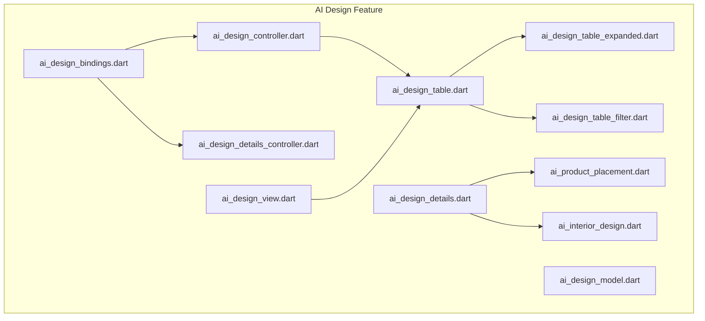
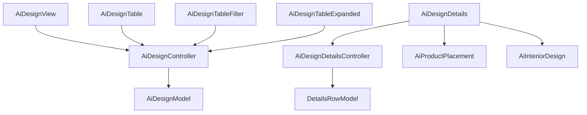
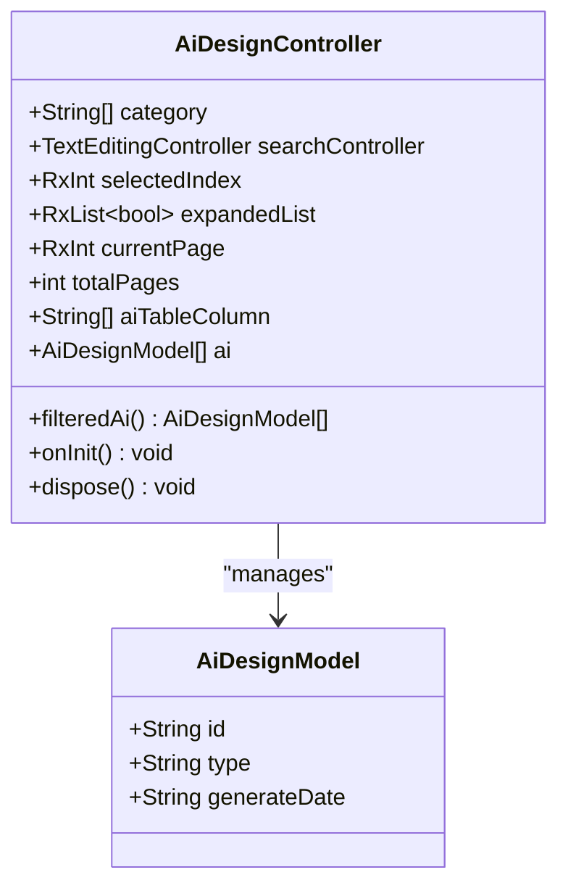
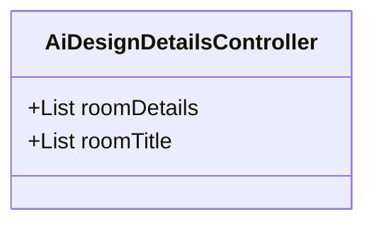
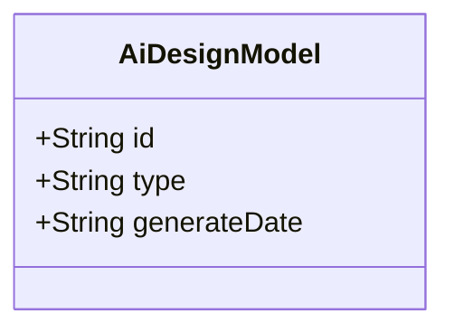
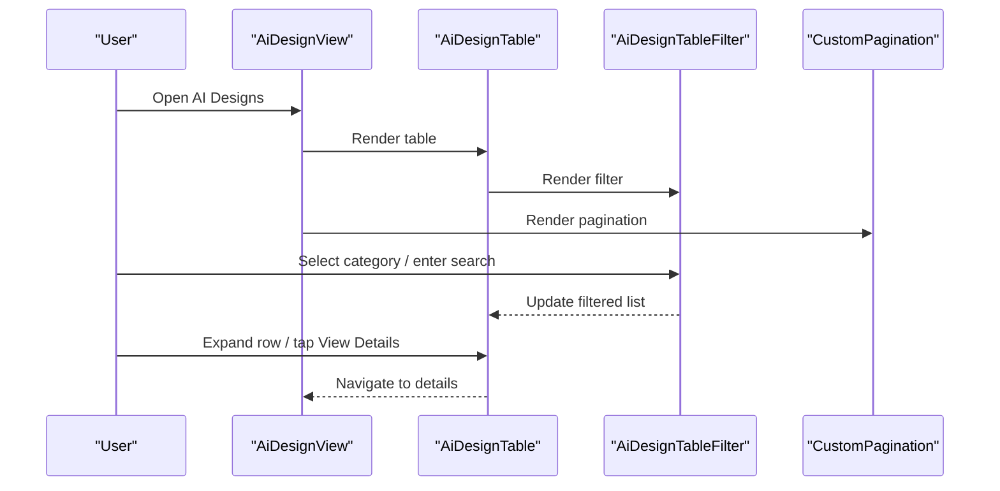
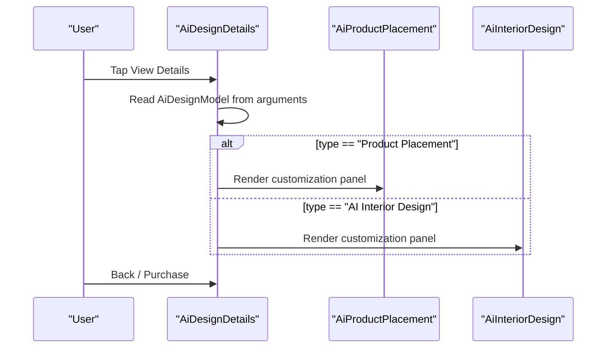
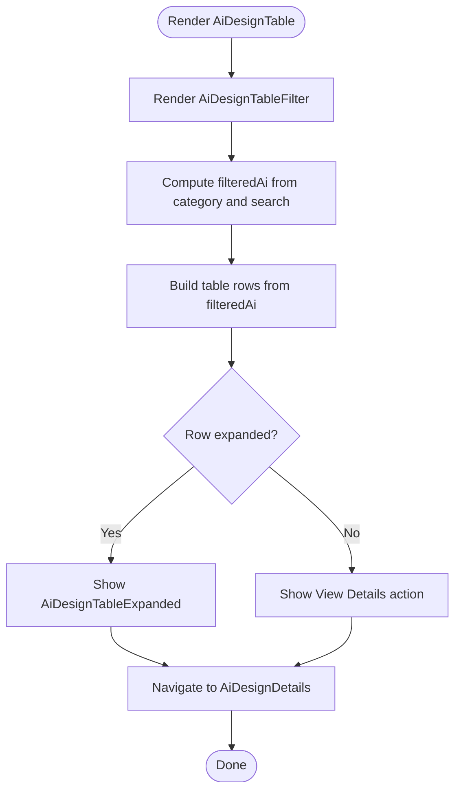
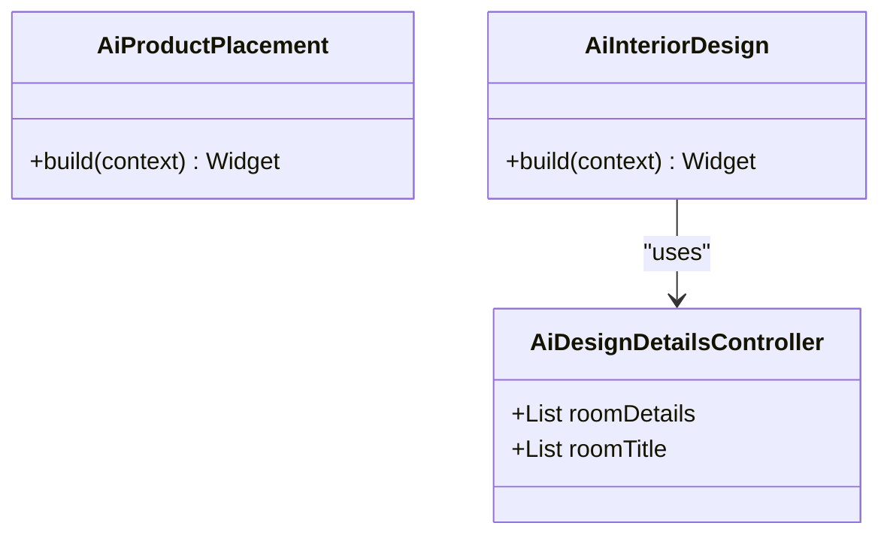
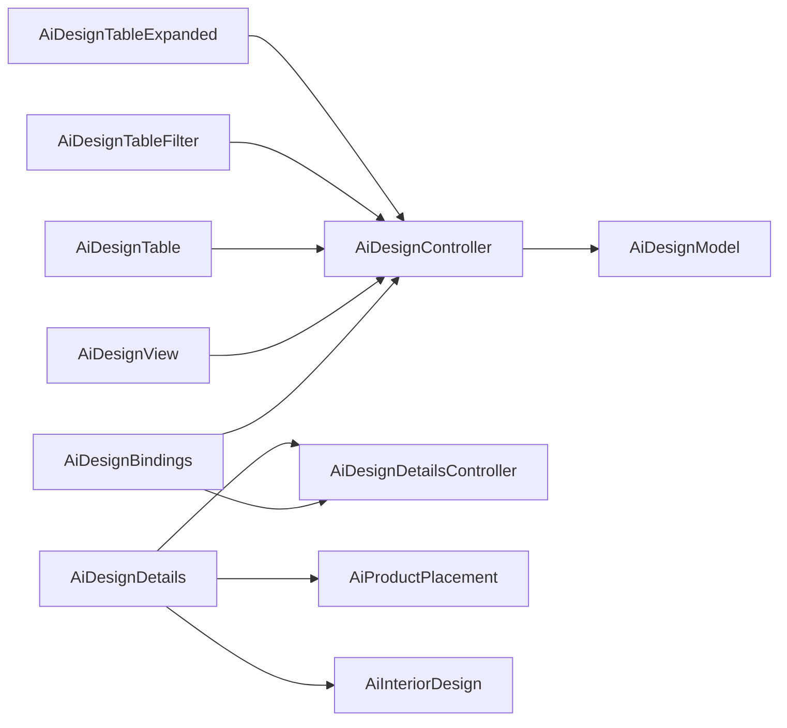

# AI Design Services

<cite>
**Referenced Files in This Document**
- [ai_design_controller.dart](file://lib/features/ai_design/controller/ai_design_controller.dart)
- [ai_design_details_controller.dart](file://lib/features/ai_design/controller/ai_design_details_controller.dart)
- [ai_design_model.dart](file://lib/features/ai_design/models/ai_design_model.dart)
- [ai_design_bindings.dart](file://lib/features/ai_design/bindings/ai_design_bindings.dart)
- [ai_design_view.dart](file://lib/features/ai_design/views/ai_design_view.dart)
- [ai_design_details.dart](file://lib/features/ai_design/views/ai_design_details.dart)
- [ai_design_table.dart](file://lib/features/ai_design/widgets/ai_design_view_widgets/ai_design_table.dart)
- [ai_design_table_expanded.dart](file://lib/features/ai_design/widgets/ai_design_view_widgets/ai_design_table_expanded.dart)
- [ai_design_table_filter.dart](file://lib/features/ai_design/widgets/ai_design_view_widgets/ai_design_table_filter.dart)
- [ai_product_placement.dart](file://lib/features/ai_design/widgets/ai_design_details_widgets/ai_product_placement.dart)
- [ai_interior_design.dart](file://lib/features/ai_design/widgets/ai_design_details_widgets/ai_interior_design.dart)
- [app_routes.dart](file://lib/core/routes/app_routes.dart)
</cite>

## Table of Contents
1. [Introduction](#introduction)
2. [Project Structure](#project-structure)
3. [Core Components](#core-components)
4. [Architecture Overview](#architecture-overview)
5. [Detailed Component Analysis](#detailed-component-analysis)
6. [Dependency Analysis](#dependency-analysis)
7. [Performance Considerations](#performance-considerations)
8. [Troubleshooting Guide](#troubleshooting-guide)
9. [Conclusion](#conclusion)

## Introduction
This document describes the AI Design Services feature, focusing on the AI-powered design generation workflow, design preview and customization interface, and the purchase/download process. It explains the AI design controller implementation, state management for design configurations, and integration patterns with AI services. It also documents the design details view with customization options, preview functionality, and purchase flow, along with the design model structure, data handling, and API integration patterns. Finally, it covers the widget components for design display, customization controls, and user interaction patterns, and outlines business logic considerations for design pricing, download management, and user credit system integration.

## Project Structure
The AI Design Services feature is organized under the features/ai_design module with clear separation of concerns:
- Controller layer: stateful logic for design lists, filtering, pagination, and details configuration
- Model layer: immutable data structures representing design records
- View layer: screen-level widgets for listing designs and viewing details
- Widget layer: reusable components for tables, filters, expanded rows, and design-specific customization panels
- Bindings: dependency injection setup via GetX

**Diagram sources**
- [ai_design_controller.dart:1-71](file://lib/features/ai_design/controller/ai_design_controller.dart#L1-L71)
- [ai_design_details_controller.dart:1-49](file://lib/features/ai_design/controller/ai_design_details_controller.dart#L1-L49)
- [ai_design_model.dart:1-12](file://lib/features/ai_design/models/ai_design_model.dart#L1-L12)
- [ai_design_bindings.dart:1-12](file://lib/features/ai_design/bindings/ai_design_bindings.dart#L1-L12)
- [ai_design_view.dart:1-55](file://lib/features/ai_design/views/ai_design_view.dart#L1-L55)
- [ai_design_details.dart:1-78](file://lib/features/ai_design/views/ai_design_details.dart#L1-L78)
- [ai_design_table.dart:1-72](file://lib/features/ai_design/widgets/ai_design_view_widgets/ai_design_table.dart#L1-L72)
- [ai_design_table_expanded.dart:1-52](file://lib/features/ai_design/widgets/ai_design_view_widgets/ai_design_table_expanded.dart#L1-L52)
- [ai_design_table_filter.dart:1-50](file://lib/features/ai_design/widgets/ai_design_view_widgets/ai_design_table_filter.dart#L1-L50)
- [ai_product_placement.dart:1-100](file://lib/features/ai_design/widgets/ai_design_details_widgets/ai_product_placement.dart#L1-L100)
- [ai_interior_design.dart:1-65](file://lib/features/ai_design/widgets/ai_design_details_widgets/ai_interior_design.dart#L1-L65)

**Section sources**
- [ai_design_bindings.dart:1-12](file://lib/features/ai_design/bindings/ai_design_bindings.dart#L1-L12)
- [ai_design_view.dart:1-55](file://lib/features/ai_design/views/ai_design_view.dart#L1-L55)
- [ai_design_details.dart:1-78](file://lib/features/ai_design/views/ai_design_details.dart#L1-L78)

## Core Components
- AiDesignController: Manages design list, category filtering, search, expansion state, pagination, and filtered results computation.
- AiDesignDetailsController: Provides room customization data and titles for the interior design customization panel.
- AiDesignModel: Immutable record structure for design items.
- Views: AiDesignView renders the design list with filter and pagination; AiDesignDetails renders the design details screen and conditionally shows product placement or interior design customization panels.
- Widgets: AiDesignTable composes filter, table rows, and expandable actions; AiDesignTableExpanded shows per-row details and actions; AiDesignTableFilter handles category selection and search input; AiProductPlacement and AiInteriorDesign render customization panels.

Key responsibilities:
- State management: Reactive state via GetX (Rx) for filtered lists, expansion flags, and current page.
- UI composition: Modular widgets for reuse and maintainability.
- Navigation: Uses GetX routing with argument passing for design details.

**Section sources**
- [ai_design_controller.dart:1-71](file://lib/features/ai_design/controller/ai_design_controller.dart#L1-L71)
- [ai_design_details_controller.dart:1-49](file://lib/features/ai_design/controller/ai_design_details_controller.dart#L1-L49)
- [ai_design_model.dart:1-12](file://lib/features/ai_design/models/ai_design_model.dart#L1-L12)
- [ai_design_view.dart:1-55](file://lib/features/ai_design/views/ai_design_view.dart#L1-L55)
- [ai_design_details.dart:1-78](file://lib/features/ai_design/views/ai_design_details.dart#L1-L78)
- [ai_design_table.dart:1-72](file://lib/features/ai_design/widgets/ai_design_view_widgets/ai_design_table.dart#L1-L72)
- [ai_design_table_expanded.dart:1-52](file://lib/features/ai_design/widgets/ai_design_view_widgets/ai_design_table_expanded.dart#L1-L52)
- [ai_design_table_filter.dart:1-50](file://lib/features/ai_design/widgets/ai_design_view_widgets/ai_design_table_filter.dart#L1-L50)
- [ai_product_placement.dart:1-100](file://lib/features/ai_design/widgets/ai_design_details_widgets/ai_product_placement.dart#L1-L100)
- [ai_interior_design.dart:1-65](file://lib/features/ai_design/widgets/ai_design_details_widgets/ai_interior_design.dart#L1-L65)

## Architecture Overview
The AI Design Services feature follows a layered architecture:
- Presentation layer: Views and widgets
- Domain layer: Controllers and models
- DI layer: Bindings

**Diagram sources**
- [ai_design_view.dart:1-55](file://lib/features/ai_design/views/ai_design_view.dart#L1-L55)
- [ai_design_details.dart:1-78](file://lib/features/ai_design/views/ai_design_details.dart#L1-L78)
- [ai_design_controller.dart:1-71](file://lib/features/ai_design/controller/ai_design_controller.dart#L1-L71)
- [ai_design_details_controller.dart:1-49](file://lib/features/ai_design/controller/ai_design_details_controller.dart#L1-L49)
- [ai_design_model.dart:1-12](file://lib/features/ai_design/models/ai_design_model.dart#L1-L12)
- [ai_design_table.dart:1-72](file://lib/features/ai_design/widgets/ai_design_view_widgets/ai_design_table.dart#L1-L72)
- [ai_design_table_filter.dart:1-50](file://lib/features/ai_design/widgets/ai_design_view_widgets/ai_design_table_filter.dart#L1-L50)
- [ai_design_table_expanded.dart:1-52](file://lib/features/ai_design/widgets/ai_design_view_widgets/ai_design_table_expanded.dart#L1-L52)
- [ai_product_placement.dart:1-100](file://lib/features/ai_design/widgets/ai_design_details_widgets/ai_product_placement.dart#L1-L100)
- [ai_interior_design.dart:1-65](file://lib/features/ai_design/widgets/ai_design_details_widgets/ai_interior_design.dart#L1-L65)

## Detailed Component Analysis

### AI Design Controller
Responsibilities:
- Maintains categories, search input, selected category index, expansion flags, and current page
- Computes filteredAi based on selected category
- Initializes expansion flags when filteredAi changes
- Disposes search controller

Processing logic:
- filteredAi recomputes when selectedIndex changes
- onInit initializes expandedList to match filteredAi length
- dispose cleans up searchController

**Diagram sources**
- [ai_design_controller.dart:1-71](file://lib/features/ai_design/controller/ai_design_controller.dart#L1-L71)
- [ai_design_model.dart:1-12](file://lib/features/ai_design/models/ai_design_model.dart#L1-L12)

**Section sources**
- [ai_design_controller.dart:1-71](file://lib/features/ai_design/controller/ai_design_controller.dart#L1-L71)

### AI Design Details Controller
Responsibilities:
- Provides room customization data and titles for interior design customization
- Supplies structured room details arrays and section titles

**Diagram sources**
- [ai_design_details_controller.dart:1-49](file://lib/features/ai_design/controller/ai_design_details_controller.dart#L1-L49)

**Section sources**
- [ai_design_details_controller.dart:1-49](file://lib/features/ai_design/controller/ai_design_details_controller.dart#L1-L49)

### AI Design Model
Structure:
- Immutable fields for id, type, and generateDate

**Diagram sources**
- [ai_design_model.dart:1-12](file://lib/features/ai_design/models/ai_design_model.dart#L1-L12)

**Section sources**
- [ai_design_model.dart:1-12](file://lib/features/ai_design/models/ai_design_model.dart#L1-L12)

### AI Design View
Responsibilities:
- Renders the AI Design list screen with app bar, container, table, and pagination
- Uses theme brightness to adjust text colors

**Diagram sources**
- [ai_design_view.dart:1-55](file://lib/features/ai_design/views/ai_design_view.dart#L1-L55)
- [ai_design_table.dart:1-72](file://lib/features/ai_design/widgets/ai_design_view_widgets/ai_design_table.dart#L1-L72)
- [ai_design_table_filter.dart:1-50](file://lib/features/ai_design/widgets/ai_design_view_widgets/ai_design_table_filter.dart#L1-L50)

**Section sources**
- [ai_design_view.dart:1-55](file://lib/features/ai_design/views/ai_design_view.dart#L1-L55)

### AI Design Details View
Responsibilities:
- Receives AiDesignModel via navigation arguments
- Conditionally renders AiProductPlacement or AiInteriorDesign based on type
- Displays a preview area and back button

**Diagram sources**
- [ai_design_details.dart:1-78](file://lib/features/ai_design/views/ai_design_details.dart#L1-L78)
- [ai_product_placement.dart:1-100](file://lib/features/ai_design/widgets/ai_design_details_widgets/ai_product_placement.dart#L1-L100)
- [ai_interior_design.dart:1-65](file://lib/features/ai_design/widgets/ai_design_details_widgets/ai_interior_design.dart#L1-L65)

**Section sources**
- [ai_design_details.dart:1-78](file://lib/features/ai_design/views/ai_design_details.dart#L1-L78)

### AI Design Table and Related Widgets
Responsibilities:
- AiDesignTable: Composes filter, builds table rows from filteredAi, supports expansion, and navigates to details
- AiDesignTableFilter: Renders category filter and search field
- AiDesignTableExpanded: Shows per-row details and action buttons

**Diagram sources**
- [ai_design_table.dart:1-72](file://lib/features/ai_design/widgets/ai_design_view_widgets/ai_design_table.dart#L1-L72)
- [ai_design_table_filter.dart:1-50](file://lib/features/ai_design/widgets/ai_design_view_widgets/ai_design_table_filter.dart#L1-L50)
- [ai_design_table_expanded.dart:1-52](file://lib/features/ai_design/widgets/ai_design_view_widgets/ai_design_table_expanded.dart#L1-L52)

**Section sources**
- [ai_design_table.dart:1-72](file://lib/features/ai_design/widgets/ai_design_view_widgets/ai_design_table.dart#L1-L72)
- [ai_design_table_filter.dart:1-50](file://lib/features/ai_design/widgets/ai_design_view_widgets/ai_design_table_filter.dart#L1-L50)
- [ai_design_table_expanded.dart:1-52](file://lib/features/ai_design/widgets/ai_design_view_widgets/ai_design_table_expanded.dart#L1-L52)

### AI Design Details Panels
Responsibilities:
- AiProductPlacement: Displays room selection and item picker for product placement customization
- AiInteriorDesign: Renders a series of customization sections using DetailsRowModel with data from AiDesignDetailsController

**Diagram sources**
- [ai_product_placement.dart:1-100](file://lib/features/ai_design/widgets/ai_design_details_widgets/ai_product_placement.dart#L1-L100)
- [ai_interior_design.dart:1-65](file://lib/features/ai_design/widgets/ai_design_details_widgets/ai_interior_design.dart#L1-L65)
- [ai_design_details_controller.dart:1-49](file://lib/features/ai_design/controller/ai_design_details_controller.dart#L1-L49)

**Section sources**
- [ai_product_placement.dart:1-100](file://lib/features/ai_design/widgets/ai_design_details_widgets/ai_product_placement.dart#L1-L100)
- [ai_interior_design.dart:1-65](file://lib/features/ai_design/widgets/ai_design_details_widgets/ai_interior_design.dart#L1-L65)

## Dependency Analysis
The feature uses GetX for state management and dependency injection:
- AiDesignBindings registers AiDesignController and AiDesignDetailsController lazily
- Controllers depend on models and widgets
- Views depend on controllers and widgets
- Navigation uses GetX routing with arguments

**Diagram sources**
- [ai_design_bindings.dart:1-12](file://lib/features/ai_design/bindings/ai_design_bindings.dart#L1-L12)
- [ai_design_controller.dart:1-71](file://lib/features/ai_design/controller/ai_design_controller.dart#L1-L71)
- [ai_design_details_controller.dart:1-49](file://lib/features/ai_design/controller/ai_design_details_controller.dart#L1-L49)
- [ai_design_model.dart:1-12](file://lib/features/ai_design/models/ai_design_model.dart#L1-L12)
- [ai_design_view.dart:1-55](file://lib/features/ai_design/views/ai_design_view.dart#L1-L55)
- [ai_design_details.dart:1-78](file://lib/features/ai_design/views/ai_design_details.dart#L1-L78)
- [ai_design_table.dart:1-72](file://lib/features/ai_design/widgets/ai_design_view_widgets/ai_design_table.dart#L1-L72)
- [ai_design_table_filter.dart:1-50](file://lib/features/ai_design/widgets/ai_design_view_widgets/ai_design_table_filter.dart#L1-L50)
- [ai_design_table_expanded.dart:1-52](file://lib/features/ai_design/widgets/ai_design_view_widgets/ai_design_table_expanded.dart#L1-L52)
- [ai_product_placement.dart:1-100](file://lib/features/ai_design/widgets/ai_design_details_widgets/ai_product_placement.dart#L1-L100)
- [ai_interior_design.dart:1-65](file://lib/features/ai_design/widgets/ai_design_details_widgets/ai_interior_design.dart#L1-L65)

**Section sources**
- [ai_design_bindings.dart:1-12](file://lib/features/ai_design/bindings/ai_design_bindings.dart#L1-L12)

## Performance Considerations
- Reactive updates: filteredAi recomputes on category change; keep category list small and avoid heavy computations inside reactive getters
- Expansion state: expandedList is initialized to the size of filteredAi; ensure filteredAi does not grow excessively large
- Pagination: currentPage and totalPages are present; implement server-side pagination or virtualization for large datasets
- Image rendering: preview areas use AssetImage; for dynamic AI-generated images, consider caching and lazy loading
- Widget rebuilds: Use Obx sparingly around expensive subtrees; isolate reactive parts to minimize rebuild scope
- AI service integration: Offload heavy AI tasks to backend APIs; cache results and use placeholders during async operations

## Troubleshooting Guide
Common issues and resolutions:
- Empty or stale filtered list: Verify category selection and search controller binding; ensure onInit initializes expandedList
- Navigation failures: Confirm route registration and argument passing; ensure AiDesignModel is passed as arguments
- Expansion not toggling: Check index mapping and expandedList length matches filteredAi count
- Preview not updating: Ensure preview area uses appropriate image loading strategy and refresh triggers

**Section sources**
- [ai_design_controller.dart:1-71](file://lib/features/ai_design/controller/ai_design_controller.dart#L1-L71)
- [ai_design_details.dart:1-78](file://lib/features/ai_design/views/ai_design_details.dart#L1-L78)

## Conclusion
The AI Design Services feature is structured around clean separation of concerns with GetX for state management and navigation. The design list and details screens provide a solid foundation for AI-powered design workflows, with modular widgets enabling customization and preview capabilities. To support production-grade AI services, integrate backend APIs for design generation, implement robust caching and pagination, and incorporate user credit and purchase flows aligned with existing credit and payment systems.