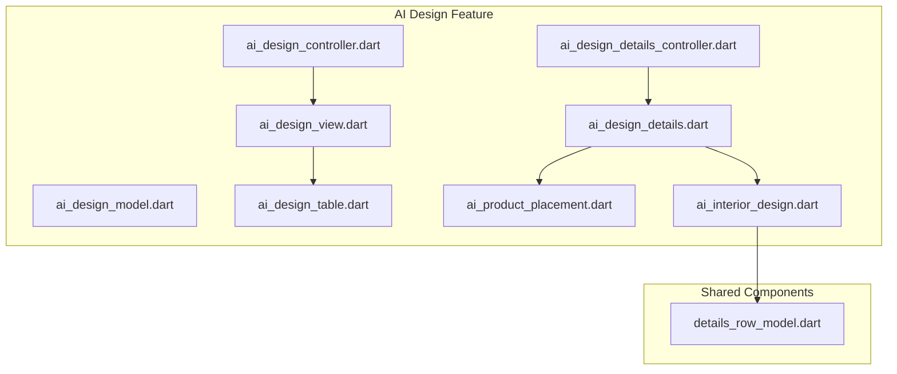
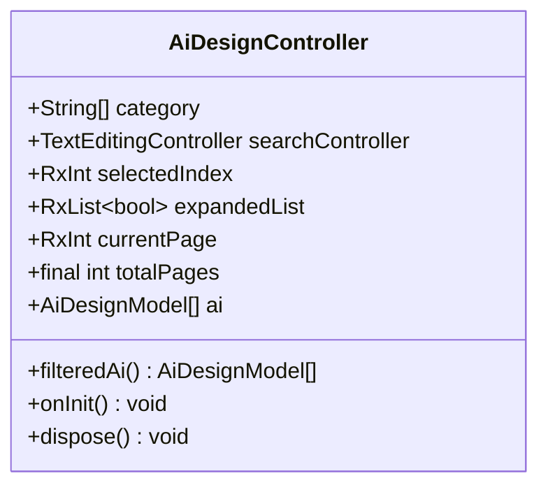
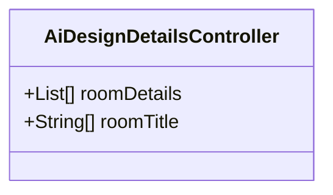
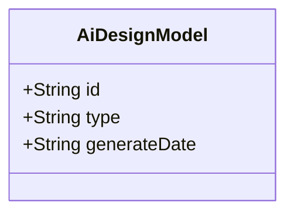
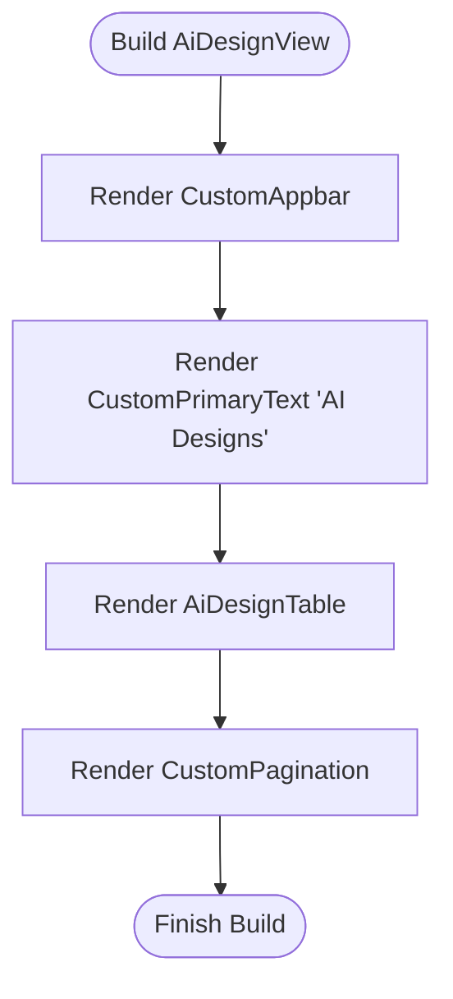
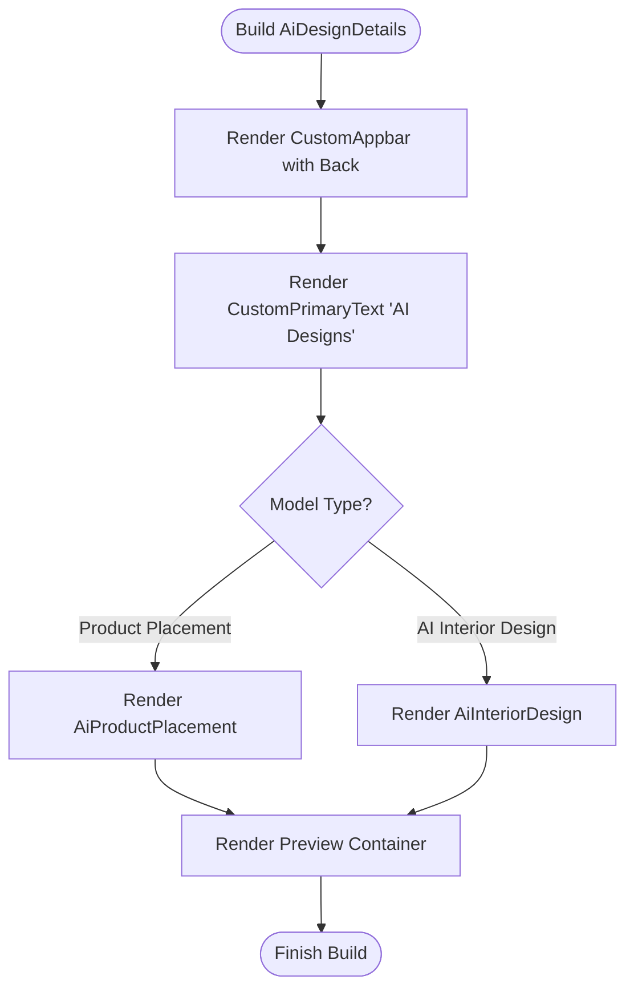
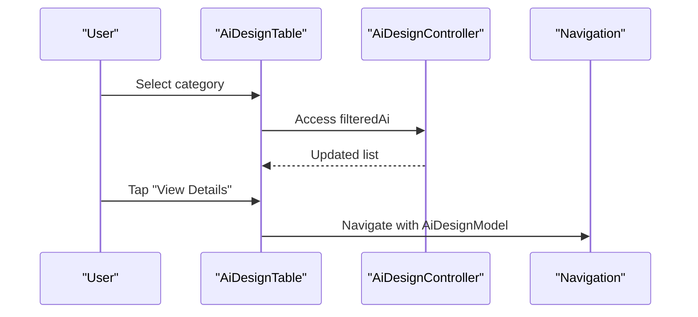
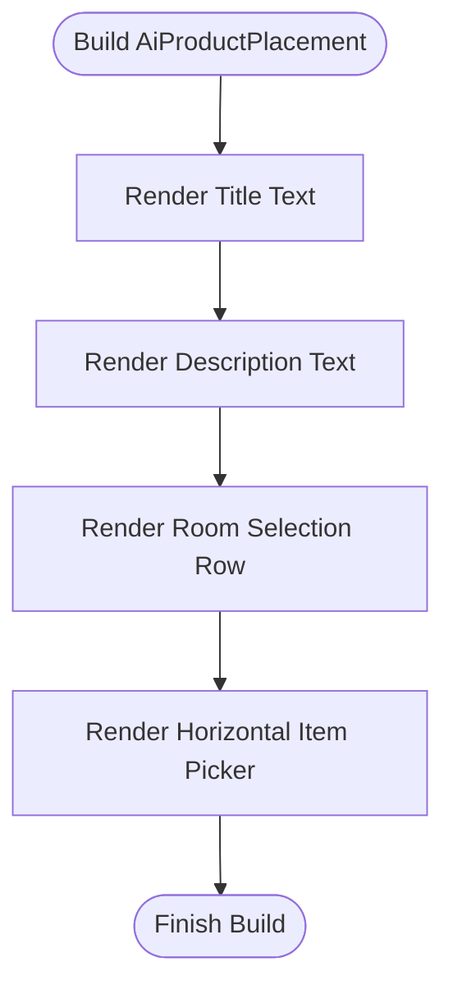
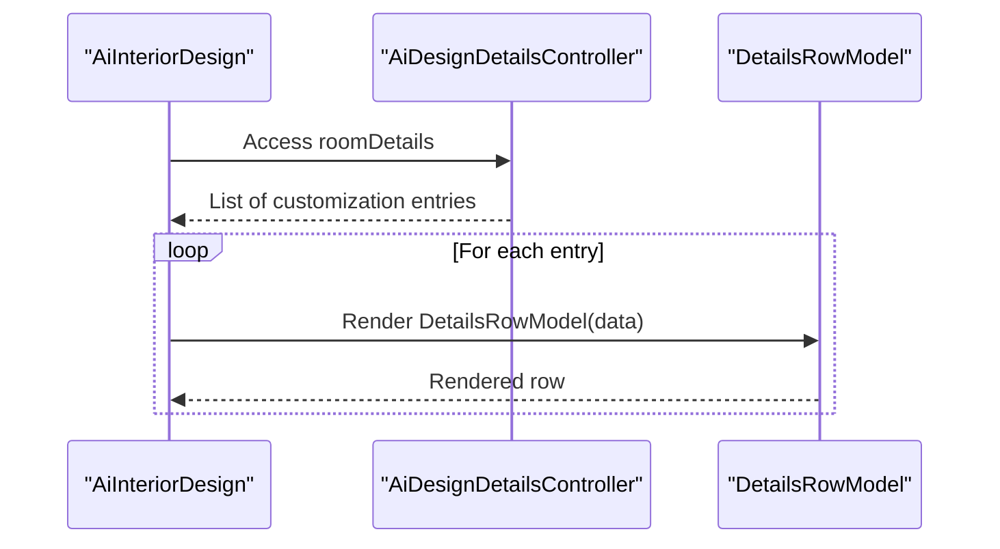
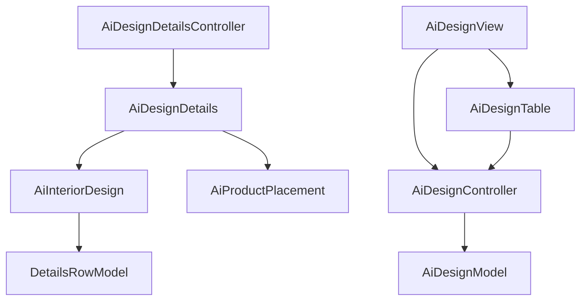

# Design Customization and Preview

<cite>
**Referenced Files in This Document**
- [main.dart](file://lib/main.dart)
- [ai_design_controller.dart](file://lib/features/ai_design/controller/ai_design_controller.dart)
- [ai_design_details_controller.dart](file://lib/features/ai_design/controller/ai_design_details_controller.dart)
- [ai_design_model.dart](file://lib/features/ai_design/models/ai_design_model.dart)
- [ai_design_view.dart](file://lib/features/ai_design/views/ai_design_view.dart)
- [ai_design_details.dart](file://lib/features/ai_design/views/ai_design_details.dart)
- [ai_design_table.dart](file://lib/features/ai_design/widgets/ai_design_view_widgets/ai_design_table.dart)
- [ai_product_placement.dart](file://lib/features/ai_design/widgets/ai_design_details_widgets/ai_product_placement.dart)
- [ai_interior_design.dart](file://lib/features/ai_design/widgets/ai_design_details_widgets/ai_interior_design.dart)
- [details_row_model.dart](file://lib/shared/widgets/details_row_model.dart)
</cite>

## Table of Contents
1. [Introduction](#introduction)
2. [Project Structure](#project-structure)
3. [Core Components](#core-components)
4. [Architecture Overview](#architecture-overview)
5. [Detailed Component Analysis](#detailed-component-analysis)
6. [Dependency Analysis](#dependency-analysis)
7. [Performance Considerations](#performance-considerations)
8. [Troubleshooting Guide](#troubleshooting-guide)
9. [Conclusion](#conclusion)

## Introduction
This document explains the AI design customization and preview functionality implemented in the application. It covers the design details controller, customization options, preview generation, customization interface components, parameter adjustment controls, real-time preview updates, and the integration with AI services for design generation and modification. The documentation also details state management for customization parameters and preview refresh mechanisms.

## Project Structure
The AI design feature is organized under the features/ai_design directory with clear separation of concerns:
- Controllers manage state and business logic
- Models represent data structures
- Views define UI layouts
- Widgets encapsulate reusable UI components



**Diagram sources**
- [ai_design_controller.dart](file://lib/features/ai_design/controller/ai_design_controller.dart)
- [ai_design_details_controller.dart](file://lib/features/ai_design/controller/ai_design_details_controller.dart)
- [ai_design_model.dart](file://lib/features/ai_design/models/ai_design_model.dart)
- [ai_design_view.dart](file://lib/features/ai_design/views/ai_design_view.dart)
- [ai_design_details.dart](file://lib/features/ai_design/views/ai_design_details.dart)
- [ai_design_table.dart](file://lib/features/ai_design/widgets/ai_design_view_widgets/ai_design_table.dart)
- [ai_product_placement.dart](file://lib/features/ai_design/widgets/ai_design_details_widgets/ai_product_placement.dart)
- [ai_interior_design.dart](file://lib/features/ai_design/widgets/ai_design_details_widgets/ai_interior_design.dart)
- [details_row_model.dart](file://lib/shared/widgets/details_row_model.dart)

**Section sources**
- [main.dart](file://lib/main.dart)
- [ai_design_view.dart](file://lib/features/ai_design/views/ai_design_view.dart)
- [ai_design_details.dart](file://lib/features/ai_design/views/ai_design_details.dart)

## Core Components
This section documents the controllers, models, and key UI components that implement design customization and preview.

- AiDesignController
  - Manages filtering, pagination, and expansion states for design items
  - Provides reactive lists for UI updates
  - Handles search and category selection

- AiDesignDetailsController
  - Supplies customization panel data for interior design customization
  - Defines room categories and customizable attributes

- AiDesignModel
  - Represents individual AI-generated designs with identifiers and metadata

- AiDesignView
  - Displays the list of AI designs with filtering and pagination
  - Integrates with shared UI components for consistent styling

- AiDesignDetails
  - Renders detailed customization interface based on design type
  - Switches between product placement and interior design customization views

- AiDesignTable
  - Builds a paginated, expandable table of designs
  - Supports per-row expansion for detailed actions

- AiProductPlacement
  - Implements customization controls for product placement scenarios
  - Includes room selection and item picker UI

- AiInteriorDesign
  - Implements customization panels for interior design
  - Uses DetailsRowModel for structured customization rows

**Section sources**
- [ai_design_controller.dart](file://lib/features/ai_design/controller/ai_design_controller.dart)
- [ai_design_details_controller.dart](file://lib/features/ai_design/controller/ai_design_details_controller.dart)
- [ai_design_model.dart](file://lib/features/ai_design/models/ai_design_model.dart)
- [ai_design_view.dart](file://lib/features/ai_design/views/ai_design_view.dart)
- [ai_design_details.dart](file://lib/features/ai_design/views/ai_design_details.dart)
- [ai_design_table.dart](file://lib/features/ai_design/widgets/ai_design_view_widgets/ai_design_table.dart)
- [ai_product_placement.dart](file://lib/features/ai_design/widgets/ai_design_details_widgets/ai_product_placement.dart)
- [ai_interior_design.dart](file://lib/features/ai_design/widgets/ai_design_details_widgets/ai_interior_design.dart)
- [details_row_model.dart](file://lib/shared/widgets/details_row_model.dart)

## Architecture Overview
The AI design customization follows a reactive architecture using GetX for state management and navigation. The flow connects controllers, views, and widgets to deliver a responsive customization experience.

```mermaid
sequenceDiagram
participant User as "User"
participant View as "AiDesignView"
participant Table as "AiDesignTable"
participant Controller as "AiDesignController"
participant Details as "AiDesignDetails"
participant Product as "AiProductPlacement"
participant Interior as "AiInteriorDesign"
User->>View : Open AI Designs
View->>Controller : Access filteredAi
Controller-->>View : Reactive list updates
View->>Table : Render table with rows
User->>Table : Tap "View Details"
Table->>Controller : Navigate with model argument
Controller-->>Details : Pass AiDesignModel
Details->>Product : If type == "Product Placement"
Details->>Interior : If type == "AI Interior Design"
User->>Details : Adjust customization parameters
Details-->>Details : Update preview area
```

**Diagram sources**
- [ai_design_view.dart](file://lib/features/ai_design/views/ai_design_view.dart)
- [ai_design_table.dart](file://lib/features/ai_design/widgets/ai_design_view_widgets/ai_design_table.dart)
- [ai_design_controller.dart](file://lib/features/ai_design/controller/ai_design_controller.dart)
- [ai_design_details.dart](file://lib/features/ai_design/views/ai_design_details.dart)
- [ai_product_placement.dart](file://lib/features/ai_design/widgets/ai_design_details_widgets/ai_product_placement.dart)
- [ai_interior_design.dart](file://lib/features/ai_design/widgets/ai_design_details_widgets/ai_interior_design.dart)

## Detailed Component Analysis

### AiDesignController
- Responsibilities
  - Maintains category filters and selection state
  - Filters AI design list based on category
  - Tracks expansion states for table rows
  - Manages pagination state
- State Management
  - Uses Rx<T> types for reactive updates
  - Expands list initialization on filtered list changes
- Data Flow
  - filteredAi computed list drives table rendering
  - Expansion toggles update per-row visibility



**Diagram sources**
- [ai_design_controller.dart](file://lib/features/ai_design/controller/ai_design_controller.dart)

**Section sources**
- [ai_design_controller.dart](file://lib/features/ai_design/controller/ai_design_controller.dart)

### AiDesignDetailsController
- Responsibilities
  - Supplies room customization data for interior design
  - Defines section titles and customizable attributes
- Data Structure
  - roomDetails: nested list of customization entries
  - roomTitle: section headers for customization panels



**Diagram sources**
- [ai_design_details_controller.dart](file://lib/features/ai_design/controller/ai_design_details_controller.dart)

**Section sources**
- [ai_design_details_controller.dart](file://lib/features/ai_design/controller/ai_design_details_controller.dart)

### AiDesignModel
- Data Model
  - Immutable design record with identifier, type, and generation date



**Diagram sources**
- [ai_design_model.dart](file://lib/features/ai_design/models/ai_design_model.dart)

**Section sources**
- [ai_design_model.dart](file://lib/features/ai_design/models/ai_design_model.dart)

### AiDesignView
- Layout
  - Customizable container with app bar, title, table, and pagination
- Navigation
  - Opens drawer via dialog
  - Navigates to details view with model argument
- Integration
  - Uses shared components for consistent UI



**Diagram sources**
- [ai_design_view.dart](file://lib/features/ai_design/views/ai_design_view.dart)

**Section sources**
- [ai_design_view.dart](file://lib/features/ai_design/views/ai_design_view.dart)

### AiDesignDetails
- Layout
  - Back button, title, customization panels, and preview area
- Conditional Rendering
  - Switches between product placement and interior design panels
- Preview Area
  - Dedicated container displaying AI-generated result



**Diagram sources**
- [ai_design_details.dart](file://lib/features/ai_design/views/ai_design_details.dart)
- [ai_product_placement.dart](file://lib/features/ai_design/widgets/ai_design_details_widgets/ai_product_placement.dart)
- [ai_interior_design.dart](file://lib/features/ai_design/widgets/ai_design_details_widgets/ai_interior_design.dart)

**Section sources**
- [ai_design_details.dart](file://lib/features/ai_design/views/ai_design_details.dart)

### AiDesignTable
- Functionality
  - Filters designs based on category selection
  - Renders expandable rows with action buttons
  - Navigates to details view with model argument
- State Updates
  - Toggles expansion state per row
  - Uses Obx for reactive UI updates



**Diagram sources**
- [ai_design_table.dart](file://lib/features/ai_design/widgets/ai_design_view_widgets/ai_design_table.dart)
- [ai_design_controller.dart](file://lib/features/ai_design/controller/ai_design_controller.dart)

**Section sources**
- [ai_design_table.dart](file://lib/features/ai_design/widgets/ai_design_view_widgets/ai_design_table.dart)

### AiProductPlacement
- Customization Controls
  - Room selection row
  - Horizontal item picker with multiple options
- Styling
  - Responsive typography and spacing
  - Dark/light theme-aware colors



**Diagram sources**
- [ai_product_placement.dart](file://lib/features/ai_design/widgets/ai_design_details_widgets/ai_product_placement.dart)

**Section sources**
- [ai_product_placement.dart](file://lib/features/ai_design/widgets/ai_design_details_widgets/ai_product_placement.dart)

### AiInteriorDesign
- Customization Panels
  - Iterates over roomDetails to render grouped customization rows
  - Uses DetailsRowModel for consistent row layout
- Theming
  - Adapts text and background colors to current theme



**Diagram sources**
- [ai_interior_design.dart](file://lib/features/ai_design/widgets/ai_design_details_widgets/ai_interior_design.dart)
- [details_row_model.dart](file://lib/shared/widgets/details_row_model.dart)

**Section sources**
- [ai_interior_design.dart](file://lib/features/ai_design/widgets/ai_design_details_widgets/ai_interior_design.dart)

## Dependency Analysis
The AI design feature integrates with shared components and follows a layered architecture:
- Controllers depend on models and shared UI components
- Views depend on controllers and widgets
- Widgets depend on shared components for consistent styling



**Diagram sources**
- [ai_design_controller.dart](file://lib/features/ai_design/controller/ai_design_controller.dart)
- [ai_design_details_controller.dart](file://lib/features/ai_design/controller/ai_design_details_controller.dart)
- [ai_design_model.dart](file://lib/features/ai_design/models/ai_design_model.dart)
- [ai_design_view.dart](file://lib/features/ai_design/views/ai_design_view.dart)
- [ai_design_details.dart](file://lib/features/ai_design/views/ai_design_details.dart)
- [ai_design_table.dart](file://lib/features/ai_design/widgets/ai_design_view_widgets/ai_design_table.dart)
- [ai_product_placement.dart](file://lib/features/ai_design/widgets/ai_design_details_widgets/ai_product_placement.dart)
- [ai_interior_design.dart](file://lib/features/ai_design/widgets/ai_design_details_widgets/ai_interior_design.dart)
- [details_row_model.dart](file://lib/shared/widgets/details_row_model.dart)

**Section sources**
- [ai_design_controller.dart](file://lib/features/ai_design/controller/ai_design_controller.dart)
- [ai_design_details_controller.dart](file://lib/features/ai_design/controller/ai_design_details_controller.dart)
- [ai_design_view.dart](file://lib/features/ai_design/views/ai_design_view.dart)
- [ai_design_details.dart](file://lib/features/ai_design/views/ai_design_details.dart)

## Performance Considerations
- Reactive Updates
  - Use Rx<T> types for efficient UI updates without rebuilding entire subtrees
- Lazy Loading
  - Consider virtualizing long lists (item picker) to reduce memory usage
- Computed Properties
  - filteredAi computation triggers only when dependent state changes
- Expansion States
  - Keep expansion arrays sized to filtered list length to avoid unnecessary allocations

## Troubleshooting Guide
- Category Filtering Not Working
  - Verify selectedIndex updates and filteredAi computation
  - Confirm category list matches model types
- Expansion State Issues
  - Ensure expandedList is initialized with the same length as filteredAi
  - Check onExpand callbacks update the correct index
- Navigation Failures
  - Validate route names and argument passing for model instances
  - Confirm Get.toNamed usage with proper arguments
- Preview Not Updating
  - Ensure customization widgets trigger rebuilds via reactive state
  - Verify preview container references updated data sources

**Section sources**
- [ai_design_controller.dart](file://lib/features/ai_design/controller/ai_design_controller.dart)
- [ai_design_details.dart](file://lib/features/ai_design/views/ai_design_details.dart)

## Conclusion
The AI design customization and preview feature leverages a clean separation of concerns with reactive controllers, reusable widgets, and shared UI components. The architecture supports dynamic filtering, expandable details, and conditional customization panels tailored to product placement and interior design scenarios. State management through GetX enables responsive UI updates, while modular widget composition promotes maintainability and scalability.