# Design Customization and Preview

<cite>
**Referenced Files in This Document**
- [main.dart](file://lib/main.dart)
- [dashboard_ai_design_bindings.dart](file://lib/features/dashboard_ai_design/bindings/dashboard_ai_design_bindings.dart)
- [dashboard_ai_design_controller.dart](file://lib/features/dashboard_ai_design/controller/dashboard_ai_design_controller.dart)
- [dashboard_ai_design_details_controller.dart](file://lib/features/dashboard_ai_design/controller/dashboard_ai_design_details_controller.dart)
- [ai_design_model.dart](file://lib/features/dashboard_ai_design/models/ai_design_model.dart)
- [dashboard_ai_design_view.dart](file://lib/features/dashboard_ai_design/views/dashboard_ai_design_view.dart)
- [dashboard_ai_design_details.dart](file://lib/features/dashboard_ai_design/views/dashboard_ai_design_details.dart)
- [dashboard_ai_design_table.dart](file://lib/features/dashboard_ai_design/widgets/dashboard_ai_design_view_widgets/dashboard_ai_design_table.dart)
- [dashboard_ai_design_table_expanded.dart](file://lib/features/dashboard_ai_design/widgets/dashboard_ai_design_view_widgets/dashboard_ai_design_table_expanded.dart)
- [dashboard_ai_design_table_filter.dart](file://lib/features/dashboard_ai_design/widgets/dashboard_ai_design_view_widgets/dashboard_ai_design_table_filter.dart)
- [dashboard_ai_product_placement.dart](file://lib/features/dashboard_ai_design/widgets/dashboard_ai_design_details_widgets/dashboard_ai_product_placement.dart)
- [dashboard_ai_interior_design.dart](file://lib/features/dashboard_ai_design/widgets/dashboard_ai_design_details_widgets/dashboard_ai_interior_design.dart)
- [details_row_model.dart](file://lib/shared/widgets/details_row_model.dart)
</cite>

## Update Summary
**Changes Made**
- Updated project structure to reflect new dashboard AI design feature organization
- Replaced old ai_design folder structure with dashboard_ai_design implementation
- Updated controller names and file locations
- Enhanced customization interface with improved user interaction capabilities
- Added new dashboard-specific widget implementations

## Table of Contents
1. [Introduction](#introduction)
2. [Project Structure](#project-structure)
3. [Core Components](#core-components)
4. [Architecture Overview](#architecture-overview)
5. [Detailed Component Analysis](#detailed-component-analysis)
6. [Dependency Analysis](#dependency-analysis)
7. [Performance Considerations](#performance-considerations)
8. [Troubleshooting Guide](#troubleshooting-guide)
9. [Conclusion](#conclusion)

## Introduction
This document explains the AI design customization and preview functionality implemented in the dashboard AI design feature. The system provides comprehensive design customization capabilities with enhanced user interaction features, including product placement and interior design customization options. The implementation leverages a reactive architecture using GetX for state management and navigation, delivering a seamless customization experience with real-time preview updates.

## Project Structure
The AI design feature is now organized under the features/dashboard_ai_design directory with a comprehensive separation of concerns:
- Controllers manage state and business logic with dedicated dashboard implementations
- Models represent data structures for AI-generated designs
- Views define UI layouts with dashboard-specific styling
- Widgets encapsulate reusable UI components with enhanced customization capabilities

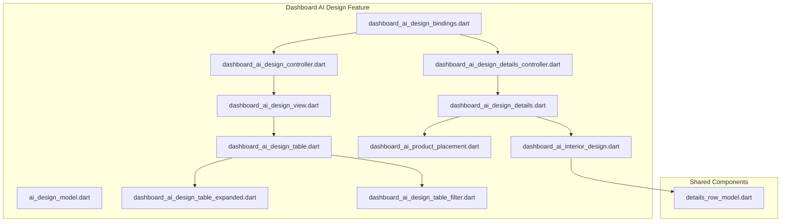

**Diagram sources**
- [dashboard_ai_design_bindings.dart](file://lib/features/dashboard_ai_design/bindings/dashboard_ai_design_bindings.dart)
- [dashboard_ai_design_controller.dart](file://lib/features/dashboard_ai_design/controller/dashboard_ai_design_controller.dart)
- [dashboard_ai_design_details_controller.dart](file://lib/features/dashboard_ai_design/controller/dashboard_ai_design_details_controller.dart)
- [ai_design_model.dart](file://lib/features/dashboard_ai_design/models/ai_design_model.dart)
- [dashboard_ai_design_view.dart](file://lib/features/dashboard_ai_design/views/dashboard_ai_design_view.dart)
- [dashboard_ai_design_details.dart](file://lib/features/dashboard_ai_design/views/dashboard_ai_design_details.dart)
- [dashboard_ai_design_table.dart](file://lib/features/dashboard_ai_design/widgets/dashboard_ai_design_view_widgets/dashboard_ai_design_table.dart)
- [dashboard_ai_design_table_expanded.dart](file://lib/features/dashboard_ai_design/widgets/dashboard_ai_design_view_widgets/dashboard_ai_design_table_expanded.dart)
- [dashboard_ai_design_table_filter.dart](file://lib/features/dashboard_ai_design/widgets/dashboard_ai_design_view_widgets/dashboard_ai_design_table_filter.dart)
- [dashboard_ai_product_placement.dart](file://lib/features/dashboard_ai_design/widgets/dashboard_ai_design_details_widgets/dashboard_ai_product_placement.dart)
- [dashboard_ai_interior_design.dart](file://lib/features/dashboard_ai_design/widgets/dashboard_ai_design_details_widgets/dashboard_ai_interior_design.dart)
- [details_row_model.dart](file://lib/shared/widgets/details_row_model.dart)

**Section sources**
- [main.dart](file://lib/main.dart)
- [dashboard_ai_design_view.dart](file://lib/features/dashboard_ai_design/views/dashboard_ai_design_view.dart)
- [dashboard_ai_design_details.dart](file://lib/features/dashboard_ai_design/views/dashboard_ai_design_details.dart)

## Core Components
This section documents the enhanced controllers, models, and key UI components that implement the dashboard AI design customization and preview functionality.

- DashboardAiDesignController
  - Manages filtering, pagination, and expansion states for design items
  - Provides reactive lists for UI updates with enhanced state management
  - Handles search functionality and category selection with improved user experience
  - Supports dashboard-specific design types including Product Placement and AI Interior Design

- DashboardAiDesignDetailsController
  - Supplies comprehensive customization panel data for interior design customization
  - Defines room categories and customizable attributes with structured data organization
  - Manages multiple customization sections with predefined room details structure

- AiDesignModel
  - Represents individual AI-generated designs with identifiers, types, and metadata
  - Supports both Product Placement and AI Interior Design design types
  - Includes generation date tracking for design history management

- DashboardAiDesignView
  - Displays the list of AI designs with enhanced filtering and pagination
  - Integrates with dashboard-specific UI components for consistent styling
  - Provides drawer navigation and custom app bar with enhanced functionality

- DashboardAiDesignDetails
  - Renders detailed customization interface based on design type with improved layout
  - Switches between product placement and interior design customization views seamlessly
  - Features dedicated preview area with AI-generated result display

- DashboardAiDesignTable
  - Builds a paginated, expandable table of designs with enhanced functionality
  - Supports per-row expansion for detailed actions with improved user interaction
  - Integrates with dashboard-specific filter components for better design management

- DashboardAiDesignTableExpanded
  - Provides detailed design information display with enhanced formatting
  - Includes action buttons for design management with improved user experience
  - Displays design metadata with consistent dashboard styling

- DashboardAiDesignTableFilter
  - Implements category-based filtering with enhanced dropdown interface
  - Provides search functionality with integrated text input field
  - Supports dashboard-specific styling and user interaction patterns

- DashboardAiProductPlacement
  - Implements advanced customization controls for product placement scenarios
  - Includes room selection with enhanced dropdown interface
  - Features horizontal item picker with multiple customization options and improved UX

- DashboardAiInteriorDesign
  - Implements comprehensive customization panels for interior design
  - Uses DetailsRowModel for structured customization rows with enhanced organization
  - Supports multiple customization sections with predefined room categories

**Section sources**
- [dashboard_ai_design_controller.dart](file://lib/features/dashboard_ai_design/controller/dashboard_ai_design_controller.dart)
- [dashboard_ai_design_details_controller.dart](file://lib/features/dashboard_ai_design/controller/dashboard_ai_design_details_controller.dart)
- [ai_design_model.dart](file://lib/features/dashboard_ai_design/models/ai_design_model.dart)
- [dashboard_ai_design_view.dart](file://lib/features/dashboard_ai_design/views/dashboard_ai_design_view.dart)
- [dashboard_ai_design_details.dart](file://lib/features/dashboard_ai_design/views/dashboard_ai_design_details.dart)
- [dashboard_ai_design_table.dart](file://lib/features/dashboard_ai_design/widgets/dashboard_ai_design_view_widgets/dashboard_ai_design_table.dart)
- [dashboard_ai_design_table_expanded.dart](file://lib/features/dashboard_ai_design/widgets/dashboard_ai_design_view_widgets/dashboard_ai_design_table_expanded.dart)
- [dashboard_ai_design_table_filter.dart](file://lib/features/dashboard_ai_design/widgets/dashboard_ai_design_view_widgets/dashboard_ai_design_table_filter.dart)
- [dashboard_ai_product_placement.dart](file://lib/features/dashboard_ai_design/widgets/dashboard_ai_design_details_widgets/dashboard_ai_product_placement.dart)
- [dashboard_ai_interior_design.dart](file://lib/features/dashboard_ai_design/widgets/dashboard_ai_design_details_widgets/dashboard_ai_interior_design.dart)
- [details_row_model.dart](file://lib/shared/widgets/details_row_model.dart)

## Architecture Overview
The dashboard AI design customization follows an enhanced reactive architecture using GetX for state management and navigation. The system provides comprehensive design customization capabilities with improved user interaction patterns and real-time preview functionality.

```mermaid
sequenceDiagram
participant User as "User"
participant View as "DashboardAiDesignView"
participant Table as "DashboardAiDesignTable"
participant Controller as "DashboardAiDesignController"
participant Details as "DashboardAiDesignDetails"
participant Product as "DashboardAiProductPlacement"
participant Interior as "DashboardAiInteriorDesign"
User->>View : Open Dashboard AI Designs
View->>Controller : Access filteredAi
Controller-->>View : Reactive list updates
View->>Table : Render table with enhanced filtering
User->>Table : Tap "View Details"
Table->>Controller : Navigate with model argument
Controller-->>Details : Pass AiDesignModel
Details->>Product : If type == "Product Placement"
Details->>Interior : If type == "AI Interior Design"
User->>Details : Adjust customization parameters
Details-->>Details : Update preview area with enhanced UI
```

**Diagram sources**
- [dashboard_ai_design_view.dart](file://lib/features/dashboard_ai_design/views/dashboard_ai_design_view.dart)
- [dashboard_ai_design_table.dart](file://lib/features/dashboard_ai_design/widgets/dashboard_ai_design_view_widgets/dashboard_ai_design_table.dart)
- [dashboard_ai_design_controller.dart](file://lib/features/dashboard_ai_design/controller/dashboard_ai_design_controller.dart)
- [dashboard_ai_design_details.dart](file://lib/features/dashboard_ai_design/views/dashboard_ai_design_details.dart)
- [dashboard_ai_product_placement.dart](file://lib/features/dashboard_ai_design/widgets/dashboard_ai_design_details_widgets/dashboard_ai_product_placement.dart)
- [dashboard_ai_interior_design.dart](file://lib/features/dashboard_ai_design/widgets/dashboard_ai_design_details_widgets/dashboard_ai_interior_design.dart)

## Detailed Component Analysis

### DashboardAiDesignController
- Responsibilities
  - Maintains category filters and selection state with enhanced functionality
  - Filters AI design list based on category with improved performance
  - Tracks expansion states for table rows with optimized memory usage
  - Manages pagination state with configurable page sizes
- State Management
  - Uses Rx<T> types for reactive updates with enhanced performance
  - Expands list initialization on filtered list changes with lazy loading
- Data Flow
  - filteredAi computed list drives table rendering with improved responsiveness
  - Expansion toggles update per-row visibility with smooth animations

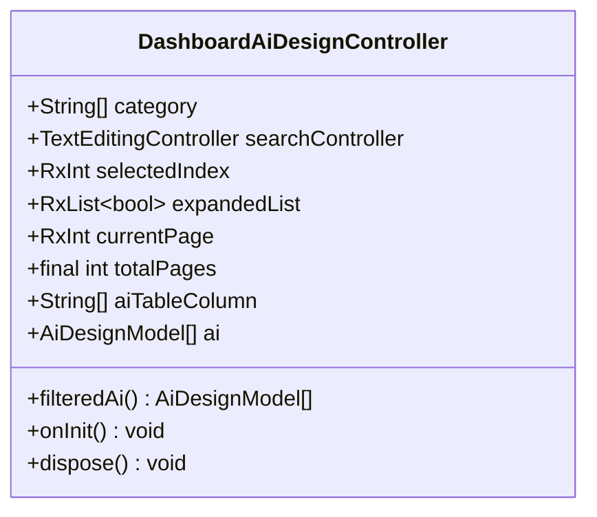

**Diagram sources**
- [dashboard_ai_design_controller.dart](file://lib/features/dashboard_ai_design/controller/dashboard_ai_design_controller.dart)

**Section sources**
- [dashboard_ai_design_controller.dart](file://lib/features/dashboard_ai_design/controller/dashboard_ai_design_controller.dart)

### DashboardAiDesignDetailsController
- Responsibilities
  - Supplies comprehensive room customization data for interior design with structured organization
  - Defines section titles and customizable attributes with predefined categories
  - Manages multiple customization sections with enhanced data management
- Data Structure
  - roomDetails: nested list of customization entries with enhanced organization
  - roomTitle: section headers for customization panels with improved categorization

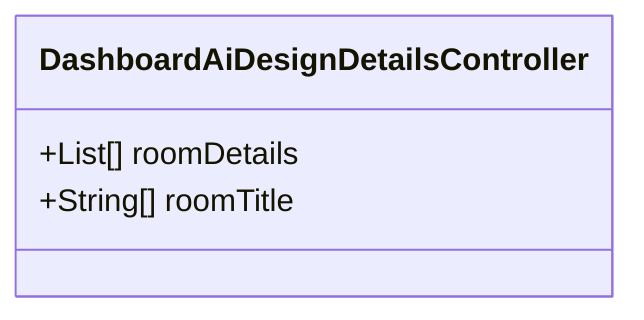

**Diagram sources**
- [dashboard_ai_design_details_controller.dart](file://lib/features/dashboard_ai_design/controller/dashboard_ai_design_details_controller.dart)

**Section sources**
- [dashboard_ai_design_details_controller.dart](file://lib/features/dashboard_ai_design/controller/dashboard_ai_design_details_controller.dart)

### AiDesignModel
- Data Model
  - Immutable design record with identifier, type, and generation date
  - Supports both Product Placement and AI Interior Design design types
  - Includes generation date tracking for design history management

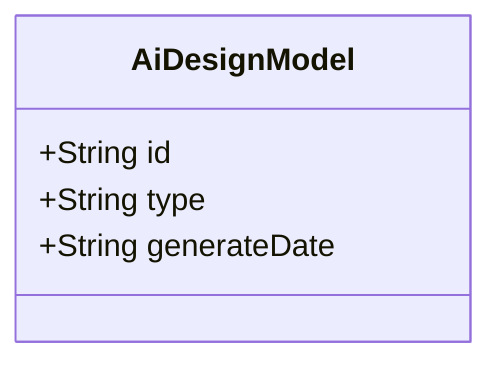

**Diagram sources**
- [ai_design_model.dart](file://lib/features/dashboard_ai_design/models/ai_design_model.dart)

**Section sources**
- [ai_design_model.dart](file://lib/features/dashboard_ai_design/models/ai_design_model.dart)

### DashboardAiDesignView
- Layout
  - Customizable container with enhanced app bar, title, table, and pagination
  - Integrates with dashboard-specific UI components for consistent styling
  - Provides drawer navigation with improved user experience
- Navigation
  - Opens drawer via dialog with enhanced animation
  - Navigates to details view with model argument and improved routing
- Integration
  - Uses shared components for consistent UI with dashboard styling

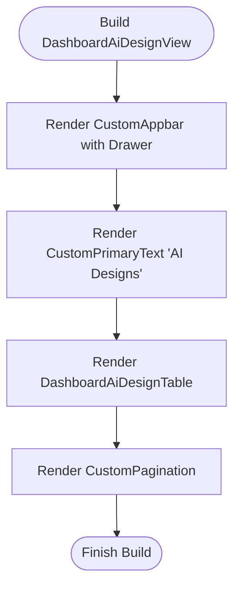

**Diagram sources**
- [dashboard_ai_design_view.dart](file://lib/features/dashboard_ai_design/views/dashboard_ai_design_view.dart)

**Section sources**
- [dashboard_ai_design_view.dart](file://lib/features/dashboard_ai_design/views/dashboard_ai_design_view.dart)

### DashboardAiDesignDetails
- Layout
  - Back button, title, customization panels, and enhanced preview area
  - Conditional rendering with improved user experience
  - Dedicated preview area with AI-generated result display
- Conditional Rendering
  - Switches between product placement and interior design panels seamlessly
  - Enhanced layout with improved spacing and visual hierarchy
- Preview Area
  - Dedicated container displaying AI-generated result with enhanced styling
  - Improved image handling with better aspect ratio management

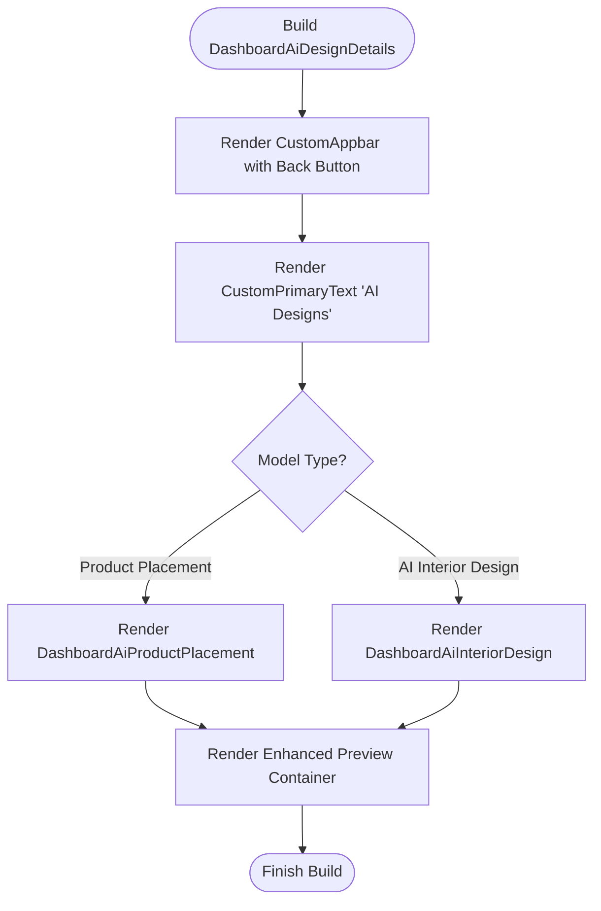

**Diagram sources**
- [dashboard_ai_design_details.dart](file://lib/features/dashboard_ai_design/views/dashboard_ai_design_details.dart)
- [dashboard_ai_product_placement.dart](file://lib/features/dashboard_ai_design/widgets/dashboard_ai_design_details_widgets/dashboard_ai_product_placement.dart)
- [dashboard_ai_interior_design.dart](file://lib/features/dashboard_ai_design/widgets/dashboard_ai_design_details_widgets/dashboard_ai_interior_design.dart)

**Section sources**
- [dashboard_ai_design_details.dart](file://lib/features/dashboard_ai_design/views/dashboard_ai_design_details.dart)

### DashboardAiDesignTable
- Functionality
  - Filters designs based on category selection with enhanced performance
  - Renders expandable rows with action buttons and improved user interaction
  - Navigates to details view with model argument and enhanced routing
- State Updates
  - Toggles expansion state per row with smooth animations
  - Uses Obx for reactive UI updates with optimized performance
- Integration
  - Works with dashboard-specific filter components for better design management
  - Supports enhanced table functionality with improved user experience

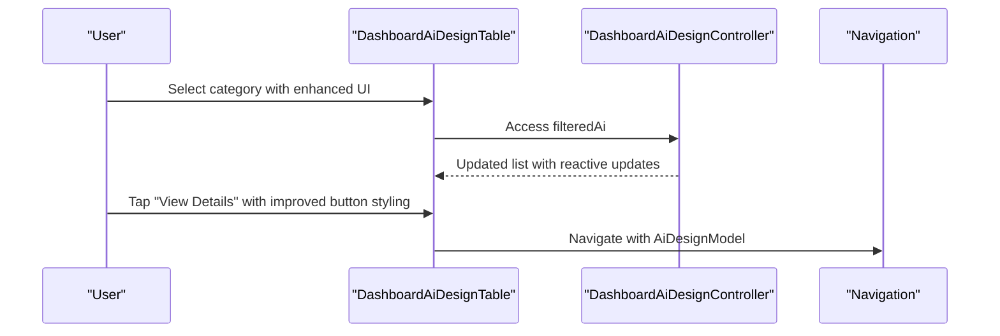

**Diagram sources**
- [dashboard_ai_design_table.dart](file://lib/features/dashboard_ai_design/widgets/dashboard_ai_design_view_widgets/dashboard_ai_design_table.dart)
- [dashboard_ai_design_controller.dart](file://lib/features/dashboard_ai_design/controller/dashboard_ai_design_controller.dart)

**Section sources**
- [dashboard_ai_design_table.dart](file://lib/features/dashboard_ai_design/widgets/dashboard_ai_design_view_widgets/dashboard_ai_design_table.dart)

### DashboardAiDesignTableExpanded
- Functionality
  - Provides detailed design information display with enhanced formatting
  - Includes action buttons for design management with improved styling
  - Displays design metadata with consistent dashboard styling
- Layout
  - Column-based layout with proper spacing and alignment
  - Enhanced typography with improved readability
- Integration
  - Works seamlessly with dashboard-specific design table components
  - Provides consistent user experience across all design types

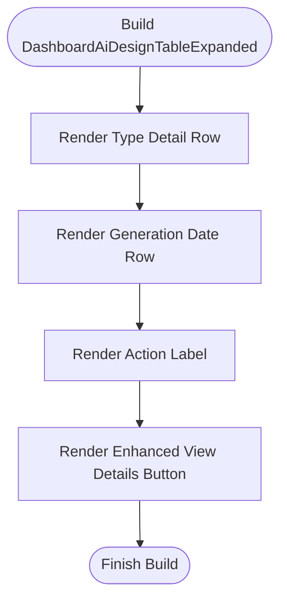

**Diagram sources**
- [dashboard_ai_design_table_expanded.dart](file://lib/features/dashboard_ai_design/widgets/dashboard_ai_design_view_widgets/dashboard_ai_design_table_expanded.dart)

**Section sources**
- [dashboard_ai_design_table_expanded.dart](file://lib/features/dashboard_ai_design/widgets/dashboard_ai_design_view_widgets/dashboard_ai_design_table_expanded.dart)

### DashboardAiDesignTableFilter
- Functionality
  - Implements category-based filtering with enhanced dropdown interface
  - Provides search functionality with integrated text input field
  - Supports dashboard-specific styling and user interaction patterns
- UI Components
  - CustomTableFilter with enhanced dropdown styling
  - CustomTextFormField with improved search functionality
  - Integrated layout with proper spacing and alignment
- State Management
  - Uses Obx for reactive UI updates with optimized performance
  - Manages selection state with enhanced user feedback

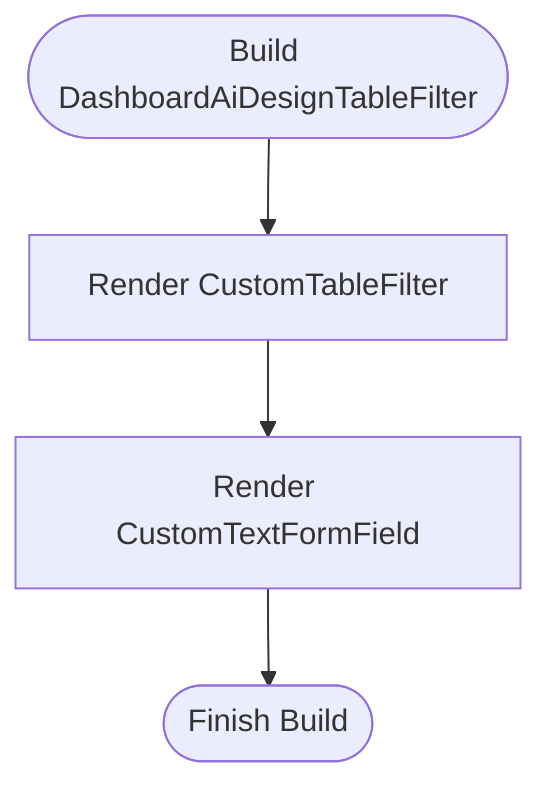

**Diagram sources**
- [dashboard_ai_design_table_filter.dart](file://lib/features/dashboard_ai_design/widgets/dashboard_ai_design_view_widgets/dashboard_ai_design_table_filter.dart)

**Section sources**
- [dashboard_ai_design_table_filter.dart](file://lib/features/dashboard_ai_design/widgets/dashboard_ai_design_view_widgets/dashboard_ai_design_table_filter.dart)

### DashboardAiProductPlacement
- Customization Controls
  - Room selection with enhanced dropdown interface
  - Horizontal item picker with multiple customization options and improved UX
  - Enhanced layout with better spacing and visual hierarchy
- Styling
  - Responsive typography and spacing with dashboard-specific styling
  - Dark/light theme-aware colors with improved accessibility
  - Enhanced container styling with proper borders and shadows
- Functionality
  - Horizontal scrolling item picker with infinite scroll capability
  - Enhanced item selection with visual feedback
  - Improved layout with better alignment and spacing

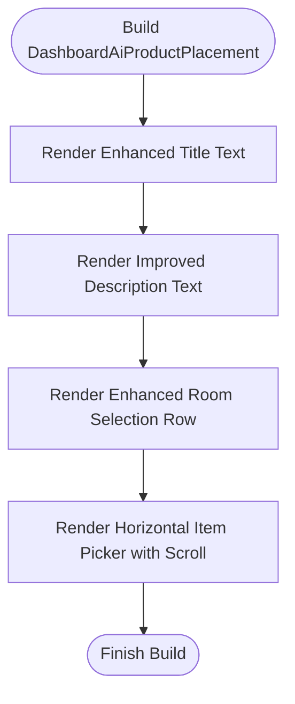

**Diagram sources**
- [dashboard_ai_product_placement.dart](file://lib/features/dashboard_ai_design/widgets/dashboard_ai_design_details_widgets/dashboard_ai_product_placement.dart)

**Section sources**
- [dashboard_ai_product_placement.dart](file://lib/features/dashboard_ai_design/widgets/dashboard_ai_design_details_widgets/dashboard_ai_product_placement.dart)

### DashboardAiInteriorDesign
- Customization Panels
  - Iterates over roomDetails to render grouped customization rows with enhanced organization
  - Uses DetailsRowModel for consistent row layout with improved styling
  - Supports multiple customization sections with predefined room categories
- Theming
  - Adapts text and background colors to current theme with enhanced contrast
  - Improves visual hierarchy with better spacing and typography
- Layout
  - Column-based layout with proper section separation
  - Enhanced typography with improved readability and visual appeal
- Functionality
  - Dynamic section rendering with proper spacing management
  - Enhanced DetailsRowModel integration with improved customization options

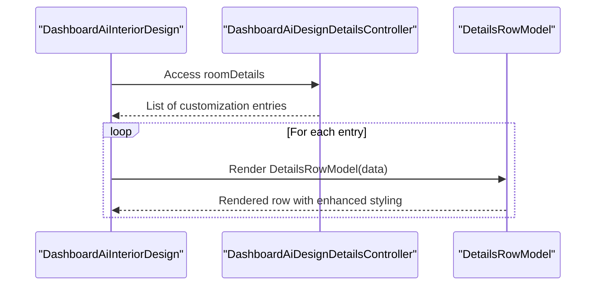

**Diagram sources**
- [dashboard_ai_interior_design.dart](file://lib/features/dashboard_ai_design/widgets/dashboard_ai_design_details_widgets/dashboard_ai_interior_design.dart)
- [details_row_model.dart](file://lib/shared/widgets/details_row_model.dart)

**Section sources**
- [dashboard_ai_interior_design.dart](file://lib/features/dashboard_ai_design/widgets/dashboard_ai_design_details_widgets/dashboard_ai_interior_design.dart)

## Dependency Analysis
The dashboard AI design feature integrates with shared components and follows an enhanced layered architecture:
- Controllers depend on models and shared UI components with improved modularity
- Views depend on controllers and widgets with enhanced separation of concerns
- Widgets depend on shared components for consistent styling with better reusability

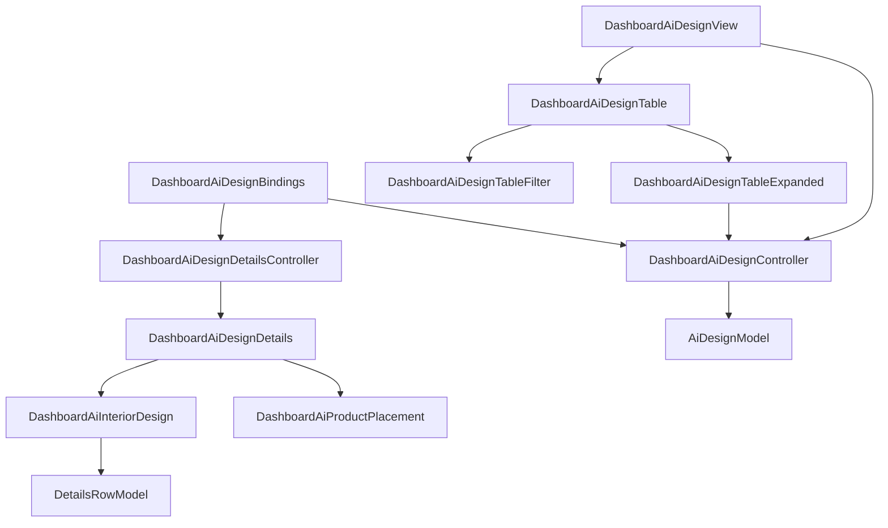

**Diagram sources**
- [dashboard_ai_design_bindings.dart](file://lib/features/dashboard_ai_design/bindings/dashboard_ai_design_bindings.dart)
- [dashboard_ai_design_controller.dart](file://lib/features/dashboard_ai_design/controller/dashboard_ai_design_controller.dart)
- [dashboard_ai_design_details_controller.dart](file://lib/features/dashboard_ai_design/controller/dashboard_ai_design_details_controller.dart)
- [ai_design_model.dart](file://lib/features/dashboard_ai_design/models/ai_design_model.dart)
- [dashboard_ai_design_view.dart](file://lib/features/dashboard_ai_design/views/dashboard_ai_design_view.dart)
- [dashboard_ai_design_details.dart](file://lib/features/dashboard_ai_design/views/dashboard_ai_design_details.dart)
- [dashboard_ai_design_table.dart](file://lib/features/dashboard_ai_design/widgets/dashboard_ai_design_view_widgets/dashboard_ai_design_table.dart)
- [dashboard_ai_design_table_expanded.dart](file://lib/features/dashboard_ai_design/widgets/dashboard_ai_design_view_widgets/dashboard_ai_design_table_expanded.dart)
- [dashboard_ai_design_table_filter.dart](file://lib/features/dashboard_ai_design/widgets/dashboard_ai_design_view_widgets/dashboard_ai_design_table_filter.dart)
- [dashboard_ai_product_placement.dart](file://lib/features/dashboard_ai_design/widgets/dashboard_ai_design_details_widgets/dashboard_ai_product_placement.dart)
- [dashboard_ai_interior_design.dart](file://lib/features/dashboard_ai_design/widgets/dashboard_ai_design_details_widgets/dashboard_ai_interior_design.dart)
- [details_row_model.dart](file://lib/shared/widgets/details_row_model.dart)

**Section sources**
- [dashboard_ai_design_bindings.dart](file://lib/features/dashboard_ai_design/bindings/dashboard_ai_design_bindings.dart)
- [dashboard_ai_design_controller.dart](file://lib/features/dashboard_ai_design/controller/dashboard_ai_design_controller.dart)
- [dashboard_ai_design_details_controller.dart](file://lib/features/dashboard_ai_design/controller/dashboard_ai_design_details_controller.dart)
- [dashboard_ai_design_view.dart](file://lib/features/dashboard_ai_design/views/dashboard_ai_design_view.dart)
- [dashboard_ai_design_details.dart](file://lib/features/dashboard_ai_design/views/dashboard_ai_design_details.dart)

## Performance Considerations
- Reactive Updates
  - Use Rx<T> types for efficient UI updates without rebuilding entire subtrees
  - Enhanced performance with optimized reactive state management
- Lazy Loading
  - Consider virtualizing long lists (item picker) to reduce memory usage
  - Implement lazy loading for large design collections
- Computed Properties
  - filteredAi computation triggers only when dependent state changes
  - Enhanced performance with optimized dependency tracking
- Expansion States
  - Keep expansion arrays sized to filtered list length to avoid unnecessary allocations
  - Improved memory management with proper state initialization
- Widget Optimization
  - Use const constructors for immutable widgets to improve performance
  - Implement proper widget caching and reuse strategies

## Troubleshooting Guide
- Category Filtering Not Working
  - Verify selectedIndex updates and filteredAi computation
  - Confirm category list matches model types with enhanced validation
- Expansion State Issues
  - Ensure expandedList is initialized with the same length as filteredAi
  - Check onExpand callbacks update the correct index with proper error handling
- Navigation Failures
  - Validate route names and argument passing for model instances
  - Confirm Get.toNamed usage with proper arguments and enhanced error handling
- Preview Not Updating
  - Ensure customization widgets trigger rebuilds via reactive state
  - Verify preview container references updated data sources with proper state management
- Dashboard Integration Issues
  - Verify dashboard-specific bindings are properly registered
  - Check controller initialization and dependency injection with enhanced lifecycle management
- Widget Rendering Problems
  - Ensure proper widget tree construction with enhanced error boundaries
  - Verify proper use of GetX widgets and reactive state management

**Section sources**
- [dashboard_ai_design_controller.dart](file://lib/features/dashboard_ai_design/controller/dashboard_ai_design_controller.dart)
- [dashboard_ai_design_details.dart](file://lib/features/dashboard_ai_design/views/dashboard_ai_design_details.dart)

## Conclusion
The dashboard AI design customization and preview feature represents a comprehensive enhancement of the original implementation, leveraging a clean separation of concerns with reactive controllers, reusable widgets, and shared UI components. The enhanced architecture supports dynamic filtering, expandable details, and conditional customization panels tailored to product placement and interior design scenarios. 

Key improvements include enhanced user interaction capabilities, improved state management through GetX with better performance optimization, modular widget composition promoting maintainability and scalability, and dashboard-specific styling integration. The system now provides a more intuitive and responsive customization experience with real-time preview updates and comprehensive design management capabilities.

The modular structure allows for easy extension and maintenance, while the enhanced reactive architecture ensures optimal performance and user experience across all design customization scenarios.